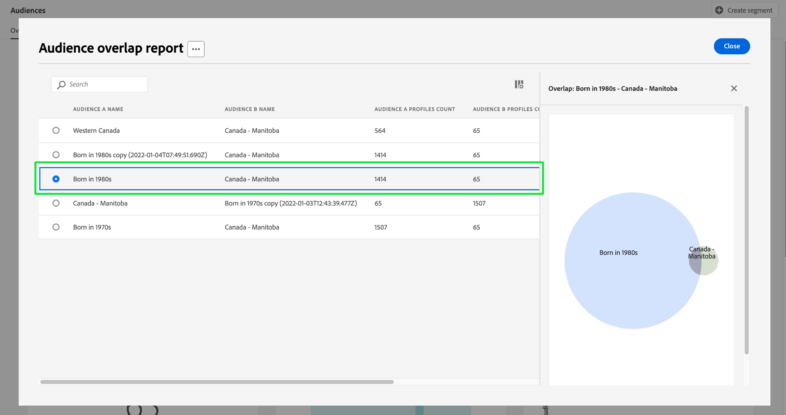

# [!UICONTROL Tipi di pubblico] dashboard {#audiences-dashboard}

L’interfaccia utente di Adobe Experience Platform fornisce una dashboard attraverso la quale puoi visualizzare informazioni importanti sui tipi di pubblico, acquisite durante un’istantanea giornaliera. Questa guida illustra come accedere e utilizzare [!UICONTROL Tipi di pubblico] nell’interfaccia utente e fornisce ulteriori informazioni sulle visualizzazioni visualizzate nel dashboard.

Per una panoramica di tutte le funzioni del servizio di segmentazione di Adobe Experience Platform nell’interfaccia utente di Platform, visita [Guida dell’interfaccia utente di Segmentation Service](../../segmentation/ui/overview.md).

## [!UICONTROL Tipi di pubblico] dati dashboard

Il [!UICONTROL Tipi di pubblico] Nel dashboard viene visualizzata un’istantanea dei dati attributo (record) di cui dispone la tua organizzazione nell’archivio profili di Experienci Platform. Lo snapshot non include dati di eventi (serie temporali).

I dati attributo nello snapshot mostrano i dati esattamente come vengono visualizzati nel momento specifico in cui lo snapshot è stato creato. In altre parole, l&#39;istantanea non è un&#39;approssimazione o un campione dei dati e [!UICONTROL Tipi di pubblico] il dashboard non viene aggiornato in tempo reale.

>[!NOTE]
>
>Eventuali modifiche o aggiornamenti apportati ai dati dal momento in cui è stata acquisita l’istantanea non verranno riflessi nel dashboard fino all’acquisizione dell’istantanea successiva.

## Esplora [!UICONTROL Tipi di pubblico] dashboard {#explore}

Per passare al [!UICONTROL Tipi di pubblico] nell’interfaccia utente di Platform, seleziona **[!UICONTROL Tipi di pubblico]** nella barra a sinistra, seleziona quindi **[!UICONTROL Panoramica]** per visualizzare il dashboard.

>[!NOTE]
>
>Se la tua organizzazione non utilizza ancora Platform e non dispone ancora di set di dati di profilo attivi o criteri di unione creati, il [!UICONTROL Tipi di pubblico] dashboard non visibile. Al contrario, [!UICONTROL Panoramica] Nella scheda vengono visualizzati collegamenti e documentazione per aiutarti a iniziare a utilizzare la segmentazione.

![Il [!UICONTROL Tipi di pubblico] dashboard [!UICONTROL Panoramica] scheda con [!UICONTROL Tipi di pubblico] e [!UICONTROL Panoramica] evidenziato.](../images/audiences/dashboard-overview.png)

### Modifica il [!UICONTROL Tipi di pubblico] dashboard {#modify}

È possibile modificare l&#39;aspetto del [!UICONTROL Tipi di pubblico] dashboard selezionando **[!UICONTROL Modifica dashboard]**. Questo consente di spostare, aggiungere e rimuovere widget dal dashboard, nonché di accedere al **[!UICONTROL Libreria widget]** per esplorare i widget disponibili e creare widget personalizzati per la tua organizzazione.

Consulta la sezione [modifica delle dashboard](../customize/modify.md) e [Panoramica della libreria dei widget](../customize/widget-library.md) per ulteriori informazioni.

### Aggiungi widget {#add-widget}

Seleziona **[!UICONTROL Aggiungi widget]** per passare alla libreria widget e visualizzare un elenco dei widget disponibili da aggiungere al dashboard.

![Il [!UICONTROL Tipi di pubblico] panoramica della dashboard con [!UICONTROL Aggiungi widget] evidenziato.](../images/audiences/audiences-overview-add-widget.png)

Dalla libreria dei widget, puoi sfogliare la selezione di widget di pubblico standard e personalizzati. Per informazioni su come aggiungere widget, consulta la documentazione della libreria di widget su come [aggiungi un widget](../customize/widget-library.md#add-widgets).

### Visualizza SQL {#view-sql}

Puoi visualizzare il codice SQL che genera le informazioni visualizzate sul tuo dashboard con un interruttore [!UICONTROL Panoramica] Workspace. Puoi trarre ispirazione dall’SQL delle informazioni esistenti per creare nuove query che derivano informazioni univoche dai dati di Platform in base alle esigenze aziendali. Per ulteriori informazioni su questa funzione, consulta [Visualizza la guida dell’interfaccia utente SQL](../view-sql.md).

## Selezionare un pubblico {#select-audience}

Il dashboard seleziona automaticamente un pubblico da visualizzare. Tuttavia, puoi modificare il pubblico utilizzando il menu a discesa o il selettore del pubblico.

Per scegliere un pubblico diverso, seleziona il menu a discesa accanto al nome del pubblico oppure utilizza il selettore del pubblico per aprire la finestra di dialogo di selezione del pubblico.

>[!IMPORTANT]
>
>Nell’elenco dei tipi di pubblico selezionabili vengono visualizzati solo i tipi di pubblico con un conteggio di profili superiore a zero.

![Il [!UICONTROL Seleziona pubblico] finestra di dialogo che visualizza tutti i tipi di pubblico disponibili.](../images/audiences/select-audience-dialog.png)

## Widget e metriche {#widgets-and-metrics}

Il [!UICONTROL Tipi di pubblico] la dashboard è composta da widget, metriche di sola lettura che forniscono informazioni importanti sul pubblico selezionato.

La data e l&#39;ora dell&#39;istantanea più recente vengono visualizzate nella parte superiore della [!UICONTROL Panoramica] accanto al menu a discesa del pubblico. Tutti i dati del widget sono accurati a partire da quella data e ora. Il timestamp dell’istantanea viene fornito in UTC; non si trova nel fuso orario del singolo utente o organizzazione.

## Widget predefiniti {#default-widgets}

Per tutte le nuove istanze di Adobe Experience Platform viene fornito un widget predefinito che evidenzia le informazioni più recenti disponibili dai dati. I seguenti widget sono preconfigurati nella vista dei segmenti fin dall’inizio. Per informazioni complete sullo scopo e la funzione dei widget, consultare le rispettive sezioni.

* [[!UICONTROL Dimensione del pubblico]](#audience-size)
* [[!UICONTROL Tendenza di modifica della dimensione del pubblico]](#audience-size-change-trend)
* [[!UICONTROL Sovrapposizione di identità]](#identity-overlap)
* [[!UICONTROL Profili per identità]](#profiles-by-identity)

>[!NOTE]
>
>Dal 26 luglio 2023, [!UICONTROL Profili], [!UICONTROL Tipi di pubblico], e [!UICONTROL Destinazioni] Le dashboard Panoramica sono state reimpostate su un nuovo widget predefinito per tutti gli utenti che non hanno modificato le proprie visualizzazioni nei sei mesi precedenti.
>Consulta la documentazione in [Profili](./profiles.md#default-widgets) e [Destinazioni](./destinations.md#default-widgets) sezioni di widget predefinite per i dettagli sui widget inclusi come parte dei caricamenti di widget predefiniti. Puoi continuare a personalizzare i widget del dashboard come prima.

## Widget di IA per l’analisi dei clienti {#customer-ai-audiences-widgets}

Customer AI viene utilizzato per generare punteggi di propensione personalizzati, come abbandono e conversione per singoli profili su grande scala. IA per l’analisi dei clienti esegue questa operazione analizzando i dati esistenti dell’evento esperienza del consumatore per prevedere **punteggi di tendenza di abbandono o conversione**. Questi modelli di propensione dei clienti ad alta precisione consentono segmentazione e targeting più precisi. Il [distribuzione dei punteggi](#customer-ai-distribution-of-scores) e [riepilogo punteggio](#customer-ai-scoring-summary) approfondimenti dimostrano la divisione del pubblico. Evidenzia quali profili hanno una propensione elevata/bassa/media e come sono distribuiti nei conteggi dei profili.

* [[!UICONTROL Riepilogo punteggio di AI per l’analisi dei clienti]](#customer-ai-scoring-summary)
* [[!UICONTROL Distribuzione dei punteggi in IA per l’analisi dei clienti]](#customer-ai-distribution-of-scores)

### [!UICONTROL Distribuzione dei punteggi in IA per l’analisi dei clienti] {#customer-ai-distribution-of-scores}

>[!CONTEXTUALHELP]
>id="platform_dashboards_segments_distributionOfScores"
>title="Distribuzione dei punteggi"
>abstract="Questo widget mostra la distribuzione del numero totale di profili in base ai punteggi di propensione, con incrementi del 5%. La distribuzione del conteggio dei profili è determinata dal modello di IA e dal criterio di unione selezionati. Puoi modificare il modello di IA dal menu a discesa sotto il titolo del widget."

Il [!UICONTROL Distribuzione dei punteggi in IA per l’analisi dei clienti] il widget categorizza il numero totale di profili in base ai loro punteggi di propensione. La distribuzione del conteggio dei profili è determinata dal modello di IA e dal criterio di unione selezionato, quindi viene visualizzata con incrementi del 5% che ne indicano la propensione. Il conteggio dei profili viene fornito lungo l’asse Y e i punteggi di propensione vengono forniti lungo l’asse X.

>[!NOTE]
>
>Se la visualizzazione è un punteggio di propensione alla conversione, i punteggi alti sono in verde e quelli bassi in rosso. Se prevedi una propensione all’abbandono, questo viene capovolto, i punteggi alti sono in rosso e i punteggi bassi in verde. Il bucket medio rimane giallo indipendentemente dal tipo di propensione scelto.

Il modello di intelligenza artificiale che determina i punteggi di tendenza viene scelto dal selettore a discesa sotto il titolo del widget. Il menu a discesa contiene un elenco di tutti i modelli di IA per l’analisi dei clienti configurati. Seleziona il modello di intelligenza artificiale appropriato per l’analisi dall’elenco dei modelli disponibili. Se non è disponibile alcun modello di IA per l’analisi dei clienti, un messaggio all’interno del widget indica di configurare almeno un modello di IA per l’analisi dei clienti e fornisce un collegamento ipertestuale alla pagina di configurazione del modello di IA per l’analisi dei clienti. Per istruzioni su, consulta la documentazione di [come configurare un’istanza di Customer AI](../../intelligent-services/customer-ai/user-guide/configure.md).

>[!NOTE]
>
>Seleziona il menu a discesa immediatamente sotto la scheda della panoramica per modificare il criterio di unione che determina quali profili includere nell’analisi. Consulta la sezione su [criteri di unione](#merge-policies) per una breve descrizione o [panoramica dei criteri di unione](../../profile/merge-policies/overview.md) per ulteriori dettagli.

Per passare alla pagina approfondimenti dettagliata per il modello di IA per l’analisi dei clienti selezionato, seleziona **[!UICONTROL Visualizza dettagli modello]**.

![Il dashboard Tipi di pubblico di Experience Platform con [!UICONTROL Distribuzione dei punteggi in IA per l’analisi dei clienti] widget [!UICONTROL Visualizza dettagli modello] evidenziato.](../images/segments/customer-ai-distribution-of-scores.png)

Viene visualizzata la pagina dettagliata Approfondimenti modello.

Ulteriori informazioni su Customer AI sono disponibili sul sito [guida all’interfaccia utente di insights](../../intelligent-services/customer-ai/user-guide/discover-insights.md).

### [!UICONTROL Riepilogo punteggio di AI per l’analisi dei clienti] {#customer-ai-scoring-summary}

>[!CONTEXTUALHELP]
>id="platform_dashboards_segments_scoringSummary"
>title="Riepilogo punteggio"
>abstract="Questo widget mostra il numero totale di profili con punteggio e li categorizza in contenitori a seconda della propensione alta, media e bassa. Il grafico ad anello illustra la composizione proporzionale dei profili totali con propensione alta, media e bassa."

Questo widget visualizza il numero totale di profili valutati e li categorizza in contenitori contenenti propensione alta, media e bassa rispettivamente come verde, giallo e rosso. Un grafico ad anello viene utilizzato per illustrare la composizione proporzionale dei profili totali tra propensione alta, media e bassa rispettivamente come verde, giallo e rosso. Un profilo può avere una propensione elevata superiore a 75, una propensione media compresa tra 25 e 74 e una bassa propensione inferiore a 24. Una legenda indica il codice del colore e le soglie di propensione. I conteggi dei profili per le propensione alta, media e bassa vengono visualizzati in una finestra di dialogo quando il cursore passa sopra la rispettiva sezione del grafico ad anello.

>[!NOTE]
>
>Se la visualizzazione è un punteggio di propensione alla conversione, i punteggi alti sono in verde e quelli bassi in rosso. Se prevedi una propensione all’abbandono, questo viene capovolto, i punteggi alti sono in rosso e i punteggi bassi in verde. Il bucket medio rimane giallo indipendentemente dal tipo di propensione scelto.

Il menu a discesa sotto il titolo del widget fornisce un elenco di tutti i modelli di IA per l’analisi dei clienti configurati. Seleziona il modello di intelligenza artificiale appropriato per l’analisi dall’elenco dei modelli disponibili. Se non è disponibile alcun modello di IA per l’analisi dei clienti, un messaggio all’interno del widget indica di configurare almeno un modello di IA per l’analisi dei clienti e fornisce un collegamento ipertestuale alla pagina di configurazione del modello di IA per l’analisi dei clienti. Consulta la documentazione su [come configurare un’istanza di Customer AI](../../intelligent-services/customer-ai/user-guide/configure.md) per istruzioni dettagliate.

>[!NOTE]
>
>Il numero totale di profili calcolati dipende dal criterio di unione scelto. Per modificare il criterio di unione utilizzato, seleziona il menu a discesa immediatamente sotto la scheda della panoramica. Consulta la sezione su [criteri di unione](#merge-policies) per una breve descrizione o [panoramica dei criteri di unione](../../profile/merge-policies/overview.md) per ulteriori dettagli.

Seleziona **[!UICONTROL Visualizza dettagli modello]** per passare alla pagina approfondimenti dettagliata per il modello di IA per l’analisi dei clienti selezionato. Ulteriori informazioni su Customer AI sono disponibili sul sito [guida all’interfaccia utente di insights](../../intelligent-services/customer-ai/user-guide/discover-insights.md).

## Widget standard {#standard-widgets}

Adobe fornisce più widget standard che puoi utilizzare per visualizzare diverse metriche relative ai tipi di pubblico. Puoi anche creare widget personalizzati da condividere con la tua organizzazione utilizzando [!UICONTROL Libreria widget]. Per ulteriori informazioni sulla creazione di widget personalizzati, leggere [Panoramica della libreria dei widget](../customize/widget-library.md).

Per ulteriori informazioni su ciascuno dei widget standard disponibili, selezionare il nome di un widget dall&#39;elenco seguente:

* [[!UICONTROL Dimensione del pubblico]](#audience-size)
* [[!UICONTROL Ordine di attivazione pubblico]](#audience-activation-order)
* [[!UICONTROL Tendenza delle dimensioni del pubblico]](#audience-size-trend)
* [[!UICONTROL Tendenza di modifica della dimensione del pubblico]](#audience-size-change-trend)
* [[!UICONTROL Tendenza dimensione pubblico per identità]](#audience-size-trend-by-identity)
* [[!UICONTROL Sovrapposizione del pubblico]](#audience-overlap)
* [[!UICONTROL Rapporto di sovrapposizione pubblico]](#audience-overlap-report)
* [[!UICONTROL Sovrapposizione di identità]](#identity-overlap)
* [[!UICONTROL Profili per identità]](#profiles-by-identity)
* [[!UICONTROL Attivazioni pianificate]](#scheduled-activations)

### [!UICONTROL Dimensione del pubblico] {#audience-size}

>[!CONTEXTUALHELP]
>id="platform_dashboards_segments_audiencesize"
>title="Dimensione del pubblico"
>abstract="Questo widget visualizza il numero totale di profili uniti all’interno del pubblico selezionato. Questo numero dipende dal criterio di unione applicato ai dati ed è esatto al momento dello snapshot più recente."

Il **[!UICONTROL Dimensione pubblico]** widget mostra il numero totale di profili uniti nel pubblico selezionato al momento dello scatto dell’istantanea. Questo numero è il risultato dell’applicazione del criterio di unione del pubblico ai dati del profilo per unire i frammenti di profilo e formare un singolo profilo per ogni individuo nel pubblico.

Per ulteriori informazioni su frammenti e profili uniti, consulta [Panoramica del profilo cliente in tempo reale](../../profile/home.md).

![Il [!UICONTROL Tipi di pubblico] panoramica della dashboard con [!UICONTROL Dimensione pubblico] widget evidenziato.](../images/audiences/audience-size.png)

### [!UICONTROL Tendenza delle dimensioni del pubblico] {#audience-size-trend}

>[!CONTEXTUALHELP]
>id="platform_dashboards_segments_audiencesizetrend"
>title="Tendenza delle dimensioni del pubblico"
>abstract="Questo widget fornisce informazioni sul numero totale di profili che soddisfano i criteri di **qualsiasi** definizione del segmento, acquisito durante lo snapshot giornaliero, per gli ultimi 30 giorni, 90 giorni o 12 mesi."

Il **[!UICONTROL Tendenza dimensione pubblico]** Il widget fornisce un’illustrazione del grafico a linee per il numero totale di profili idonei per **qualsiasi** pubblico in un determinato periodo di tempo. La tendenza della dimensione del pubblico può essere visualizzata in periodi di 30 giorni, 90 giorni e 12 mesi. Il periodo di tempo viene scelto da un menu a discesa nel widget. La dimensione del pubblico si riflette sull’asse y e il tempo sull’asse x.

Questo widget include anche il [!UICONTROL Sottotitoli] funzionalità in cui un modello di apprendimento automatico analizza il grafico e i dati del pubblico e genera automaticamente sottotitoli per descrivere le tendenze chiave e gli eventi importanti. Seleziona **[!UICONTROL Sottotitoli]** per aprire la finestra di dialogo sottotitoli automatici.

![Il [!UICONTROL Tipi di pubblico] In panoramica viene visualizzato il widget tendenza dimensione pubblico.](../images/audiences/audience-size-trend-captions.png)

Viene visualizzata la finestra di dialogo Didascalie automatiche che fornisce informazioni approfondite sui dati.

Per ulteriori informazioni sulla valutazione dei tipi di pubblico e su come i profili si qualificano per i tipi di pubblico e su come uscirne, consulta [Documentazione del servizio di segmentazione](../../segmentation/home.md).

### [!UICONTROL Tendenza di modifica della dimensione del pubblico] {#audience-size-change-trend}

Questo widget fornisce un grafico a linee che illustra la differenza nel numero totale di profili idonei per un determinato pubblico tra le istantanee giornaliere più recenti. Il pubblico scelto per l’analisi viene selezionato dal menu a discesa Panoramica. Il periodo di analisi delle tendenze può essere visualizzato in periodi di 30 giorni, 90 giorni e 12 mesi. Il periodo di tempo viene scelto da un menu a discesa nel widget. La dimensione del pubblico si riflette sull’asse y e il tempo sull’asse x.

### [!UICONTROL Tendenza dimensione pubblico per identità] {#audience-size-trend-by-identity}

Questo widget illustra la tendenza delle dimensioni del pubblico per un particolare pubblico in base al tipo di identità scelto dal menu a discesa del widget. Il pubblico utilizzato per l’analisi viene selezionato dal menu a discesa Panoramica. Il periodo di analisi delle tendenze può essere visualizzato in periodi di 30 giorni, 90 giorni e 12 mesi. Il periodo di tempo viene scelto da un menu a discesa nel widget.

### [!UICONTROL Ordine di attivazione pubblico] {#audience-activation-order}

Il [!UICONTROL Ordine di attivazione pubblico] il widget fornisce una tabella a tre colonne che elenca il nome della destinazione, la piattaforma e la data di attivazione del pubblico. L’elenco è ordinato da alto a basso in base all’attualità e può contenere fino a 10 righe.

### [!UICONTROL Sovrapposizione del pubblico] {#audience-overlap}

Questo widget utilizza un diagramma di Venn per visualizzare il numero di persone che corrispondono ai criteri per entrambi i tipi di pubblico. I tipi di pubblico utilizzati per il confronto vengono selezionati dai menu a discesa dei widget. Il numero totale di profili all’interno della definizione del segmento pertinente può essere visualizzato passando il cursore sopra un cerchio o nell’intersezione del diagramma di Venn.

Questo widget consente di ottimizzare la strategia di segmentazione visualizzando le somiglianze nei risultati delle definizioni dei segmenti.

### [!UICONTROL Rapporto di sovrapposizione pubblico] {#audience-overlap-report}

Questo widget tabula i dati di sovrapposizione profilo per un pubblico specifico. Per il pubblico scelto dal menu a discesa nella parte superiore dello schermo viene fornito un elenco di cinque tipi di pubblico, classificati dalla percentuale di sovrapposizione più alta a quella più bassa. Per maggiore chiarezza, il pubblico scelto è elencato in [!UICONTROL NOME DEL PUBBLICO] colonna. L’analisi della sovrapposizione dei tipi di pubblico viene fornita per il secondo pubblico elencato in [!UICONTROL NOME PUBBLICO B] colonna. La sovrapposizione percentuale è indicata nella terza colonna con precisione di dodici cifre decimali.

Il rapporto di sovrapposizione del pubblico consente di creare nuovi tipi di pubblico ad alte prestazioni. Osservare percentuali di sovrapposizione elevate consente di eliminare i tipi di pubblico e impedire l’invio dello stesso pubblico a destinazioni diverse. Inoltre, ti aiutano a identificare informazioni nascoste che potrebbero essere utili per una migliore segmentazione. Una sovrapposizione in percentuale bassa consente di individuare profili univoci da perseguire.

Seleziona **[!UICONTROL Visualizza altro]** per aprire una finestra di dialogo a schermo intero che contiene più dati di sovrapposizione del pubblico.

Il [!UICONTROL Rapporto di sovrapposizione pubblico] viene visualizzata. Questa finestra di dialogo può contenere fino a 50 righe di analisi di sovrapposizione del pubblico suddivise in sei colonne. Seleziona l’icona delle impostazioni () per rimuovere o aggiungere colonne dalla tabella.

>[!NOTE]
>
>Seleziona la **[!UICONTROL Sovrapposizione]** intestazione di colonna per modificare la classificazione dei risultati dal livello più alto a quello più basso o dal livello più basso a quello più alto.

Per scaricare l&#39;intero report in formato PDF, selezionare il menu delle opzioni (**`...`**) seguito da **[!UICONTROL Scarica]**.

Selezionare una riga dal report per aprire un diagramma di Venn dell&#39;analisi di sovrapposizione. Passa il puntatore del mouse su una sezione del diagramma di Venn per visualizzare il conteggio dei profili in una finestra di dialogo.

Seleziona **[!UICONTROL Chiudi]** per tornare al [!UICONTROL Tipi di pubblico] dashboard.

### [!UICONTROL Sovrapposizione di identità] {#identity-overlap}

>[!CONTEXTUALHELP]
>id="platform_dashboards_segments_identityoverlap"
>title="Sovrapposizione di identità"
>abstract="Questo widget mostra la sovrapposizione di profili nel pubblico contenente entrambe le identità selezionate. I cerchi mostrano la dimensione relativa di ogni identità. Il numero di profili contenenti entrambi gli spazi dei nomi è rappresentato dalla sovrapposizione tra i cerchi."

Il **[!UICONTROL Sovrapposizione identità]** Un widget mostra un diagramma di Venn, o diagramma di set, che mostra la sovrapposizione di profili nel pubblico contenenti più identità.

Utilizza i menu a discesa sul widget per selezionare le identità che desideri confrontare. I cerchi visualizzano la dimensione relativa di ciascuna identità scelta, con il numero di profili contenenti entrambi gli spazi dei nomi rappresentato dalla dimensione della sovrapposizione tra i cerchi.

Se un cliente interagisce con il tuo marchio su più di un canale, a quel singolo cliente verranno associate più identità. Questa situazione rende probabile che la tua organizzazione disponga di più profili contenenti frammenti di più identità.

Per ulteriori informazioni sulle identità, visita il [Documentazione del servizio Identity](../../identity-service/home.md).

![Il [!UICONTROL Tipi di pubblico] panoramica del dashboard con widget di sovrapposizione identità evidenziato.](../images/audiences/identity-overlap.png)

### [!UICONTROL Profili per identità] {#profiles-by-identity}

>[!CONTEXTUALHELP]
>id="platform_dashboards_segments_profilesbyidentity"
>title="Profili per identità"
>abstract="Questo widget visualizza il raggruppamento delle identità per ogni profilo unito nel pubblico selezionato."

Il **[!UICONTROL Profili per identità]** il widget mostra il raggruppamento delle identità per ogni profilo unito nel pubblico selezionato. Il numero totale di profili per identità potrebbe essere maggiore del numero totale di profili nel pubblico, perché a un profilo potrebbero essere associate più identità. In altre parole, la somma dei valori mostrati per ogni identità può superare la dimensione totale del pubblico. Questo perché se un cliente interagisce con il tuo marchio su più di un canale, a quel singolo cliente possono essere associate più identità.

Seleziona **[!UICONTROL Sottotitoli]** per aprire la finestra di dialogo sottotitoli automatici.

![Il [!UICONTROL Tipi di pubblico] panoramica della dashboard con l’opzione Profili per widget identità e Didascalie evidenziata.](../images/audiences/profiles-by-identity.png)

Un modello di apprendimento automatico genera automaticamente informazioni sui dati analizzando la distribuzione complessiva e le dimensioni chiave dei dati.

Per ulteriori informazioni sulle identità, visita il [Documentazione del servizio Identity](../../identity-service/home.md).

### Attivazioni pianificate {#scheduled-activations}

Il [!UICONTROL Attivazioni pianificate] Il widget fornisce una vista in forma di tabella delle destinazioni attivate più di recente. La tabella include la piattaforma di destinazione, il nome del flusso di attivazione verso questa destinazione e la data di inizio e di fine dell’attivazione per il pubblico selezionato. Se non è stata specificata una data di fine per l’attivazione, viene visualizzato come [!UICONTROL In corso]. Il pubblico per l’analisi viene selezionato dal menu a discesa nella parte superiore della pagina.

Il widget consente di scoprire subito dove e quando il pubblico viene attivato e rende più trasparenti le attivazioni duplicate o non necessarie. Queste informazioni accumulate evidenziano anche dove sono state escluse eventuali attivazioni.

## Passaggi successivi

Seguendo questo documento dovresti essere in grado di individuare [!UICONTROL Tipi di pubblico] e selezionare un pubblico da visualizzare. Dovresti anche comprendere le metriche visualizzate nei widget disponibili. Per ulteriori informazioni sull’utilizzo dei tipi di pubblico nell’interfaccia utente di Experienci Platform, consulta [Guida dell’interfaccia utente di Segmentation Service](../../segmentation/ui/overview.md).
