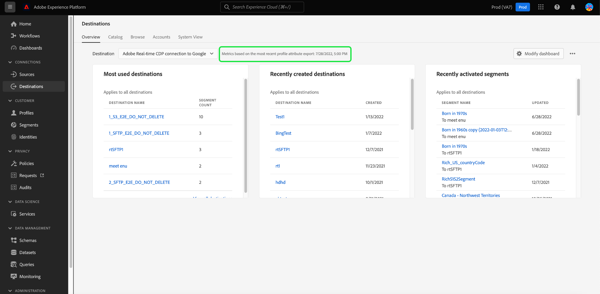
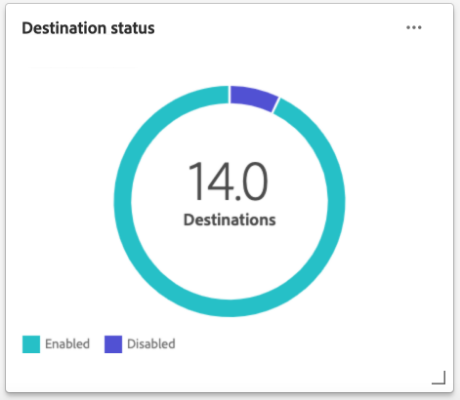
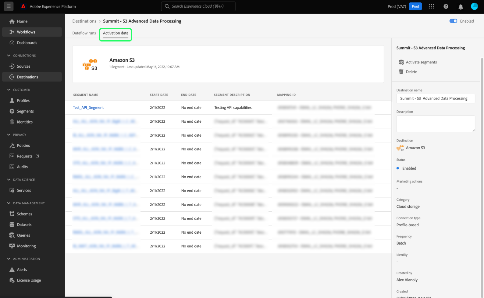

# [!UICONTROL Destinazioni] dashboard

L’interfaccia utente di Adobe Experience Platform fornisce una dashboard attraverso la quale è possibile visualizzare informazioni importanti sulle destinazioni attive dell’organizzazione, acquisite durante un’istantanea giornaliera. Questa guida illustra come accedere e lavorare con il dashboard delle destinazioni nell’interfaccia utente e fornisce ulteriori informazioni sulle metriche visualizzate nel dashboard.

Per una panoramica delle destinazioni e un catalogo di tutte le destinazioni disponibili all&#39;interno dell&#39;Experience Platform, visita [documentazione sulle destinazioni](../../destinations/home.md).

## [!UICONTROL Destinazioni] dati del dashboard {#destinations-dashboard-data}

Nel dashboard Destinazioni viene visualizzata un&#39;istantanea delle destinazioni abilitate dall&#39;organizzazione in Experience Platform. I dati nello snapshot mostrano esattamente come vengono visualizzati nel momento specifico in cui è stata acquisita l&#39;istantanea. In altre parole, lo snapshot non è un&#39;approssimazione o un esempio dei dati e il dashboard delle destinazioni non viene aggiornato in tempo reale.

>[!NOTE]
>
>Eventuali modifiche o aggiornamenti apportati ai dati dall&#39;acquisizione dello snapshot non verranno visualizzati nel dashboard fino all&#39;acquisizione dello snapshot successivo.

## Esplora [!UICONTROL Destinazioni] dashboard {#explore}

Per passare al dashboard delle destinazioni nell’interfaccia utente di Platform, seleziona **[!UICONTROL Destinazioni]** nella barra a sinistra, seleziona la **[!UICONTROL Panoramica]** per visualizzare il dashboard.

La data e l’ora dell’istantanea più recente vengono visualizzate nella parte superiore della [!UICONTROL Panoramica] accanto al menu a discesa di destinazione . Tutti i dati dei widget sono accurati a partire da quella data e ora. La marca temporale dello snapshot è fornita in UTC; non si trova nel fuso orario del singolo utente o organizzazione.

>[!NOTE]
>
>Se la tua organizzazione ha poca esperienza con Experience Platform e non dispone ancora di destinazioni attive, il dashboard Destinazioni e [!UICONTROL Panoramica] non sono visibili. Invece, selezionando [!UICONTROL Destinazioni] nel menu di navigazione a sinistra viene visualizzata la [!UICONTROL Catalogo] scheda . Per ulteriori informazioni sulle [!UICONTROL Catalogo] , fai riferimento alla [[!UICONTROL Destinazioni] guida all’area di lavoro](../../destinations/ui/destinations-workspace.md).

### Modifica la [!UICONTROL Destinazioni] dashboard {#modify}

Seleziona **[!UICONTROL Modifica dashboard]** per modificare l’aspetto del dashboard delle destinazioni. Questo consente di spostare, aggiungere e rimuovere i widget dal dashboard e di accedere alla libreria dei widget. Dalla libreria dei widget, puoi esplorare i widget disponibili e creare widget personalizzati per la tua organizzazione.

Fai riferimento alla [modifica delle dashboard](../customize/modify.md) e [panoramica della libreria widget](../customize/widget-library.md) documentazione per ulteriori informazioni.

### Aggiungi widget {#add-widget}

Seleziona **[!UICONTROL Aggiungi widget]** per passare alla libreria dei widget e visualizzare un elenco dei widget disponibili da aggiungere al dashboard.

Dalla libreria dei widget, puoi selezionare i widget per segmenti standard e personalizzati. Per informazioni su come aggiungere i widget, consulta la documentazione della libreria dei widget su come [aggiungere un widget](../customize/widget-library.md#add-widgets).

## Widget standard {#standard-widgets}

Adobe fornisce diversi widget standard che puoi utilizzare per visualizzare diverse metriche correlate alle destinazioni e valutare la completezza dei segmenti disponibili per l’analisi dei dati. Puoi anche creare widget personalizzati da condividere con la tua organizzazione utilizzando [!UICONTROL Libreria widget]. Per ulteriori informazioni sulla creazione di widget personalizzati, si prega di iniziare leggendo [Panoramica della libreria Widget](../customize/widget-library.md).

Per ulteriori informazioni su ciascuno dei widget standard disponibili, seleziona il nome di un widget dal seguente elenco:

* [[!UICONTROL Destinazioni più utilizzate]](#most-used-destinations)
* [[!UICONTROL Destinazioni create di recente]](#recently-created-destinations)
* [[!UICONTROL Segmenti attivati di recente]](#recently-activated-segments)
* [[!UICONTROL Segmenti attivati di recente per destinazione]](#recently-activated-segments-by-destination)
* [[!UICONTROL Tendenza delle dimensioni del pubblico]](#audience-size-trend)
* [[!UICONTROL Segmenti non mappati per identità]](#unmapped-segments-by-identity)
* [[!UICONTROL Segmenti mappati per identità]](#mapped-segments-by-identity)
* [[!UICONTROL Tipi di pubblico comuni]](#common-audiences)
* [[!UICONTROL Tipi di pubblico mappati]](#mapped-audiences)
* [[!UICONTROL Stato del pubblico mappato]](#mapped-audience-health)
* [[!UICONTROL Conteggio destinazioni]](#destinations-count)
* [[!UICONTROL Stato della destinazione]](#destination-status)
* [[!UICONTROL Destinazioni attive per piattaforma di destinazione]](#active-destinations-by-destination-platform)
* [[!UICONTROL Tipi di pubblico attivati per tutte le destinazioni]](#activated-audiences-across-all-destinations)
* [[!UICONTROL Tipi di pubblico attivati]](#activated-audiences)

### [!UICONTROL Destinazioni più utilizzate] {#most-used-destinations}

>[!CONTEXTUALHELP]
>id="platform_dashboards_destinations_mostuseddestinations"
>title="Destinazioni più utilizzate"
>abstract="Questo widget visualizza le destinazioni più attive della tua organizzazione in base al numero di segmenti mappati. Questi numeri sono precisi al momento dell&#39;ultima istantanea. Questa classificazione fornisce informazioni sulle destinazioni attualmente più utilizzate, evidenziando quelle che potrebbero essere sottoutilizzate."

La **[!UICONTROL Destinazioni più utilizzate]** widget visualizza le principali destinazioni della tua organizzazione in base al numero di segmenti mappati, a partire dall&#39;ultima istantanea. Questa classificazione fornisce informazioni sulle destinazioni che vengono utilizzate, mostrando al contempo quelle che potrebbero essere sottoutilizzate.

Ad esempio, se hai configurato una destinazione ieri ma non hai mappato alcun segmento su di essa, puoi vedere che la destinazione è attualmente sottoutilizzata.

Il numero di segmenti mappati visualizzati nella colonna del conteggio dei segmenti è preciso a partire dall’ultima istantanea giornaliera. La mappatura di un nuovo segmento alla destinazione non aggiornerà il conteggio fino a quando non viene acquisita la successiva istantanea.

Selezionando il nome di una destinazione dall&#39;elenco mostrato sul widget, potrai accedere ai dettagli della destinazione come collegati dal **[!UICONTROL Sfoglia]** scheda . Puoi anche selezionare **[!UICONTROL Visualizza tutto]** per passare al **[!UICONTROL Sfoglia]** , quindi seleziona il nome di una destinazione per visualizzarne i dettagli.

### [!UICONTROL Destinazioni create di recente] {#recently-created-destinations}

>[!CONTEXTUALHELP]
>id="platform_dashboards_destinations_recentlycreateddestinations"
>title="Destinazioni create di recente"
>abstract="Questo widget visualizza un elenco delle destinazioni configurate più di recente all&#39;interno della tua organizzazione."

La **[!UICONTROL Destinazioni create di recente]** widget consente di visualizzare un elenco delle destinazioni configurate più di recente della tua organizzazione.

La data di creazione mostrata corrisponde all’ultima istantanea giornaliera. In altre parole, se crei una nuova destinazione, questa verrà visualizzata nell’elenco solo dopo l’acquisizione dello snapshot successivo.

Selezionando il nome di una destinazione dall&#39;elenco mostrato sul widget, potrai accedere ai dettagli della destinazione come collegati dal **[!UICONTROL Sfoglia]** scheda . Puoi anche selezionare **[!UICONTROL Visualizza tutto]** per passare al **[!UICONTROL Sfoglia]** , quindi seleziona il nome di una destinazione per visualizzarne i dettagli.

Per ulteriori informazioni su come configurare tipi specifici di destinazioni, visita il [documentazione sulle destinazioni](../../destinations/home.md).

### [!UICONTROL Segmenti attivati di recente] {#recently-activated-segments}

>[!CONTEXTUALHELP]
>id="platform_dashboards_destinations_recentlyactivatedsegments"
>title="Segmenti attivati di recente"
>abstract="Questo widget fornisce un elenco dei segmenti mappati più di recente a una destinazione. Questo elenco fornisce un’istantanea dei segmenti e delle destinazioni attivamente utilizzati nel sistema e può essere utile per risolvere eventuali mappature errate."

La **[!UICONTROL Segmenti attivati di recente]** widget fornisce un elenco dei segmenti mappati più di recente a una destinazione. Questo elenco fornisce un’istantanea dei segmenti e delle destinazioni attivamente utilizzati nel sistema e può essere utile per risolvere eventuali mappature errate.

La data aggiornata visualizzata visualizza l’ultima volta che il segmento è stato attivato nella destinazione ed è accurata dell’ultima istantanea giornaliera. In altre parole, se attivi un segmento nella destinazione, la data aggiornata non cambierà fino a quando non viene acquisita la successiva istantanea.

Selezionando il nome di un segmento dall’elenco visualizzato sul widget, passerai ai dettagli del segmento. Puoi anche selezionare **[!UICONTROL Visualizza tutto]** per passare alla scheda di ricerca dei segmenti, quindi selezionare il nome di un segmento per visualizzarne i dettagli.

Per ulteriori informazioni sull’utilizzo dei segmenti in Experience Platform, consulta la [Panoramica del servizio di segmentazione](../../segmentation/home.md).

### [!UICONTROL Segmenti attivati di recente per destinazione] {#recently-activated-segments-by-destination}

>[!CONTEXTUALHELP]
>id="platform_dashboards_destinations_recentlyactivatedsegmentsbydestination"
>title="Segmenti attivati di recente per destinazione"
>abstract="Questo widget visualizza i primi cinque segmenti attivati più di recente in ordine decrescente in base alla destinazione scelta nel menu a discesa della panoramica."

La **[!UICONTROL Segmenti attivati di recente per destinazione]** widget visualizza i primi cinque segmenti attivati più di recente in ordine decrescente in base alla destinazione scelta nel menu a discesa della panoramica. È simile al [!UICONTROL Segmenti attivati di recente] widget, ma i dati visualizzati **only** si applica alla destinazione selezionata.

Questo widget contiene due metriche: il nome del segmento e la data dell’ultima attivazione del segmento nella destinazione. I dati visualizzati sono corretti a partire dall&#39;ultima istantanea giornaliera.

Per visualizzare i dettagli di un segmento, seleziona il nome di un segmento dall’elenco visualizzato.

### [!UICONTROL Tendenza delle dimensioni del pubblico] {#audience-size-trend}

>[!CONTEXTUALHELP]
>id="platform_dashboards_destinations_audiencesizetrend"
>title="Tendenza delle dimensioni del pubblico"
>abstract="Questo widget illustra il numero di profili contenuti nel segmento, che viene inviato quotidianamente all&#39;account di destinazione. Il primo menu a discesa regola il periodo di tempo per la tendenza del pubblico. Il secondo menu a discesa dei widget seleziona il segmento per l’analisi. La destinazione viene scelta dal menu a discesa della panoramica."

La **[!UICONTROL Tendenza delle dimensioni del pubblico]** widget rappresenta la relazione del conteggio di profilo in un periodo di tempo per un segmento mappato a tale account di destinazione. Il widget utilizza un grafico a linee per illustrare il numero di profili contenuti nel segmento, che vengono inviati quotidianamente all’account di destinazione.

È possibile regolare un periodo di tempo per la tendenza del pubblico negli ultimi 30 giorni, 90 giorni o 12 mesi utilizzando il primo menu a discesa.

Il secondo menu a discesa elenca ogni segmento disponibile che può essere inviato all’account di destinazione scelto nella parte superiore del dashboard.

La **[!UICONTROL Tendenza delle dimensioni del pubblico]** widget fornisce un [!UICONTROL Sottotitoli] in alto a destra del widget. Seleziona **[!UICONTROL Sottotitoli]** per aprire la finestra di dialogo didascalie automatiche. Un modello di apprendimento automatico genera automaticamente didascalie per descrivere le tendenze chiave e gli eventi importanti analizzando il grafico e i dati dei segmenti.

### [!UICONTROL Segmenti non mappati per identità] {#unmapped-segments-by-identity}

>[!CONTEXTUALHELP]
>id="platform_dashboards_destinations_unmappedsegmentsbyidentity"
>title="Segmenti non mappati per identità"
>abstract="Questo widget elenca i primi cinque **non mappato** i segmenti sono classificati in base al conteggio delle identità decrescente per una determinata destinazione e identità. Gli ID filtro elencati nel menu a discesa del widget cambiano a seconda dell’account di destinazione selezionato nella parte superiore della pagina della panoramica."

La **[!UICONTROL Segmenti non mappati per identità]** elenchi dei primi cinque **non mappato** i segmenti sono classificati in base al conteggio delle identità decrescente per una determinata destinazione e identità. Evidenzia i segmenti che sono i più vantaggiosi da mappare all’account di destinazione scelto in base all’ID scelto.

Il menu a discesa ID destinazione filtra i segmenti disponibili. Gli ID filtro elencati nel menu a discesa variano a seconda dell’account di destinazione selezionato nella parte superiore della pagina della panoramica.

La colonna identità conta il numero di ID sorgente all’interno del segmento che possono essere mappati sull’ID scelto nel menu a discesa ID widget.

### [!UICONTROL Segmenti mappati per identità] {#mapped-segments-by-identity}

>[!CONTEXTUALHELP]
>id="platform_dashboards_destinations_mappedsegmentsbyidentity"
>title="Segmenti mappati per identità"
>abstract="Questo widget fornisce un elenco dei primi cinque **mappato** segmenti. L’elenco è ordinato da alto a basso in base al numero di ID sorgente contenuti nei segmenti. L&#39;ID di destinazione da conteggiare viene selezionato dal menu a discesa sotto il titolo del widget. Gli ID di destinazione disponibili nel menu a discesa del widget dipendono dalla destinazione scelta nella parte superiore del dashboard della panoramica."

Questo widget fornisce un elenco dei primi cinque **mappato** segmenti. L’elenco è ordinato da alto a basso in base al numero di ID sorgente contenuti nei segmenti. L&#39;ID di destinazione da conteggiare viene selezionato dal menu a discesa sotto il titolo del widget. Gli ID di destinazione disponibili nel menu a discesa nel widget vengono modificati in base al filtro dell’account di destinazione scelto nella parte superiore del dashboard della panoramica.

La **[!UICONTROL Segmenti mappati per identità]** Il widget evidenzia immediatamente la probabilità di riuscire a eseguire il targeting delle opportunità di profilo per una campagna all&#39;interno della destinazione selezionata. Una campagna con targeting efficiente non dipende dal numero di profili inviati alla destinazione, ma dal numero di ID sorgente che probabilmente verranno confrontati con gli ID di destinazione per fornire dati utili e fruibili.

### Tipi di pubblico comuni {#common-audiences}

>[!CONTEXTUALHELP]
>id="platform_dashboards_destinations_commonaudiences"
>title="Tipi di pubblico comuni"
>abstract="Questo widget fornisce un elenco dei primi cinque segmenti attivati nell’account di destinazione scelto nella parte superiore della pagina e della destinazione selezionata nel menu a discesa del widget. L’elenco dei segmenti viene ordinato in base a come sono stati attivati di recente. Il segmento attivato più di recente viene visualizzato nella parte superiore."

La **[!UICONTROL Tipi di pubblico comuni]** widget fornisce un elenco dei primi cinque segmenti attivati nell’account di destinazione selezionato nella parte superiore della pagina e della destinazione selezionata nel menu a discesa del widget. L’elenco dei segmenti viene ordinato in base a come sono stati attivati di recente. Il segmento attivato più di recente viene visualizzato nella parte superiore.

La [!UICONTROL DIMENSIONE DEL PUBBLICO] fornisce il conteggio totale dei profili di ciascun segmento elencato.

### Tipi di pubblico mappati {#mapped-audiences}

La [!UICONTROL Tipi di pubblico mappati] widget visualizza il numero totale di tipi di pubblico mappati che possono essere attivati nella destinazione selezionata nella parte superiore della pagina.

Seleziona **[!UICONTROL Segmenti]** per passare al dashboard Segmenti [!UICONTROL Sfoglia] scheda . In questa area di lavoro viene visualizzato un elenco di tutte le definizioni dei segmenti per la tua organizzazione.

### Stato del pubblico mappato {#mapped-audience-health}

>[!CONTEXTUALHELP]
>id="platform_dashboards_destinations_mappedaudiencehealth"
>title="Stato del pubblico mappato"
>abstract="Questo widget fornisce un elenco di fino a 20 segmenti mappati il cui numero totale di profili si discosta di almeno un fattore di deviazione standard dalla dimensione media del pubblico mappata a tale destinazione nei 30 giorni. Fornisce una metrica calcolata per la dispersione delle dimensioni del pubblico dalla media negli ultimi 30 giorni. Le dimensioni del pubblico sono ordinate da alto a basso."

Il widget fornisce un elenco di fino a 20 segmenti mappati il cui profilo totale conta, a partire dall’ultima istantanea giornaliera, un fattore di almeno una deviazione standard rispetto alla dimensione media del pubblico mappata a tale destinazione nei 30 giorni successivi.

In breve, fornisce una metrica calcolata per la dispersione delle dimensioni del pubblico dalla media negli ultimi 30 giorni. Confronta se la dimensione del pubblico attuale è al di fuori della deviazione standard storica osservata nei dati degli ultimi 30 giorni.

Tutte le dimensioni del pubblico nel sistema vengono ordinate da un pubblico di dimensioni elevate a un pubblico di dimensioni ridotte, come indicato nella [!UICONTROL DIMENSIONE PIÙ RECENTE] colonna.

Se il conteggio del profilo mappato del segmento non corrisponde a una deviazione standard rispetto alla dimensione media del profilo mappato negli ultimi 30 giorni, indica un’anomalia nel sistema e deve essere analizzata.

Se un segmento all’interno di [!UICONTROL Stato del pubblico mappato] Il widget si discosta di un ampio margine, fai riferimento al grafico delle tendenze delle dimensioni del pubblico e individua il segmento anomalo. La tendenza può fornire ulteriori informazioni sullo stato di salute del segmento.

>[!NOTE]
>
>La dimensione predefinita del widget di stato del pubblico mappato può ostruire le informazioni della tabella. Modifica le dimensioni del widget per migliorare la leggibilità dei nomi dei segmenti e dei titoli delle colonne mappati. Per informazioni su come modificare la documentazione delle dashboard, consulta [come ridimensionare un widget](../customize/modify.md).

### [!UICONTROL Conteggio destinazioni] {#destinations-count}

>[!CONTEXTUALHELP]
>id="platform_dashboards_destinations_destinationscount"
>title="Conteggio destinazioni"
>abstract="Questo widget fornisce il numero totale di endpoint disponibili in cui un pubblico può essere attivato e consegnato all&#39;interno del sistema. Questo numero include sia le destinazioni attive che quelle inattive."

La [!UICONTROL Conteggio destinazioni] widget fornisce il numero totale di endpoint disponibili in cui un pubblico può essere attivato e consegnato all&#39;interno del sistema. Questo numero include sia le destinazioni attive che quelle inattive.

Sotto il conteggio totale, seleziona **[!UICONTROL Destinazioni]** per passare alla scheda di ricerca delle destinazioni . In questa pagina sono elencate tutte le destinazioni con le quali hai stabilito una connessione fino ad oggi.

### [!UICONTROL Stato della destinazione] {#destination-status}

La [!UICONTROL Stato della destinazione] widget visualizza il numero totale di destinazioni abilitate come una singola metrica e utilizza un grafico ad anello per illustrare la differenza proporzionale tra destinazioni abilitate e disabilitate.

I singoli conteggi per le destinazioni abilitate o disabilitate vengono visualizzati in una finestra di dialogo quando il cursore passa sopra la rispettiva sezione del grafico ad anello.

### [!UICONTROL Destinazioni attive per piattaforma di destinazione] {#active-destinations-by-destination-platform}

Il widget fornisce una tabella a due colonne per mostrare un elenco di piattaforme di destinazione attive e il numero totale di destinazioni attive per ciascuna piattaforma di destinazione. L’elenco delle piattaforme di destinazione è ordinato da alto a basso.

### [!UICONTROL Tipi di pubblico attivati per tutte le destinazioni] {#activated-audiences-across-all-destinations}

La [!UICONTROL Tipi di pubblico attivati per tutte le destinazioni] widget fornisce il numero totale di tipi di pubblico attivati in tutte le destinazioni in un’unica metrica. Questo numero è preciso rispetto all&#39;istantanea più recente.

Seleziona **[!UICONTROL Tipi di pubblico]** per passare alle destinazioni [!UICONTROL Sfoglia] scheda . Questa pagina fornisce un elenco di tutte le destinazioni abilitate e una varietà di metriche rilevanti. Consulta la documentazione per [ulteriori informazioni [!UICONTROL Sfoglia] scheda](../../destinations/ui/destinations-workspace.md#browse).

### [!UICONTROL Tipi di pubblico attivati] {#activated-audiences}

Questo widget fornisce una singola metrica per il numero totale di tipi di pubblico attivati in una destinazione.

Seleziona **[!UICONTROL Tipi di pubblico]** per passare alla pagina dei dettagli del dashboard delle destinazioni. La [!UICONTROL Dati di attivazione] visualizza un elenco dei segmenti mappati alla destinazione, con la relativa data di inizio e la data di fine (se applicabile), e altre informazioni rilevanti per l’esportazione dei dati, ad esempio tipo di esportazione, pianificazione e frequenza. Per visualizzare i dettagli di un particolare segmento, selezionane il nome dall’elenco.

Questo widget ti aiuta a capire il valore delle destinazioni in base al numero di tipi di pubblico attivati a colpo d&#39;occhio. Offre inoltre un facile accesso a informazioni più dettagliate per ulteriori analisi.

## Passaggi successivi

Seguendo questo documento, ora dovresti essere in grado di individuare il dashboard delle destinazioni e comprendere le metriche visualizzate nei widget disponibili. Per ulteriori informazioni sull’utilizzo delle destinazioni nell’Experience Platform, consulta [documentazione sulle destinazioni](../../destinations/home.md).
