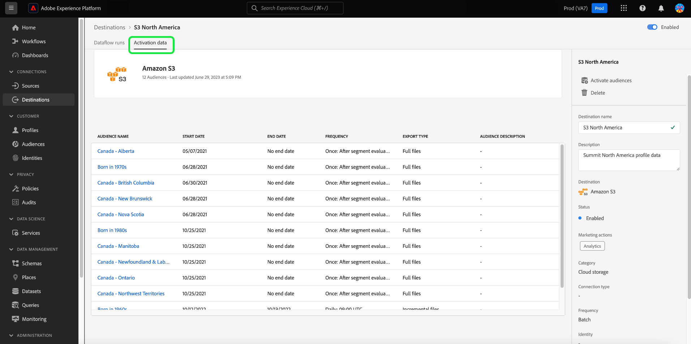

# [!UICONTROL Destinazioni] dashboard

L’interfaccia utente di Adobe Experience Platform fornisce una dashboard attraverso la quale è possibile visualizzare informazioni importanti sulle destinazioni attive dell’organizzazione, acquisite durante uno snapshot giornaliero. Questa guida illustra come accedere e lavorare con il dashboard delle destinazioni nell’interfaccia utente di e fornisce ulteriori informazioni sulle metriche visualizzate nel dashboard.

Per una panoramica delle destinazioni e un catalogo di tutte le destinazioni disponibili in Experience Platform, visita il [documentazione sulle destinazioni](../../destinations/home.md).

## [!UICONTROL Destinazioni] dati dashboard {#destinations-dashboard-data}

Nel dashboard Destinazioni viene visualizzata un’istantanea delle destinazioni abilitate dalla tua organizzazione in Experience Platform. I dati nello snapshot mostrano esattamente come vengono visualizzati nel momento specifico in cui lo snapshot è stato creato. In altre parole, l’istantanea non è un’approssimazione o un esempio dei dati e il dashboard delle destinazioni non viene aggiornato in tempo reale.

>[!NOTE]
>
>Eventuali modifiche o aggiornamenti apportati ai dati dal momento in cui è stata acquisita l’istantanea non verranno riflessi nel dashboard fino all’acquisizione dell’istantanea successiva.

## Esplora [!UICONTROL Destinazioni] dashboard {#explore}

Per passare al dashboard delle destinazioni nell’interfaccia utente di Platform, seleziona **[!UICONTROL Destinazioni]** nella barra a sinistra, seleziona quindi **[!UICONTROL Panoramica]** per visualizzare il dashboard.

La data e l&#39;ora dell&#39;istantanea più recente vengono visualizzate nella parte superiore della [!UICONTROL Panoramica] accanto al menu a discesa destinazione. Tutti i dati del widget sono accurati a partire da quella data e ora. Il timestamp dell’istantanea viene fornito in UTC; non si trova nel fuso orario del singolo utente o organizzazione.

>[!NOTE]
>
>Se la tua organizzazione ha poca esperienza con Experience Platform e non dispone ancora di destinazioni attive, il dashboard Destinazioni e [!UICONTROL Panoramica] non sono visibili. Invece, selezionando [!UICONTROL Destinazioni] dalla barra di navigazione a sinistra viene visualizzata la [!UICONTROL Catalogo] scheda. Per ulteriori informazioni su [!UICONTROL Catalogo] , fare riferimento alla scheda [[!UICONTROL Destinazioni] guida di workspace](../../destinations/ui/destinations-workspace.md).

### Modifica il [!UICONTROL Destinazioni] dashboard {#modify}

Seleziona **[!UICONTROL Modifica dashboard]** per modificare l’aspetto del dashboard destinazioni. Questo consente di spostare, aggiungere e rimuovere widget dal dashboard, nonché di accedere alla libreria di widget. Dalla libreria dei widget, puoi esplorare i widget disponibili e creare widget personalizzati per la tua organizzazione.

Consulta la sezione [modifica delle dashboard](../customize/modify.md) e [panoramica della libreria widget](../customize/widget-library.md) per ulteriori informazioni.

### Aggiungi widget {#add-widget}

Seleziona **[!UICONTROL Aggiungi widget]** per passare alla libreria widget e visualizzare un elenco dei widget disponibili da aggiungere al dashboard.

Dalla libreria dei widget, puoi sfogliare la selezione di widget di segmenti standard e personalizzati. Per informazioni su come aggiungere widget, consulta la documentazione della libreria di widget su come [aggiungi un widget](../customize/widget-library.md#add-widgets).

## Widget standard {#standard-widgets}

Adobe fornisce più widget standard da utilizzare per visualizzare diverse metriche correlate alle destinazioni e valutare la completezza dei segmenti disponibili per l’analisi dei dati. Puoi anche creare widget personalizzati da condividere con la tua organizzazione utilizzando [!UICONTROL Libreria widget]. Per ulteriori informazioni sulla creazione di widget personalizzati, leggere [Panoramica della libreria dei widget](../customize/widget-library.md).

### Prerequisiti {#prerequisites}

Prima di continuare con le descrizioni dei widget standard, accertati di conoscere le definizioni dei seguenti termini chiave utilizzati in tutta la documentazione:

* **Segmento:** Un segmento è **l&#39;insieme di regole** che includono attributi e dati evento che qualificano un certo numero di profili come pubblico.
* **Pubblico**: un pubblico è **il set di profili** che soddisfano i criteri di una definizione di segmento.
* **Mappato/Mappatura**: la mappatura dei dati è il processo di mappatura dei campi dati di origine ai campi di destinazione correlati in una destinazione.
* **Identità**: un’identità è un identificatore che rappresenta in modo univoco un singolo cliente, ad esempio un ID cookie, un ID dispositivo o un ID e-mail.
* **Attiva**: attiva è l’azione intrapresa da un utente per mappare uno o più segmenti su una destinazione come un Marketing Cloud Oracle Eloqua, Google o Salesforce.

Per ulteriori informazioni su ciascuno dei widget standard disponibili, selezionare il nome di un widget dall&#39;elenco seguente:

* [[!UICONTROL Destinazioni più utilizzate]](#most-used-destinations)
* [[!UICONTROL Destinazioni create di recente]](#recently-created-destinations)
* [[!UICONTROL Segmenti attivati di recente]](#recently-activated-segments)
* [[!UICONTROL Segmenti attivati di recente per destinazione]](#recently-activated-segments-by-destination)
* [[!UICONTROL Tendenza dimensione pubblico]](#audience-size-trend)
* [[!UICONTROL Segmenti non mappati per identità]](#unmapped-segments-by-identity)
* [[!UICONTROL Segmenti mappati per identità]](#mapped-segments-by-identity)
* [[!UICONTROL Tipi di pubblico comuni]](#common-audiences)
* [[!UICONTROL Pubblico mappato]](#mapped-audiences)
* [[!UICONTROL Stato del pubblico mappato]](#mapped-audience-health)
* [[!UICONTROL Conteggio delle destinazioni]](#destinations-count)
* [[!UICONTROL Stato della destinazione]](#destination-status)
* [[!UICONTROL Destinazioni attive per piattaforma di destinazione]](#active-destinations-by-destination-platform)
* [[!UICONTROL Tipi di pubblico attivati su tutte le destinazioni]](#activated-audiences-across-all-destinations)
* [[!UICONTROL Pubblico attivato]](#activated-audiences)

### [!UICONTROL Destinazioni più utilizzate] {#most-used-destinations}

>[!CONTEXTUALHELP]
>id="platform_dashboards_destinations_mostuseddestinations"
>title="Destinazioni più utilizzate"
>abstract="Questo widget mostra le destinazioni più attive della tua organizzazione in base al numero di segmenti mappati. Questi numeri sono accurati al momento dell&#39;ultima istantanea. Questa classificazione fornisce informazioni approfondite sulle destinazioni più utilizzate, evidenziando quelle che potrebbero essere sottoutilizzate."

Il **[!UICONTROL Destinazioni più utilizzate]** widget mostra le destinazioni principali della tua organizzazione in base al numero di segmenti mappati, al momento dell’ultima istantanea. Questa classificazione fornisce informazioni approfondite sulle destinazioni utilizzate, mostrando potenzialmente anche quelle che potrebbero essere sottoutilizzate.

Ad esempio, se ieri hai configurato una destinazione ma non hai mappato alcun segmento ad essa, potresti vedere che la destinazione è attualmente sottoutilizzata.

Il numero di segmenti mappati mostrati nella colonna del conteggio dei segmenti è preciso all’ultima istantanea giornaliera. La mappatura di un nuovo segmento alla destinazione non aggiorna il conteggio fino allo snapshot successivo.

Selezionando il nome di una destinazione dall’elenco visualizzato sul widget, potrai accedere ai dettagli della destinazione come collegati dalla **[!UICONTROL Sfoglia]** scheda. Puoi anche selezionare **[!UICONTROL Visualizza tutto]** per passare al **[!UICONTROL Sfoglia]** e quindi selezionare il nome di una destinazione per visualizzarne i dettagli.

### [!UICONTROL Destinazioni create di recente] {#recently-created-destinations}

>[!CONTEXTUALHELP]
>id="platform_dashboards_destinations_recentlycreateddestinations"
>title="Destinazioni create di recente"
>abstract="Questo widget mostra un elenco delle destinazioni configurate più di recente all’interno della tua organizzazione."

Il **[!UICONTROL Destinazioni create di recente]** widget consente di visualizzare un elenco delle destinazioni configurate più di recente per la tua organizzazione.

La data di creazione mostrata è accurata rispetto all&#39;ultima istantanea giornaliera. In altre parole, se si crea una nuova destinazione, questa non verrà visualizzata nell&#39;elenco fino a quando non viene acquisita l&#39;istantanea successiva.

Selezionando il nome di una destinazione dall’elenco visualizzato sul widget, potrai accedere ai dettagli della destinazione come collegati dalla **[!UICONTROL Sfoglia]** scheda. Puoi anche selezionare **[!UICONTROL Visualizza tutto]** per passare al **[!UICONTROL Sfoglia]** e quindi selezionare il nome di una destinazione per visualizzarne i dettagli.

Per ulteriori informazioni su come configurare tipi specifici di destinazioni, visita [documentazione sulle destinazioni](../../destinations/home.md).

### [!UICONTROL Segmenti attivati di recente] {#recently-activated-segments}

>[!CONTEXTUALHELP]
>id="platform_dashboards_destinations_recentlyactivatedsegments"
>title="Segmenti attivati di recente"
>abstract="Questo widget fornisce un elenco degli ultimi segmenti mappati su una destinazione. Questo elenco fornisce un’istantanea dei segmenti e delle destinazioni che sono attivamente in uso nel sistema e può essere utile per risolvere eventuali mappature errate."

Il **[!UICONTROL Segmenti attivati di recente]** Il widget fornisce un elenco degli ultimi segmenti mappati su una destinazione. Questo elenco fornisce un’istantanea dei segmenti e delle destinazioni che sono attivamente in uso nel sistema e può essere utile per risolvere eventuali mappature errate.

La data di aggiornamento mostrata mostra l’ultima volta che il segmento è stato attivato nella destinazione ed è accurata rispetto all’ultima istantanea giornaliera. In altre parole, se attivi un segmento nella destinazione, la data aggiornata non cambia fino a quando non viene acquisita l’istantanea successiva.

Selezionando il nome di un segmento dall’elenco visualizzato sul widget, potrai visualizzare i dettagli del segmento. Puoi anche selezionare **[!UICONTROL Visualizza tutto]** per passare alla scheda navigazione segmento e selezionare il nome di un segmento per visualizzarne i dettagli.

Per ulteriori informazioni sull’utilizzo dei segmenti in questo Experience Platform, consulta la sezione [Panoramica del servizio di segmentazione](../../segmentation/home.md).

### [!UICONTROL Segmenti attivati di recente per destinazione] {#recently-activated-segments-by-destination}

>[!CONTEXTUALHELP]
>id="platform_dashboards_destinations_recentlyactivatedsegmentsbydestination"
>title="Segmenti attivati di recente per destinazione"
>abstract="Questo widget mostra i primi cinque segmenti attivati più di recente in ordine decrescente in base alla destinazione scelta nel menu a discesa Panoramica."

Il **[!UICONTROL Segmenti attivati di recente per destinazione]** il widget mostra i primi cinque segmenti attivati più di recente in ordine decrescente in base alla destinazione scelta nel menu a discesa panoramica. È simile al [!UICONTROL Segmenti attivati di recente] widget, ma i dati visualizzati **solo** si applica alla destinazione selezionata.

Questo widget contiene due metriche: il nome del segmento e la data dell’ultima attivazione del segmento nella destinazione. I dati visualizzati sono corretti all&#39;ultima istantanea giornaliera.

Puoi visualizzare i dettagli di un segmento selezionando il nome di un segmento dall’elenco visualizzato.

Consulta la sezione prerequisiti per [definizioni dei termini utilizzati](#prerequisites) in questa descrizione.

### [!UICONTROL Tendenza dimensione pubblico] {#audience-size-trend}

>[!CONTEXTUALHELP]
>id="platform_dashboards_destinations_audiencesizetrend"
>title="Tendenza dimensione pubblico"
>abstract="Questo widget illustra il numero di profili contenuti nel segmento che viene inviato quotidianamente all’account di destinazione. Il primo menu a discesa regola il periodo di tempo per la tendenza del pubblico. Il secondo menu a discesa del widget seleziona il segmento da analizzare. La destinazione viene scelta dal menu a discesa della panoramica."

Il **[!UICONTROL Tendenza dimensione pubblico]** widget mostra la relazione del conteggio dei profili in un periodo di tempo per un segmento mappato su tale conto di destinazione. Il widget utilizza un grafico a linee per illustrare il numero di profili contenuti nel segmento che vengono inviati giornalmente all’account di destinazione.

È possibile regolare un periodo di tempo per la tendenza del pubblico negli ultimi 30 giorni, 90 giorni o 12 mesi utilizzando il primo menu a discesa.

Nel secondo menu a discesa sono elencati tutti i segmenti disponibili che possono essere inviati all’account di destinazione scelto nella parte superiore della dashboard.

Il **[!UICONTROL Tendenza dimensione pubblico]** Il widget fornisce un [!UICONTROL Sottotitoli] in alto a destra nel widget. Seleziona **[!UICONTROL Sottotitoli]** per aprire la finestra di dialogo sottotitoli automatici. Un modello di apprendimento automatico genera automaticamente sottotitoli per descrivere le tendenze chiave e gli eventi importanti analizzando i dati del grafico e del segmento.

### [!UICONTROL Segmenti non mappati per identità] {#unmapped-segments-by-identity}

>[!CONTEXTUALHELP]
>id="platform_dashboards_destinations_unmappedsegmentsbyidentity"
>title="Segmenti non mappati per identità"
>abstract="Questo widget elenca i primi cinque **non mappato** segmenti classificati per numero di identità decrescente per una determinata destinazione e identità. Gli ID filtro elencati nel menu a discesa del widget variano a seconda dell’account di destinazione selezionato nella parte superiore della pagina della panoramica."

Il **[!UICONTROL Segmenti non mappati per identità]** widget elenca i primi cinque **non mappato** segmenti classificati per numero di identità decrescente per una determinata destinazione e identità. Evidenzia i segmenti che sono i più utili da mappare sull’account di destinazione scelto in base all’ID scelto.

Il menu a discesa ID destinazione filtra i segmenti disponibili. Gli ID filtro elencati nel menu a discesa cambiano a seconda dell’account di destinazione selezionato nella parte superiore della pagina della panoramica.

La colonna delle identità conta il numero di ID sorgente all’interno del segmento che possono essere mappati all’ID scelto nel menu a discesa ID widget.

Consulta la sezione prerequisiti per [definizioni dei termini utilizzati](#prerequisites) in questa descrizione.

### [!UICONTROL Segmenti mappati per identità] {#mapped-segments-by-identity}

>[!CONTEXTUALHELP]
>id="platform_dashboards_destinations_mappedsegmentsbyidentity"
>title="Segmenti mappati per identità"
>abstract="Questo widget fornisce un elenco dei primi cinque **mappato** segmenti. L’elenco viene ordinato da alto a basso in base al numero di ID sorgente contenuti all’interno dei segmenti. L&#39;ID di destinazione da conteggiare viene selezionato dal menu a discesa sotto il titolo del widget. Gli ID di destinazione disponibili nel menu a discesa dei widget dipendono dalla destinazione scelta nella parte superiore della dashboard di panoramica."

Questo widget fornisce un elenco dei primi cinque **mappato** segmenti. L’elenco viene ordinato da alto a basso in base al numero di ID sorgente contenuti all’interno dei segmenti. L&#39;ID di destinazione da conteggiare viene selezionato dal menu a discesa sotto il titolo del widget. Gli ID di destinazione disponibili dal menu a discesa nel widget cambieranno in base al filtro dell’account di destinazione scelto nella parte superiore della dashboard di panoramica.

Il **[!UICONTROL Segmenti mappati per identità]** Il widget evidenzia a colpo d’occhio la probabilità di eseguire correttamente il targeting delle opportunità di profilo per una campagna all’interno della destinazione scelta. Una campagna mirata efficiente non dipende dal numero di profili inviati alla destinazione, ma piuttosto dal numero di ID di origine che probabilmente verranno associati agli ID di destinazione, in modo da fornire dati utili e actionable.

### Tipi di pubblico comuni {#common-audiences}

>[!CONTEXTUALHELP]
>id="platform_dashboards_destinations_commonaudiences"
>title="Tipi di pubblico comuni"
>abstract="Questo widget fornisce un elenco dei primi cinque segmenti attivati nell’account di destinazione scelto nella parte superiore della pagina e nella destinazione selezionata nel menu a discesa del widget. L’elenco dei segmenti viene ordinato in base a quanto recentemente sono stati attivati. Il segmento attivato più di recente viene visualizzato in alto."

Il **[!UICONTROL Tipi di pubblico comuni]** il widget fornisce un elenco dei primi cinque segmenti attivati nell’account di destinazione scelto nella parte superiore della pagina e nella destinazione selezionata nel menu a discesa del widget. L’elenco dei segmenti viene ordinato in base a quanto recentemente sono stati attivati. Il segmento attivato più di recente viene visualizzato in alto.

Il [!UICONTROL DIMENSIONE PUBBLICO] fornisce il conteggio totale dei profili di ciascun segmento elencato.

### Pubblico mappato {#mapped-audiences}

Il [!UICONTROL Pubblico mappato] widget mostra il numero totale di tipi di pubblico mappati che possono essere attivati nella destinazione selezionata nella parte superiore della pagina.

Seleziona **[!UICONTROL Segmenti]** per passare al dashboard Segmenti [!UICONTROL Sfoglia] scheda. In questa area di lavoro viene visualizzato un elenco di tutte le definizioni di segmenti per l’organizzazione.

### Stato del pubblico mappato {#mapped-audience-health}

>[!CONTEXTUALHELP]
>id="platform_dashboards_destinations_mappedaudiencehealth"
>title="Stato del pubblico mappato"
>abstract="Questo widget fornisce un elenco di fino a 20 segmenti mappati i cui conteggi totali dei profili si discostano di almeno un fattore di deviazione standard dalla dimensione media del pubblico di 30 giorni mappata a quella destinazione. Fornisce una metrica calcolata per la dispersione delle dimensioni del pubblico dalla media negli ultimi 30 giorni. Le dimensioni del pubblico sono ordinate da alta a bassa."

Il widget fornisce un elenco di fino a 20 segmenti mappati i cui conteggi totali dei profili, all’ultima istantanea giornaliera, si discostano di un fattore di almeno una deviazione standard dalla dimensione media del pubblico di 30 giorni mappata a quella destinazione.

In breve, fornisce una metrica calcolata per la dispersione delle dimensioni del pubblico dalla media negli ultimi 30 giorni. Confronta se la dimensione del pubblico di oggi è al di fuori della deviazione standard storica osservata nei dati degli ultimi 30 giorni.

Tutte le dimensioni del pubblico nel sistema sono ordinate dalle dimensioni alta a bassa, come indicato nella [!UICONTROL DIMENSIONI PIÙ RECENTI] colonna.

Se il conteggio dei profili mappati sul segmento si trova al di fuori di una deviazione standard dalla dimensione media del profilo mappato negli ultimi 30 giorni, ciò indica un’anomalia nel sistema che deve essere esaminata.

Se un segmento all’interno del [!UICONTROL Stato del pubblico mappato] Il widget si sta deviando di un ampio margine, è necessario fare riferimento al grafico di tendenza delle dimensioni del pubblico e individuare il segmento anomalo. La tendenza può fornire ulteriori informazioni sullo stato del segmento.

>[!NOTE]
>
>La dimensione predefinita del widget Stato pubblico mappato può ostacolare le informazioni della tabella. Modifica le dimensioni del widget per migliorare la leggibilità dei nomi di segmento e dei titoli di colonna mappati. Consulta la documentazione sulle dashboard di modifica per indicazioni su [come ridimensionare un widget](../customize/modify.md).

### [!UICONTROL Conteggio delle destinazioni] {#destinations-count}

>[!CONTEXTUALHELP]
>id="platform_dashboards_destinations_destinationscount"
>title="Conteggio delle destinazioni"
>abstract="Questo widget fornisce il numero totale di endpoint disponibili in cui un pubblico può essere attivato e distribuito all’interno del sistema. Questo numero include sia destinazioni attive che inattive."

Il [!UICONTROL Conteggio delle destinazioni] Il widget fornisce il numero totale di endpoint disponibili in cui un pubblico può essere attivato e distribuito all’interno del sistema. Questo numero include sia destinazioni attive che inattive.

Sotto il conteggio totale selezionare **[!UICONTROL Destinazioni]** per passare alla scheda navigazione destinazioni. In questa pagina sono elencate tutte le destinazioni con cui è stata stabilita una connessione fino a oggi.

### [!UICONTROL Stato della destinazione] {#destination-status}

Il [!UICONTROL Stato della destinazione] il widget mostra il numero totale di destinazioni abilitate come una singola metrica e utilizza un grafico ad anello per illustrare la differenza proporzionale tra le destinazioni abilitate e disabilitate.

I conteggi individuali per le destinazioni abilitate o disabilitate vengono visualizzati in una finestra di dialogo quando il cursore passa sopra la rispettiva sezione del grafico ad anello.

### [!UICONTROL Destinazioni attive per piattaforma di destinazione] {#active-destinations-by-destination-platform}

Il widget fornisce una tabella a due colonne per mostrare un elenco di piattaforme di destinazione attive e il numero totale di destinazioni attive per ogni piattaforma di destinazione. L’elenco delle piattaforme di destinazione è ordinato da alto a basso.

### [!UICONTROL Tipi di pubblico attivati su tutte le destinazioni] {#activated-audiences-across-all-destinations}

Il [!UICONTROL Tipi di pubblico attivati su tutte le destinazioni] Il widget fornisce in una singola metrica il numero totale di tipi di pubblico attivati su tutte le destinazioni.

>[!NOTE]
>
>Questo widget mostra il numero di tipi di pubblico e non il numero di segmenti.

Questo numero corrisponde all&#39;istantanea più recente.

Seleziona **[!UICONTROL Tipi di pubblico]** per passare alle destinazioni [!UICONTROL Sfoglia] scheda. Questa pagina fornisce un elenco di tutte le destinazioni abilitate e una serie di metriche rilevanti. Consulta la documentazione per ulteriori informazioni su [[!UICONTROL Sfoglia] scheda](../../destinations/ui/destinations-workspace.md#browse).

Consulta la sezione prerequisiti per [definizioni dei termini utilizzati](#prerequisites) in questa descrizione.

### [!UICONTROL Pubblico attivato] {#activated-audiences}

Questo widget fornisce una singola metrica per il numero totale di tipi di pubblico attivati in una destinazione.

Seleziona **[!UICONTROL Tipi di pubblico]** per passare alla pagina dei dettagli del dashboard destinazioni. Il [!UICONTROL Dati di attivazione] Nella scheda viene visualizzato un elenco dei segmenti mappati sulla destinazione, inclusa la data di inizio e di fine (se applicabile), e altre informazioni rilevanti per l’esportazione dei dati, come il tipo, la pianificazione e la frequenza dell’esportazione. Per visualizzare i dettagli di un particolare segmento, selezionane il nome dall’elenco.

Questo widget consente di comprendere il valore delle destinazioni in base al numero di tipi di pubblico attivati immediatamente. Consente inoltre di accedere facilmente a informazioni più dettagliate per ulteriori analisi.

Consulta la sezione prerequisiti per [definizioni dei termini utilizzati](#prerequisites) in questa descrizione.

## Passaggi successivi

Seguendo questo documento, ora dovresti essere in grado di individuare la dashboard delle destinazioni e comprendere le metriche visualizzate nei widget disponibili. Per ulteriori informazioni sull&#39;utilizzo delle destinazioni in questo Experience Platform, consulta [documentazione sulle destinazioni](../../destinations/home.md).
