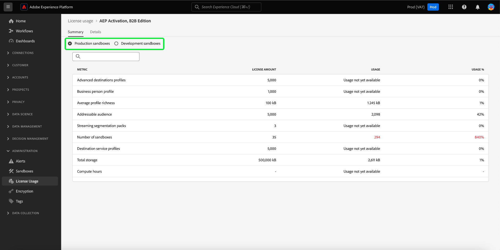
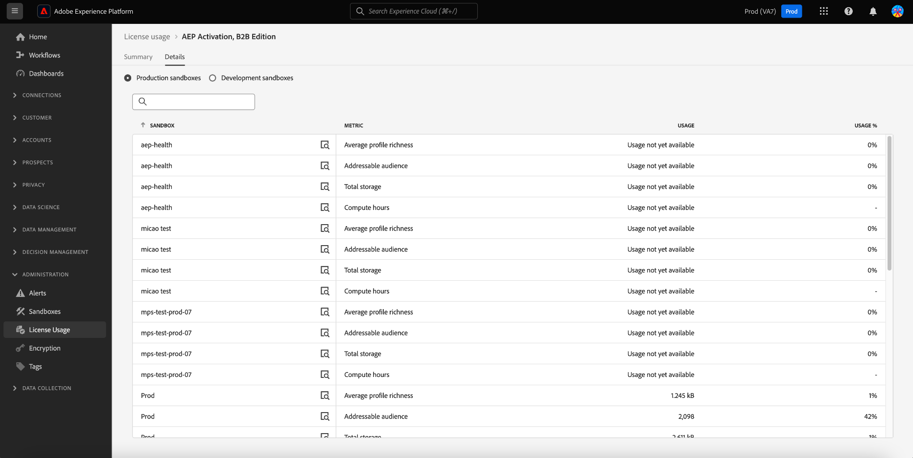

# Dashboard utilizzo licenze {#license-usage-dashboard}

>[!CONTEXTUALHELP]
>id="testy-mctestface"
>title="Finestra di dialogo di prova che non deve essere visibile"
>abstract="L’oggetto {name} viene visualizzato il {date}."

>[!CONTEXTUALHELP]
>id="platform_dashboards_licenseusage_core"
>title="Tabella dei prodotti core"
>abstract="I prodotti core elencati nella tabella hanno le proprie metriche, il tracciamento dell’utilizzo e viste drill-through a livello di sandbox. Questi prodotti core forniscono le metriche chiave per il tracciamento ed eventuali componenti aggiuntivi sono inclusi in queste metriche."

>[!CONTEXTUALHELP]
>id="platform_dashboards_licenseusage_addons"
>title="Tabella dei componenti aggiuntivi"
>abstract="Nella tabella Componenti aggiuntivi sono elencati i prodotti i cui importi di licenza sono combinati con le metriche supportate dai prodotti di base. Questi componenti aggiuntivi non hanno metriche separate, ma migliorano il tracciamento dell’utilizzo dei prodotti core a cui sono associati."

>[!CONTEXTUALHELP]
>id="platform_dashboards_licenseUsage"
>title="Dashboard utilizzo licenze"
>abstract="La dashboard utilizzo licenze offre informazioni approfondite sui prodotti Adobe Experience Platform acquistati. La panoramica della dashboard mostra le metriche principali dei prodotti, incluso l’utilizzo da parte dell’utente per ciascuna metrica principale e l’importo della licenza contrattuale. Nell’area di lavoro dei dettagli viene visualizzato un raggruppamento delle metriche per ciascun prodotto all’interno di sandbox specifiche."
>additional-url="https://experienceleague.adobe.com/it/docs/experience-platform/data-lifecycle/ui/dataset-expiration" text="Scadenze di set di dati automatizzate"
>additional-url="https://experienceleague.adobe.com/it/docs/experience-platform/profile/pseudonymous-profiles" text="Scadenza dei dati dei profili pseudonimi"

>[!CONTEXTUALHELP]
>id="platform_licenseusage"
>title="Dashboard utilizzo licenze"
>abstract="La dashboard utilizzo licenze offre informazioni approfondite sui prodotti Adobe Experience Platform acquistati. La panoramica della dashboard mostra le metriche principali dei prodotti, incluso l’utilizzo da parte dell’utente per ciascuna metrica principale e l’importo della licenza contrattuale. Nell’area di lavoro dei dettagli viene visualizzato un raggruppamento delle metriche per ciascun prodotto all’interno di sandbox specifiche."
>additional-url="https://experienceleague.adobe.com/it/docs/experience-platform/data-lifecycle/ui/dataset-expiration" text="Scadenze di set di dati automatizzate"
>additional-url="https://experienceleague.adobe.com/it/docs/experience-platform/profile/pseudonymous-profiles" text="Scadenza dei dati dei profili pseudonimi"

Puoi visualizzare informazioni importanti sull&#39;utilizzo delle licenze della tua organizzazione tramite la dashboard [!UICONTROL Utilizzo licenze] di Adobe Experience Platform. Le informazioni visualizzate qui vengono acquisite durante un’istantanea giornaliera dell’istanza Platform.

I rapporti sull’utilizzo delle licenze forniscono un elevato grado di granularità sulle metriche di utilizzo delle licenze. Il dashboard fornisce le metriche di utilizzo per ciascun prodotto acquistato (e i relativi componenti aggiuntivi), l’utilizzo consolidato delle metriche in tutte le sandbox di produzione o di sviluppo e la metrica di utilizzo da una sandbox specifica. Con le metriche di utilizzo è possibile tenere traccia delle seguenti applicazioni di Experience Platform: Real-time Customer Data Platform, Adobe Journey Optimizer e Customer Journey Analytics.

Questa guida illustra come accedere e utilizzare il dashboard utilizzo licenze nell’interfaccia utente di e fornisce ulteriori informazioni sulle visualizzazioni visualizzate nel dashboard.

Per una panoramica generale dell&#39;interfaccia utente di Platform, fare riferimento alla [guida dell&#39;interfaccia utente di Experience Platform](../../landing/ui-guide.md).

## [!UICONTROL Utilizzo licenza] dati dashboard

Nel dashboard [!UICONTROL Utilizzo licenze] viene visualizzato un elenco di tutti i prodotti di Experience Platform acquistati e dei relativi componenti aggiuntivi. Da questa dashboard è possibile trovare un’istantanea dei dati relativi alla licenza della tua organizzazione, ad Experience Platform in qualsiasi sandbox associata.

I dati in questo dashboard vengono visualizzati esattamente come appaiono nel momento specifico in cui è stata acquisita l’istantanea. In altre parole, l’istantanea non è un’approssimazione o un campione dei dati e il dashboard non viene aggiornato in tempo reale.

>[!NOTE]
>
>Eventuali modifiche o aggiornamenti apportati ai dati dal momento in cui è stata acquisita l’istantanea non verranno riflessi nel dashboard fino all’acquisizione dell’istantanea successiva.

## Esplorazione del dashboard utilizzo licenze {#explore}

Per passare al dashboard utilizzo licenze nell&#39;interfaccia utente di Platform, seleziona **[!UICONTROL Utilizzo licenze]** nella barra a sinistra. Viene visualizzata la scheda [!UICONTROL Panoramica] con un elenco dei prodotti disponibili.

>[!NOTE]
>
>Per impostazione predefinita, il dashboard utilizzo licenze non è attivato. Per poter visualizzare la dashboard, gli utenti devono disporre dell’autorizzazione &quot;Visualizza dashboard utilizzo licenze&quot;. Per i passaggi relativi alla concessione delle autorizzazioni di accesso per la visualizzazione del dashboard di utilizzo delle licenze, fare riferimento alla [guida alle autorizzazioni del dashboard](../permissions.md).

## Scheda [!UICONTROL Panoramica] {#overview-tab}

Il dashboard [!UICONTROL Utilizzo licenze] visualizza due tabelle separate: **Prodotti core** e **Componenti aggiuntivi**.

- **[!UICONTROL Prodotti core] tabella**: questa tabella elenca i principali prodotti Adobe Experience Platform concessi in licenza dalla tua organizzazione. Ogni prodotto di base ha le proprie metriche, il proprio tracciamento dell’utilizzo e viste drill-through a livello di sandbox. Questi prodotti core forniscono le metriche chiave per il tracciamento ed eventuali componenti aggiuntivi sono inclusi in queste metriche.

- **[!UICONTROL Componenti aggiuntivi] tabella**: in questa tabella sono elencati prodotti aggiuntivi le cui quantità di licenze sono combinate con le metriche supportate dai prodotti di base. I componenti aggiuntivi non dispongono di metriche separate, ma migliorano il tracciamento dell’utilizzo dei prodotti core a cui sono associati.

| Nome colonna | Descrizione |
|---|---|
| **[!UICONTROL Prodotto]** | La soluzione di Adobe concessa in licenza dalla tua organizzazione. |
| **[!UICONTROL Metrica principale]** | La metrica principale utilizzata per il tracciamento all’interno di quel prodotto. |
| **[!UICONTROL Importo licenza]** | Il valore contrattuale per l’importo massimo della metrica principale come concordato nel contratto di licenza del prodotto. |
| **[!UICONTROL Utilizzo]** | Quantità della metrica principale utilizzata. Questo valore fornisce l’utilizzo totale di quella metrica in tutte le sandbox, di produzione o di sviluppo. |
| **[!UICONTROL Utilizzo %]** | La percentuale della metrica principale utilizzata in base alla quantità di licenza. |
| **[!UICONTROL Utilizzo delle previsioni]** | La percentuale di utilizzo prevista della metrica principale in base alla quantità di licenza. |

>[!NOTE]
>
>Gli importi delle licenze per i componenti aggiuntivi sono inclusi nella [!UICONTROL quantità di licenza] dei prodotti core. Ad esempio, se acquisti una confezione di cinque sandbox come componente aggiuntivo, l’importo viene aggiunto a quello del prodotto di base. La tabella dei componenti aggiuntivi mostra un [!UICONTROL importo licenza] specifico per il componente aggiuntivo, ma l&#39;utilizzo effettivo viene registrato attraverso il prodotto di base.

Le tabelle indicano la metrica principale per ciascun prodotto, in quanto ogni prodotto può tracciare numerose metriche.

### Utilizzo previsto {#predicted-usage}

>[!CONTEXTUALHELP]
>id="platform_dashboards_licenseUsage_prediction"
>title="Utilizzo previsto"
>abstract="Le previsioni si basano sull’utilizzo negli ultimi 6-7 mesi e vengono generate il 15 di ogni mese. Tieni presente che le previsioni sull’utilizzo delle licenze sono approssimazioni basate sull’utilizzo passato. Sei responsabile della comprensione dell’utilizzo effettivo dell’organizzazione e di garantire che l’utilizzo non vada oltre l’ambito della licenza dell’organizzazione con Adobe. Per ridurre l’utilizzo, puoi configurare le scadenze del set di dati o dei profili pseudonimi per le sandbox e i set di dati."
>additional-url="https://experienceleague.adobe.com/it/docs/experience-platform/data-lifecycle/ui/dataset-expiration" text="Scadenze di set di dati automatizzate"
>additional-url="https://experienceleague.adobe.com/it/docs/experience-platform/profile/pseudonymous-profiles" text="Scadenza dei dati dei profili pseudonimi"

>[!CONTEXTUALHELP]
>id="platform_licenseusage_prediction"
>title="Utilizzo previsto"
>abstract="Le previsioni si basano sull’utilizzo negli ultimi 6-7 mesi e vengono generate il 15 di ogni mese. Tieni presente che le previsioni sull’utilizzo delle licenze sono approssimazioni basate sull’utilizzo passato. Sei responsabile della comprensione dell’utilizzo effettivo dell’organizzazione e di garantire che l’utilizzo non vada oltre l’ambito della licenza dell’organizzazione con Adobe. Per ridurre l’utilizzo, puoi configurare le scadenze del set di dati o dei profili pseudonimi per le sandbox e i set di dati."
>additional-url="https://experienceleague.adobe.com/it/docs/experience-platform/data-lifecycle/ui/dataset-expiration" text="Scadenze di set di dati automatizzate"
>additional-url="https://experienceleague.adobe.com/it/docs/experience-platform/profile/pseudonymous-profiles" text="Scadenza dei dati dei profili pseudonimi"

Gestisci e ottimizza in modo proattivo le risorse di gestione delle licenze in base a previsioni approfondite sull’utilizzo. La colonna [!UICONTROL Utilizzo previsto] prevede con precisione l&#39;utilizzo futuro delle licenze a livello di sandbox, in tutte le sandbox di produzione e sviluppo, per tutti i prodotti acquistati. Questa funzionalità di avviso fornisce una previsione dell’utilizzo della licenza per sei settimane nel futuro, in base all’utilizzo fino al 15 di questo mese di calendario. Le previsioni sono fornite con un limite inferiore e uno superiore.

>[!IMPORTANT]
>
>Le previsioni vengono aggiornate su base mensile. La data di aggiornamento è inclusa in un&#39;icona di informazioni () sopra il titolo della colonna.

Per visualizzare un riepilogo dell&#39;utilizzo dei diritti di un prodotto, selezionare un prodotto dalla tabella [!UICONTROL Prodotti principali].

<!-- update image ... -->
![Utilizzo della [!UICONTROL Licenza] [!UICONTROL Panoramica] con un prodotto ed evidenziata la colonna Utilizzo previsto.](../images/license-usage/product-predicted-usage.png)

Viene visualizzata la scheda Riepilogo. Puoi utilizzare le previsioni granulari disponibili nelle schede [!UICONTROL Riepilogo] e [!UICONTROL Dettagli] per garantire un processo decisionale informato e un utilizzo efficiente delle licenze.

>[!NOTE]
>
>Tieni presente che le previsioni sull’utilizzo delle licenze sono approssimazioni basate sull’utilizzo passato. L’utente è responsabile di comprendere l’utilizzo effettivo dell’organizzazione e di garantire che l’utilizzo non vada oltre l’ambito della licenza dell’organizzazione con Adobe.

<!-- update image ... -->

La percentuale di utilizzo previsto è determinata come segue:

- Se i limiti inferiore e superiore sono significativamente diversi, vengono visualizzati come intervallo (ad esempio, 32% - 35%).
- Se i limiti inferiore e superiore sono quasi identici e non zero, vengono visualizzati come valore approssimativo (ad esempio, ~34%).
- Se i limiti inferiore e superiore sono quasi identici e zero, vengono visualizzati esattamente come 0%.

>[!NOTE]
>
>&quot;Quasi identici&quot; in questo contesto significa che i valori sono statisticamente significativi per due posizioni decimali (ad esempio, un limite inferiore di 0,342 e un limite superiore di 0,344 sono entrambi arrotondati al 34%).

La funzione di utilizzo previsto supporta le metriche seguenti:

- [!UICONTROL Pubblico indirizzabile]
- [!UICONTROL Ricchezza media profilo]
- [!UICONTROL Calcola ore]
- [!UICONTROL Numero di righe del pubblico del Percorso di clienti]
- [!UICONTROL Archiviazione totale]

## Scheda [!UICONTROL Riepilogo] {#summary-tab}

Per visualizzare ulteriori metriche e informazioni dettagliate sull’utilizzo della licenza del prodotto, seleziona un nome di prodotto dall’elenco. Viene visualizzata la visualizzazione [!UICONTROL Riepilogo] per il prodotto. Tutte le metriche disponibili vengono visualizzate nella scheda [!UICONTROL Riepilogo]. Le metriche disponibili dipendono dal prodotto concesso in licenza. Questa visualizzazione fornisce **una visualizzazione consolidata di tutte le metriche in tutte le sandbox di produzione o di sviluppo**. Lo stesso livello di analisi viene fornito per le sandbox di produzione e di sviluppo.

Nella scheda Riepilogo la tabella include la colonna [!UICONTROL Metrica]. Queste descrizioni leggibili dall’utente indicano tutte le metriche utilizzate per quel tipo di sandbox.

### Seleziona una sandbox {#select-sandbox}

Per modificare la visualizzazione tra i tipi di sandbox di produzione e di sviluppo, selezionare [!UICONTROL Sandbox di produzione] o [!UICONTROL Sandbox di sviluppo]. Il tipo di sandbox selezionato è indicato dal pulsante di opzione accanto al nome della sandbox.

I rapporti sul consumo per le sandbox sono cumulativi per tutte le sandbox dello stesso tipo. In altre parole, se si seleziona [!UICONTROL Produzione] o [!UICONTROL Sviluppo], verranno visualizzati report sul consumo per tutte le sandbox di produzione o di sviluppo, rispettivamente.

>[!WARNING]
>
>L’autorizzazione per visualizzare il dashboard utilizzo licenze deve essere specificata a livello di sandbox. Aggiungi le autorizzazioni a ogni singola sandbox per visualizzarle all’interno del dashboard. Questa limitazione verrà risolta in una versione futura. Nel frattempo, è disponibile la seguente soluzione alternativa:
>
>1. Creare un profilo di prodotto in Adobe Admin Console.
>2. In Autorizzazione nella categoria Sandbox, aggiungi tutte le sandbox da visualizzare nel dashboard utilizzo licenze.
>3. Nella categoria Autorizzazione dashboard utente, aggiungi l’autorizzazione &quot;Visualizza dashboard utilizzo licenze&quot;.

## Scheda [!UICONTROL Dettagli] {#details-tab}

Per visualizzare **una particolare metrica di utilizzo da una sandbox specifica**, passa alla scheda [!UICONTROL Dettagli]. La scheda [!UICONTROL Dettagli] mostra tutte le sandbox disponibili nelle sandbox di produzione o di sviluppo.

Da questa visualizzazione è possibile selezionare  accanto al nome di una sandbox per visualizzare la visualizzazione di quella metrica. Si apre una finestra di dialogo con una visualizzazione per quella metrica.

### Visualizzazioni {#visualizations}

Ogni widget di visualizzazione include i seguenti aspetti:

- Un grafico a linee che traccia la variazione della metrica nel tempo
- Una chiave per il grafico a linee
- Nome della sandbox
- Menu a discesa per regolare il periodo di tempo per il grafico a linee

I grafici a linee confrontano i numeri di utilizzo per l’organizzazione con il totale disponibile con le licenze dell’organizzazione e forniscono una percentuale dell’utilizzo totale.

Il periodo di lookback dell’analisi può essere regolato dal menu a discesa. Il valore predefinito degli ultimi 30 giorni

Per selezionare un intervallo di date, puoi utilizzare il menu a discesa dell’intervallo di date per selezionare il periodo di tempo da visualizzare nel dashboard. Sono disponibili più opzioni, incluso il valore predefinito degli ultimi 30 giorni.

Puoi anche selezionare **[!UICONTROL Data personalizzata]** per scegliere il periodo di tempo visualizzato.

## Metriche disponibili {#available-metrics}

Il dashboard utilizzo licenze riporta diverse metriche univoche applicabili a più prodotti dell’organizzazione. Le metriche disponibili sono:

| Metrica | Descrizione |
|---|---|
| [!UICONTROL Dimensione Audience Activation] | Dimensione totale dei profili attivati in una destinazione basata su file in un anno. Nota: non sono inclusi i profili inviati tramite destinazioni di streaming. |
| [!UICONTROL Pubblico di riferimento] | La somma delle adesioni per il pubblico aziendale e per il pubblico dei consumatori. Un pubblico di consumatori è definito come il numero di profili di persone identificati come &quot;pubblico di consumatori&quot; nell’ordine di vendita. Per pubblico aziendale si intende il numero di profili di persona aziendale identificati come &quot;pubblico aziendale&quot; nell’ordine di vendita. |
| [!UICONTROL Pacchetti utenti servizio query ad hoc] | Componente aggiuntivo per aumentare il diritto degli utenti autorizzati di Query Service di altri cinque utenti di Query Service simultanei e di un’ulteriore query ad hoc in esecuzione simultanea per pacchetto. È possibile concedere in licenza più pacchetti utente di Ad Hoc Query aggiuntivi. |
| [!UICONTROL Righe CJA disponibili] | La media giornaliera delle righe di dati disponibili per l’analisi nel Customer Journey Analytics. |
| [!UICONTROL Attributi calcolati] | Numero totale di dati comportamentali aggregati del profilo. I dati comportamentali aggregati del profilo si basano su eventi di esperienza convertiti in un attributo di profilo e che possono essere inclusi in un profilo di persona o di persona aziendale. |
| [!UICONTROL Pubblico consumer] | Il numero di profili di persona identificati come &quot;Pubblico consumatore&quot; nell’ordine cliente. |
| [!UICONTROL Dimensione esportazione dati] | La quantità di dati inviati tramite le attivazioni dei set di dati in un anno. |
| [!UICONTROL Esportazioni dati] | Dimensione totale dei set di dati che possono essere esportati (direttamente o indirettamente) in una soluzione non Adobe in un anno. |
| [!UICONTROL Archiviazione Data Lake] | Quantità utilizzata dell’archivio dati analitici in Adobe Experience Platform. |
| [!UICONTROL Pubblico coinvolgibile] | Questa metrica si riferisce al pubblico di profili coinvolgibili. Un profilo coinvolgibile è un record di informazioni che rappresenta un individuo ed è rappresentato nel Servizio profili. Questi record sono profili che hai tentato di utilizzare con le funzionalità di authoring, decisione, distribuzione, sperimentazione o orchestrazione di Journey Optimizer negli ultimi 12 mesi. |
| [!UICONTROL Tipi di pubblico simili] | Il numero di tipi di pubblico generati modellando un pubblico consumer esistente per identificare profili di persone simili a quello esistente. |
| [!UICONTROL Numero di modelli AMM] | Un conteggio del modello di apprendimento automatico (integrato nell’Adobe Mix Modeler) utilizzato per misurare e/o prevedere un risultato specifico in base ai tuoi investimenti. |
| [!UICONTROL Numero di sandbox] | Numero di separazioni logiche all’interno dell’istanza di qualsiasi servizio Adobe On-demand che accede ai dati e alle operazioni di isolamento di Adobe Experience Platform. |
| [!UICONTROL Numero di pacchetti Richness profilo] | Un aumento del volume totale di dati autorizzato di 25 KB per profilo per ogni pacchetto di ricchezza di profilo aggiuntivo. |
| [!UICONTROL Ore di calcolo servizio query] | Misura del tempo impiegato dai motori di Query Service per leggere, elaborare e riscrivere i dati nel data lake quando viene eseguita una query batch. |
| [!UICONTROL Segmentazione streaming n. di pacchetti] | I pacchetti aggiornano l’iscrizione al segmento per un profilo persona man mano che nuovi dati entrano nel servizio di segmentazione attraverso un flusso di streaming. L’iscrizione al segmento viene valutata in base agli attributi del profilo della persona corrente e al valore dell’evento corrente, senza tenere conto del comportamento storico. La segmentazione in streaming è una funzione condivisa. |
| [!UICONTROL Volume di dati totale] | La quantità totale di dati disponibili per Adobe Experience Platform Profile Service da utilizzare nei flussi di lavoro di coinvolgimento. |

<!-- |  [!UICONTROL Sandbox No of Packs] |  A logical separation within your instance of any Adobe On-demand Service that accesses Adobe Experience Platform isolating data and operations | -->

>[!TIP]
>
>È possibile controllare i diritti di licenza nell&#39;ordine di vendita per calcolare metriche quali l&#39;indennità di archiviazione. Ad esempio,<ul><li>Indennità di archiviazione = numero di &quot;profili autorizzati&quot; nel contratto X Ricchezza media profilo</li></ul>

La disponibilità di queste metriche e la definizione specifica di ciascuna di esse varia a seconda delle licenze acquistate dalla tua organizzazione. Per le definizioni dettagliate di ciascuna metrica, consulta l’appropriata documentazione di descrizione del prodotto:

| Licenza | Descrizione del prodotto |
| --- | --- |
| <ul><li>ADOBE EXPERIENCE PLATFORM:OD LITE</li><li>ADOBE EXPERIENCE PLATFORM:OD STANDARD</li><li>ADOBE EXPERIENCE PLATFORM:INTENSO</li></ul> | [Adobe Experience Platform](https://helpx.adobe.com/legal/product-descriptions/adobe-experience-platform.html) |
| <ul><li>ADOBE EXPERIENCE PLATFORM:OD</li></ul> | [Experience Platform, servizi app e servizi intelligenti](https://helpx.adobe.com/legal/product-descriptions/exp-platform-app-svcs.html) |
| <ul><li>RT CUSTOMER DATA PLATFORM:OD</li><li>RT CUSTOMER DATA PLATFORM:DA PRFL A 10M</li><li>RT CUSTOMER DATA PLATFORM:DA PRFL A 50M</li></ul> | [Adobe Real-time Customer Data Platform](https://helpx.adobe.com/it/legal/product-descriptions/real-time-customer-data-platform.html) |
| <ul><li>AEP:ATTIVAZIONE OD</li><li>AEP:ATTIVAZIONE OD PRFL A 10M</li><li>AEP: PRFL DI ATTIVAZIONE OD FINO A 50 M</li></ul> | [Attivazione Adobe Experience Platform](https://helpx.adobe.com/legal/product-descriptions/adobe-experience-platform0.html) |
| <ul><li>AEP:INTELLIGENZA OD</li></ul> | [Adobe Experience Platform Intelligence](https://helpx.adobe.com/legal/product-descriptions/adobe-experience-platform-intelligence---product-description.html) |
| <ul><li>JOURNEY OPTIMIZER SELECT:OD</li><li>JOURNEY OPTIMIZER PRIME:OD</li><li>JOURNEY OPTIMIZER ULTIMATE:OD</li><li>UNP AJO PRIME STARTER:OD</li><li>UNP AJO ULTIMATE STARTER:OD</li><li>REAL-TIME CDP UNP: ORCHESTRAZIONE PROFILO OD</li></ul> | [Adobe Journey Optimizer](https://helpx.adobe.com/it/legal/product-descriptions/adobe-journey-optimizer.html) |

>[!WARNING]
>
>Il dashboard utilizzo licenze riporta solo l’ultima licenza fornita per la tua organizzazione. Se l’ultima licenza fornita per la tua organizzazione non viene visualizzata nella tabella precedente, è possibile che il dashboard utilizzo licenze non venga visualizzato correttamente. Il supporto per licenze aggiuntive e più licenze in una singola organizzazione è pianificato per una versione futura.

## Passaggi successivi

Dopo aver letto questo documento, potrai individuare la dashboard di utilizzo della licenza e visualizzare le metriche di utilizzo per ciascun prodotto acquistato, per tutte le sandbox di produzione o di sviluppo e per una sandbox specifica. Puoi trovare ulteriori informazioni sulle metriche disponibili per la tua organizzazione, in base alle licenze acquistate dalla tua organizzazione.

Per ulteriori informazioni sulle altre funzionalità disponibili nell&#39;interfaccia utente di Experience Platform, consulta la [guida dell&#39;interfaccia utente di Platform](../../landing/ui-guide.md).
