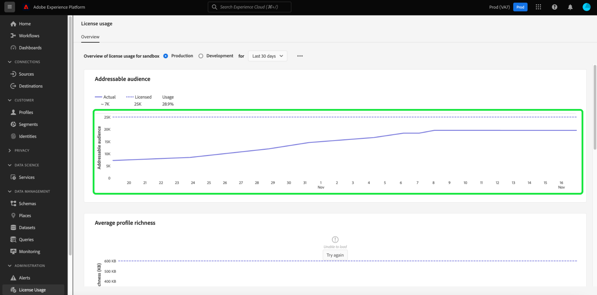

# Dashboard utilizzo licenze {#license-usage-dashboard}

L’interfaccia utente di Adobe Experience Platform fornisce una dashboard attraverso la quale puoi visualizzare informazioni importanti sull’utilizzo delle licenze della tua organizzazione, acquisite durante un’istantanea giornaliera. Questa guida illustra come accedere e utilizzare il dashboard utilizzo licenze nell’interfaccia utente di e fornisce ulteriori informazioni sulle visualizzazioni visualizzate nel dashboard.

Per una panoramica generale dell’interfaccia utente di Platform, visita [Guida all’interfaccia utente di Experienci Platform](../../landing/ui-guide.md).

## Dati dashboard utilizzo licenze

Nel dashboard utilizzo licenze viene visualizzata un’istantanea dei dati relativi alla licenza della tua organizzazione, ad Experience Platform. I dati nel dashboard vengono visualizzati esattamente come appaiono nel momento specifico in cui è stata acquisita l’istantanea. In altre parole, l’istantanea non è un’approssimazione o un campione dei dati e il dashboard non viene aggiornato in tempo reale.

>[!NOTE]
>
>Eventuali modifiche o aggiornamenti apportati ai dati dal momento in cui è stata acquisita l’istantanea non verranno riflessi nel dashboard fino all’acquisizione dell’istantanea successiva.

## Esplorazione del dashboard utilizzo licenze

Per passare al dashboard utilizzo licenze nell’interfaccia utente di Platform, seleziona **[!UICONTROL Utilizzo licenze]** nella barra a sinistra. Verrà aperto il **[!UICONTROL Panoramica]** che visualizza il dashboard.

>[!NOTE]
>
>Per impostazione predefinita, il dashboard utilizzo licenze non è attivato. Per poter visualizzare la dashboard, gli utenti devono disporre dell’autorizzazione &quot;Visualizza dashboard utilizzo licenze&quot;. Per i passaggi sulla concessione delle autorizzazioni di accesso per la visualizzazione del dashboard utilizzo licenze, consulta [guida alle autorizzazioni della dashboard](../permissions.md).

### Seleziona una sandbox

Per scegliere una sandbox da visualizzare nel dashboard, seleziona una delle seguenti opzioni [!UICONTROL Produzione] o [!UICONTROL Sviluppo]. La sandbox selezionata è indicata dal pulsante di opzione accanto al nome della sandbox.

I rapporti sul consumo per le sandbox sono cumulativi per tutte le sandbox dello stesso tipo. In altre parole, selezionare [!UICONTROL Produzione] o [!UICONTROL Sviluppo] fornisce rapporti sul consumo rispettivamente per tutte le sandbox di produzione o di sviluppo.

>[!WARNING]
>
>L’autorizzazione per visualizzare il dashboard utilizzo licenze deve essere specificata a livello di sandbox. Questo significa che l’autorizzazione per visualizzare il dashboard deve essere aggiunta a ogni singola sandbox. Questa limitazione verrà risolta in una versione futura. Nel frattempo, è disponibile la seguente soluzione alternativa:
>
>1. Creare un profilo di prodotto in Adobe Admin Console.
>2. In Autorizzazione nella categoria Sandbox, aggiungi tutte le sandbox da visualizzare nel dashboard utilizzo licenze.
>3. Nella categoria Autorizzazioni dashboard utenti, aggiungi l’autorizzazione &quot;Visualizza dashboard utilizzo licenze&quot;.

### Seleziona un intervallo di date

Dopo aver selezionato una sandbox, puoi utilizzare il menu a discesa dell’intervallo di date per selezionare il periodo di tempo da visualizzare nel dashboard. Sono disponibili più opzioni, incluso il valore predefinito degli ultimi 30 giorni.

Puoi anche selezionare **[!UICONTROL Data personalizzata]** per scegliere il periodo di tempo visualizzato.

## Widget

Il dashboard utilizzo licenze è composto da widget che visualizzano metriche di sola lettura contenenti informazioni importanti sull’utilizzo delle licenze da parte dell’organizzazione. Le metriche visibili dipendono dalle licenze specifiche della tua organizzazione (vedi [metriche disponibili](#available-metrics) sezione per i dettagli).

Ogni widget visualizza un grafico a linee che confronta i numeri effettivi dell’organizzazione con il totale disponibile con le licenze dell’organizzazione e fornisce una percentuale dell’utilizzo totale.

## Metriche disponibili

La dashboard utilizzo licenze riporta quattro metriche chiave, con ulteriori metriche da aggiungere nelle versioni successive. Le metriche disponibili sono:

* [!UICONTROL Pubblico di riferimento]
* [!UICONTROL Ricchezza media dei profili]
* [!UICONTROL Dati analizzati per rapporto di segmentazione]
* [!UICONTROL Memoria totale utilizzata]

La disponibilità di queste metriche e la definizione specifica di ciascuna di esse varia a seconda delle licenze acquistate dalla tua organizzazione. Per le definizioni dettagliate di ciascuna metrica, fai riferimento alla documentazione descrittiva del prodotto appropriata:

| Licenza | Descrizione del prodotto |
|---|---|
| <ul><li>ADOBE EXPERIENCE PLATFORM:OD LITE</li><li>ADOBE EXPERIENCE PLATFORM:OD STANDARD</li><li>ADOBE EXPERIENCE PLATFORM:INTENSO</li></ul> | [Adobe Experience Platform](https://helpx.adobe.com/legal/product-descriptions/adobe-experience-platform.html) |
| <ul><li>ADOBE EXPERIENCE PLATFORM:OD</li></ul> | [Experience Platform: servizi app e servizi intelligenti](https://helpx.adobe.com/legal/product-descriptions/exp-platform-app-svcs.html) |
| <ul><li>RT CUSTOMER DATA PLATFORM:OD</li><li>RT CUSTOMER DATA PLATFORM:DA PRFL A 10M</li><li>RT CUSTOMER DATA PLATFORM:DA PRFL A 50M</li></ul> | [Adobe Real-time Customer Data Platform](https://helpx.adobe.com/it/legal/product-descriptions/real-time-customer-data-platform.html) |
| <ul><li>AEP:ATTIVAZIONE OD</li><li>AEP:ATTIVAZIONE OD PRFL A 10M</li><li>AEP: PRFL DI ATTIVAZIONE OD FINO A 50 M</li></ul> | [Attivazione Adobe Experience Platform](https://helpx.adobe.com/legal/product-descriptions/adobe-experience-platform0.html) |
| <ul><li>AEP:INTELLIGENZA OD</li></ul> | [Adobe Experience Platform Intelligence](https://helpx.adobe.com/legal/product-descriptions/adobe-experience-platform-intelligence---product-description.html) |
| <ul><li>JOURNEY OPTIMIZER SELECT:OD</li><li>JOURNEY OPTIMIZER PRIME:OD</li><li>JOURNEY OPTIMIZER ULTIMATE:OD</li><li>PRIMO AVVIO AJO UNP:OD</li><li>UNP AJO ULTIMATE STARTER:OD</li><li>REAL-TIME CDP UNP: ORCHESTRAZIONE PROFILO OD</li></ul> | [Adobe Journey Optimizer](https://helpx.adobe.com/it/legal/product-descriptions/adobe-journey-optimizer.html) |

>[!WARNING]
>
>Il dashboard utilizzo licenze riporta solo l’ultima licenza fornita per la tua organizzazione. Se l’ultima licenza fornita per la tua organizzazione non viene visualizzata nella tabella precedente, è possibile che il dashboard utilizzo licenze non venga visualizzato correttamente. Il supporto per licenze aggiuntive e più licenze in una singola organizzazione è pianificato per una versione futura.

## Passaggi successivi

Dopo aver letto questo documento, puoi individuare il dashboard utilizzo licenze e selezionare una sandbox da visualizzare. Puoi anche trovare ulteriori informazioni sulle metriche disponibili per la tua organizzazione, in base alle licenze acquistate dalla tua organizzazione.

Per ulteriori informazioni sulle altre funzioni disponibili nell’interfaccia utente di Experienci Platform, consulta [Guida all’interfaccia utente di Platform](../../landing/ui-guide.md).
