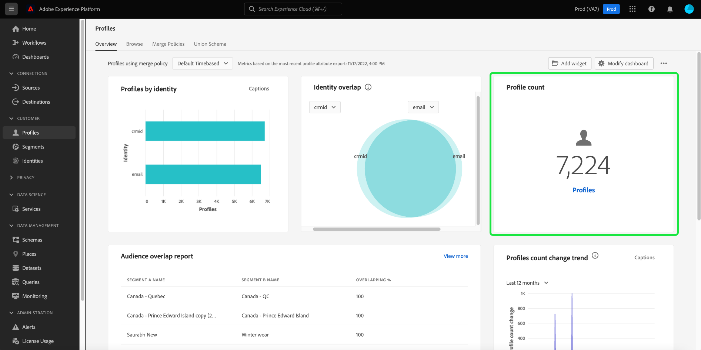

# [!UICONTROL Profili] dashboard

L’interfaccia utente di Adobe Experience Platform fornisce una dashboard attraverso la quale puoi visualizzare informazioni importanti sul tuo [!DNL Real-time Customer Profile] come acquisiti durante un&#39;istantanea giornaliera. Questa guida illustra come accedere e utilizzare [!UICONTROL Profili] dashboard nell’interfaccia utente e fornisce informazioni sulle metriche visualizzate nel dashboard.

Per una panoramica di tutte le funzioni Profilo nell’interfaccia utente di Experience Platform, visita la [Guida all’interfaccia utente del profilo cliente in tempo reale](../../profile/ui/user-guide.md).

## Dati del dashboard del profilo

La [!UICONTROL Profili] Il dashboard visualizza un&#39;istantanea dei dati dell&#39;attributo (record) della tua organizzazione all&#39;interno dell&#39;archivio profili in Experience Platform. Lo snapshot non include dati di eventi (serie temporali).

I dati attributo nello snapshot mostrano esattamente come vengono visualizzati nel momento specifico in cui è stata acquisita l&#39;istantanea. In altre parole, lo snapshot non è un&#39;approssimazione o un esempio dei dati e il dashboard Profilo non viene aggiornato in tempo reale.

>[!NOTE]
>
>Eventuali modifiche o aggiornamenti apportati ai dati dall&#39;acquisizione dello snapshot non verranno visualizzati nel dashboard fino all&#39;acquisizione dello snapshot successivo.

## Esplorazione delle [!UICONTROL Profili] dashboard

Per passare al [!UICONTROL Profili] nell’interfaccia utente di Platform, seleziona **[!UICONTROL Profili]** nella barra a sinistra, seleziona la **[!UICONTROL Panoramica]** per visualizzare il dashboard.

>[!NOTE]
>
>Se la tua organizzazione è nuova di Platform e non dispone ancora di set di dati di profilo attivi o di criteri di unione creati, la [!UICONTROL Profili] dashboard non è visibile. Invece, [!UICONTROL Panoramica] visualizza collegamenti e documentazione per iniziare a usare Profilo cliente in tempo reale.

### Modifica della [!UICONTROL Profili] dashboard

Puoi modificare l’aspetto della [!UICONTROL Profili] dashboard selezionando **[!UICONTROL Modifica dashboard]**. Questo consente di spostare, aggiungere e rimuovere i widget dal dashboard e di accedere al **[!UICONTROL Libreria widget]** per esplorare i widget disponibili e creare widget personalizzati per la tua organizzazione.

Fai riferimento alla [modifica delle dashboard](../customize/modify.md) e [Panoramica della libreria Widget](../customize/widget-library.md) documentazione per ulteriori informazioni.

## (Beta) Approfondimenti sull’efficacia del profilo {#profile-efficacy-insights}

>[!IMPORTANT]
>
>La funzionalità di informazioni sull’efficacia del profilo è attualmente in versione beta e non è disponibile per tutti gli utenti. La documentazione e le funzionalità sono soggette a modifiche.

La [!UICONTROL Efficacia] tab fornisce metriche sulla qualità e la completezza dei dati del profilo tramite l’uso di widget di efficacia del profilo. Questi widget illustrano immediatamente la composizione dei profili, le tendenze della completezza nel tempo e le valutazioni della qualità dei dati del profilo.

Consulta la sezione [sezione widget efficacia profilo](#profile-efficacy-widgets) per ulteriori informazioni sui widget attualmente disponibili.

Il layout di questo dashboard è personalizzabile anche selezionando [**[!UICONTROL Modifica dashboard]**](../customize/modify.md) dal [!UICONTROL Panoramica] scheda .

## Sfoglia profili {#browse-profiles}

La [!UICONTROL Sfoglia] consente di cercare e visualizzare i profili di sola lettura acquisiti nell’organizzazione IMS. Da qui puoi vedere informazioni importanti appartenenti al profilo relative alle loro preferenze, eventi passati, interazioni e segmenti

Per ulteriori informazioni sulle funzionalità di visualizzazione del profilo fornite nell’interfaccia utente di Platform, consulta la documentazione su [navigazione dei profili in Real-time Customer Data Platform](../../rtcdp/profile/profile-browse.md).

## Unisci criteri {#merge-policies}

Le metriche visualizzate nel [!UICONTROL Profili] Il dashboard si basa sui criteri di unione applicati ai dati del profilo cliente in tempo reale. Quando i dati vengono riuniti da più sorgenti per creare il profilo del cliente, i dati possono contenere valori in conflitto. Ad esempio, un set di dati può elencare un cliente come &quot;singolo&quot;, mentre un altro può elencare il cliente come &quot;sposato&quot;. È compito del criterio di unione determinare quali dati assegnare priorità e visualizzare come parte del profilo.

Per ulteriori informazioni sui criteri di unione, tra cui come creare, modificare e dichiarare un criterio di unione predefinito per l&#39;organizzazione, leggere innanzitutto il [panoramica dei criteri di unione](../../profile/merge-policies/overview.md).

Il dashboard selezionerà automaticamente un criterio di unione da utilizzare. I criteri di unione applicati possono essere modificati utilizzando il menu a discesa accanto al nome del criterio di unione.

>[!NOTE]
>
>Il menu a discesa mostra solo i criteri di unione relativi alla classe di profilo individuale XDM. Tuttavia, se l&#39;organizzazione ha creato più criteri di unione, potrebbe essere necessario scorrere per visualizzare l&#39;elenco completo dei criteri di unione disponibili.

## Schemi dell’Unione

La [!UICONTROL Schema dell&#39;unione] dashboard visualizza lo schema di unione per una specifica classe XDM. Selezionando la **[!UICONTROL Classe]** a discesa, puoi visualizzare gli schemi di unione per diverse classi XDM.

Gli schemi di unione sono composti da più schemi che condividono la stessa classe e sono stati abilitati per Profilo. Consentono di visualizzare in un’unica visualizzazione una fusione di ogni campo contenuto in ogni schema che condivide la stessa classe.

Per ulteriori informazioni, consulta la guida all’interfaccia utente per lo schema dell’unione . [visualizzazione degli schemi di unione nell’interfaccia utente di Platform](../../profile/ui/union-schema.md#view-union-schemas).

## Widget e metriche

Il dashboard è composto da widget, che sono metriche di sola lettura che forniscono informazioni importanti sui dati del profilo.

La data e l’ora &quot;ultimo aggiornamento&quot; di un widget mostrano quando è stata acquisita l’ultima istantanea dei dati. La data e l’ora dell’istantanea sono indicate in UTC; non si trova nel fuso orario del singolo utente o dell’organizzazione IMS.

## Widget standard

Adobe fornisce diversi widget standard che puoi utilizzare per visualizzare diverse metriche correlate ai dati del profilo. Puoi anche creare widget personalizzati da condividere con la tua organizzazione utilizzando [!UICONTROL Libreria widget]. Per ulteriori informazioni sulla creazione di widget personalizzati, si prega di iniziare leggendo [Panoramica della libreria Widget](../customize/widget-library.md).

Per ulteriori informazioni su ciascuno dei widget standard disponibili, seleziona il nome di un widget dal seguente elenco:

* [[!UICONTROL Numero di profili]](#profile-count)
* [[!UICONTROL Profili aggiunti]](#profiles-added)
* [[!UICONTROL Profili tendenza aggiunta]](#profiles-added-trend)
* [[!UICONTROL Profili per identità]](#profiles-by-identity)
* [[!UICONTROL Sovrapposizione identità]](#identity-overlap)
* [[!UICONTROL Profili di identità singoli]](#single-identity-profiles)
* [[!UICONTROL Profili non segmentati]](#unsegmented-profiles)
* [[!UICONTROL Tendenza dei profili non segmentati]](#unsegmented-profiles-trend)
* [[!UICONTROL Profili non segmentati per identità]](#unsegmented-profiles-by-identity)
* [[!UICONTROL Tipi di pubblico]](#audiences)
* [[!UICONTROL Tipi di pubblico mappati sullo stato di destinazione]](#audiences-mapped-to-destination-status)
* [[!UICONTROL Dimensione del pubblico]](#audiences-size)
* [[!UICONTROL Tendenza al conteggio dei profili]](#profile-count-trend)
* [[!UICONTROL Singoli profili di identità per identità]](#single-identity-profiles-by-identity)
* [[!UICONTROL Sovrapposizione del pubblico per criterio di unione]](#audience-overlap-by-merge-policy)
* [[!UICONTROL Tendenza di modifica del conteggio dei profili in base all&#39;identità]](#profiles-count-change-trend-by-identity)

### [!UICONTROL Numero di profili] {#profile-count}

>[!CONTEXTUALHELP]
>id="platform_dashboards_profiles_profilecount"
>title="Numero di profili"
>abstract="Questo widget visualizza il numero totale di profili uniti all’interno dell’archivio profili al momento dell’acquisizione dello snapshot. Il numero dipende dal criterio di unione selezionato applicato ai dati del profilo."
>additional-url="https://experienceleague.adobe.com/docs/experience-platform/dashboards/guides/profiles.html#profile-count" text="Ulteriori informazioni dalla documentazione"

La **[!UICONTROL Numero di profili]** nel widget viene visualizzato il numero totale di profili uniti all’interno dell’archivio profili al momento dell’acquisizione dello snapshot. Questo numero è il risultato dell’applicazione del criterio di unione selezionato ai dati del profilo per unire i frammenti di profilo in modo da formare un unico profilo per ogni singolo utente.

Consulta la sezione [sezione sui criteri di unione in precedenza in questo documento](#merge-policies) per saperne di più.

>[!NOTE]
>
>La [!UICONTROL Numero di profili] widget può mostrare un numero diverso dal conteggio del profilo mostrato sul [!UICONTROL Sfoglia] nella scheda [!UICONTROL Profili] per diversi motivi. Il motivo più comune è che [!UICONTROL Sfoglia] fa riferimento al numero totale di profili uniti in base ai criteri di unione predefiniti della tua organizzazione, mentre la [!UICONTROL Numero di profili] Il widget fa riferimento al numero totale di profili uniti in base al criterio di unione selezionato per la visualizzazione nel dashboard.
>
>Un altro motivo comune è dovuto alle differenze tra il momento in cui viene acquisita l’istantanea del dashboard e il momento in cui il processo di esempio viene eseguito per la [!UICONTROL Sfoglia] scheda . Puoi vedere quando [!UICONTROL Numero di profili] l&#39;ultimo aggiornamento del widget è stato eseguito guardando la marca temporale nel widget e per ulteriori informazioni sull&#39;attivazione del processo di esempio nel [!UICONTROL Sfoglia] scheda , vedi [sezione conteggio profilo nella guida all’interfaccia utente del profilo cliente in tempo reale](https://experienceleague.adobe.com/docs/experience-platform/profile/ui/user-guide.html?lang=en#profile-count).

### [!UICONTROL Profili aggiunti] {#profiles-added}

<!-- This CONTEXTUALHELP was commented out because this widget name will change. Details in https://jira.corp.adobe.com/browse/PLAT-120313  -->

<!-- >[!CONTEXTUALHELP]
>id="platform_dashboards_profiles_profilesadded"
>title="Profiles added"
>abstract="This widget displays the total number of merged profiles **added** to the Profile Store at the time of the last snapshot. The number depends on the selected merge policy being applied to your Profile data."
>additional-url="https://experienceleague.adobe.com/docs/experience-platform/dashboards/guides/profiles.html#profiles-added" text="Learn more from documentation" -->

La **[!UICONTROL Profili aggiunti]** nel widget viene visualizzato il numero totale di profili uniti aggiunti all’archivio profili al momento dell’ultima istantanea. Questo numero è il risultato dell’applicazione del criterio di unione selezionato ai dati del profilo per unire i frammenti di profilo in modo da formare un unico profilo per ogni singolo utente. Puoi utilizzare il selettore a discesa per visualizzare i profili aggiunti negli ultimi 30 giorni, 90 giorni o 12 mesi.

>[!NOTE]
>
>La [!UICONTROL Profili aggiunti] Il widget riflette il numero di profili aggiunti **dopo** l’acquisizione del profilo iniziale e la configurazione dell’archivio profili. In altre parole, se la tua organizzazione configurasse l’archivio profili e acquisisse 4.000.000 il giorno 1, entro 24 ore il dashboard sarebbe disponibile, tuttavia il [!UICONTROL Profili aggiunti] widget è impostato su 0. Questo viene fatto per evitare un picco associato all’acquisizione iniziale di profili nel sistema. Nei successivi 30 giorni, l’organizzazione acquisisce ulteriori 1.000.000 profili nell’archivio profili. Dopo l&#39;istantanea successiva, la [!UICONTROL Profili aggiunti] Il widget mostrerebbe un totale di 1.000.000 profili aggiunti, mentre il [!UICONTROL Numero di profili] Il widget visualizzava 5.000.000 profili totali.

### [!UICONTROL Profili tendenza aggiunta] {#profiles-added-trend}

>[!CONTEXTUALHELP]
>id="platform_dashboards_profiles_profilesaddedtrend"
>title="Profili tendenza aggiunta"
>abstract="Questo widget visualizza il numero totale di profili uniti che sono stati aggiunti ogni giorno all’archivio profili negli ultimi 30 giorni, 90 giorni o 12 mesi. Il numero dipende anche dal criterio di unione selezionato applicato ai dati del profilo."
>additional-url="https://experienceleague.adobe.com/docs/experience-platform/dashboards/guides/profiles.html#profiles-count-trend" text="Ulteriori informazioni dalla documentazione"

La **[!UICONTROL Profili tendenza aggiunta]** Il widget visualizza il numero totale di profili uniti che sono stati aggiunti ogni giorno all’archivio profili negli ultimi 30 giorni, 90 giorni o 12 mesi. Questo numero viene aggiornato ogni giorno in cui viene acquisita l’istantanea, pertanto se desideri acquisire profili in Platform, il numero di profili non verrà riportato fino a quando non viene acquisita l’istantanea successiva. Il conteggio dei profili aggiunti è il risultato dell’applicazione dei criteri di unione selezionati ai dati del profilo per unire i frammenti di profilo in modo da formare un unico profilo per ogni singolo utente.

Consulta la sezione [sezione sui criteri di unione in precedenza in questo documento](#merge-policies) per saperne di più.

La **[!UICONTROL Profili tendenza aggiunta]** in alto a destra del widget viene visualizzato il pulsante &quot;didascalie&quot;. Seleziona **[!UICONTROL Sottotitoli]** per aprire la finestra di dialogo didascalie automatiche.

Un modello di apprendimento automatico genera automaticamente didascalie per descrivere le tendenze chiave e gli eventi importanti analizzando il grafico e i dati.

### [!UICONTROL Profili per identità] {#profiles-by-identity}

>[!CONTEXTUALHELP]
>id="platform_dashboards_profiles_profilesbyidentity"
>title="Profili per identità"
>abstract="Questo widget visualizza la suddivisione per identità di tutti i profili uniti nel tuo archivio profili."
>additional-url="https://experienceleague.adobe.com/docs/experience-platform/dashboards/guides/profiles.html#profiles-by-identity" text="Ulteriori informazioni dalla documentazione"

La **[!UICONTROL Profili per identità]** Il widget visualizza la suddivisione delle identità in tutti i profili uniti nel tuo archivio profili. Il numero totale di profili per identità (in altre parole, l’aggiunta insieme dei valori mostrati per ogni spazio dei nomi) potrebbe essere superiore al numero totale di profili uniti, in quanto a un profilo potrebbero essere associati più namespace. Ad esempio, se un cliente interagisce con il tuo marchio su più di un canale, a quel singolo cliente saranno associati più namespace.

Consulta la sezione [sezione sui criteri di unione in precedenza in questo documento](#merge-policies) per saperne di più.

Seleziona **[!UICONTROL Sottotitoli]** per aprire la finestra di dialogo didascalie automatiche.

Un modello di apprendimento automatico genera automaticamente informazioni sui dati analizzando la distribuzione complessiva e le dimensioni chiave dei dati.

Per saperne di più sulle identità, visita il [Documentazione del servizio Adobe Experience Platform Identity](../../identity-service/home.md).

### [!UICONTROL Sovrapposizione identità] {#identity-overlap}

>[!CONTEXTUALHELP]
>id="platform_dashboards_profiles_identityoverlap"
>title="Sovrapposizione identità"
>abstract="Questo widget utilizza un diagramma di Venn per visualizzare la sovrapposizione dei profili nell’archivio profili che contengono le due identità selezionate."
>additional-url="https://experienceleague.adobe.com/docs/experience-platform/dashboards/guides/profiles.html#identity-overlap" text="Ulteriori informazioni dalla documentazione"

La **[!UICONTROL Sovrapposizione identità]** Il widget utilizza un diagramma di Venn, o diagramma set, per visualizzare la sovrapposizione dei profili nell’archivio profili che contengono le due identità selezionate.

Utilizza i menu a discesa dei widget per selezionare le identità da confrontare. I cerchi mostrano il conteggio totale relativo dei profili che contengono ogni identità. Il numero di profili contenenti entrambe le identità è rappresentato dalla dimensione della sovrapposizione tra i cerchi. Se un cliente interagisce con il tuo marchio su più di un canale, a quel singolo cliente saranno associate più identità, pertanto è probabile che la tua organizzazione abbia più profili contenenti frammenti da più di una identità.

Per ulteriori informazioni sui frammenti di profilo, inizia leggendo la sezione su [frammenti di profilo e profili uniti](https://experienceleague.adobe.com/docs/experience-platform/profile/home.html?lang=en#profile-fragments-vs-merged-profiles) nella panoramica Profilo cliente in tempo reale.

Per saperne di più sulle identità, visita il [Documentazione del servizio Adobe Experience Platform Identity](../../identity-service/home.md).

### [!UICONTROL Profili di identità singoli] {#single-identity-profiles}

>[!CONTEXTUALHELP]
>id="platform_dashboards_profiles_singleidentityprofiles"
>title="Profili di identità singoli"
>abstract="Questo widget fornisce un conteggio dei profili della tua organizzazione con un solo tipo di ID che ne crea l&#39;identità. Questo tipo di ID può essere un’e-mail o un ECID."
>additional-url="https://experienceleague.adobe.com/docs/experience-platform/dashboards/guides/profiles.html#single-identity-profiles" text="Ulteriori informazioni dalla documentazione"

La [!UICONTROL Profili identità singoli] widget fornisce un conteggio dei profili della tua organizzazione con un solo tipo di ID che ne crea l&#39;identità. Questo tipo di ID può essere un’e-mail o un ECID. Il conteggio del profilo viene generato dai dati contenuti nell&#39;istantanea più recente.

### [!UICONTROL Profili non segmentati] {#unsegmented-profiles}

>[!CONTEXTUALHELP]
>id="platform_dashboards_profiles_unsegmentedprofiles"
>title="Profili non segmentati"
>abstract="Questo widget fornisce il numero totale di tutti i profili non collegati ad alcun segmento e rappresenta l’opportunità per l’attivazione dei profili in tutta l’organizzazione."
>additional-url="https://experienceleague.adobe.com/docs/experience-platform/dashboards/guides/profiles.html#unsegmented-profiles" text="Ulteriori informazioni dalla documentazione"

La [!UICONTROL Profili non segmentati] widget fornisce il numero totale di tutti i profili non collegati ad alcun segmento. Il numero generato è accurato rispetto all’ultima istantanea e rappresenta l’opportunità di attivazione del profilo in tutta l’organizzazione. Indica inoltre l’opportunità di eliminare i profili che non forniscono un ROI adeguato.

### [!UICONTROL Tendenza dei profili non segmentati] {#unsegmented-profiles-trend}

>[!CONTEXTUALHELP]
>id="platform_dashboards_profiles_unsegmentedprofilestrend"
>title="Tendenza dei profili non segmentati"
>abstract="Questo widget fornisce un grafico a linee illustrativo del numero di profili che non sono collegati ad alcun segmento in un dato periodo di tempo. La tendenza dei profili non associati ad alcun segmento può essere visualizzata su periodi di 30 giorni, 90 giorni e 12 mesi."
>additional-url="https://experienceleague.adobe.com/docs/experience-platform/dashboards/guides/profiles.html#unsegmented-profiles-trend" text="Ulteriori informazioni dalla documentazione"

La [!UICONTROL Tendenza dei profili non segmentati] widget fornisce un grafico a linee illustrativo del numero di profili che non sono collegati ad alcun segmento in un dato periodo di tempo. La tendenza dei profili non associati ad alcun segmento può essere visualizzata su periodi di 30 giorni, 90 giorni e 12 mesi. Il periodo di tempo viene scelto da un menu a discesa nel widget. Il conteggio dei profili si riflette sull’asse y e sul tempo sull’asse x.

### [!UICONTROL Profili non segmentati per identità] {#unsegmented-profiles-by-identity}

>[!CONTEXTUALHELP]
>id="platform_dashboards_profiles_unsegmentedprofilesbyidentity"
>title="Profili non segmentati per identità"
>abstract="Questo widget classifica il numero totale di profili non segmentati in base al loro identificatore univoco."
>additional-url="https://experienceleague.adobe.com/docs/experience-platform/dashboards/guides/profiles.html#unsegmented-profiles-by-identity" text="Ulteriori informazioni dalla documentazione"

La [!UICONTROL Profili non segmentati per identità] widget categorizza il numero totale di profili non segmentati in base al loro identificatore univoco. I dati vengono visualizzati in un grafico a barre per facilitarne il confronto.

### [!UICONTROL Tipi di pubblico] {#audiences}

Questo widget fornisce il numero totale di segmenti pronti per essere attivati, in base al criterio di unione scelto applicato ai dati del profilo.

Seleziona **[!UICONTROL Tipi di pubblico]** per passare al [!UICONTROL Segmenti] dashboard [!UICONTROL Sfoglia] scheda . Da qui puoi vedere un elenco di tutte le definizioni di segmenti per la tua organizzazione.

<!-- https://jira.corp.adobe.com/browse/PLAT-115291 -->

<!-- * [[!UICONTROL Audiences change trend]](#audiences-change-trend) -->
<!-- ### [!UICONTROL Audiences change trend] {#audiences-change-trend}

This line graph widget visualizes the change in the total number of audiences each day, trending over time. The change in the number of audiences is dependent on the selected merge policy being applied to your profile data. The period of analysis is selected from the widget dropdown menu. The bar chart can be visualized over 30 days, 90 days, and 12-month periods.  

The visualization allows you to monitor the overall health of audiences within Adobe Experience Platform by understanding trends in the growth or decline of the total number of audiences. -->

<!--  -->

<!-- * [[!UICONTROL Audience overlap report]](#audience-overlap-report) -->
<!-- ### [!UICONTROL Audience overlap report] {#audience-overlap-report} -->

<!-- View an ordered list of audiences by highest or lowest overlap percentages by selected merge policy. -->
<!--  -->
<!-- https://jira.corp.adobe.com/browse/PLAT-126851 -->

### [!UICONTROL Tipi di pubblico mappati sullo stato di destinazione] {#audiences-mapped-to-destination-status}

La [!UICONTROL Tipi di pubblico mappati sullo stato di destinazione] widget visualizza il numero totale di tipi di pubblico mappati e non mappati in un’unica metrica e utilizza un grafico ad anello per illustrare la differenza proporzionale tra i loro totali. I numeri calcolati dipendono dal criterio di unione scelto.

I singoli conteggi per tipi di pubblico mappati o non mappati vengono visualizzati in una finestra di dialogo quando il cursore passa sopra la rispettiva sezione del grafico ad anello.

### [!UICONTROL Dimensione del pubblico] {#audiences-size}

La [!UICONTROL Dimensione del pubblico] widget fornisce una tabella a due colonne in cui sono elencati fino a 20 segmenti e il numero totale di tipi di pubblico contenuti in ciascun segmento. L’elenco è ordinato da alto a basso in base al numero totale di tipi di pubblico. Il numero totale di dimensioni del pubblico dipende dal criterio di unione applicato.

Per visualizzare informazioni complete su un segmento, seleziona un nome di segmento dall’elenco fornito per passare al [!UICONTROL Segmenti] [!UICONTROL Dettaglio] pagina. Inoltre, selezionando **[!UICONTROL Visualizza tutti i segmenti]** dalla fine del widget, puoi passare al [!UICONTROL Segmenti] [!UICONTROL Sfoglia] per trovare eventuali segmenti esistenti.

Consulta la documentazione per ulteriori informazioni sul [[!UICONTROL Segmenti] [!UICONTROL  Sfoglia] scheda](https://experienceleague.adobe.com/docs/experience-platform/segmentation/ui/overview.html#browse).

### [!UICONTROL Tendenza al conteggio dei profili] {#profile-count-trend}

La [!UICONTROL Tendenza al conteggio dei profili] widget utilizza un grafico a linee per illustrare la tendenza del numero totale di profili contenuti nel sistema nel tempo. Questo numero totale include tutti i profili importati nel sistema dall’ultima istantanea giornaliera. I dati possono essere visualizzati in 30 giorni, 90 giorni e 12 mesi. Il periodo di tempo viene scelto da un menu a discesa nel widget.

### [!UICONTROL Singoli profili di identità per identità] {#single-identity-profiles-by-identity}

Questo widget utilizza un grafico a barre per illustrare il numero totale di profili identificati con un solo identificatore univoco. Il widget supporta fino a cinque delle identità più comuni.

Passa il puntatore del mouse sopra le singole barre per visualizzare una finestra di dialogo che descrive il conteggio totale dei profili per un’identità.

### [!UICONTROL Sovrapposizione del pubblico per criterio di unione] {#audience-overlap-by-merge-policy}

Questo widget utilizza un diagramma di Venn per visualizzare la sovrapposizione di due segmenti selezionati. Il criterio di unione viene selezionato dal menu a discesa della panoramica nella parte superiore della pagina e i segmenti da analizzare sono selezionati da due menu a discesa all’interno del widget. Il numero totale di profili contenuti nella definizione del segmento pertinente può essere visto passando il cursore su un cerchio o sull’intersezione.

Quando il widget visualizza il crossover visivo delle definizioni dei segmenti, puoi ottimizzare la strategia di segmentazione studiando le somiglianze tra le definizioni dei segmenti.

### [!UICONTROL Tendenza di modifica del conteggio dei profili in base all&#39;identità] {#profiles-count-change-trend-by-identity}

<!-- This widget uses a line graph to illustrate the change in number of profiles filtered by a chosen source identity and merge policy. -->

Questo widget filtra il conteggio dei profili in base a un&#39;identità di origine selezionata e ai criteri di unione, quindi illustra la modifica del numero per diversi periodi utilizzando un grafico a linee. Il criterio di unione viene selezionato dal menu a discesa della panoramica nella parte superiore della pagina, l’identità sorgente e il periodo di tempo sono selezionati dai menu a discesa dei widget. La tendenza può essere visualizzata per periodi di 30 giorni, 90 giorni e 12 mesi.

Questo widget ti aiuta a gestire le tue esigenze di attivazione di destinazione dimostrando il pattern di crescita dei profili filtrati da un’identità richiesta.

## (Beta) Widget efficacia profilo {#profile-efficacy-widgets}

>[!IMPORTANT]
>
>I widget di efficacia del profilo sono attualmente in versione beta e non sono disponibili per tutti gli utenti. La documentazione e le funzionalità sono soggette a modifiche.

Adobe fornisce diversi widget per valutare la completezza dei profili acquisiti disponibili per l’analisi dei dati. I widget di efficacia del profilo possono essere filtrati dal criterio di unione. Per modificare il filtro dei criteri di unione, selezionare la[!UICONTROL Profili mediante criteri di unione] dall’elenco a discesa e scegli il criterio appropriato.

Per ulteriori informazioni su ciascuno dei widget di efficacia del profilo, seleziona il nome di un widget dal seguente elenco:

* [[!UICONTROL Valutazione della qualità degli attributi]](#attributes-quality-assessment)
* [[!UICONTROL Profili per completezza]](#profiles-by-completeness)
* [[!UICONTROL Tendenza di completezza dei profili]](#profiles-completeness-trend)

### (Beta) [!UICONTROL Valutazione della qualità degli attributi] {#attributes-quality-assessment}

>[!CONTEXTUALHELP]
>id="platform_dashboards_profiles_attributesqualityassessment"
>title="Valutazione della qualità degli attributi"
>abstract="Questo widget mostra la completezza e la cardinalità di tutti i profili in base ai loro attributi. Ogni riga descrive un attributo. La **Profili** fornisce il numero di profili con questo attributo e riempiti con valori non nulli. La **Completezza** percentuale è determinata dal numero totale di profili con questo attributo e riempiti con valori non nulli diviso per il numero totale di valori non vuoti nei profili per tale attributo. **Cardinalità** fornisce il numero totale di valori univoci non-null di questo attributo in tutti gli attributi."
>additional-url="https://experienceleague.adobe.com/docs/experience-platform/dashboards/guides/profiles.html#attributes-quality-assessment" text="Ulteriori informazioni dalla documentazione"

La [!UICONTROL Valutazione della qualità degli attributi] widget mostra la completezza e la cardinalità di tutti i profili in base ai loro attributi. I dati sono precisi in base all’ultima data di elaborazione. Queste informazioni vengono presentate come una tabella con quattro colonne in cui ogni riga della tabella rappresenta un singolo attributo.

| Colonna | Descrizione |
|---|---|
| Attributo | Nome dell&#39;attributo. |
| Profili | Il numero di profili con questo attributo e riempiti con valori non nulli. |
| Completezza | Questa percentuale è determinata dal numero totale di profili con questo attributo e riempiti con valori non nulli. Il numero è calcolato dividendo il numero totale di profili per il numero totale di valori non vuoti nei profili per tale attributo. |
| Cardinalità | Numero totale di **unico** valori non nulli di questo attributo. Viene misurato su tutti i profili. |

### (Beta) [!UICONTROL Profili per completezza] {#profiles-by-completeness}

>[!CONTEXTUALHELP]
>id="platform_dashboards_profiles_profilesbycompleteness"
>title="Profili per completezza"
>abstract="Il grafico ad anello visualizza la percentuale di attributi di profilo riempiti con valori non nulli tra tutti gli attributi osservati. Illustra la proporzione di profili di elevata, media o bassa completezza. I profili di completezza elevata presentano più del 70% degli attributi riempiti. I profili di completezza media presentano tra il 30% e il 70% degli attributi riempiti. I profili a bassa completezza hanno meno del 30% degli attributi riempiti."
>additional-url="https://experienceleague.adobe.com/docs/experience-platform/dashboards/guides/profiles.html#profile-completeness" text="Ulteriori informazioni dalla documentazione"

La [!UICONTROL Profili per completezza] widget crea un grafico ad anello di completezza del profilo dall’ultima data di elaborazione. La completezza di un profilo viene misurata dalla percentuale di attributi riempiti con valori non nulli tra tutti gli attributi osservati.

Questo widget mostra la proporzione di profili con completezza alta, media o bassa. Per impostazione predefinita, sono configurati tre livelli di completezza:

* Elevata completezza: I profili riempiono più del 70% degli attributi.
* Complessità media: I profili hanno tra il 30% e il 70% degli attributi compilati.
* Bassa completezza: I profili riempiono meno del 30% degli attributi.

### (Beta) [!UICONTROL Tendenza di completezza dei profili] {#profiles-completeness-trend}

>[!CONTEXTUALHELP]
>id="platform_dashboards_profiles_profilescompletenesstrend"
>title="Tendenza di completezza dei profili"
>abstract="Questo widget crea un grafico a superfici sovrapposte per rappresentare la tendenza della completezza del profilo nel tempo. La completezza è misurata dalla percentuale di attributi riempiti con valori non nulli tra tutti gli attributi osservati."
>additional-url="https://experienceleague.adobe.com/docs/experience-platform/dashboards/guides/profiles.html#profile-completeness-trend" text="Ulteriori informazioni dalla documentazione"

Questo widget crea un grafico a superfici sovrapposte per rappresentare la tendenza della completezza del profilo nel tempo. La completezza è misurata dalla percentuale di attributi riempiti con valori non nulli tra tutti gli attributi osservati. Classifica la completezza del profilo come completezza elevata, media o bassa dall’ultima data di elaborazione.

L’asse x rappresenta il tempo, l’asse y rappresenta il numero di profili e i colori rappresentano i tre livelli di completezza del profilo.

I tre livelli di completezza sono:

* Elevata completezza: I profili presentano più del 70% degli attributi riempiti.
* Complessità media: I profili hanno meno del 70% e più del 30% degli attributi riempiti.
* Bassa completezza: I profili presentano meno del 30% degli attributi riempiti.

## Passaggi successivi

Seguendo questo documento, ora dovresti essere in grado di individuare il dashboard Profiles e comprendere le metriche visualizzate nei widget disponibili. Per ulteriori informazioni sull’utilizzo di [!DNL Profile] nell’interfaccia utente di Experience Platform, fai riferimento alla [Guida all’interfaccia utente del profilo cliente in tempo reale](../../profile/ui/user-guide.md).
