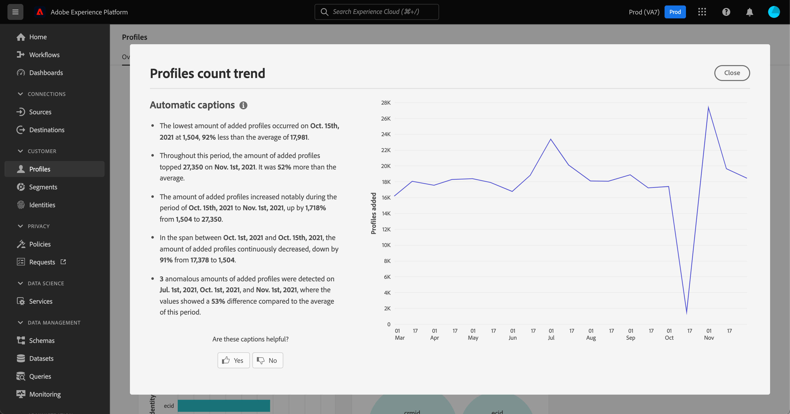

# [!UICONTROL Profili] dashboard

L’interfaccia utente di Adobe Experience Platform fornisce una dashboard attraverso la quale puoi visualizzare informazioni importanti sul tuo [!DNL Real-time Customer Profile] come acquisiti durante un&#39;istantanea giornaliera. Questa guida illustra come accedere e utilizzare [!UICONTROL Profili] dashboard nell’interfaccia utente e fornisce informazioni sulle metriche visualizzate nel dashboard.

Per una panoramica di tutte le funzioni Profilo nell’interfaccia utente di Experience Platform, visita la [Guida all’interfaccia utente del profilo cliente in tempo reale](../../profile/ui/user-guide.md).

## Dati del dashboard del profilo

La [!UICONTROL Profili] Il dashboard visualizza un&#39;istantanea dei dati dell&#39;attributo (record) della tua organizzazione all&#39;interno dell&#39;archivio profili in Experience Platform. Lo snapshot non include dati di eventi (serie temporali).

I dati attributo nello snapshot mostrano esattamente come vengono visualizzati nel momento specifico in cui è stata acquisita l&#39;istantanea. In altre parole, lo snapshot non è un&#39;approssimazione o un esempio dei dati e il dashboard Profilo non viene aggiornato in tempo reale.

>[!NOTE]
>
>Eventuali modifiche o aggiornamenti apportati ai dati dall&#39;acquisizione dello snapshot non verranno visualizzati nel dashboard fino all&#39;acquisizione dello snapshot successivo.

## Esplorazione delle [!UICONTROL Profili] dashboard

Per passare al [!UICONTROL Profili] nell’interfaccia utente di Platform, seleziona **[!UICONTROL Profili]** nella barra a sinistra, seleziona la **[!UICONTROL Panoramica]** per visualizzare il dashboard.

>[!NOTE]
>
>Se la tua organizzazione è nuova di Platform e non dispone ancora di set di dati di profilo attivi o di criteri di unione creati, la [!UICONTROL Profili] dashboard non è visibile. Invece, [!UICONTROL Panoramica] visualizza collegamenti e documentazione per iniziare a usare Profilo cliente in tempo reale.

### Modifica della [!UICONTROL Profili] dashboard

Puoi modificare l’aspetto della [!UICONTROL Profili] dashboard selezionando **[!UICONTROL Modifica dashboard]**. Questo consente di spostare, aggiungere e rimuovere i widget dal dashboard e di accedere al **[!UICONTROL Libreria widget]** per esplorare i widget disponibili e creare widget personalizzati per la tua organizzazione.

Fai riferimento alla [modifica delle dashboard](../customize/modify.md) e [panoramica della libreria widget](../customize/widget-library.md) documentazione per ulteriori informazioni.

## Unisci criteri {#merge-policies}

Le metriche visualizzate nel [!UICONTROL Profili] Il dashboard si basa sui criteri di unione applicati ai dati del profilo cliente in tempo reale. Quando i dati vengono riuniti da più sorgenti per creare il profilo del cliente, è possibile che contengano valori in conflitto (ad esempio, un set di dati può elencare un cliente come &quot;singolo&quot;, mentre un altro set di dati può elencare il cliente come &quot;sposato&quot;). È compito del criterio di unione determinare quali dati assegnare priorità e visualizzare come parte del profilo.

Per ulteriori informazioni sui criteri di unione, tra cui come creare, modificare e dichiarare un criterio di unione predefinito per l&#39;organizzazione, leggere innanzitutto il [panoramica dei criteri di unione](../../profile/merge-policies/overview.md).

Il dashboard selezionerà automaticamente un criterio di unione da visualizzare, ma sarà possibile modificare il criterio di unione selezionato utilizzando il menu a discesa. Per scegliere un criterio di unione diverso, selezionare il menu a discesa accanto al nome del criterio di unione, quindi selezionare il criterio di unione che si desidera visualizzare.

>[!NOTE]
>
>Il menu a discesa mostra solo i criteri di unione relativi alla classe di profilo individuale XDM. Tuttavia, se l&#39;organizzazione ha creato più criteri di unione, potrebbe essere necessario scorrere per visualizzare l&#39;elenco completo dei criteri di unione disponibili.

## Widget e metriche

Il dashboard è composto da widget, che sono metriche di sola lettura che forniscono informazioni importanti sui dati del profilo.

La data e l’ora &quot;ultimo aggiornamento&quot; di un widget mostrano quando è stata acquisita l’ultima istantanea dei dati. La data e l’ora dell’istantanea sono indicate in UTC; non si trova nel fuso orario del singolo utente o dell’organizzazione IMS.

## Widget standard

Adobe fornisce diversi widget standard che puoi utilizzare per visualizzare diverse metriche correlate ai dati del profilo. Puoi anche creare widget personalizzati da condividere con la tua organizzazione utilizzando [!UICONTROL Libreria widget]. Per ulteriori informazioni sulla creazione di widget personalizzati, si prega di iniziare leggendo [panoramica della libreria widget](../customize/widget-library.md).

Per ulteriori informazioni su ciascuno dei widget standard disponibili, seleziona il nome di un widget dal seguente elenco:

* [[!UICONTROL Numero di profili]](#profile-count)
* [[!UICONTROL Profili aggiunti]](#profiles-added)
* [[!UICONTROL Tendenza del conteggio dei profili]](#profiles-count-trend)
* [[!UICONTROL Profili per identità]](#profiles-by-identity)
* [[!UICONTROL Sovrapposizione identità]](#identity-overlap)

### [!UICONTROL Numero di profili] {#profile-count}

La **[!UICONTROL Numero di profili]** nel widget viene visualizzato il numero totale di profili uniti all’interno dell’archivio profili al momento dell’acquisizione dello snapshot. Questo numero è il risultato dell’applicazione del criterio di unione selezionato ai dati del profilo per unire i frammenti di profilo in modo da formare un unico profilo per ogni singolo utente.

Consulta la sezione [sezione sui criteri di unione in precedenza in questo documento](#merge-policies) per saperne di più.

>[!NOTE]
>
>La [!UICONTROL Numero di profili] widget può mostrare un numero diverso dal conteggio del profilo mostrato sul [!UICONTROL Sfoglia] nella scheda [!UICONTROL Profili] per diversi motivi. La ragione più comune è che [!UICONTROL Sfoglia] fa riferimento al numero totale di profili uniti in base ai criteri di unione predefiniti della tua organizzazione, mentre la [!UICONTROL Numero di profili] Il widget fa riferimento al numero totale di profili uniti in base al criterio di unione selezionato per la visualizzazione nel dashboard.
>
>Un altro motivo comune è dovuto alle differenze tra il momento in cui viene acquisita l’istantanea del dashboard e il momento in cui il processo di esempio viene eseguito per la [!UICONTROL Sfoglia] scheda . Puoi vedere quando [!UICONTROL Numero di profili] l&#39;ultimo aggiornamento del widget è stato eseguito guardando la marca temporale nel widget e per ulteriori informazioni sull&#39;attivazione del processo di esempio nel [!UICONTROL Sfoglia] scheda , vedi [sezione conteggio profilo nella guida all’interfaccia utente del profilo cliente in tempo reale](https://experienceleague.adobe.com/docs/experience-platform/profile/ui/user-guide.html?lang=en#profile-count).

### [!UICONTROL Profili aggiunti] {#profiles-added}

La **[!UICONTROL Profili aggiunti]** widget visualizza il numero totale di profili uniti aggiunti all’archivio profili a partire dall’ultima istantanea acquisita. Questo numero è il risultato dell’applicazione del criterio di unione selezionato ai dati del profilo per unire i frammenti di profilo in modo da formare un unico profilo per ogni singolo utente. Puoi utilizzare il selettore a discesa per visualizzare i profili aggiunti negli ultimi 30 giorni, 90 giorni o 12 mesi.

>[!NOTE]
>
>La [!UICONTROL Profili aggiunti] il widget riflette il numero di profili aggiunti dopo la configurazione dell’archivio profili e l’acquisizione dei profili. In altre parole, se la tua organizzazione configurasse l’archivio profili e acquisisse 4.000.000 il giorno 1, entro 24 ore il dashboard sarebbe disponibile, tuttavia il [!UICONTROL Profili aggiunti] widget è impostato su 0. Questo viene fatto per evitare un picco associato all’acquisizione iniziale di profili nel sistema. Nei successivi 30 giorni, l’organizzazione acquisisce ulteriori 1.000.000 profili nell’archivio profili. Dopo l&#39;istantanea successiva, la [!UICONTROL Profili aggiunti] Il widget mostrerebbe un totale di 1.000.000 profili aggiunti, mentre il [!UICONTROL Numero di profili] Il widget visualizzava 5.000.000 profili totali.

### [!UICONTROL Tendenza del conteggio dei profili] {#profiles-count-trend}

La **[!UICONTROL Tendenza del conteggio dei profili]** Il widget visualizza il numero totale di profili uniti che sono stati aggiunti ogni giorno all’archivio profili negli ultimi 30 giorni, 90 giorni o 12 mesi. Questo numero viene aggiornato ogni giorno in cui viene acquisita l’istantanea, pertanto se desideri acquisire profili in Platform, il numero di profili non verrà riportato fino a quando non viene acquisita l’istantanea successiva. Il conteggio dei profili aggiunti è il risultato dell’applicazione dei criteri di unione selezionati ai dati del profilo per unire i frammenti di profilo in modo da formare un unico profilo per ogni singolo utente.

Consulta la sezione [sezione sui criteri di unione in precedenza in questo documento](#merge-policies) per saperne di più.

La **[!UICONTROL Tendenza al conteggio dei profili]** in alto a destra del widget viene visualizzato il pulsante &quot;didascalie&quot;. Seleziona **[!UICONTROL Sottotitoli]** per aprire la finestra di dialogo didascalie automatiche.

Un modello di apprendimento automatico genera automaticamente didascalie per descrivere le tendenze chiave e gli eventi importanti analizzando il grafico e i dati.

### [!UICONTROL Profili per identità] {#profiles-by-identity}

La **[!UICONTROL Profili per identità]** Il widget visualizza la suddivisione delle identità in tutti i profili uniti nel tuo archivio profili. Il numero totale di profili per identità (in altre parole, l’aggiunta insieme dei valori mostrati per ogni spazio dei nomi) potrebbe essere superiore al numero totale di profili uniti, in quanto a un profilo potrebbero essere associati più namespace. Ad esempio, se un cliente interagisce con il tuo marchio su più di un canale, a quel singolo cliente saranno associati più namespace.

Consulta la sezione [sezione sui criteri di unione in precedenza in questo documento](#merge-policies) per saperne di più.

Per saperne di più sulle identità, visita il [Documentazione del servizio Adobe Experience Platform Identity](../../identity-service/home.md).

### [!UICONTROL Sovrapposizione identità] {#identity-overlap}

La **[!UICONTROL Sovrapposizione identità]** Il widget visualizza un diagramma di Venn, o diagramma di set, che mostra la sovrapposizione di profili nel tuo archivio profili contenenti più identità.

Dopo aver utilizzato i menu a discesa del widget per selezionare le identità da confrontare, i cerchi visualizzano la dimensione relativa di ogni identità, con il numero di profili contenenti entrambi i namespace rappresentati dalla dimensione della sovrapposizione tra i cerchi. Se un cliente interagisce con il tuo marchio su più di un canale, a quel singolo cliente saranno associate più identità, pertanto è probabile che la tua organizzazione abbia più profili contenenti frammenti da più di una identità.

Per ulteriori informazioni sui frammenti di profilo, inizia leggendo la sezione su [frammenti di profilo e profili uniti](https://experienceleague.adobe.com/docs/experience-platform/profile/home.html?lang=en#profile-fragments-vs-merged-profiles) nella panoramica Profilo cliente in tempo reale.

Per saperne di più sulle identità, visita il [Documentazione del servizio Adobe Experience Platform Identity](../../identity-service/home.md).

## Passaggi successivi

Seguendo questo documento, ora dovresti essere in grado di individuare il dashboard Profiles e comprendere le metriche visualizzate nei widget disponibili. Per ulteriori informazioni sull’utilizzo di [!DNL Profile] nell’interfaccia utente di Experience Platform, fai riferimento alla [Guida all’interfaccia utente del profilo cliente in tempo reale](../../profile/ui/user-guide.md).
