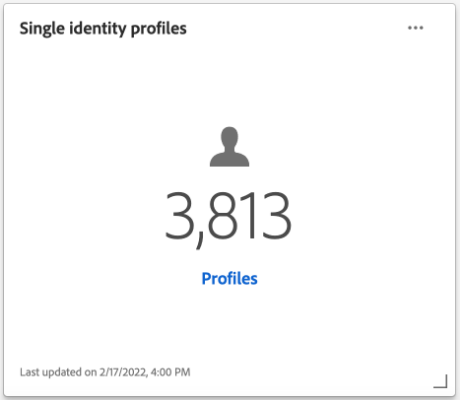

# [!UICONTROL Profili] dashboard

L’interfaccia utente di Adobe Experience Platform fornisce una dashboard attraverso la quale puoi visualizzare informazioni importanti sulla tua [!DNL Real-Time Customer Profile] dati acquisiti durante un&#39;istantanea giornaliera. Questa guida illustra come accedere e utilizzare il dashboard Profili nell’interfaccia utente di e fornisce informazioni sulle metriche visualizzate nel dashboard.

Consulta la sezione [Guida all’interfaccia utente del profilo cliente in tempo reale](../../profile/ui/user-guide.md) per una panoramica delle funzioni di profilo nell’interfaccia utente di Experienci Platform.

## Dati dashboard profilo

Nel dashboard Profili viene visualizzata un’istantanea dei dati attributo (record) di cui dispone la tua organizzazione nell’archivio profili di Experienci Platform. Lo snapshot non include dati di eventi (serie temporali).

I dati attributo nello snapshot mostrano i dati esattamente come vengono visualizzati nel momento specifico in cui lo snapshot è stato creato. In altre parole, l’istantanea non è un’approssimazione o un esempio dei dati e il dashboard Profilo non viene aggiornato in tempo reale.

>[!NOTE]
>
>Eventuali modifiche o aggiornamenti apportati ai dati dal momento in cui è stata acquisita l’istantanea non verranno riflessi nel dashboard fino all’acquisizione dell’istantanea successiva.

## Esplorazione del dashboard Profili

Per passare al dashboard Profili nell’interfaccia utente di Platform, seleziona **[!UICONTROL Profili]** nella barra a sinistra, seleziona quindi **[!UICONTROL Panoramica]** per visualizzare il dashboard.

>[!NOTE]
>
>Se la tua organizzazione ha poca esperienza con Platform e non dispone ancora di set di dati di profilo attivi o criteri di unione creati, il dashboard Profili non è visibile. Al contrario, [!UICONTROL Panoramica] Questa scheda mostra collegamenti e documentazione utili per iniziare a utilizzare Real-Time Customer Profile.

### Modifica del dashboard Profili

Potete modificare l&#39;aspetto del quadro comandi Profili (Profiles) selezionando **[!UICONTROL Modifica dashboard]**. È possibile spostare, aggiungere, ridimensionare e rimuovere widget dal dashboard, nonché accedere a **[!UICONTROL Libreria widget]** per esplorare i widget disponibili e creare widget personalizzati per la tua organizzazione.

Per ulteriori informazioni, consulta [modifica delle dashboard](../customize/modify.md) e [Panoramica della libreria dei widget](../customize/widget-library.md) documentazione.

### Aggiungi widget {#add-widget}

Seleziona **[!UICONTROL Aggiungi widget]** per passare alla libreria widget e visualizzare un elenco dei widget disponibili da aggiungere al dashboard.

Dalla libreria dei widget è possibile sfogliare la selezione di widget di pubblico standard e personalizzati. Per informazioni su come aggiungere widget, consulta la documentazione della libreria di widget su come [aggiungi un widget](../customize/widget-library.md#add-widgets).

<!-- ## (Beta) Profile efficacy insights {#profile-efficacy-insights}

>[!IMPORTANT]
>
>The profile efficacy insight functionality is currently in beta and are not available to all users. The documentation and the functionality are subject to change.

The [!UICONTROL Efficacy] tab provides metrics on the quality and completeness of your profile data through the use of profile efficacy widgets. These widgets illustrate at a glance the composition of your profiles, trends in completeness over time, and assessments on the quality of your profile data.

See the [profile efficacy widgets section](#profile-efficacy-widgets) for more information on the widgets currently available.

The layout of this dashboard is also customizable by selecting [**[!UICONTROL Modify dashboard]**](../customize/modify.md) from the [!UICONTROL Overview] tab. -->

## Sfoglia profili {#browse-profiles}

Il [!UICONTROL Sfoglia] Questa scheda ti consente di cercare e visualizzare i profili di sola lettura acquisiti nell’organizzazione. Da qui puoi vedere informazioni importanti appartenenti al profilo sulle loro preferenze, eventi passati, interazioni e tipi di pubblico.

## Dettagli profilo {#profile-details}

Per aprire [!UICONTROL Profili] [!UICONTROL Dettaglio] workspace, seleziona un [!UICONTROL ID profilo] dall&#39;elenco.

Il [!UICONTROL Profili] [!UICONTROL Dettaglio] workspace visualizza diversi widget preconfigurati che trasmettono informazioni specifiche di quel profilo. Queste informazioni consentono di comprendere rapidamente gli attributi chiave del profilo. Puoi anche personalizzare il tuo [!UICONTROL Profili] [!UICONTROL Dettaglio] creando widget personalizzati. Consulta la sezione su [come aggiungere widget](#add-widgets) per ulteriori dettagli.

![Il [!UICONTROL Profili] [!UICONTROL Dettaglio] workspace con [!UICONTROL Dettaglio] scheda evidenziata.](../images/profiles/profile-details-workspace.png)

### Widget dettagli profilo {#widgets}

I widget dei dettagli del profilo preconfigurati sono i seguenti:

#### Profilo cliente {#customer-profile}

Il [!UICONTROL Profilo cliente] Il widget mostra il nome e il cognome dell’utente associato al profilo, nonché [!UICONTROL ID profilo]. Un ID profilo è un identificatore generato automaticamente associato a un tipo di identità e rappresenta un profilo. Per ulteriori informazioni sulle identità e sugli spazi dei nomi delle identità, consulta [panoramica delle identità](../../rtcdp/profile/identities-overview.md).

#### Attributi di base {#basic-attributes}

Il [!UICONTROL Attributi di base] widget mostra gli attributi più comunemente utilizzati per definire un singolo profilo.

#### Identità collegate {#linked-identities}

Il [!UICONTROL Identità collegate] widget mostra tutte le altre identità associate al profilo.

Per visualizzare i dettagli di identità del profilo in modo più approfondito e passare alla [!UICONTROL Identità] workspace, seleziona **[!UICONTROL Visualizza grafo identità]**.

#### Preferenze canale {#channel-preferences}

Il [!UICONTROL Preferenze canale] widget mostra i canali di comunicazione da cui l’utente ha acconsentito a ricevere comunicazioni. Un segno di spunta indica ogni canale da cui l’utente ha acconsentito a ricevere comunicazioni.

<!-- image needs a blue tick added below -->

Il consenso del cliente e le preferenze di contatto sono argomenti complessi. Per scoprire come raccogliere, elaborare e filtrare le preferenze di consenso e contesto in questo Experience Platform, ti consigliamo di leggere i seguenti documenti:

* Per informazioni sui gruppi di campi dello schema necessari per [raccogliere i dati sul consenso in base allo standard Adobe](../../landing/governance-privacy-security/consent/adobe/overview.md), consulta la documentazione su questi gruppi di campi schema abilitati per il profilo.
   * [[!UICONTROL Dettagli su consenso e preferenze]](../../xdm/field-groups/profile/consents.md)
   * [[!UICONTROL IdentityMap]](../../xdm/field-groups/profile/identitymap.md) (richiesto se si utilizza Platform Web SDK o Mobile SDK per inviare segnali di consenso)
* Per informazioni su come elaborare i dati di consenso e preferenze del cliente utilizzando lo standard di Adobe, consulta la panoramica su [elaborazione del consenso in Experienci Platform](../../landing/governance-privacy-security/consent/adobe/overview.md).
* È possibile utilizzare una governance dei dati e un criterio di consenso combinati per filtrare i profili per la segmentazione in base alle loro preferenze di consenso e alle regole organizzative stabilite. Per informazioni su come creare e utilizzare questi criteri combinati, consulta la guida utente su [gestione dei criteri di utilizzo dei dati](../../data-governance/policies/user-guide.md#combine-policies).

### Aggiungi widget {#add-widgets}

Per aggiungere widget personalizzati al [!UICONTROL Profili] [!UICONTROL Dettaglio] workspace, seleziona **[!UICONTROL Personalizza dettagli profilo]**.

![L’area di lavoro Dettagli profili con [!UICONTROL Personalizza dettagli profilo] evidenziato.](../images/profiles/customize-profile-details.png)

Ora potete modificare l&#39;area di lavoro ridimensionando o riposizionando i widget. Seleziona **[!UICONTROL Aggiungi widget]** per creare un widget con attributi personalizzati.

![Profili [!UICONTROL Dettaglio] workspace con [!UICONTROL Aggiungi widget] evidenziato.](../images/profiles/add-widget.png)

Viene visualizzato il creatore del widget. Immetti un nome descrittivo per il widget in [!UICONTROL Titolo carta] campo di testo e selezione **[!UICONTROL Aggiungi attributi]**.

![L’area di lavoro di creazione del widget con [!UICONTROL Titolo carta] campo e [!UICONTROL Aggiungi attributi] evidenziato.](../images/profiles/widget-creator.png)

Viene visualizzata una finestra di dialogo che contiene una visualizzazione dello schema di unione del profilo. Utilizza il campo di ricerca o scorri per trovare gli attributi sui quali desideri creare rapporti con il tuo widget. Selezionare la casella di controllo per gli attributi che si desidera includere. Seleziona **[!UICONTROL Seleziona]** per continuare il flusso di lavoro di creazione.

>[!TIP]
>
>Una selezione della casella di controllo di primo livello include tutti gli elementi figlio.

![Il diagramma schema di unione con la casella di controllo dell’attributo fedeltà e [!UICONTROL Seleziona] evidenziato.](../images/profiles/union-schema-attributes.png)

Nell’area di lavoro viene visualizzata un’anteprima del widget completato. Una volta scelti gli attributi desiderati, seleziona **[!UICONTROL Salva]** per confermare le scelte e tornare al [!UICONTROL Profili] [!UICONTROL Dettaglio] Workspace. Il widget appena creato è ora visibile nell’area di lavoro.

## Criteri di unione {#merge-policies}

Le metriche visualizzate nel dashboard Profili sono basate su criteri di unione applicati ai dati Profilo cliente in tempo reale. Quando i dati vengono riuniti da più origini per creare il profilo cliente, i dati possono contenere valori in conflitto. Ad esempio, un set di dati può elencare un cliente come &quot;singolo&quot;, mentre un altro set di dati può elencare il cliente come &quot;sposato&quot;. È compito del criterio di unione determinare quali dati assegnare la priorità e visualizzare come parte del profilo.

Per ulteriori informazioni sui criteri di unione, tra cui le modalità di creazione, modifica e dichiarazione di un criterio di unione predefinito per l’organizzazione, vedere [panoramica dei criteri di unione](../../profile/merge-policies/overview.md).

Il dashboard seleziona automaticamente un criterio di unione da utilizzare. Il criterio di unione applicato può essere modificato utilizzando il menu a discesa accanto al nome del criterio di unione.

>[!NOTE]
>
>Il menu a discesa mostra solo i criteri di unione che utilizzano `_xdm.context.profile` schema. Tuttavia, se l’organizzazione ha creato più criteri di unione, potrebbe essere necessario scorrere per visualizzare l’elenco completo dei criteri di unione disponibili.

## Schemi di unione

Il [!UICONTROL Schema di unione] nel dashboard viene visualizzato lo schema di unione per una classe XDM specifica. Selezionando **[!UICONTROL Classe]** a discesa, puoi visualizzare gli schemi di unione per diverse classi XDM.

Gli schemi di unione sono composti da più schemi che condividono la stessa classe e sono stati abilitati per Profilo. Consentono di visualizzare in un&#39;unica vista, una combinazione di ogni campo contenuto all&#39;interno di ogni schema che condivide la stessa classe.

Per ulteriori informazioni su [visualizzazione degli schemi di unione nell’interfaccia utente di Platform](../../profile/ui/union-schema.md#view-union-schemas), consulta la guida dell’interfaccia utente dello schema di unione.

## Widget e metriche

La dashboard è composta da widget, metriche di sola lettura che forniscono informazioni importanti sui dati del profilo.

La data e l&#39;ora dell&#39;istantanea più recente vengono visualizzate nella parte superiore della [!UICONTROL Panoramica] scheda accanto al menu a discesa dei criteri di unione. Tutti i dati del widget sono accurati a partire da quella data e ora. Il timestamp dell’istantanea viene fornito in UTC; non si trova nel fuso orario del singolo utente o organizzazione.

## Widget predefiniti {#default-widgets}

Per tutte le nuove istanze di Adobe Experience Platform viene fornito un widget predefinito che evidenzia le informazioni più recenti disponibili dai dati. I seguenti widget sono preconfigurati nella vista dei segmenti fin dall’inizio. Per informazioni complete sullo scopo e la funzione dei widget, vedi sotto.

* [[!UICONTROL Conteggio dei profili]](#profile-count)
* [[!UICONTROL Modifica del conteggio dei profili]](#profile-count-change)
* [[!UICONTROL Tendenza di modifica del conteggio dei profili]](#profiles-count-change-trend)
* [[!UICONTROL Profili per identità]](#profiles-by-identity)
* [[!UICONTROL Sovrapposizione di identità]](#identity-overlap)

>[!NOTE]
>
>A partire dal 26 luglio 2023, la [!UICONTROL Profili], [!UICONTROL Tipi di pubblico], e [!UICONTROL Destinazioni] Le dashboard Panoramica sono state reimpostate su un nuovo widget predefinito per tutti gli utenti che non hanno modificato le proprie visualizzazioni nei sei mesi precedenti. Consulta la documentazione in [Destinazioni](./destinations.md#default-widgets) e [Tipi di pubblico](./audiences.md#default-widgets) sezioni di widget predefinite per i dettagli sui widget inclusi come parte dei caricamenti di widget predefiniti. Puoi continuare a personalizzare i widget del dashboard come prima.

## Widget di IA per l’analisi dei clienti {#customer-ai-profiles-widgets}

Customer AI viene utilizzato per generare punteggi di propensione personalizzati, come abbandono e conversione per singoli profili su grande scala. IA per l’analisi dei clienti esegue questa operazione analizzando i dati esistenti dell’evento esperienza del consumatore per prevedere **punteggi di tendenza di abbandono o conversione**. Questi modelli di propensione dei clienti ad alta precisione consentono segmentazione e targeting più precisi. Il [distribuzione dei punteggi](#customer-ai-distribution-of-scores) e [riepilogo punteggio](#customer-ai-scoring-summary) approfondimenti dimostrano la divisione del pubblico. Evidenzia quali profili hanno una propensione elevata/bassa/media e come sono distribuiti nei conteggi dei profili.

* [[!UICONTROL Riepilogo punteggio di AI per l’analisi dei clienti]](#customer-ai-scoring-summary)
* [[!UICONTROL Distribuzione dei punteggi in IA per l’analisi dei clienti]](#customer-ai-distribution-of-scores)

### [!UICONTROL Distribuzione dei punteggi in IA per l’analisi dei clienti] {#customer-ai-distribution-of-scores}

>[!CONTEXTUALHELP]
>id="platform_dashboards_profiles_distributionOfScores"
>title="Distribuzione dei punteggi"
>abstract="Questo widget mostra la distribuzione del numero totale di profili in base ai punteggi di propensione, con incrementi del 5%. La distribuzione del conteggio dei profili è determinata dal modello di IA e dal criterio di unione selezionati. Puoi modificare il modello di IA dal menu a discesa sotto il titolo del widget."

Il [!UICONTROL Distribuzione dei punteggi in IA per l’analisi dei clienti] il widget categorizza il numero totale di profili in base ai loro punteggi di propensione. La distribuzione del conteggio dei profili è determinata dal modello di IA e dal criterio di unione selezionato, quindi viene visualizzata con incrementi del 5% che ne indicano la propensione. Il conteggio dei profili viene fornito lungo l’asse Y e i punteggi di propensione vengono forniti lungo l’asse X.

>[!NOTE]
>
>Se la visualizzazione è un punteggio di propensione alla conversione, i punteggi alti sono in verde e quelli bassi in rosso. Se prevedi una propensione all’abbandono, questo viene capovolto, i punteggi alti sono in rosso e i punteggi bassi in verde. Il bucket medio rimane giallo indipendentemente dal tipo di propensione scelto.

Il modello di intelligenza artificiale che determina i punteggi di tendenza viene scelto dal selettore a discesa sotto il titolo del widget. Il menu a discesa contiene un elenco di tutti i modelli di IA per l’analisi dei clienti configurati. Seleziona il modello di intelligenza artificiale appropriato per l’analisi dall’elenco dei modelli disponibili. Se non è disponibile alcun modello di IA per l’analisi dei clienti, un messaggio all’interno del widget indica di configurare almeno un modello di IA per l’analisi dei clienti e fornisce un collegamento ipertestuale alla pagina di configurazione del modello di IA per l’analisi dei clienti. Per istruzioni su, consulta la documentazione di [come configurare un’istanza di Customer AI](../../intelligent-services/customer-ai/user-guide/configure.md).

>[!NOTE]
>
>Seleziona il menu a discesa immediatamente sotto la scheda della panoramica per modificare il criterio di unione che determina quali profili includere nell’analisi. Consulta la sezione su [criteri di unione](#merge-policies) per una breve descrizione o [panoramica dei criteri di unione](../../profile/merge-policies/overview.md) per ulteriori dettagli.

Per passare alla pagina approfondimenti dettagliata per il modello di IA per l’analisi dei clienti selezionato, seleziona **[!UICONTROL Visualizza dettagli modello]**.

![Il dashboard Tipi di pubblico di Experience Platform con [!UICONTROL Distribuzione dei punteggi in IA per l’analisi dei clienti] widget [!UICONTROL Visualizza dettagli modello] evidenziato.](../images/segments/customer-ai-distribution-of-scores.png)

Viene visualizzata la pagina dettagliata Approfondimenti modello.

Ulteriori informazioni su Customer AI sono disponibili sul sito [guida all’interfaccia utente di insights](../../intelligent-services/customer-ai/user-guide/discover-insights.md).

### [!UICONTROL Riepilogo punteggio di AI per l’analisi dei clienti] {#customer-ai-scoring-summary}

>[!CONTEXTUALHELP]
>id="platform_dashboards_profiles_scoringSummary"
>title="Riepilogo punteggio"
>abstract="Questo widget mostra il numero totale di profili con punteggio e li categorizza in contenitori a seconda della propensione alta, media e bassa. Il grafico ad anello illustra la composizione proporzionale dei profili totali con propensione alta, media e bassa."

Questo widget visualizza il numero totale di profili valutati e li categorizza in contenitori contenenti propensione alta, media e bassa rispettivamente come verde, giallo e rosso. Un grafico ad anello illustra la composizione proporzionale dei profili tra propensione alta, media e bassa. Un profilo può avere una propensione elevata superiore a 75, una propensione media compresa tra 25 e 74 e una bassa propensione inferiore a 24. Una legenda indica il codice del colore e le soglie di propensione. I conteggi dei profili per le propensione alta, media e bassa vengono visualizzati in una finestra di dialogo quando il cursore passa sopra la rispettiva sezione del grafico ad anello.

>[!NOTE]
>
>Se la visualizzazione è un punteggio di propensione alla conversione, i punteggi alti sono in verde e quelli bassi in rosso. Se prevedi una propensione all’abbandono, questo viene capovolto, i punteggi alti sono in rosso e i punteggi bassi in verde. Il bucket medio rimane giallo indipendentemente dal tipo di propensione scelto.

Il menu a discesa sotto il titolo del widget fornisce un elenco di tutti i modelli di IA per l’analisi dei clienti configurati. Seleziona il modello di intelligenza artificiale appropriato per l’analisi dall’elenco dei modelli disponibili. Se non è disponibile alcun modello di IA per l’analisi dei clienti, un messaggio all’interno del widget indica di configurare almeno un modello di IA per l’analisi dei clienti e fornisce un collegamento ipertestuale alla pagina di configurazione del modello di IA per l’analisi dei clienti. Consulta la documentazione su [come configurare un’istanza di Customer AI](../../intelligent-services/customer-ai/user-guide/configure.md) per istruzioni dettagliate.

>[!NOTE]
>
>Il numero totale di profili calcolati dipende dal criterio di unione scelto. Per modificare il criterio di unione utilizzato, seleziona il menu a discesa immediatamente sotto la scheda della panoramica. Consulta la sezione su [criteri di unione](#merge-policies) per una breve descrizione o [panoramica dei criteri di unione](../../profile/merge-policies/overview.md) per ulteriori dettagli.

Per passare alla pagina approfondimenti dettagliata per il modello di IA per l’analisi dei clienti selezionato, seleziona **[!UICONTROL Visualizza dettagli modello]**. Ulteriori informazioni su Customer AI sono disponibili sul sito [guida all’interfaccia utente di insights](../../intelligent-services/customer-ai/user-guide/discover-insights.md).

## Widget standard {#standard-widgets}

Adobe fornisce più widget standard da utilizzare per visualizzare diverse metriche relative ai dati profilo. Puoi anche creare widget personalizzati da condividere con la tua organizzazione utilizzando [!UICONTROL Libreria widget]. Per ulteriori informazioni sulla creazione di widget personalizzati, leggere [Panoramica della libreria dei widget](../customize/widget-library.md).

Per ulteriori informazioni su ciascuno dei widget standard disponibili, selezionare il nome di un widget dall&#39;elenco seguente:

* [[!UICONTROL Conteggio dei profili]](#profile-count)
* [[!UICONTROL Tendenza conteggio profili]](#profile-count-trend)
* [[!UICONTROL Modifica del conteggio dei profili]](#profile-count-change)
* [[!UICONTROL Tendenza di modifica del conteggio dei profili]](#profiles-count-change-trend)
* [[!UICONTROL Tendenza di modifica del conteggio dei profili per identità]](#profiles-count-change-trend-by-identity)
* [[!UICONTROL Profili per identità]](#profiles-by-identity)
* [[!UICONTROL Sovrapposizione di identità]](#identity-overlap)
* [[!UICONTROL Profili a identità singola]](#single-identity-profiles)
* [[!UICONTROL Profili di identità singola per identità]](#single-identity-profiles-by-identity)
* [[!UICONTROL Profili non segmentati]](#unsegmented-profiles)
* [[!UICONTROL Tendenza di modifica dei profili non segmentati]](#unsegmented-profiles-change-trend)
* [[!UICONTROL Profili non segmentati per identità]](#unsegmented-profiles-by-identity)
* [[!UICONTROL Tipi di pubblico]](#audiences)
* [[!UICONTROL Tipi di pubblico mappati allo stato di destinazione]](#audiences-mapped-to-destination-status)
* [[!UICONTROL Dimensione pubblico]](#audiences-size)
* [[!UICONTROL Sovrapposizione del pubblico con criterio di unione]](#audience-overlap-by-merge-policy)
* [[!UICONTROL Rapporto di sovrapposizione pubblico]](#audience-overlap-report)

### [!UICONTROL Conteggio dei profili] {#profile-count}

>[!CONTEXTUALHELP]
>id="platform_dashboards_profiles_profilecount"
>title="Conteggio dei profili"
>abstract="Questo widget visualizza il numero totale di profili uniti all’interno dello store di profili al momento dell’acquisizione dello snapshot. Il numero dipende dal criterio di unione selezionato applicato ai dati dei profili."

Il **[!UICONTROL Conteggio profili]** Il widget mostra il numero totale di profili uniti nell’archivio profili al momento dello scatto dell’istantanea. Questo numero è il risultato dell’applicazione del criterio di unione selezionato ai dati del profilo per unire i frammenti di profilo in modo da formare un singolo profilo per ogni singolo utente.

Consulta la [sezione sui criteri di unione più indietro in questo documento](#merge-policies) per ulteriori informazioni.

>[!NOTE]
>
>Il [!UICONTROL Conteggio profili] widget può mostrare un numero diverso rispetto al conteggio dei profili visualizzato sul [!UICONTROL Sfoglia] scheda in [!UICONTROL Profili] dell’interfaccia utente per diversi motivi. Il motivo più comune di questa differenza è che il [!UICONTROL Sfoglia] scheda fa riferimento al numero totale di profili uniti in base al criterio di unione predefinito della tua organizzazione, mentre [!UICONTROL Conteggio profili] il widget fa riferimento al numero totale di profili uniti in base al criterio di unione selezionato per la visualizzazione nel dashboard.
>
>Un altro motivo comune è dovuto alle differenze tra il momento in cui viene acquisita l’istantanea del dashboard e il momento in cui il processo di esempio viene eseguito per [!UICONTROL Sfoglia] scheda. È possibile vedere quando [!UICONTROL Conteggio profili] l’ultimo aggiornamento del widget è stato effettuato osservando la marca temporale sul widget. Per ulteriori informazioni su come viene attivato il processo di esempio su [!UICONTROL Sfoglia] , vedere la [sezione conteggio dei profili nella guida dell’interfaccia utente del profilo cliente in tempo reale](../../profile/ui/user-guide.md#profile-count).

### [!UICONTROL Tendenza conteggio profili] {#profile-count-trend}

Il [!UICONTROL Tendenza conteggio profili] il widget utilizza un grafico a linee per illustrare la tendenza nel numero totale di profili contenuti nel sistema nel tempo. Questo numero totale include tutti i profili importati nel sistema dall’ultima istantanea giornaliera. I dati possono essere visualizzati in periodi di 30 giorni, 90 giorni e 12 mesi. Il periodo di tempo viene scelto da un menu a discesa nel widget.

### [!UICONTROL Modifica del conteggio dei profili] {#profile-count-change}

>[!CONTEXTUALHELP]
>id="platform_dashboards_profiles_profilescountchange"
>title="Modifica del conteggio dei profili"
>abstract="Questo widget visualizza il numero totale di profili uniti **aggiunti** allo store di profili al momento dell’ultimo snapshot. Il numero dipende dal criterio di unione selezionato applicato ai dati dei profili."

Il **[!UICONTROL Modifica conteggio profili]** Il widget mostra il numero di profili uniti aggiunti all’archivio profili dall’istantanea precedente. Questo numero è il risultato dell’applicazione del criterio di unione selezionato ai dati del profilo per unire i frammenti di profilo in modo da formare un singolo profilo per ogni singolo utente. Puoi utilizzare il selettore a discesa per visualizzare il numero di profili aggiunti negli ultimi 30 giorni, 90 giorni o 12 mesi.

>[!NOTE]
>
>Il [!UICONTROL Modifica conteggio profili] Il widget riflette il numero di profili aggiunti **dopo** l’acquisizione iniziale del profilo e la configurazione dell’archivio profili. In altre parole, se la tua organizzazione ha configurato l’archivio profili e ne ha acquisito 4.000.000 il Giorno 1, entro 24 ore la dashboard sarà disponibile, tuttavia il [!UICONTROL Modifica conteggio profili] il widget è impostato su 0. Questo metodo di conteggio consente di evitare un picco associato all’acquisizione iniziale dei profili nel sistema. Nei prossimi 30 giorni, la tua organizzazione acquisirà altri 1.000.000 di profili nell’archivio profili. Una volta acquisita l&#39;istantanea successiva, [!UICONTROL Modifica conteggio profili] Il widget mostra un totale di 1.000.000 di profili aggiunti, mentre il [!UICONTROL Conteggio profili] Il widget visualizzerebbe un totale di 5.000.000 di profili.

### [!UICONTROL Tendenza di modifica del conteggio dei profili] {#profiles-count-change-trend}

>[!CONTEXTUALHELP]
>id="platform_dashboards_profiles_profilesaddedtrend"
>title="Tendenza di modifica del conteggio dei profili"
>abstract="Questo widget visualizza il numero di profili uniti che sono stati aggiunti quotidianamente allo store di profili negli ultimi 30 giorni, 90 giorni o 12 mesi. Il numero dipende anche dal criterio di unione selezionato applicato ai dati di profilo."

Il **[!UICONTROL Tendenza modifica conteggio profili]** Il widget mostra il numero totale di profili uniti che sono stati aggiunti quotidianamente all’archivio profili negli ultimi 30 giorni, 90 giorni o 12 mesi. Questo numero viene aggiornato ogni giorno in cui viene acquisita l’istantanea, pertanto se si acquisiscono profili in Platform, il numero di profili non viene riportato fino all’acquisizione dell’istantanea successiva. Il numero di profili aggiunti è il risultato dell’applicazione del criterio di unione selezionato ai dati del profilo per unire i frammenti di profilo in modo da formare un singolo profilo per ogni singolo utente.

Per ulteriori informazioni, consulta [sezione sui criteri di unione più indietro in questo documento](#merge-policies).

Il **[!UICONTROL Tendenza modifica conteggio profili]** widget visualizza un pulsante &quot;sottotitoli&quot; in alto a destra del widget. Per aprire la finestra di dialogo dei sottotitoli automatici, seleziona **[!UICONTROL Sottotitoli]**.

Un modello di apprendimento automatico genera automaticamente sottotitoli per descrivere le tendenze chiave e gli eventi importanti analizzando il grafico e i dati. Le annotazioni vengono aggiunte al grafico in base alle didascalie. Seleziona una didascalia per evidenziare l’annotazione corrispondente.

### [!UICONTROL Tendenza di modifica del conteggio dei profili per identità] {#profiles-count-change-trend-by-identity}

<!-- This widget uses a line graph to illustrate the change in number of profiles filtered by a chosen source identity and merge policy. -->

Questo widget filtra il conteggio dei profili in base a un’identità di origine selezionata e unisce i criteri, quindi illustra la modifica del numero per vari periodi utilizzando un grafico a linee. Il criterio di unione è selezionato dal menu a discesa Panoramica nella parte superiore della pagina, l’identità di origine e il periodo di tempo sono selezionati dai menu a discesa dei widget. La tendenza può essere visualizzata in periodi di 30 giorni, 90 giorni e 12 mesi.

Questo widget consente di gestire le esigenze di attivazione della destinazione dimostrando il pattern di crescita dei profili filtrati da un’identità richiesta.

### [!UICONTROL Profili per identità] {#profiles-by-identity}

>[!CONTEXTUALHELP]
>id="platform_dashboards_profiles_profilesbyidentity"
>title="Profili per identità"
>abstract="Questo widget visualizza il raggruppamento per identità di tutti i profili uniti nell’archivio dei profili."

Il **[!UICONTROL Profili per identità]** Il widget mostra il raggruppamento delle identità in tutti i profili uniti nel tuo archivio profili. Il numero totale di profili per identità (in altre parole, la somma dei valori mostrati per ogni spazio dei nomi) può essere maggiore del numero totale di profili uniti, perché a un profilo potrebbero essere associati più spazi dei nomi. Ad esempio, se un cliente interagisce con il tuo marchio su più di un canale, a quel singolo cliente verranno associati più spazi dei nomi.

Per ulteriori informazioni, consulta [sezione sui criteri di unione più indietro in questo documento](#merge-policies).

Per aprire la finestra di dialogo dei sottotitoli automatici, seleziona **[!UICONTROL Sottotitoli]**.

Un modello di apprendimento automatico genera automaticamente informazioni sui dati analizzando la distribuzione complessiva e le dimensioni chiave dei dati.

Per ulteriori informazioni sulle identità, consulta [Documentazione del servizio Adobe Experience Platform Identity](../../identity-service/home.md).

### [!UICONTROL Sovrapposizione di identità] {#identity-overlap}

>[!CONTEXTUALHELP]
>id="platform_dashboards_profiles_identityoverlap"
>title="Sovrapposizione di identità"
>abstract="Questo widget visualizza mediante un diagramma di Venn la sovrapposizione dei profili nell’archivio dei profili che contengono le due identità selezionate."

Il **[!UICONTROL Sovrapposizione identità]** Il widget utilizza un diagramma di Venn, o diagramma di set, per visualizzare la sovrapposizione dei profili nell’archivio profili che contengono le due identità selezionate.

Utilizza i menu a discesa dei widget per selezionare le identità che desideri confrontare. Nei cerchi viene visualizzato il conteggio totale relativo dei profili che contengono ogni identità. Il numero di profili contenenti entrambe le identità è rappresentato dalla dimensione della sovrapposizione tra i cerchi. Se un cliente interagisce con il tuo marchio su più di un canale, a quel singolo cliente verranno associate più identità. In questa situazione, è probabile che la tua organizzazione disponga di più profili contenenti frammenti di più identità.

Per ulteriori informazioni sui frammenti di profilo, consulta la sezione su [frammenti di profilo e profili uniti](../../profile/home.md#profile-fragments-vs-merged-profiles) nella panoramica del profilo cliente in tempo reale.

Per ulteriori informazioni sulle identità, consulta [Documentazione del servizio Adobe Experience Platform Identity](../../identity-service/home.md).

### [!UICONTROL Profili a identità singola] {#single-identity-profiles}

>[!CONTEXTUALHELP]
>id="platform_dashboards_profiles_singleidentityprofiles"
>title="Profili a identità singola"
>abstract="Questo widget fornisce un conteggio dei profili della tua organizzazione con un solo tipo di ID che ne crea l’identità. Questo tipo di ID può essere un indirizzo e-mail o un ECID."

Il [!UICONTROL Profili di identità singola] Il widget fornisce un conteggio dei profili della tua organizzazione che hanno un solo tipo di ID che crea la loro identità. Questo tipo di ID può essere un indirizzo e-mail o un ECID. Il conteggio dei profili viene generato dai dati contenuti nello snapshot più recente.

### [!UICONTROL Profili di identità singola per identità] {#single-identity-profiles-by-identity}

Questo widget utilizza un grafico a barre per illustrare il numero totale di profili identificati con un solo identificatore univoco. Il widget supporta fino a cinque delle identità più comuni.

Per visualizzare una finestra di dialogo che descrive il conteggio totale dei profili per un’identità, utilizza il cursore per passare il puntatore sulle singole barre.

### [!UICONTROL Profili non segmentati] {#unsegmented-profiles}

>[!CONTEXTUALHELP]
>id="platform_dashboards_profiles_unsegmentedprofiles"
>title="Profili non segmentati"
>abstract="Questo widget fornisce il numero totale di tutti i profili non associati ad alcun pubblico e rappresenta l’opportunità di attivazione profilo nell’organizzazione."

Il [!UICONTROL Profili non segmentati] Il widget fornisce il numero totale di tutti i profili non associati ad alcun pubblico. Il numero generato è preciso all’ultima istantanea e rappresenta l’opportunità di attivazione del profilo nell’organizzazione. Indica anche l’opportunità di eliminare i profili che non forniscono un ROI adeguato.

### [!UICONTROL Tendenza di modifica dei profili non segmentati] {#unsegmented-profiles-change-trend}

>[!CONTEXTUALHELP]
>id="platform_dashboards_profiles_unsegmentedprofilestrend"
>title="Tendenza dei profili non segmentati"
>abstract="Questo widget fornisce un’illustrazione del grafico a linee per il numero di profili che non sono collegati ad alcun pubblico in un dato periodo di tempo. La tendenza dei profili non collegati ad alcun pubblico può essere visualizzata su periodi di 30 giorni, 90 giorni e 12 mesi."

Il [!UICONTROL Tendenza di modifica dei profili non segmentati] il widget utilizza un grafico a linee per illustrare il numero di profili aggiunti dall’ultima istantanea giornaliera che non sono associati ad alcun pubblico. La tendenza alla modifica dei profili non allegati ad alcun pubblico può essere visualizzata in periodi di 30 giorni, 90 giorni e 12 mesi. Il periodo di tempo viene scelto da un menu a discesa nel widget. Il conteggio dei profili si riflette sull’asse y e il tempo sull’asse x.

### [!UICONTROL Profili non segmentati per identità] {#unsegmented-profiles-by-identity}

>[!NOTE]
>
>I profili non segmentati per widget di identità sono stati dichiarati obsoleti a ottobre 2022 e non sono più disponibili.

<!-- 

>[!CONTEXTUALHELP]
>id="platform_dashboards_profiles_unsegmentedprofilesbyidentity"
>title="Unsegmented profiles by identity"
>abstract="This widget categorizes the total number of unsegmented profiles by their unique identifier."

The [!UICONTROL Unsegmented Profiles by Identity] widget categorizes the total number of unsegmented profiles by their unique identifier. The data is visualized in a bar chart for ease of comparison. 

 -->

### [!UICONTROL Tipi di pubblico] {#audiences}

Questo widget fornisce il numero totale di tipi di pubblico pronti per essere attivati, in base al criterio di unione scelto applicato ai dati del profilo.

Seleziona **[!UICONTROL Tipi di pubblico]** per passare al [!UICONTROL Tipi di pubblico] dashboard [!UICONTROL Sfoglia] scheda. Da qui puoi visualizzare un elenco di tutte le definizioni dei segmenti per la tua organizzazione.

<!-- https://jira.corp.adobe.com/browse/PLAT-115291 -->

<!-- * [[!UICONTROL Audiences change trend]](#audiences-change-trend) -->
<!-- ### [!UICONTROL Audiences change trend] {#audiences-change-trend}

This line graph widget visualizes the change in the total number of audiences each day, trending over time. The change in the number of audiences is dependent on the selected merge policy being applied to your profile data. The period of analysis is selected from the widget dropdown menu. The bar chart can be visualized over 30 days, 90 days, and 12-month periods.

The visualization allows you to monitor the overall health of audiences within Adobe Experience Platform by understanding trends in the growth or decline of the total number of audiences. -->

<!--  -->

### [!UICONTROL Rapporto di sovrapposizione pubblico] {#audience-overlap-report}

Questo widget tabula la sovrapposizione dei dati da tutti i tipi di pubblico disponibili filtrati dai criteri di unione. Per il criterio di unione scelto dal menu a discesa nella parte superiore dello schermo viene fornito un elenco di cinque tipi di pubblico, classificati dalla percentuale di sovrapposizione più alta a quella più bassa. I due tipi di pubblico analizzati sono elencati nel [!UICONTROL NOME DEL PUBBLICO] e [!UICONTROL NOME PUBBLICO B] colonne. La sovrapposizione percentuale è indicata nella terza colonna con precisione di dodici cifre decimali.

Il rapporto di sovrapposizione del pubblico consente di creare nuovi tipi di pubblico ad alte prestazioni. Osservare percentuali di sovrapposizione elevate consente di eliminare i tipi di pubblico e impedire l’invio dello stesso pubblico a destinazioni diverse. Inoltre, ti aiutano a identificare informazioni nascoste che potrebbero essere utili per una migliore segmentazione. Una sovrapposizione in percentuale bassa consente di individuare profili univoci da perseguire.

Seleziona **[!UICONTROL Visualizza altro]** per aprire una finestra di dialogo a schermo intero che contiene più dati di sovrapposizione del pubblico.

Il [!UICONTROL Rapporto di sovrapposizione pubblico] viene visualizzata. Questa finestra di dialogo può contenere fino a 50 righe di analisi di sovrapposizione del pubblico suddivise in sei colonne. Per rimuovere o aggiungere colonne dalla tabella, seleziona l’icona delle impostazioni ().

>[!NOTE]
>
>Per modificare la classificazione dei risultati dal più alto al più basso o dal più basso al più alto, selezionare la **[!UICONTROL Sovrapposizione]** intestazione di colonna.

Per scaricare l&#39;intero report in formato PDF, selezionare il menu delle opzioni (**`...`**) seguito da **[!UICONTROL Scarica]**.

Per aprire un diagramma di Venn dell&#39;analisi di sovrapposizione, selezionate una riga dal rapporto. Per visualizzare il conteggio dei profili in una finestra di dialogo, passa il cursore del mouse su una sezione del diagramma di Venn.

Seleziona **[!UICONTROL Chiudi]** per tornare al [!UICONTROL Profili] dashboard.

### [!UICONTROL Tipi di pubblico mappati allo stato di destinazione] {#audiences-mapped-to-destination-status}

Il [!UICONTROL Tipi di pubblico mappati allo stato di destinazione] widget mostra il numero totale di tipi di pubblico mappati e non mappati in una singola metrica e utilizza un grafico ad anello per illustrare la differenza proporzionale tra i rispettivi totali. I numeri calcolati dipendono dal criterio di unione scelto.

I conteggi individuali per i tipi di pubblico mappati o non mappati vengono visualizzati in una finestra di dialogo quando il cursore passa sopra la rispettiva sezione del grafico ad anello.

### [!UICONTROL Dimensione pubblico] {#audiences-size}

Il [!UICONTROL Dimensione pubblico] widget fornisce una tabella a due colonne che elenca i nomi di un massimo di 20 tipi di pubblico e il numero totale di profili contenuti in ciascun pubblico. L’elenco viene ordinato da alto a basso in base al numero totale di profili all’interno del pubblico. Il conteggio delle dimensioni totali del pubblico dipende dal criterio di unione applicato.

Per visualizzare informazioni complete su un pubblico, seleziona un nome di pubblico dall’elenco fornito per passare alla [!UICONTROL Tipi di pubblico] [!UICONTROL Dettaglio] pagina. Inoltre, selezionando **[!UICONTROL Visualizza tutti i tipi di pubblico]** dalla fine del widget, puoi passare alla [!UICONTROL Tipi di pubblico] [!UICONTROL Sfoglia] per trovare un pubblico esistente.

Consulta la documentazione per ulteriori informazioni su [[!UICONTROL Tipi di pubblico] [!UICONTROL  Sfoglia] scheda](../../segmentation/ui/overview.md#browse).

### [!UICONTROL Sovrapposizione del pubblico con criterio di unione] {#audience-overlap-by-merge-policy}

Questo widget utilizza un diagramma di Venn per visualizzare la sovrapposizione di due tipi di pubblico selezionati. Il criterio di unione viene scelto dal menu a discesa Panoramica nella parte superiore della pagina e i tipi di pubblico per l’analisi vengono selezionati da due menu a discesa all’interno del widget. Il numero totale di profili all’interno della definizione del segmento pertinente può essere visualizzato passando il cursore sopra un cerchio o l’intersezione.

Quando il widget mostra il crossover visivo delle definizioni dei segmenti, puoi ottimizzare la strategia di segmentazione studiando le somiglianze tra le definizioni dei segmenti.

<!-- ## (Beta) Profile efficacy widgets {#profile-efficacy-widgets}

>[!IMPORTANT]
>
>The profile efficacy widgets are currently in Beta and are not available to all users. The documentation and the functionality are subject to change.

Adobe provides multiple widgets to assess the completeness of the ingested profiles available for your data analysis. Each of the profile efficacy widgets can be filtered by the merge policy. To change the merge policy filter, select the[!UICONTROL Profiles using merge policy] dropdown and choose the appropriate policy from the available list.

To learn more about each of the profile efficacy widgets, select the name of a widget from the following list:

* [[!UICONTROL Attribute quality assessment]](#attributes-quality-assessment)
* [[!UICONTROL Profiles by completeness]](#profiles-by-completeness)
* [[!UICONTROL Profiles completeness trend]](#profiles-completeness-trend)

### (Beta) [!UICONTROL Attributes quality assessment] {#attributes-quality-assessment}

>[!CONTEXTUALHELP]
>id="platform_dashboards_profiles_attributesqualityassessment"
>title="Attributes quality assessment"
>abstract="This widget shows the completeness and cardinality of all profiles according to their attributes. Each row describes one attribute. The **Profiles** column provides the number of profiles that have this attribute and are filled with non-null values. The **Completeness** percentage is determined by the total number of profiles that have this attribute and are filled with non-null values divided by the total number of non-empty values in the profiles for that attribute. **Cardinality** provides the total number of unique non-null values of this attribute across all attributes."

The [!UICONTROL Attribute quality assessment] widget shows the completeness and cardinality of all profiles according to their attributes. The data is accurate to the last processing date. This information is presented as a table with four columns where each row in the table represents a single attribute.

| Column  | Description  |
|---|---|
| Attribute  | The name of the attribute.  |
| Profiles  | The number of profiles that have this attribute and are filled with non-null values.  |
| Completeness  | This percentage is determined by the total number of profiles that have this attribute and are filled with non-null values. The number is calculated by dividing the total number of profiles by the total number of non-empty values in the profiles for that attribute.  |
| Cardinality  | The total number of **unique** non-null values of this attribute. It is measured across all profiles. |

### (Beta) [!UICONTROL Profiles by completeness] {#profiles-by-completeness}

>[!CONTEXTUALHELP]
>id="platform_dashboards_profiles_profilesbycompleteness"
>title="Profiles by completeness"
>abstract="The donut chart displays the percentage of profile attributes that are filled with non-null values among all observed attributes. It illustrates the proportion of profiles that are of high, medium, or low completeness. High completeness profiles have more than 70% of their attributes filled. Medium completeness profiles have between 30% and 70% of their attributes filled. Low completeness profiles have less than 30% of their attributes filled."

The [!UICONTROL Profiles by completeness] widget creates a donut chart of profile completeness since the last processing date. The completeness of a profile is measured by the percentage of attributes that are filled with non-null values among all observed attributes.

This widget shows the proportion of profiles that are of high, medium, or low completeness. By default, there are three levels of completeness configured: 

* High completeness: Profiles have more than 70% of their attributes filled. 
* Medium completeness: Profiles have between 30% and 70% of their attributes filled. 
* Low completeness: Profiles have less than 30% of their attributes filled. 

### (Beta) [!UICONTROL Profiles completeness trend] {#profiles-completeness-trend}

>[!CONTEXTUALHELP]
>id="platform_dashboards_profiles_profilescompletenesstrend"
>title="Profiles completeness trend"
>abstract="This widget creates a stacked area chart to depict the trend of profile completeness over time. Completeness is measured by the percentage of attributes that are filled with non-null values among all observed attributes."

This widget creates a stacked area chart to depict the trend of profile completeness over time. Completeness is measured by the percentage of attributes filled with non-null values among all observed attributes. It categorizes the profile completeness as high, medium, or low completeness since the last processing date.

The x-axis represents time, the y-axis represents the number of profiles, and the colors represent the three levels of profile completeness. 

The three levels of completeness are:

* High completeness: Profiles have more than 70% of attributes filled. 
* Medium completeness: Profiles have less than 70% and more than 30% of attributes filled. 
* Low completeness: Profiles have less than 30% of attributes filled.

 -->

## Passaggi successivi

Seguendo questo documento, ora dovresti essere in grado di individuare la dashboard dei profili e comprendere le metriche visualizzate nei widget disponibili. Per ulteriori informazioni sull&#39;utilizzo di [!DNL Profile] dati nell’interfaccia utente di Experienci Platform, fai riferimento a [Guida all’interfaccia utente del profilo cliente in tempo reale](../../profile/ui/user-guide.md).
