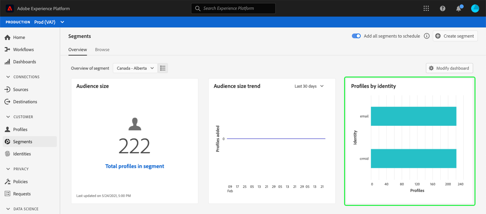

# [!UICONTROL Segmenti] dashboard {#segment-dashboard}

L’interfaccia utente di Adobe Experience Platform fornisce una dashboard attraverso la quale puoi visualizzare informazioni importanti sui segmenti, acquisite durante un’istantanea giornaliera. Questa guida illustra come accedere e lavorare con il dashboard segmenti nell’interfaccia utente e fornisce ulteriori informazioni sulle visualizzazioni visualizzate nel dashboard.

Per una panoramica di tutte le funzioni del servizio di segmentazione di Adobe Experience Platform nell’interfaccia utente di Platform, visita [Guida dell’interfaccia utente di Segmentation Service](../../segmentation/ui/overview.md).

## [!UICONTROL Segmenti] dati dashboard

Nel dashboard dei segmenti viene visualizzata un’istantanea dei dati attributo (record) di cui dispone la tua organizzazione nell’archivio profili di Experience Platform. Lo snapshot non include dati di eventi (serie temporali).

I dati attributo nello snapshot mostrano i dati esattamente come vengono visualizzati nel momento specifico in cui lo snapshot è stato creato. In altre parole, l’istantanea non è un’approssimazione o un campione dei dati e il dashboard del segmento non viene aggiornato in tempo reale.

>[!NOTE]
>
>Eventuali modifiche o aggiornamenti apportati ai dati dal momento in cui è stata acquisita l’istantanea non verranno riflessi nel dashboard fino all’acquisizione dell’istantanea successiva.

## Esplora [!UICONTROL Segmenti] dashboard {#explore}

Per passare al [!UICONTROL Segmenti] nell’interfaccia utente di Platform, seleziona **[!UICONTROL Segmenti]** nella barra a sinistra, seleziona quindi **[!UICONTROL Panoramica]** per visualizzare il dashboard.

>[!NOTE]
>
>Se la tua organizzazione non utilizza ancora Platform e non dispone ancora di set di dati di profilo attivi o criteri di unione creati, il [!UICONTROL Segmenti] dashboard non visibile. Al contrario, [!UICONTROL Panoramica] Nella scheda vengono visualizzati collegamenti e documentazione per aiutarti a iniziare a utilizzare la segmentazione.

### Modifica il [!UICONTROL Segmenti] dashboard {#modify}

È possibile modificare l&#39;aspetto del [!UICONTROL Segmenti] dashboard selezionando **[!UICONTROL Modifica dashboard]**. Questo consente di spostare, aggiungere e rimuovere widget dal dashboard, nonché di accedere al **[!UICONTROL Libreria widget]** per esplorare i widget disponibili e creare widget personalizzati per la tua organizzazione.

Consulta la sezione [modifica delle dashboard](../customize/modify.md) e [Panoramica della libreria dei widget](../customize/widget-library.md) per ulteriori informazioni.

### Aggiungi widget {#add-widget}

Seleziona **[!UICONTROL Aggiungi widget]** per passare alla libreria widget e visualizzare un elenco dei widget disponibili da aggiungere al dashboard.

Dalla libreria widget, è possibile sfogliare la selezione di widget di segmenti standard e personalizzati.Per informazioni su come aggiungere widget, consulta la documentazione della libreria di widget su come [aggiungi un widget](../customize/widget-library.md#add-widgets).

## Seleziona un segmento

Il dashboard seleziona automaticamente un segmento da visualizzare, tuttavia puoi modificarlo utilizzando il menu a discesa o il selettore di segmenti.

Per scegliere un segmento diverso, seleziona il menu a discesa accanto al nome del segmento oppure utilizza il selettore dei segmenti per aprire la finestra di dialogo per la selezione dei segmenti.

>[!IMPORTANT]
>
>Nell’elenco dei segmenti selezionabili vengono visualizzati solo i segmenti con un conteggio di profili superiore a zero.

## Widget e metriche

Il dashboard dei segmenti è composto da widget, metriche di sola lettura che forniscono informazioni importanti sul segmento selezionato.

La data e l&#39;ora dell&#39;istantanea più recente vengono visualizzate nella parte superiore della [!UICONTROL Panoramica] accanto al menu a discesa del segmento. Tutti i dati del widget sono accurati a partire da quella data e ora. Il timestamp dell’istantanea viene fornito in UTC; non si trova nel fuso orario del singolo utente o organizzazione.

## Widget standard {#standard-widgets}

Adobe fornisce più widget standard che puoi utilizzare per visualizzare diverse metriche relative ai segmenti. Puoi anche creare widget personalizzati da condividere con la tua organizzazione utilizzando [!UICONTROL Libreria widget]. Per ulteriori informazioni sulla creazione di widget personalizzati, leggere [Panoramica della libreria dei widget](../customize/widget-library.md).

Per ulteriori informazioni su ciascuno dei widget standard disponibili, selezionare il nome di un widget dall&#39;elenco seguente:

* [[!UICONTROL Dimensione pubblico]](#audience-size)
* [[!UICONTROL Ordine di attivazione pubblico]](#audience-activation-order)
* [[!UICONTROL Tendenza dimensione pubblico]](#audience-size-trend)
* [[!UICONTROL Tendenza di modifica della dimensione del pubblico]](#audience-size-change-trend)
* [[!UICONTROL Tendenza dimensione pubblico per identità]](#audience-size-trend-by-identity)
* [[!UICONTROL Sovrapposizione del pubblico]](#audience-overlap)
* [[!UICONTROL Rapporto di sovrapposizione pubblico]](#audience-overlap-report)
* [[!UICONTROL Sovrapposizione identità]](#identity-overlap)
* [[!UICONTROL Profili per identità]](#profiles-by-identity)
* [[!UICONTROL Attivazioni pianificate]](#scheduled-activations)

### [!UICONTROL Dimensione pubblico] {#audience-size}

>[!CONTEXTUALHELP]
>id="platform_dashboards_segments_audiencesize"
>title="Dimensione pubblico"
>abstract="Questo widget mostra il numero totale di profili uniti all’interno del segmento selezionato. Questo numero dipende dal criterio di unione applicato ai dati ed è corretto al momento dell’istantanea più recente."

Il **[!UICONTROL Dimensione pubblico]** widget mostra il numero totale di profili uniti all’interno del segmento selezionato al momento dello snapshot. Questo numero è il risultato dell’applicazione del criterio di unione dei segmenti ai dati del profilo per unire i frammenti di profilo in modo da formare un singolo profilo per ogni individuo nel segmento.

Per ulteriori informazioni su frammenti e profili uniti, consulta [Panoramica del profilo cliente in tempo reale](../../profile/home.md).

### [!UICONTROL Tendenza dimensione pubblico] {#audience-size-trend}

>[!CONTEXTUALHELP]
>id="platform_dashboards_segments_audiencesizetrend"
>title="Tendenza dimensione pubblico"
>abstract="Questo widget fornisce informazioni sul numero totale di profili che soddisfano i criteri di **qualsiasi** definizione del segmento, acquisita durante l’istantanea giornaliera, per gli ultimi 30 giorni, 90 giorni o 12 mesi."

Il **[!UICONTROL Tendenza dimensione pubblico]** Il widget fornisce un’illustrazione del grafico a linee per il numero totale di profili che soddisfano i criteri di **qualsiasi** definizione del segmento in un determinato periodo di tempo. La tendenza della dimensione del pubblico può essere visualizzata in periodi di 30 giorni, 90 giorni e 12 mesi. Il periodo di tempo viene scelto da un menu a discesa nel widget. La dimensione del pubblico si riflette sull’asse y e il tempo sull’asse x.

Questo widget include anche il [!UICONTROL Sottotitoli] funzionalità in cui un modello di apprendimento automatico analizza i dati di grafici e segmenti e genera automaticamente didascalie per descrivere le tendenze chiave e gli eventi importanti. Seleziona **[!UICONTROL Sottotitoli]** per aprire la finestra di dialogo sottotitoli automatici.

Viene visualizzata la finestra di dialogo Didascalie automatiche che fornisce informazioni approfondite sui dati.

Per ulteriori informazioni sulla valutazione dei segmenti e su come i profili si qualificano per i segmenti e ne escono, consulta [Documentazione del servizio di segmentazione](../../segmentation/home.md).

### [!UICONTROL Tendenza di modifica della dimensione del pubblico] {#audience-size-change-trend}

Questo widget fornisce un grafico a linee che illustra la differenza nel numero totale di profili idonei per un dato segmento tra le istantanee giornaliere più recenti. Il segmento scelto per l’analisi viene selezionato dal menu a discesa Panoramica. Il periodo di analisi delle tendenze può essere visualizzato in periodi di 30 giorni, 90 giorni e 12 mesi. Il periodo di tempo viene scelto da un menu a discesa nel widget. La dimensione del pubblico si riflette sull’asse y e il tempo sull’asse x.

### [!UICONTROL Tendenza dimensione pubblico per identità] {#audience-size-trend-by-identity}

Questo widget illustra la tendenza delle dimensioni del pubblico per un particolare segmento in base al tipo di identità scelto dal menu a discesa del widget. Il segmento utilizzato per l’analisi viene selezionato dal menu a discesa Panoramica. Il periodo di analisi delle tendenze può essere visualizzato in periodi di 30 giorni, 90 giorni e 12 mesi. Il periodo di tempo viene scelto da un menu a discesa nel widget.

### [!UICONTROL Ordine di attivazione pubblico] {#audience-activation-order}

Il [!UICONTROL Ordine di attivazione pubblico] Il widget fornisce una tabella a tre colonne in cui sono elencati [!UICONTROL nome destinazione], il [!UICONTROL piattaforma]e l&#39;attivazione [!UICONTROL data] del pubblico. L’elenco è ordinato da alto a basso in base all’attualità e può contenere fino a 10 righe.

### [!UICONTROL Sovrapposizione del pubblico] {#audience-overlap}

Questo widget rappresenta il numero di profili da due segmenti che soddisfano i criteri per entrambe le definizioni di segmenti. I segmenti utilizzati per il confronto vengono selezionati dai menu a discesa dei widget. Il numero totale di profili all’interno della definizione del segmento pertinente può essere visualizzato passando il cursore sopra un cerchio o nell’intersezione del diagramma di Venn.

Questo widget consente di ottimizzare la strategia di segmentazione visualizzando le somiglianze nei risultati delle definizioni dei segmenti.

### [!UICONTROL Rapporto di sovrapposizione pubblico] {#audience-overlap-report}

Questo widget tabula i dati di sovrapposizione del pubblico per un segmento specifico. Per il segmento scelto dal menu a discesa nella parte superiore dello schermo viene fornito un elenco di cinque tipi di pubblico, classificati dalla percentuale di sovrapposizione più alta a quella più bassa. Per maggiore chiarezza, il segmento scelto è elencato in [!UICONTROL NOME SEGMENTO A] colonna. L’analisi della sovrapposizione dei tipi di pubblico viene fornita per il secondo segmento elencato in [!UICONTROL NOME SEGMENTO B] colonna. La sovrapposizione percentuale è indicata nella terza colonna con precisione di dodici cifre decimali.

Il rapporto di sovrapposizione del pubblico consente di creare nuovi segmenti ad alte prestazioni. Osservare percentuali di sovrapposizione elevate consente di eliminare i tipi di pubblico e impedire l’invio dello stesso pubblico a destinazioni diverse. Inoltre, ti aiutano a identificare informazioni nascoste che potrebbero essere utili per una migliore segmentazione. Una sovrapposizione in percentuale bassa consente di individuare profili univoci da perseguire.

Seleziona **[!UICONTROL Visualizza altro]** per aprire una finestra di dialogo a schermo intero che contiene più dati di sovrapposizione dei segmenti.

Il [!UICONTROL Rapporto di sovrapposizione pubblico] viene visualizzata. Questa finestra di dialogo può contenere fino a 50 righe di analisi di sovrapposizione del pubblico suddivise in sei colonne. Seleziona l’icona delle impostazioni () per rimuovere o aggiungere colonne dalla tabella.

>[!NOTE]
>
>Seleziona la **[!UICONTROL Sovrapposizione]** intestazione di colonna per modificare la classificazione dei risultati dal livello più alto a quello più basso o dal livello più basso a quello più alto.

Per scaricare l&#39;intero report in formato PDF, selezionare il menu delle opzioni (**`...`**) seguito da **[!UICONTROL Scarica]**.

Selezionare una riga dal report per aprire un diagramma di Venn dell&#39;analisi di sovrapposizione. Passa il puntatore del mouse su una sezione del diagramma di Venn per visualizzare il conteggio dei profili in una finestra di dialogo.

Seleziona **[!UICONTROL Chiudi]** per tornare al [!UICONTROL Segmenti] dashboard.

### [!UICONTROL Sovrapposizione identità] {#identity-overlap}

>[!CONTEXTUALHELP]
>id="platform_dashboards_segments_identityoverlap"
>title="Sovrapposizione identità"
>abstract="Questo widget mostra la sovrapposizione di profili nel segmento contenente entrambe le identità selezionate. I cerchi visualizzano la dimensione relativa di ciascuna identità. Il numero di profili contenenti entrambi gli spazi dei nomi è rappresentato dalla sovrapposizione tra i cerchi."

Il **[!UICONTROL Sovrapposizione identità]** Un widget mostra un diagramma di Venn, o diagramma di set, che mostra la sovrapposizione di profili nel segmento contenente più identità.

Utilizza i menu a discesa sul widget per selezionare le identità che desideri confrontare. I cerchi visualizzano la dimensione relativa di ciascuna identità scelta, con il numero di profili contenenti entrambi gli spazi dei nomi rappresentato dalla dimensione della sovrapposizione tra i cerchi.

Se un cliente interagisce con il tuo marchio su più di un canale, a quel singolo cliente verranno associate più identità, pertanto è probabile che la tua organizzazione abbia più profili contenenti frammenti di più identità.

Per ulteriori informazioni sulle identità, visita il [Documentazione del servizio Adobe Experience Platform Identity](../../identity-service/home.md).

### [!UICONTROL Profili per identità] {#profiles-by-identity}

>[!CONTEXTUALHELP]
>id="platform_dashboards_segments_profilesbyidentity"
>title="Profili per identità"
>abstract="Questo widget mostra il raggruppamento delle identità per ogni profilo unito nel segmento selezionato."

Il **[!UICONTROL Profili per identità]** widget mostra il raggruppamento delle identità per ogni profilo unito nel segmento selezionato. Il numero totale di profili per identità potrebbe essere maggiore del numero totale di profili nel segmento, in quanto a un profilo potrebbero essere associate più identità. In altre parole, la somma dei valori mostrati per ogni identità può superare in totale la dimensione totale del pubblico nel segmento, perché se un cliente interagisce con il brand su più di un canale, possono essere associate più identità a quel singolo cliente.

Seleziona **[!UICONTROL Sottotitoli]** per aprire la finestra di dialogo sottotitoli automatici.

Un modello di apprendimento automatico genera automaticamente informazioni sui dati analizzando la distribuzione complessiva e le dimensioni chiave dei dati.

Per ulteriori informazioni sulle identità, visita il [Documentazione del servizio Adobe Experience Platform Identity](../../identity-service/home.md).

### Attivazioni pianificate {#scheduled-activations}

Il [!UICONTROL Attivazioni pianificate] Il widget fornisce una vista in forma di tabella delle destinazioni attivate più di recente. La tabella include la piattaforma di destinazione, il nome del flusso di attivazione verso questa destinazione e la data di inizio e di fine dell’attivazione per il segmento selezionato. Se non è stata specificata una data di fine per l’attivazione, viene visualizzato come [!UICONTROL In corso]. Il segmento da analizzare viene selezionato dal menu a discesa nella parte superiore della pagina.

Il widget consente di scoprire subito dove e quando il pubblico viene attivato e rende più trasparenti le attivazioni duplicate o non necessarie. Queste informazioni accumulate evidenziano anche dove sono state escluse eventuali attivazioni.

## Passaggi successivi

Seguendo questo documento, ora dovresti essere in grado di individuare il dashboard segmenti e selezionare un segmento da visualizzare. Dovresti anche comprendere le metriche visualizzate nei widget disponibili. Per ulteriori informazioni sull’utilizzo dei segmenti nell’interfaccia utente di Experience Platform, consulta [Guida dell’interfaccia utente di Segmentation Service](../../segmentation/ui/overview.md).
