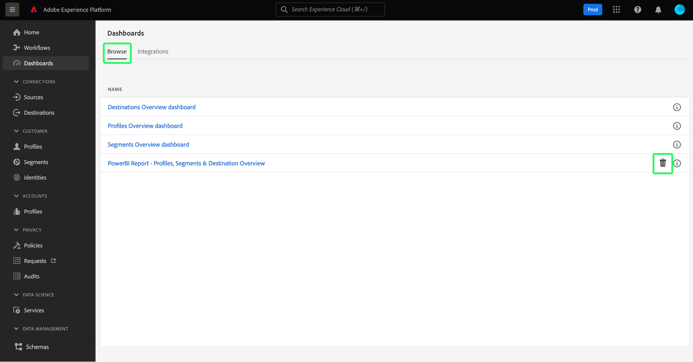

# Power BI modelli di rapporto per dashboard

La funzione Power BI modello di rapporto consente di creare rapporti convincenti compilati con dati provenienti da Adobe Experience Platform. Il processo di installazione semplificato installa automaticamente i widget standard per Real-Time Customer Profile, segmentazione e destinazioni. L’installazione collega inoltre Power BI ai modelli di dati in modo da poter personalizzare ed estendere facilmente i modelli di rapporto. Questi rapporti possono essere condivisi in tutta l’organizzazione senza che i destinatari abbiano bisogno di credenziali per l’organizzazione su Platform.

Questo documento fornisce istruzioni su come collegare Adobe Experience Platform all’applicazione Power BI e utilizzare i modelli di rapporto per condividere informazioni chiave sui dati di Platform con utenti esterni.

## Introduzione

Prima di continuare con questa esercitazione, è consigliabile avere una buona conoscenza della [composizione dello schema](../../xdm/schema/composition.md) in Experience Platform e del modo in cui gli attributi vengono inclusi nel Profilo cliente in tempo reale tramite lo [schema di unione](../../xdm/schema/composition.md#union).

Per installare l’integrazione dell’applicazione Power BI, gli utenti devono aver acquisito le seguenti autorizzazioni Platform:

- Gestire le query
- Gestione sandbox

Per informazioni su come assegnare queste autorizzazioni, leggere la documentazione del [controllo di accesso](../../access-control/home.md).

Per seguire questa esercitazione, è necessario disporre di un account di Power BI. Per creare un account, accedi alla [home page Power BI](https://powerbi.microsoft.com/en-us/) e segui la procedura di iscrizione. Gli utenti per questo account di Power BI devono abilitare anche l&#39;impostazione **Crea area di lavoro** nelle impostazioni di Power BI. Questa impostazione si trova all’interno delle impostazioni tenant del portale di amministrazione Power BI. Se l’account è fornito dal tenant o dal datore di lavoro, contatta il rispettivo amministratore per abilitare questa impostazione.

>[!NOTE]
>
>Affinché la scheda Dashboard sia visibile nell’area di navigazione a sinistra dell’interfaccia utente di Platform, è necessario disporre dell’accesso a qualsiasi dashboard di profilo, segmentazione o destinazione nell’ambito della licenza di Platform.

## Installare l’integrazione dell’applicazione Power BI

Nell&#39;interfaccia utente di Platform, seleziona **[!UICONTROL Dashboard]** nell&#39;area di navigazione a sinistra per aprire l&#39;area di lavoro [!UICONTROL Dashboard]. Nella scheda [!UICONTROL Sfoglia] è visualizzato un elenco delle visualizzazioni del dashboard attualmente disponibili. Per ulteriori informazioni sulla visualizzazione delle dashboard disponibili, consulta la [documentazione di inventario](../inventory.md).

Quindi, seleziona la scheda **[!UICONTROL Integrazioni]**. Viene visualizzata la pagina di integrazione dell&#39;applicazione Power BI. Da qui, selezionare **[!UICONTROL Installa]** per avviare l&#39;installazione.

>[!NOTE]
>
>Il pulsante [!UICONTROL Installa] è disabilitato a meno che non si disponga delle autorizzazioni Gestione e Gestione sandbox di Query Service.

### Immetti le credenziali

Il primo passaggio del processo di installazione consiste nel fornire credenziali senza scadenza per l&#39;integrazione dell&#39;applicazione Power BI. Sono disponibili due opzioni per specificare: [[!UICONTROL Crea nuove credenziali]](#create-new-credentials) o [[!UICONTROL Usa credenziali esistenti]](#use-existing-credentials). Seleziona l’interruttore appropriato per continuare.

#### Crea nuove credenziali {#create-new-credentials}

Durante la generazione delle nuove credenziali sono disponibili due campi obbligatori: [!UICONTROL Nome] e [!UICONTROL Assegnato a]. Il campo [!UICONTROL Assegnato a] si riferisce all&#39;indirizzo e-mail associato al tuo account di Power BI.

>[!IMPORTANT]
>
>La creazione di credenziali senza scadenza richiede l’assegnazione di determinate autorizzazioni e ruoli. Le autorizzazioni necessarie sono Gestisci sandbox e Gestisci integrazione servizio query. I ruoli richiesti sono amministratore di Adobe Experience Platform e ruoli sviluppatore. Per informazioni su come assegnare queste autorizzazioni, leggere la documentazione del [controllo di accesso](../../access-control/home.md).

Per ulteriori informazioni sulla generazione di credenziali di Query Service senza scadenza, consulta la [guida sulle credenziali senza scadenza](../../query-service/ui/credentials.md#non-expiring-credentials).

Dopo aver generato le credenziali senza scadenza per la prima volta, in tale computer viene scaricato un file JSON. Questo file JSON può quindi essere condiviso con altri utenti come credenziali per completare il processo di installazione.

#### Usa credenziali esistenti {#use-existing-credentials}

Per superare la convalida è inoltre possibile caricare un file di credenziali JSON. Questi file JSON contenenti i valori delle credenziali senza scadenza vengono scaricati nel computer locale utilizzato quando si crea una credenziale senza scadenza.

>[!IMPORTANT]
>
>Per utilizzare una credenziale esistente senza scadenza, è necessario che all&#39;utente siano già state assegnate delle credenziali. Se all&#39;utente non è stata assegnata alcuna credenziale e non è possibile crearne una nuova utilizzando Adobe Admin Console, l&#39;utente non può procedere con il processo di installazione.

Selezionare **[!UICONTROL Carica file delle credenziali]**, quindi selezionare il file JSON appropriato da caricare nella finestra di dialogo visualizzata.

Dopo aver fornito le credenziali senza scadenza, queste vengono convalidate automaticamente da Platform. Dopo la convalida viene visualizzato un messaggio di conferma. Seleziona **[!UICONTROL Avanti]** per rivedere il contratto di consenso per l&#39;applicazione di Power BI.

### Fornisci consenso

Viene visualizzata la visualizzazione del consenso. Seleziona **[!UICONTROL Rivedi il consenso]** per aprire una nuova finestra in cui sono specificate le autorizzazioni necessarie per l&#39;accesso e l&#39;utilizzo dei dati da parte del Power BI in base ai termini di servizio e all&#39;informativa sulla privacy.

Seleziona **[!UICONTROL Accetta]** per concedere al Power BI l&#39;autorizzazione per accedere e utilizzare i dati di Platform.

>[!NOTE]
>
>Se esci dal processo di installazione in un qualsiasi momento prima di fornire il consenso, l’integrazione dell’applicazione Power BI non verrà installata nell’inventario delle dashboard.

Dopo aver fornito il consenso, il modello di report viene installato automaticamente nell’ambiente di Power BI come parte del processo di installazione. Power BI utilizza quindi le credenziali senza scadenza per accedere a Platform, eseguire in sequenza tutte le query SQL e popolare il modello di report con i dati restituiti.

Seleziona **[!UICONTROL Fine]** per tornare all&#39;inventario del dashboard.

Ora che il modello di report Power BI è installato, viene visualizzato nell&#39;elenco dei dashboard disponibili nella scheda [!UICONTROL Sfoglia]. Seleziona **[!UICONTROL Power BI]** dall&#39;elenco per passare all&#39;ambiente di Power BI.

>[!IMPORTANT]
>
>Gli amministratori dei Power BI devono assicurarsi che gli utenti dispongano delle autorizzazioni di accesso appropriate per visualizzare queste dashboard nell’ambiente Power BI.

## area di lavoro Power BI

Dopo aver effettuato l&#39;accesso a [l&#39;area di lavoro Power BI](https://dxt.powerbi.com), i modelli di report sono disponibili per ciascuno dei servizi a cui hai accesso. I modelli di report includono profili, segmenti e dashboard di destinazioni **solo** se dispongono delle autorizzazioni di visualizzazione corrispondenti.

Per impostazione predefinita, i widget standard da profili, segmenti e destinazioni sono disponibili nei rapporti dei modelli di Power BI.

>[!NOTE]
>
>Per consentire l’installazione del dashboard nell’ambiente Power BI, è necessario che siano abilitate le autorizzazioni di modifica per un determinato dashboard.

Dopo aver installato un dashboard in Power BI, per impostazione predefinita i modelli di report vengono visualizzati a tutti gli utenti. Se desideri limitare l’accesso a qualsiasi modello di rapporto, accertati di disabilitare l’accesso per gli utenti in questione dall’ambiente Power BI.

## Personalizzare il modello di report Power BI

Tramite l’utilizzo di widget personalizzati, puoi aggiungere attributi personalizzati al modello di dati per arricchire i modelli di rapporto forniti dal Power BI.

>[!NOTE]
>
>Gli attributi che è possibile utilizzare per i widget personalizzati dipendono da ciò che è disponibile nello schema di unione. Per informazioni su come visualizzare ed esplorare gli schemi di unione a vantaggio dei widget personalizzati, consulta la [guida dell&#39;interfaccia utente dello schema di unione](../../profile/ui/union-schema.md).

### Creare un widget personalizzato

I widget personalizzati vengono creati tramite la Libreria widget. Per un&#39;introduzione alla funzionalità, vedere la [Panoramica sulla libreria dei widget](../customize/widget-library.md) e il [tutorial per la creazione di un widget personalizzato](../customize/custom-widgets.md) per istruzioni specifiche.

>[!IMPORTANT]
>
>I nuovi widget personalizzati creati sono **not** sincronizzati automaticamente tra le dashboard di Adobe Experience Platform e i modelli di report Power BI. Eventuali widget personalizzati creati nell’interfaccia utente di Platform devono essere ricreati manualmente all’interno dell’ambiente Power BI.

### Ricreare il widget personalizzato nell’ambiente Power BI

Una volta che il dashboard dispone delle metriche e degli attributi appropriati contenuti nei widget personalizzati, puoi modificare il modello di report visualizzato dall’ambiente Power BI. Per informazioni su come modificare un report tramite l&#39;interfaccia utente, vedere la [documentazione sui Power BI](https://docs.microsoft.com/en-us/power-bi/).

## Eliminare l’integrazione dell’applicazione Power BI

Per eliminare il dashboard, passare all&#39;inventario del dashboard e selezionare l&#39;icona Elimina () accanto al nome del dashboard.

>[!NOTE]
>
>Solo l’utente che ha installato il dashboard di Power BI può eliminare l’integrazione dall’interfaccia utente di Platform.

Viene visualizzato un messaggio di conferma. Seleziona **[!UICONTROL Elimina]** per confermare il processo.

>[!IMPORTANT]
>
>L&#39;eliminazione del dashboard dei Power BI dall&#39;interfaccia utente di Platform **not** comporta l&#39;eliminazione dei modelli di report disponibili nel tuo ambiente di Power BI. Se desideri eliminare completamente le informazioni contenute nei modelli di report di Power BI, devi accedere al tuo account di Power BI ed eliminare i modelli di report da tale ambiente. Una volta eliminato, un utente può reinstallare il dashboard di Power BI seguendo le stesse istruzioni di installazione descritte in precedenza.

## Passaggi successivi

Una volta letto questo documento, sarai in grado di comprendere meglio come i modelli di report Power BI possono essere integrati in Platform per condividere informazioni irresistibili sui dati provenienti dalle dashboard di profili, segmenti o destinazioni. Per ulteriori informazioni sulla personalizzazione delle dashboard, consulta la [panoramica sulla personalizzazione delle dashboard](../customize/overview.md).
