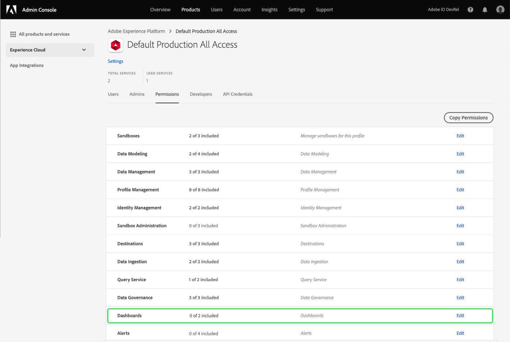

# Autorizzazioni di accesso per le dashboard

Per consentire agli utenti di visualizzare, modificare e aggiornare le dashboard, devi prima abilitare le autorizzazioni. In Adobe Experience Platform, il controllo degli accessi è fornito tramite Adobe Admin Console. Questa funzionalità sfrutta i profili di prodotto in [!DNL Admin Console], che collegano gli utenti con autorizzazioni e sandbox.

Questo documento fornisce un riepilogo di come fornire l&#39;accesso a autorizzazioni specifiche del dashboard all&#39;interno di Admin Console. Per informazioni dettagliate su come ottenere e assegnare le autorizzazioni di accesso, iniziare leggendo la [panoramica sul controllo di accesso](../access-control/home.md).

>[!NOTE]
>
>Per configurare il controllo di accesso per [!DNL Experience Platform], è necessario disporre dei privilegi di amministratore per un&#39;organizzazione con un&#39;integrazione di prodotto [!DNL Experience Platform]. Per ulteriori informazioni, consulta l’articolo Adobe Help Center sui [ruoli amministrativi](https://helpx.adobe.com/enterprise/using/admin-roles.html) .

## Autorizzazioni disponibili {#available-permissions}

Sono necessarie due autorizzazioni principali per accedere alle dashboard all’interno di Experience Platform. Queste autorizzazioni sono:

* **Visualizza dashboard** utilizzo licenza: Questa autorizzazione consente agli utenti di accedere in sola lettura al dashboard per l’utilizzo delle licenze all’interno dell’interfaccia utente di Experience Platform.
* **Gestione dashboard** standard: Questa autorizzazione consente agli utenti di aggiungere attributi personalizzati che non sono ancora presenti nel data warehouse.

La procedura seguente illustra come aggiungere queste autorizzazioni utilizzando Admin Console.

## Selezionare i profili di prodotto

Per concedere agli utenti l&#39;accesso alle dashboard in Experience Platform, inizia effettuando l&#39;accesso a [Adobe Admin Console](https://adminconsole.adobe.com) e selezionando **Prodotti** dalla navigazione superiore.

Seleziona **Adobe Experience Platform** dal menu a discesa Experience Cloud nella navigazione a sinistra o dalle schede elencate in *Tutti i prodotti e servizi*. Dalla pagina del prodotto Adobe Experience Platform, seleziona il profilo di prodotto a cui desideri aggiungere le autorizzazioni del dashboard oppure seleziona **Nuovo profilo** per creare un nuovo profilo di prodotto.

Viene visualizzato il profilo di prodotto selezionato, che mostra gli utenti associati a tale profilo di prodotto. Per gestire le autorizzazioni per il profilo di prodotto, seleziona **Autorizzazioni**.

## Aggiungi/modifica autorizzazioni

La scheda **Autorizzazioni** visualizza tutte le autorizzazioni disponibili per il profilo di prodotto. Individua la riga **Dashboard** e osserva che attualmente indica &quot;0 di 2 incluso&quot;, il che significa che non sono abilitate le autorizzazioni del dashboard per il profilo di prodotto.

Per modificare le autorizzazioni del dashboard, seleziona **Modifica** nella riga del dashboard.

Viene visualizzata la finestra di dialogo **Modifica autorizzazioni** che mostra gli elementi delle autorizzazioni disponibili e quelli inclusi. Puoi selezionare il segno più (`+`) accanto all&#39;autorizzazione per aggiungerlo oppure selezionare **+ Aggiungi tutto** per aggiungere tutte le autorizzazioni contemporaneamente.

Per una descrizione delle autorizzazioni, fare riferimento alla sezione [Autorizzazioni disponibili](#available-permissions) precedente in questo documento.

>[!NOTE]
>
>Non è necessario abilitare tutte le autorizzazioni per tutti gli utenti. A seconda della struttura della tua organizzazione, puoi creare profili di prodotto separati per alcuni utenti e concedere un accesso limitato (ad esempio in sola lettura).

Dopo aver aggiunto le autorizzazioni, seleziona **Salva** per tornare al profilo di prodotto.

Quando ritorni al profilo di prodotto, puoi verificare che le autorizzazioni siano state aggiunte confermando che la riga **Dashboard** mostra &quot;2 di 2 inclusi&quot;.

## Passaggi successivi

Dopo aver aggiunto le autorizzazioni di accesso alle dashboard, gli utenti all’interno dell’organizzazione possono iniziare a visualizzare le dashboard nell’interfaccia utente di Experience Platform ed eseguire altre azioni in base alle autorizzazioni assegnate.