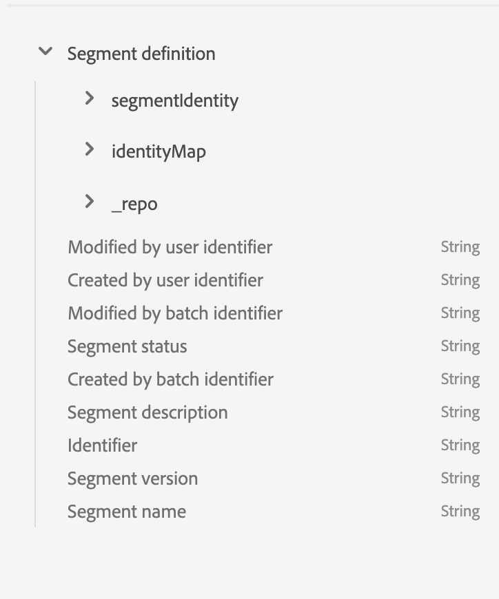

# Esplorare, verificare ed elaborare i set di dati del dashboard utilizzando [!DNL Query Service]

Adobe Experience Platform fornisce informazioni importanti sul profilo, sui segmenti e sulle destinazioni dell’organizzazione tramite dashboard disponibili nell’interfaccia utente di Experience Platform. È quindi possibile utilizzare Adobe Experience Platform [!DNL Query Service] per esplorare, verificare ed elaborare i set di dati non elaborati che alimentano queste dashboard nel data lake.

## Guida introduttiva a [!DNL Query Service]

Adobe Experience Platform [!DNL Query Service] supporta gli esperti di marketing nell’acquisire informazioni dai propri dati consentendo l’utilizzo di SQL standard per eseguire query sui dati nel data lake. [!DNL Query Service] offre un’interfaccia utente e un’API che possono essere utilizzate per unire qualsiasi set di dati nel data lake e acquisire i risultati della query come nuovi set di dati da utilizzare nel reporting, nell’apprendimento automatico o per l’inserimento in Profilo cliente in tempo reale.

Per ulteriori informazioni [!DNL Query Service] e il suo ruolo all&#39;interno dell&#39;Experience Platform, si prega di iniziare leggendo il [[!DNL Query Service] panoramica](../query-service/home.md).

## Accesso ai set di dati disponibili

È possibile utilizzare [!DNL Query Service] per eseguire query sui set di dati non elaborati per le dashboard di profili, segmenti e destinazioni. Per visualizzare i set di dati disponibili, nell’interfaccia utente di Experience Platform, seleziona **Set di dati** nella navigazione a sinistra per aprire il dashboard Set di dati. Il dashboard elenca tutti i set di dati disponibili per l’organizzazione. Vengono visualizzati i dettagli di ciascun set di dati elencato, compreso il nome, lo schema a cui è associato il set di dati e lo stato dell’acquisizione più recente.


### Set di dati generati dal sistema

>[!IMPORTANT]
>
>I set di dati generati dal sistema sono nascosti per impostazione predefinita. Per impostazione predefinita, la [!UICONTROL Sfoglia] La scheda mostra solo i set di dati in cui sono stati acquisiti i dati.

Per visualizzare i set di dati generati dal sistema, seleziona l’icona del filtro () situata a sinistra della barra di ricerca.


Viene visualizzata una barra laterale contenente due pulsanti, [!UICONTROL Incluso nel profilo] e [!UICONTROL Mostra set di dati di sistema]. Seleziona l’interruttore per [!UICONTROL Mostra set di dati di sistema] per includere i set di dati generati dal sistema nell’elenco dei set di dati esplorabili.


### Set di dati degli attributi del profilo

Le informazioni sul dashboard dei profili sono legate ai criteri di unione definiti dall’organizzazione. Per ogni criterio di unione attivo, è disponibile un set di dati di attributi di profilo nel data lake.

La convenzione di denominazione di questi set di dati è **Profilo-Snapshot-Export** seguito da un valore numerico alfanumerico casuale generato dal sistema. Ad esempio: `Profile-Snapshot-Export-abbc7093-80f4-4b49-b96e-e743397d763f`.

Per comprendere lo schema completo di ciascun set di dati di esportazione dello snapshot del profilo, puoi visualizzare in anteprima ed esplorare i set di dati [utilizzo del visualizzatore di set di dati](../catalog/datasets/user-guide.md) nell’interfaccia utente di Experience Platform.


#### Mappatura dei set di dati degli attributi di profilo per unire gli ID dei criteri

Il valore alfanumerico assegnato a ciascun set di dati di attributi di profilo generato dal sistema è una stringa casuale mappata a un ID di criteri di unione di uno dei criteri di unione creati dalla tua organizzazione. La mappatura di ciascun ID criterio di unione alla stringa di set di dati dell’attributo di profilo corrispondente viene mantenuta in `adwh_dim_merge_policies` set di dati.

La `adwh_dim_merge_policies` Il set di dati contiene i campi seguenti:

* `merge_policy_name`
* `merge_policy_id`
* `merge_policy`
* `dataset_id`

Questo set di dati può essere esplorato utilizzando l’interfaccia utente dell’Editor query in Experience Platform. Per ulteriori informazioni sull’utilizzo dell’editor delle query, consulta [Guida all’interfaccia utente dell’editor delle query](../query-service/ui/user-guide.md).

### Set di dati dei metadati del segmento

È disponibile un set di dati per metadati del segmento nel lago di dati contenente metadati per ciascuno dei segmenti della tua organizzazione.

La convenzione di denominazione di questo set di dati è **Segmentdefinition-Snapshot-Export** seguito da un valore numerico alfa. Ad esempio: `Segmentdefinition-Snapshot-Export-acf28952-2b6c-47ed-8f7f-016ac3c6b4e7`

Per comprendere lo schema completo di ogni set di dati per l’esportazione di snapshot di definizione del segmento, puoi visualizzare in anteprima ed esplorare i set di dati [utilizzo del visualizzatore di set di dati](../catalog/datasets/user-guide.md) nell’interfaccia utente di Experience Platform.



### Set di dati metadati di destinazione

I metadati per tutte le destinazioni attivate della tua organizzazione sono disponibili come set di dati non elaborati nel lago di dati.

La convenzione di denominazione di questo set di dati è **DIM_Destination**.

Per comprendere lo schema completo del set di dati di destinazione DIM, puoi visualizzare in anteprima ed esplorare il set di dati [utilizzo del visualizzatore di set di dati](../catalog/datasets/user-guide.md) nell’interfaccia utente di Experience Platform.


## (Beta) Rapporti Approfondimenti su Customer Data Platform (CDP)

>[!IMPORTANT]
>
>La funzione CDP Insights Data Models è in versione beta. Le sue funzioni e la sua documentazione sono soggette a modifiche.

La funzione CDP Insights Data Models espone l&#39;SQL che potenzia le informazioni per vari widget di profilo, destinazione e segmentazione. Puoi personalizzare questi modelli di query SQl per creare rapporti CDP per i tuoi casi d’uso di marketing e KPI.

Il reporting CDP fornisce informazioni approfondite sui dati del profilo e sulla sua relazione con segmenti e destinazioni. Consulta la documentazione sul modello dati di CDP Insights per informazioni dettagliate su come [applica i modelli di dati CDP Insights ai tuoi casi d’uso specifici di KPI](./cdp-insights-data-model.md).

## Query di esempio

Le seguenti query di esempio includono un esempio di SQL che può essere utilizzato in [!DNL Query Service] per esplorare, verificare ed elaborare i set di dati non elaborati che alimentano le dashboard.

### Numero di profili per identità

Questa informazione approfondita del profilo fornisce un raggruppamento delle identità in tutti i profili uniti nel set di dati.

>[!NOTE]
>
>Il numero totale di profili per identità (in altre parole, l’aggiunta insieme dei valori mostrati per ogni spazio dei nomi) potrebbe essere superiore al numero totale di profili uniti, in quanto a un profilo potrebbero essere associati più namespace. Ad esempio, se un cliente interagisce con il tuo marchio su più di un canale, a quel singolo cliente saranno associati più namespace.

**Query**

```sql
Select
        Key namespace,
        count(1) count_of_profiles
     from
        (
           Select
               explode(identitymap)
           from
              Profile-Snapshot-Export-abbc7093-80f4-4b49-b96e-e743397d763f
        )
     group by
        namespace;
```

### Numero di profili per segmento

Questa profondità di pubblico fornisce il numero totale di profili uniti all’interno di ciascun segmento del set di dati. Questo numero è il risultato dell’applicazione dei criteri di unione dei segmenti ai dati del profilo per unire i frammenti di profilo in modo da formare un unico profilo per ogni individuo nel segmento.

```sql
Select          
        concat_ws('-', key, source_namespace) segment_id,
        count(1) count_of_profiles
      from
        (
            Select
              Upper(key) as source_namespace,
              explode(value)
            from
              (
                  Select
                    explode(Segmentmembership)
                  from
                    Profile-Snapshot-Export-abbc7093-80f4-4b49-b96e-e743397d763f
              )
        )
      group by
      segment_id
```

## Passaggi successivi

Leggendo questa guida, puoi ora utilizzare [!DNL Query Service] per eseguire diverse query per esplorare ed elaborare i set di dati non elaborati che alimentano le dashboard di profilo, segmenti e destinazioni.

Per ulteriori informazioni su ogni dashboard e sulle relative metriche, seleziona una dashboard dall’elenco delle dashboard disponibili nella navigazione della documentazione.
