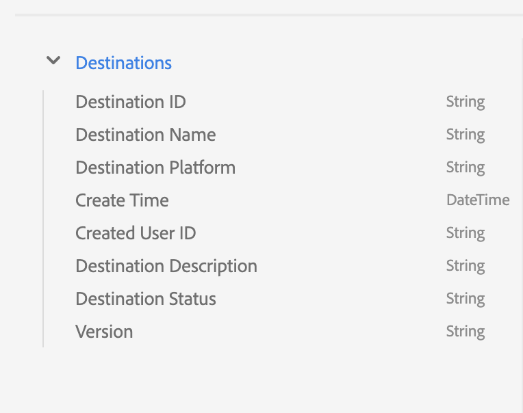

# Esplora, verifica ed elabora i set di dati del dashboard tramite [!DNL Query Service]

Adobe Experience Platform fornisce informazioni importanti sui dati di profilo, pubblico e destinazioni della tua organizzazione tramite dashboard disponibili nell’interfaccia utente di Experienci Platform. Puoi quindi utilizzare Adobe Experience Platform [!DNL Query Service] esplorare, verificare ed elaborare i set di dati non elaborati che alimentano queste dashboard nel data lake.

## Guida introduttiva a [!DNL Query Service]

Adobe Experience Platform [!DNL Query Service] consente agli addetti al marketing di ottenere informazioni approfondite dai propri dati grazie all’utilizzo di SQL standard per eseguire query sui dati nel data lake. [!DNL Query Service] offre un’interfaccia utente e un’API che possono essere utilizzate per unire qualsiasi set di dati nel data lake e acquisire i risultati della query sotto forma di nuovi set di dati da utilizzare nel reporting, nell’apprendimento automatico o per l’inserimento in Real-Time Customer Profile.

Per ulteriori informazioni su [!DNL Query Service] e il suo ruolo all&#39;interno dell&#39;Experience Platform, si prega di iniziare leggendo il [[!DNL Query Service] panoramica](../query-service/home.md).

## Accesso ai set di dati disponibili

È possibile utilizzare [!DNL Query Service] per eseguire query sui set di dati non elaborati per i dashboard di profilo, pubblico e destinazioni. Per visualizzare i set di dati disponibili, nell’interfaccia utente di Experienci Platform seleziona **Set di dati** nel menu di navigazione a sinistra per aprire il dashboard Set di dati. Il dashboard elenca tutti i set di dati disponibili per l’organizzazione. Vengono visualizzati i dettagli di ciascun set di dati elencato, tra cui il nome, lo schema a cui il set di dati aderisce e lo stato dell’esecuzione dell’acquisizione più recente.


### Set di dati generati dal sistema {#system-generated-datasets}

>[!IMPORTANT]
>
>I set di dati generati dal sistema sono nascosti per impostazione predefinita. Per impostazione predefinita, il [!UICONTROL Sfoglia] Questa scheda mostra solo i set di dati in cui hai acquisito i dati.

Per visualizzare i set di dati generati dal sistema, seleziona l’icona del filtro () situato a sinistra della barra di ricerca.


Viene visualizzata una barra laterale contenente due interruttori, [!UICONTROL Incluso nel profilo] e [!UICONTROL Mostra set di dati di sistema]. Seleziona l’opzione per [!UICONTROL Mostra set di dati di sistema] per includere i set di dati generati dal sistema nell’elenco dei set di dati visualizzabili.


### Set di dati di attributi di profilo {#profile-attribute-datasets}

Le informazioni sul dashboard dei profili sono collegate ai criteri di unione definiti dall’organizzazione. Per ogni criterio di unione attivo, nel data lake è disponibile un set di dati di attributi di profilo.

La convenzione di denominazione di questi set di dati è **Profile-Snapshot-Export** seguito da un valore alfanumerico casuale generato dal sistema. Ad esempio: `Profile-Snapshot-Export-abbc7093-80f4-4b49-b96e-e743397d763f`.

Per comprendere lo schema completo di ciascun set di dati di esportazione dello snapshot del profilo, puoi visualizzare in anteprima ed esplorare i set di dati [utilizzo del visualizzatore di set di dati](../catalog/datasets/user-guide.md) nell’interfaccia utente di Experienci Platform.


#### Mappatura dei set di dati degli attributi del profilo agli ID dei criteri di unione

Il valore alfanumerico assegnato a ciascun set di dati di attributi di profilo generato dal sistema è una stringa casuale mappata a un ID del criterio di unione di uno dei criteri di unione creati dall’organizzazione. Il mapping di ogni ID del criterio di unione alla relativa stringa dell’attributo del profilo viene mantenuto nel `adwh_dim_merge_policies` set di dati.

Il `adwh_dim_merge_policies` il set di dati contiene i campi seguenti:

* `merge_policy_name`
* `merge_policy_id`
* `merge_policy`
* `dataset_id`

Questo set di dati può essere esaminato utilizzando l’interfaccia utente dell’editor delle query in Experience Platform. Per ulteriori informazioni sull&#39;utilizzo dell&#39;editor delle query, consultare [Guida dell’interfaccia utente di Query Editor](../query-service/ui/user-guide.md).

### Set di dati metadati pubblico

Nel data lake è disponibile un set di dati di metadati del pubblico che contiene i metadati per ciascun pubblico dell’organizzazione.

La convenzione di denominazione di questo set di dati è **Segmentdefinition-Snapshot-Export** seguito da un valore alfanumerico. Ad esempio: `Segmentdefinition-Snapshot-Export-acf28952-2b6c-47ed-8f7f-016ac3c6b4e7`

Per comprendere lo schema completo di ogni set di dati di esportazione dello snapshot della definizione del segmento, puoi visualizzare in anteprima ed esplorare i set di dati [utilizzo del visualizzatore di set di dati](../catalog/datasets/user-guide.md) nell’interfaccia utente di Experienci Platform.

### Set di dati metadati di destinazione

I metadati per tutte le destinazioni attivate dell’organizzazione sono disponibili come set di dati non elaborati nel data lake.

La convenzione di denominazione di questo set di dati è **DIM_Destination**.

Per comprendere lo schema completo del set di dati di destinazione DIM, puoi visualizzare in anteprima ed esplorare il set di dati [utilizzo del visualizzatore di set di dati](../catalog/datasets/user-guide.md) nell’interfaccia utente di Experienci Platform.



## Rapporti Approfondimenti su Customer Data Platform (CDP)

La funzione CDP Insights Data Models espone l’SQL che potenzia le informazioni per vari widget di profilo, destinazione e segmentazione. Puoi personalizzare questi modelli di query SQl per creare rapporti CDP per i casi d’uso di marketing e KPI.

Il reporting di CDP fornisce informazioni approfondite sui dati del profilo e sulla sua relazione con il pubblico e le destinazioni. Per informazioni dettagliate su come eseguire questa operazione, consulta la documentazione di CDP Insights Data Model. [applicare i modelli di dati CDP Insights ai tuoi casi d’uso specifici dei KPI](./cdp-insights-data-model.md).

## Query di esempio

Le query di esempio seguenti includono SQL di esempio che possono essere utilizzate in [!DNL Query Service] per esplorare, verificare ed elaborare i set di dati non elaborati che alimentano i dashboard.

### Numero di profili per identità

Questa informazione sul profilo fornisce un raggruppamento delle identità in tutti i profili uniti nel set di dati.

>[!NOTE]
>
>Il numero totale di profili per identità (in altre parole, la somma dei valori mostrati per ogni spazio dei nomi) può essere maggiore del numero totale di profili uniti, perché a un profilo potrebbero essere associati più spazi dei nomi. Ad esempio, se un cliente interagisce con il tuo marchio su più di un canale, a quel singolo cliente verranno associati più spazi dei nomi.

**Query**

```sql
Select
        Key namespace,
        count(1) count_of_profiles
     from
        (
           Select
               explode(identitymap)
           from
              Profile-Snapshot-Export-abbc7093-80f4-4b49-b96e-e743397d763f
        )
     group by
        namespace;
```

### Numero di profili per pubblico

Questa informazione sul pubblico fornisce il numero totale di profili uniti all’interno di ogni pubblico nel set di dati. Questo numero è il risultato dell’applicazione del criterio di unione del pubblico ai dati del profilo per unire i frammenti di profilo in modo da formare un singolo profilo per ogni individuo nel pubblico.

```sql
Select          
        concat_ws('-', key, source_namespace) audience_id,
        count(1) count_of_profiles
      from
        (
            Select
              Upper(key) as source_namespace,
              explode(value)
            from
              (
                  Select
                    explode(Audiencemembership)
                  from
                    Profile-Snapshot-Export-abbc7093-80f4-4b49-b96e-e743397d763f
              )
        )
      group by
      audience_id
```

## Passaggi successivi

Leggendo questa guida, ora puoi utilizzare [!DNL Query Service] per eseguire diverse query per esplorare ed elaborare i set di dati non elaborati su cui si basano le dashboard di profilo, pubblico e destinazioni.

Per ulteriori informazioni su ciascuna dashboard e sulle relative metriche, seleziona una dashboard dall’elenco delle dashboard disponibili nella navigazione alla documentazione.
