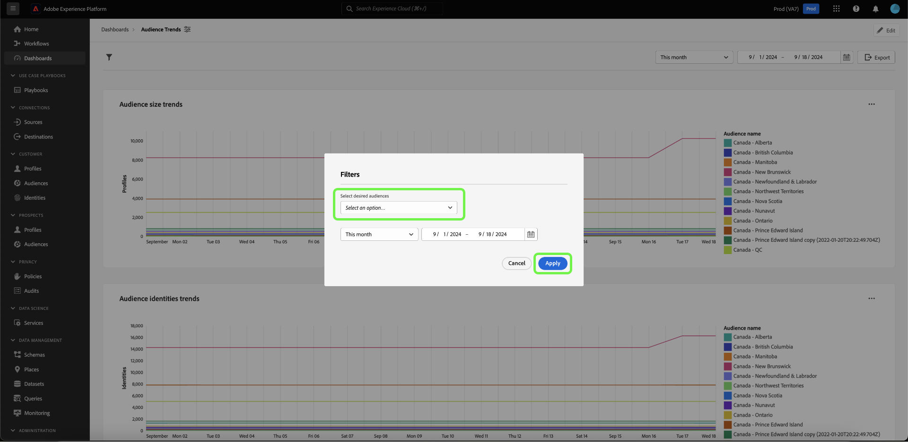

# Crea filtro globale {#create-global-filter}

Per creare un filtro globale, seleziona innanzitutto **[!UICONTROL Aggiungi filtro]** dalla vista del dashboard, quindi **[!UICONTROL Filtro globale]** dal menu a discesa.

>[!IMPORTANT]
>
>Assicurati di mappare i filtri globali a tutti i tuoi grafici. Questo non è un processo automatico. Per utilizzare un filtro globale, è necessario includere un [parametro query](../../../query-service/ui/parameterized-queries.md) nell&#39;istruzione SQL del grafico, [abilitare il filtro globale](#enable-global-filter) nel compositore widget e [selezionare un valore runtime](#select-global-filter) per il parametro nella finestra di dialogo del filtro globale. Per informazioni su come modificare il codice SQL se è necessario incorporare un parametro di query, consulta la guida di query pro.

È possibile modificare rapidamente le informazioni fornite dall&#39;istruzione SQL mediante filtri globali personalizzati.

Viene visualizzata la finestra di dialogo [!UICONTROL Crea un filtro globale]. La creazione di un filtro globale segue lo stesso processo della creazione di un approfondimento con SQL. Selezionare innanzitutto un database (modello dati di insights) per eseguire una query, quindi immettere le istruzioni SQL personalizzate nell&#39;editor di query e infine selezionare l&#39;icona di esecuzione ().

>[!IMPORTANT]
>
>Quando crei un filtro globale, devi includere un ID e un valore. I valori di esempio consentono di eseguire l&#39;istruzione SQL e generare il grafico. I valori di esempio forniti durante la composizione dell’istruzione vengono sostituiti dai valori effettivi selezionati per la data o il filtro globale in fase di esecuzione.

Dopo aver eseguito correttamente la query, nella scheda dei risultati vengono visualizzati i risultati. Seleziona **[!UICONTROL Avanti]**.

![La [!UICONTROL finestra di dialogo per la creazione di un filtro globale] con il menu a discesa del set di dati, l&#39;icona Esegui e Successivo evidenziati.](../../images/sql-insights-query-pro-mode/global-filter.png)

Il passaggio finale del flusso di lavoro per la creazione di filtri globali richiede l’aggiunta di un’etichetta per il filtro. Aggiungi un&#39;etichetta al campo di testo **[!UICONTROL Etichetta filtro]** e seleziona un tipo di filtro dalla casella a discesa.

>[!NOTE]
>
>Al momento è supportata solo l&#39;opzione del tipo di filtro [!UICONTROL Casella combinata].

Infine, seleziona **[!UICONTROL Seleziona]** per tornare alla visualizzazione del dashboard.

![La [!UICONTROL finestra di dialogo per la creazione di un filtro globale] con l&#39;opzione Seleziona e l&#39;input del testo dell&#39;etichetta del filtro evidenziato.](../../images/sql-insights-query-pro-mode/global-filter-label.png)

## Abilita il filtro globale per ogni informazione approfondita {#enable-global-filter}

>[!TIP]
>
>Attiva i filtri globali in ogni grafico creato. In questo modo i valori scelti come filtro globale verranno visualizzati in tutti i grafici.

Dopo aver creato il filtro globale per il dashboard, l’interruttore per tale filtro globale diventa disponibile come parte del compositore widget.

>[!IMPORTANT]
>
>Assicurati che il parametro del filtro globale sia incluso nell’istruzione SQL di ogni informazione approfondita.

## Seleziona un filtro globale {#select-global-filter}

Per aprire la finestra di dialogo [!UICONTROL Filtri] in cui sono elencati tutti i filtri personalizzati, selezionare l&#39;icona del filtro () a sinistra del dashboard. Quindi, per applicare gli effetti alle informazioni del dashboard, scegli un&#39;opzione dal menu a discesa del filtro globale, quindi seleziona **[!UICONTROL Applica]**.

## Cancella filtro globale {#clear-global-filter}

Per cancellare tutti i filtri globali personalizzati, seleziona **[!UICONTROL Cancella tutto]** dalla finestra di dialogo [!UICONTROL Filtri].

