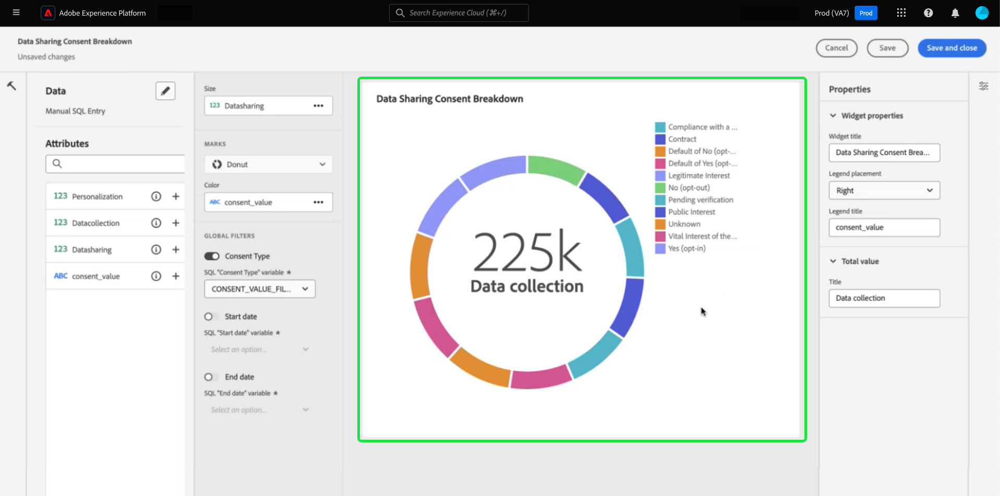

# Approfondimenti SQL per il reporting esteso delle app

Utilizza query SQL personalizzate per estrarre in modo efficace informazioni approfondite da diversi set di dati strutturati. Gli utenti tecnici possono utilizzare la modalità query pro per eseguire analisi complesse con SQL e quindi condividere questa analisi con utenti non tecnici tramite grafici nel dashboard personalizzato o esportarle in file CSV. Questo metodo di creazione delle informazioni è adatto per tabelle con relazioni chiare e consente un maggiore grado di personalizzazione delle informazioni e dei filtri che possono essere adatti a casi d’uso di nicchia.

>[!IMPORTANT]
>
>La modalità Query Pro è disponibile solo per gli utenti che hanno acquistato lo SKU [Data Distiller](../../query-service/data-distiller/overview.md).

Per generare informazioni da SQL, è necessario innanzitutto creare un dashboard.

## Creare un dashboard personalizzato {#create-custom-dashboard}

Per creare un dashboard personalizzato, seleziona **[!UICONTROL Dashboard]** dal pannello di navigazione a sinistra per aprire l&#39;area di lavoro Dashboard. Selezionare **[!UICONTROL Crea dashboard]**.

Viene visualizzata la finestra di dialogo **[!UICONTROL Crea dashboard]**. Sono disponibili due opzioni per scegliere il metodo di creazione del dashboard. Per creare le tue informazioni, puoi utilizzare un modello dati esistente con la [[!UICONTROL modalità di progettazione guidata]](../standard-dashboards.md) oppure il tuo codice SQL personalizzato con la [!UICONTROL modalità Query pro].

<!-- Maybe reference Guided design mode in other places on UDD doc. -->

L&#39;utilizzo di un modello dati esistente offre i vantaggi di fornire un framework strutturato, efficiente e scalabile personalizzato in base alle esigenze aziendali specifiche. Per informazioni su come [creare approfondimenti da un modello dati esistente](../standard-dashboards.md#create-widget), consulta la guida del dashboard personalizzato.

Le informazioni generate dalle query SQL offrono maggiore flessibilità e personalizzazione. Gli utenti tecnici possono utilizzare la modalità query pro per eseguire analisi complesse su SQL e quindi condividere questa analisi con utenti non tecnici tramite questa funzionalità del dashboard. Seleziona **[!UICONTROL Modalità Query Pro]** seguita da **[!UICONTROL Salva]**.

>[!NOTE]
>
>Una volta effettuata la selezione, non è possibile modificarla all&#39;interno del dashboard. È invece necessario creare un nuovo dashboard con un metodo di creazione diverso.

![La finestra di dialogo [!UICONTROL Crea dashboard] con Query Pro Mode e Salva evidenziata.](../images/sql-insights-query-pro-mode/query-pro-mode.png)

## Panoramica sulla modalità Query pro {#query-pro-mode}

La modalità Query pro è un flusso di lavoro basato su editor SQL che ti guida attraverso il processo di generazione di informazioni approfondite con query SQL personalizzate nell’interfaccia utente di Adobe Experience Platform. Prima di poter generare insights con query SQL personalizzate, è necessario creare un dashboard.

## Componi SQL {#compose-sql}

Dopo aver scelto di creare un dashboard in modalità Query Pro, viene visualizzata la finestra di dialogo **[!UICONTROL Immettere SQL]**. Seleziona un database (modello dati approfondimenti) da interrogare dal menu a discesa e inserisci una query adatta per il set di dati nell’editor query pro.

>[!NOTE]
>
>La modalità Query pro è disponibile solo per gli utenti che hanno acquistato lo SKU di Data Distiller. La [[!UICONTROL modalità progettazione guidata]](../standard-dashboards.md) è disponibile per tutti gli utenti per creare informazioni da un modello di dati esistente.

Per informazioni sugli elementi dell&#39;interfaccia utente, consultare la [Guida utente di Query Editor](../../query-service/ui/user-guide.md#query-authoring).

![La finestra di dialogo [!UICONTROL Inserisci SQL] con il menu a discesa del set di dati ed icona di esecuzione evidenziata, la finestra di dialogo contiene una query SQL compilata e la scheda Parametri query visualizzata.](../images/sql-insights-query-pro-mode/enter-sql-database-dropdown.png)

### Parametri della query {#query-parameters}

Per includere [global](./filters/global-filter.md) o [filtri di data](./filters/date-filter.md) la query **deve** utilizzare i parametri di query. Quando componi l’istruzione in modalità query pro, devi fornire valori di esempio se la query utilizza parametri di query. I valori di esempio consentono di eseguire l&#39;istruzione SQL e generare il grafico. I valori di esempio forniti durante la composizione dell’istruzione vengono sostituiti dai valori effettivi selezionati per la data o il filtro globale in fase di esecuzione.

>[!IMPORTANT]
>
>Se si desidera utilizzare un filtro globale, è necessario inserire un parametro di query nell&#39;istruzione SQL e quindi collegare tale parametro di query al filtro globale nel compositore widget. Nella schermata seguente, `CONSENT_VALUE_FILTER` viene utilizzato nel linguaggio SQL come parametro di query per un filtro globale. Per ulteriori informazioni su come eseguire questa operazione, consulta la [documentazione del filtro globale](./filters/global-filter.md#enable-global-filter).

Per eseguire la query, selezionare l&#39;icona di esecuzione (). Nell&#39;Editor query viene visualizzata la scheda dei risultati. Quindi, per confermare la configurazione e aprire il compositore widget, seleziona **[!UICONTROL Seleziona]**.

>[!TIP]
>
>Se la query utilizza parametri di query, eseguirla una sola volta per precompilare tutte le chiavi dei parametri di query utilizzate. La query non riuscirà, ma l’interfaccia utente visualizza automaticamente la scheda Parametri query ed elenca tutte le chiavi incluse. Aggiungi i valori appropriati per le chiavi.

![La finestra di dialogo [!UICONTROL Inserisci SQL] con input SQL, la scheda dei risultati visualizzata e Seleziona evidenziata.](../images/sql-insights-query-pro-mode/enter-sql-select.png)

## Popolare widget {#populate-widget}

Il compositore widget ora è popolato con le colonne dell&#39;SQL eseguito. Il tipo di dashboard è indicato in alto a sinistra, in questo caso è [!UICONTROL Voce SQL manuale]. Selezionare l&#39;icona della matita () per modificare l&#39;istruzione SQL in qualsiasi momento.

>[!TIP]
>
>Gli attributi disponibili sono colonne ricavate dall&#39;istruzione SQL eseguita.

Per creare il widget, utilizza gli attributi elencati nella colonna [!UICONTROL Attributi]. È possibile utilizzare la barra di ricerca per cercare attributi o scorrere l&#39;elenco.

### Aggiungi attributi {#add-attributes}

Per aggiungere un attributo al widget, selezionare l&#39;icona più () accanto al nome di un attributo. Il menu a discesa visualizzato consente di aggiungere un attributo al grafico dalle opzioni determinate dall&#39;istruzione SQL. Diversi tipi di grafico dispongono di opzioni diverse, ad esempio un elenco a discesa degli assi X e Y.

In questo esempio di grafico ad anello, le opzioni sono dimensione e colore. Il colore suddivide i risultati del grafico ad anello e la dimensione corrisponde alla metrica effettiva utilizzata. Aggiungere un attributo al campo [!UICONTROL Colore] per dividere i risultati in colori diversi in base alla composizione dell&#39;attributo.

>[!TIP]
>
>Selezionare l&#39;icona freccia su e freccia giù () per cambiare la disposizione degli assi X e Y nei grafici a barre o a linee.

Per modificare il tipo di grafico o il grafico del widget, seleziona tra le opzioni disponibili del menu a discesa [!UICONTROL Indicatori]. Le opzioni includono [!UICONTROL Riga], [!UICONTROL Anello], [!UICONTROL Numero grande] e [!UICONTROL Barra]. Una volta selezionata, viene generata una visualizzazione di anteprima delle impostazioni correnti del widget.

## Attributi di tabella avanzati {#advanced-attributes}

Per applicare le funzionalità di ordinamento automatico a una o a tutte le colonne delle tabelle, selezionare **[!UICONTROL Modifica]** per modificare l&#39;intero dashboard.

Selezionare i puntini di sospensione (`...`) nel grafico a tabella in cui si desidera aggiungere l&#39;ordinamento delle colonne, quindi selezionare **[!UICONTROL Modifica]**.

Per abilitare l&#39;ordinamento per qualsiasi colonna, selezionare le caselle **[!UICONTROL Ordinabile]**.

Selezionare l&#39;icona delle proprietà () nella barra a destra per aprire il pannello [!UICONTROL Proprietà]. Nel pannello **[!UICONTROL Proprietà]**, utilizza il menu a discesa per selezionare la colonna **[!UICONTROL Ordinamento predefinito]**, quindi utilizza il menu a discesa per selezionare la **[!UICONTROL Direzione ordinamento]**. Infine, selezionare **[!UICONTROL Salva e chiudi]**.

Per ulteriori informazioni sull&#39;utilizzo delle funzionalità di ordinamento, ridimensionamento delle colonne e impaginazione, vedere [Ulteriori informazioni](./view-more.md).

## Proprietà widget {#properties}

Selezionare l&#39;icona delle proprietà () nella barra a destra per aprire il pannello proprietà. Nel pannello [!UICONTROL Proprietà], immetti un nome per il widget nel campo di testo **[!UICONTROL Titolo widget]**. È inoltre possibile rinominare vari aspetti del grafico.

>[!NOTE]
>
>I campi specifici disponibili nella barra laterale delle proprietà variano a seconda del tipo di grafico che si sta modificando.

## Salvare il widget {#save-widget}

Se si salva nel compositore widget, il widget viene salvato localmente nel dashboard. Se desideri salvare il lavoro e riprenderlo in un secondo momento, seleziona **[!UICONTROL Salva]**. Un&#39;icona di spunta sotto il nome del widget indica che il widget è stato salvato. In alternativa, se si è soddisfatti del widget, selezionare **[!UICONTROL Salva e chiudi]** per rendere il widget disponibile a tutti gli altri utenti con accesso al dashboard. Seleziona Annulla per abbandonare il lavoro e tornare al dashboard personalizzato.

## Modificare dashboard e grafici {#edit}

Seleziona **[!UICONTROL Modifica]** per modificare l&#39;intero dashboard o qualsiasi informazione. Dalla modalità di modifica è possibile ridimensionare i widget, modificare le istruzioni SQL o creare e applicare filtri globali e temporali. Questi filtri vincolano i dati visualizzati nei widget del dashboard. È un modo comodo per aggiornare e perfezionare rapidamente le informazioni per diversi casi d’uso.

Seleziona **[!UICONTROL Aggiungi filtro]** per creare un [[!UICONTROL Filtro data]](#create-date-filter) o un [[!UICONTROL Filtro globale]](#create-global-filter). Dopo la creazione, tutti i filtri globali e di data sono disponibili da [icona filtro](#select-global-filter) () del tuo dashboard.

## Modificare, duplicare o eliminare un approfondimento

Per istruzioni su come [modificare, duplicare o eliminare un widget esistente](../standard-dashboards.md#duplicate), consulta la guida Dashboard personalizzato.

## Passaggi successivi

Dopo aver letto questo documento, ora sai come scrivere query SQL nell’interfaccia utente di Adobe Experience Platform per generare grafici per le dashboard personalizzate. Successivamente, dovresti scoprire come arricchire ulteriormente i tuoi dati [creando un filtro data](./filters/date-filter.md) o [creando un filtro globale](./filters/global-filter.md).

Puoi anche saperne di più su altre funzionalità di Approfondimenti personalizzati, tra cui [le diverse opzioni di visualizzazione per i dati analizzati da SQL](./view-more.md) o come [visualizzare le istruzioni SQL alla base delle tue informazioni personalizzate](./view-sql.md).
