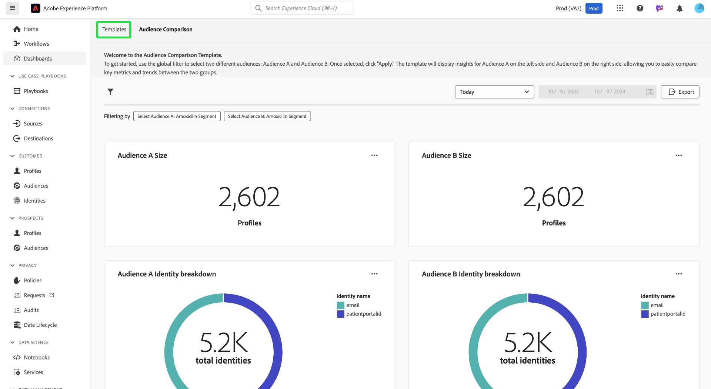

# Confronto del pubblico

La dashboard [!UICONTROL Confronto tipi di pubblico] confronta e confronta le metriche chiave del pubblico in una visualizzazione affiancata. Da questa dashboard, puoi eseguire una serie di azioni per confrontare due gruppi di pubblico e analizzare metriche chiave tra loro. Puoi quindi prendere decisioni basate sui dati relative alla segmentazione del pubblico e alle strategie di targeting.

## Impostare i confronti tra i tipi di pubblico {#set-audience-comparisons}

Per consentire approfondimenti e confronti più significativi, utilizza i filtri di sistema per eseguire il targeting preciso dei segmenti di pubblico e dell’arco temporale che ti interessa analizzare. Selezionare l&#39;icona filtro () per scegliere due tipi di pubblico diversi ([!UICONTROL Pubblico A] e [!UICONTROL Pubblico B]) e impostare parametri specifici per il confronto.

Viene visualizzata la finestra di dialogo [!UICONTROL Filtro]. Per scegliere il primo pubblico da analizzare, seleziona il menu a discesa **[!UICONTROL Seleziona pubblico A]**. In questo esempio, `California Patients` è stato selezionato come Pubblico A. Questo pubblico viene visualizzato sul lato sinistro del confronto una volta applicato il filtro.

Scegliere quindi un secondo pubblico da confrontare con [!UICONTROL Pubblico A] dal menu a discesa **[!UICONTROL Seleziona pubblico B]**. In questa immagine, [!UICONTROL Utenti inviati all&#39;e-mail] è stato selezionato come [!UICONTROL Pubblico B]. Questo pubblico viene visualizzato sul lato destro del dashboard [!UICONTROL Confronto pubblico] una volta applicato il filtro.

### Regolare gli intervalli di date {#adjust-date-ranges}

Puoi anche filtrare i dati per specifici periodi di tempo, per vedere come questi tipi di pubblico funzionano o cambiano in un intervallo di date personalizzato. Per impostare un intervallo di tempo per filtrare i dati del pubblico in base a un periodo specifico, seleziona le date di inizio e di fine dai campi del calendario.

La finestra di dialogo indica anche quanti filtri vengono applicati (nella schermata seguente vengono utilizzati due filtri: Pubblico A e Pubblico B e oggi come intervallo di date). Per rimuovere tutti i filtri applicati, selezionare **[!UICONTROL Cancella tutto]**.

Dopo aver impostato i tipi di pubblico e l&#39;intervallo di date, seleziona **[!UICONTROL Applica]** per aggiornare la dashboard [!UICONTROL Confronto pubblico].

La dashboard ora mostra i grafici comparativi affiancati per ogni pubblico.

## Grafici di confronto del pubblico disponibili {#available-charts}

<!-- Potentially could expand this section to include images of each widget.  -->

Il dashboard fornisce diversi grafici per confrontare le informazioni:

- [[!UICONTROL Dimensione pubblico]](../../guides/audiences.md#audience-size): tieni traccia facilmente delle dimensioni di ciascun pubblico in base al numero di profili in esso contenuti. Questa metrica ti aiuta a comprendere la scala dei due tipi di pubblico che stai confrontando.
- [!UICONTROL Raggruppamento identità pubblico]: un grafico a torta fornisce un raggruppamento della composizione relativa delle identità all&#39;interno di ogni pubblico. Puoi visualizzare il numero di identità totali ed esaminare in che modo diversi identificatori (come e-mail o ID del sistema di gestione delle relazioni con i clienti) contribuiscono a tale totale. Questo grafico ti aiuta a comprendere la composizione di ogni pubblico in base ai tipi di identità. Passa il puntatore del mouse su una sezione del grafico a torta per visualizzare il numero esatto di identità.
- [[!UICONTROL Tendenza dimensione pubblico]](../../guides/audiences.md#audience-size-trend): questo grafico rappresenta le tendenze delle dimensioni nel tempo per il pubblico scelto. Utilizza questi grafici per visualizzare in che modo la dimensione di ciascun pubblico è cambiata in un periodo di tempo selezionato, con picchi e riduzioni che indicano periodi di crescita o riduzione del numero di profili.
- [[!UICONTROL Tendenza di modifica delle dimensioni del pubblico]](../../guides/audiences.md#audience-size-change-trend): questo grafico mostra le tendenze di modifica delle dimensioni per il pubblico scelto. Visualizza in che misura la dimensione del pubblico è aumentata o diminuita nel tempo, e consente di identificare cambiamenti o tendenze significativi nella popolazione del pubblico.

>[!NOTE]
>
>I grafici [!UICONTROL Tendenza dimensione pubblico] e [!UICONTROL Tendenza variazione dimensione pubblico] consentono di tenere traccia e confrontare sia le dimensioni assolute che le fluttuazioni di dimensione tra due tipi di pubblico in un periodo specificato. Queste informazioni semplificano la comprensione dei pattern e dei fattori che influenzano i cambiamenti del pubblico.

## Esporta approfondimenti {#export-insights}

Dopo aver applicato i filtri e analizzato i tipi di pubblico, puoi esportare i dati per ulteriori finalità di analisi o reporting offline. Per esportare le tue informazioni, seleziona **[!UICONTROL Esporta]** in alto a destra nella tabella. Viene visualizzata la finestra di dialogo PDF di stampa. Da questa finestra di dialogo è possibile salvare come PDF o stampare i dati visualizzati nella tabella.

Seleziona **[!UICONTROL Modelli]** per tornare alla panoramica del [!UICONTROL Modello].

## Passaggi successivi

Dopo aver letto questo documento, hai imparato a confrontare le metriche chiave tra diversi gruppi di pubblico utilizzando la dashboard **Confronto pubblico**. Per continuare a migliorare la segmentazione del pubblico e le strategie di targeting, esplora altri modelli di Data Distiller che forniscono ulteriori informazioni. Consulta le [guide per tendenze del pubblico](./trends.md), [sovrapposizioni identità pubblico](./identity-overlaps.md) e [sovrapposizioni pubblico avanzate](./overlaps.md) per migliorare ulteriormente il tuo processo decisionale e ottimizzare le attività di coinvolgimento.

