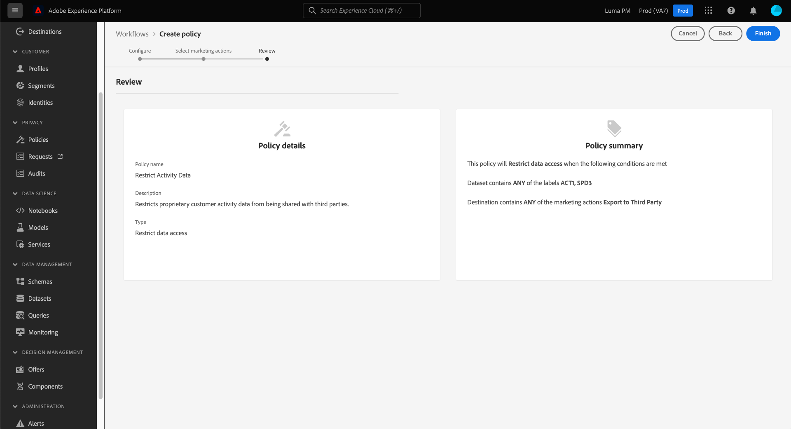

# Guida completa alla governance dei dati

Per controllare quali azioni di marketing possono essere eseguite su determinati set di dati e campi in Adobe Experience Platform, devi impostare quanto segue:

1. [Applicare etichette](#labels) ai set di dati e ai campi di cui si desidera limitare l’utilizzo.
1. [Configurare e abilitare i criteri di governance dei dati](#policy) che determinano quali tipi di dati etichettati possono essere utilizzati per determinate azioni di marketing.
1. [Applicare azioni di marketing alle tue destinazioni](#destinations) per indicare quali criteri si applicano ai dati inviati a tali destinazioni.

Una volta completata la configurazione di etichette, criteri e azioni di marketing, puoi [verifica dell&#39;applicazione dei criteri](#test) per garantire che funzioni come previsto.

Questa guida descrive il processo completo per la configurazione e l’applicazione di criteri di governance dei dati nell’interfaccia utente di Platform. Per informazioni più dettagliate sulle funzioni utilizzate in questa guida, consulta la documentazione di panoramica sui seguenti argomenti:

* [Governance dei dati di Adobe Experience Platform](./home.md)
* [Etichette di utilizzo dati](./labels/overview.md)
* [Criteri di utilizzo dei dati](./policies/overview.md)
* [Applicazione delle politiche](./enforcement/overview.md)

## Applicare etichette {#labels}

Se esiste un set di dati specifico su cui desideri applicare vincoli di utilizzo dei dati, puoi [applica etichette direttamente a quel set di dati](#dataset-labels) o campi specifici all’interno di tale set di dati.

In alternativa, è possibile [applicare etichette a uno schema](#schema-labels) in modo che tutti i set di dati basati su tale schema ereditino le stesse etichette.

>[!NOTE]
>
>Per ulteriori informazioni sulle diverse etichette di utilizzo dei dati e sull’uso previsto, consulta [riferimento alle etichette di utilizzo dati](./labels/reference.md). Se le etichette di base disponibili non coprono tutti i casi d’uso desiderati, puoi [definire etichette personalizzate](./labels/user-guide.md#manage-custom-labels) anche.

### Applicare etichette a un set di dati {#dataset-labels}

Seleziona **[!UICONTROL Set di dati]** nel menu di navigazione a sinistra, seleziona il nome del set di dati a cui desideri applicare le etichette. Facoltativamente, puoi utilizzare il campo di ricerca per limitare l’elenco dei set di dati visualizzati.

Viene visualizzata la visualizzazione dei dettagli del set di dati. Seleziona la **[!UICONTROL Governance dei dati]** per visualizzare un elenco dei campi del set di dati ed eventuali etichette già applicate. Selezionare le caselle accanto ai campi a cui si desidera aggiungere le etichette, quindi selezionare **[!UICONTROL Modifica delle etichette di governance]** nella barra a destra.

>[!NOTE]
>
>Per aggiungere etichette all’intero set di dati, seleziona la casella di controllo accanto a **[!UICONTROL Nome campo]** per evidenziare tutti i campi prima di selezionare **[!UICONTROL Modifica delle etichette di governance]**.
>
>

Nella finestra di dialogo successiva, seleziona le etichette da applicare ai campi del set di dati selezionati in precedenza. Al termine, seleziona **[!UICONTROL Salva modifiche]**.

Continua a seguire i passaggi precedenti per applicare le etichette a campi diversi (o a set di dati diversi) in base alle esigenze. Al termine, puoi continuare con il passaggio successivo di [abilitazione delle politiche di governance dei dati](#policy).

### Applicare etichette a uno schema {#schema-labels}

Seleziona **[!UICONTROL Schemi]** nel menu di navigazione a sinistra, seleziona lo schema a cui desideri aggiungere le etichette dall’elenco.

>[!TIP]
>
>Se non sei sicuro dello schema da applicare a un particolare set di dati, seleziona **[!UICONTROL Set di dati]** nel menu di navigazione a sinistra, quindi seleziona il collegamento sotto il **[!UICONTROL Schema]** per il set di dati desiderato. Selezionare il nome dello schema nel percorso visualizzato per aprire lo schema nell&#39;Editor di schema.
>
>

La struttura dello schema viene visualizzata nell&#39;Editor di schema. Da qui, seleziona la **[!UICONTROL Etichette]** per visualizzare una visualizzazione a elenco dei campi dello schema e delle etichette già applicate. Selezionare le caselle accanto ai campi a cui si desidera aggiungere le etichette, quindi selezionare **[!UICONTROL Modifica delle etichette di governance]** nella barra a destra.

>[!NOTE]
>
>Se desideri aggiungere etichette a tutti i campi dello schema, seleziona l’icona a forma di matita nella riga superiore.
>
>

Nella finestra di dialogo successiva, seleziona le etichette da applicare ai campi dello schema selezionati in precedenza. Al termine, seleziona **[!UICONTROL Salva]**.

Continua a seguire i passaggi precedenti per applicare le etichette a campi diversi (o schemi diversi) in base alle esigenze. Al termine, puoi continuare con il passaggio successivo di [abilitazione delle politiche di governance dei dati](#policy).

## Abilita criteri di governance dei dati {#policy}

Dopo aver applicato le etichette agli schemi e/o ai set di dati, puoi creare criteri di governance dei dati che limitano le azioni di marketing per le quali è possibile utilizzare determinate etichette.

Seleziona **[!UICONTROL Criteri]** nel menu di navigazione a sinistra per visualizzare un elenco dei criteri di base definiti da Adobe, nonché i criteri personalizzati creati in precedenza dall’organizzazione.

A ogni etichetta principale è associato un criterio di base che, se attivato, impone i vincoli di attivazione appropriati a tutti i dati che contengono tale etichetta. Per abilitare un criterio di base, selezionalo dall’elenco, quindi seleziona il **[!UICONTROL Stato dei criteri]** passa a **[!UICONTROL Abilitato]**.

Se i criteri di base disponibili non coprono tutti i casi d’uso (ad esempio quando si utilizzano etichette personalizzate definite nell’organizzazione), è possibile definire un criterio personalizzato. Da **[!UICONTROL Criteri]** area di lavoro, seleziona **[!UICONTROL Crea criterio]**.

![Immagine che mostra [!UICONTROL Crea criterio] pulsante selezionato nell’interfaccia utente](./images/e2e/create-policy.png)

Viene visualizzato un puntatore che richiede di selezionare il tipo di criterio da creare. Seleziona **[!UICONTROL Criteri di governance dei dati]**, quindi seleziona **[!UICONTROL Continua]**.

![Immagine che mostra [!UICONTROL Criteri di governance dei dati] opzione selezionata](./images/e2e/governance-policy.png)

Nella schermata successiva, fornisci un **[!UICONTROL Nome]** e opzionale **[!UICONTROL Descrizione]** per la politica. Nella tabella seguente, selezionare le etichette che si desidera controllare. In altre parole, si tratta delle etichette che il criterio impedirà di utilizzare per le azioni di marketing specificate nel passaggio successivo.

Se selezioni più etichette, puoi utilizzare le opzioni nella barra a destra per determinare se tutte le etichette devono essere presenti per consentire al criterio di applicare restrizioni di utilizzo o se è necessario che sia presente solo una delle etichette. Al termine, seleziona **[!UICONTROL Successivo]**.

Nella schermata successiva, seleziona le azioni di marketing per le quali questo criterio impedirà l’utilizzo delle etichette selezionate in precedenza. Seleziona **[!UICONTROL Next]** (Avanti) per continuare.

Nella schermata finale viene visualizzato un riepilogo dei dettagli del criterio e delle azioni per le quali verranno limitate le etichette. Seleziona **[!UICONTROL Fine]** per creare e abilitare il criterio.

Il criterio viene creato, ma è impostato su [!UICONTROL Disabilitato] per impostazione predefinita. Seleziona il criterio dall’elenco e imposta la **[!UICONTROL Stato dei criteri]** passa a **[!UICONTROL Abilitato]** per abilitare il criterio.

Procedi seguendo i passaggi precedenti per creare e abilitare i criteri necessari prima di passare al passaggio successivo.

## Gestione delle azioni di marketing per le destinazioni {#destinations}

Affinché i criteri abilitati possano determinare con precisione quali dati possono essere attivati in una destinazione, devi assegnare azioni di marketing specifiche a tale destinazione.

Ad esempio, considera un criterio abilitato che impedisca l&#39;utilizzo di dati contenenti un `C2` dall&#39;utilizzo dell&#39;etichetta per l&#39;azione di marketing &quot;[!UICONTROL Esportazione verso terzi]&quot;. Quando si attivano i dati in una destinazione, il criterio controlla quali azioni di marketing sono presenti nella destinazione. Se &quot;[!UICONTROL Esportazione verso terzi]&quot; è presente, tentativo di attivare dati con un `C2` l&#39;etichetta determina una violazione dei criteri. Se &quot;[!UICONTROL Esportazione verso terzi]&quot; non è presente, il criterio non viene applicato per la destinazione e i dati con `C2` Le etichette possono essere attivate liberamente.

Quando [connessione di una destinazione nell’interfaccia utente](../destinations/ui/connect-destination.md), **[!UICONTROL Governance]** il passaggio nel flusso di lavoro ti consente di selezionare le azioni di marketing applicabili a questa destinazione, che in ultima analisi determinano quali criteri di governance dei dati vengono applicati alla destinazione.

## Applicazione dei criteri di test {#test}

Dopo aver etichettato i dati, abilitato i criteri di governance dei dati e assegnato le azioni di marketing alle destinazioni, puoi verificare se i criteri vengono applicati come previsto.

Se si impostano correttamente le impostazioni, quando si tenta di attivare dati soggetti a restrizioni da parte dei criteri, l&#39;attivazione viene automaticamente negata e viene visualizzato un messaggio di violazione dei criteri, in cui sono riportate informazioni dettagliate sulla derivazione dei dati relative alle cause della violazione.

Visualizza il documento in [applicazione automatica delle politiche](./enforcement/auto-enforcement.md) per informazioni su come interpretare i messaggi di violazione dei criteri.

## Passaggi successivi

Questa guida descrive i passaggi necessari per configurare e applicare i criteri di governance dei dati nei flussi di lavoro di attivazione. Per informazioni più dettagliate sui componenti per la governance dei dati coinvolti in questa guida, consulta la seguente documentazione:

* [Etichette di utilizzo dati](./labels/overview.md)
* [Criteri di utilizzo dei dati](./policies/overview.md)
* [Applicazione delle politiche](./enforcement/overview.md)
