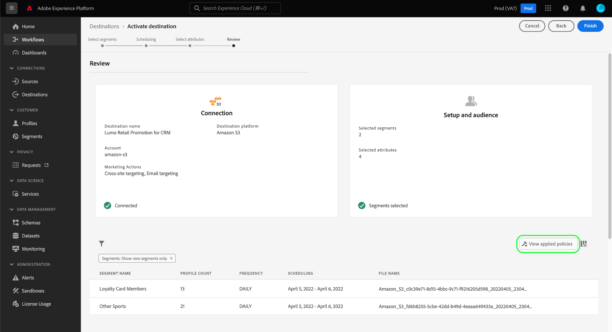

# Applicazione automatica delle regole

>[!IMPORTANT]
>
>L&#39;applicazione automatica dei criteri è disponibile solo per le organizzazioni che hanno acquistato **Scudo sanitario Adobe** o **Adobe Privacy e sicurezza scudo**.

Una volta etichettati i dati e definiti i criteri di utilizzo dei dati, puoi applicare la conformità dell’utilizzo dei dati ai criteri. Quando si attivano i segmenti di pubblico nelle destinazioni, Adobe Experience Platform applica automaticamente i criteri di utilizzo in caso di violazioni.

>[!NOTE]
>
>Questo documento si concentra sull&#39;applicazione delle politiche sulla governance dei dati e sul consenso. Per informazioni sulle politiche di controllo degli accessi, consulta la documentazione su [controllo dell&#39;accesso basato sugli attributi](../../access-control/abac/overview.md).

## Prerequisiti

Questa guida richiede una buona comprensione dei servizi Platform coinvolti nell’applicazione automatica. Per ulteriori informazioni, consulta la seguente documentazione prima di continuare con questa guida:

* [Governance dei dati di Adobe Experience Platform](../home.md): Il framework tramite il quale Platform applica la conformità all’utilizzo dei dati tramite l’uso di etichette e criteri.
* [Profilo cliente in tempo reale](../../profile/home.md): Fornisce un profilo di consumatore unificato e in tempo reale basato su dati aggregati provenienti da più origini.
* [Servizio di segmentazione di Adobe Experience Platform](../../segmentation/home.md): Il motore di segmentazione in [!DNL Platform] utilizzato per creare segmenti di pubblico dai profili cliente in base ai comportamenti e agli attributi dei clienti.
* [Destinazioni](../../destinations/home.md): Le destinazioni sono integrazioni predefinite con applicazioni comunemente utilizzate che consentono l’attivazione senza soluzione di continuità dei dati da Platform per campagne di marketing cross-channel, campagne e-mail, pubblicità mirata e altro ancora.

## Flusso di applicazione {#flow}

Il diagramma seguente illustra come l’implementazione dei criteri viene integrata nel flusso di dati dell’attivazione dei segmenti:

Quando un segmento viene attivato per la prima volta, [!DNL Policy Service] verifica le politiche applicabili in base ai seguenti fattori:

* Le etichette di utilizzo dei dati applicate ai campi e ai set di dati all’interno del segmento da attivare.
* Scopo di marketing della destinazione.
* I profili che hanno acconsentito all’inclusione nell’attivazione del segmento in base ai criteri di consenso configurati.

>[!NOTE]
>
>Se esistono etichette di utilizzo dei dati che sono state applicate solo a determinati campi all’interno di un set di dati (anziché all’intero set di dati), l’applicazione di tali etichette a livello di campo all’attivazione si verifica solo nelle seguenti condizioni:
>
>* I campi vengono utilizzati nella definizione del segmento.
>* I campi sono configurati come attributi proiettati per la destinazione di destinazione.

## Linea di dati {#lineage}

La derivazione dei dati svolge un ruolo chiave nel modo in cui i criteri vengono applicati in Platform. In termini generali, la derivazione di dati si riferisce all&#39;origine di un insieme di dati e a ciò che gli accade (o a dove si muove) nel tempo.

Nel contesto della governance dei dati, la derivazione consente alle etichette di utilizzo dei dati di propagarsi dai set di dati ai servizi a valle che utilizzano i loro dati, ad esempio Profilo cliente in tempo reale e destinazioni. Questo consente di valutare e applicare i criteri in diversi punti chiave del percorso di dati tramite Platform e fornisce contesto ai consumatori di dati sul motivo per cui si è verificata una violazione dei criteri.

Ad Experience Platform, l&#39;applicazione delle politiche riguarda la seguente linea di demarcazione:

1. I dati vengono acquisiti in Platform e memorizzati in **set di dati**.
1. I profili dei clienti sono identificati e costruiti a partire da tali set di dati unendo frammenti di dati in base alla **criterio di unione**.
1. I gruppi di profili sono suddivisi in **segmenti** basati su attributi comuni.
1. I segmenti vengono attivati a valle **destinazioni**.

Ogni fase nella timeline di cui sopra rappresenta un’entità che può contribuire all’applicazione dei criteri, come descritto nella tabella seguente:

| Fase di derivazione dei dati | Ruolo nell&#39;applicazione delle politiche |
| --- | --- |
| Set di dati | I set di dati contengono etichette di utilizzo dei dati (applicate a livello di set di dati o di campo) che definiscono per quali casi d’uso può essere utilizzato l’intero set di dati o campi specifici. Le violazioni dei criteri si verificano se un set di dati o un campo contenente determinate etichette viene utilizzato per uno scopo limitato da un criterio.  Anche gli attributi di consenso raccolti dai clienti vengono memorizzati nei set di dati. Se hai accesso ai criteri di consenso, tutti i profili che non soddisfano i requisiti di attributo di consenso dei tuoi criteri verranno esclusi dai segmenti attivati in una destinazione. |
| Criteri di unione | I criteri di unione sono regole utilizzate da Platform per determinare la priorità dei dati durante l’unione di frammenti da più set di dati. Le violazioni dei criteri si verificano se i criteri di unione sono configurati in modo che i set di dati con etichette limitate vengano attivati in una destinazione. Consulta la sezione [panoramica dei criteri di unione](../../profile/merge-policies/overview.md) per ulteriori informazioni. |
| Segmento | Le regole del segmento definiscono quali attributi includere dai profili cliente. A seconda dei campi inclusi nella definizione di un segmento, il segmento eredita eventuali etichette di utilizzo applicate a tali campi. Le violazioni dei criteri si verificano se attivi un segmento le cui etichette ereditate sono limitate dai criteri applicabili della destinazione di destinazione, in base al relativo caso d’uso di marketing. |
| Destinazione | Quando si imposta una destinazione, è possibile definire un’azione di marketing (a volte denominata caso d’uso di marketing). Questo caso d’uso è correlato a un’azione di marketing definita in un criterio. In altre parole, l’azione di marketing definita per una destinazione determina quali criteri di utilizzo dei dati e i criteri di consenso sono applicabili a tale destinazione.  Le violazioni dei criteri di utilizzo dei dati si verificano se attivi un segmento le cui etichette di utilizzo sono limitate per l’azione di marketing della destinazione.  (Beta) Quando un segmento viene attivato, tutti i profili che non contengono gli attributi di consenso richiesti per l’azione di marketing (come definito dai criteri di consenso) vengono esclusi dal pubblico attivato. |

>[!IMPORTANT]
>
>Alcuni criteri di utilizzo dei dati possono specificare due o più etichette con una relazione AND. Ad esempio, un criterio potrebbe limitare un’azione di marketing se le etichette `C1` E `C2` sono presenti entrambi, ma non limitano la stessa azione se è presente solo una di queste etichette.
>
>Quando si tratta di applicazione automatica, il framework per la governance dei dati non considera l’attivazione di segmenti separati a una destinazione come una combinazione di dati. Pertanto, l&#39;esempio `C1 AND C2` policy **NOT** applicata se queste etichette sono incluse in segmenti separati. Al contrario, questo criterio viene applicato solo quando entrambe le etichette sono presenti nello stesso segmento al momento dell’attivazione.

Quando si verificano violazioni dei criteri, i messaggi risultanti visualizzati nell’interfaccia utente forniscono strumenti utili per esplorare la linea di dati che contribuiscono alla violazione per risolvere il problema. Ulteriori dettagli sono forniti nella sezione successiva.

## Messaggi di imposizione dei criteri {#enforcement}

Le sezioni seguenti descrivono i diversi messaggi di imposizione dei criteri visualizzati nell’interfaccia utente di Platform:

* [Violazione dei criteri di utilizzo dei dati](#data-usage-violation)
* [Valutazione politica del consenso](#consent-policy-evaluation)

### Violazione dei criteri di utilizzo dei dati {#data-usage-violation}

Se si verifica una violazione di criteri durante il tentativo di attivare un segmento (o [apportare modifiche a un segmento già attivato](#policy-enforcement-for-activated-segments)) l&#39;azione viene impedita e viene visualizzato un manifesto che indica che uno o più criteri sono stati violati. Una volta attivata la violazione, la **[!UICONTROL Salva]** viene disattivato per l’entità che stai modificando fino a quando i componenti appropriati non vengono aggiornati in conformità ai criteri di utilizzo dei dati.

Seleziona una violazione di criteri nella colonna a sinistra del puntatore per visualizzare i dettagli relativi a tale violazione.

Il messaggio di violazione fornisce un riepilogo del criterio violato, incluse le condizioni che il criterio è configurato per controllare, l&#39;azione specifica che ha attivato la violazione e un elenco di possibili risoluzioni del problema.

Sotto il riepilogo delle violazioni viene visualizzato un grafico della derivazione di dati che consente di visualizzare quali set di dati, criteri di unione, segmenti e destinazioni sono stati coinvolti nella violazione dei criteri. L’entità che stai modificando viene evidenziata nel grafico, indicando quale punto del flusso sta causando la violazione. Puoi selezionare un nome di entità all’interno del grafico per aprire la pagina dei dettagli dell’entità in questione.

È inoltre possibile utilizzare **[!UICONTROL Filtro]** icona () per filtrare le entità visualizzate per categoria. Affinché i dati possano essere visualizzati, è necessario selezionare almeno due categorie.

Seleziona **[!UICONTROL Vista a elenco]** per visualizzare la derivazione dati come elenco. Per tornare al grafico visivo, seleziona **[!UICONTROL Vista a percorso]**.

### Valutazione politica del consenso {#consent-policy-evaluation}

Se [criteri di consenso creati](../policies/user-guide.md#consent-policy) e quando attivi un segmento in una destinazione, puoi vedere in che modo i criteri di consenso influiscono sulla percentuale di profili inclusi nell’attivazione.

#### Miglioramento della politica di consenso per i supporti a pagamento {#consent-policy-enhancement}

È stato apportato un miglioramento all’applicazione dei criteri di consenso sulle destinazioni di streaming, comprese le attivazioni per i media a pagamento. Questo miglioramento è disponibile per i clienti di Privacy e Security Shield o Healthcare Shield e rimuove in modo proattivo i profili dalle destinazioni di streaming quando lo stato del consenso cambia. Inoltre, assicura che le modifiche al consenso vengano propagate immediatamente in modo che il pubblico giusto sia sempre oggetto di targeting.

Questi miglioramenti consentono una maggiore fiducia nella strategia di marketing in quanto elimina la necessità per gli addetti al marketing di aggiungere manualmente gli attributi di consenso alla loro espressione di segmento. In questo modo, nessun profilo viene eseguito inavvertitamente il targeting per eventuali esperienze di marketing una volta che il consenso è stato ritirato o non è più qualificato per una politica di consenso. I criteri di consenso marketing che impostano le regole per la gestione dei dati di consenso o preferenza in diversi flussi di lavoro di marketing vengono ora applicati automaticamente nei flussi di lavoro di attivazione nelle soluzioni downstream.

>[!NOTE]
>
>Questo miglioramento non comporta alcuna modifica dell’interfaccia utente.

#### Valutazione pre-attivazione

Una volta raggiunto il **[!UICONTROL Revisione]** quando [attivazione di una destinazione](../../destinations/ui/activation-overview.md), seleziona **[!UICONTROL Visualizza criteri applicati]**.

Viene visualizzata una finestra di dialogo di controllo dei criteri che mostra in anteprima in che modo i criteri di consenso influiscono sul pubblico consenziente dei segmenti attivati.

La finestra di dialogo mostra il pubblico autorizzato per un segmento alla volta. Per visualizzare la valutazione dei criteri per un segmento diverso, utilizza il menu a discesa sopra il diagramma per selezionarne uno dall’elenco.

Utilizza la barra a sinistra per passare dai criteri di consenso applicabili al segmento selezionato. I criteri non selezionati sono rappresentati in &quot;[!UICONTROL Altre politiche]&quot; sezione del diagramma.

Il diagramma mostra la sovrapposizione tra tre gruppi di profili:

1. Profili idonei per il segmento selezionato
1. Profili idonei per il criterio di consenso selezionato
1. Profili qualificati per gli altri criteri di consenso applicabili per il segmento (denominati &quot;[!UICONTROL Altre politiche]&quot; nel diagramma)

I profili idonei per tutti e tre i gruppi di cui sopra rappresentano il pubblico autorizzato per il segmento selezionato, riepilogato nella barra a destra.

Passa il puntatore del mouse su uno dei tipi di pubblico nel diagramma per visualizzare il numero di profili contenuti.

Il pubblico autorizzato è rappresentato dalla sovrapposizione centrale del diagramma e può essere evidenziato come le altre sezioni.

#### Applicazione dell&#39;esecuzione del flusso

Quando i dati vengono attivati in una destinazione, i dettagli dell’esecuzione di flusso mostrano il numero di identità escluse a causa dei criteri di consenso attivo.

## Applicazione dei criteri per i segmenti attivati {#policy-enforcement-for-activated-segments}

L’applicazione dei criteri si applica ancora ai segmenti dopo che sono stati attivati, limitando le modifiche a un segmento o alla sua destinazione che si traducono in una violazione dei criteri. A causa di come [derivazione dati](#lineage) agisce nell&#39;applicazione dei criteri; una delle seguenti azioni può potenzialmente determinare una violazione:

* Aggiornamento delle etichette di utilizzo dei dati
* Modifica dei set di dati per un segmento
* Modifica dei predicati dei segmenti
* Modifica delle configurazioni di destinazione

Se una delle azioni precedenti causa una violazione, tale azione non viene salvata e viene visualizzato un messaggio di violazione dei criteri, garantendo che i segmenti attivati continuino a rispettare i criteri di utilizzo dei dati in fase di modifica.

## Passaggi successivi

In questo documento è stato illustrato il funzionamento, ad Experience Platform, dell&#39;applicazione automatica delle regole. Per informazioni su come integrare programmaticamente l’applicazione dei criteri nelle applicazioni utilizzando le chiamate API, consulta la guida su [Implementazione basata su API](./api-enforcement.md).
