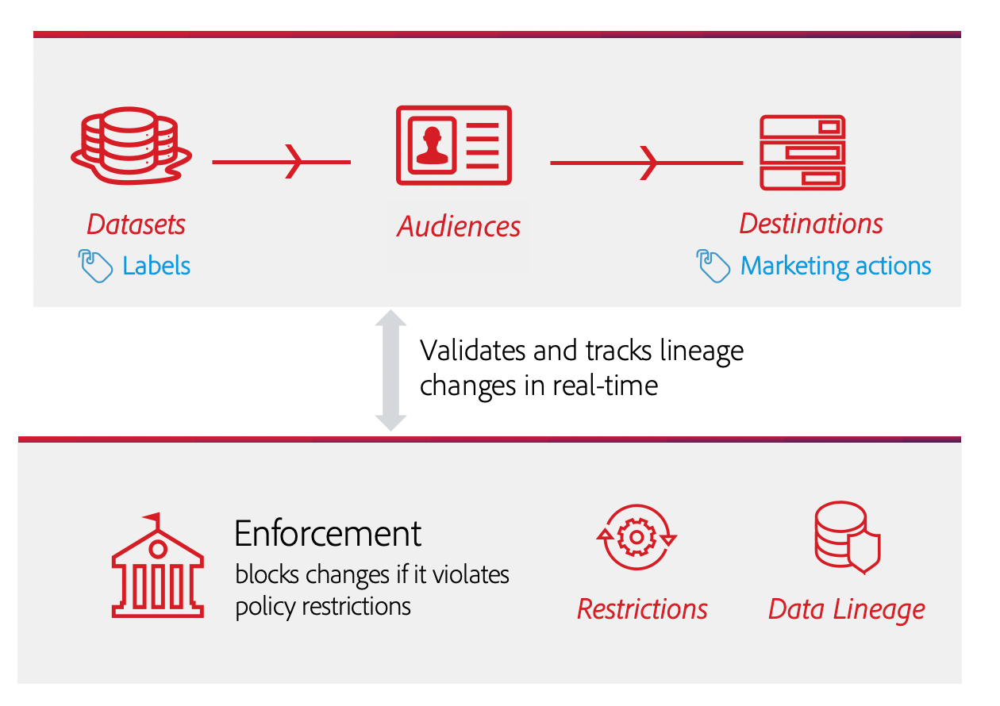

# Applicazione automatica delle regole

Una volta etichettati i dati e definiti i criteri di utilizzo, puoi applicare la conformità dell’utilizzo dei dati ai criteri. Quando si attivano i segmenti di pubblico nelle destinazioni, Adobe Experience Platform applica automaticamente i criteri di utilizzo in caso di violazioni.

## Prerequisiti

Questa guida richiede una buona comprensione dei servizi Platform coinvolti nell’applicazione automatica. Per ulteriori informazioni, consulta la seguente documentazione prima di continuare con questa guida:

* [Governance](../home.md) dei dati di Adobe Experience Platform: Il framework tramite il quale Platform applica la conformità all’utilizzo dei dati tramite l’uso di etichette e criteri.
* [Profilo](../../profile/home.md) cliente in tempo reale: Fornisce un profilo di consumatore unificato e in tempo reale basato su dati aggregati provenienti da più origini.
* [Servizio](../../segmentation/home.md) di segmentazione di Adobe Experience Platform: Il motore di segmentazione all’interno  [!DNL Platform] utilizzato per creare segmenti di pubblico dai profili dei clienti in base ai comportamenti e agli attributi dei clienti.
* [Destinazioni](../../destinations/home.md): Le destinazioni sono integrazioni predefinite con applicazioni comunemente utilizzate che consentono l’attivazione senza soluzione di continuità dei dati da Platform per campagne di marketing cross-channel, campagne e-mail, pubblicità mirata e altro ancora.

## Flusso di applicazione {#flow}

Il diagramma seguente illustra come l’implementazione dei criteri viene integrata nel flusso di dati dell’attivazione dei segmenti:

Quando un segmento viene attivato per la prima volta, [!DNL Policy Service] verifica la presenza di violazioni dei criteri in base ai seguenti fattori:

* Le etichette di utilizzo dei dati applicate ai campi e ai set di dati all’interno del segmento da attivare.
* Scopo di marketing della destinazione.

>[!NOTE]
>
>Se esistono etichette di utilizzo dei dati che sono state applicate solo a determinati campi all’interno di un set di dati (anziché all’intero set di dati), l’applicazione di tali etichette a livello di campo all’attivazione si verifica solo nelle seguenti condizioni:
>
>* I campi vengono utilizzati nella definizione del segmento.
>* I campi sono configurati come attributi proiettati per la destinazione di destinazione.

## Linea di dati {#lineage}

La derivazione dei dati svolge un ruolo chiave nel modo in cui i criteri vengono applicati in Platform. In termini generali, la derivazione di dati si riferisce all&#39;origine di un insieme di dati e a ciò che gli accade (o a dove si muove) nel tempo.

Nel contesto di [!DNL Data Governance], la derivazione consente alle etichette di utilizzo dei dati di propagarsi dai set di dati ai servizi a valle che utilizzano i loro dati, ad esempio Profilo cliente in tempo reale e destinazioni. Questo consente di valutare e applicare i criteri in diversi punti chiave del percorso di dati tramite Platform e fornisce contesto ai consumatori di dati sul motivo per cui si è verificata una violazione dei criteri.

Ad Experience Platform, l&#39;applicazione delle politiche riguarda la seguente linea di demarcazione:

1. I dati vengono acquisiti in Platform e memorizzati in **set di dati**.
1. I profili cliente sono identificati e costruiti a partire da tali set di dati unendo frammenti di dati in base al **criterio di unione**.
1. I gruppi di profili sono suddivisi in **segmenti** in base agli attributi comuni.
1. I segmenti vengono attivati nelle **destinazioni** a valle.

Ogni fase nella timeline di cui sopra rappresenta un’entità che può contribuire alla violazione di un criterio, come descritto nella tabella seguente:

| Fase di derivazione dei dati | Ruolo nell&#39;applicazione delle politiche |
| --- | --- |
| Set di dati | I set di dati contengono etichette di utilizzo dei dati (applicate a livello di set di dati o di campo) che definiscono per quali casi d’uso può essere utilizzato l’intero set di dati o campi specifici. Le violazioni dei criteri si verificano se un set di dati o un campo contenente determinate etichette viene utilizzato per uno scopo limitato da un criterio. |
| Criteri di unione | I criteri di unione sono regole utilizzate da Platform per determinare la priorità dei dati durante l’unione di frammenti da più set di dati. Le violazioni dei criteri si verificano se i criteri di unione sono configurati in modo che i set di dati con etichette limitate vengano attivati in una destinazione. Per ulteriori informazioni, consulta la guida sull’ [unione dei criteri](../../profile/ui/merge-policies.md) . |
| Segmento | Le regole del segmento definiscono quali attributi includere dai profili cliente. A seconda dei campi inclusi nella definizione di un segmento, il segmento eredita eventuali etichette di utilizzo applicate a tali campi. Le violazioni dei criteri si verificano se attivi un segmento le cui etichette ereditate sono limitate dai criteri applicabili della destinazione di destinazione, in base al relativo caso d’uso di marketing. |
| Destinazione | Quando si imposta una destinazione, è possibile definire un’azione di marketing (a volte denominata caso d’uso di marketing). Questo caso d’uso è correlato a un’azione di marketing definita in un criterio di utilizzo dei dati. In altre parole, il caso di utilizzo marketing definito per una destinazione determina quali criteri di utilizzo dei dati sono applicabili a tale destinazione. Le violazioni dei criteri si verificano se attivi un segmento le cui etichette di utilizzo sono limitate dai criteri applicabili della destinazione di destinazione. |

Quando si verificano violazioni dei criteri, i messaggi risultanti visualizzati nell’interfaccia utente forniscono strumenti utili per esplorare la linea di dati che contribuiscono alla violazione per risolvere il problema. Ulteriori dettagli sono forniti nella sezione successiva.

## Messaggi di violazione dei criteri {#enforcement}

Se si verifica una violazione dei criteri durante l&#39;attivazione di un segmento (o [l&#39;apposizione di modifiche a un segmento già attivato](#policy-enforcement-for-activated-segments)), l&#39;azione viene impedita e viene visualizzato un puntatore che indica che uno o più criteri sono stati violati. Una volta attivata la violazione, il pulsante **[!UICONTROL Save]** viene disattivato per l’entità che stai modificando fino a quando i componenti appropriati non vengono aggiornati per conformarsi ai criteri di utilizzo dei dati.

Seleziona una violazione di criteri nella colonna a sinistra del puntatore per visualizzare i dettagli relativi a tale violazione.

Il messaggio di violazione fornisce un riepilogo del criterio violato, incluse le condizioni che il criterio è configurato per controllare, l&#39;azione specifica che ha attivato la violazione e un elenco di possibili risoluzioni del problema.

Sotto il riepilogo delle violazioni viene visualizzato un grafico della derivazione di dati che consente di visualizzare quali set di dati, criteri di unione, segmenti e destinazioni sono stati coinvolti nella violazione dei criteri. L’entità che stai modificando viene evidenziata nel grafico, indicando quale punto del flusso sta causando la violazione. Puoi selezionare un nome di entità all’interno del grafico per aprire la pagina dei dettagli dell’entità in questione.

È inoltre possibile utilizzare l&#39;icona **[!UICONTROL Filter]** () per filtrare le entità visualizzate per categoria. Affinché i dati possano essere visualizzati, è necessario selezionare almeno due categorie.

Selezionare **[!UICONTROL List view]** per visualizzare la derivazione dati come elenco. Per tornare al grafico visivo, seleziona **[!UICONTROL Path view]**.

## Applicazione dei criteri per i segmenti attivati {#policy-enforcement-for-activated-segments}

L’applicazione dei criteri si applica ancora ai segmenti dopo che sono stati attivati, limitando le modifiche a un segmento o alla sua destinazione che si traducono in una violazione dei criteri. A causa del funzionamento di [data lineage](#lineage) nell&#39;applicazione dei criteri, una delle seguenti azioni può potenzialmente causare una violazione:

* Aggiornamento delle etichette di utilizzo dei dati
* Modifica dei set di dati per un segmento
* Modifica dei predicati dei segmenti
* Modifica delle configurazioni di destinazione

Se una delle azioni precedenti causa una violazione, tale azione non viene salvata e viene visualizzato un messaggio di violazione dei criteri, garantendo che i segmenti attivati continuino a rispettare i criteri di utilizzo dei dati in fase di modifica.

## Passaggi successivi

In questo documento è stato illustrato il funzionamento, ad Experience Platform, dell&#39;applicazione automatica delle regole. Per i passaggi su come integrare programmaticamente l’applicazione dei criteri nelle applicazioni utilizzando le chiamate API, consulta la guida sull’ [imposizione basata su API](./api-enforcement.md).
