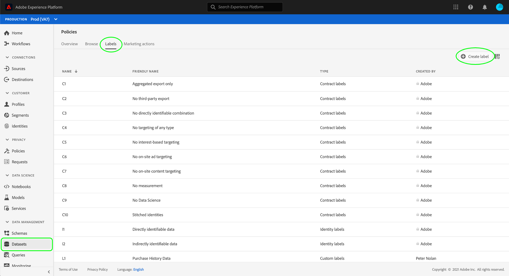

# Gestire le etichette di utilizzo dei dati nell’interfaccia utente

Questa guida utente descrive i passaggi per l’utilizzo delle etichette di utilizzo dei dati all’interno di [!DNL Experience Platform] interfaccia utente. Prima di usare la guida, consulta la sezione [Panoramica sulla governance dei dati](../home.md) per un’introduzione più solida al framework per la governance dei dati.

## Gestire le etichette a livello di set di dati

Per gestire le etichette di utilizzo dei dati a livello di set di dati, devi selezionare un set di dati esistente o crearne uno nuovo. Dopo aver effettuato l’accesso a Adobe Experience Platform, seleziona **[!UICONTROL Set di dati]** nella navigazione a sinistra per aprire il **[!UICONTROL Set di dati]** workspace. In questa pagina sono elencati tutti i set di dati creati appartenenti all’organizzazione, insieme a utili dettagli relativi a ciascun set di dati.

La sezione successiva descrive i passaggi necessari per creare un nuovo set di dati a cui applicare le etichette. Per modificare le etichette di un set di dati esistente, selezionalo dall’elenco e passa a [aggiunta di etichette di utilizzo dati al set di dati](#add-labels).

### Creare un nuovo set di dati

>[!NOTE]
>
>In questo esempio, un set di dati viene creato utilizzando una [!DNL Experience Data Model] Schema (XDM). Per ulteriori informazioni sugli schemi XDM, consulta la sezione [Panoramica del sistema XDM](../../xdm/home.md) e [nozioni di base sulla composizione dello schema](../../xdm/schema/composition.md).

Per creare un nuovo set di dati, seleziona **[!UICONTROL Crea set di dati]** nell&#39;angolo in alto a destra del **[!UICONTROL Set di dati]** workspace.

La **[!UICONTROL Crea set di dati]** viene visualizzata la schermata . Da qui, seleziona **[!UICONTROL Crea set di dati da schema]**.

La **[!UICONTROL Seleziona schema]** viene visualizzata una schermata in cui sono elencati tutti gli schemi disponibili che è possibile utilizzare per creare un set di dati. Selezionare il pulsante di scelta accanto a uno schema per selezionarlo. La **[!UICONTROL Schemi]** nella sezione a destra vengono visualizzati ulteriori dettagli sullo schema selezionato. Dopo aver selezionato uno schema, seleziona **[!UICONTROL Successivo]**.

La **[!UICONTROL Configura set di dati]** viene visualizzata la schermata . Specifica un nome (obbligatorio) e una descrizione (facoltativa, ma consigliata) per il nuovo set di dati, quindi seleziona **[!UICONTROL Fine]**.

La **[!UICONTROL Attività set di dati]** viene visualizzata una pagina contenente informazioni sul set di dati appena creato. In questo esempio, il set di dati è denominato &quot;Membri fedeltà&quot;, quindi viene visualizzata la navigazione superiore **Set di dati > Membri fedeltà**.

### Aggiungere etichette di utilizzo dei dati al set di dati {#add-labels}

Dopo aver creato un nuovo set di dati o aver selezionato un set di dati esistente dall’elenco in **[!UICONTROL Set di dati]** area di lavoro, seleziona **[!UICONTROL Governance dei dati]** per aprire **[!UICONTROL Governance dei dati]** workspace. L’area di lavoro consente di gestire le etichette di utilizzo dei dati a livello di set di dati e di campo.

Per modificare le etichette di utilizzo dei dati a livello di set di dati, inizia selezionando l’icona a forma di matita accanto al nome del set di dati.

La **[!UICONTROL Modificare le etichette di governance]** viene visualizzata la finestra di dialogo . Nella finestra di dialogo , seleziona le caselle accanto alle etichette da applicare al set di dati. Tieni presente che queste etichette verranno ereditate da tutti i campi all’interno del set di dati. La **[!UICONTROL Etichette applicate]** l&#39;intestazione viene aggiornata mentre controlli ogni casella, mostrando le etichette selezionate. Dopo aver selezionato le etichette desiderate, seleziona **[!UICONTROL Salva modifiche]**.

La **[!UICONTROL Governance dei dati]** viene visualizzata nuovamente l&#39;area di lavoro, mostrando le etichette applicate a livello di set di dati. Inoltre, puoi vedere che le etichette vengono ereditate fino a ciascuno dei campi all’interno del set di dati.

Nota che accanto alle etichette a livello di set di dati viene visualizzata una &quot;x&quot; che consente di rimuovere le etichette. Le etichette ereditate accanto a ciascun campo non dispongono di una &quot;x&quot; accanto a esse e vengono visualizzate in grigio senza possibilità di rimuovere o modificare. Questo perché **i campi ereditati sono di sola lettura**, ovvero non possono essere rimosse a livello di campo.

La **[!UICONTROL Mostra etichette ereditate]** per impostazione predefinita, l’opzione è attivata e consente di visualizzare nei relativi campi le etichette ereditate dal set di dati. Quando si disattiva l’opzione , vengono nascoste tutte le etichette ereditate all’interno del set di dati.

## Gestire le etichette a livello di campo del set di dati

Continua del flusso di lavoro per [aggiunta e modifica di etichette di utilizzo dati a livello di set di dati](#add-labels), puoi anche gestire le etichette a livello di campo all’interno della **[!UICONTROL Governance dei dati]** area di lavoro per quel set di dati.

Per applicare le etichette di utilizzo dei dati a un singolo campo, seleziona la casella di controllo accanto al nome del campo, quindi seleziona **[!UICONTROL Modificare le etichette di governance]**.

La **[!UICONTROL Modificare le etichette di governance]** viene visualizzata la finestra di dialogo . Nella finestra di dialogo vengono visualizzate intestazioni che mostrano i campi selezionati, le etichette applicate e le etichette ereditate. Le etichette ereditate (C2 e C5) sono disattivate nella finestra di dialogo. Sono etichette di sola lettura ereditate dal livello di set di dati e sono quindi modificabili solo a livello di set di dati.

Seleziona le etichette a livello di campo selezionando la casella di controllo accanto a ciascuna etichetta da utilizzare. Quando selezioni le etichette, **[!UICONTROL Etichette applicate]** aggiornamenti dell’intestazione per mostrare le etichette applicate ai campi visualizzati nella **[!UICONTROL Campi selezionati]** intestazione. Dopo aver selezionato le etichette a livello di campo, seleziona **[!UICONTROL Salva modifiche]**.

La **[!UICONTROL Governance dei dati]** viene visualizzata nuovamente l’area di lavoro, che ora visualizza le etichette a livello di campo selezionate nella riga accanto al nome del campo. L’etichetta a livello di campo ha una &quot;x&quot; accanto a essa, che consente di rimuovere l’etichetta.

Puoi ripetere questi passaggi per continuare ad aggiungere e modificare etichette a livello di campo per altri campi, inclusa la selezione di più campi per applicare etichette a livello di campo contemporaneamente.

È importante ricordare che l’ereditarietà si sposta solo dall’alto verso il basso (set di dati → campi), il che significa che le etichette applicate a livello di campo non vengono propagate ad altri campi o set di dati.

## Gestione delle etichette a livello di schema

È possibile aggiungere etichette direttamente a uno schema o più campi all&#39;interno di tale schema. Tutti i campi applicati a livello di schema verranno propagati a tutti i set di dati basati su tale schema.

Guarda l’esercitazione su [gestione delle etichette a livello di schema](../../xdm/tutorials/labels.md) per ulteriori informazioni.

## Gestire le etichette personalizzate {#manage-custom-labels}

>[!CONTEXTUALHELP]
>id="platform_governance_createlabels"
>title="Create labels (Creare etichette)"
>abstract="Le etichette consentono di classificare set di dati e campi in base ai criteri di utilizzo applicati a tali dati. Platform fornisce un set standard di etichette da utilizzare, ma puoi anche creare etichette personalizzate specifiche per la tua organizzazione."

Puoi creare etichette di utilizzo personalizzate all’interno di **[!UICONTROL Criteri]** nell&#39;area di lavoro [!DNL Experience Platform] Interfaccia utente. Seleziona **[!UICONTROL Criteri]** nella navigazione a sinistra, seleziona **[!UICONTROL Etichette]** per visualizzare un elenco delle etichette esistenti. Da qui, seleziona **[!UICONTROL Crea etichetta]**.

La **[!UICONTROL Crea etichetta]** viene visualizzata la finestra di dialogo . Da qui, fornisci le seguenti informazioni per la nuova etichetta:

* **[!UICONTROL Identificatore]**: Identificatore univoco dell&#39;etichetta. Questo valore viene utilizzato a scopo di ricerca e deve quindi essere breve e conciso.
* **[!UICONTROL Nome]**: Un nome visualizzato descrittivo per l’etichetta.
* **[!UICONTROL Descrizione]**: (Facoltativo) Una descrizione dell’etichetta per fornire ulteriore contesto.

Al termine, seleziona **[!UICONTROL Crea]**.

La finestra di dialogo viene chiusa e l’etichetta personalizzata appena creata viene visualizzata nell’elenco sotto la **[!UICONTROL Etichette]** scheda .

L’etichetta può ora essere selezionata in **[!UICONTROL Etichette personalizzate]** durante la modifica delle etichette di utilizzo per set di dati e campi o durante la creazione di criteri di utilizzo dei dati.

 

## Passaggi successivi

Dopo aver aggiunto le etichette di utilizzo dei dati a livello di set di dati e di campo, puoi iniziare a inserire i dati in [!DNL Experience Platform]. Per saperne di più, inizia leggendo il [documentazione sull’acquisizione dei dati](../../ingestion/home.md).

È inoltre possibile definire criteri di utilizzo dei dati in base alle etichette applicate. Per ulteriori informazioni, consulta la sezione [panoramica dei criteri di utilizzo dei dati](../policies/overview.md).

## Risorse aggiuntive

Il video seguente ha lo scopo di comprendere la governance dei dati e illustra come applicare le etichette a un set di dati e a singoli campi.

>[!VIDEO](https://video.tv.adobe.com/v/29709?quality=12&enable10seconds=on&speedcontrol=on)
