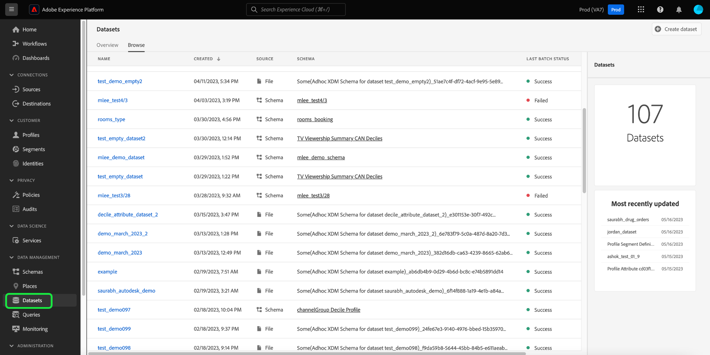
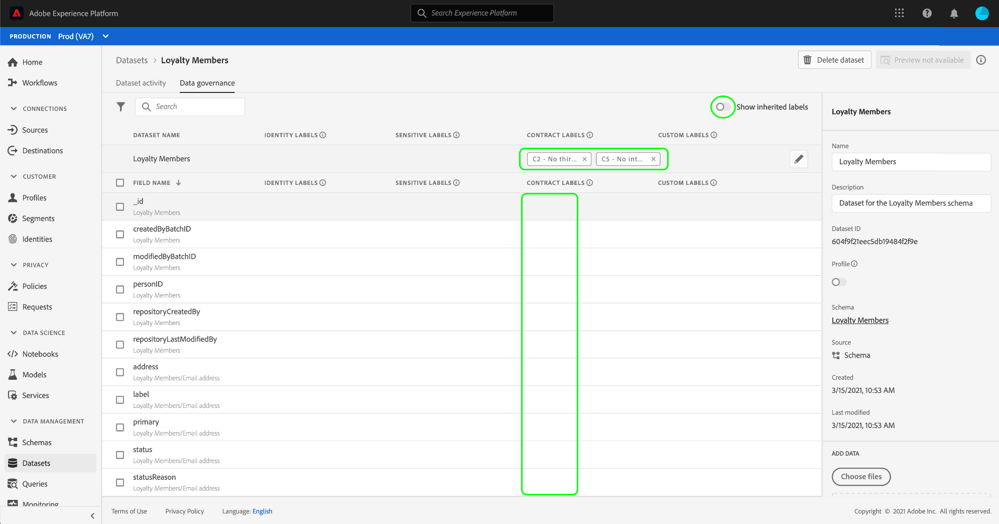
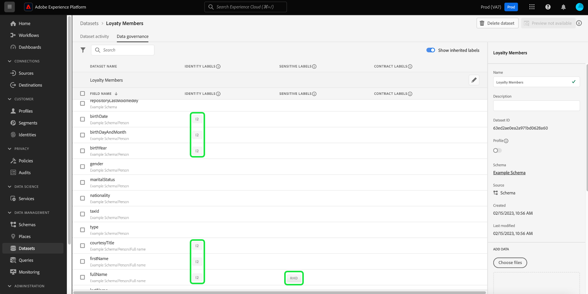
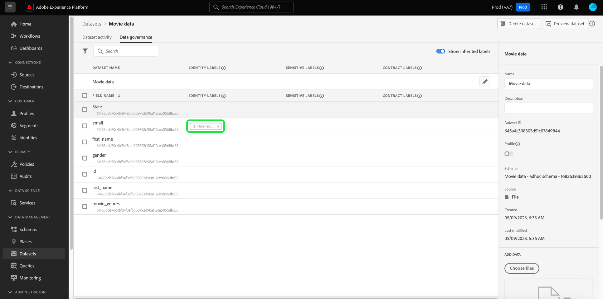

# Gestire le etichette di utilizzo dei dati nell’interfaccia utente {#user-guide}

>[!CONTEXTUALHELP]
>id="platform_privacyConsole_dataGovernance_description"
>title="Gestire l’utilizzo dei dati in Platform"
>abstract="<h2>Descrizione</h2>
Il framework della governance dei dati in Experience Platform consente di etichettare gli attributi e i set di dati in base alle restrizioni di utilizzo dei dati e di impostare criteri che identifichino e rispettino tali restrizioni per azioni di marketing specifiche.
"

Questa guida utente descrive i passaggi per lavorare con le etichette di utilizzo dei dati in [!DNL Experience Platform] dell&#39;utente.

## Gestisci etichette {#manage-labels}

Per applicare le etichette ai dati, è necessario **[!UICONTROL Gestisci etichette di utilizzo]** autorizzazione per l’utilizzo nella sandbox di produzione predefinita denominata &quot;prod&quot;. Per creare un’etichetta personalizzata, devi anche disporre di diritti di amministrazione sul profilo del prodotto. Ogni organizzazione dispone di un solo elenco di etichette applicabili e al momento l’eliminazione delle etichette non è supportata.

Consulta la guida su come [configurare le autorizzazioni](https://experienceleague.adobe.com/docs/platform-learn/getting-started-for-data-architects-and-data-engineers/configure-permissions.html?lang=it) o [panoramica sul controllo degli accessi](../../access-control/home.md) per ulteriori informazioni su come assegnare un&#39;autorizzazione. Se non hai accesso all’Admin Console per la tua organizzazione, contatta l’amministratore della tua organizzazione.

## Gestire le etichette a livello di schema

Puoi aggiungere etichette direttamente a uno schema o a campi all’interno di tale schema. Tutti i campi applicati a livello di schema verranno propagati a tutti i set di dati basati su tale schema.

>[!NOTE]
>
>Se i criteri di utilizzo dei dati sono stati creati prima dell’assegnazione dell’etichetta al campo, è possibile che venga visualizzata una finestra di dialogo per la violazione dei criteri di governance quando si applicano le etichette al nuovo schema. Questa finestra di dialogo indica che l’applicazione di questa etichetta violerà un criterio di utilizzo esistente. Utilizza il diagramma di derivazione dati per capire quali altre modifiche di configurazione devono essere apportate prima di poter aggiungere l’etichetta al campo schema.
>
>
>
>Consulta la [documentazione sulle violazioni dei criteri di utilizzo dei dati](https://experienceleague.adobe.com/en/docs/experience-platform/data-governance/enforcement/auto-enforcement#data-usage-violation) per ulteriori informazioni sulle violazioni parziali dei criteri.

Per gestire le etichette di utilizzo dei dati a livello di schema, è necessario selezionare uno schema esistente o crearne uno nuovo. Dopo aver effettuato l’accesso a Adobe Experience Platform, seleziona **[!UICONTROL Schemi]** nella barra di navigazione a sinistra per aprire **[!UICONTROL Schemi]** Workspace. Questa pagina elenca tutti gli schemi creati appartenenti alla tua organizzazione, insieme a dettagli utili relativi a ciascuno schema.

La sezione successiva descrive i passaggi necessari per creare un nuovo schema a cui applicare le etichette. Se desideri modificare le etichette per uno schema esistente, seleziona lo schema dall’elenco e passa a [aggiunta di etichette di utilizzo dati allo schema](#add-labels).

### Crea un nuovo schema

Per creare un nuovo schema, seleziona **[!UICONTROL Crea schema]** nell&#39;angolo in alto a destra del **[!UICONTROL Schemi]** Workspace. Consulta la guida su [come creare uno schema tramite l’Editor di schema](../../xdm/tutorials/create-schema-ui.md#create) per istruzioni complete. In alternativa, è possibile: [creare uno schema utilizzando l’API Schema Registry](../../xdm/tutorials/create-schema-api.md) se necessario.

### Aggiungere etichette di utilizzo dati a uno schema {#add-labels-to-schema}

Dopo la creazione di un nuovo schema o la selezione di uno schema esistente dall&#39;elenco in [!UICONTROL Sfoglia] scheda di [!UICONTROL Schemi] nell’area di lavoro, seleziona un campo dallo schema nell’Editor di schema. In [!UICONTROL Proprietà campo] barra laterale, seleziona **[!UICONTROL Applica etichette di accesso e governance dei dati]**.

Viene visualizzata una finestra di dialogo che consente di applicare e gestire le etichette di utilizzo dei dati a livello di schema e di campo. Per istruzioni complete su, consulta il tutorial XDM [come aggiungere o modificare le etichette di utilizzo dei dati per gli schemi XDM](../../xdm/tutorials/labels.md#select-schema-field).

### Aggiungere etichette di utilizzo dei dati a un set di dati specifico {#add-labels-to-dataset}

>[!CONTEXTUALHELP]
>id="platform_privacyConsole_dataGovernance_instructions"
>title="Istruzioni"
>abstract="<ol><li>Seleziona <a href="https://experienceleague.adobe.com/docs/experience-platform/data-governance/labels/user-guide.html?lang=it">Set di dati</a> nella barra di navigazione a sinistra, quindi seleziona il set di dati a cui desideri imporre limitazioni.</li><li>Dalla visualizzazione dei dettagli del set di dati, seleziona la scheda <b>Governance dei dati</b>.</li><li>Seleziona i campi del set di dati che desideri limitare, quindi seleziona <b>Modifica etichette di governance</b> per etichettare i dati in base a restrizioni di utilizzo.</li><li>Dopo aver etichettato i dati, seleziona <a href="https://experienceleague.adobe.com/docs/experience-platform/data-governance/policies/overview.html?lang=it">Criteri</a> nella barra di navigazione a sinistra, quindi seleziona <b>Crea criterio</b>.</li><li>Scegli di creare un <a href="https://experienceleague.adobe.com/docs/experience-platform/data-governance/policies/user-guide.html?lang=it#create-governance-policy">Criterio di governance dei dati</a>, quindi seleziona le etichette di utilizzo dei dati applicabili al criterio.</li><li>Seleziona le azioni di marketing che il criterio dovrà rifiuterà per i dati contenenti tali etichette. Dopo aver creato il criterio, selezionalo dall’elenco e abilitalo utilizzando l’interruttore nella barra a destra.</li><li>Per ogni criterio abilitato, Platform impedisce che i dati contenenti le etichette specificate possano essere utilizzati nelle azioni di marketing definite. Questo viene eseguito automaticamente quando si tenta di attivare i dati con la relativa etichetta in una destinazione a cui sono associate le specifiche azioni di marketing (casi d’uso).</li></ol>"

>[!IMPORTANT]
>
>Le etichette non possono più essere applicate ai campi a livello di set di dati. Questo flusso di lavoro è stato dichiarato obsoleto a favore dell’applicazione di etichette a livello di schema. Eventuali etichette applicate in precedenza a livello di oggetto del set di dati continueranno a essere supportate tramite l’interfaccia utente di Platform fino al 31 maggio 2024. Per garantire che le etichette siano coerenti in tutti gli schemi, tutte le etichette precedentemente associate ai campi a livello di set di dati devono essere migrate a livello di schema da te nel corso dell’anno successivo. Per istruzioni su, consulta la documentazione di [come migrare le etichette applicate in precedenza dal set di dati al livello dello schema](../e2e.md#migrate-labels).

Le etichette possono essere applicate all’intero set di dati dalla sezione **[!UICONTROL Governance dei dati]** scheda di **[!UICONTROL Set di dati]** Workspace. L’area di lavoro ti consente di gestire le etichette di utilizzo dei dati a livello di set di dati.

![Il [!UICONTROL Governance dei dati] scheda di [!UICONTROL Set di dati] con Governance dei dati evidenziata.](../images/labels/dataset-governance.png)

Per modificare le etichette di utilizzo dei dati a livello di set di dati, inizia selezionando l’icona a forma di matita () nella riga del nome del set di dati.

![Il [!UICONTROL Governance dei dati] scheda di [!UICONTROL Set di dati] workspace con l&#39;icona modifica matita evidenziata.](../images/labels/dataset-level-edit.png)

Il **[!UICONTROL Modifica etichette di governance]** viene visualizzata una finestra di dialogo. Nella finestra di dialogo, seleziona le caselle accanto alle etichette da applicare al set di dati. Ricorda che queste etichette verranno ereditate da tutti i campi all’interno del set di dati. Il **[!UICONTROL Etichette applicate]** l’intestazione viene aggiornata quando selezioni ogni casella, mostrando le etichette scelte. Dopo aver selezionato le etichette desiderate, seleziona **[!UICONTROL Salva modifiche]**.

Il **[!UICONTROL Governance dei dati]** workspace viene nuovamente visualizzato, mostrando le etichette applicate a livello di set di dati nella riga iniziale della tabella. Puoi anche vedere le etichette, indicate da singole schede, che vengono ereditate fino a ciascuno dei campi all’interno del set di dati.

![Il [!UICONTROL Governance dei dati] scheda di [!UICONTROL Set di dati] area di lavoro con etichette a livello di set di dati applicate ed etichette di campo del set di dati ereditate evidenziate.](../images/labels/applied-dataset-labels.png)

### Rimuovere le etichette da un set di dati {#remove-labels-from-a-dataset}

Le etichette aggiunte a livello di set di dati presentano una &quot;x&quot; accanto alla scheda. Questo consente di rimuovere le etichette dall’intero set di dati. Le etichette ereditate accanto a ciascun campo non hanno una &quot;x&quot; accanto e appaiono &quot;disattivate&quot;. Questi **le etichette ereditate sono di sola lettura**, il che significa che non possono essere rimosse o modificate a livello di campo.

<!-- ## View labels at the dataset field level {#view-labels-at-dataset-field-level} -->

<!-- To view labels inherited by the dataset from the schema level, select **[!UICONTROL Datasets]** to navigate to the datasets workspace and select the relevant dataset from the list. 

Next, select the **[!UICONTROL Data Governance]** tab to show the labels that have been applied to the dataset. You can also see that the labels are inherited down to each of the fields within the dataset.

The inherited labels beside each field do not have an "x" next to them and appear "greyed out" with no ability to remove or edit. This is because **inherited fields are read-only**, meaning they cannot be removed at the field level. -->

<!--Beleive can cut above here  -->

Il **[!UICONTROL Mostra etichette ereditate]** l’opzione è attivata per impostazione predefinita, consente di visualizzare tutte le etichette ereditate dallo schema ai relativi campi. Se si disattiva l’opzione, vengono nascoste tutte le etichette ereditate all’interno del set di dati.

<!-- Labels applied to the dataset appear in read-only form within the **[!UICONTROL Data Governance]** view for that dataset. 

 -->

>[!NOTE]
>
>Le etichette applicate prima che la funzione di etichettatura del set di dati diventasse obsoleta possono essere rimosse dal set di dati individuando il set di dati pertinente e selezionando l’icona Annulla sull’etichetta.
>
>Per istruzioni su, consulta la documentazione di [come migrare le etichette applicate in precedenza dal set di dati al livello dello schema](../e2e.md#migrate-labels).

## Gestire le etichette personalizzate {#manage-custom-labels}

>[!CONTEXTUALHELP]
>id="platform_governance_createlabels"
>title="Create labels (Creare etichette)"
>abstract="Le etichette consentono di classificare set di dati e campi in base ai criteri di utilizzo applicati a tali dati. Platform fornisce un set standard di etichette da utilizzare, ma puoi anche creare etichette personalizzate specifiche per la tua organizzazione."

Puoi creare etichette di utilizzo personalizzate all&#39;interno del **[!UICONTROL Criteri]** area di lavoro in [!DNL Experience Platform] UI. Seleziona **[!UICONTROL Criteri]** nel menu di navigazione a sinistra, quindi seleziona **[!UICONTROL Etichette]** per visualizzare un elenco di etichette esistenti. Da qui, seleziona **[!UICONTROL Crea etichetta]**.

Il **[!UICONTROL Crea etichetta]** viene visualizzata. Da qui, fornisci le seguenti informazioni per la nuova etichetta:

* **[!UICONTROL Nome]**: identificatore univoco dell’etichetta. Questo valore viene utilizzato a scopo di ricerca e deve quindi essere breve e conciso.
* **[!UICONTROL Nome intuitivo]**: nome visualizzato descrittivo per l’etichetta.
* **[!UICONTROL Descrizione]**: (facoltativo) descrizione dell’etichetta per fornire ulteriore contesto.

Al termine, seleziona **[!UICONTROL Crea]**.

La finestra di dialogo si chiude e l’etichetta personalizzata appena creata viene visualizzata nell’elenco sotto **[!UICONTROL Etichette]** scheda.

L’etichetta ora può essere selezionata in **[!UICONTROL Etichette personalizzate]** durante la modifica delle etichette di utilizzo per set di dati e campi o durante la creazione di criteri di utilizzo dei dati.

## Passaggi successivi

Ora che hai aggiunto le etichette di utilizzo dei dati a livello di set di dati e di campo, puoi iniziare ad acquisire i dati in [!DNL Experience Platform]. Per ulteriori informazioni, consulta la sezione [documentazione sull’acquisizione dei dati](../../ingestion/home.md).

Ora puoi anche definire i criteri di utilizzo dei dati in base alle etichette applicate. Per ulteriori informazioni, vedere [panoramica dei criteri di utilizzo dei dati](../policies/overview.md).

<!-- The workflow of this video is now outdated. This can be enabled once the video has been updated

## Additional resources

The following video is intended to support your understanding of Data Governance, and outlines how to apply labels to a dataset and individual fields.

>[!VIDEO](https://video.tv.adobe.com/v/29709?quality=12&enable10seconds=on&speedcontrol=on) -->
