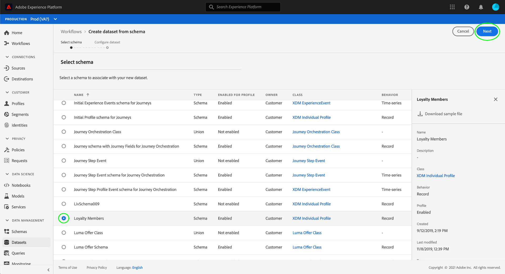

# Gestire le etichette di utilizzo dei dati nell’interfaccia utente

Questa guida utente descrive i passaggi per l’utilizzo delle etichette di utilizzo dei dati all’interno dell’ interfaccia utente [!DNL Experience Platform] . Prima di utilizzare la guida, consulta la sezione [[!DNL Data Governance] panoramica](../home.md) per un’introduzione più affidabile al framework [!DNL Data Governance] .

## Gestire le etichette a livello di set di dati

Per gestire le etichette di utilizzo dei dati a livello di set di dati, devi selezionare un set di dati esistente o crearne uno nuovo. Dopo aver effettuato l’accesso a Adobe Experience Platform, seleziona **[!UICONTROL Datasets]** nella navigazione a sinistra per aprire l’area di lavoro **[!UICONTROL Datasets]**. In questa pagina sono elencati tutti i set di dati creati appartenenti all’organizzazione, insieme a utili dettagli relativi a ciascun set di dati.

La sezione successiva descrive i passaggi necessari per creare un nuovo set di dati a cui applicare le etichette. Se desideri modificare le etichette per un set di dati esistente, seleziona il set di dati dall’elenco e passa a [aggiunta di etichette di utilizzo dei dati al set di dati](#add-labels).

### Creare un nuovo set di dati

>[!NOTE]
>
>In questo esempio, un set di dati viene creato utilizzando uno schema preconfigurato [!DNL Experience Data Model] (XDM). Per ulteriori informazioni sugli schemi XDM, consulta la [Panoramica del sistema XDM](../../xdm/home.md) e [nozioni di base sulla composizione dello schema](../../xdm/schema/composition.md).

Per creare un nuovo set di dati, seleziona **[!UICONTROL Create Dataset]** nell’angolo in alto a destra dell’area di lavoro **[!UICONTROL Datasets]**.

Viene visualizzata la schermata **[!UICONTROL Create Dataset]**. Da qui, seleziona **[!UICONTROL Create Dataset from Schema]**.

Viene visualizzata la schermata **[!UICONTROL Select Schema]** , in cui sono elencati tutti gli schemi disponibili che è possibile utilizzare per creare un set di dati. Selezionare il pulsante di scelta accanto a uno schema per selezionarlo. Nella sezione **[!UICONTROL Schemas]** a destra sono visualizzati ulteriori dettagli sullo schema selezionato. Dopo aver selezionato uno schema, selezionare **[!UICONTROL Next]**.

Viene visualizzata la schermata **[!UICONTROL Configure Dataset]**. Specifica un nome (obbligatorio) e una descrizione (facoltativa, ma consigliata) per il nuovo set di dati, quindi seleziona **[!UICONTROL Finish]**.

Viene visualizzata la pagina **[!UICONTROL Dataset Activity]** in cui sono visualizzate informazioni sul set di dati appena creato. In questo esempio, il set di dati è denominato &quot;Membri fedeltà&quot;, pertanto la navigazione superiore mostra **Set di dati > Membri fedeltà**.

### Aggiungi le etichette di utilizzo dei dati al set di dati {#add-labels}

Dopo aver creato un nuovo set di dati o aver selezionato un set di dati esistente dall’elenco nell’area di lavoro **[!UICONTROL Datasets]**, seleziona **[!UICONTROL Data Governance]** per aprire l’area di lavoro **[!UICONTROL Data Governance]**. L’area di lavoro consente di gestire le etichette di utilizzo dei dati a livello di set di dati e di campo.

Per modificare le etichette di utilizzo dei dati a livello di set di dati, inizia selezionando l’icona a forma di matita accanto al nome del set di dati.

Viene visualizzata la finestra di dialogo **[!UICONTROL Edit Governance Labels]** . Nella finestra di dialogo , seleziona le caselle accanto alle etichette da applicare al set di dati. Tieni presente che queste etichette verranno ereditate da tutti i campi all’interno del set di dati. L&#39;intestazione **[!UICONTROL Applied Labels]** viene aggiornata mentre controlli ogni casella, mostrando le etichette selezionate. Dopo aver selezionato le etichette desiderate, seleziona **[!UICONTROL Save Changes]**.

L’area di lavoro **[!UICONTROL Data Governance]** viene visualizzata nuovamente e mostra le etichette applicate a livello di set di dati. Inoltre, puoi vedere che le etichette vengono ereditate fino a ciascuno dei campi all’interno del set di dati.

Nota che accanto alle etichette a livello di set di dati viene visualizzata una &quot;x&quot; che consente di rimuovere le etichette. Le etichette ereditate accanto a ciascun campo non dispongono di una &quot;x&quot; accanto a esse e vengono visualizzate in grigio senza possibilità di rimuovere o modificare. Questo perché i campi ereditati **sono di sola lettura**, il che significa che non possono essere rimossi a livello di campo.

L’opzione **[!UICONTROL Show Inherited Labels]** è attivata per impostazione predefinita, e consente di visualizzare nei campi le etichette ereditate dal set di dati. Quando si disattiva l’opzione , vengono nascoste tutte le etichette ereditate all’interno del set di dati.

## Gestione delle etichette a livello di campo

Continuando il flusso di lavoro per [aggiungere e modificare le etichette di utilizzo dei dati a livello di set di dati](#add-labels), puoi anche gestire le etichette a livello di campo nell&#39;area di lavoro **[!UICONTROL Data Governance]** per quel set di dati.

Per applicare le etichette di utilizzo dei dati a un singolo campo, seleziona la casella di controllo accanto al nome del campo, quindi seleziona **[!UICONTROL Edit Governance Labels]**.

Viene visualizzata la finestra di dialogo **[!UICONTROL Edit Governance Labels]**. Nella finestra di dialogo vengono visualizzate intestazioni che mostrano i campi selezionati, le etichette applicate e le etichette ereditate. Le etichette ereditate (C2 e C5) sono disattivate nella finestra di dialogo. Sono etichette di sola lettura ereditate dal livello di set di dati e sono quindi modificabili solo a livello di set di dati.

Seleziona le etichette a livello di campo selezionando la casella di controllo accanto a ciascuna etichetta da utilizzare. Quando selezioni le etichette, l’intestazione **[!UICONTROL Applied Labels]** si aggiorna e mostra le etichette applicate ai campi visualizzati nell’intestazione **[!UICONTROL Selected Fields]**. Dopo aver selezionato le etichette a livello di campo, selezionare **[!UICONTROL Save Changes]**.

Viene visualizzata nuovamente l’area di lavoro **[!UICONTROL Data Governance]**, che ora visualizza le etichette a livello di campo selezionate nella riga accanto al nome del campo. L’etichetta a livello di campo ha una &quot;x&quot; accanto a essa, che consente di rimuovere l’etichetta.

Puoi ripetere questi passaggi per continuare ad aggiungere e modificare etichette a livello di campo per altri campi, inclusa la selezione di più campi per applicare etichette a livello di campo contemporaneamente.

È importante ricordare che l’ereditarietà si sposta solo dall’alto verso il basso (set di dati → campi), il che significa che le etichette applicate a livello di campo non vengono propagate ad altri campi o set di dati.

## Gestire le etichette personalizzate

Puoi creare etichette di utilizzo personalizzate all’interno dell’area di lavoro **[!UICONTROL Policies]** nell’ interfaccia utente [!DNL Experience Platform] . Seleziona **[!UICONTROL Policies]** nel menu di navigazione a sinistra, quindi seleziona **[!UICONTROL Labels]** per visualizzare un elenco delle etichette esistenti. Da qui, seleziona **[!UICONTROL Create label]**.

Viene visualizzata la finestra di dialogo **[!UICONTROL Create label]**. Da qui, fornisci le seguenti informazioni per la nuova etichetta:

* **[!UICONTROL Identifier]**: Identificatore univoco dell&#39;etichetta. Questo valore viene utilizzato a scopo di ricerca e deve quindi essere breve e conciso.
* **[!UICONTROL Name]**: Un nome visualizzato descrittivo per l’etichetta.
* **[!UICONTROL Description]**: (Facoltativo) Una descrizione dell’etichetta per fornire ulteriore contesto.

Al termine, seleziona **[!UICONTROL Create]**.

La finestra di dialogo viene chiusa e l’etichetta personalizzata appena creata viene visualizzata nell’elenco sotto la scheda **[!UICONTROL Labels]** .

L’etichetta può ora essere selezionata in **[!UICONTROL Custom Labels]** durante la modifica delle etichette di utilizzo per set di dati e campi o durante la creazione di criteri di utilizzo dei dati.

 

## Passaggi successivi

Dopo aver aggiunto le etichette di utilizzo dei dati a livello di set di dati e di campo, puoi iniziare a inserire i dati in [!DNL Experience Platform]. Per ulteriori informazioni, inizia leggendo la [documentazione sull&#39;acquisizione dei dati](../../ingestion/home.md).

È inoltre possibile definire criteri di utilizzo dei dati in base alle etichette applicate. Per ulteriori informazioni, consulta la [panoramica dei criteri di utilizzo dei dati](../policies/overview.md).

## Risorse aggiuntive

Il video seguente ha lo scopo di supportare la comprensione di [!DNL Data Governance] e illustra come applicare le etichette a un set di dati e a singoli campi.

>[!VIDEO](https://video.tv.adobe.com/v/29709?quality=12&enable10seconds=on&speedcontrol=on)
