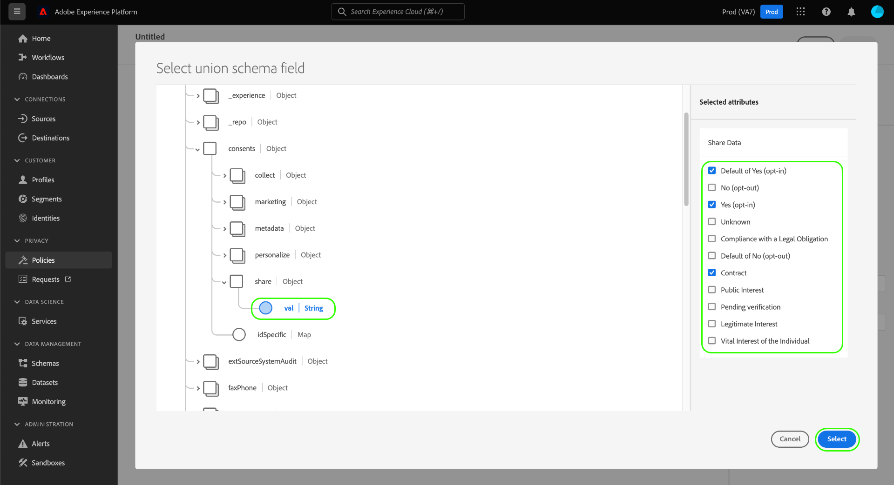

# Gestire i criteri di utilizzo dei dati nell’interfaccia utente {#user-guide}

>[!CONTEXTUALHELP]
>id="platform_privacyConsole_dataUsagePolicies_description"
>title="Integrare e applicare il consenso dei clienti nei dati del tuo profilo"
>abstract="<h2>Descrizione</h2>
Platform consente di integrare i dati di consenso raccolti dai clienti nei rispettivi profili. Puoi quindi impostare i criteri di consenso per determinare se questi dati possono essere inclusi nei segmenti attivati per determinate destinazioni.
"

Questo documento illustra come utilizzare il **[!UICONTROL Criteri]** nell’interfaccia utente di Adobe Experience Platform per creare e gestire i criteri di utilizzo dei dati.

>[!NOTE]
>
>Per informazioni su come gestire i criteri di controllo degli accessi nell’interfaccia utente, consulta [guida all’interfaccia utente basata sugli attributi](../../access-control/abac/ui/policies.md) invece.

>[!IMPORTANT]
>
>Per impostazione predefinita, tutti i criteri di utilizzo dei dati (inclusi i criteri principali forniti da Adobe) sono disabilitati. Affinché un singolo criterio possa essere preso in considerazione per l&#39;applicazione, è necessario abilitare manualmente tale criterio. Vedi la sezione su [attivazione dei criteri](#enable) per informazioni su come eseguire questa operazione nell’interfaccia utente di .

## Prerequisiti

Questa guida richiede una buona comprensione dei seguenti elementi [!DNL Experience Platform] concetti:

* [Governance dei dati](../home.md)
* [Criteri di utilizzo dei dati](./overview.md)

## Visualizza criteri esistenti {#view-policies}

In [!DNL Experience Platform] Interfaccia utente, seleziona **[!UICONTROL Criteri]** per aprire **[!UICONTROL Criteri]** workspace. In **[!UICONTROL Sfoglia]** puoi visualizzare un elenco dei criteri disponibili, incluse le etichette associate, le azioni di marketing e lo stato.

Se hai accesso ai criteri di consenso, seleziona la **[!UICONTROL Criteri di consenso]** per visualizzarli nel [!UICONTROL Sfoglia] scheda .

Selezionare un criterio elencato per visualizzarne la descrizione e il tipo. Se è selezionato un criterio personalizzato, vengono visualizzati controlli aggiuntivi per modificare, eliminare o [attiva/disattiva il criterio](#enable).

## Creare un criterio personalizzato {#create-policy}

Per creare un nuovo criterio di utilizzo dati personalizzato, selezionare **[!UICONTROL Crea criterio]** nell&#39;angolo in alto a destra del **[!UICONTROL Sfoglia]** nella scheda **[!UICONTROL Criteri]** workspace.

A seconda che tu faccia parte della versione beta per i criteri di consenso, si verifica una delle seguenti situazioni:

* Se non fai parte della versione beta, vieni immediatamente portato al flusso di lavoro per [creazione di una policy di governance dei dati](#create-governance-policy).
* Se fai parte della versione beta, una finestra di dialogo fornisce un’opzione aggiuntiva per [creare un criterio di consenso](#consent-policy).
   

### Creare un criterio di governance dei dati {#create-governance-policy}

La **[!UICONTROL Crea criterio]** viene visualizzato il flusso di lavoro . Per iniziare, fornisci un nome e una descrizione per il nuovo criterio.

Quindi, seleziona le etichette di utilizzo dei dati su cui verrà basato il criterio. Quando selezioni più etichette, ti viene data la possibilità di scegliere se i dati devono contenere tutte le etichette o solo una di esse per applicare il criterio. Seleziona **[!UICONTROL Successivo]** una volta finito.

La **[!UICONTROL Selezionare le azioni di marketing]** viene visualizzato il passaggio . Scegli le azioni di marketing appropriate dall’elenco fornito, quindi seleziona **[!UICONTROL Successivo]** per continuare.

>[!NOTE]
>
>Quando selezioni più azioni di marketing, il criterio le interpreta come una regola &quot;OR&quot;. In altre parole, la politica si applica se **qualsiasi** delle azioni di marketing selezionate vengono eseguite.

La **[!UICONTROL Revisione]** viene visualizzato un passaggio che consente di esaminare i dettagli del nuovo criterio prima di crearlo. Una volta effettuato il completamento, seleziona **[!UICONTROL Fine]** per creare il criterio.

La **[!UICONTROL Sfoglia]** viene visualizzata nuovamente la scheda , che ora elenca i criteri appena creati nello stato &quot;Bozza&quot;. Per abilitare il criterio, consulta la sezione successiva.

### Creare un criterio di consenso {#consent-policy}

>[!CONTEXTUALHELP]
>id="platform_privacyConsole_dataUsagePolicies_instructions"
>title="Istruzioni"
>abstract="<ul><li>Assicurati di acquisire i dati delle preferenze negli schemi di unione tramite il connettore di origine OneTrust o lo schema XDM standard per il consenso.</li><li>Seleziona <a href="https://experienceleague.adobe.com/docs/experience-platform/data-governance/policies/overview.html?lang=it">Criteri</a> nel menu di navigazione a sinistra, seleziona <a href="https://experienceleague.adobe.com/docs/experience-platform/data-governance/policies/user-guide.html#create-governance-policy">Crea criterio</a>.</li><li>Sotto la <b>Se</b> descrive le condizioni o le azioni che attiveranno il controllo dei criteri.</li><li>Sotto la <b>Then</b> , immetti gli attributi di consenso che devono essere presenti affinché un profilo sia incluso nell’azione che ha attivato il criterio.</li><li>Seleziona <b>Salva</b> per creare il criterio. Per abilitare il criterio, seleziona la <b>Stato</b> attiva la barra a destra.</li><li>Experience Platform applica automaticamente i criteri di consenso abilitati quando attivi i segmenti sulle destinazioni e fornisce dettagli su come ogni criterio influisce sulle dimensioni del pubblico.</li><li>Per ulteriori informazioni su questa funzione, consulta la guida su <a href="https://experienceleague.adobe.com/docs/experience-platform/data-governance/policies/user-guide.html#consent-policy">creazione di criteri di consenso</a> Experience League.</li></ul>"

>[!IMPORTANT]
>
>I criteri di consenso sono disponibili solo per le organizzazioni che hanno acquistato **Scudo sanitario Adobe** o **Adobe Privacy e sicurezza scudo**.

Se hai scelto di creare un criterio di consenso, viene visualizzata una nuova schermata che ti consente di configurare il nuovo criterio.

Per utilizzare i criteri di consenso, è necessario che nei dati del profilo siano presenti gli attributi di consenso. Consulta la guida su [elaborazione del consenso in Experience Platform](../../landing/governance-privacy-security/consent/adobe/overview.md) per passaggi dettagliati su come includere gli attributi richiesti nello schema di unione.

I criteri di consenso sono formati da due componenti logici:

* **[!UICONTROL Se]**: La condizione che attiverà il controllo dei criteri. Questo può essere basato su una determinata azione di marketing in corso, sulla presenza di determinate etichette di utilizzo dei dati o su una combinazione di entrambe.
* **[!UICONTROL Then]**: Attributi di consenso che devono essere presenti affinché un profilo sia incluso nell’azione che ha attivato il criterio.

#### Configurare le condizioni {#consent-conditions}

>[!CONTEXTUALHELP]
>id="platform_governance_policies_consentif"
>title="Condizione Se"
>abstract="Inizia definendo le condizioni che attiveranno il controllo dei criteri. Le condizioni possono includere l’esecuzione di determinate azioni di marketing, la presenza di determinate etichette di governance dei dati o una combinazione di entrambe."

Sotto la **[!UICONTROL Se]** seleziona le azioni di marketing e/o le etichette di utilizzo dei dati che devono attivare questo criterio. Seleziona **[!UICONTROL Visualizza tutto]** e **[!UICONTROL Seleziona etichette]** per visualizzare l’elenco completo delle azioni di marketing e delle etichette disponibili, rispettivamente.

Dopo aver aggiunto almeno una condizione, puoi selezionare **[!UICONTROL Aggiungi condizione]** per continuare ad aggiungere ulteriori condizioni, scegliere il tipo di condizione appropriato dal menu a discesa.

Se selezioni più di una condizione, puoi utilizzare l’icona visualizzata tra le due per passare dalla relazione condizionale &quot;AND&quot; alla &quot;OR&quot; e viceversa.

#### Selezionare gli attributi di consenso {#consent-attributes}

>[!CONTEXTUALHELP]
>id="platform_governance_policies_consentthen"
>title="Condizione Allora"
>abstract="Una volta definita la condizione “Se”, utilizza la sezione “Allora” per selezionare almeno un attributo di consenso dallo schema di unione. Questo è l’attributo che deve essere presente affinché i profili possano essere inclusi nell’azione disciplinata da questo criterio."

Sotto la **[!UICONTROL Then]** seleziona almeno un attributo di consenso dallo schema di unione. Questo è l’attributo che deve essere presente affinché i profili possano essere inclusi nell’azione disciplinata da questo criterio. È possibile scegliere una delle opzioni fornite dall’elenco oppure selezionare **[!UICONTROL Visualizza tutto]** per scegliere l&#39;attributo direttamente dallo schema di unione.

Quando selezioni l&#39;attributo di consenso, scegli i valori per l&#39;attributo per il quale desideri che questo criterio verifichi.

Dopo aver selezionato almeno un attributo di consenso, il **[!UICONTROL Proprietà dei criteri]** aggiornamenti del pannello per mostrare il numero stimato di profili consentiti in questo criterio, inclusa la percentuale del totale archivio profili. Questa stima viene aggiornata automaticamente quando si regola la configurazione dei criteri.

Per aggiungere ulteriori attributi di consenso al criterio, seleziona **[!UICONTROL Aggiungi risultato]**.

Puoi continuare ad aggiungere e regolare condizioni e attributi di consenso al criterio in base alle esigenze. Quando la configurazione è soddisfacente, fornisci un nome e una descrizione facoltative per il criterio prima di selezionare **[!UICONTROL Salva]**.

Il criterio di consenso viene ora creato e il relativo stato è impostato su [!UICONTROL Disabilitato] per impostazione predefinita. Per abilitare immediatamente il criterio, seleziona la **[!UICONTROL Stato]** attiva la barra a destra.

#### Verifica dell&#39;applicazione dei criteri

Dopo aver creato e abilitato un criterio di consenso, puoi visualizzare in anteprima in che modo influisce sul pubblico consenziente quando attivi segmenti nelle destinazioni. Vedi la sezione su [valutazione politica del consenso](../enforcement/auto-enforcement.md#consent-policy-evaluation) per ulteriori informazioni.

## Attivare o disattivare un criterio {#enable}

Per impostazione predefinita, tutti i criteri di utilizzo dei dati (inclusi i criteri principali forniti da Adobe) sono disabilitati. Affinché un singolo criterio possa essere preso in considerazione per l’implementazione, devi abilitare manualmente tale criterio tramite l’API o l’interfaccia utente.

Puoi abilitare o disabilitare i criteri dalla **[!UICONTROL Sfoglia]** nella scheda **[!UICONTROL Criteri]** workspace. Seleziona un criterio personalizzato dall’elenco per visualizzarne i dettagli a destra. Sotto **[!UICONTROL Stato]**, seleziona il pulsante di attivazione o disattivazione del criterio.

## Visualizzare le azioni di marketing {#view-marketing-actions}

In **[!UICONTROL Criteri]** area di lavoro, seleziona **[!UICONTROL Azioni di marketing]** per visualizzare un elenco delle azioni di marketing disponibili definite da Adobe e dalla tua organizzazione.

## Creare un’azione di marketing {#create-marketing-action}

Per creare una nuova azione di marketing personalizzata, seleziona **[!UICONTROL Crea azione di marketing]** nell&#39;angolo in alto a destra del **[!UICONTROL Azioni di marketing]** nella scheda **[!UICONTROL Criteri]** workspace.

La **[!UICONTROL Crea azione di marketing]** viene visualizzata la finestra di dialogo . Immetti un nome e una descrizione per l’azione di marketing, quindi seleziona **[!UICONTROL Crea]**.

L’azione appena creata viene visualizzata nella **[!UICONTROL Azioni di marketing]** scheda . Ora puoi utilizzare l’azione di marketing quando [creazione di nuovi criteri di utilizzo dei dati](#create-policy).

## Modificare o eliminare un’azione di marketing {#edit-delete-marketing-action}

>[!NOTE]
>
>Puoi modificare solo le azioni di marketing personalizzate definite dalla tua organizzazione. Le azioni di marketing definite dall’Adobe non possono essere modificate o eliminate.

In **[!UICONTROL Criteri]** area di lavoro, seleziona **[!UICONTROL Azioni di marketing]** per visualizzare un elenco delle azioni di marketing disponibili definite da Adobe e dalla tua organizzazione. Seleziona un’azione di marketing personalizzata dall’elenco, quindi utilizza i campi forniti nella sezione di destra per modificare i dettagli dell’azione di marketing.

Se l’azione di marketing non è utilizzata da alcun criterio di utilizzo esistente, puoi eliminarla selezionando **[!UICONTROL Elimina azione di marketing]**.

>[!NOTE]
>
>Se si tenta di eliminare un&#39;azione di marketing utilizzata da un criterio esistente, viene visualizzato un messaggio di errore che indica che il tentativo di eliminazione non è riuscito.

## Passaggi successivi

Questo documento fornisce una panoramica sulla gestione dei criteri di utilizzo dei dati in [!DNL Experience Platform] Interfaccia utente. Per i passaggi su come gestire i criteri tramite la [!DNL Policy Service API], vedi [guida per sviluppatori](../api/getting-started.md). Per informazioni su come applicare i criteri di utilizzo dei dati, consulta [panoramica sull&#39;applicazione della politica](../enforcement/overview.md).

Il video seguente fornisce una dimostrazione di come utilizzare i criteri di utilizzo in [!DNL Experience Platform] Interfaccia utente:

>[!VIDEO](https://video.tv.adobe.com/v/32977?quality=12&learn=on)
