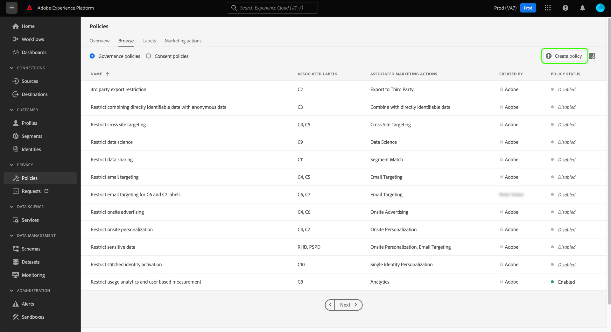

# Guida utente per i criteri di utilizzo dei dati

Adobe Experience Platform Data Governance offre un&#39;interfaccia utente che consente di creare e gestire i criteri di utilizzo dei dati. Questo documento fornisce una panoramica delle azioni che puoi eseguire nell&#39;area di lavoro _Criteri_ nell&#39;interfaccia utente della piattaforma esperienza.

## Prerequisiti

Questa guida richiede una buona conoscenza dei seguenti concetti relativi alla piattaforma Experience:

- [Governance dei dati](../home.md)
- [Criteri di utilizzo dei dati](./overview.md)

## Visualizzare i criteri di utilizzo dei dati

Nell’interfaccia utente di Experience Platform, fate clic **[!UICONTROL Policies]** per aprire l’ *[!UICONTROL Policies]* area di lavoro. Nella **[!UICONTROL Browse]** scheda è possibile visualizzare un elenco dei criteri disponibili, incluse le etichette associate, le azioni di marketing e lo stato.

Fate clic su un criterio elencato per visualizzarne la descrizione e il tipo. Se è selezionato un criterio personalizzato, vengono visualizzati controlli aggiuntivi per modificare, eliminare o [attivare/disattivare il criterio](#enable).

## Creazione di un criterio di utilizzo dati personalizzato

Per creare un nuovo criterio di utilizzo dei dati personalizzato, fate clic **[!UICONTROL Create policy]** nell&#39;angolo superiore destro dell&#39;area di lavoro *Criteri* .

Viene *[!UICONTROL Create policy]* visualizzato il flusso di lavoro. Iniziate fornendo un nome e una descrizione per il nuovo criterio.

Quindi, selezionate le etichette di utilizzo dei dati su cui verrà basato il criterio. Quando si selezionano più etichette, è possibile scegliere se i dati devono contenere tutte le etichette o solo una di esse per poter applicare il criterio. Al termine fai clic su **[!UICONTROL Next]** (Continua).

Viene *[!UICONTROL Select marketing actions]* visualizzato il passaggio. Scegli le azioni di marketing appropriate dall&#39;elenco fornito, quindi fai clic **[!UICONTROL Next]** per continuare.

>[!NOTE] Quando si selezionano più azioni di marketing, il criterio le interpreta come una regola &quot;OR&quot;. In altre parole, il criterio si applica se viene eseguita _una_ delle azioni di marketing selezionate.

Viene visualizzato il *[!UICONTROL Review]* passaggio che consente di esaminare i dettagli del nuovo criterio prima di crearlo. Una volta soddisfatti, fate clic **[!UICONTROL Finish]** per creare il criterio.

La *[!UICONTROL Browse]* scheda viene visualizzata di nuovo, in cui ora viene visualizzato il criterio appena creato con lo stato &quot;Bozza&quot;. Per abilitare il criterio, vedere la sezione successiva.

## Attivare o disattivare un criterio di utilizzo dei dati {#enable}

È possibile abilitare o disabilitare i criteri di utilizzo dei dati personalizzati nella *[!UICONTROL Browse]* scheda dell&#39;area di lavoro *[!UICONTROL Policies]* . Selezionate un criterio personalizzato dall&#39;elenco per visualizzarne i dettagli a destra. In *[!UICONTROL Status]* questa sezione, fate clic sul pulsante di attivazione per attivare o disattivare il criterio.

## Passaggi successivi

Questo documento fornisce una panoramica su come gestire i criteri di utilizzo dei dati nell’interfaccia utente della piattaforma Experience. Per i passaggi su come gestire i criteri tramite l&#39;API DULE Policy, vedete la guida per gli sviluppatori. Per informazioni su come applicare i criteri di utilizzo dei dati, consultate la panoramica [sull&#39;applicazione dei](../enforcement/overview.md)criteri.

Il video seguente illustra come utilizzare i criteri di utilizzo nell’interfaccia utente della piattaforma Experience:

>[!VIDEO](https://video.tv.adobe.com/v/32977?quality=12&learn=on)