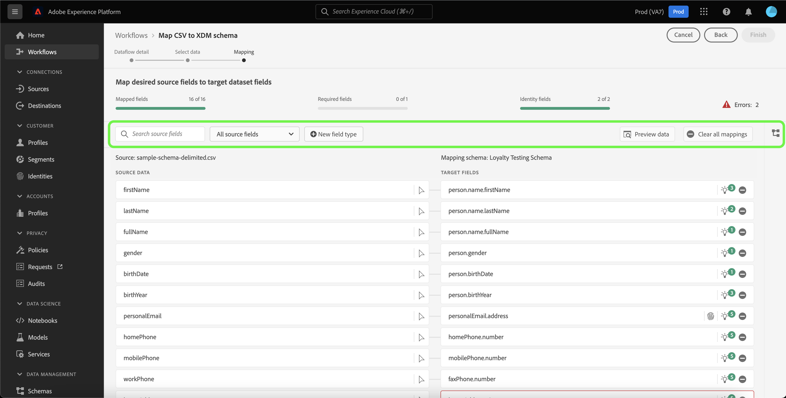
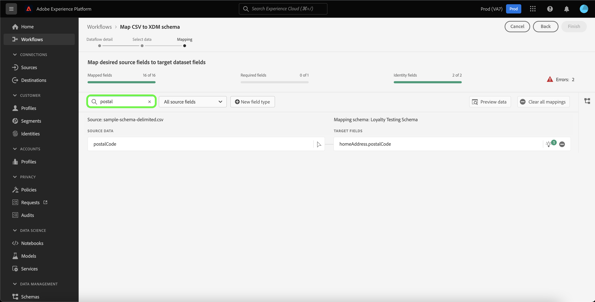
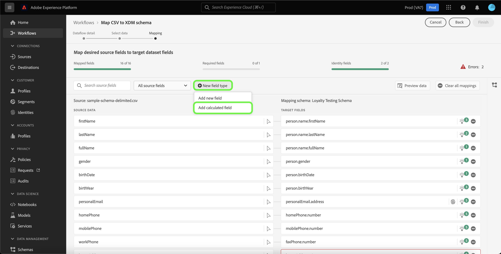
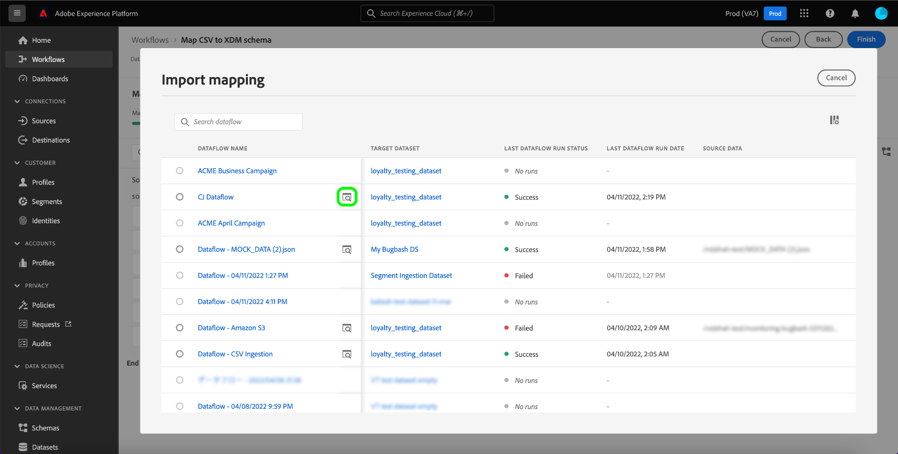
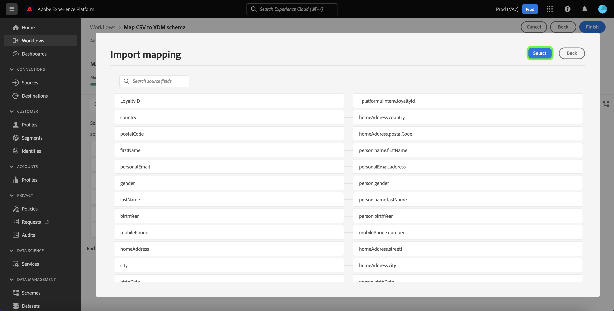
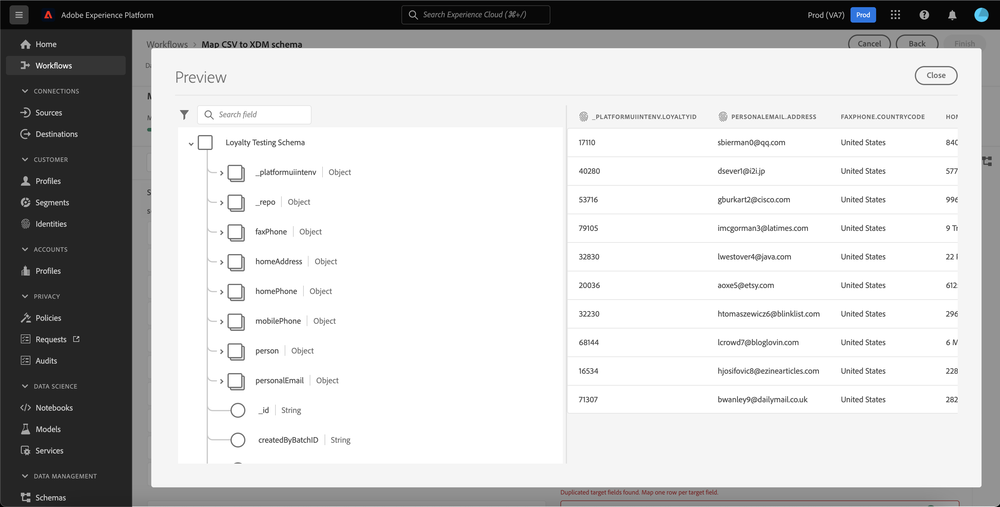
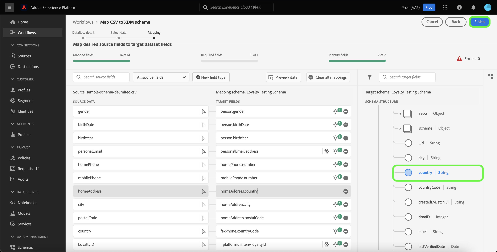

# Guida all’interfaccia utente della preparazione dei dati

Questo documento fornisce istruzioni su come utilizzare le funzioni di preparazione dei dati nell’interfaccia utente di Adobe Experience Platform per mappare i file CSV su uno schema XDM.

## Introduzione

Questa esercitazione richiede una buona comprensione dei seguenti componenti di Platform:

* [[!DNL Experience Data Model (XDM)] Sistema](../../xdm/home.md): Il framework standardizzato tramite il quale Platform organizza i dati sulla customer experience.
   * [Nozioni di base sulla composizione dello schema](../../xdm/schema/composition.md): Scopri i blocchi di base degli schemi XDM, inclusi i principi chiave e le best practice nella composizione dello schema.
   * [Esercitazione sull’Editor di schema](../../xdm/tutorials/create-schema-ui.md): Scopri come creare schemi personalizzati utilizzando l’interfaccia utente dell’Editor di schema.
* [Servizio identità](../../identity-service/home.md): Ottieni una visione migliore dei singoli clienti e del loro comportamento attraverso il collegamento delle identità tra dispositivi e sistemi.
* [[!DNL Real-time Customer Profile]](../../profile/home.md): Fornisce un profilo di consumatore unificato e in tempo reale basato su dati aggregati provenienti da più origini.
* [Origini](../../sources/home.md): L’Experience Platform consente di acquisire dati da varie sorgenti e allo stesso tempo di strutturare, etichettare e migliorare i dati in arrivo tramite i servizi Platform.

## Dettaglio flusso di dati

>[!TIP]
>
>Puoi accedere ai dettagli del flusso di dati selezionando qualsiasi origine dal catalogo origini. Per ulteriori informazioni, consulta la sezione [panoramica di origini](../../sources/home.md).

Prima di poter mappare i dati CSV su uno schema XDM, è necessario stabilire i dettagli del flusso di dati.

La [!UICONTROL Dettaglio flusso di dati] La pagina ti consente di selezionare se desideri acquisire i dati CSV in un set di dati di destinazione esistente o in un nuovo set di dati di destinazione. Un set di dati esistente viene fornito con uno schema di destinazione predefinito in cui mappare i dati, mentre un nuovo set di dati richiede la selezione di uno schema esistente o la creazione di un nuovo schema in cui mappare i dati.

### Utilizzare un set di dati di destinazione esistente

Per acquisire i dati CSV in un set di dati esistente, seleziona **[!UICONTROL Set di dati esistente]**. Puoi recuperare un set di dati esistente utilizzando [!UICONTROL Ricerca avanzata] o scorrendo l’elenco dei set di dati esistenti nel menu a discesa.

Con un set di dati selezionato, fornisci un nome per il flusso di dati e una descrizione facoltativa.

Durante questo processo, puoi anche abilitare [!UICONTROL Diagnostica degli errori] e [!UICONTROL Acquisizione parziale]. [!UICONTROL Diagnostica degli errori] consente la generazione dettagliata dei messaggi di errore per tutti i record errati che si verificano nel flusso di dati, mentre [!UICONTROL Acquisizione parziale] consente di acquisire dati contenenti errori, fino a una determinata soglia definita manualmente. Consulta la sezione [panoramica dell’acquisizione parziale in batch](../../ingestion/batch-ingestion/partial.md) per ulteriori informazioni.

### Utilizzare un nuovo set di dati di destinazione

Per acquisire i dati CSV in un nuovo set di dati, seleziona **[!UICONTROL Nuovo set di dati]** e quindi fornisci il nome di un set di dati di output e una descrizione facoltativa. Quindi, seleziona uno schema a cui eseguire il mapping utilizzando [!UICONTROL Ricerca avanzata] oppure scorrendo l’elenco degli schemi esistenti nel menu a discesa.

Con uno schema selezionato, fornisci un nome per il flusso di dati e una descrizione facoltativa, quindi applica il [!UICONTROL Diagnostica degli errori] e [!UICONTROL Acquisizione parziale] impostazioni desiderate per il flusso di dati. Al termine, seleziona **[!UICONTROL Successivo]**.

## Seleziona dati

La [!UICONTROL Seleziona dati] viene visualizzato un passaggio che fornisce un’interfaccia per caricare i file locali e visualizzarne l’anteprima di struttura e contenuti. Seleziona **[!UICONTROL Scegliere i file]** per caricare un file CSV dal sistema locale. In alternativa, puoi trascinare e rilasciare il file CSV da caricare nel [!UICONTROL Trascinamento di file] pannello.

>[!TIP]
>
>Solo i file CSV sono attualmente supportati dal caricamento di file locale. La dimensione massima del file per ciascun file è 1 GB.

Una volta caricato il file, l’interfaccia di anteprima si aggiorna per visualizzare il contenuto e la struttura del file.

A seconda del file, è possibile selezionare un delimitatore di colonna, ad esempio tabulazioni, virgole, barre verticali o un delimitatore di colonna personalizzato per i dati di origine. Seleziona la **[!UICONTROL Delimitatore]** freccia a discesa, quindi selezionare il delimitatore appropriato dal menu.

Al termine, seleziona **[!UICONTROL Successivo]**.

## Mappatura

La **[!UICONTROL mappatura]** L’interfaccia di offre uno strumento completo per mappare i campi di origine dallo schema di origine ai campi XDM di destinazione appropriati nello schema di destinazione.

### Interfaccia di mappatura {#mapping-interface}

L’interfaccia di mappatura include una dashboard che fornisce informazioni sullo stato dei campi di mappatura nel contesto del flusso di lavoro di acquisizione. Il dashboard visualizza i seguenti dettagli relativi ai campi di mappatura:

| Proprietà | Descrizione |
| --- | --- |
| [!UICONTROL Campi mappati] | Visualizza il numero totale di campi di origine mappati a un campo XDM di destinazione, indipendentemente dagli errori. |
| [!UICONTROL Campi obbligatori] | Visualizza il numero di campi di mappatura richiesti. |
| [!UICONTROL Campi di identità] | Visualizza il numero totale di campi di mappatura definiti come identità. Questi campi di mappatura sono rappresentati da un&#39;icona di impronta digitale. |
| [!UICONTROL Errori] | Visualizza il numero di campi di mappatura errati. |

L’interfaccia di mappatura offre anche un pannello di opzioni selezionabili per interagire meglio o filtrare attraverso i campi di mappatura.

Per cercare un particolare set di mappatura, seleziona **[!UICONTROL Campi di origine della ricerca]** e immettere il nome dei dati di origine che si desidera isolare.

Seleziona **[!UICONTROL Tutti i campi di origine]** per visualizzare un menu a discesa delle opzioni di filtro per limitare meglio la visualizzazione dell’interfaccia di mappatura.

Le opzioni di filtro sono:

| Campi di origine | Descrizione |
| --- | --- |
| [!UICONTROL Tutti i campi di origine] | Questa opzione visualizza tutti i campi di origine dello schema di origine. Questa opzione è visualizzata per impostazione predefinita. |
| [!UICONTROL Campi obbligatori] | Questa opzione filtra lo schema di origine per visualizzare solo i campi necessari per completare la mappatura. |
| [!UICONTROL Campi di identità] | Questa opzione filtra lo schema di origine per visualizzare solo i campi contrassegnati per l’identità. |
| [!UICONTROL Campi mappati] | Questa opzione filtra lo schema di origine per visualizzare solo i campi che sono già stati mappati. |
| [!UICONTROL Campi non mappati] | Questa opzione filtra lo schema di origine per visualizzare solo i campi che devono ancora essere mappati. |
| [!UICONTROL Campi con raccomandazione] | Questa opzione filtra lo schema di origine per visualizzare solo i campi che contengono consigli di mappatura. |

Seleziona **[!UICONTROL Campi con errori]** per visualizzare tutti i campi di mappatura con errori.

Viene visualizzata una visualizzazione isolata dei campi di mappatura errati, che consente di risolvere gli errori tramite raccomandazioni di mappatura intelligente o tramite la struttura di mappatura manuale.

### Aggiungi un nuovo tipo di campo

Puoi aggiungere un nuovo campo di mappatura o un campo calcolato selezionando **[!UICONTROL Nuovo tipo di campo]**.

#### Nuovo campo di mappatura

Per aggiungere un nuovo campo di mappatura, seleziona **[!UICONTROL Nuovo tipo di campo]** quindi seleziona **[!UICONTROL Aggiungi nuovo campo]** dal menu a discesa visualizzato.

Quindi, selezionare il campo di origine che si desidera aggiungere dalla struttura dello schema di origine visualizzata, quindi selezionare **[!UICONTROL Seleziona]**.

L’interfaccia di mappatura viene aggiornata con il campo di origine selezionato e con un campo di destinazione vuoto. Seleziona **[!UICONTROL Campo di destinazione mappa]** per iniziare a mappare il nuovo campo di origine al relativo campo XDM di destinazione appropriato.

Viene visualizzata una struttura ad albero dello schema di destinazione interattivo, che consente di spostarsi manualmente nello schema di destinazione e trovare il campo XDM di destinazione appropriato per il campo di origine.

Al termine, seleziona l’icona dello schema per chiudere l’interfaccia dello schema di destinazione.

#### Campi calcolati {#calculated-fields}

I campi calcolati consentono la creazione di valori in base agli attributi nello schema di input. Questi valori possono quindi essere assegnati agli attributi nello schema di destinazione e ricevere un nome e una descrizione per facilitarne il riferimento. I campi calcolati hanno una lunghezza massima di 4096 caratteri.

Per creare un campo calcolato, seleziona **[!UICONTROL Nuovo tipo di campo]** quindi seleziona **[!UICONTROL Aggiungi campo calcolato]**

La **[!UICONTROL Crea campo calcolato]** viene visualizzato il pannello . La finestra di dialogo a sinistra contiene i campi, le funzioni e gli operatori supportati nei campi calcolati. Seleziona una delle schede per iniziare ad aggiungere funzioni, campi o operatori all’editor di espressioni.

| Scheda | Descrizione |
| --- | ----------- |
| [!UICONTROL Funzione] | Nella scheda Funzioni sono elencate le funzioni disponibili per la trasformazione dei dati. Per ulteriori informazioni sulle funzioni che è possibile utilizzare all&#39;interno dei campi calcolati, leggere la guida in [utilizzo delle funzioni di preparazione dei dati (mappatore)](../functions.md). |
| [!UICONTROL Campo] | Nella scheda Campi sono elencati i campi e gli attributi disponibili nello schema di origine. |
| [!UICONTROL Operatore] | La scheda operatori elenca gli operatori disponibili per la trasformazione dei dati. |

Puoi aggiungere manualmente campi, funzioni e operatori utilizzando l’editor espressioni al centro. Seleziona l’editor per iniziare a creare un’espressione. Al termine, seleziona **[!UICONTROL Salva]** per procedere.

### Mappatura importazione {#import}

Puoi riutilizzare la mappatura di un flusso di dati esistente per ridurre il tempo di configurazione manuale dell’inserimento dei dati e limitare gli errori. Seleziona **[!UICONTROL Mappatura importazione]** per riutilizzare una mappatura esistente.

La [!UICONTROL Mappatura importazione] viene visualizzata una finestra che fornisce un elenco di flussi di dati tra cui scegliere.

Seleziona l’icona di anteprima per visualizzare in anteprima la mappatura del flusso di dati selezionato.

La finestra di anteprima consente di controllare la mappatura esistente prima di importarla nel flusso di dati. Una volta verificata la mappatura, puoi selezionare **[!UICONTROL Indietro]** per tornare all&#39;elenco dei flussi di dati ed esaminare un altro set di mappature, oppure puoi selezionare **[!UICONTROL Seleziona]** per procedere.

In alternativa, è possibile selezionare la mappatura da importare dalla finestra elenco dei flussi di dati. Seleziona il flusso di dati contenente la mappatura da importare, quindi seleziona **[!UICONTROL Seleziona]** per procedere.

L’interfaccia viene aggiornata con la mappatura importata.

>[!NOTE]
>
>Tutti i set di mappatura esistenti stabiliti o i consigli di mappatura ML vengono sostituiti dalla mappatura importata da un flusso di dati esistente.

Seleziona **[!UICONTROL Anteprima dati]** per visualizzare i risultati della mappatura di fino a 100 righe di dati di esempio dal set di dati selezionato.

Durante l’anteprima, la colonna Identity ha la priorità come primo campo, in quanto rappresenta le informazioni chiave necessarie per la convalida dei risultati della mappatura. Al termine, seleziona **[!UICONTROL Chiudi]**.

Per rimuovere tutti i campi di mappatura, seleziona **[!UICONTROL Cancella tutte le mappature]**.

### Utilizzo dell&#39;interfaccia di mappatura

Platform fornisce automaticamente raccomandazioni intelligenti per i campi mappati automaticamente in base allo schema o al set di dati di destinazione selezionato. Puoi regolare manualmente le regole di mappatura in base ai casi d’uso o correggere eventuali campi di mappatura duplicati per cancellare eventuali errori.

Selezionare l&#39;icona lampadina nel campo di destinazione che si desidera regolare.

La [!UICONTROL Mappatura dei consigli] viene visualizzato un pannello a comparsa che visualizza un elenco di campi di destinazione consigliati che possono essere mappati su un particolare campo di origine. Per impostazione predefinita, la prima raccomandazione viene applicata automaticamente.

A volte, per lo schema di origine sono disponibili più consigli. In questo caso, la scheda di mappatura visualizza la raccomandazione più importante, seguita da un&#39;icona che contiene il numero di consigli aggiuntivi disponibili. Selezionando l’icona della lampadina viene visualizzato un elenco dei consigli aggiuntivi. Potete scegliere una delle raccomandazioni alternative selezionando la casella di controllo accanto alla raccomandazione a cui desiderate eseguire la mappatura.

Da qui, puoi modificare il campo di destinazione selezionato per correggere un errore o abbinare il tuo caso d’uso.

In alternativa, è possibile selezionare **[!UICONTROL Seleziona manualmente]** per utilizzare manualmente la struttura di mappatura dello schema di destinazione interattivo.

L’interfaccia di mappatura dello schema di destinazione viene visualizzata nella stessa visualizzazione dei campi di mappatura, consentendo di modificare le coppie di mappatura all’interno della stessa schermata. Seleziona il campo di destinazione adatto al tuo caso d’uso o corregge gli errori.

Al termine, seleziona **[!UICONTROL Fine]** per procedere.

## Passaggi successivi

Leggendo questo documento, hai mappato correttamente un file CSV su uno schema XDM di destinazione utilizzando l’interfaccia di mappatura nell’interfaccia utente di Platform. Per ulteriori informazioni, consulta i seguenti documenti:

* [Panoramica sulla preparazione dei dati](../home.md)
* [Panoramica delle origini](../../sources/home.md)
* [Monitorare i flussi di dati delle sorgenti nell’interfaccia utente](../../dataflows/ui/monitor-sources.md)
