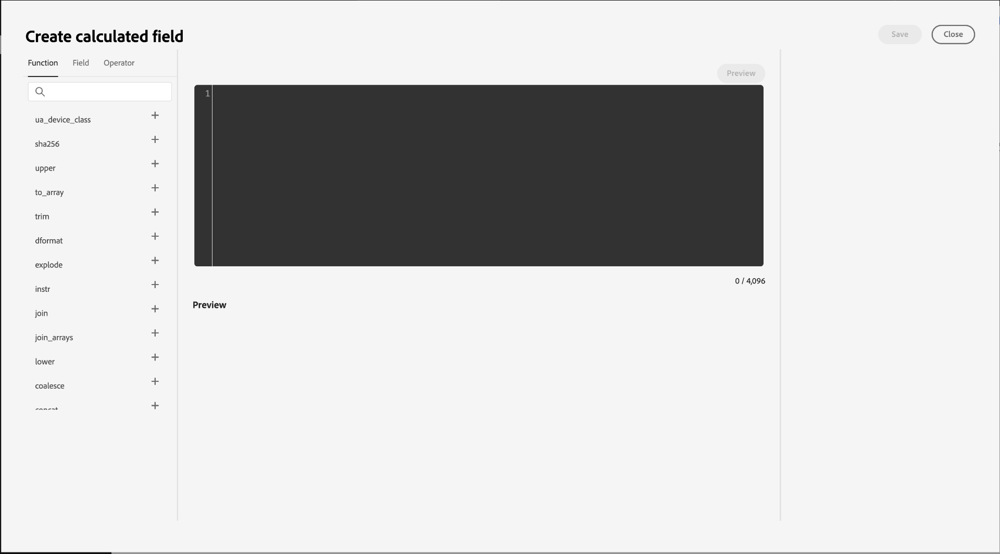
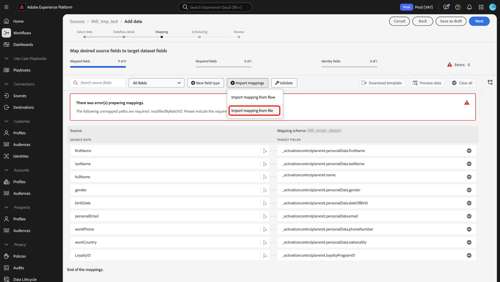

# Guida dell’interfaccia utente per la preparazione dei dati

Leggi questa guida per scoprire come utilizzare le funzioni di mappatura [preparazione dati](../home.md) nell&#39;interfaccia utente di Adobe Experience Platform per mappare i file CSV su uno schema [Experience Data Model (XDM)](../../xdm/home.md).

## Introduzione

Questo tutorial richiede una buona conoscenza dei seguenti componenti di Experience Platform:

* [[!DNL Experience Data Model (XDM)] Sistema](../../xdm/home.md): framework standardizzato tramite il quale Experience Platform organizza i dati sull&#39;esperienza del cliente.
   * [Nozioni di base sulla composizione dello schema](../../xdm/schema/composition.md): scopri i blocchi predefiniti di base degli schemi XDM, inclusi i principi chiave e le best practice nella composizione dello schema.
   * [Esercitazione sull&#39;editor di schemi](../../xdm/tutorials/create-schema-ui.md): scopri come creare schemi personalizzati utilizzando l&#39;interfaccia utente dell&#39;editor di schemi.
* [Identity Service](../../identity-service/home.md): ottieni una migliore visione dei singoli clienti e del loro comportamento collegando le identità tra dispositivi e sistemi.
* [[!DNL Real-Time Customer Profile]](../../profile/home.md): fornisce un profilo consumer unificato e in tempo reale basato su dati aggregati provenienti da più origini.
* [Origini](../../sources/home.md): Experience Platform consente di acquisire dati da varie origini e allo stesso tempo di strutturare, etichettare e migliorare i dati in arrivo tramite i servizi Experience Platform.

## Accedere all’interfaccia di mappatura nell’interfaccia utente

Puoi accedere all’interfaccia di mappatura nell’interfaccia utente attraverso due percorsi diversi.

1. Nell&#39;interfaccia utente di Experience Platform, seleziona **[!UICONTROL Flussi di lavoro]** dal menu di navigazione a sinistra, quindi seleziona **[!UICONTROL Mappa CSV su schema XDM]**. Quindi, fornisci i dettagli del flusso di dati e seleziona i dati che desideri acquisire. Al termine, ti indirizzano all’interfaccia di mappatura in cui puoi configurare la mappatura tra i dati di origine e uno schema XDM.
2. Puoi anche accedere all’interfaccia di mappatura tramite l’area di lavoro origini.

## Mappare i file CSV in uno schema XDM

Utilizza l’interfaccia di mappatura e il set di strumenti completo fornito per mappare correttamente i campi dati dallo schema di origine ai campi XDM di destinazione appropriati nello schema di destinazione.

### Interfaccia di mappatura {#mapping-interface}

Per informazioni sullo stato dei campi di mappatura nel contesto del flusso di lavoro di acquisizione, fai riferimento al dashboard nella parte superiore dell’interfaccia. Il dashboard mostra i seguenti dettagli relativi ai campi di mappatura:

| Proprietà | Descrizione |
| --- | --- |
| [!UICONTROL Campi mappati] | Visualizza il numero totale di campi sorgente mappati a un campo XDM di destinazione, indipendentemente dagli errori. |
| [!UICONTROL Campi obbligatori] | Visualizza il numero di campi di mappatura obbligatori. |
| [!UICONTROL Campi di identità] | Visualizza il numero totale di campi di mappatura definiti come identità. Questi campi di mappatura sono rappresentati da un&#39;icona di impronta digitale. |
| [!UICONTROL Errori] | Visualizza il numero di campi di mappatura errati. |

{style="table-layout:auto"}

Quindi, puoi utilizzare le opzioni elencate nell’intestazione per interagire meglio o filtrare i campi di mappatura.

| Opzione | Descrizione |
| --- | --- |
| [!UICONTROL Cerca nei campi di origine] | Utilizza la barra di ricerca per passare a un campo di origine specifico. |
| [!UICONTROL Tutti i campi] | Seleziona **[!UICONTROL Tutti i campi]** per visualizzare un menu a discesa di opzioni in base alle quali filtrare le mappature. Le opzioni di filtro disponibili includono:<ul><li>**[!UICONTROL Campi obbligatori]**: filtra l&#39;interfaccia in modo da visualizzare solo i campi necessari per completare il flusso di lavoro.</li><li> **[!UICONTROL Campi identità]**: filtra l&#39;interfaccia in modo da visualizzare solo i campi contrassegnati come identità.</li><li>**[!UICONTROL Campi mappati]**: filtra l&#39;interfaccia per visualizzare solo i campi già mappati.</li><li>**[!UICONTROL Campi non mappati]**: filtra l&#39;interfaccia per visualizzare solo i campi non ancora mappati.</li><li>**[!UICONTROL Campi con errori]**: filtra l&#39;interfaccia in modo da visualizzare solo i campi con errori.</li></ul> |
| [!UICONTROL Nuovo tipo di campo] | Selezionare **[!UICONTROL Nuovo tipo di campo]** per aggiungere un nuovo campo o un campo calcolato. Per ulteriori informazioni, leggere la sezione relativa all&#39;[aggiunta di un nuovo tipo di campo](#add-a-new-field-type). |
| [!UICONTROL Importa mappature] | Seleziona **[!UICONTROL Importa mappature]** per importare mappature da un file o da un flusso di dati esistente. Per ulteriori informazioni, leggere la sezione su [importazione di mapping](#import-mapping). |
| [!UICONTROL Convalida] | Seleziona **[!UICONTROL Convalida]** per verificare la presenza di errori nei mapping. |
| [!UICONTROL Scarica modello] | Seleziona **[!UICONTROL Scarica modello]** per esportare e scaricare un file CSV dei tuoi mapping. |
| [!UICONTROL Anteprima dati] | Seleziona **[!UICONTROL Anteprima dati]** per utilizzare il pannello di anteprima e controllare la struttura e il contenuto del set di dati di origine. |
| [!UICONTROL Cancella tutto] | Seleziona **[!UICONTROL Cancella tutto]** per eliminare tutti i mapping nell&#39;interfaccia. |

{style="table-layout:auto"}

### Aggiungi un nuovo tipo di campo {#add-a-new-field-type}

È possibile aggiungere un nuovo campo di mappatura o un campo calcolato selezionando **[!UICONTROL Nuovo tipo di campo]**.

#### Nuovo campo di mappatura

Per aggiungere un nuovo campo di mappatura, selezionare **[!UICONTROL Nuovo tipo di campo]**, quindi selezionare **[!UICONTROL Aggiungi nuovo campo]** dal menu a discesa visualizzato.

Selezionare quindi il campo di origine che si desidera aggiungere dalla struttura dello schema di origine visualizzata, quindi selezionare **[!UICONTROL Seleziona]**.

L’interfaccia di mappatura viene aggiornata con il campo sorgente selezionato e un campo di destinazione vuoto. Seleziona **[!UICONTROL Mappa campo di destinazione]** per iniziare a mappare il nuovo campo di origine al relativo campo XDM di destinazione appropriato.

Viene visualizzata una struttura di schema di destinazione interattiva che consente di scorrere manualmente lo schema di destinazione e di trovare il campo XDM di destinazione appropriato per il campo di origine.

#### Campi calcolati {#calculated-fields}

I campi calcolati consentono la creazione di valori in base agli attributi nello schema di input. Questi valori possono quindi essere assegnati ad attributi nello schema di destinazione e ricevere un nome e una descrizione per consentire un riferimento più semplice. I campi calcolati hanno una lunghezza massima di 4096 caratteri.

Per creare un campo calcolato, selezionare **[!UICONTROL Nuovo tipo di campo]**, quindi selezionare **[!UICONTROL Aggiungi campo calcolato]**

Viene visualizzata la finestra **[!UICONTROL Crea campo calcolato]**. Utilizza l’interfaccia per inserire i campi calcolati e fai riferimento alla finestra di dialogo a sinistra per i campi, le funzioni e gli operatori supportati.

| Scheda | Descrizione |
| --- | ----------- |
| [!UICONTROL Funzione] | Nella scheda Funzioni sono elencate le funzioni disponibili per la trasformazione dei dati. Per ulteriori informazioni sulle funzioni utilizzabili nei campi calcolati, leggere la guida sulle [funzioni di preparazione dati (mapper)](../functions.md). |
| [!UICONTROL Campo] | Nella scheda Campi sono elencati i campi e gli attributi disponibili nello schema di origine. |
| [!UICONTROL Operatore] | Nella scheda operatori sono elencati gli operatori disponibili per la trasformazione dei dati. |

Puoi aggiungere manualmente campi, funzioni e operatori utilizzando l’editor di espressioni al centro. Seleziona l’editor per iniziare a creare un’espressione. Al termine, selezionare **[!UICONTROL Salva]** per continuare.

### Importa mappatura {#import-mapping}

Puoi ridurre il tempo di configurazione manuale del processo di acquisizione dei dati e limitare gli errori utilizzando la funzionalità di mappatura per l’importazione della preparazione dati. È possibile importare i mapping da un flusso esistente o da un file esportato.

>[!BEGINTABS]

>[!TAB Importa mapping dal flusso]

Se disponi di diversi flussi di dati basati su file di origine e schemi di destinazione simili, puoi importare la mappatura esistente e riutilizzarla per i nuovi flussi di dati.

Per importare il mapping da un flusso di dati esistente, selezionare **[!UICONTROL Importa mapping]**, quindi selezionare **[!UICONTROL Importa mapping da flusso]**.

Quindi, utilizza la finestra a comparsa per individuare il flusso di dati di cui desideri importare la mappatura. Durante questo passaggio, puoi anche utilizzare la funzione di ricerca per isolare un flusso di dati specifico e recuperarne le mappature. Al termine, selezionare **[!UICONTROL Seleziona]**.

>[!TAB Importa mapping dal file]

In alcuni casi, potrebbe essere necessario implementare un numero elevato di mappature per i dati. Puoi eseguire questa operazione manualmente con l’interfaccia di mappatura, ma puoi anche esportare il modello di mappatura e configurare le mappature su un foglio di calcolo offline per risparmiare tempo ed evitare timeout degli utenti su Experience Platform.

Per importare il mapping da un file esportato, selezionare **[!UICONTROL Importa mapping]**, quindi selezionare **[!UICONTROL Importa mapping dal file]**.

Quindi, usa la finestra [!UICONTROL Carica modello] per scaricare una copia CSV delle tue mappature. Puoi quindi configurare le mappature localmente sul dispositivo, utilizzando qualsiasi software che supporti la modifica dei tipi di file CSV. Durante questo passaggio, devi assicurarti di utilizzare solo i campi forniti nel file di origine e nello schema di destinazione.

+++Seleziona per visualizzare un esempio di file di mappatura esportato

+++

Al termine, selezionare **[!UICONTROL Carica file]** e selezionare il file CSV aggiornato delle mappature. Attendere qualche istante per l&#39;elaborazione del sistema, quindi selezionare **[!UICONTROL Fine]**.

>[!ENDTABS]

Al termine delle mappature, puoi selezionare **[!UICONTROL Fine]** e procedere al passaggio successivo per completare il flusso di dati.

>[!TIP]
>
>Dopo aver creato le mappature, attendi fino a 10 minuti prima di iniziare l’acquisizione dei dati. Questo periodo di attesa garantisce che le nuove mappature siano completamente salvate e disponibili nel sistema.

## Passaggi successivi

Ora puoi mappare correttamente un file CSV su uno schema XDM di destinazione utilizzando l’interfaccia di mappatura nell’interfaccia utente di Experience Platform. Per ulteriori informazioni, leggere i seguenti documenti:

* [Panoramica sulla preparazione dati](../home.md)
* [Panoramica sulle origini](../../sources/home.md)
* [Monitorare i flussi di dati di origine nell’interfaccia utente](../../dataflows/ui/monitor-sources.md)
