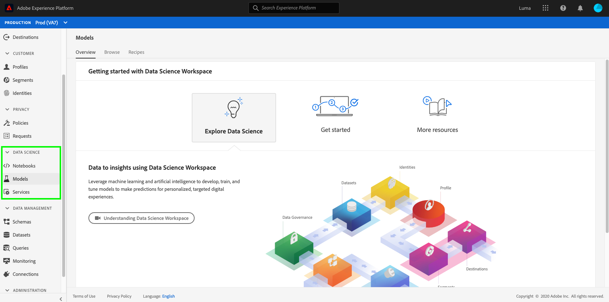

# Accesso e funzioni di Data Science Workspace

Il seguente documento delinea le autorizzazioni di Data Science Workspace e l’accesso alle funzioni.

- **Notebook:** Fornisce un ambiente di sviluppo interattivo ([JupyterLab](./jupyterlab/overview.md)) per esplorare, analizzare e modellare i dati, ad Experience Platform.
- **Modelli:** Fornisce gli strumenti utilizzati per creare, pubblicare e memorizzare ricette e modelli avanzati di apprendimento automatico. Per ulteriori informazioni, visita il [creare e pubblicare un modello di apprendimento automatico](./models-recipes/create-publish-model.md) esercitazione.
- **Servizi:** Contiene entrambi i servizi forniti da Adobe, come [Servizi AI/ML](../intelligent-services/home.md) ed eventuali servizi personalizzati creati con Data Science Workspace.

Perché viene visualizzata solo la scheda Servizi?

- La tua organizzazione può avere diritto solo ad Adobe Real-time Customer Data Platform (Real-Time CDP) che include il servizio Customer AI/ML.

Se non riesci a visualizzare nessuna delle **Data Science** schede e desideri utilizzare le funzionalità di Data Science Workspace, contatta l’amministratore della tua azienda per verificare se disponi di una licenza Adobe Experience Platform Intelligence.

## Pacchetto di Data Science Workspace

Le funzionalità di Data Science Workspace sono disponibili nel pacchetto Adobe Experience Platform Intelligence e nel componente aggiuntivo Advanced Intelligence Pack

La tabella seguente illustra alcune delle differenze chiave per le adesioni a Data Science Workspace con e senza il componente aggiuntivo Advanced Intelligence Pack:

>[!NOTE]
>
>È possibile concedere in licenza più di un Advanced Intelligence Pack Addon e l&#39;aumento della capacità viene aggiunto all&#39;adesione complessiva. Ad esempio, se hai concesso la licenza per 2 Addons Adobe Experience Platform Advanced Intelligence Pack hai diritto a un totale di 20 utenti di notebook simultanei.

| Adeguamento a Data Science Workspace | Solo pacchetto di Adobe Experience Platform Intelligence | Componente aggiuntivo Adobe Experience Platform Intelligence plus Advanced Intelligence Pack |
| --- | :---: | :---: |
| Numero di utenti di notebook supportati. | 5 utenti simultanei | Il primo pacchetto aggiunge 5 utenti simultanei e gli acquisti aggiuntivi aggiungono 10 utenti simultanei per pacchetto. |
| Consente l’integrazione di Jupyter Notebooks per l’analisi dei dati esplorativi e l’authoring di modelli. | X (supporta le librerie R, Python e Scala) | X (Aggiunge librerie PySpark e Spark ML) |
| Integrazione nativa con Query Service. Possibilità di esplorare e modellare i set di dati utilizzando SQL nei blocchi appunti. | X | X |
| Accesso a modelli di notebook predefiniti per analisi predittive. | X | X |
| Addestrare e valutare manualmente i modelli con Jupyter Notebooks. | X | X |
| Distribuire e rendere operativi modelli con la possibilità di programmare processi di formazione e di deduzione. |  | X |
| framework di ricetta per configurare, valutare, addestrare, valutare e pubblicare facilmente i modelli in produzione. |  | X |
| Sperimentazione e valutazione dei modelli basati sull’interfaccia utente. |  | X |
| Supporto per l&#39;apprendimento profondo per i modelli di flusso di tensione (GPU Compute). |  | X |
| Calcolo distribuito basato su scintille per addestrare e valutare in base a set di dati di grandi dimensioni (10MM + righe). |  | X |

## Controllo degli accessi

Il controllo degli accessi, ad Experience Platform, viene gestito tramite [Adobe Admin Console](https://adminconsole.adobe.com). Questa funzionalità sfrutta i profili di prodotto in Admin Console, che collegano gli utenti con autorizzazioni e sandbox. Consulta la sezione [panoramica sul controllo degli accessi](../access-control/home.md) per ulteriori informazioni.

Per utilizzare Data Science Workspace, è necessario abilitare l’autorizzazione &quot;Gestisci Data Science Workspace&quot;. La tabella seguente illustra gli effetti dell’abilitazione o della disabilitazione di questa autorizzazione:

| Autorizzazione | Abilitata | Disabilitata |
|---|---|---|
| Gestione di Data Science Workspace | Consente l&#39;accesso a tutti i servizi in Data Science Workspace. | L’accesso API e interfaccia utente a tutti i servizi in Data Science Workspace è disattivato. Quando è disattivato, seleziona la **Notebook**, **Modelli** e **Servizi** pagine non consentite. <li>Accesso a **Servizi** potrebbero essere ancora disponibili tramite Adobe Real-time Customer Data Platform (Real-Time CDP).</li> |

## Supporto per sandbox

Le sandbox sono partizioni virtuali all’interno di una singola istanza di Experience Platform. Ciascuna istanza di Platform supporta più sandbox di produzione e non di produzione, ciascuna con una propria libreria di risorse di Platform. Le sandbox non di produzione consentono di testare le funzioni, eseguire esperimenti e creare configurazioni personalizzate senza influire sulle sandbox di produzione. Per ulteriori informazioni sulle sandbox, consulta la sezione [panoramica sulle sandbox](../sandboxes/home.md).

Attualmente, Data Science Workspace presenta la seguente limitazione sandbox:

- Le risorse di elaborazione sono condivise tra le sandbox di produzione e non di produzione.

## Passaggi successivi

Questo documento descrive i diversi tipi di accesso e le funzioni disponibili in Data Science Workspace.

Per ulteriori informazioni su Data Science Workspace, ad esempio un flusso di lavoro giornaliero completo, si prega di iniziare leggendo il [Procedura dettagliata su Data Science Workspace](./walkthrough.md) documentazione. Per informazioni più generali, visita il [Panoramica di Data Science Workspace](./home.md).
