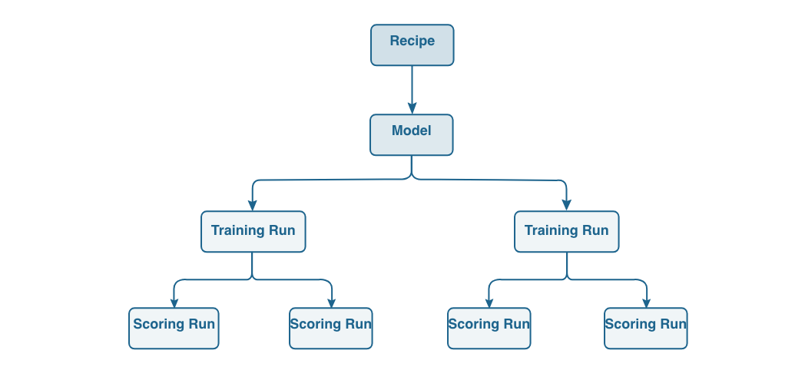

# Panoramica di Data Science Workspace

Adobe Experience Platform [!DNL Data Science Workspace] utilizza l’apprendimento automatico e l’intelligenza artificiale per trarre informazioni dai tuoi dati. integrata in Adobe Experience Platform, [!DNL Data Science Workspace] consente di effettuare previsioni utilizzando il contenuto e le risorse di dati nelle soluzioni Adobe.

Gli scienziati dei dati di tutti i livelli di abilità troveranno strumenti sofisticati e facili da usare che supportano lo sviluppo rapido, la formazione e la messa a punto di ricette di apprendimento automatico - tutti i vantaggi della tecnologia AI, senza la complessità.

Con [!DNL Data Science Workspace], gli scienziati dei dati possono creare facilmente API di servizi intelligenti, basate sull’apprendimento automatico. Questi servizi funzionano con altri servizi Adobe, tra cui Adobe Target e Adobe Analytics Cloud, per aiutarti a automatizzare esperienze digitali personalizzate e mirate nelle app web, desktop e mobili.

Questa guida fornisce una panoramica dei concetti chiave relativi a [!DNL Data Science Workspace].

## Introduzione

L’azienda di oggi attribuisce un’alta priorità all’estrazione di grandi dati per previsioni e informazioni che li aiuteranno a personalizzare le esperienze dei clienti e a fornire più valore ai clienti e al business.
Per quanto importante, il passaggio dai dati alle informazioni può avere un costo elevato. In genere richiede esperti esperti esperti di dati che conducano una ricerca intensiva e dispendiosa di dati per sviluppare modelli di apprendimento automatico, o ricette, che alimentano i servizi intelligenti. Il processo è lungo, la tecnologia è complessa, e gli scienziati esperti di dati possono essere difficili da trovare.

Con [!DNL Data Science Workspace], Adobe Experience Platform ti consente di portare l’intelligenza artificiale incentrata sull’esperienza nell’azienda, semplificando e accelerando l’attività data-to-insights-to-code con:
- Framework di apprendimento automatico e runtime
- Accesso integrato ai dati archiviati in Adobe Experience Platform
- Uno schema di dati unificato basato su [!DNL Experience Data Model] (XDM)
- La potenza di elaborazione essenziale per l&#39;apprendimento automatico/intelligenza artificiale e la gestione di grandi set di dati
- Ricette di apprendimento automatico predefinite per accelerare il passaggio alle esperienze basate sull’intelligenza artificiale
- Authoring, riutilizzo e modifica semplificati delle ricette per gli scienziati di dati con livelli di abilità diversi
- Pubblicazione e condivisione intelligente dei servizi in pochi clic - senza sviluppatori - e monitoraggio e riqualificazione per un&#39;ottimizzazione continua delle esperienze cliente personalizzate

Gli scienziati di dati di tutti i livelli di abilità otterranno informazioni più veloci ed efficaci prima.

## Introduzione

Prima di immergersi nei dettagli di [!DNL Data Science Workspace], ecco una breve sintesi dei termini chiave:

| Termine | Definizione |
|---------------------|------------------------------------------------------------------------------------------------------------------------------------------------------------------------------------------------------------------------------------------------------------------------------------------------------------------------------------------------------------------------------------------------------------------------------------------------------------------|
| [!DNL Data Science Workspace] | [!DNL Data Science Workspace] entro [!DNL Experience Platform] consente ai clienti di creare modelli di apprendimento automatico utilizzando i dati in [!DNL Experience Platform] e Adobe Solutions per generare informazioni e previsioni intelligenti per generare esperienze digitali coinvolgenti per gli utenti finali. |
| Intelligenza artificiale | L&#39;intelligenza artificiale è una teoria e sviluppo di sistemi informatici in grado di eseguire compiti che normalmente richiedono intelligenza umana, come la percezione visiva, il riconoscimento vocale, il processo decisionale e la traduzione tra le lingue. |
| Apprendimento automatico | L&#39;apprendimento automatico è il campo di studio che consente ai computer di imparare senza essere esplicitamente programmato. |
| [!DNL Sensei] Framework ML | [!DNL Sensei] ML Framework è un framework unificato di apprendimento automatico in tutti gli Adobi che sfrutta i dati su [!DNL Experience Platform] consentire agli scienziati dei dati di sviluppare servizi di intelligence guidati dall&#39;apprendimento automatico in modo più rapido, scalabile e riutilizzabile. |
| [!DNL Experience Data Model] | [!DNL Experience Data Model] (XDM) è lo sforzo di standardizzazione condotto da Adobe per definire schemi standard come [!DNL Profile] e [!DNL ExperienceEvent], per la gestione della customer experience. |
| [!DNL JupyterLab] | [!DNL JupyterLab] è un’interfaccia web open-source per Project Jupyter ed è strettamente integrata in [!DNL Experience Platform]. |
| Ricette | Una ricetta è un termine Adobe per una specifica di modello ed è un contenitore principale che rappresenta uno specifico apprendimento automatico, un algoritmo AI o un insieme di algoritmi, logica di elaborazione e configurazione necessari per creare ed eseguire un modello addestrato e quindi contribuire a risolvere problemi di business specifici. |
| Modello | Un modello è un&#39;istanza di una ricetta di apprendimento automatico formata utilizzando dati storici e configurazioni per risolvere un caso d&#39;uso aziendale. |
| Formazione | La formazione è il processo di apprendimento di schemi e insights dai dati etichettati. |
| Modello addestrato | Un modello addestrato rappresenta l&#39;output eseguibile di un processo di formazione del modello, in cui un set di dati di formazione è stato applicato all&#39;istanza del modello. Un modello qualificato manterrà un riferimento a qualsiasi servizio Web intelligente creato da esso. Il modello addestrato è adatto per il punteggio e la creazione di un servizio web intelligente. Le modifiche a un modello addestrato possono essere tracciate come nuova versione. |
| Punteggio | Il punteggio è il processo di generazione di informazioni dai dati utilizzando un modello qualificato. |
| Servizio | Un servizio implementato espone le funzionalità di un’intelligenza artificiale, di un modello di apprendimento automatico o di un algoritmo avanzato tramite un’API in modo che possa essere utilizzato da altri servizi o applicazioni per creare app intelligenti. |

Il grafico seguente illustra la relazione gerarchica tra Ricette, Modelli, Esecuzioni di formazione ed esecuzioni di valutazione.

## Comprensione di [!DNL Data Science Workspace]

Con [!DNL Data Science Workspace], gli esperti di dati possono semplificare il processo complesso di scoperta di informazioni in set di dati di grandi dimensioni. Basato su un framework e un runtime comune di machine learning, [!DNL Data Science Workspace] offre gestione avanzata del flusso di lavoro, gestione dei modelli e scalabilità. I servizi intelligenti supportano il riutilizzo delle ricette di apprendimento automatico per alimentare una varietà di applicazioni create utilizzando prodotti e soluzioni Adobe.

### Accesso unico ai dati

I dati sono la pietra angolare dell’intelligenza artificiale e dell’apprendimento automatico.

[!DNL Data Science Workspace] è completamente integrato con Adobe Experience Platform, incluso Data Lake, [!DNL Real-time Customer Profile]e [!DNL Unified Edge]. Esplora contemporaneamente tutti i dati organizzativi archiviati in Adobe Experience Platform, insieme ai grandi dati comuni e alle librerie di apprendimento profondo, come [!DNL Spark] ML e [!DNL TensorFlow]. Se non trovi ciò che ti serve, acquisisci i set di dati personalizzati utilizzando lo schema standardizzato XDM.

### Ricette di apprendimento automatico precompilate

[!DNL Data Science Workspace] include ricette di apprendimento automatico preconfigurate per le esigenze aziendali comuni, come la previsione delle vendite al dettaglio e il rilevamento delle anomalie, in modo che gli sviluppatori e gli scienziati di dati non debbano iniziare da zero. Attualmente sono offerte tre ricette, [previsione di acquisto del prodotto](./pre-built-recipes/product-purchase-prediction.md), [consigli sui prodotti](./pre-built-recipes/product-recommendations.md)e [vendite al dettaglio](./pre-built-recipes/retail-sales.md).

[//]: # (The built-in recipe gallery offers recommendations for prebuilt recipes based on your business needs.)

Se preferisci, puoi adattare una ricetta precompilata alle tue esigenze, importare una ricetta o iniziare da zero per creare una ricetta personalizzata. Tuttavia, una volta avviata l&#39;addestramento e l&#39;ottimizzazione di una ricetta, la creazione di un servizio intelligente personalizzato non richiede uno sviluppatore - solo pochi clic e sei pronto per creare un&#39;esperienza digitale mirata e personalizzata.

### Flusso di lavoro incentrato sullo scienziato dei dati

Qualunque sia il tuo livello di esperienza nella scienza dei dati, [!DNL Data Science Workspace] consente di semplificare e accelerare il processo di ricerca di informazioni approfondite nei dati e di applicarle alle esperienze digitali.

### Esplorazione dei dati

Trovare i dati giusti e prepararli è la parte più impegnativa della costruzione di una ricetta efficace. [!DNL Data Science Workspace] e Adobe Experience Platform ti aiuterà a passare dai dati agli approfondimenti più rapidamente.

Su Adobe Experience Platform, i dati multicanale sono centralizzati e memorizzati nello schema standardizzato XDM, in modo che i dati siano più semplici da trovare, comprendere e pulire. Un singolo archivio di dati basato su uno schema comune può consentirti di risparmiare innumerevoli ore di esplorazione e preparazione dei dati.

Quando sfoglia, utilizza R, [!DNL Python]o Scala con host integrati [!DNL Jupyter Notebook] per sfogliare il catalogo dei dati su [!DNL Platform]. Utilizzando una di queste lingue, puoi anche sfruttare [!DNL Spark] ML e TensorFlow. Iniziare da zero o utilizzare uno dei modelli per notebook forniti per problemi aziendali specifici.

Come parte del flusso di lavoro di esplorazione dei dati, puoi anche acquisire nuovi dati o utilizzare funzioni esistenti per facilitare la preparazione dei dati.

### Authoring

Con [!DNL Data Science Workspace], decidi come creare le ricette.

- Risparmia tempo sfogliando una ricetta predefinita che soddisfa le tue esigenze aziendali, che puoi utilizzare così come è o configurare per soddisfare le tue esigenze specifiche.
- Crea una ricetta da zero, utilizzando il runtime di authoring in Jupyter Notebook per sviluppare e registrare la ricetta.
- Caricare una ricetta creata al di fuori di Adobe Experience Platform in [!DNL Data Science Workspace] o importare codice di ricetta da un archivio, ad esempio [!DNL Git], utilizzando l’autenticazione e l’integrazione disponibili tra [!DNL Git] e [!DNL Data Science Workspace].

### Sperimentazione

Data Science Workspace offre un&#39;incredibile flessibilità al processo di sperimentazione. Inizia con la tua ricetta. Quindi crea un&#39;istanza separata, utilizzando lo stesso algoritmo di base abbinato a caratteristiche uniche, come i parametri di hyper-tuning. Puoi creare tutte le istanze necessarie, formando e assegnando a ciascuna istanza il numero desiderato di istanze. Mentre le alleni, [!DNL Data Science Workspace] tiene traccia di ricette, istanze di ricette e istanze preparate, insieme alle metriche di valutazione, in modo da non doverlo fare.

### Operazionalizzazione

Quando sei soddisfatto della tua ricetta, sono solo pochi clic per creare un servizio intelligente. Non è necessaria alcuna codifica: puoi farlo da solo, senza inserire uno sviluppatore o un ingegnere. Infine, pubblica il servizio intelligente su Adobe IO ed è pronto per il tuo team di esperienza digitale da consumare.

<!--You can also publish your intelligent service to the Service Gallery, where it's available to specific people, specific organizations, or everyone who develops data solutions on Adobe Experience Platform. You can even share it with your external partners, and they can share their intelligent service with you. And the next time you're starting a new recipe, you can check the Service Gallery to see if there's a similar intelligent service you can use to get started. -->

### Miglioramento continuo

[!DNL Data Science Workspace] tiene traccia della posizione in cui vengono richiamati i servizi intelligenti e delle loro prestazioni. Man mano che i dati si inseriscono, è possibile valutare l&#39;accuratezza del servizio intelligente per chiudere il ciclo e riaddestrare le ricette in base alle esigenze per migliorare le prestazioni. Il risultato è un perfezionamento continuo nella precisione della personalizzazione del cliente.

### Accesso a nuove funzioni e set di dati

Gli scienziati dei dati possono sfruttare le nuove tecnologie e i set di dati non appena sono disponibili tramite i servizi Adobe. Grazie a frequenti aggiornamenti, operiamo per integrare set di dati e tecnologie nella piattaforma, quindi non è necessario.

### Sicurezza e tranquillità

Ad Adobe, la protezione dei dati è una priorità assoluta. L&#39;Adobe protegge i tuoi dati con processi e controlli di sicurezza sviluppati per contribuire a rispettare gli standard, le normative e le certificazioni accettati dal settore.

La sicurezza è integrata in software e servizi come parte del ciclo di vita del prodotto sicuro di Adobe.
Per informazioni su sicurezza, conformità e altro ancora, per i dati e i software di Adobe, visita la pagina relativa alla sicurezza all&#39;indirizzo https://www.adobe.com/security.html.

## [!DNL Data Science Workspace] in azione

Le previsioni e le informazioni forniscono le informazioni necessarie per fornire un’esperienza altamente personalizzata a ogni cliente che visita il tuo sito web, contatta il tuo call center o si impegna in altre esperienze digitali. Ecco come avviene il tuo lavoro quotidiano con [!DNL Data Science Workspace].

### Definire il problema

Tutto inizia con un problema di business. Ad esempio, un call center online richiede contesto per aiutarli a trasformare un sentimento negativo del cliente positivo.

Ci sono un sacco di dati sul cliente. Hanno navigato sul sito, messo gli oggetti nel carrello, e hanno anche effettuato ordini. Potrebbero aver ricevuto e-mail, usato coupon o contattato il call center in precedenza. La ricetta, quindi, deve utilizzare i dati disponibili sul cliente e le sue attività per determinare la propensione ad acquistare e raccomandare un&#39;offerta che il cliente è probabile apprezzare e utilizzare.

Al momento del contatto con il call center, il cliente ha ancora due paia di scarpe nel carrello, ma ha rimosso una camicia. Con queste informazioni, il servizio intelligente potrebbe raccomandare all&#39;agente del call center di offrire un coupon per il 20% di sconto sulle scarpe durante la chiamata. Se il cliente utilizza il coupon, tali informazioni vengono aggiunte al set di dati e le previsioni diventano ancora migliori la prossima volta che il cliente chiama.

### Esplorare e preparare i dati

In base al problema aziendale definito, sai che la ricetta deve esaminare tutte le transazioni web del cliente, incluse visite al sito, ricerche, visualizzazioni di pagina, collegamenti selezionati, azioni del carrello, offerte ricevute, e-mail ricevute, interazioni con call center e così via.

Un esperto di dati spende in genere fino al 75% del tempo necessario per creare una ricetta che esplora e trasforma i dati. I dati provengono spesso da più archivi e vengono salvati in schemi diversi; per creare una ricetta è necessario combinarli e mapparli.

[//]: # (Your first step is to check the recipe gallery to see if an existing recipe meets your needs, or comes close. An alternative is to import a recipe you created outside of Adobe Experience Platform. Starting with an existing recipe often streamlines the data exploration phase and makes it easier for a data scientist.)

Se si inizia da zero o si configura una ricetta esistente, si inizia la ricerca dei dati in un catalogo dati centralizzato e standardizzato per la propria organizzazione, il che semplifica notevolmente la ricerca. Potresti anche scoprire che un altro scienziato dei dati nella tua organizzazione ha già identificato un set di dati simile e scegliere di perfezionare quel set di dati invece di iniziare da zero.
Tutti i dati in Adobe Experience Platform sono conformi a uno schema XDM standardizzato, eliminando la necessità di creare un modello complesso per la raccolta dei dati o ottenere l’aiuto di un tecnico dei dati.

Se non trovi immediatamente i dati necessari, ma esistono al di fuori di Adobe Experience Platform, è relativamente semplice acquisire set di dati aggiuntivi, che si trasformeranno anche nello schema XDM standard.\
È possibile utilizzare [!DNL Jupyter Notebook] per semplificare la pre-elaborazione dei dati, possibilmente a partire da un modello di blocco appunti o da un blocco appunti utilizzato in precedenza per la propensione all&#39;acquisto.

### Creare la ricetta

Se hai già trovato una ricetta che soddisfa tutte le tue esigenze, puoi passare alla sperimentazione. Oppure, è possibile modificare un po &#39;la ricetta o crearne una da zero - approfittando del [!DNL Data Science Workspace] runtime di authoring in [!DNL Jupyter Notebook]. L’utilizzo del runtime di authoring assicura che sia possibile utilizzare [!DNL Data Science Workspace] flusso di lavoro di formazione e valutazione e converti la ricetta in un secondo momento in modo che possa essere memorizzata e riutilizzata da altri all’interno della tua organizzazione.

Puoi anche importare una ricetta in [!DNL Data Science Workspace] e sfrutta i flussi di lavoro di sperimentazione durante la creazione del servizio intelligente.

### Sperimentare con la ricetta

Con una ricetta che incorpora gli algoritmi di apprendimento automatico di base, molte istanze di ricetta possono essere create con una singola ricetta. Queste istanze di ricette sono definite modelli. Un modello richiede formazione e valutazione per ottimizzarne l&#39;efficienza operativa e l&#39;efficacia, un processo generalmente costituito da prove ed errori.

Quando si formano i modelli, vengono generati percorsi di formazione e valutazioni. [!DNL Data Science Workspace] tiene traccia delle metriche di valutazione per ogni modello univoco e delle relative esecuzioni di formazione. Le metriche di valutazione generate tramite la sperimentazione ti consentiranno di determinare l’esecuzione di formazione che offre le migliori prestazioni.

Visita il [API](./models-recipes/train-evaluate-model-api.md) o [Interfaccia](./models-recipes/train-evaluate-model-ui.md) esercitazione su come addestrare e valutare i modelli in [!DNL Data Science Workspace].

### Operazionalizzare il modello

Quando hai selezionato la ricetta più adatta alle tue esigenze aziendali, puoi creare un servizio intelligente in [!DNL Data Science Workspace] senza assistenza agli sviluppatori. Sono solo un paio di clic - non è necessaria alcuna codifica. Un servizio intelligente pubblicato è accessibile ad altri membri dell’organizzazione senza la necessità di ricreare il modello.

Un servizio intelligente pubblicato è configurabile per formarsi automaticamente di volta in volta utilizzando nuovi dati man mano che diventano disponibili. In questo modo il servizio mantiene la sua efficienza ed efficacia mentre il tempo continua.

## Passaggi successivi

[!DNL Data Science Workspace] consente di semplificare e semplificare il flusso di lavoro sulla scienza dei dati, dalla raccolta dei dati agli algoritmi, fino a servizi intelligenti per gli scienziati dei dati di tutti i livelli di competenza. Con gli strumenti sofisticati [!DNL Data Science Workspace] fornisce, puoi ridurre notevolmente il tempo da dati a approfondimenti.

Ancora più importante, [!DNL Data Science Workspace] mette le funzionalità di ottimizzazione algoritmica e per la scienza dei dati di Adobe nelle mani degli scienziati dei dati aziendali. Per la prima volta, le aziende possono portare algoritmi proprietari alla piattaforma, sfruttando le potenti capacità di machine learning e AI di Adobe per offrire esperienze cliente altamente personalizzate su vasta scala.

Grazie al matrimonio tra competenze di marchio e apprendimento automatico Adobe e capacità di intelligenza artificiale, le aziende hanno il potere di incrementare il valore aziendale e la fedeltà al marchio, fornendo ai clienti ciò che desiderano, prima di chiederlo.

Per ulteriori informazioni, ad esempio un flusso di lavoro giornaliero completo, si prega di iniziare leggendo il [Procedura dettagliata di Data Science Workspace](./walkthrough.md) documentazione.

## Risorse aggiuntive

Il seguente video è stato progettato per supportare la comprensione di [!DNL Data Science Workspace].

>[!VIDEO](https://video.tv.adobe.com/v/30567?quality=12&amp;enable10seconds=on&amp;speedcontrol=on)