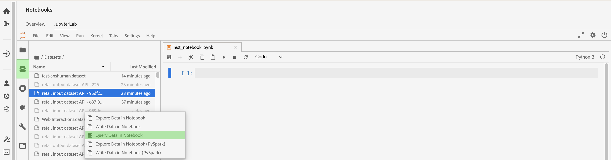

# Dati accesso nei [!DNL Jupyterlab] notebook

>[!NOTE]
>
>Data Science Area di lavoro non è più disponibile per l&#39;acquisto.
>
>Questa documentazione è destinata ai clienti esistenti con precedenti diritti a Data Science Area di lavoro.

Ogni kernel supportato fornisce funzionalità incorporate che consentono di leggere Platform dati da un set di dati all&#39;interno di un notebook. Attualmente JupyterLab in Adobe Experience Platform Data Science Area di lavoro supporta notebook per [!DNL Python], R, PySpark e Scala. Tuttavia, il supporto per l&#39;impaginazione dei dati è limitato ai [!DNL Python] blocchi appunti e R. Questa guida è incentrata su come utilizzare i notebook JupyterLab per accesso i dati.

## Introduzione

Prima di leggere questa guida, consulta la guida](./overview.md) utente [[!DNL JupyterLab] per un&#39;introduzione di alto livello e il suo ruolo all&#39;interno di [!DNL JupyterLab] Data Science Area di lavoro.

## Limiti dei dati del notebook {#notebook-data-limits}

>[!IMPORTANT]
>
>Per i notebook PySpark e Scala, se ricevi un errore con il motivo &quot;Client RPC remoto dissociato&quot;. Ciò significa in genere che il driver o un esecutore sta esaurendo la memoria. Provare a passare alla modalità [&quot;batch&quot;](#mode) per risolvere l&#39;errore.

Le informazioni seguenti definiscono la quantità massima di dati che è possibile leggere, il tipo di dati utilizzato e il periodo di tempo stimato necessario per la lettura dei dati.

Per [!DNL Python] e R, per i benchmark è stato utilizzato un server notebook configurato a 40 GB di RAM. Per i benchmark descritti di seguito sono stati utilizzati PySpark e Scala, un cluster di database configurato a 64 GB di RAM, 8 core, 2 DBU con un massimo di 4 processi di lavoro.

Le dimensioni dei dati dello schema ExperienceEvent utilizzati variavano a partire da mille (1 K) righe fino a un miliardo (1B) di righe. Tieni presente che per le metriche PySpark e [!DNL Spark] è stato utilizzato un intervallo di date di 10 giorni per i dati XDM.

I dati dello schema annuncio-hoc sono stati pre-elaborati utilizzando [!DNL Query Service] Crea Table as Select (CTAS). Questi dati variavano anche nelle dimensioni a partire da mille (1K) righe fino a un miliardo (1B) di righe.

### Quando utilizzare la modalità batch rispetto alla modalità interattiva {#mode}

Quando si leggono i set di dati con i notebook PySpark e Scala, è possibile utilizzare la modalità interattiva o batch per leggere il set di dati. L’interattività viene eseguita per ottenere risultati rapidi, mentre la modalità batch viene applicata a set di dati di grandi dimensioni.

- Per i notebook PySpark e Scala, è necessario utilizzare la modalità batch quando vengono lette almeno 5 milioni di righe di dati. Per ulteriori informazioni sull&#39;efficienza di ogni modalità, vedere le tabelle dei limiti di dati [PySpark](#pyspark-data-limits) o [Scala](#scala-data-limits) di seguito.

### [!DNL Python] limiti dati blocco appunti

**Schema ExperienceEvent XDM:** dovresti essere in grado di leggere un massimo di 2 milioni di righe (circa 6,1 GB di dati su disco) di dati XDM in meno di 22 minuti. L’aggiunta di righe aggiuntive può causare errori.

| Numero di righe | 1 K | 10K | 100.000 | 1 M | 2 M |
| ----------------------- | ------ | ------ | ----- | ----- | ----- |
| Dimensioni su disco (MB) | 18,73 | 187,5 | 308 | 3000 | 6050 |
| SDK (in secondi) | 20,3 | 86,8 | 63 | 659 | 1315 |

**Schema annuncio-hoc:** dovresti essere in grado di leggere un massimo di 5 milioni di righe (~ 5,6 GB di dati su disco) di dati non XDM (annuncio-hoc) in meno di 14 minuti. L&#39;aggiunta di ulteriori righe potrebbe causare errori.

| Numero di righe | 1K | 10K | 100.000 | 1M | 2M | 3 M | 5 M |
| ----------------------- | ------- | ------- | ----- | ----- | ----- | ----- | ------ |
| Dimensioni su disco (in MB) | 1,21 | 11,72 | 115 | 1120 | 2250 | 3380 | 5630 |
| SDK (in secondi) | 7,27 | 9,04 | 27,3 | 180 | 346 | 487 | 819 |

### Limiti dati notebook R

**Schema XDM ExperienceEvent:** dovresti essere in grado di leggere un massimo di 1 milione di righe di dati XDM (3 GB di dati su disco) in meno di 13 minuti.

| Numero di righe | 1K | 10K | 100.000 | 1 M |
| ----------------------- | ------ | ------ | ----- | ----- |
| Dimensioni su disco (MB) | 18,73 | 187,5 | 308 | 3000 |
| R Kernel (in secondi) | 14,03 | 69,6 | 86,8 | 775 |

**schema ad hoc:** dovrebbe essere possibile leggere un massimo di 3 milioni di righe di dati ad hoc (293 MB di dati su disco) in circa 10 minuti.

| Numero di righe | 1 K | 10K | 100.000 | 1 M | 2M | 3M |
| ----------------------- | ------- | ------- | ----- | ----- | ----- | ----- |
| Dimensioni su disco (in MB) | 0,082 | 0,612 | 9,0 | 91 | 188 | 293 |
| R SDK (in sec) | 7,7 | 4,58 | 35,9 | 233 | 470,5 | 603 |

### Limiti dei dati del notebook PySpark ([!DNL Python] kernel): {#pyspark-data-limits}

**Schema XDM ExperienceEvent:** in modalità interattiva dovresti essere in grado di leggere un massimo di 5 milioni di righe (~ 13,42 GB di dati su disco) di dati XDM in circa 20 minuti. La modalità interattiva supporta solo fino a 5 milioni di righe. Se desideri leggere set di dati più grandi, ti consigliamo di passare alla modalità batch. In modalità batch dovresti essere in grado di leggere un massimo di 500 milioni di righe (~ 1,31 TB di dati su disco) di dati XDM in circa 14 ore.

| Numero di righe | 1 K | 10K | 100.000 | 1M | 2M | 3M | 5M | 10M | 50 milioni | 100 milioni | 500M |
|-------------------------|--------|--------|-------|-------|-------|-------|---------|---------|----------|--------|--------|
| Dimensioni su disco | 2,93MB | 4,38MB | 29,02 | 2,69GB | 5,39GB | 8,09GB | 13,42GB | 26,82GB | 134,24GB | 268,39GB | 1,31 TB |
| SDK (modalità interattiva) | 33s | 32,4s | 55,1 secondi | 253,5 s | 489,2 s | 729,6s | 1206,8s | - | - | - | - |
| SDK (modalità Batch) | 815,8s | 492,8s | 379,1s | 637,4s | 624,5s | 869,2s | 1104,1 secondi | Anni 1786 | 5387,2 s | 10624,6s | 50547 s |

**schema ad hoc:** In modalità interattiva dovresti essere in grado di leggere un massimo di 5 milioni di righe (circa 5,36 GB di dati su disco) di dati non XDM in meno di 3 minuti. In modalità Batch dovresti essere in grado di leggere un massimo di 1 miliardo di righe (circa 1,05 TB di dati su disco) di dati non XDM in circa 18 minuti.

| Numero di righe | 1K | 10K | 100.000 | 1M | 2M | 3M | 5M | 10M | 50M | 100M | 500 milioni | 1B |
|--------------|--------|---------|---------|-------|-------|-------|--------|--------|---------|--------|---------|-------|
| Dimensioni su disco | 1,12MB | 11,24MB | 109,48MB | 2,69GB | 2,14GB | 3,21GB | 5,36GB | 10,71GB | 53,58GB | 107,52GB | 535,88GB | 1,05 TB |
| Modalità interattiva SDK (in secondi) | 28,2 secondi | 18,6 secondi | 20,8 secondi | 20,9 secondi | 23,8s | 21,7s | 24,7s | - | - | - | - | - |
| Modalità SDK Batch (in secondi) | 428,8s | 578,8s | 641,4s | 538,5s | 630,9 s | 467,3s | Anni 411 | 675s | 702 s | 719,2 s | 1022,1 secondi | 1122,3s |

### [!DNL Spark] (kernel Scala) limiti dei dati del notebook: {#scala-data-limits}

**Schema XDM ExperienceEvent:** in modalità interattiva dovresti essere in grado di leggere un massimo di 5 milioni di righe (~ 13,42 GB di dati su disco) di dati XDM in circa 18 minuti. La modalità interattiva supporta solo fino a 5 milioni di righe. Se desideri leggere set di dati più grandi, ti consigliamo di passare alla modalità batch. In modalità batch dovresti essere in grado di leggere un massimo di 500 milioni di righe (~ 1,31 TB di dati su disco) di dati XDM in circa 14 ore.

| Numero di righe | 1 K | 10K | 100.000 | 1 M | 2M | 3M | 5M | 10M | 50M | 100M | 500M |
|---------------|--------|--------|-------|-------|-------|-------|---------|---------|----------|--------|--------|
| Dimensioni su disco | 2,93MB | 4,38MB | 29,02 | 2,69GB | 5,39GB | 8,09GB | 13,42GB | 26,82GB | 134,24GB | 268,39GB | 1,31 TB |
| Modalità interattiva SDK (in secondi) | 37,9 s | 22,7s | 45,6 secondi | 231,7s | 444,7s | 660,6s | Anni 1100 | - | - | - | - |
| Modalità SDK Batch (in secondi) | 374,4s | 398,5s | 527s | 487,9 s | 588,9 s | 829 | 939,1s | Anni 1441 | 5473,2s | 10118,8 | 49207,6 |

**Schema annuncio-hoc:** in modalità interattiva dovresti essere in grado di leggere un massimo di 5 milioni di righe (~ 5,36 GB di dati su disco) di dati non XDM in meno di 3 minuti. In modalità batch dovresti essere in grado di leggere un massimo di 1 miliardo di righe (circa 1,05 TB di dati su disco) di dati non XDM in circa 16 minuti.

| Numero di righe | 1K | 10K | 100.000 | 1 M | 2M | 3M | 5M | 10M | 50M | 100M | 500M | 1B |
|--------------|--------|---------|---------|-------|-------|-------|---------|---------|---------|--------|---------|-------|
| Dimensioni su disco | 1,12 MB | 11,24 MB | 109,48MB | 2,69GB | 2,14GB | 3,21GB | 5,36GB | 10,71GB | 53,58GB | 107,52GB | 535,88GB | 1,05 TB |
| Modalità interattiva SDK (in secondi) | 35,7s | 31s | 19,5 secondi | 25,3s | 23s | 33,2 secondi | 25,5 secondi | - | - | - | - | - |
| Modalità batch SDK (in secondi) | 448,8s | 459,7s | 519 | 475,8s | 599,9 s | 347,6s | 407,8s | 397s | 518,8s | 487,9s | 760,2 s | 975,4s |

## Notebook Python {#python-notebook}

I blocchi appunti [!DNL Python] consentono di impaginare i dati quando si accede ai set di dati. Di seguito è illustrato il codice di esempio per la lettura dei dati con e senza impaginazione. Per ulteriori informazioni sui notebook Python iniziali disponibili, visita la [[!DNL JupyterLab] sezione Launcher](./overview.md#launcher) nella guida utente di JupyterLab.

La documentazione di Python riportata di seguito delinea i seguenti concetti:

- [Lettura da un dataset](#python-read-dataset)
- [Scrivere in un dataset](#write-python)
- [Dati della query](#query-data-python)
- [Filtra dati ExperienceEvent](#python-filter)

### Leggi da un set di dati in Python {#python-read-dataset}

**Senza impaginazione:**

L&#39;esecuzione del codice seguente leggerà l&#39;intero set di dati. Se l&#39;esecuzione ha esito positivo, i dati verranno salvati come frame di dati Pandas a cui fa riferimento la variabile `df`.

```python
# Python

from platform_sdk.dataset_reader import DatasetReader
dataset_reader = DatasetReader(get_platform_sdk_client_context(), dataset_id="{DATASET_ID}")
df = dataset_reader.read()
df.head()
```

**Con impaginazione:**

L’esecuzione del codice seguente leggerà i dati dal set di dati specificato. L&#39;impaginazione viene ottenuta limitando e spostando i dati tramite le funzioni `limit()` e `offset()` rispettivamente. La limitazione dei dati si riferisce al numero massimo di punti dati da leggere, mentre la compensazione si riferisce al numero di punti dati da saltare prima di leggere i dati. Se l&#39;operazione di lettura viene eseguita correttamente, i dati verranno salvati come frame di dati Pandas a cui fa riferimento la variabile `df`.

```python
# Python

from platform_sdk.dataset_reader import DatasetReader

dataset_reader = DatasetReader(get_platform_sdk_client_context(), dataset_id="{DATASET_ID}")
df = dataset_reader.limit(100).offset(10).read()
```

### Scrivere su un dataset in Python {#write-python}

Per scrivere su un dataset nel notebook JupyterLab, selezionare l&#39;icona Dati scheda (evidenziata di seguito) nel navigazione sinistro di JupyterLab. Vengono visualizzate le **[!UICONTROL directory Datasets]** e **[!UICONTROL Schemas]** . Selezionare **[!UICONTROL Set di]** dati e fare clic con il pulsante destro del mouse, quindi selezionare l&#39;opzione **[!UICONTROL Scrivi dati in blocco appunti]** dal menu a discesa sul set di dati che si desidera utilizzare. Una voce di codice eseguibile viene visualizzata nella parte inferiore del blocco appunti.


- Utilizzare **[!UICONTROL Scrivi dati in blocco appunti]** per generare una cella di scrittura con il set di dati selezionato.
- Utilizza **[!UICONTROL Esplora dati nel blocco appunti]** per generare una cella di lettura con il set di dati selezionato.
- Utilizza **[!UICONTROL Query Data in Notebook]** per generare una cella di query di base con il set di dati selezionato.

In alternativa, è possibile copiare e incollare la seguente cella di codice. Sostituire sia `{DATASET_ID}` che `{PANDA_DATAFRAME}`.

```python
from platform_sdk.models import Dataset
from platform_sdk.dataset_writer import DatasetWriter

dataset = Dataset(get_platform_sdk_client_context()).get_by_id(dataset_id="{DATASET_ID}")
dataset_writer = DatasetWriter(get_platform_sdk_client_context(), dataset)
write_tracker = dataset_writer.write({PANDA_DATAFRAME}, file_format='json')
```

### Eseguire query sui dati utilizzando [!DNL Query Service] in [!DNL Python] {#query-data-python}

[!DNL JupyterLab] su [!DNL Platform] consente di utilizzare SQL in un blocco appunti [!DNL Python] per accedere ai dati tramite [Adobe Experience Platform Query Service](https://www.adobe.com/go/query-service-home-en). L&#39;accesso ai dati può [!DNL Query Service] essere utile per gestire set di dati di grandi dimensioni a causa dei suoi tempi di esecuzione superiori. Tieni presente che l&#39;interrogazione dei dati utilizzando [!DNL Query Service] ha un limite di tempo di elaborazione di dieci minuti.

Prima di utilizzare [!DNL Query Service] in [!DNL JupyterLab], assicurarsi di avere una conoscenza pratica della [[!DNL Query Service] sintassi](https://www.adobe.com/go/query-service-sql-syntax-en) SQL.

Per eseguire query sui dati utilizzando [!DNL Query Service] è necessario specificare il nome dell&#39;destinazione dataset. È possibile generare le celle di codice necessarie individuando il set di dati desiderato utilizzando Esplora **[!UICONTROL dati]**. Fai clic con il pulsante destro del mouse sull&#39;elenco dei set di dati e fai clic su **[!UICONTROL Esegui query sui dati nel blocco appunti]** per generare due celle di codice nel blocco appunti. Queste due celle sono descritte più dettagliatamente di seguito.



Per utilizzare [!DNL Query Service] in [!DNL JupyterLab], è necessario innanzitutto creare una connessione tra il blocco appunti [!DNL Python] in uso e [!DNL Query Service]. Ciò può essere ottenuto eseguendo la prima cella generata.

```python
qs_connect()
```

Nella seconda cella generata, la prima riga deve essere definita prima della query SQL. Per impostazione predefinita, la cella generata definisce una variabile facoltativa (`df0`) che salva i risultati della query come frame di dati Pandas. <br>L&#39;argomento `-c QS_CONNECTION` è obbligatorio e indica al kernel di eseguire la query SQL su [!DNL Query Service]. Vedere l&#39;appendice [](#optional-sql-flags-for-query-service) per un elenco di argomenti aggiuntivi.

```python
%%read_sql df0 -c QS_CONNECTION
SELECT *
FROM name_of_the_dataset
LIMIT 10
/* Querying table "name_of_the_dataset" (datasetId: {DATASET_ID})*/
```

È possibile fare riferimento direttamente alle variabili Python all&#39;interno di una query SQL utilizzando la sintassi in formato stringa e racchiudere le variabili tra parentesi graffe (`{}`), come illustrato nell&#39;esempio seguente:

```python
table_name = 'name_of_the_dataset'
table_columns = ','.join(['col_1','col_2','col_3'])
```

```python
%%read_sql demo -c QS_CONNECTION
SELECT {table_columns}
FROM {table_name}
```

### Filtra dati [!DNL ExperienceEvent] {#python-filter}

Per accedere e filtrare un set di dati [!DNL ExperienceEvent] in un blocco appunti [!DNL Python], è necessario fornire l&#39;ID del set di dati (`{DATASET_ID}`) insieme alle regole di filtro che definiscono un intervallo di tempo specifico utilizzando operatori logici. Quando viene definito un intervallo di tempo, qualsiasi impaginazione specificata viene ignorata e viene considerato l’intero set di dati.

Di seguito è riportato un elenco di operatori di filtro:

- `eq()`: uguale a
- `gt()`: maggiore di
- `ge()`: maggiore o uguale a
- `lt()`:Meno di
- `le()`: minore o uguale a
- `And()`: operatore AND logico
- `Or()`: operatore OR logico

La cella seguente filtra un set di dati [!DNL ExperienceEvent] ai dati esistenti esclusivamente tra il 1° gennaio 2019 e la fine del 31 dicembre 2019.

```python
# Python

from platform_sdk.dataset_reader import DatasetReader

dataset_reader = DatasetReader(get_platform_sdk_client_context(), dataset_id="{DATASET_ID}")
df = dataset_reader.\
    where(dataset_reader["timestamp"].gt("2019-01-01 00:00:00").\
    And(dataset_reader["timestamp"].lt("2019-12-31 23:59:59"))\
).read()
```

## R notebook {#r-notebooks}

R consente di impaginare i dati quando si accede ai set di dati. Di seguito è illustrato il codice di esempio per la lettura dei dati con e senza impaginazione. Per ulteriori informazioni sui notebook R iniziali disponibili, visita la [[!DNL JupyterLab] sezione Launcher](./overview.md#launcher) all&#39;interno della guida utente di JupyterLab.

La documentazione R riportata di seguito illustra i seguenti concetti:

- [Lettura da un dataset](#r-read-dataset)
- [Scrivere in un dataset](#write-r)
- [Filtrare i dati ExperienceEvent](#r-filter)

### Lettura da un dataset in R {#r-read-dataset}

**Senza impaginazione:**

L&#39;esecuzione del codice seguente leggerà l&#39;intero set di dati. Se l&#39;esecuzione ha esito positivo, i dati verranno salvati come frame di dati Pandas a cui fa riferimento la variabile `df0`.

```R
# R

library(reticulate)
use_python("/usr/local/bin/ipython")
psdk <- import("platform_sdk")
datetime <- import("datetime", convert = FALSE)
py_run_file("~/.ipython/profile_default/startup/platform_sdk_context.py")
DatasetReader <- psdk$dataset_reader$DatasetReader
dataset_reader <- DatasetReader(py$get_platform_sdk_client_context(), dataset_id="{DATASET_ID}")
df0 <- dataset_reader$read()
head(df0)
```

**Con impaginazione:**

L&#39;esecuzione del codice seguente leggerà i dati dal set di dati specificato. L&#39;impaginazione viene ottenuta limitando e spostando i dati tramite le funzioni `limit()` e `offset()` rispettivamente. Limitare i dati si riferisce al numero massimo di punti dati da leggere, mentre l&#39;offset si riferisce al numero di punti dati da saltare prima della lettura dei dati. Se l&#39;operazione di lettura viene eseguita correttamente, i dati verranno salvati come dataframe Pandas a cui fa riferimento la variabile `df0`.

```R
# R

library(reticulate)
use_python("/usr/local/bin/ipython")
psdk <- import("platform_sdk")
datetime <- import("datetime", convert = FALSE)
py_run_file("~/.ipython/profile_default/startup/platform_sdk_context.py")

DatasetReader <- psdk$dataset_reader$DatasetReader
dataset_reader <- DatasetReader(py$get_platform_sdk_client_context(), dataset_id="{DATASET_ID}") 
df0 <- dataset_reader$limit(100L)$offset(10L)$read()
```

### Scrittura in un set di dati in R {#write-r}

Per scrivere su un set di dati nel notebook JupyterLab, seleziona la scheda Icona dati (evidenziata di seguito) nell’area di navigazione a sinistra di JupyterLab. Vengono visualizzate le directory **[!UICONTROL Set di dati]** e **[!UICONTROL Schemi]**. Seleziona **[!UICONTROL Set di dati]** e fai clic con il pulsante destro del mouse, quindi seleziona l&#39;opzione **[!UICONTROL Scrivi dati nel blocco appunti]** dal menu a discesa del set di dati che desideri utilizzare. Una voce di codice eseguibile viene visualizzata nella parte inferiore del blocco appunti.


- Utilizzare **[!UICONTROL Scrivi dati in blocco appunti]** per generare una cella di scrittura con il set di dati selezionato.
- Utilizzare **[!UICONTROL Esplora dati in blocco appunti]** per generare una cella di lettura con il set di dati selezionato.

In alternativa, è possibile copiare e incollare la seguente cella di codice:

```R
psdk <- import("platform_sdk")
dataset <- psdk$models$Dataset(py$get_platform_sdk_client_context())$get_by_id(dataset_id="{DATASET_ID}")
dataset_writer <- psdk$dataset_writer$DatasetWriter(py$get_platform_sdk_client_context(), dataset)
write_tracker <- dataset_writer$write(df, file_format='json')
```

### [!DNL ExperienceEvent] Filtra dati {#r-filter}

Per accesso e filtrare un [!DNL ExperienceEvent] dataset in un notebook R, è necessario fornire l&#39;ID del dataset (`{DATASET_ID}`) insieme alle regole di filtro che definiscono un intervallo di tempo specifico utilizzando operatori logici. Quando viene definito un intervallo di tempo, qualsiasi impaginazione specificata viene ignorata e viene considerato l’intero set di dati.

Di seguito è riportato un elenco di operatori di filtro:

- `eq()`: Uguale a
- `gt()`:Maggiore
- `ge()`: maggiore o uguale a
- `lt()`: minore di
- `le()`: minore o uguale a
- `And()`: operatore AND logico
- `Or()`: operatore OR logico

La cella seguente filtra un [!DNL ExperienceEvent] set di dati in base a dati esistenti esclusivamente tra il 1° gennaio 2019 e la fine del 31 dicembre 2019.

```R
# R

library(reticulate)
use_python("/usr/local/bin/ipython")
psdk <- import("platform_sdk")
datetime <- import("datetime", convert = FALSE)
py_run_file("~/.ipython/profile_default/startup/platform_sdk_context.py")

client_context <- py$PLATFORM_SDK_CLIENT_CONTEXT
DatasetReader <- psdk$dataset_reader$DatasetReader
dataset_reader <- DatasetReader(py$get_platform_sdk_client_context(), dataset_id="{DATASET_ID}") 

df0 <- dataset_reader$
    where(dataset_reader["timestamp"]$gt("2019-01-01 00:00:00")$
    And(dataset_reader["timestamp"]$lt("2019-12-31 23:59:59"))
)$read()
```

## PySpark 3 notebook {#pyspark-notebook}

La documentazione di PySpark riportata di seguito descrive i concetti seguenti:

- [Inizializza sparkSession](#spark-initialize)
- [Lettura e scrittura di dati](#magic)
- [Creare un dataframe locale](#pyspark-create-dataframe)
- [Filtrare i dati ExperienceEvent](#pyspark-filter-experienceevent)

### Inizializzazione di sparkSession {#spark-initialize}

Tutti i notebook [!DNL Spark] 2.4 richiedono l&#39;inizializzazione della sessione con il seguente codice boilerplate.

```scala
from pyspark.sql import SparkSession
spark = SparkSession.builder.getOrCreate()
```

### Utilizzo di %dataset per la lettura e la scrittura con un blocco appunti di PySpark 3 {#magic}

Con l&#39;introduzione di [!DNL Spark] 2.4, viene fornita la magia personalizzata `%dataset` da utilizzare nei notebook PySpark 3 ([!DNL Spark] 2.4). Per ulteriori dettagli sui comandi magici disponibili nel kernel IPython, visita la [documentazione magica di IPython](https://ipython.readthedocs.io/en/stable/interactive/magics.html).


**Utilizzo**

```scala
%dataset {action} --datasetId {id} --dataFrame {df} --mode batch
```

**Descrizione**

Comando magico [!DNL Data Science Workspace] personalizzato per la lettura o la scrittura di un set di dati da un blocco appunti [!DNL PySpark] ([!DNL Python] 3 kernel).

| Nome | Descrizione | Obbligatorio |
| --- | --- | --- |
| `{action}` | Tipo di azione da eseguire sul set di dati. Sono disponibili due azioni: &quot;lettura&quot; o &quot;scrittura&quot;. | Sì |
| `--datasetId {id}` | Utilizzato per fornire l’ID del set di dati da leggere o scrivere. | Sì |
| `--dataFrame {df}` | Il dataframe panda. <ul><li> Quando l&#39;azione è &quot;letta&quot;, {df} è la variabile in cui sono disponibili i risultati dell&#39;operazione di lettura del set di dati (ad esempio un frame di dati). </li><li> Quando l&#39;azione è &quot;write&quot;, questo frame {df} di dati viene scritto nel set di dati. </li></ul> | Sì |
| `--mode` | Un parametro aggiuntivo che cambia il modo in cui i dati vengono letti. I parametri consentiti sono &quot;batch&quot; e &quot;interattivo&quot;. Per impostazione predefinita, la modalità è impostata su &quot;batch&quot;.<br> Si consiglia di utilizzare la modalità &quot;interattiva&quot; per migliorare le prestazioni delle query su set di dati più piccoli. | Sì |

>[!TIP]
>
>Esaminare le tabelle PySpark nella sezione [limiti dati blocco appunti](#notebook-data-limits) per determinare se `mode` deve essere impostato su `interactive` o `batch`.

**Esempi**

- **Leggi l&#39;esempio**: `%dataset read --datasetId 5e68141134492718af974841 --dataFrame pd0 --mode batch`
- **Scrivi esempio**: `%dataset write --datasetId 5e68141134492718af974842 --dataFrame pd0 --mode batch`

>[!IMPORTANT]
>
> La memorizzazione dei dati nella cache utilizzando `df.cache()` prima di scrivere i dati può migliorare notevolmente le prestazioni del notebook. Questo può essere utile se ricevi uno dei seguenti errori:
> 
> - Processo interrotto a causa di un errore della fase... È possibile comprimere solo gli RDD con lo stesso numero di elementi in ogni partizione.
> - Client RPC remoto dissociato e altri errori di memoria.
> - Scarse prestazioni durante la lettura e la scrittura di set di dati.
> 
> Per ulteriori informazioni, consulta la guida](../troubleshooting-guide.md) alla [risoluzione dei problemi.

È possibile generare automaticamente gli esempi di cui sopra in JupyterLab compravendita utilizzando il seguente metodo:

Seleziona l&#39;icona Dati scheda (evidenziata di seguito) nella navigazione sinistra di JupyterLab. Vengono visualizzate le **[!UICONTROL directory Datasets]** e **[!UICONTROL Schemas]** . Seleziona **[!UICONTROL Set di dati]** e fai clic con il pulsante destro del mouse, quindi seleziona l&#39;opzione **[!UICONTROL Scrivi dati nel blocco appunti]** dal menu a discesa del set di dati che desideri utilizzare. Nella parte inferiore del blocco appunti viene visualizzata una voce di codice eseguibile.

- Utilizza **[!UICONTROL Esplora dati nel blocco appunti]** per generare una cella di lettura.
- Utilizza **[!UICONTROL Scrivi dati in blocco appunti]** per generare una cella di scrittura.


### Creare un dataframe locale {#pyspark-create-dataframe}

Per creare un dataframe locale utilizzando PySpark 3, utilizzare le query SQL. Ad esempio:

```scala
date_aggregation.createOrReplaceTempView("temp_df")

df = spark.sql('''
  SELECT *
  FROM sparkdf
''')

local_df
```

```scala
df = spark.sql('''
  SELECT *
  FROM sparkdf
  LIMIT limit
''')
```

```scala
sample_df = df.sample(fraction)
```

>[!TIP]
>
>È inoltre possibile specificare un campione di seme facoltativo, ad esempio un valore booleano withReplacement, una frazione doppia o un seme lungo.

### [!DNL ExperienceEvent] Filtra dati {#pyspark-filter-experienceevent}

L&#39;accesso e il filtraggio di un [!DNL ExperienceEvent] set di dati in un notebook PySpark richiedono di fornire l&#39;identità del set di dati (`{DATASET_ID}`), l&#39;identità IMS dell&#39;organizzazione e le regole di filtro che definiscono un intervallo di tempo specifico. Un intervallo di tempo di filtraggio viene definito utilizzando la funzione `spark.sql()`, dove il parametro della funzione è una stringa di query SQL.

Le celle seguenti filtrano un [!DNL ExperienceEvent] set di dati in base ai dati esistenti esclusivamente tra il 1° gennaio 2019 e la fine del 31 dicembre 2019.

```python
# PySpark 3 (Spark 2.4)

from pyspark.sql import SparkSession
spark = SparkSession.builder.getOrCreate()

%dataset read --datasetId {DATASET_ID} --dataFrame df --mode batch

df.createOrReplaceTempView("event")
timepd = spark.sql("""
    SELECT *
    FROM event
    WHERE timestamp > CAST('2019-01-01 00:00:00.0' AS TIMESTAMP)
    AND timestamp < CAST('2019-12-31 23:59:59.9' AS TIMESTAMP)
""")
timepd.show()
```

## Quaderni Scala {#scala-notebook}

La documentazione riportata di seguito contiene esempi relativi ai seguenti concetti:

- [Inizializza sparkSession](#scala-initialize)
- [Leggere un set di dati](#read-scala-dataset)
- [Scrivere in un dataset](#scala-write-dataset)
- [Crea un frame di dati locale](#scala-create-dataframe)
- [Filtra dati ExperienceEvent](#scala-experienceevent)

### Inizializzazione di SparkSession {#scala-initialize}

Tutti i notebook Scala richiedono l&#39;inizializzazione della sessione con il seguente codice standard:

```scala
import org.apache.spark.sql.{ SparkSession }
val spark = SparkSession
  .builder()
  .master("local")
  .getOrCreate()
```

### Leggere un set di dati {#read-scala-dataset}

In Scala è possibile importare `clientContext` per ottenere e restituire i valori di Platform, eliminando la necessità di definire variabili quali `var userToken`. Nell&#39;esempio Scala seguente, `clientContext` viene utilizzato per ottenere e restituire tutti i valori richiesti necessari per la lettura di un set di dati.

>[!IMPORTANT]
>
> La memorizzazione nella cache dei dati tramite `df.cache()` prima della scrittura dei dati può migliorare notevolmente le prestazioni del blocco appunti. Questo può essere utile se ricevi uno dei seguenti errori:
> 
> - Processo interrotto a causa di un errore della fase... È possibile comprimere solo gli RDD con lo stesso numero di elementi in ogni partizione.
> - Client RPC remoto disassociato e altri errori di memoria.
> - Scarse prestazioni durante la lettura e la scrittura di set di dati.
> 
> Per ulteriori informazioni, consulta la [guida alla risoluzione dei problemi](../troubleshooting-guide.md).

```scala
import org.apache.spark.sql.{Dataset, SparkSession}
import com.adobe.platform.token.ClientContext
val spark = SparkSession.builder().master("local").config("spark.sql.warehouse.dir", "/").getOrCreate()

val clientContext = ClientContext.getClientContext()
val df1 = spark.read.format("com.adobe.platform.query")
  .option("user-token", clientContext.getUserToken())
  .option("ims-org", clientContext.getOrgId())
  .option("api-key", clientContext.getApiKey())
  .option("service-token", clientContext.getServiceToken())
  .option("sandbox-name", clientContext.getSandboxName())
  .option("mode", "batch")
  .option("dataset-id", "5e68141134492718af974844")
  .load()

df1.printSchema()
df1.show(10)
```

| Elemento | Descrizione |
| ------- | ----------- |
| df1 | Variabile che rappresenta il dataframe Pandas utilizzato per leggere e scrivere dati. |
| user-token | Il token utente che viene recuperato automaticamente con `clientContext.getUserToken()`. |
| service-token | Il token di servizio che viene recuperato automaticamente utilizzando `clientContext.getServiceToken()`. |
| ims-org | L&#39;ID organizzazione che viene recuperato automaticamente con `clientContext.getOrgId()`. |
| api-key | Chiave API recuperata automaticamente tramite `clientContext.getApiKey()`. |

>[!TIP]
>
>Rivedi le tabelle Scala nella sezione [limiti dati blocco appunti](#notebook-data-limits) per determinare se `mode` deve essere impostato su `interactive` o `batch`.

Puoi generare automaticamente l’esempio precedente in JupyterLab buy utilizzando il seguente metodo:

Seleziona la scheda Icona dati (evidenziata di seguito) nell’area di navigazione a sinistra di JupyterLab. Vengono visualizzate le directory **[!UICONTROL Set di dati]** e **[!UICONTROL Schemi]**. Selezionare **[!UICONTROL Set di]** dati e fare clic con il pulsante destro del mouse, quindi selezionare l&#39;opzione **[!UICONTROL Esplora dati in blocco appunti]** dal menu a discesa sul set di dati che si desidera utilizzare. Una voce di codice eseguibile viene visualizzata nella parte inferiore del blocco appunti.
E
- Utilizzare **[!UICONTROL Esplora dati nel blocco appunti]** per generare una cella di lettura.
- Utilizza **[!UICONTROL Scrivi dati in blocco appunti]** per generare una cella di scrittura.


### Scrivi in un set di dati {#scala-write-dataset}

In Scala è possibile importare `clientContext` per ottenere e restituire i valori di Platform, eliminando la necessità di definire variabili quali `var userToken`. Nell&#39;esempio Scala seguente, `clientContext` viene utilizzato per definire e restituire tutti i valori richiesti necessari per la scrittura in un set di dati.

>[!IMPORTANT]
>
> La memorizzazione nella cache dei dati tramite `df.cache()` prima della scrittura dei dati può migliorare notevolmente le prestazioni del blocco appunti. Questo può essere utile se ricevi uno dei seguenti errori:
> 
> - Lavoro abortito a causa di fase errore ... È possibile comprimere solo RDD con lo stesso numero di elementi in ogni partizione.
> - Client RPC remoto dissociato e altri errori di memoria.
> - Scarse prestazioni durante la lettura e la scrittura di set di dati.
> 
> Per ulteriori informazioni, consulta la [guida alla risoluzione dei problemi](../troubleshooting-guide.md).

```scala
import org.apache.spark.sql.{Dataset, SparkSession}
import com.adobe.platform.token.ClientContext
val spark = SparkSession.builder().master("local").config("spark.sql.warehouse.dir", "/").getOrCreate()

val clientContext = ClientContext.getClientContext()
df1.write.format("com.adobe.platform.query")
  .option("user-token", clientContext.getUserToken())
  .option("service-token", clientContext.getServiceToken())
  .option("ims-org", clientContext.getOrgId())
  .option("api-key", clientContext.getApiKey())
  .option("sandbox-name", clientContext.getSandboxName())
  .option("mode", "batch")
  .option("dataset-id", "5e68141134492718af974844")
  .save()
```

| elemento | descrizione |
| ------- | ----------- |
| DF1 | Variabile che rappresenta il frame di dati Pandas utilizzato per leggere e scrivere dati. |
| utente token | Il token utente che viene recuperato automaticamente utilizzando `clientContext.getUserToken()`. |
| service-token | Token di servizio recuperato automaticamente con `clientContext.getServiceToken()`. |
| ims-org | L&#39;ID organizzazione che viene recuperato automaticamente con `clientContext.getOrgId()`. |
| api-key | La chiave API che viene recuperata automaticamente utilizzando `clientContext.getApiKey()`. |

>[!TIP]
>
>Rivedi le tabelle Scala nella sezione [limiti dati blocco appunti](#notebook-data-limits) per determinare se `mode` deve essere impostato su `interactive` o `batch`.

### creare un dataframe locale {#scala-create-dataframe}

Per creare un dataframe locale utilizzando Scala, sono necessarie query SQL. Ad esempio:

```scala
sparkdf.createOrReplaceTempView("sparkdf")

val localdf = spark.sql("SELECT * FROM sparkdf LIMIT 1)
```

### Filtra dati [!DNL ExperienceEvent] {#scala-experienceevent}

Per accedere e filtrare un set di dati [!DNL ExperienceEvent] in un blocco appunti Scala è necessario specificare l&#39;identità del set di dati (`{DATASET_ID}`), l&#39;identità IMS dell&#39;organizzazione e le regole di filtro che definiscono un intervallo di tempo specifico. Un intervallo di tempo di filtraggio viene definito utilizzando la funzione `spark.sql()`, dove il parametro della funzione è una stringa di query SQL.

Le celle seguenti filtrano un set di dati [!DNL ExperienceEvent] in base ai dati esistenti esclusivamente tra il 1° gennaio 2019 e la fine del 31 dicembre 2019.

```scala
// Spark (Spark 2.4)

// Turn off extra logging
import org.apache.log4j.{Level, Logger}
Logger.getLogger("org").setLevel(Level.OFF)
Logger.getLogger("com").setLevel(Level.OFF)

import org.apache.spark.sql.{Dataset, SparkSession}
val spark = org.apache.spark.sql.SparkSession.builder().appName("Notebook")
  .master("local")
  .getOrCreate()

// Stage Exploratory
val dataSetId: String = "{DATASET_ID}"
val orgId: String = sys.env("IMS_ORG_ID")
val clientId: String = sys.env("PYDASDK_IMS_CLIENT_ID")
val userToken: String = sys.env("PYDASDK_IMS_USER_TOKEN")
val serviceToken: String = sys.env("PYDASDK_IMS_SERVICE_TOKEN")
val mode: String = "batch"

var df = spark.read.format("com.adobe.platform.query")
  .option("user-token", userToken)
  .option("ims-org", orgId)
  .option("api-key", clientId)
  .option("mode", mode)
  .option("dataset-id", dataSetId)
  .option("service-token", serviceToken)
  .load()
df.createOrReplaceTempView("event")
val timedf = spark.sql("""
    SELECT * 
    FROM event 
    WHERE timestamp > CAST('2019-01-01 00:00:00.0' AS TIMESTAMP)
    AND timestamp < CAST('2019-12-31 23:59:59.9' AS TIMESTAMP)
""")
timedf.show()
```

## Passaggi successivi

Questo documento illustra le linee guida generali per l’accesso ai set di dati con i notebook JupyterLab. Per ulteriori esempi approfonditi sull&#39;esecuzione di query sui set di dati, consulta la documentazione di [Query Service nei notebook JupyterLab](./query-service.md). Per ulteriori informazioni su come esplorare e visualizzare i set di dati, visita il documento su [analisi dei dati tramite blocchi appunti](./analyze-your-data.md).

## Flag SQL facoltativi per [!DNL Query Service] {#optional-sql-flags-for-query-service}

Questa tabella illustra i flag SQL facoltativi che possono essere utilizzati per [!DNL Query Service].

| **Contrassegno** | **Descrizione** |
| --- | --- |
| `-h`, `--help` | Mostra il messaggio di aiuto e chiudi. |
| `-n`, `--notify` | Attiva/disattiva l’opzione per la notifica dei risultati della query. |
| `-a`, `--async` | Questo flag esegue la query in modo asincrono e può liberare il kernel durante l&#39;esecuzione della query. Presta attenzione quando assegni i risultati della query alle variabili, in quanto potrebbero non essere definiti se la query non è completa. |
| `-d`, `--display` | Questa contrassegno impedisce la visualizzazione dei risultati. |
