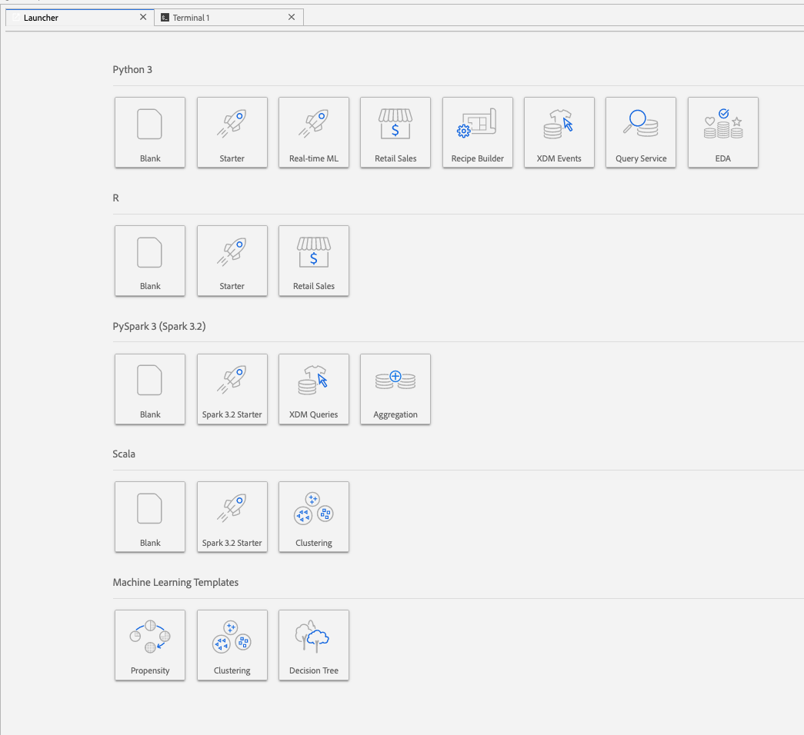
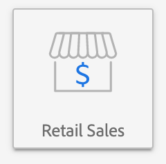

# Analizzare i dati utilizzando i notebook

Questo tutorial si concentra su come utilizzare Jupyter Notebooks, integrato in Data Science Workspace, per accedere, esplorare e visualizzare i tuoi dati. Al termine di questa esercitazione, avrai acquisito una conoscenza di alcune delle funzioni offerte da Jupyter Notebooks per comprendere meglio i tuoi dati.

Sono introdotti i seguenti concetti:

- **[!DNL JupyterLab]:** [[!DNL JupyterLab]](https://blog.jupyter.org/jupyterlab-is-ready-for-users-5a6f039b8906) è l’interfaccia web di nuova generazione per Project Jupyter ed è strettamente integrata in [!DNL Adobe Experience Platform].
- **Batch:** I set di dati sono costituiti da batch. Un batch è un insieme di dati raccolti in un periodo di tempo ed elaborati insieme come una singola unità. Quando i dati vengono aggiunti a un set di dati vengono creati nuovi batch.
- **SDK di accesso ai dati (obsoleto):** L’SDK di accesso ai dati è ora obsoleto. Utilizza il [[!DNL Platform SDK]](../authoring/platform-sdk.md) guida.

## Esplorare i notebook in Data Science Workspace

In questa sezione vengono esaminati i dati precedentemente acquisiti nello schema di vendita al dettaglio.

Data Science Workspace consente di creare [!DNL Jupyter Notebooks] tramite [!DNL JupyterLab] piattaforma in cui possono creare e modificare flussi di lavoro di apprendimento automatico. [!DNL JupyterLab] è uno strumento di collaborazione server-client che consente agli utenti di modificare i documenti del blocco appunti tramite un browser Web. Questi blocchi appunti possono contenere sia codice eseguibile che elementi in formato Rich Text. Ai nostri fini, utilizzeremo Markdown per la descrizione dell’analisi e l’eseguibile [!DNL Python] codice per eseguire l&#39;esplorazione e l&#39;analisi dei dati.

### Scegli il tuo workspace

All’avvio [!DNL JupyterLab], viene presentata un’interfaccia basata su web per Jupyter Notebooks. A seconda del tipo di notebook scelto, verrà avviato un kernel corrispondente.

Quando confrontiamo l’ambiente da utilizzare, dobbiamo tenere conto delle limitazioni di ciascun servizio. Ad esempio, se utilizziamo [panda](https://pandas.pydata.org/) libreria con [!DNL Python], in quanto utente normale, il limite di RAM è di 2 GB. Anche in qualità di utente avanzato, il limite massimo è di 20 GB di RAM. Se si tratta di calcoli più grandi, avrebbe senso utilizzare [!DNL Spark] che offre 1,5 TB condivisi con tutte le istanze del notebook.

Per impostazione predefinita, la ricetta Tensorflow funziona in un cluster GPU e Python viene eseguito all’interno di un cluster CPU.

### Crea un nuovo blocco appunti

In [!DNL Adobe Experience Platform] UI, seleziona [!UICONTROL Data Science] nel menu principale per passare a Data Science Workspace. Da questa pagina, seleziona [!DNL JupyterLab] per aprire [!DNL JupyterLab] modulo di avvio. Dovresti visualizzare una pagina simile a questa.



Nel nostro tutorial, utilizzeremo [!DNL Python] 3 nel Jupyter Notebook per mostrare come accedere ed esplorare i dati. Nella pagina di avvio sono disponibili blocchi appunti di esempio. Utilizzeremo la ricetta di vendita al dettaglio per [!DNL Python] 3.



La ricetta Vendite al dettaglio è un esempio indipendente che utilizza lo stesso set di dati Vendite al dettaglio per mostrare come i dati possono essere esplorati e visualizzati in Jupyter Notebook. Inoltre, il notebook è ulteriormente approfondito con l&#39;addestramento e la verifica. Ulteriori informazioni su questo blocco appunti specifico sono disponibili in questo [procedura dettagliata](../walkthrough.md).

### Accedere ai dati

>[!NOTE]
>
>Il `data_access_sdk_python` è obsoleto e non è più consigliato. Consulta la sezione [conversione dell’SDK per l’accesso ai dati in SDK per piattaforma](../authoring/platform-sdk.md) esercitazione per convertire il codice. Per questa esercitazione valgono ancora gli stessi passaggi indicati di seguito.

Passeremo all’accesso ai dati internamente da [!DNL Adobe Experience Platform] e dati esterni. Utilizzeremo `data_access_sdk_python` per accedere a dati interni come set di dati e schemi XDM. Per i dati esterni, utilizzeremo i panda [!DNL Python] libreria.

#### Dati esterni

Con il blocco appunti Retail Sales aperto, trovare l&#39;intestazione &quot;Load Data&quot;. I seguenti elementi [!DNL Python] il codice utilizza i panda&#39; `DataFrame` struttura dei dati e [read_csv()](https://pandas.pydata.org/pandas-docs/stable/generated/pandas.read_csv.html#pandas.read_csv) funzione per leggere il file CSV in hosting su [!DNL Github] nel DataFrame:


La struttura dati DataFrame di Pandas è una struttura di dati etichettata bidimensionale. Per vedere rapidamente le dimensioni dei nostri dati, possiamo utilizzare `df.shape`. Restituisce una tupla che rappresenta la dimensionalità del DataFrame:


Infine, possiamo dare un&#39;occhiata all&#39;aspetto dei nostri dati. Possiamo utilizzare `df.head(n)` per visualizzare il primo `n` righe del DataFrame:


#### [!DNL Experience Platform] dati

Ora, si passa all’accesso [!DNL Experience Platform] dati.

##### Per ID set di dati

Per questa sezione viene utilizzato il set di dati Vendite al dettaglio, che è lo stesso set di dati utilizzato nel blocco appunti di esempio Vendite al dettaglio.

In Jupyter Notebook, puoi accedere ai tuoi dati dal **Dati** scheda  a sinistra. Selezionando la scheda, vengono fornite due cartelle. Seleziona la **[!UICONTROL Set di dati]** cartella.


Ora nella directory Set di dati puoi visualizzare tutti i set di dati acquisiti. Se la directory è densamente popolata da set di dati, il caricamento di tutte le voci potrebbe richiedere un minuto.

Poiché il set di dati è lo stesso, vogliamo sostituire i dati di caricamento della sezione precedente che utilizza dati esterni. Seleziona il blocco di codice in **Carica dati** e premere il tasto **&#39;d&#39;** due volte. Assicurati che lo stato attivo sia sul blocco e non nel testo. È possibile premere **&#39;esc&#39;** per svuotare lo stato attivo del testo prima di premere **&#39;d&#39;** due volte.

Ora, possiamo fare clic con il pulsante destro del mouse sulla `Retail-Training-<your-alias>` e seleziona l’opzione &quot;Esplora dati nel notebook&quot; nel menu a discesa. Nel blocco appunti verrà visualizzata una voce di codice eseguibile.

>[!TIP]
>
>Consulta la sezione [[!DNL Platform SDK]](../authoring/platform-sdk.md) per convertire il codice.

```PYTHON
from data_access_sdk_python.reader import DataSetReader
from datetime import date
reader = DataSetReader()
df = reader.load(data_set_id="xxxxxxxx", ims_org="xxxxxxxx@AdobeOrg")
df.head()
```

Se si lavora su kernel diversi da [!DNL Python], consultare [questa pagina](https://github.com/adobe/acp-data-services-dsw-reference/wiki/Accessing-Data-on-the-Platform) per accedere ai dati su [!DNL Adobe Experience Platform].

Se si seleziona la cella eseguibile e si preme il pulsante di riproduzione nella barra degli strumenti, verrà eseguito il codice eseguibile. L’output per `head()` sarà una tabella con le chiavi del set di dati come colonne e le prime n righe nel set di dati. `head()` accetta un argomento numero intero per specificare il numero di righe da restituire. Per impostazione predefinita è 5.


Se si riavvia il kernel e si eseguono di nuovo tutte le celle, si dovrebbero ottenere gli stessi output di prima.


### Esplora i tuoi dati

Ora che possiamo accedere ai tuoi dati, concentriamoci sui dati stessi utilizzando statistiche e visualizzazioni. Il set di dati che utilizziamo è un set di dati di vendita al dettaglio che fornisce informazioni varie su 45 diversi negozi in un dato giorno. Alcune caratteristiche per un dato `date` e `store` includi quanto segue:
- `storeType`
- `weeklySales`
- `storeSize`
- `temperature`
- `regionalFuelPrice`
- `markDown`
- `cpi`
- `unemployment`
- `isHoliday`

#### Riepilogo statistico

Possiamo sfruttare [!DNL Python's] libreria panda per ottenere il tipo di dati di ciascun attributo. L’output della chiamata seguente fornirà informazioni sul numero di voci e sul tipo di dati per ciascuna colonna:

```PYTHON
df.info()
```


Queste informazioni sono utili in quanto conoscere il tipo di dati di ciascuna colonna ci consentirà di sapere come trattare i dati.

Vediamo ora il riepilogo statistico. Verranno visualizzati solo i tipi di dati numerici, quindi `date`, `storeType`, e `isHoliday` non verrà restituito:

```PYTHON
df.describe()
```


Con questo, possiamo vedere che ci sono 6435 istanze per ogni caratteristica. Vengono inoltre fornite informazioni statistiche quali media, deviazione standard (std), min, max e interquartili. Questo ci fornisce informazioni sulla deviazione per i dati. Nella prossima sezione presenteremo la visualizzazione che funziona insieme a queste informazioni per consentirci di comprendere bene i nostri dati.

Esaminare i valori minimo e massimo per `store`Inoltre, possiamo vedere che ci sono 45 archivi univoci che i dati rappresentano. Sono inoltre disponibili `storeTypes` che differenziano la funzione di un negozio. La distribuzione di `storeTypes` effettuando le seguenti operazioni:


Ciò significa che 22 negozi sono `storeType` `A`, 17 sono `storeType` `B`, e 6 sono `storeType` `C`.

#### Visualizzazione dati

Ora che conosciamo i valori dei nostri frame di dati, vogliamo integrarli con le visualizzazioni per rendere le cose più chiare e più facili da identificare. I grafici sono utili anche per trasmettere i risultati a un pubblico. Alcuni [!DNL Python] le librerie utili per la visualizzazione includono:
- [Matplotlib](https://matplotlib.org/)
- [panda](https://pandas.pydata.org/)
- [mare](https://seaborn.pydata.org/)
- [ggplot](https://ggplot2.tidyverse.org/)

In questa sezione presenteremo rapidamente alcuni vantaggi relativi all’utilizzo di ogni libreria.

[Matplotlib](https://matplotlib.org/) è il più vecchio [!DNL Python] pacchetto di visualizzazione. Il loro obiettivo è quello di rendere &quot;le cose facili e difficili possibili&quot;. Questo tende ad essere vero in quanto il pacchetto è estremamente potente, ma è anche dotato di complessità. Non è sempre facile ottenere un grafico dall’aspetto ragionevole senza richiedere molto tempo e fatica.

[Panda](https://pandas.pydata.org/) viene utilizzato principalmente per l&#39;oggetto DataFrame che consente la manipolazione dei dati con l&#39;indicizzazione integrata. Tuttavia, i panda includono anche una funzionalità di plottaggio incorporata basata su matplotlib.

[mare](https://seaborn.pydata.org/) è una build del pacchetto sopra matplotlib. Il suo obiettivo principale è quello di rendere i grafici predefiniti più accattivanti dal punto di vista visivo e semplificare la creazione di grafici complessi.

[ggplot](https://ggplot2.tidyverse.org/) è un pacchetto costruito anche sopra matplotlib. Tuttavia la differenza principale è che l&#39;utensile è una porta di ggplot2 per R. Simile al seaborn, l&#39;obiettivo è quello di migliorare su matplotlib. Gli utenti che hanno familiarità con ggplot2 for R devono considerare questa libreria.


##### Univariati, grafici

I grafici univariati sono grafici di una singola variabile. Un comune grafico univariato viene utilizzato per visualizzare i dati sotto forma di grafico a scatola e sussurro.

Utilizzando i nostri set di dati di vendita al dettaglio precedenti, possiamo generare il box e il whisker plot per ciascuno dei 45 negozi e le loro vendite settimanali. Il plottaggio viene generato utilizzando `seaborn.boxplot` funzione.


Per mostrare la distribuzione dei dati viene utilizzato un grafico a scatola e a baffi. Le linee esterne del plottaggio mostrano i quartili superiore e inferiore, mentre la casella si estende sull&#39;intervallo interquartile. La riga nella casella contrassegna la mediana. Tutti i punti di dati superiori a 1,5 volte il quartile superiore o inferiore sono contrassegnati da un cerchio. Questi punti sono considerati valori anomali.

##### Grafici multivariati

I grafici multivariati vengono utilizzati per visualizzare l’interazione tra le variabili. Con la visualizzazione, i data scientist possono vedere se ci sono correlazioni o pattern tra le variabili. Un comune grafo multivariato utilizzato è una matrice di correlazione. Con una matrice di correlazione, le dipendenze tra più variabili sono quantificate con il coefficiente di correlazione.

Utilizzando lo stesso set di dati di vendita al dettaglio, possiamo generare la matrice di correlazione.


Osservate la diagonale di 1 in basso rispetto al centro. Questo mostra che quando si confronta una variabile con se stessa, ha una correlazione positiva completa. Una correlazione positiva forte avrà una magnitudine più vicina a 1, mentre le correlazioni deboli saranno più vicine a 0. Viene mostrata una correlazione negativa con un coefficiente negativo che mostra una tendenza inversa.


## Passaggi successivi

Questo tutorial illustra come creare un nuovo blocco appunti Jupyter in Data Science Workspace e come accedere ai dati sia esternamente che da [!DNL Adobe Experience Platform]. Nello specifico, abbiamo esaminato i seguenti passaggi:
- Crea un nuovo Jupyter Notebook
- Accedere a set di dati e schemi
- Esplora i set di dati

Ora puoi passare alla sezione [sezione successiva](../models-recipes/package-source-files-recipe.md) creare un pacchetto di una ricetta e importarlo in Data Science Workspace.
