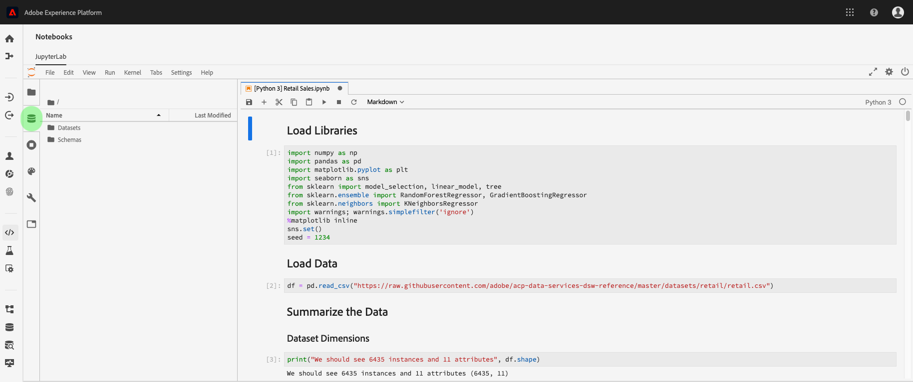

# Analizzare i dati utilizzando i notebook

Questa esercitazione si concentra sull&#39;utilizzo dei notebook Jupyter, creati all&#39;interno di Data Science Workspace, per accedere, esplorare e visualizzare i dati. Al termine di questa esercitazione, è necessario conoscere alcune delle funzioni offerte dai notebook Jupyter per comprendere meglio i dati.

Vengono introdotti i seguenti concetti:

- **[!DNL JupyterLab]:**[!DNL JupyterLab](https://blog.jupyter.org/jupyterlab-is-ready-for-users-5a6f039b8906)è l&#39;interfaccia Web di nuova generazione per Project Jupyter ed è strettamente integrata in[!DNL Adobe Experience Platform].
- **Batch:** I set di dati sono costituiti da batch. Un batch è un insieme di dati raccolti in un periodo di tempo ed elaborati insieme come un&#39;unica unità. Vengono creati nuovi batch quando i dati vengono aggiunti a un dataset.
- **SDK accesso ai dati (obsoleto):** L&#39;SDK per l&#39;accesso ai dati ora è obsoleto. Per favore, usi la [!DNL Platform SDK](../authoring/platform-sdk.md) guida.

## Esplora i notebook in Data Science Workspace

In questa sezione, vengono esaminati i dati precedentemente acquisiti nello schema di vendita al dettaglio.

Data Science Workspace consente agli utenti di creare [!DNL Jupyter Notebooks] attraverso la [!DNL JupyterLab] piattaforma in cui possono creare e modificare flussi di lavoro di apprendimento automatico. [!DNL JupyterLab] è uno strumento di collaborazione server-client che consente agli utenti di modificare i documenti del blocco appunti tramite un browser Web. Questi blocchi appunti possono contenere sia codice eseguibile che elementi RTF. Per i nostri scopi, utilizzeremo Markdown per la descrizione dell&#39;analisi e [!DNL Python] il codice eseguibile per eseguire l&#39;esplorazione e l&#39;analisi dei dati.

### Scegliere l&#39;area di lavoro

Al momento del lancio [!DNL JupyterLab], viene presentata un&#39;interfaccia basata sul Web per i notebook Jupyter. A seconda del tipo di notebook scelto, verrà avviato un kernel corrispondente.

Quando confrontiamo l&#39;ambiente da utilizzare, dobbiamo considerare i limiti di ogni servizio. Ad esempio, se utilizziamo la libreria [panda](https://pandas.pydata.org/) con [!DNL Python], come utente normale il limite di RAM è di 2 GB. Anche in quanto utenti di alimentazione, saremmo limitati a 20 GB di RAM. Se si tratta di calcoli più grandi, avrebbe senso utilizzare [!DNL Spark] che offre 1,5 TB condivisi con tutte le istanze del blocco appunti.

Per impostazione predefinita, la ricetta Tensorflow funziona in un cluster GPU e Python viene eseguita all&#39;interno di un cluster CPU.

### Creare un nuovo blocco appunti

Nell&#39; [!DNL Adobe Experience Platform] interfaccia utente, fai clic sulla scheda Data Science nel menu principale per passare all&#39;area di lavoro Data Science. Da questa pagina, fare clic sulla [!DNL JupyterLab] scheda che aprirà il [!DNL JupyterLab] modulo di avvio. Dovrebbe essere visualizzata una pagina simile a questa.


Nella nostra esercitazione, useremo [!DNL Python] 3 nel notebook Jupyter per mostrare come accedere ed esplorare i dati. Nella pagina Launcher sono disponibili alcuni quaderni appunti di esempio. Utilizzeremo la ricetta Vendite al dettaglio per [!DNL Python] 3.


La ricetta Vendite al dettaglio è un esempio standalone che utilizza lo stesso dataset Vendite al dettaglio per mostrare come i dati possono essere esplorati e visualizzati nel blocco appunti Jupyter. Inoltre, il notebook si approfondisce con formazione e verifica. Ulteriori informazioni su questo blocco appunti specifico sono disponibili in questa [procedura dettagliata](../walkthrough.md).

### Dati di accesso

>[!NOTE]
>
>L&#39; `data_access_sdk_python` oggetto è obsoleto e non è più consigliato. Per convertire il codice, fai riferimento all’esercitazione sulla [conversione dell’SDK per l’accesso ai dati in Platform SDK](../authoring/platform-sdk.md) . Per questa esercitazione si applicano gli stessi passaggi indicati di seguito.

Verranno analizzati l&#39;accesso ai dati internamente da [!DNL Adobe Experience Platform] e all&#39;esterno. Utilizzeremo la `data_access_sdk_python` libreria per accedere ai dati interni, ad esempio set di dati e schemi XDM. Per i dati esterni, utilizzeremo la [!DNL Python] libreria panda.

#### Dati esterni

Con il blocco appunti Vendite al dettaglio aperto, trovate l&#39;intestazione &quot;Carica dati&quot;. Il [!DNL Python] codice seguente utilizza la struttura dei `DataFrame` dati dei panda e la funzione [read_csv()](https://pandas.pydata.org/pandas-docs/stable/generated/pandas.read_csv.html#pandas.read_csv) per leggere il CSV ospitato [!DNL Github] nel DataFrame:


La struttura dati DataFrame dei panda è una struttura dati con etichetta bidimensionale. Per vedere rapidamente le dimensioni dei nostri dati, possiamo usare il `df.shape`. Questo restituisce un tupla che rappresenta la dimensione del DataFrame:


Infine, possiamo dare un&#39;occhiata a come sono fatti i nostri dati. È possibile utilizzare `df.head(n)` per visualizzare le prime `n` righe del DataFrame:


#### [!DNL Experience Platform] data

Ora, passeremo oltre i [!DNL Experience Platform] dati di accesso.

##### Per ID set di dati

Per questa sezione, utilizziamo il set di dati Vendite al dettaglio, che è lo stesso set di dati utilizzato nel blocco appunti di esempio Vendite al dettaglio.

Nel nostro Jupyter Notebook, possiamo accedere ai nostri dati dalla scheda **Dati** a sinistra. Facendo clic sulla scheda, sarà possibile visualizzare un elenco dei set di dati.



Ora nella directory Dataset saremo in grado di visualizzare tutti i set di dati acquisiti. Se la directory contiene numerosi set di dati, il caricamento di tutte le voci potrebbe richiedere alcuni minuti.

Poiché il set di dati è lo stesso, si desidera sostituire i dati di caricamento della sezione precedente che utilizza dati esterni. Selezionare il blocco di codice in **Carica dati** e premere due volte il tasto **d&#39;** sulla tastiera. Assicurarsi che il blocco sia attivo e non nel testo. È possibile premere **esc&#39;** per sfuggire all&#39;attivazione del testo prima di premere **d&#39;** due volte.

Ora, possiamo fare clic con il pulsante destro del mouse sul `Retail-Training-<your-alias>` set di dati e selezionare l&#39;opzione &quot;Esplora dati nel blocco appunti&quot; nel menu a discesa. Nel blocco appunti verrà visualizzata una voce di codice eseguibile.

>[!TIP]
>
>fare riferimento alla [!DNL Platform SDK](../authoring/platform-sdk.md) guida per convertire il codice.

```PYTHON
from data_access_sdk_python.reader import DataSetReader
from datetime import date
reader = DataSetReader()
df = reader.load(data_set_id="xxxxxxxx", ims_org="xxxxxxxx@AdobeOrg")
df.head()
```

Se lavori su altri kernel diversi da [!DNL Python], fai riferimento a [questa pagina](https://github.com/adobe/acp-data-services-dsw-reference/wiki/Accessing-Data-on-the-Platform) per accedere ai dati sul [!DNL Adobe Experience Platform].

Se si seleziona la cella eseguibile e si preme il pulsante di riproduzione nella barra degli strumenti, verrà eseguito il codice eseguibile. L&#39;output per `head()` sarà una tabella con le chiavi del dataset come colonne e le prime n righe nel dataset. `head()` accetta un argomento integer per specificare il numero di righe da restituire. Per impostazione predefinita, è 5.


Se si riavvia il kernel ed esegui di nuovo tutte le celle, si dovrebbero ottenere gli stessi output di prima.


### Esplorazione dei dati

Ora che possiamo accedere ai tuoi dati, concentriamoci sui dati stessi utilizzando statistiche e visualizzazione. L&#39;insieme di dati che usiamo è un set di dati per la vendita al dettaglio che fornisce informazioni varie su 45 diversi punti vendita in un dato giorno. Alcune caratteristiche per una data `date` e `store` includono quanto segue:
- `storeType`
- `weeklySales`
- `storeSize`
- `temperature`
- `regionalFuelPrice`
- `markDown`
- `cpi`
- `unemployment`
- `isHoliday`

#### Riepilogo statistico

Possiamo sfruttare la libreria [!DNL Python's] panda per ottenere il tipo di dati di ciascun attributo. L&#39;output della seguente chiamata fornisce informazioni sul numero di voci e sul tipo di dati per ciascuna colonna:

```PYTHON
df.info()
```


Questa informazione è utile perché conoscere il tipo di dati per ogni colonna ci permetterà di sapere come trattare i dati.

Guardiamo ora il riepilogo statistico. Vengono visualizzati solo i tipi di dati numerici, quindi `date`, `storeType`, e `isHoliday` non vengono generati:

```PYTHON
df.describe()
```


Con questo, possiamo vedere che ci sono 6435 istanze per ogni caratteristica. Inoltre, vengono fornite informazioni statistiche quali media, deviazione standard (std), min, max e interquartili. Questo ci dà informazioni sulla deviazione per i dati. Nella sezione successiva, passeremo alla visualizzazione che funziona insieme a queste informazioni per darci una buona comprensione dei nostri dati.

Osservando i valori minimo e massimo per `store`, possiamo vedere che ci sono 45 archivi univoci che i dati rappresentano. Ci sono anche `storeTypes` che differenziano quello che è un negozio. Possiamo vedere la distribuzione di `storeTypes` facendo quanto segue:


Ciò significa che 22 negozi sono di `storeType` , 17 sono `A``storeType` e 6 sono `B``storeType` `C`.

#### Visualizzazione dati

Ora che conosciamo i nostri valori di frame dei dati, vogliamo completarli con visualizzazioni per rendere le cose più chiare e più facili da identificare. I grafici sono utili anche per trasmettere i risultati a un pubblico. Alcune [!DNL Python] librerie utili per la visualizzazione includono:
- [Matplotlib](https://matplotlib.org/)
- [panda](https://pandas.pydata.org/)
- [marinaio](https://seaborn.pydata.org/)
- [ggplot](https://ggplot2.tidyverse.org/)

In questa sezione presenteremo rapidamente alcuni vantaggi per l&#39;utilizzo di ciascuna libreria.

[Matplotlib](https://matplotlib.org/) è il pacchetto di [!DNL Python] visualizzazione più vecchio. L&#39;obiettivo è quello di &quot;rendere le cose facili e difficili possibili&quot;. Questo tende ad essere vero in quanto il pacchetto è estremamente potente, ma viene anche con la complessità. Non è sempre facile ottenere un grafico dall&#39;aspetto ragionevole senza dedicare molto tempo e fatica.

[I panda](https://pandas.pydata.org/) vengono utilizzati principalmente per l&#39;oggetto DataFrame che consente la manipolazione dei dati con indicizzazione integrata. Tuttavia, i panda includono anche una funzionalità di stampa integrata basata su matplotlib.

[seaborn](https://seaborn.pydata.org/) è un pacchetto creato sopra a matplotlib. Il suo obiettivo principale è rendere i grafici predefiniti più visivamente accattivanti e semplificare la creazione di grafici complicati.

[ggplot](https://ggplot2.tidyverse.org/) è un pacchetto anch&#39;esso basato su matplotlib. Tuttavia la differenza principale è che lo strumento è una porta di ggplot2 per R. Come per il mare, l&#39;obiettivo è quello di migliorare su matplotlib. Gli utenti che hanno familiarità con gplot2 per R devono considerare questa libreria.


##### Grafici univoci

I grafici univoci sono grafici di una singola variabile. Un grafico universale comune è usato per visualizzare i dati è la trama scatola e sussurro.

Utilizzando il nostro set di dati per la vendita al dettaglio da prima, possiamo generare il grafico box e whisker per ciascuno dei 45 negozi e le loro vendite settimanali. Il grafico viene generato utilizzando la `seaborn.boxplot` funzione.


Una trama scatola e sussurro è usato per mostrare la distribuzione dei dati. Le linee esterne della trama mostrano i quartili superiore e inferiore, mentre la scatola si estende per l&#39;intervallo interquartile. La linea nella casella indica la mediana. I punti di dati più di 1,5 volte il quartile superiore o inferiore sono contrassegnati come un cerchio. Questi punti sono considerati fuorvianti.

##### Grafici multivariati

I grafici multivariati sono utilizzati per visualizzare l&#39;interazione tra le variabili. Con la visualizzazione, gli esperti di dati possono verificare se esistono correlazioni o pattern tra le variabili. Un grafico multivariato comune usato è una matrice di correlazione. Con una matrice di correlazione, le dipendenze tra più variabili vengono quantificate con il coefficiente di correlazione.

Utilizzando lo stesso dataset per la vendita al dettaglio, possiamo generare la matrice di correlazione.


Osservate la diagonale di 1 in basso al centro. Questo indica che quando confronta una variabile con se stessa, ha una correlazione positiva completa. Una forte correlazione positiva avrà una grandezza più vicina a 1, mentre le correlazioni deboli saranno più vicine a 0. La correlazione negativa è mostrata con un coefficiente negativo che mostra una tendenza inversa.


## Passaggi successivi

Questa esercitazione spiega come creare un nuovo notebook Jupyter in Data Science Workspace e come accedere ai dati sia esternamente che da [!DNL Adobe Experience Platform]. In particolare, abbiamo eseguito i seguenti passaggi:
- Creare un nuovo blocco appunti Jupyter
- Accesso a dataset e schemi
- Esplora set di dati

Ora puoi passare alla sezione [successiva](../models-recipes/package-source-files-recipe.md) per creare un pacchetto di ricette e importarle in Data Science Workspace.