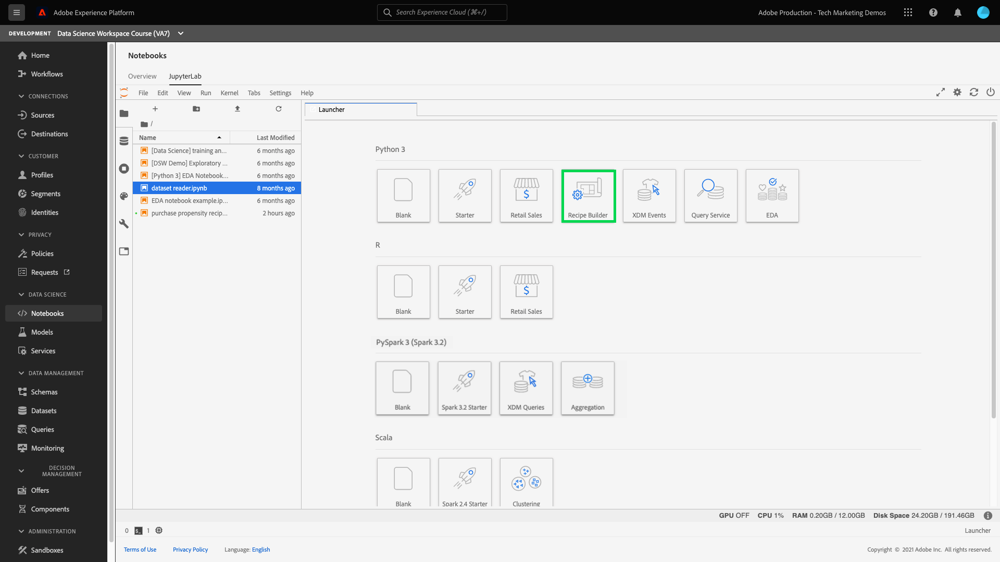

# Creare un modello utilizzando i notebook JupyterLab

Questa esercitazione illustra i passaggi necessari per creare un modello utilizzando il modello di generazione delle ricette per i notebook JupyterLab.

## Concetti presentati:

- **Ricette:** Una ricetta è un termine Adobe per una specifica di modello ed è un contenitore principale che rappresenta uno specifico apprendimento automatico, un algoritmo AI o un insieme di algoritmi, logica di elaborazione e configurazione necessari per creare ed eseguire un modello addestrato.
- **Modello:** Un modello è un&#39;istanza di una ricetta di apprendimento automatico formata utilizzando dati storici e configurazioni per risolvere un caso d&#39;uso aziendale.
- **Formazione:** La formazione è il processo di apprendimento di schemi e insights dai dati etichettati.
- **Punteggio:** Il punteggio è il processo di generazione di informazioni dai dati utilizzando un modello qualificato.

## Scarica le risorse richieste {#assets}

Prima di procedere con questa esercitazione, devi creare gli schemi e i set di dati richiesti. Visita il tutorial per [creazione di schemi e set di dati del modello di propensione Luma](../models-recipes/create-luma-data.md) per scaricare le risorse richieste e impostare i prerequisiti.

## Introduzione al [!DNL JupyterLab] ambiente notebook

La creazione di una ricetta da zero può essere fatta in [!DNL Data Science Workspace]. Per iniziare, passa a [Adobe Experience Platform](https://platform.adobe.com) e seleziona la **[!UICONTROL Notebook]** a sinistra. Per creare un nuovo blocco appunti, selezionare il modello di Generatore di ricette dal [!DNL JupyterLab Launcher].

La [!UICONTROL Generatore di ricette] il notebook consente di eseguire operazioni di formazione e valutazione all&#39;interno del blocco appunti. Ciò offre la flessibilità di apportare modifiche alle `train()` e `score()` metodi tra l’esecuzione di esperimenti sui dati di formazione e valutazione. Una volta soddisfatti i risultati della formazione e del punteggio, è possibile creare una ricetta e pubblicarla come modello utilizzando la ricetta per la funzionalità del modello.

>[!NOTE]
>
>La [!UICONTROL Generatore di ricette] il notebook supporta l&#39;utilizzo di tutti i formati di file, ma attualmente la funzionalità crea ricetta supporta solo [!DNL Python].



Quando selezioni la [!UICONTROL Generatore di ricette] blocco appunti dal modulo di avvio, il blocco appunti viene aperto in una nuova scheda.

Nella nuova scheda del blocco appunti nella parte superiore, viene caricata una barra degli strumenti contenente tre azioni aggiuntive: **[!UICONTROL Treno]**, **[!UICONTROL Punteggio]** e **[!UICONTROL Crea ricetta]**. Queste icone vengono visualizzate solo nel [!UICONTROL Generatore di ricette] blocco appunti. Vengono fornite ulteriori informazioni su queste azioni [nella sezione formazione e valutazione](#training-and-scoring) dopo aver creato la Ricetta nel blocco appunti.


## Introduzione al [!UICONTROL Generatore di ricette] blocco

Nella cartella delle risorse fornita è presente un modello di propensione Luma `propensity_model.ipynb`. Utilizzando l&#39;opzione di caricamento del blocco appunti in JupyterLab, carica il modello fornito e apri il blocco appunti.


Il resto di questa esercitazione copre i seguenti file predefiniti nel blocco appunti del modello di propensione:

- [File dei requisiti](#requirements-file)
- [File di configurazione](#configuration-files)
- [Caricatore dati di formazione](#training-data-loader)
- [Caricatore dati di valutazione](#scoring-data-loader)
- [File di tubazione](#pipeline-file)
- [File valutatore](#evaluator-file)
- [File di Data Saver](#data-saver-file)

Il seguente video tutorial spiega il blocco appunti del modello di propensione Luma:

>[!VIDEO](https://video.tv.adobe.com/v/333570)

### File dei requisiti {#requirements-file}

Il file dei requisiti viene utilizzato per dichiarare librerie aggiuntive da utilizzare nel modello. Se esiste una dipendenza, è possibile specificare il numero di versione. Per cercare librerie aggiuntive, visita [anaconda.org](https://anaconda.org). Per informazioni su come formattare il file dei requisiti, visita [Conda](https://docs.conda.io/projects/conda/en/latest/user-guide/tasks/manage-environments.html#creating-an-environment-file-manually). L’elenco delle librerie principali già in uso include:

```JSON
python=3.6.7
scikit-learn
pandas
numpy
data_access_sdk_python
```

>[!NOTE]
>
>Le librerie o le versioni specifiche aggiunte potrebbero essere incompatibili con le librerie di cui sopra. Inoltre, se scegli di creare manualmente un file di ambiente, la `name` impossibile ignorare il campo.

Per il blocco appunti del modello di propensione Luma, non è necessario aggiornare i requisiti.

### File di configurazione {#configuration-files}

I file di configurazione, `training.conf` e `scoring.conf`, vengono utilizzati per specificare i set di dati da utilizzare per la formazione e il punteggio, nonché per aggiungere parametri ipertestuali. Sono disponibili configurazioni separate per la formazione e il punteggio.

Affinché un modello esegua un corso di formazione, è necessario fornire `trainingDataSetId`, `ACP_DSW_TRAINING_XDM_SCHEMA`e `tenantId`. Inoltre, per ottenere il punteggio, devi fornire `scoringDataSetId`, `tenantId`e `scoringResultsDataSetId `.

Per trovare il set di dati e gli ID dello schema, vai alla scheda dati  nei blocchi appunti sulla barra di navigazione a sinistra (sotto l&#39;icona della cartella). È necessario fornire tre ID di set di dati diversi. La `scoringResultsDataSetId` viene utilizzato per memorizzare i risultati del punteggio del modello e deve essere un set di dati vuoto. Questi set di dati sono stati creati in precedenza in [Risorse necessarie](#assets) passo.


Le stesse informazioni sono disponibili su [Adobe Experience Platform](https://platform.adobe.com/) in **[Schema](https://platform.adobe.com/schema)** e **[Set di dati](https://platform.adobe.com/dataset/overview)** schede.

Una volta completata la concorrenza, la configurazione di formazione e punteggio deve essere simile alla seguente schermata:


Per impostazione predefinita, i seguenti parametri di configurazione vengono impostati automaticamente quando si addestrano e si assegnano i dati di punteggio:

- `ML_FRAMEWORK_IMS_USER_CLIENT_ID`
- `ML_FRAMEWORK_IMS_TOKEN`
- `ML_FRAMEWORK_IMS_ML_TOKEN`
- `ML_FRAMEWORK_IMS_TENANT_ID`

## Informazioni su Training Data Loader {#training-data-loader}

Lo scopo di Training Data Loader è quello di creare un&#39;istanza dei dati utilizzati per creare il modello di apprendimento automatico. In genere, esistono due attività eseguite dal caricatore dati di formazione:

- Caricamento dati da [!DNL Platform]
- Preparazione dei dati e ingegneria delle funzioni

Le due sezioni seguenti esamineranno il caricamento dei dati e la preparazione dei dati.

### Caricamento dei dati {#loading-data}

Questo passaggio utilizza [dataframe panda](https://pandas.pydata.org/pandas-docs/stable/generated/pandas.DataFrame.html). I dati possono essere caricati da file in [!DNL Adobe Experience Platform] utilizzando [!DNL Platform] SDK (`platform_sdk`) o da fonti esterne che utilizzano i panda `read_csv()` o `read_json()` funzioni.

- [[!DNL Platform SDK]](#platform-sdk)
- [Origini esterne](#external-sources)

>[!NOTE]
>
>Nel blocco appunti del Generatore di ricette, i dati vengono caricati tramite il `platform_sdk` caricatore dati.

### [!DNL Platform] SDK {#platform-sdk}

Per un&#39;esercitazione approfondita sull&#39;utilizzo di `platform_sdk` data loader, visitare il [Guida all’SDK per Platform](../authoring/platform-sdk.md). Questa esercitazione fornisce informazioni sull’autenticazione della build, sulla lettura di base dei dati e sulla scrittura di base dei dati.

### Origini esterne {#external-sources}

Questa sezione mostra come importare un file JSON o CSV in un oggetto panda. La documentazione ufficiale della biblioteca dei panda si trova qui:
- [read_csv](https://pandas.pydata.org/pandas-docs/stable/generated/pandas.read_csv.html)
- [read_json](https://pandas.pydata.org/pandas-docs/stable/generated/pandas.read_json.html)

Innanzitutto, ecco un esempio di importazione di un file CSV. La `data` argomento è il percorso del file CSV. Variabile importata dalla variabile `configProperties` in [sezione precedente](#configuration-files).

```PYTHON
df = pd.read_csv(data)
```

Puoi anche importare da un file JSON. La `data` argomento è il percorso del file CSV. Variabile importata dalla variabile `configProperties` in [sezione precedente](#configuration-files).

```PYTHON
df = pd.read_json(data)
```

Ora i dati si trovano nell’oggetto dataframe e possono essere analizzati e manipolati nel [sezione successiva](#data-preparation-and-feature-engineering).

## File di caricamento dati di formazione

In questo esempio, i dati vengono caricati utilizzando l’SDK di Platform. La libreria può essere importata nella parte superiore della pagina includendo la riga :

`from platform_sdk.dataset_reader import DatasetReader`

È quindi possibile utilizzare la `load()` per acquisire il set di dati di formazione dal `trainingDataSetId` come impostato nella configurazione (`recipe.conf`).

```PYTHON
def load(config_properties):
    print("Training Data Load Start")

    #########################################
    # Load Data
    #########################################    
    client_context = get_client_context(config_properties)
    dataset_reader = DatasetReader(client_context, dataset_id=config_properties['trainingDataSetId'])
```

>[!NOTE]
>
>Come indicato nella [Sezione File di configurazione](#configuration-files), i seguenti parametri di configurazione sono impostati per l&#39;utente quando si accede ai dati da Experience Platform utilizzando `client_context = get_client_context(config_properties)`:
> - `ML_FRAMEWORK_IMS_USER_CLIENT_ID`
> - `ML_FRAMEWORK_IMS_TOKEN`
> - `ML_FRAMEWORK_IMS_ML_TOKEN`
> - `ML_FRAMEWORK_IMS_TENANT_ID`


Ora che disponi dei tuoi dati, puoi iniziare con la preparazione dei dati e l&#39;ingegneria delle funzioni.

### Preparazione dei dati e ingegneria delle funzioni {#data-preparation-and-feature-engineering}

Una volta caricati i dati, questi devono essere puliti e sottoposti alla preparazione dei dati. In questo esempio, l&#39;obiettivo del modello è quello di prevedere se un cliente ordinerà o meno un prodotto. Poiché il modello non visualizza prodotti specifici, non è necessario `productListItems` e quindi la colonna viene eliminata. Vengono quindi eliminate ulteriori colonne che contengono solo un singolo valore o due valori in una singola colonna. Durante l&#39;addestramento di un modello, è importante conservare solo i dati utili che vi aiuteranno a prevedere il vostro obiettivo.


Una volta eliminati i dati superflui, puoi iniziare a progettare funzionalità. I dati demo utilizzati per questo esempio non contengono informazioni sulla sessione. Normalmente, si desidera disporre di dati sulle sessioni correnti e passate per un particolare cliente. A causa della mancanza di informazioni sulle sessioni, questo esempio imita invece le sessioni correnti e passate tramite la demarcazione del percorso.


Una volta completata la delimitazione, i dati vengono etichettati e viene creato un percorso.


Successivamente, le feature vengono create e suddivise in passato e presente. Quindi, tutte le colonne non necessarie vengono eliminate, lasciandoti con i percorsi passati e correnti per i clienti Luma. Questi percorsi contengono informazioni quali se un cliente ha acquistato un articolo e il percorso che ha preso prima dell&#39;acquisto.


## Caricatore dati di valutazione {#scoring-data-loader}

La procedura per caricare i dati per il punteggio è simile al caricamento dei dati di formazione. Osservando attentamente il codice, puoi vedere che tutto è lo stesso tranne che per il `scoringDataSetId` in `dataset_reader`. Questo perché la stessa origine dati Luma viene utilizzata sia per la formazione che per il punteggio.

Nel caso in cui si desideri utilizzare file di dati diversi per la formazione e il punteggio, il caricatore di dati di formazione e valutazione è separato. Ciò ti consente di eseguire ulteriori operazioni di pre-elaborazione, ad esempio la mappatura dei dati di formazione sui dati di valutazione, se necessario.

## File di tubazione {#pipeline-file}

La `pipeline.py` include la logica per la formazione e il punteggio.

Lo scopo della formazione è quello di creare un modello utilizzando caratteristiche ed etichette nel set di dati di formazione. Dopo aver scelto il modello di formazione, è necessario inserire il set di dati x e y di formazione nel modello e la funzione restituisce il modello addestrato.

>[!NOTE]
> 
>Le feature si riferiscono alla variabile di input utilizzata dal modello di apprendimento automatico per prevedere le etichette.


La `score()` La funzione deve contenere l&#39;algoritmo di punteggio e restituire una misurazione per indicare il successo del modello. La `score()` utilizza le etichette del set di dati di punteggio e il modello addestrato per generare un set di funzioni previste. Questi valori previsti vengono quindi confrontati con le funzioni effettive nel set di dati di punteggio. In questo esempio, la `score()` utilizza il modello addestrato per prevedere le feature utilizzando le etichette del set di dati di punteggio. Vengono restituite le funzionalità previste.


## File valutatore {#evaluator-file}

La `evaluator.py` Il file contiene la logica che indica come valutare la ricetta formata e come suddividere i dati di formazione.

### Dividere il set di dati {#split-the-dataset}

La fase di preparazione dei dati per la formazione richiede la suddivisione del set di dati da utilizzare per la formazione e il test. Questo `val` i dati vengono utilizzati in modo implicito per valutare il modello dopo l’addestramento. Questo processo è separato dal punteggio.

Questa sezione mostra `split()` funzione che carica i dati nel blocco appunti, quindi pulisce i dati rimuovendo le colonne non correlate nel set di dati. Da lì, è possibile eseguire l&#39;ingegneria delle funzioni, che è il processo per creare ulteriori caratteristiche rilevanti dalle caratteristiche non elaborate esistenti nei dati.


### Valutare il modello addestrato {#evaluate-the-trained-model}

La `evaluate()` viene eseguita dopo che il modello è stato addestrato e restituisce una metrica per indicare il successo del modello. La `evaluate()` utilizza le etichette del set di dati di prova e il modello addestrato per prevedere un set di funzioni. Questi valori previsti vengono quindi confrontati con le funzioni effettive nel set di dati di test. In questo esempio le metriche utilizzate sono `precision`, `recall`, `f1`e `accuracy`. Si noti che la funzione restituisce un `metric` oggetto contenente un array di metriche di valutazione. Queste metriche vengono utilizzate per valutare le prestazioni del modello addestrato.


Aggiunta `print(metric)` consente di visualizzare i risultati della metrica.


## File di Data Saver {#data-saver-file}

La `datasaver.py` il file contiene `save()` e viene utilizzato per salvare la previsione durante il test del punteggio. La `save()` prende la previsione e utilizza [!DNL Experience Platform Catalog] API, scrive i dati nel `scoringResultsDataSetId` hai specificato nel tuo `scoring.conf` file. È possibile


## Formazione e valutazione {#training-and-scoring}

Una volta apportate le modifiche al blocco appunti e desiderate addestrare la ricetta, è possibile selezionare i pulsanti associati nella parte superiore della barra per creare un percorso di formazione nella cella. Quando si seleziona il pulsante, nel blocco appunti viene visualizzato un registro di comandi e output dello script di addestramento (sotto il `evaluator.py` (cella). Conda prima installa tutte le dipendenze, poi viene avviato il training.

Tieni presente che è necessario eseguire il corso di formazione almeno una volta prima di poter eseguire il punteggio. Selezione della **[!UICONTROL Eseguire il punteggio]** Il pulsante eseguirà il punteggio sul modello addestrato generato durante l&#39;addestramento. Lo script di punteggio viene visualizzato in `datasaver.py`.

A scopo di debug, se desideri visualizzare l’output nascosto, aggiungi `debug` alla fine della cella di output e rieseguirla.


## Creare una ricetta {#create-recipe}

Dopo aver modificato la ricetta e aver ottenuto l&#39;output di formazione/punteggio, è possibile creare una ricetta dal blocco appunti selezionando **[!UICONTROL Crea ricetta]** in alto a destra.


Dopo aver selezionato **[!UICONTROL Crea ricetta]**, viene richiesto di immettere un nome per la ricetta. Questo nome rappresenta la ricetta effettiva creata in [!DNL Platform].


Dopo aver selezionato **[!UICONTROL Ok]**, inizia il processo di creazione delle ricette. Questo può richiedere un po&#39; di tempo e viene visualizzata una barra di avanzamento al posto del pulsante crea ricetta. Una volta completato, puoi selezionare il **[!UICONTROL Visualizza ricette]** per portarti al **[!UICONTROL Ricette]** scheda sotto **[!UICONTROL Modelli ML]**


>[!CAUTION]
>
> - Non eliminare nessuna delle celle del file
> - Non modificare il `%%writefile` riga nella parte superiore delle celle del file
> - Non creare ricette contemporaneamente in diversi notebook


## Passaggi successivi {#next-steps}

Completando questa esercitazione, hai imparato a creare un modello di apprendimento automatico nel [!UICONTROL Generatore di ricette] blocco appunti. Hai anche imparato a utilizzare il blocco appunti per creare un flusso di lavoro di ricetta.

Per continuare a imparare a utilizzare le risorse in [!DNL Data Science Workspace], visitare il [!DNL Data Science Workspace] menu a discesa ricette e modelli .