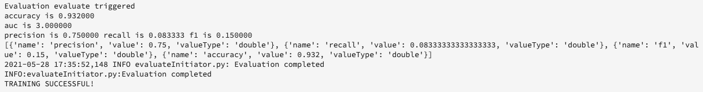

# Creare un modello utilizzando JupyterLab Notebooks

Questo tutorial illustra i passaggi necessari per creare un modello utilizzando il modello per la generazione di formule dei notebook JupyterLab.

## Concetti introdotti:

- **Ricette:** Una ricetta è il termine Adobe per una specifica di modello ed è un contenitore di livello superiore che rappresenta un apprendimento automatico specifico, un algoritmo di IA o un insieme di algoritmi, una logica di elaborazione e una configurazione necessari per generare ed eseguire un modello addestrato.
- **Modello:** Un modello è un&#39;istanza di una ricetta di apprendimento automatico che viene addestrata utilizzando dati storici e configurazioni da risolvere per un caso d&#39;uso aziendale.
- **Formazione:** La formazione è il processo di apprendimento dei pattern e delle informazioni dai dati etichettati.
- **Punteggio:** Il punteggio è il processo di generazione di informazioni dai dati utilizzando un modello addestrato.

## Scarica le risorse richieste {#assets}

Prima di procedere con questa esercitazione, è necessario creare gli schemi e i set di dati richiesti. Visita il tutorial per [creare schemi e set di dati del modello di propensione Luma](../models-recipes/create-luma-data.md) per scaricare le risorse richieste e impostare i prerequisiti.

## Introduzione all&#39;ambiente del blocco appunti [!DNL JupyterLab]

La creazione di una ricetta da zero può essere eseguita entro [!DNL Data Science Workspace]. Per iniziare, passa a [Adobe Experience Platform](https://platform.adobe.com) e seleziona la scheda **[!UICONTROL Blocchi appunti]** a sinistra. Per creare un nuovo blocco appunti, selezionare il modello di Generatore di ricette da [!DNL JupyterLab Launcher].

Il blocco appunti [!UICONTROL Generatore di ricette] consente di eseguire attività di formazione e punteggio all&#39;interno del blocco appunti. Questo offre la flessibilità di apportare modifiche ai metodi `train()` e `score()` tra l&#39;esecuzione di esperimenti sui dati di apprendimento e punteggio. Una volta soddisfatti dei risultati di formazione e punteggio, puoi creare una ricetta e pubblicarla ulteriormente come modello utilizzando la ricetta per modellare la funzionalità.

>[!NOTE]
>
>Il blocco appunti di [!UICONTROL Generatore di ricette] supporta l&#39;utilizzo di tutti i formati di file, ma attualmente la funzionalità di creazione di ricette supporta solo [!DNL Python].


Quando si seleziona il blocco appunti [!UICONTROL Generatore di ricette] dal modulo di avvio, il blocco appunti viene aperto in una nuova scheda.

Nella nuova scheda del blocco appunti nella parte superiore, viene caricata una barra degli strumenti contenente tre azioni aggiuntive: **[!UICONTROL Addestra]**, **[!UICONTROL Punteggio]** e **[!UICONTROL Crea ricetta]**. Queste icone vengono visualizzate solo nel blocco appunti [!UICONTROL Generatore di ricette]. Ulteriori informazioni su queste azioni sono fornite [nella sezione formazione e punteggio](#training-and-scoring) dopo aver creato la ricetta nel blocco appunti.


## Introduzione al blocco appunti [!UICONTROL Generatore di ricette]

Nella cartella delle risorse fornita è presente un modello di propensione Luma `propensity_model.ipynb`. Utilizzando l’opzione carica notebook in JupyterLab, carica il modello fornito e apri il notebook.


Il resto di questo tutorial riguarda i seguenti file predefiniti nel notebook del modello di propensione:

- [File dei requisiti](#requirements-file)
- [File di configurazione](#configuration-files)
- [Caricatore dati di formazione](#training-data-loader)
- [Caricatore dati punteggio](#scoring-data-loader)
- [File di pipeline](#pipeline-file)
- [File valutatore](#evaluator-file)
- [File di Data Saver](#data-saver-file)

Il seguente tutorial video spiega il notebook con modello di propensione Luma:

>[!VIDEO](https://video.tv.adobe.com/v/333570)

### File dei requisiti {#requirements-file}

Il file dei requisiti viene utilizzato per dichiarare librerie aggiuntive da utilizzare nel modello. Se esiste una dipendenza, puoi specificare il numero di versione. Per cercare altre librerie, visita [anaconda.org](https://anaconda.org). Per informazioni su come formattare il file dei requisiti, visitare [Conda](https://docs.conda.io/projects/conda/en/latest/user-guide/tasks/manage-environments.html#creating-an-environment-file-manually). L’elenco delle librerie principali già in uso include:

```JSON
python=3.6.7
scikit-learn
pandas
numpy
data_access_sdk_python
```

>[!NOTE]
>
>Le librerie o le versioni specifiche aggiunte potrebbero essere incompatibili con le librerie di cui sopra. Inoltre, se si sceglie di creare manualmente un file di ambiente, il campo `name` non può essere sostituito.

Per il notebook con propensione Luma, non è necessario aggiornare i requisiti.

### File di configurazione {#configuration-files}

I file di configurazione, `training.conf` e `scoring.conf`, vengono utilizzati per specificare i set di dati da utilizzare per l&#39;apprendimento e il punteggio e per aggiungere iperparametri. Esistono configurazioni separate per l’apprendimento e il punteggio.

Affinché un modello possa eseguire l&#39;apprendimento, è necessario fornire `trainingDataSetId`, `ACP_DSW_TRAINING_XDM_SCHEMA` e `tenantId`. Inoltre, per il punteggio, è necessario fornire `scoringDataSetId`, `tenantId` e `scoringResultsDataSetId `.

Per trovare il set di dati e gli ID dello schema, vai alla scheda dati  all&#39;interno dei blocchi appunti sulla barra di navigazione a sinistra (sotto l&#39;icona della cartella). È necessario fornire tre ID di set di dati diversi. `scoringResultsDataSetId` viene utilizzato per memorizzare i risultati del punteggio del modello e deve essere un set di dati vuoto. Questi set di dati sono stati creati in precedenza nel passaggio [Risorse richieste](#assets).


Le stesse informazioni sono disponibili in [Adobe Experience Platform](https://platform.adobe.com/) nelle schede **[Schema](https://platform.adobe.com/schema)** e **[Set di dati](https://platform.adobe.com/dataset/overview)**.

Al termine del concorso, la configurazione di apprendimento e punteggio dovrà essere simile alla schermata seguente:


Per impostazione predefinita, quando si addestrano e si assegnano punteggi ai dati vengono impostati i seguenti parametri di configurazione:

- `ML_FRAMEWORK_IMS_USER_CLIENT_ID`
- `ML_FRAMEWORK_IMS_TOKEN`
- `ML_FRAMEWORK_IMS_ML_TOKEN`
- `ML_FRAMEWORK_IMS_TENANT_ID`

## Informazioni su Training Data Loader {#training-data-loader}

Lo scopo del caricatore dati di formazione è quello di creare un’istanza dei dati utilizzati per creare il modello di apprendimento automatico. In genere, il caricatore di dati di formazione esegue due attività:

- Caricamento dati da [!DNL Platform]
- Preparazione dei dati e progettazione delle funzioni

Nelle due sezioni seguenti verranno descritti i passaggi necessari per caricare i dati e preparare i dati.

### Caricamento dei dati {#loading-data}

Questo passaggio utilizza il dataframe [panda](https://pandas.pydata.org/pandas-docs/stable/generated/pandas.DataFrame.html). I dati possono essere caricati dai file in [!DNL Adobe Experience Platform] utilizzando l&#39;SDK [!DNL Platform] (`platform_sdk`) o da origini esterne utilizzando le funzioni `read_csv()` o `read_json()` dei panda.

- [[!DNL Platform SDK]](#platform-sdk)
- [Sorgenti esterne](#external-sources)

>[!NOTE]
>
>Nel blocco appunti di Recipe Builder, i dati vengono caricati tramite il caricatore di dati `platform_sdk`.

### [!DNL Platform] SDK {#platform-sdk}

Per un&#39;esercitazione approfondita sull&#39;utilizzo del caricatore dati `platform_sdk`, visita la [guida dell&#39;SDK di Platform](../authoring/platform-sdk.md). Questo tutorial fornisce informazioni sull’autenticazione della build, sulla lettura di base dei dati e sulla scrittura di base dei dati.

### Sorgenti esterne {#external-sources}

Questa sezione mostra come importare un file JSON o CSV in un oggetto panda. La documentazione ufficiale della libreria dei panda è disponibile qui:
- [read_csv](https://pandas.pydata.org/pandas-docs/stable/generated/pandas.read_csv.html)
- [read_json](https://pandas.pydata.org/pandas-docs/stable/generated/pandas.read_json.html)

Innanzitutto, ecco un esempio di importazione di un file CSV. L&#39;argomento `data` è il percorso del file CSV. Questa variabile è stata importata da `configProperties` nella [sezione precedente](#configuration-files).

```PYTHON
df = pd.read_csv(data)
```

Puoi anche importare da un file JSON. L&#39;argomento `data` è il percorso del file CSV. Questa variabile è stata importata da `configProperties` nella [sezione precedente](#configuration-files).

```PYTHON
df = pd.read_json(data)
```

Ora i dati si trovano nell&#39;oggetto dataframe e possono essere analizzati e manipolati nella [sezione successiva](#data-preparation-and-feature-engineering).

## File caricatore dati addestramento

In questo esempio, i dati vengono caricati utilizzando l’SDK di Platform. La libreria può essere importata nella parte superiore della pagina includendo la riga:

`from platform_sdk.dataset_reader import DatasetReader`

È quindi possibile utilizzare il metodo `load()` per acquisire il set di dati di formazione dal `trainingDataSetId` impostato nel file di configurazione (`recipe.conf`).

```PYTHON
def load(config_properties):
    print("Training Data Load Start")

    #########################################
    # Load Data
    #########################################    
    client_context = get_client_context(config_properties)
    dataset_reader = DatasetReader(client_context, dataset_id=config_properties['trainingDataSetId'])
```

>[!NOTE]
>
>Come indicato nella [sezione File di configurazione](#configuration-files), i seguenti parametri di configurazione sono impostati quando si accede ai dati da Experience Platform utilizzando `client_context = get_client_context(config_properties)`:
> - `ML_FRAMEWORK_IMS_USER_CLIENT_ID`
> - `ML_FRAMEWORK_IMS_TOKEN`
> - `ML_FRAMEWORK_IMS_ML_TOKEN`
> - `ML_FRAMEWORK_IMS_TENANT_ID`

Ora che disponi dei tuoi dati, puoi iniziare con la preparazione dei dati e la progettazione delle funzionalità.

### Preparazione dei dati e progettazione delle funzioni {#data-preparation-and-feature-engineering}

Dopo il caricamento dei dati, è necessario pulirli e prepararli. In questo esempio, l’obiettivo del modello è prevedere se un cliente ordinerà o meno un prodotto. Poiché il modello non esamina prodotti specifici, non è necessario `productListItems` e pertanto la colonna viene eliminata. Vengono quindi eliminate colonne aggiuntive che contengono un solo valore o due valori in una singola colonna. Durante l’apprendimento di un modello, è importante conservare solo dati utili che ti aiutino a prevedere il tuo obiettivo.


Una volta eliminati i dati non necessari, puoi iniziare la progettazione delle funzionalità. I dati demo utilizzati per questo esempio non contengono informazioni sulla sessione. In genere, è necessario disporre di dati relativi alla sessione corrente e a quella passata per un determinato cliente. A causa della mancanza di informazioni sulla sessione, questo esempio imita le sessioni attuali e precedenti tramite la demarcazione del percorso.


Una volta completata la delimitazione, i dati vengono etichettati e viene creato un percorso.


Successivamente, le feature vengono create e suddivise in passato e presente. Vengono quindi eliminate tutte le colonne non necessarie, lasciando ai clienti Luma sia i percorsi passati che quelli correnti. Questi percorsi contengono informazioni quali se un cliente ha acquistato un articolo e il percorso che ha utilizzato prima dell’acquisto.


## Caricatore dati punteggio {#scoring-data-loader}

La procedura per caricare i dati per il punteggio è simile al caricamento dei dati di apprendimento. Esaminando attentamente il codice, è possibile notare che tutto è lo stesso tranne che per `scoringDataSetId` in `dataset_reader`. Questo perché la stessa origine dati Luma viene utilizzata sia per l’apprendimento che per il punteggio.

Nel caso in cui si desideri utilizzare file di dati diversi per l’apprendimento e il punteggio, il caricatore di dati per l’apprendimento e il punteggio è separato. Questo ti consente di eseguire una pre-elaborazione aggiuntiva, ad esempio la mappatura dei dati di apprendimento ai dati di punteggio, se necessario.

## File di pipeline {#pipeline-file}

Il file `pipeline.py` include la logica per l&#39;apprendimento e il punteggio.

Lo scopo dell’apprendimento è quello di creare un modello utilizzando le funzioni e le etichette nel set di dati di apprendimento. Dopo aver scelto il modello di apprendimento, devi adattare il set di dati di apprendimento x e y al modello e la funzione restituisce il modello addestrato.

>[!NOTE]
> 
>Le funzioni si riferiscono alla variabile di input utilizzata dal modello di apprendimento automatico per prevedere le etichette.


La funzione `score()` deve contenere l&#39;algoritmo di punteggio e restituire una misurazione per indicare il successo del modello. La funzione `score()` utilizza le etichette del set di dati di punteggio e il modello addestrato per generare un set di funzioni previste. Questi valori previsti vengono quindi confrontati con le funzioni effettive nel set di dati di punteggio. In questo esempio, la funzione `score()` utilizza il modello addestrato per prevedere le funzionalità utilizzando le etichette del set di dati di punteggio. Vengono restituite le funzioni previste.


## File valutatore {#evaluator-file}

Il file `evaluator.py` contiene la logica che consente di valutare la ricetta formata e la suddivisione dei dati di formazione.

### Dividere il set di dati {#split-the-dataset}

La fase di preparazione dei dati per l’addestramento richiede la suddivisione del set di dati da utilizzare per l’addestramento e il test. Questi dati di `val` vengono utilizzati in modo implicito per valutare il modello dopo che è stato addestrato. Questo processo è separato dal punteggio.

Questa sezione mostra la funzione `split()` che carica i dati nel blocco appunti, quindi li pulisce rimuovendo colonne non correlate nel set di dati. Da qui è possibile eseguire la progettazione delle feature, ovvero il processo per creare ulteriori feature rilevanti dalle feature raw esistenti nei dati.


### Valuta il modello addestrato {#evaluate-the-trained-model}

La funzione `evaluate()` viene eseguita dopo che il modello è stato addestrato e restituisce una metrica per indicare il successo del modello. La funzione `evaluate()` utilizza le etichette del set di dati di test e il modello addestrato per prevedere un set di funzionalità. Questi valori previsti vengono quindi confrontati con le funzioni effettive nel set di dati di test. In questo esempio le metriche utilizzate sono `precision`, `recall`, `f1` e `accuracy`. Si noti che la funzione restituisce un oggetto `metric` contenente un array di metriche di valutazione. Queste metriche vengono utilizzate per valutare le prestazioni del modello addestrato.


L&#39;aggiunta di `print(metric)` consente di visualizzare i risultati della metrica.



## File di Data Saver {#data-saver-file}

Il file `datasaver.py` contiene la funzione `save()` e viene utilizzato per salvare la previsione durante il test del punteggio. La funzione `save()` esegue la previsione e utilizza le API [!DNL Experience Platform Catalog], scrive i dati in `scoringResultsDataSetId` specificati nel file `scoring.conf`. È possibile


## Formazione e valutazione {#training-and-scoring}

Una volta apportate le modifiche al blocco appunti e si desidera addestrare la composizione, è possibile selezionare i pulsanti associati nella parte superiore della barra per creare un&#39;esecuzione di addestramento nella cella. Dopo aver selezionato il pulsante, nel blocco appunti viene visualizzato un registro di comandi e output dello script di addestramento (nella cella `evaluator.py`). Conda installa prima tutte le dipendenze, quindi viene avviato l’addestramento.

È necessario eseguire l’apprendimento almeno una volta prima di poter eseguire il punteggio. Selezionando il pulsante **[!UICONTROL Esegui punteggio]** verrà visualizzato il punteggio del modello addestrato generato durante l&#39;apprendimento. Lo script di punteggio viene visualizzato in `datasaver.py`.

Per motivi di debug, se si desidera visualizzare l&#39;output nascosto, aggiungere `debug` alla fine della cella di output ed eseguirlo nuovamente.


## Creare una ricetta {#create-recipe}

Una volta completata la modifica della ricetta e quando si è soddisfatti dell&#39;output di formazione/punteggio, è possibile creare una ricetta dal blocco appunti selezionando **[!UICONTROL Crea ricetta]** in alto a destra.


Dopo aver selezionato **[!UICONTROL Crea ricetta]**, viene richiesto di immettere un nome per la ricetta. Questo nome rappresenta la ricetta effettiva creata il [!DNL Platform].


Dopo aver selezionato **[!UICONTROL Ok]**, inizia il processo di creazione della ricetta. Questa operazione può richiedere del tempo e al posto del pulsante Crea composizione viene visualizzata una barra di avanzamento. Al termine, puoi selezionare il pulsante **[!UICONTROL Visualizza ricette]** per passare alla scheda **[!UICONTROL Ricette]** in **[!UICONTROL Modelli ML]**


>[!CAUTION]
>
> - Non eliminare nessuna delle celle del file
> - Non modificare la riga `%%writefile` nella parte superiore delle celle del file
> - Non creare ricette in diversi notebook contemporaneamente

## Passaggi successivi {#next-steps}

Completando questa esercitazione, hai imparato a creare un modello di apprendimento automatico nel blocco appunti [!UICONTROL Recipe Builder]. Hai anche imparato a sfruttare il blocco appunti per il flusso di lavoro della ricetta.

Per continuare a imparare a utilizzare le risorse in [!DNL Data Science Workspace], visita il menu a discesa [!DNL Data Science Workspace] ricette e modelli.