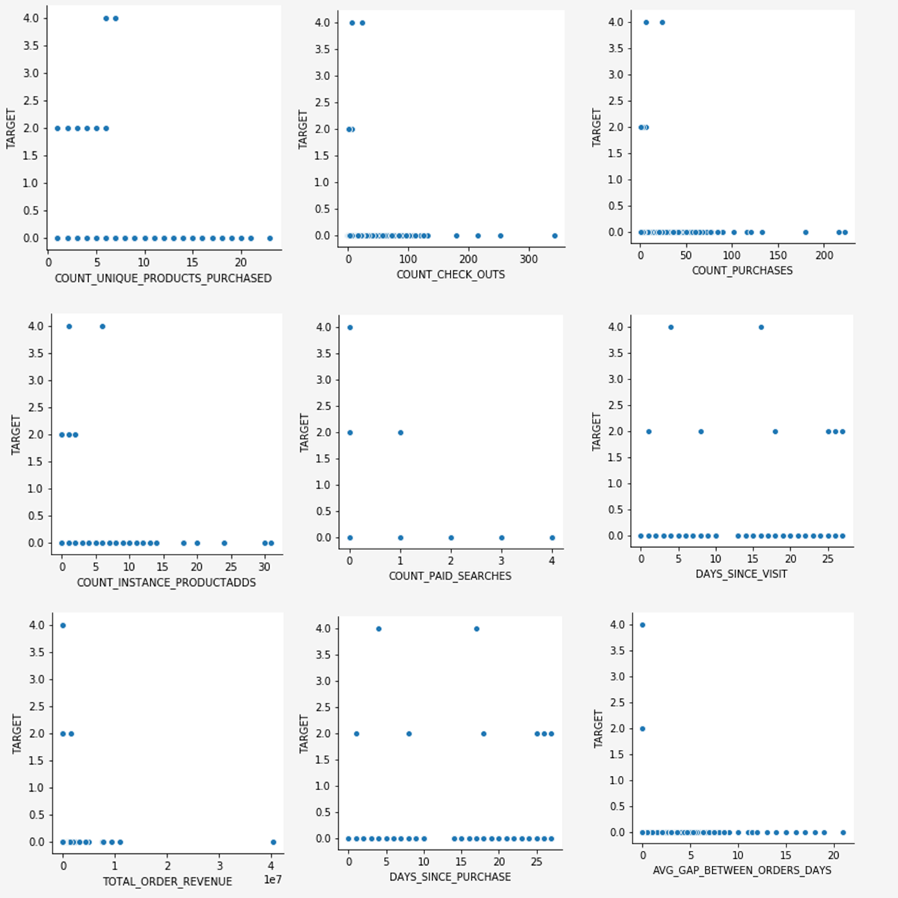

# Esplorazione dei dati basati sul Web per i modelli predittivi utilizzando il notebook per l&#39;analisi dei dati esplorativi (EDA)

>[!NOTE]
>
>Data Science Area di lavoro non è più disponibile per l&#39;acquisto.
>
>Questa documentazione è destinata ai clienti esistenti con precedenti diritti a Data Science Area di lavoro.

Il notebook per l&#39;analisi esplorativa dei dati (EDA) è progettato per aiutarti a scoprire modelli nei dati, verificare la sanità dei dati e riepilogare i dati rilevanti per i modelli predittivi.

L&#39;esempio del notebook EDA è stato ottimizzato tenendo conto dei dati basati sul Web ed è costituito da due parti. La prima parte inizia con l&#39;utilizzo di Query Service per visualizzare tendenze e snapshot dei dati. Successivo, con un obiettivo in mente per l&#39;analisi esplorativa dei dati, i dati vengono aggregati a livello di profilo e visitatore.

La seconda parte inizia con l&#39;esecuzione di analisi descrittive sui dati aggregati utilizzando le librerie di Python. Questo blocco appunti presenta visualizzazioni quali istogrammi, grafici a dispersione, box plot e una matrice di correlazione per ricavare informazioni actionable utilizzate per determinare quali funzioni sono più probabilmente utili nella previsione di un obiettivo.

## Introduzione

Prima di leggere questa guida, consulta la guida](./overview.md) utente [[!DNL JupyterLab] per un&#39;introduzione di alto livello e il suo ruolo all&#39;interno di [!DNL JupyterLab] Data Science Area di lavoro. Inoltre, se si utilizzano i propri dati, consultare la documentazione relativa ai [accesso dei dati nei [!DNL Jupyterlab] blocchi appunti](./access-notebook-data.md). Questa guida contiene informazioni importanti sui limiti di dati del notebook.

Questo notebook usa un set di dati midvalues sotto forma di dati Adobe Analytics Experience Events trovati nel Analytics Analysis Workspace. Per utilizzare il notebook EDA, è necessario definire la tabella di dati con i seguenti valori `target_table` e `target_table_id`. È possibile utilizzare qualsiasi set di dati midvalue.

Per trovare questi valori, seguire i passaggi descritti nella [sezione Scrivi in un set di dati in Python](./access-notebook-data.md#write-python) della guida all&#39;accesso dei dati JupyterLab. Il nome del set di dati (`target_table`) si trova nella directory del set di dati. Una volta clic destro il set di dati per esplorare o scrivere dati in un notebook, viene fornito un ID set di dati (`target_table_id`) nella voce di codice eseguibile.

## Individuazione dei dati

Questa sezione contiene passaggi di configurazione e query di esempio utilizzati per visualizzare tendenze quali le &quot;dieci città principali per attività utente&quot; o i &quot;dieci prodotti visualizzati principali&quot;.

### Configurazione delle librerie

JupyterLab supporta più librerie. Il codice seguente può essere incollato ed eseguito in una cella di codice per raccogliere e installare tutti i pacchetti richiesti utilizzati in questo esempio. Puoi utilizzare pacchetti aggiuntivi o alternativi al di fuori di questo esempio per l’analisi dei dati. Per un elenco dei pacchetti supportati, copiare e incollare `!pip list --format=columns` in una nuova cella.

```python
!pip install colorama
import chart_studio.plotly as py
import plotly.graph_objs as go
from plotly.offline import iplot
from scipy import stats
import numpy as np
import warnings
warnings.filterwarnings('ignore')
from scipy.stats import pearsonr
import matplotlib.pyplot as plt
from scipy.stats import pearsonr
import pandas as pd
import math
import re
import seaborn as sns
from datetime import datetime
import colorama
from colorama import Fore, Style
pd.set_option('display.max_columns', None)
pd.set_option('display.max_rows', None)
pd.set_option('display.width', 1000)
pd.set_option('display.expand_frame_repr', False)
pd.set_option('display.max_colwidth', -1)
```

### Connetti a Adobe Experience Platform [!DNL Query Service]

[!DNL JupyterLab] su Platform consente di utilizzare SQL in un blocco appunti [!DNL Python] per accedere ai dati tramite [Query Service](https://www.adobe.com/go/query-service-home-en). L&#39;accesso ai dati tramite [!DNL Query Service] può essere utile per gestire set di dati di grandi dimensioni a causa dei tempi di esecuzione superiori. Si noti che l&#39;esecuzione di query sui dati tramite [!DNL Query Service] ha un limite di tempo di elaborazione di dieci minuti.

Prima di utilizzare [!DNL Query Service] in [!DNL JupyterLab], verificare di avere una buona conoscenza della sintassi [[!DNL Query Service] SQL](https://www.adobe.com/go/query-service-sql-syntax-en).

Per utilizzare Query Service in JupyterLab, è necessario innanzitutto creare una connessione tra il notebook Python in uso e Query Service. A tale scopo, eseguire la cella seguente.

```python
qs_connect()
```

### Definire il set di dati midvalues per l’esplorazione

Per iniziare a eseguire query ed esplorare i dati, è necessario fornire una tabella di set di dati con valori intermedi. Copiare e sostituire i valori `table_name` e `table_id` con i propri valori della tabella dati.

```python
target_table = "table_name"
target_table_id = "table_id"
```

Una volta completata, questa cella avrà un aspetto simile a quella dell&#39;esempio seguente:

```python
target_table = "cross_industry_demo_midvalues"
target_table_id = "5f7c40ef488de5194ba0157a"
```

### Esplora il set di dati per le date disponibili

Utilizzando la cella fornita di seguito, è possibile visualizzare l&#39;intervallo di date coperto nella tabella. Lo scopo dell’analisi del numero di giorni, della prima data e dell’ultima data è quello di facilitare la selezione di un intervallo di date per ulteriori analisi.

```python
%%read_sql -c QS_CONNECTION
SELECT distinct Year(timestamp) as Year, Month(timestamp) as Month, count(distinct DAY(timestamp)) as Count_days, min(DAY(timestamp)) as First_date, max(DAY(timestamp)) as Last_date, count(timestamp) as Count_hits
from {target_table}
group by Month(timestamp), Year(timestamp)
order by Year, Month;
```

L&#39;esecuzione della cella produce il seguente output:


### Configurare le date per l’individuazione dei set di dati

Dopo aver determinato le date disponibili per l’individuazione del set di dati, è necessario aggiornare i parametri riportati di seguito. Le date configurate in questa cella vengono utilizzate solo per l&#39;individuazione dei dati sotto forma di query. Le date vengono aggiornate nuovamente in intervalli appropriati per l’analisi dei dati esplorativi più avanti in questa guida.

```python
target_year = "2020" ## The target year
target_month = "02" ## The target month
target_day = "(01,02,03)" ## The target days
```

### Individuazione di set di dati

Dopo aver configurato tutti i parametri, avviato [!DNL Query Service]e disporre di un intervallo di date, è possibile iniziare a leggere righe di dati. È consigliabile limitare il numero di righe lette.

```python
from platform_sdk.dataset_reader import DatasetReader
from datetime import date
dataset_reader = DatasetReader(PLATFORM_SDK_CLIENT_CONTEXT, dataset_id=target_table_id)
# If you do not see any data or would like to expand the default date range, change the following query
Table = dataset_reader.limit(5).read()
```

Per visualizzare il numero di colonne disponibili nel set di dati, utilizzare la cella seguente:

```python
print("\nNumber of columns:",len(Table.columns))
```

Per visualizzare le righe del set di dati, utilizzare la cella seguente. In questo esempio, il numero di righe è limitato a cinque.

```python
Table.head(5)
```


Una volta che hai un&#39;idea di quali dati sono contenuti nel set di dati, può essere utile suddividere ulteriormente il set di dati. In questo esempio vengono elencati i nomi delle colonne e i tipi di dati per ogni colonna, mentre l&#39;output viene utilizzato per verificare se il tipo di dati è corretto o meno.

```python
ColumnNames_Types = pd.DataFrame(Table.dtypes)
ColumnNames_Types = ColumnNames_Types.reset_index()
ColumnNames_Types.columns = ["Column_Name", "Data_Type"]
ColumnNames_Types
```


### Esplorazione delle tendenze del set di dati

La sezione seguente contiene quattro query di esempio utilizzate per esplorare tendenze e modelli nei dati. Gli esempi forniti di seguito non sono esaustivi, ma coprono alcune delle funzionalità più comunemente esaminate.

**Conteggio attività orario per un dato giorno**

Questa query analizza il numero di azioni e clic nel corso della giornata. L’output viene rappresentato sotto forma di tabella contenente le metriche sul conteggio delle attività per ogni ora del giorno.

```sql
%%read_sql query_2_df -c QS_CONNECTION

SELECT Substring(timestamp, 12, 2)                        AS Hour, 
       Count(enduserids._experience.aaid.id) AS Count 
FROM   {target_table}
WHERE  Year(timestamp) = {target_year} 
       AND Month(timestamp) = {target_month}  
       AND Day(timestamp) in {target_day}
GROUP  BY Hour
ORDER  BY Hour;
```


Dopo aver confermato il funzionamento della query, i dati possono essere presentati in un istogramma univoco per ottenere chiarezza visiva.

```python
trace = go.Bar(
    x = query_2_df['Hour'],
    y = query_2_df['Count'],
    name = "Activity Count"
)

layout = go.Layout(
    title = 'Activity Count by Hour of Day',
    width = 1200,
    height = 600,
    xaxis = dict(title = 'Hour of Day'),
    yaxis = dict(title = 'Count')
)

fig = go.Figure(data = [trace], layout = layout)
iplot(fig)
```


**Le prime 10 pagine visualizzate per un determinato giorno**

Questa query analizza quali sono le pagine più visualizzate per un determinato giorno. L&#39;output è rappresentato sotto forma di una tabella contenente le metriche relative al nome della pagina e al conteggio delle visualizzazioni di pagina.

```sql
%%read_sql query_4_df -c QS_CONNECTION

SELECT web.webpagedetails.name                 AS Page_Name, 
       Sum(web.webpagedetails.pageviews.value) AS Page_Views 
FROM   {target_table}
WHERE  Year(timestamp) = {target_year}
       AND Month(timestamp) = {target_month}
       AND Day(timestamp) in {target_day}
GROUP  BY web.webpagedetails.name 
ORDER  BY page_views DESC 
LIMIT  10;
```

Dopo aver confermato che la query funziona, i dati possono essere presentati in un grafico univariato istogramma per chiarezza visiva.

```python
trace = go.Bar(
    x = query_4_df['Page_Name'],
    y = query_4_df['Page_Views'],
    name = "Page Views"
)

layout = go.Layout(
    title = 'Top Ten Viewed Pages For a Given Day',
    width = 1000,
    height = 600,
    xaxis = dict(title = 'Page_Name'),
    yaxis = dict(title = 'Page_Views')
)

fig = go.Figure(data = [trace], layout = layout)
iplot(fig)
```


**Prime dieci città raggruppate per attività utente**

Questa query analizza da quali città provengono i dati.

```sql
%%read_sql query_6_df -c QS_CONNECTION

SELECT concat(placeContext.geo.stateProvince, ' - ', placeContext.geo.city) AS state_city, 
       Count(timestamp)                                                     AS Count
FROM   {target_table}
WHERE  Year(timestamp) = {target_year}
       AND Month(timestamp) = {target_month}
       AND Day(timestamp) in {target_day}
GROUP  BY state_city
ORDER  BY Count DESC
LIMIT  10;
```

Dopo aver confermato che la query funziona, i dati possono essere presentati in un grafico univariato istogramma per chiarezza visiva.

```python
trace = go.Bar(
    x = query_6_df['state_city'],
    y = query_6_df['Count'],
    name = "Activity by City"
)

layout = go.Layout(
    title = 'Top Ten Cities by User Activity',
    width = 1200,
    height = 600,
    xaxis = dict(title = 'City'),
    yaxis = dict(title = 'Count')
)

fig = go.Figure(data = [trace], layout = layout)
iplot(fig)
```


**I primi dieci prodotti visualizzati**

Questa query fornisce un elenco dei primi dieci prodotti visualizzati. Nell&#39;esempio seguente, la `Explode()` funzione viene utilizzata per restituire ogni prodotto dell&#39;oggetto `productlistitems` alla propria riga. Ciò consente di eseguire una query nidificata per aggregato le visualizzazioni di prodotto per referenza di magazzino diversi.

```sql
%%read_sql query_7_df -c QS_CONNECTION

SELECT Product_List_Items.sku AS Product_SKU,
       Sum(Product_Views) AS Total_Product_Views
FROM  (SELECT Explode(productlistitems) AS Product_List_Items, 
              commerce.productviews.value   AS Product_Views 
       FROM   {target_table}
       WHERE  Year(timestamp) = {target_year}
              AND Month(timestamp) = {target_month}
              AND Day(timestamp) in {target_day}
              AND commerce.productviews.value IS NOT NULL) 
GROUP BY Product_SKU 
ORDER BY Total_Product_Views DESC
LIMIT  10;
```

Dopo aver confermato che la query funziona, i dati possono essere presentati in un grafico univariato istogramma per chiarezza visiva.

```python
trace = go.Bar(
    x = "SKU-" + query_7_df['Product_SKU'],
    y = query_7_df['Total_Product_Views'],
    name = "Product View"
)

layout = go.Layout(
    title = 'Top Ten Viewed Products',
    width = 1200,
    height = 600,
    xaxis = dict(title = 'SKU'),
    yaxis = dict(title = 'Product View Count')
)

fig = go.Figure(data = [trace], layout = layout)
iplot(fig)
```


Dopo aver esplorato le tendenze e gli schemi dei dati, dovresti avere una buona idea di quali funzioni desideri creare per una previsione di un obiettivo. L’esplorazione delle tabelle può evidenziare rapidamente la forma di ciascun attributo di dati, le evidenti rappresentazioni errate e i valori eccessivi e iniziare a suggerire relazioni candidate da esplorare tra gli attributi.

## Analisi esplorativa dei dati

L&#39;analisi esplorativa dei dati viene utilizzata per perfezionare la comprensione dei dati e versione un&#39;intuizione per domande convincenti che possono essere utilizzate come base per la modellazione.

Dopo aver completato il passaggio di individuazione dei dati, avrai esplorato i dati a livello di evento con alcune aggregazioni a livello di evento, città o ID utente per visualizzare le tendenze per un giorno. Sebbene questi dati siano importanti, non forniscono un quadro completo. Ancora non capisci cosa spinge un acquisto sul tuo sito web.

Per capirlo, devi aggregato i dati a livello di profilo/visitatore, definire un obiettivo di acquisto e applicare concetti statistici come correlazione, box plot e grafici a dispersione. Questi metodi vengono utilizzati per confrontare i modelli di attività per acquirenti e non acquirenti nella finestra di previsione definita.

In questa sezione vengono create ed esplorate le seguenti funzionalità:

- `COUNT_UNIQUE_PRODUCTS_PURCHASED`: numero di prodotti univoci acquistati.
- `COUNT_CHECK_OUTS`: numero di estrazioni.
- `COUNT_PURCHASES`: numero di acquisti.
- `COUNT_INSTANCE_PRODUCTADDS`: numero di istanze di aggiunta prodotto.
- `NUMBER_VISITS`: numero di visite.
- `COUNT_PAID_SEARCHES`: numero di ricerche a pagamento.
- `DAYS_SINCE_VISIT`: numero di giorni dall&#39;ultima visita.
- `TOTAL_ORDER_REVENUE`: il totale dei ricavi dell&#39;ordine.
- `DAYS_SINCE_PURCHASE`: numero di giorni dall&#39;acquisto precedente.
- `AVG_GAP_BETWEEN_ORDERS_DAYS`: gap medio tra acquisti in giorni.
- `STATE_CITY`: contiene lo stato e la città.

Prima di continuare con l’aggregazione dei dati, è necessario definire i parametri per la variabile di previsione utilizzata nell’analisi dei dati esplorativi. In altre parole, cosa volete dal vostro modello di scienza dei dati? I parametri comuni includono un obiettivo, un periodo di previsione e un periodo di analisi.

Se si utilizza il blocco appunti EDA, è necessario sostituire i valori riportati di seguito prima di continuare.

```python
goal = "commerce.`order`.purchaseID" #### prediction variable
goal_column_type = "numerical" #### choose either "categorical" or "numerical"
prediction_window_day_start = "2020-01-01" #### YYYY-MM-DD
prediction_window_day_end = "2020-01-31" #### YYYY-MM-DD
analysis_period_day_start = "2020-02-01" #### YYYY-MM-DD
analysis_period_day_end = "2020-02-28" #### YYYY-MM-DD

### If the goal is a categorical goal then select threshold for the defining category and creating bins. 0 is no order placed, and 1 is at least one order placed:
threshold = 1
```

### Aggregazione dei dati per la creazione di funzionalità e obiettivi

Per iniziare l&#39;analisi esplorativa, è necessario creare un obiettivo a livello di profilo, seguito dall&#39;aggregazione del set di dati. In questo esempio, vengono fornite due query. La prima query contiene la creazione di un obiettivo. La seconda query deve essere aggiornata per includere qualsiasi variabile diversa da quelle della prima query. È possibile aggiornare `limit` per la query. Dopo aver eseguito le query seguenti, i dati aggregati sono ora disponibili per l’esplorazione.

```sql
%%read_sql target_df -d -c QS_CONNECTION

SELECT DISTINCT endUserIDs._experience.aaid.id                  AS ID,
       Count({goal})                                            AS TARGET
FROM   {target_table}
WHERE DATE(TIMESTAMP) BETWEEN '{prediction_window_day_start}' AND '{prediction_window_day_end}'
GROUP BY endUserIDs._experience.aaid.id;
```

```sql
%%read_sql agg_data -d -c QS_CONNECTION

SELECT z.*, z1.state_city as STATE_CITY
from
((SELECT y.*,a2.AVG_GAP_BETWEEN_ORDERS_DAYS as AVG_GAP_BETWEEN_ORDERS_DAYS
from
(select a1.*, f.DAYS_SINCE_PURCHASE as DAYS_SINCE_PURCHASE
from
(SELECT DISTINCT a.ID  AS ID,
COUNT(DISTINCT Product_Items.SKU) as COUNT_UNIQUE_PRODUCTS_PURCHASED,
COUNT(a.check_out) as COUNT_CHECK_OUTS,
COUNT(a.purchases) as COUNT_PURCHASES, 
COUNT(a.product_list_adds) as COUNT_INSTANCE_PRODUCTADDS,
sum(CASE WHEN a.search_paid = 'TRUE' THEN 1 ELSE 0 END) as COUNT_PAID_SEARCHES,
DATEDIFF('{analysis_period_day_end}', MAX(a.date_a)) as DAYS_SINCE_VISIT,
ROUND(SUM(Product_Items.priceTotal * Product_Items.quantity), 2) AS TOTAL_ORDER_REVENUE
from 
(SELECT endUserIDs._experience.aaid.id as ID,
commerce.`checkouts`.value as check_out,
commerce.`order`.purchaseID as purchases, 
commerce.`productListAdds`.value as product_list_adds,
search.isPaid as search_paid,
DATE(TIMESTAMP) as date_a,
Explode(productlistitems) AS Product_Items
from {target_table}
Where DATE(TIMESTAMP) BETWEEN '{analysis_period_day_start}' AND '{analysis_period_day_end}') as a
group by a.ID) as a1
left join 
(SELECT DISTINCT endUserIDs._experience.aaid.id as ID,
DATEDIFF('{analysis_period_day_end}', max(DATE(TIMESTAMP))) as DAYS_SINCE_PURCHASE
from {target_table}
where DATE(TIMESTAMP) BETWEEN '{analysis_period_day_start}' AND '{analysis_period_day_end}'
and commerce.`order`.purchaseid is not null
GROUP BY endUserIDs._experience.aaid.id) as f
on f.ID = a1.ID
where a1.COUNT_PURCHASES>0) as y
left join
(select ab.ID, avg(DATEDIFF(ab.ORDER_DATES, ab.PriorDate)) as AVG_GAP_BETWEEN_ORDERS_DAYS
from
(SELECT distinct endUserIDs._experience.aaid.id as ID, TO_DATE(DATE(TIMESTAMP)) as ORDER_DATES, 
TO_DATE(LAG(DATE(TIMESTAMP),1) OVER (PARTITION BY endUserIDs._experience.aaid.id ORDER BY DATE(TIMESTAMP))) as PriorDate
FROM {target_table}
where DATE(TIMESTAMP) BETWEEN '{analysis_period_day_start}' AND '{analysis_period_day_end}'
AND commerce.`order`.purchaseid is not null) AS ab
where ab.PriorDate is not null
GROUP BY ab.ID) as a2
on a2.ID = y.ID) z    
left join
(select t.ID, t.state_city from
(
SELECT DISTINCT endUserIDs._experience.aaid.id as ID,
concat(placeContext.geo.stateProvince, ' - ', placeContext.geo.city) as state_city, 
ROW_NUMBER() OVER(PARTITION BY endUserIDs._experience.aaid.id ORDER BY DATE(TIMESTAMP) DESC) AS ROWNUMBER
FROM   {target_table}
WHERE  DATE(TIMESTAMP) BETWEEN '{analysis_period_day_start}' AND '{analysis_period_day_end}') as t
where t.ROWNUMBER = 1) z1
on z.ID = z1.ID)
limit 500000;
```

### Unisci le funzioni nel set di dati aggregato con un obiettivo

La cella seguente viene utilizzata per unire le funzioni nel set di dati aggregato descritto nell’esempio precedente con l’obiettivo di previsione.

```python
Data = pd.merge(agg_data,target_df, on='ID',how='left')
Data['TARGET'].fillna(0, inplace=True)
```

Le tre celle di esempio successive vengono utilizzate per verificare che l&#39;unione sia stata eseguita correttamente.

`Data.shape` restituisce il numero di colonne seguito dal numero di righe, ad esempio: (11913, 12).

```python
Data.shape
```

`Data.head(5)` restituisce una tabella con 5 righe di dati. La tabella restituita contiene tutte le 12 colonne di dati aggregati mappati a un ID profilo.

```python
Data.head(5)
```


Questa cella stampa il numero di profili univoci.

```python
print("Count of unique profiles:", (len(Data)))
```

### Rileva valori mancanti e valori anomali

Dopo aver completato l’aggregazione dei dati e averla unita all’obiettivo, è necessario rivedere i dati, talvolta denominati controllo dello stato dei dati.

Questo processo comporta l&#39;identificazione dei valori mancanti e dei valori anomali. Quando vengono identificati i problemi, il compito successivo è quello di elaborare strategie specifiche per gestirli.

>[!NOTE]
>
>Durante questa fase, è possibile individuare il danneggiamento dei valori che può segnalare un errore nel processo di registrazione dati.

```python
Missing = pd.DataFrame(round(Data.isnull().sum()*100/len(Data),2))
Missing.columns =['Percentage_missing_values'] 
Missing['Features'] = Missing.index
```

La cella seguente viene utilizzata per visualizzare i valori mancanti.

```python
trace = go.Bar(
    x = Missing['Features'],
    y = Missing['Percentage_missing_values'],
    name = "Percentage_missing_values")

layout = go.Layout(
    title = 'Missing values',
    width = 1200,
    height = 600,
    xaxis = dict(title = 'Features'),
    yaxis = dict(title = 'Percentage of missing values')
)

fig = go.Figure(data = [trace], layout = layout)
iplot(fig)
```


Dopo aver rilevato i valori mancanti, è critico identificare i valori anomali. Le statistiche parametriche come la media, la deviazione standard e la correlazione sono altamente sensibili agli outlier. Inoltre, anche le ipotesi relative a procedure statistiche comuni, quali le regressioni lineari, si basano su tali statistiche. Questo significa che i valori anomali possono compromettere un&#39;analisi.

Per identificare i valori erratici, in questo esempio viene utilizzato l&#39;intervallo tra quartili. Intervallo interquartile (IQR) è l&#39;intervallo tra il primo e il terzo quartile (25° e 75° percentile). Questo esempio raccoglie tutti i punti dati che rientrano in 1,5 volte l&#39;IQR al di sotto del 25° percentile o 1,5 volte l&#39;IQR al di sopra del 75° percentile. I valori che rientrano in uno di questi valori vengono definiti come valore aberrante nella cella seguente.

>[!TIP]
>
>Per correggere i valori anomali è necessario avere una comprensione dell&#39;azienda e del settore in cui si lavora. A volte non puoi rilasciare un’osservazione solo perché è un’anomalia. I valori anomali possono essere osservazioni legittime e sono spesso le più interessanti. Per ulteriori informazioni sull&#39;eliminazione dei valori anomali, visita il [passaggio](#optional-data-clean) facoltativo di pulizia dei dati.

```python
TARGET = Data.TARGET

Data_numerical = Data.select_dtypes(include=['float64', 'int64'])
Data_numerical.drop(['TARGET'],axis = 1,inplace = True)
Data_numerical1 = Data_numerical

for i in range(0,len(Data_numerical1.columns)):
    Q1 = Data_numerical1.iloc[:,i].quantile(0.25)
    Q3 = Data_numerical1.iloc[:,i].quantile(0.75)
    IQR = Q3 - Q1
    Data_numerical1.iloc[:,i] = np.where(Data_numerical1.iloc[:,i]<(Q1 - 1.5 * IQR),np.nan, np.where(Data_numerical1.iloc[:,i]>(Q3 + 1.5 * IQR),
                                                                                                    np.nan,Data_numerical1.iloc[:,i]))
    
Outlier = pd.DataFrame(round(Data_numerical1.isnull().sum()*100/len(Data),2))
Outlier.columns =['Percentage_outliers'] 
Outlier['Features'] = Outlier.index   
```

Come sempre, è importante visualizzare i risultati.

```python
trace = go.Bar(
    x = Outlier['Features'],
    y = Outlier['Percentage_outliers'],
    name = "Percentage_outlier")

layout = go.Layout(
    title = 'Outliers',
    width = 1200,
    height = 600,
    xaxis = dict(title = 'Features'),
    yaxis = dict(title = 'Percentage of outliers')
)

fig = go.Figure(data = [trace], layout = layout)
iplot(fig)
```


### Analisi univariata

Una volta corretti i dati per i valori mancanti e i valori anomali, è possibile avviare l&#39;analisi. Esistono tre tipi di analisi: univariata, bivariata e multivariata. L&#39;analisi univariata prende i dati, riepiloga e trova modelli nei dati utilizzando relazioni a singola variabile. L&#39;analisi bivariata esamina più di una variabile alla volta, mentre l&#39;analisi multivariata esamina tre o più variabili alla volta.

Nell&#39;esempio riportato di seguito viene prodotta una tabella per visualizzare la distribuzione delle feature.

```python
Data_numerical = Data.select_dtypes(include=['float64', 'int64'])
distribution = pd.DataFrame([Data_numerical.count(),Data_numerical.mean(),Data_numerical.quantile(0), Data_numerical.quantile(0.01),
                             Data_numerical.quantile(0.05),Data_numerical.quantile(0.25), Data_numerical.quantile(0.5),
                        Data_numerical.quantile(0.75),  Data_numerical.quantile(0.95),Data_numerical.quantile(0.99), Data_numerical.max()])
distribution = distribution.T
distribution.columns = ['Count', 'Mean', 'Min', '1st_perc','5th_perc','25th_perc', '50th_perc','75th_perc','95th_perc','99th_perc','Max']
distribution
```


Una volta ottenuta una distribuzione delle funzionalità, è possibile creare grafici di dati visualizzati utilizzando un array. Le celle seguenti vengono utilizzate per visualizzare la tabella precedente con i dati numerici.

```python
A = sns.palplot(sns.color_palette("Blues"))
```

```python
for column in Data_numerical.columns[0:]:
    plt.figure(figsize=(5, 4))
    plt.ticklabel_format(style='plain', axis='y')
    sns.distplot(Data_numerical[column], color = A, kde=False, bins=6, hist_kws={'alpha': 0.4});
```


### Dati categorici

Il raggruppamento di dati categorici viene utilizzato per comprendere i valori contenuti in ciascuna delle colonne di dati aggregati e le relative distribuzioni. In questo esempio vengono utilizzate le prime 10 categorie per facilitare il plottaggio delle distribuzioni. È importante notare che in una colonna possono essere contenuti migliaia di valori univoci. Non si desidera eseguire il rendering di un plottaggio disordinato rendendolo illeggibile. Tenendo presente l’obiettivo aziendale, il raggruppamento dei dati produce risultati più significativi.

```python
Data_categorical = Data.select_dtypes(include='object')
Data_categorical.drop(['ID'], axis = 1, inplace = True, errors = 'ignore')
```

```python
for column in Data_categorical.columns[0:]:
    if (len(Data_categorical[column].value_counts())>10):
        plt.figure(figsize=(12, 8))
        sns.countplot(x=column, data = Data_categorical, order = Data_categorical[column].value_counts().iloc[:10].index, palette="Set2");
    else:
        plt.figure(figsize=(12, 8))
        sns.countplot(x=column, data = Data_categorical, palette="Set2");
```


### Rimuovi colonne con un solo valore distinto

Le colonne che hanno solo un valore non aggiungono alcuna informazione all&#39;analisi e possono essere rimosse.

```python
for col in Data.columns:
    if len(Data[col].unique()) == 1:
        if col == 'TARGET':
            print(Fore.RED + '\033[1m' + 'WARNING: TARGET HAS A SINGLE UNIQUE VALUE, ANY BIVARIATE ANALYSIS (NEXT STEP IN THIS NOTEBOOK) OR PREDICTION WILL BE MEANINGLESS' + Fore.RESET + '\x1b[21m')
        elif col == 'ID':
            print(Fore.RED + '\033[1m' + 'WARNING: THERE IS ONLY ONE PROFILE IN THE DATA, ANY BIVARIATE ANALYSIS (NEXT STEP IN THIS NOTEBOOK) OR PREDICTION WILL BE MEANINGLESS' + Fore.RESET + '\x1b[21m')
        else:
            print('Dropped column:',col)
            Data.drop(col,inplace=True,axis=1)
```

Dopo aver rimosso le colonne con valore singolo, verificare la presenza di eventuali errori nelle colonne rimanenti nell&#39;utilizzo del `Data.columns` comando in una nuova cella.

### Correggere i valori mancanti

La sezione seguente contiene alcuni approcci di esempio sulla correzione dei valori mancanti. Sebbene nei dati di cui sopra solo una colonna avesse un valore mancante, le celle di esempio sotto valori corretti per tutti i tipi di dati. Comprendono:

- Tipi di dati numerici: inserire 0 o max se applicabile
- Tipi di dati categorici: valore modale di input

```python
#### Select only numerical data
Data_numerical = Data.select_dtypes(include=['float64', 'int64'])

#### For columns that contain days we impute max days of history for null values, for rest all we impute 0

# Imputing days with max days of history
Days_cols = [col for col in Data_numerical.columns if 'DAYS_' in col]
d1 = datetime.strptime(analysis_period_day_start, "%Y-%m-%d")
d2 = datetime.strptime(analysis_period_day_end, "%Y-%m-%d")
A = abs((d2 - d1).days)

for column in Days_cols:
    Data[column].fillna(A, inplace=True)

# Imputing 0
Data_numerical = Data.select_dtypes(include=['float64', 'int64'])
Missing_numerical = Data_numerical.columns[Data_numerical.isnull().any()].tolist()

for column in Missing_numerical:
    Data[column].fillna(0, inplace=True)
```

```python
#### Correct for missing values in categorical columns (Replace with mode)
Data_categorical = Data.select_dtypes(include='object')
Missing_cat = Data_categorical.columns[Data_categorical.isnull().any()].tolist() 
for column in Missing_cat:
    Data[column].fillna(Data[column].mode()[0], inplace=True)
```

Una volta completati, i dati puliti sono pronti per l’analisi bivariata.

### Analisi bivariata

L’analisi bivariata viene utilizzata per comprendere la relazione tra due insiemi di valori, come le funzioni e una variabile di destinazione. Poiché i diversi grafici si riferiscono a tipi di dati numerici e per categoria, l’analisi deve essere eseguita separatamente per ciascun tipo di dati. Per l’analisi bivariata si consigliano i seguenti grafici:

- **Correlazione**: un coefficiente di correlazione è la misura della forza di una relazione tra due funzionalità. La correlazione ha valori compresi tra -1 e 1, dove: 1 indica una relazione positiva forte, -1 indica una relazione negativa forte e il risultato zero indica nessuna relazione.
- **Coppia plottaggio**: i plot a coppie sono un modo semplice per visualizzare le relazioni tra ciascuna variabile. Genera una matrice di relazioni tra ciascuna variabile nei dati.
- **Mappa di calore**: Le mappe di calore sono il coefficiente di correlazione per tutte le variabili nel set di dati.
- **Box plot**: i box plot sono un modo standardizzato di visualizzare la distribuzione dei dati in base a un riepilogo di cinque numeri (minimo, primo quartile (Q1), mediano, terzo quartile (Q3) e massimo).
- **Grafico conteggio**: un grafico conteggio è simile a un istogramma o a un grafico a barre per alcune caratteristiche categoriche. Mostra il numero di occorrenze di un elemento in base a un determinato tipo di categoria.

Per comprendere la relazione tra la variabile &quot;goal&quot; e i predittori/funzioni, i grafici vengono utilizzati in base ai tipi di dati. Per le funzioni numeriche, è necessario utilizzare un box plot se la variabile &quot;goal&quot; è categorica, nonché un pairplot e una mappa di calore se la variabile &quot;goal&quot; è numerica.

Per le funzionalità categoriche, è necessario utilizzare un grafico di conteggio se la variabile &quot;obiettivo&quot; è categorica, nonché un grafico a caselle se la variabile &quot;obiettivo&quot; è numerica. L’utilizzo di questi metodi facilita la comprensione delle relazioni. Queste relazioni possono essere sotto forma di funzioni, o predittori e un obiettivo.

**Predittori numerici**

```python
if len(Data) == 1:
    print(Fore.RED + '\033[1m' + 'THERE IS ONLY ONE PROFILE IN THE DATA, BIVARIATE ANALYSIS IS NOT APPLICABLE, PLEASE INCLUDE AT LEAST ONE MORE PROFILE TO DO BIVARIATE ANALYSIS')
elif len(Data['TARGET'].unique()) == 1:
    print(Fore.RED + '\033[1m' + 'TARGET HAS A SINGLE UNIQUE VALUE, BIVARIATE ANALYSIS IS NOT APPLICABLE, PLEASE INCLUDE PROFILES WITH ATLEAST ONE DIFFERENT VALUE OF TARGET TO DO BIVARIATE ANALYSIS')
else:
    if (goal_column_type == "categorical"):
        TARGET_categorical = pd.DataFrame(np.where(TARGET>=threshold,"1","0"))
        TARGET_categorical.rename(columns={TARGET_categorical.columns[0]: "TARGET_categorical" }, inplace = True)
        Data_numerical = Data.select_dtypes(include=['float64', 'int64'])
        Data_numerical.drop(['TARGET'],inplace=True,axis=1)
        Data_numerical = pd.concat([Data_numerical, TARGET_categorical.astype(int)], axis = 1)
        ncols_for_charts = len(Data_numerical.columns)-1
        nrows_for_charts = math.ceil(ncols_for_charts/4)
        fig, axes = plt.subplots(nrows=nrows_for_charts, ncols=4, figsize=(18, 15))
        for idx, feat in enumerate(Data_numerical.columns[:-1]):
            ax = axes[int(idx // 4), idx % 4]
            sns.boxplot(x='TARGET_categorical', y=feat, data=Data_numerical, ax=ax)
            ax.set_xlabel('')
            ax.set_ylabel(feat)
            fig.tight_layout();
    else:
        Data_numerical = Data.select_dtypes(include=['float64', 'int64'])
        TARGET = pd.DataFrame(Data_numerical.TARGET)
        Data_numerical = Data.select_dtypes(include=['float64', 'int64'])
        Data_numerical.drop(['TARGET'],inplace=True,axis=1)
        Data_numerical = pd.concat([Data_numerical, TARGET.astype(int)], axis = 1)
        for i in Data_numerical.columns[:-1]:
            sns.pairplot(x_vars=i, y_vars=['TARGET'], data=Data_numerical, height = 4)
        f, ax = plt.subplots(figsize = (10,8))
        corr = Data_numerical.corr()
```

L&#39;esecuzione della cella produce i seguenti output:




**Predittori categorici**

L’esempio seguente viene utilizzato per tracciare e visualizzare i grafici di frequenza per le prime 10 categorie di ciascuna variabile categoriale.

```python
if len(Data) == 1:
    print(Fore.RED + '\033[1m' + 'THERE IS ONLY ONE PROFILE IN THE DATA, BIVARIATE ANALYSIS IS NOT APPLICABLE, PLEASE INCLUDE AT LEAST ONE MORE PROFILE TO DO BIVARIATE ANALYSIS')
elif len(Data['TARGET'].unique()) == 1:
    print(Fore.RED + '\033[1m' + 'TARGET HAS A SINGLE UNIQUE VALUE, BIVARIATE ANALYSIS IS NOT APPLICABLE, PLEASE INCLUDE PROFILES WITH ATLEAST ONE DIFFERENT VALUE OF TARGET TO DO BIVARIATE ANALYSIS')
else:
    if (goal_column_type == "categorical"):
        TARGET_categorical = pd.DataFrame(np.where(TARGET>=threshold,"1","0"))
        TARGET_categorical.rename(columns={TARGET_categorical.columns[0]: "TARGET_categorical" }, inplace = True)
        Data_categorical = Data.select_dtypes(include='object')
        Data_categorical.drop(["ID"], axis =1, inplace = True)
        Cat_columns = Data_categorical
        Data_categorical = pd.concat([TARGET_categorical,Data_categorical], axis =1)
        for column in Cat_columns.columns:
            A = Data_categorical[column].value_counts().iloc[:10].index
            Data_categorical1 = Data_categorical[Data_categorical[column].isin(A)]
            plt.figure(figsize=(12, 8))
            sns.countplot(x="TARGET_categorical",hue=column, data = Data_categorical1, palette = 'Blues')
            plt.xlabel("GOAL")
            plt.ylabel("COUNT")
            plt.show();
    else:
        Data_categorical = Data.select_dtypes(include='object')
        Data_categorical.drop(["ID"], axis =1, inplace = True)
        Target = Data.TARGET
        Data_categorical = pd.concat([Data_categorical,Target], axis =1)
        for column in Data_categorical.columns[:-1]:
            A = Data_categorical[column].value_counts().iloc[:10].index
            Data_categorical1 = Data_categorical[Data_categorical[column].isin(A)]
            sns.catplot(x=column, y="TARGET", kind = "boxen", data =Data_categorical1, height=5, aspect=13/5);
```

L&#39;esecuzione della cella produce il seguente output:


### Caratteristiche numeriche importanti

Utilizzando l&#39;analisi di correlazione, potete creare un elenco delle prime dieci feature numeriche importanti. Tutte queste funzioni possono essere utilizzate per prevedere la funzione &quot;obiettivo&quot;. Questo elenco può essere utilizzato come elenco di feature per quando iniziate a creare il modello.

```python
if len(Data) == 1:
    print(Fore.RED + '\033[1m' + 'THERE IS ONLY ONE PROFILE IN THE DATA, BIVARIATE ANALYSIS IS NOT APPLICABLE, PLEASE INCLUDE AT LEAST ONE MORE PROFILE TO FIND IMPORTANT VARIABLES')
elif len(Data['TARGET'].unique()) == 1:
    print(Fore.RED + '\033[1m' + 'TARGET HAS A SINGLE UNIQUE VALUE, BIVARIATE ANALYSIS IS NOT APPLICABLE, PLEASE INCLUDE PROFILES WITH ATLEAST ONE DIFFERENT VALUE OF TARGET TO FIND IMPORTANT VARIABLES')
else:
    Data_numerical = Data.select_dtypes(include=['float64', 'int64'])
    Correlation = pd.DataFrame(Data_numerical.drop("TARGET", axis=1).apply(lambda x: x.corr(Data_numerical.TARGET)))
    Correlation['Corr_abs'] = abs(Correlation)
    Correlation = Correlation.sort_values(by = 'Corr_abs', ascending = False)
    Imp_features = pd.DataFrame(Correlation.index[0:10])
    Imp_features.rename(columns={0:'Important Feature'}, inplace=True)
    print(Imp_features)
```


### Esempio informazione approfondita

Durante l&#39;analisi dei dati, non è raro scoprire informazioni. Nell&#39;esempio seguente è riportato un informazione approfondita che mappa l&#39;attualità e il valore monetario di un evento destinazione.

```python
# Proxy for monetary value is TOTAL_ORDER_REVENUE and proxy for frequency is NUMBER_VISITS
if len(Data) == 1:
    print(Fore.RED + '\033[1m' + 'THERE IS ONLY ONE PROFILE IN THE DATA, INSIGHTS ANALYSIS IS NOT APPLICABLE, PLEASE INCLUDE AT LEAST ONE MORE PROFILE TO FIND IMPORTANT VARIABLES')
elif len(Data['TARGET'].unique()) == 1:
    print(Fore.RED + '\033[1m' + 'TARGET HAS A SINGLE UNIQUE VALUE, INSIGHTS ANALYSIS IS NOT APPLICABLE, PLEASE INCLUDE PROFILES WITH ATLEAST ONE DIFFERENT VALUE OF TARGET TO FIND IMPORTANT VARIABLES')
else:
    sns.lmplot("DAYS_SINCE_VISIT", "TOTAL_ORDER_REVENUE", Data, hue="TARGET", fit_reg=False);
```


## Passaggio facoltativo di pulizia dei dati {#optional-data-clean}

Per correggere le anomalie è necessario conoscere il business e il settore in cui si lavora. A volte non puoi rilasciare un’osservazione solo perché è un’anomalia. Le anomalie possono essere osservazioni legittime e sono spesso quelle più interessanti.

Per ulteriori informazioni sui valori anomali e sull&#39;eventuale eliminazione di tali valori, leggere questa voce dal [fattore di analisi](https://www.theanalysisfactor.com/outliers-to-drop-or-not-to-drop/).

I seguenti punti dati di base e di limite celle di esempio sono valori anomali che utilizzano [intervallo interquartile](https://www.thoughtco.com/what-is-the-interquartile-range-rule-3126244).

```python
TARGET = Data.TARGET

Data_numerical = Data.select_dtypes(include=['float64', 'int64'])
Data_numerical.drop(['TARGET'],axis = 1,inplace = True)

for i in range(0,len(Data_numerical.columns)):
    Q1 = Data_numerical.iloc[:,i].quantile(0.25)
    Q3 = Data_numerical.iloc[:,i].quantile(0.75)
    IQR = Q3 - Q1
    Data_numerical.iloc[:,i] = np.where(Data_numerical.iloc[:,i]<(Q1 - 1.5 * IQR), (Q1 - 1.5 * IQR), np.where(Data_numerical.iloc[:,i]>(Q3 + 1.5 * IQR),
                                                                                                     (Q3 + 1.5 * IQR),Data_numerical.iloc[:,i]))
Data_categorical = Data.select_dtypes(include='object')
Data = pd.concat([Data_categorical, Data_numerical, TARGET], axis = 1)
```

## Passaggi successivi

Dopo aver completato l’analisi dei dati esplorativi, puoi iniziare a creare un modello. In alternativa, è possibile usare i dati e le informazioni dettagliate derivati per creare un dashboard con strumenti come Power BI.

Adobe Experience Platform separa il processo di creazione del modello in due fasi distinte, Ricette (un istanza del modello) e Modelli. Per iniziare il processo di creazione della ricetta, visita la documentazione per la creazione di [una ricetta nei blocchi appunti JupyerLab](./create-a-model.md). Questo documento contiene informazioni ed esempi per creare, training e assegnare un punteggio a una ricetta all&#39;interno di [!DNL JupyterLab] Notebooks.
