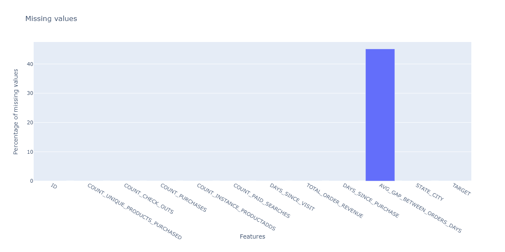
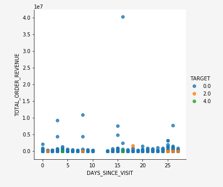

# Esplorazione di dati basati sul Web per modelli predittivi utilizzando il notebook di analisi dei dati esplorativi (EDA)

Il notebook per l&#39;analisi dei dati esplorativi (EDA) è stato progettato per aiutarvi a scoprire i pattern dei dati, verificare l&#39;integrità dei dati e riepilogare i dati rilevanti per i modelli predittivi.

L&#39;esempio del notebook EDA è stato ottimizzato con dati basati sul Web e consiste di due parti. La prima parte inizia con l&#39;utilizzo di Query Service per visualizzare tendenze e istantanee dei dati. Quindi, con un obiettivo in mente per l&#39;analisi dei dati esplorativi, i dati vengono aggregati a livello di profilo e visitatore.

La seconda parte inizia con l&#39;esecuzione di analisi descrittive sui dati aggregati utilizzando le librerie Python. Questo blocco appunti presenta visualizzazioni quali istogrammi, grafici a dispersione, grafici a caselle e una matrice di correlazione per ricavare informazioni fruibili utilizzate per determinare quali funzioni sono più probabilmente utili per prevedere un obiettivo.

## Introduzione

Prima di leggere questa guida, consultare la [[!DNL JupyterLab] guida utente](./overview.md) per un&#39;introduzione di alto livello a [!DNL JupyterLab] e il relativo ruolo all&#39;interno di Data Science Workspace. Inoltre, se si utilizzano i propri dati, consultare la documentazione relativa all&#39;accesso ai dati in  [!DNL Jupyterlab] notebook](./access-notebook-data.md). [ Questa guida contiene informazioni importanti sui limiti dei dati del notebook.

Questo blocco appunti utilizza un set di dati di valori intermedi sotto forma di  dati Adobe Analytics Experience Events reperibili nell&#39;Analysis Workspace di Analytics . Per utilizzare il blocco appunti EDA, è necessario definire la tabella dati con i seguenti valori `target_table` e `target_table_id`. È possibile utilizzare qualsiasi set di dati midvalue.

Per trovare questi valori, segui i passaggi descritti nella sezione [scrivere in un dataset nella sezione python](./access-notebook-data.md#write-python) della guida all&#39;accesso ai dati JupyterLab. Il nome del set di dati (`target_table`) si trova nella directory del set di dati. Dopo aver fatto clic con il pulsante destro del mouse sul dataset per esplorare o scrivere i dati in un blocco appunti, nella voce del codice eseguibile viene fornito un ID di set di dati (`target_table_id`).

## Individuazione dei dati

Questa sezione contiene i passaggi di configurazione e le query di esempio utilizzate per visualizzare le tendenze, ad esempio &quot;le prime dieci città per attività utente&quot; o &quot;i primi dieci prodotti visualizzati&quot;.

### Configurazione delle librerie

JupyterLab supporta più librerie. Il codice seguente può essere incollato ed eseguito in una cella di codice per raccogliere e installare tutti i pacchetti richiesti utilizzati in questo esempio. Puoi utilizzare pacchetti aggiuntivi o alternativi al di fuori di questo esempio per la tua analisi dei dati. Per un elenco dei pacchetti supportati, copiate e incollate `!pip list --format=columns` in una nuova cella.

```python
!pip install colorama
import chart_studio.plotly as py
import plotly.graph_objs as go
from plotly.offline import iplot
from scipy import stats
import numpy as np
import warnings
warnings.filterwarnings('ignore')
from scipy.stats import pearsonr
import matplotlib.pyplot as plt
from scipy.stats import pearsonr
import pandas as pd
import math
import re
import seaborn as sns
from datetime import datetime
import colorama
from colorama import Fore, Style
pd.set_option('display.max_columns', None)
pd.set_option('display.max_rows', None)
pd.set_option('display.width', 1000)
pd.set_option('display.expand_frame_repr', False)
pd.set_option('display.max_colwidth', -1)
```

### Connetti ad Adobe Experience Platform [!DNL Query Service]

[!DNL JupyterLab] su Piattaforma consente di utilizzare SQL in un  [!DNL Python] blocco appunti per accedere ai dati tramite  [Query Service](https://www.adobe.com/go/query-service-home-en). L&#39;accesso ai dati tramite [!DNL Query Service] può essere utile per gestire i set di dati di grandi dimensioni a causa dei suoi tempi di esecuzione superiori. Tenere presente che l&#39;esecuzione di query sui dati utilizzando [!DNL Query Service] ha un limite di tempo di elaborazione di dieci minuti.

Prima di utilizzare [!DNL Query Service] in [!DNL JupyterLab], verificare di disporre di una conoscenza approfondita della [[!DNL Query Service] sintassi SQL](https://www.adobe.com/go/query-service-sql-syntax-en).

Per utilizzare il servizio Query in JupyterLab, è innanzitutto necessario creare una connessione tra il notebook Python in funzione e il servizio Query. Questo può essere ottenuto eseguendo la cella seguente.

```python
qs_connect()
```

### Definire il set di dati dei valori intermedi per l&#39;esplorazione

Per iniziare a eseguire query ed esplorare i dati, è necessario fornire una tabella di dati dei valori intermedi. Copiare e sostituire i valori `table_name` e `table_id` con valori personalizzati della tabella di dati.

```python
target_table = "table_name"
target_table_id = "table_id"
```

Una volta completata, la cella avrà un aspetto simile al seguente esempio:

```python
target_table = "cross_industry_demo_midvalues"
target_table_id = "5f7c40ef488de5194ba0157a"
```

### Esplora il set di dati per le date disponibili

Utilizzando la cella fornita di seguito, è possibile visualizzare l&#39;intervallo di date incluso nella tabella. Lo scopo di esplorare il numero di giorni, la prima data e l’ultima data, è quello di aiutare a selezionare un intervallo di date per un’ulteriore analisi.

```python
%%read_sql -c QS_CONNECTION
SELECT distinct Year(timestamp) as Year, Month(timestamp) as Month, count(distinct DAY(timestamp)) as Count_days, min(DAY(timestamp)) as First_date, max(DAY(timestamp)) as Last_date, count(timestamp) as Count_hits
from {target_table}
group by Month(timestamp), Year(timestamp)
order by Year, Month;
```

L&#39;esecuzione della cella genera il seguente output:


### Configurare le date per l&#39;individuazione dei dataset

Dopo aver determinato le date disponibili per l&#39;individuazione dei dataset, è necessario aggiornare i parametri seguenti. Le date configurate in questa cella vengono utilizzate solo per l&#39;individuazione dei dati sotto forma di query. Le date vengono aggiornate di nuovo agli intervalli adatti per l&#39;analisi dei dati esplorativi più avanti in questa guida.

```python
target_year = "2020" ## The target year
target_month = "02" ## The target month
target_day = "(01,02,03)" ## The target days
```

### Rilevamento dei dati

Una volta configurati tutti i parametri, avviati [!DNL Query Service] e dotati di un intervallo di date, è possibile iniziare a leggere le righe di dati. Limitare il numero di righe che si leggono.

```python
from platform_sdk.dataset_reader import DatasetReader
from datetime import date
dataset_reader = DatasetReader(PLATFORM_SDK_CLIENT_CONTEXT, dataset_id=target_table_id)
# If you do not see any data or would like to expand the default date range, change the following query
Table = dataset_reader.limit(5).read()
```

Per visualizzare il numero di colonne disponibili nel dataset, utilizzare la cella seguente:

```python
print("\nNumber of columns:",len(Table.columns))
```

Per visualizzare le righe del dataset, utilizzare la cella seguente. In questo esempio, il numero di righe è limitato a cinque.

```python
Table.head(5)
```


Una volta che si ha un&#39;idea dei dati contenuti nel dataset, può essere utile suddividere ulteriormente il dataset. In questo esempio sono elencati i nomi delle colonne e i tipi di dati per ciascuna colonna, mentre l&#39;output è utilizzato per verificare se il tipo di dati è corretto o meno.

```python
ColumnNames_Types = pd.DataFrame(Table.dtypes)
ColumnNames_Types = ColumnNames_Types.reset_index()
ColumnNames_Types.columns = ["Column_Name", "Data_Type"]
ColumnNames_Types
```


### Esplorazione delle tendenze del set di dati

La sezione seguente contiene quattro query di esempio utilizzate per esaminare tendenze e pattern nei dati. Gli esempi forniti di seguito non sono esaustivi ma coprono alcune delle funzioni più comunemente considerate.

**Conteggio delle attività orarie per un dato giorno**

Questa query analizza il numero di azioni e clic nel corso della giornata. L&#39;output è rappresentato nella forma di una tabella contenente le metriche sul conteggio delle attività per ogni ora del giorno.

```sql
%%read_sql query_2_df -c QS_CONNECTION

SELECT Substring(timestamp, 12, 2)                        AS Hour, 
       Count(enduserids._experience.aaid.id) AS Count 
FROM   {target_table}
WHERE  Year(timestamp) = {target_year} 
       AND Month(timestamp) = {target_month}  
       AND Day(timestamp) in {target_day}
GROUP  BY Hour
ORDER  BY Hour;
```


Dopo aver confermato il funzionamento della query, i dati possono essere presentati in un istogramma grafico universale per una chiarezza visiva.

```python
trace = go.Bar(
    x = query_2_df['Hour'],
    y = query_2_df['Count'],
    name = "Activity Count"
)

layout = go.Layout(
    title = 'Activity Count by Hour of Day',
    width = 1200,
    height = 600,
    xaxis = dict(title = 'Hour of Day'),
    yaxis = dict(title = 'Count')
)

fig = go.Figure(data = [trace], layout = layout)
iplot(fig)
```


**Le prime 10 pagine visualizzate per un dato giorno**

Questa query consente di analizzare le pagine più visualizzate per un dato giorno. L&#39;output è rappresentato nella forma di una tabella contenente le metriche sul nome della pagina e sul conteggio delle visualizzazioni di pagina.

```sql
%%read_sql query_4_df -c QS_CONNECTION

SELECT web.webpagedetails.name                 AS Page_Name, 
       Sum(web.webpagedetails.pageviews.value) AS Page_Views 
FROM   {target_table}
WHERE  Year(timestamp) = {target_year}
       AND Month(timestamp) = {target_month}
       AND Day(timestamp) in {target_day}
GROUP  BY web.webpagedetails.name 
ORDER  BY page_views DESC 
LIMIT  10;
```

Dopo aver confermato il funzionamento della query, i dati possono essere presentati in un istogramma grafico universale per una chiarezza visiva.

```python
trace = go.Bar(
    x = query_4_df['Page_Name'],
    y = query_4_df['Page_Views'],
    name = "Page Views"
)

layout = go.Layout(
    title = 'Top Ten Viewed Pages For a Given Day',
    width = 1000,
    height = 600,
    xaxis = dict(title = 'Page_Name'),
    yaxis = dict(title = 'Page_Views')
)

fig = go.Figure(data = [trace], layout = layout)
iplot(fig)
```


**Le dieci città principali raggruppate per attività utente**

Questa query analizza le città da cui provengono i dati.

```sql
%%read_sql query_6_df -c QS_CONNECTION

SELECT concat(placeContext.geo.stateProvince, ' - ', placeContext.geo.city) AS state_city, 
       Count(timestamp)                                                     AS Count
FROM   {target_table}
WHERE  Year(timestamp) = {target_year}
       AND Month(timestamp) = {target_month}
       AND Day(timestamp) in {target_day}
GROUP  BY state_city
ORDER  BY Count DESC
LIMIT  10;
```

Dopo aver confermato il funzionamento della query, i dati possono essere presentati in un istogramma grafico universale per una chiarezza visiva.

```python
trace = go.Bar(
    x = query_6_df['state_city'],
    y = query_6_df['Count'],
    name = "Activity by City"
)

layout = go.Layout(
    title = 'Top Ten Cities by User Activity',
    width = 1200,
    height = 600,
    xaxis = dict(title = 'City'),
    yaxis = dict(title = 'Count')
)

fig = go.Figure(data = [trace], layout = layout)
iplot(fig)
```


**Primi dieci prodotti visualizzati**

Questa query fornisce un elenco dei primi dieci prodotti visualizzati. Nell&#39;esempio seguente, la funzione `Explode()` viene utilizzata per restituire ogni prodotto nell&#39;oggetto `productlistitems` alla propria riga. Questo consente di eseguire una query nidificata per aggregare le viste prodotto per SKU diversi.

```sql
%%read_sql query_7_df -c QS_CONNECTION

SELECT Product_List_Items.sku AS Product_SKU,
       Sum(Product_Views) AS Total_Product_Views
FROM  (SELECT Explode(productlistitems) AS Product_List_Items, 
              commerce.productviews.value   AS Product_Views 
       FROM   {target_table}
       WHERE  Year(timestamp) = {target_year}
              AND Month(timestamp) = {target_month}
              AND Day(timestamp) in {target_day}
              AND commerce.productviews.value IS NOT NULL) 
GROUP BY Product_SKU 
ORDER BY Total_Product_Views DESC
LIMIT  10;
```

Dopo aver confermato il funzionamento della query, i dati possono essere presentati in un istogramma grafico universale per una chiarezza visiva.

```python
trace = go.Bar(
    x = "SKU-" + query_7_df['Product_SKU'],
    y = query_7_df['Total_Product_Views'],
    name = "Product View"
)

layout = go.Layout(
    title = 'Top Ten Viewed Products',
    width = 1200,
    height = 600,
    xaxis = dict(title = 'SKU'),
    yaxis = dict(title = 'Product View Count')
)

fig = go.Figure(data = [trace], layout = layout)
iplot(fig)
```


Dopo aver analizzato le tendenze e i modelli dei dati, si dovrebbe avere una buona idea di quali caratteristiche si desidera creare per una previsione di un obiettivo. L&#39;interlinea tra le tabelle consente di evidenziare rapidamente la forma di ciascun attributo di dati, le rappresentazioni non esatte e i valori di grandi dimensioni e di iniziare a suggerire relazioni tra i candidati da esplorare tra gli attributi.

## Analisi esplorativa dei dati

L&#39;analisi esplorativa dei dati è utilizzata per migliorare la comprensione dei dati e creare un&#39;intuizione per domande coinvolgenti che possono essere utilizzate come base per la modellazione.

Al termine della fase di rilevamento dei dati, avrete esplorato i dati a livello di evento con alcune aggregazioni a livello di evento, città o ID utente per visualizzare le tendenze relative a un giorno. Anche se questi dati sono importanti, non forniscono un quadro completo. Non si capisce ancora cosa spinge un acquisto sul sito Web.

Per comprendere questo aspetto, è necessario aggregare i dati a livello di profilo/visitatore, definire un obiettivo di acquisto e applicare concetti statistici come correlazioni, grafici a caselle e grafici a dispersione. Questi metodi vengono utilizzati per confrontare i modelli di attività per acquirenti e non acquirenti nella finestra di previsione definita.

In questa sezione vengono create ed esplorate le seguenti funzioni:

- `COUNT_UNIQUE_PRODUCTS_PURCHASED`: Il numero di prodotti univoci acquistati.
- `COUNT_CHECK_OUTS`: Numero di check-out.
- `COUNT_PURCHASES`: Numero di acquisti.
- `COUNT_INSTANCE_PRODUCTADDS`: Il numero di istanze di aggiunta prodotti.
- `NUMBER_VISITS` : Numero di visite.
- `COUNT_PAID_SEARCHES`: Numero di ricerche pagate.
- `DAYS_SINCE_VISIT`: Il numero di giorni dall&#39;ultima visita.
- `TOTAL_ORDER_REVENUE`: Totale ricavi ordine.
- `DAYS_SINCE_PURCHASE`: Il numero di giorni trascorsi dall&#39;acquisto precedente.
- `AVG_GAP_BETWEEN_ORDERS_DAYS`: Lo scarto medio tra gli acquisti in giorni.
- `STATE_CITY`: Contiene lo stato e la città.

Prima di continuare con l&#39;aggregazione dei dati, è necessario definire i parametri per la variabile di previsione utilizzata nell&#39;analisi dei dati esplorativi. In altre parole, cosa vuoi dal tuo modello di scienza dei dati? I parametri comuni includono un obiettivo, un periodo di previsione e un periodo di analisi.

Se si utilizza il blocco appunti EDA, è necessario sostituire i valori riportati di seguito prima di continuare.

```python
goal = "commerce.`order`.purchaseID" #### prediction variable
goal_column_type = "numerical" #### choose either "categorical" or "numerical"
prediction_window_day_start = "2020-01-01" #### YYYY-MM-DD
prediction_window_day_end = "2020-01-31" #### YYYY-MM-DD
analysis_period_day_start = "2020-02-01" #### YYYY-MM-DD
analysis_period_day_end = "2020-02-28" #### YYYY-MM-DD

### If the goal is a categorical goal then select threshold for the defining category and creating bins. 0 is no order placed, and 1 is at least one order placed:
threshold = 1
```

### Aggregazione dei dati per la creazione di feature e obiettivi

Per iniziare l&#39;analisi esplorativa, è necessario creare un obiettivo a livello di profilo, seguito dall&#39;aggregazione del set di dati. In questo esempio, vengono fornite due query. La prima query contiene la creazione di un obiettivo. La seconda query deve essere aggiornata per includere nella prima query qualsiasi variabile diversa da quelle. È possibile aggiornare la `limit` per la query. Dopo aver eseguito le seguenti query, i dati aggregati sono ora disponibili per l&#39;esplorazione.

```sql
%%read_sql target_df -d -c QS_CONNECTION

SELECT DISTINCT endUserIDs._experience.aaid.id                  AS ID,
       Count({goal})                                            AS TARGET
FROM   {target_table}
WHERE DATE(TIMESTAMP) BETWEEN '{prediction_window_day_start}' AND '{prediction_window_day_end}'
GROUP BY endUserIDs._experience.aaid.id;
```

```sql
%%read_sql agg_data -d -c QS_CONNECTION

SELECT z.*, z1.state_city as STATE_CITY
from
((SELECT y.*,a2.AVG_GAP_BETWEEN_ORDERS_DAYS as AVG_GAP_BETWEEN_ORDERS_DAYS
from
(select a1.*, f.DAYS_SINCE_PURCHASE as DAYS_SINCE_PURCHASE
from
(SELECT DISTINCT a.ID  AS ID,
COUNT(DISTINCT Product_Items.SKU) as COUNT_UNIQUE_PRODUCTS_PURCHASED,
COUNT(a.check_out) as COUNT_CHECK_OUTS,
COUNT(a.purchases) as COUNT_PURCHASES, 
COUNT(a.product_list_adds) as COUNT_INSTANCE_PRODUCTADDS,
sum(CASE WHEN a.search_paid = 'TRUE' THEN 1 ELSE 0 END) as COUNT_PAID_SEARCHES,
DATEDIFF('{analysis_period_day_end}', MAX(a.date_a)) as DAYS_SINCE_VISIT,
ROUND(SUM(Product_Items.priceTotal * Product_Items.quantity), 2) AS TOTAL_ORDER_REVENUE
from 
(SELECT endUserIDs._experience.aaid.id as ID,
commerce.`checkouts`.value as check_out,
commerce.`order`.purchaseID as purchases, 
commerce.`productListAdds`.value as product_list_adds,
search.isPaid as search_paid,
DATE(TIMESTAMP) as date_a,
Explode(productlistitems) AS Product_Items
from {target_table}
Where DATE(TIMESTAMP) BETWEEN '{analysis_period_day_start}' AND '{analysis_period_day_end}') as a
group by a.ID) as a1
left join 
(SELECT DISTINCT endUserIDs._experience.aaid.id as ID,
DATEDIFF('{analysis_period_day_end}', max(DATE(TIMESTAMP))) as DAYS_SINCE_PURCHASE
from {target_table}
where DATE(TIMESTAMP) BETWEEN '{analysis_period_day_start}' AND '{analysis_period_day_end}'
and commerce.`order`.purchaseid is not null
GROUP BY endUserIDs._experience.aaid.id) as f
on f.ID = a1.ID
where a1.COUNT_PURCHASES>0) as y
left join
(select ab.ID, avg(DATEDIFF(ab.ORDER_DATES, ab.PriorDate)) as AVG_GAP_BETWEEN_ORDERS_DAYS
from
(SELECT distinct endUserIDs._experience.aaid.id as ID, TO_DATE(DATE(TIMESTAMP)) as ORDER_DATES, 
TO_DATE(LAG(DATE(TIMESTAMP),1) OVER (PARTITION BY endUserIDs._experience.aaid.id ORDER BY DATE(TIMESTAMP))) as PriorDate
FROM {target_table}
where DATE(TIMESTAMP) BETWEEN '{analysis_period_day_start}' AND '{analysis_period_day_end}'
AND commerce.`order`.purchaseid is not null) AS ab
where ab.PriorDate is not null
GROUP BY ab.ID) as a2
on a2.ID = y.ID) z    
left join
(select t.ID, t.state_city from
(
SELECT DISTINCT endUserIDs._experience.aaid.id as ID,
concat(placeContext.geo.stateProvince, ' - ', placeContext.geo.city) as state_city, 
ROW_NUMBER() OVER(PARTITION BY endUserIDs._experience.aaid.id ORDER BY DATE(TIMESTAMP) DESC) AS ROWNUMBER
FROM   {target_table}
WHERE  DATE(TIMESTAMP) BETWEEN '{analysis_period_day_start}' AND '{analysis_period_day_end}') as t
where t.ROWNUMBER = 1) z1
on z.ID = z1.ID)
limit 500000;
```

### Unisci le funzioni nel set di dati aggregato con un obiettivo

La cella seguente viene utilizzata per unire le funzioni nel set di dati aggregato di cui all&#39;esempio precedente con l&#39;obiettivo di previsione.

```python
Data = pd.merge(agg_data,target_df, on='ID',how='left')
Data['TARGET'].fillna(0, inplace=True)
```

Le tre celle di esempio seguenti vengono utilizzate per verificare che l&#39;unione sia avvenuta correttamente.

`Data.shape` restituisce il numero di colonne seguito dal numero di righe, ad esempio: (11913, 12).

```python
Data.shape
```

`Data.head(5)` restituisce una tabella con 5 righe di dati. La tabella restituita contiene tutte e 12 le colonne di dati aggregati mappate a un ID profilo.

```python
Data.head(5)
```


Questa cella consente di stampare il numero di profili univoci.

```python
print("Count of unique profiles :", (len(Data)))
```

### Rilevamento di valori mancanti e valori limite

Una volta completata l&#39;aggregazione dei dati e unita all&#39;obiettivo, è necessario esaminare i dati a volte definiti come controllo dello stato dei dati.

Questo processo comporta l&#39;identificazione di valori mancanti e di valori non validi. Quando vengono individuati dei problemi, il prossimo compito è quello di elaborare strategie specifiche per la loro gestione.

>[!NOTE]
>
>Durante questo passaggio, è possibile individuare il danneggiamento dei valori che possono segnalare un errore nel processo di registrazione dei dati.

```python
Missing = pd.DataFrame(round(Data.isnull().sum()*100/len(Data),2))
Missing.columns =['Percentage_missing_values'] 
Missing['Features'] = Missing.index
```

La cella seguente viene utilizzata per visualizzare i valori mancanti.

```python
trace = go.Bar(
    x = Missing['Features'],
    y = Missing['Percentage_missing_values'],
    name = "Percentage_missing_values")

layout = go.Layout(
    title = 'Missing values',
    width = 1200,
    height = 600,
    xaxis = dict(title = 'Features'),
    yaxis = dict(title = 'Percentage of missing values')
)

fig = go.Figure(data = [trace], layout = layout)
iplot(fig)
```



Dopo aver rilevato i valori mancanti, è fondamentale identificare gli outliers. Le statistiche parametriche come la media, la deviazione standard e la correlazione sono molto sensibili ai valori aberranti. Inoltre, le ipotesi di procedure statistiche comuni, come le regressioni lineari, si basano anche su tali statistiche. Ciò significa che gli outliers possono davvero rovinare un&#39;analisi.

Per identificare gli outliers, in questo esempio viene utilizzato l&#39;intervallo interquartile. L&#39;intervallo tra quartili (IQR) è l&#39;intervallo tra il primo e il terzo quartile (25° e 75° percentile). Questo esempio raccoglie tutti i punti di dati che rientrano sotto 1,5 volte l&#39;IQR al di sotto del 25° percentile o 1,5 volte l&#39;IQR al di sopra del 75° percentile. I valori che rientrano in uno di questi sono definiti come valori aberranti nella cella seguente.

>[!TIP]
>
>Per correggere gli svantaggi, è necessario conoscere il business e l&#39;industria in cui state lavorando. A volte, non si può rilasciare un&#39;osservazione solo perché è una cosa strana. I valori limite possono essere osservazioni legittime e sono spesso i più interessanti. Per ulteriori informazioni sul rilascio di outliers, visitare il [passaggio di pulizia dei dati (facoltativo)](#optional-data-clean).

```python
TARGET = Data.TARGET

Data_numerical = Data.select_dtypes(include=['float64', 'int64'])
Data_numerical.drop(['TARGET'],axis = 1,inplace = True)
Data_numerical1 = Data_numerical

for i in range(0,len(Data_numerical1.columns)):
    Q1 = Data_numerical1.iloc[:,i].quantile(0.25)
    Q3 = Data_numerical1.iloc[:,i].quantile(0.75)
    IQR = Q3 - Q1
    Data_numerical1.iloc[:,i] = np.where(Data_numerical1.iloc[:,i]<(Q1 - 1.5 * IQR),np.nan, np.where(Data_numerical1.iloc[:,i]>(Q3 + 1.5 * IQR),
                                                                                                    np.nan,Data_numerical1.iloc[:,i]))
    
Outlier = pd.DataFrame(round(Data_numerical1.isnull().sum()*100/len(Data),2))
Outlier.columns =['Percentage_outliers'] 
Outlier['Features'] = Outlier.index   
```

Come sempre, è importante visualizzare i risultati.

```python
trace = go.Bar(
    x = Outlier['Features'],
    y = Outlier['Percentage_outliers'],
    name = "Percentage_outlier")

layout = go.Layout(
    title = 'Outliers',
    width = 1200,
    height = 600,
    xaxis = dict(title = 'Features'),
    yaxis = dict(title = 'Percentage of outliers')
)

fig = go.Figure(data = [trace], layout = layout)
iplot(fig)
```


### Analisi univoca

Una volta corretti i dati per valori mancanti e valori di soglia, potete avviare l&#39;analisi. Esistono tre tipi di analisi: analisi univoca, bivariata e multivariato. L&#39;analisi univoca prende dati, riepiloga e trova pattern nei dati utilizzando relazioni singole variabili. L&#39;analisi bivariato esamina più variabili alla volta, mentre l&#39;analisi multivariato esamina tre o più variabili alla volta.

L&#39;esempio seguente produce una tabella per visualizzare la distribuzione delle funzioni.

```python
Data_numerical = Data.select_dtypes(include=['float64', 'int64'])
distribution = pd.DataFrame([Data_numerical.count(),Data_numerical.mean(),Data_numerical.quantile(0), Data_numerical.quantile(0.01),
                             Data_numerical.quantile(0.05),Data_numerical.quantile(0.25), Data_numerical.quantile(0.5),
                        Data_numerical.quantile(0.75),  Data_numerical.quantile(0.95),Data_numerical.quantile(0.99), Data_numerical.max()])
distribution = distribution.T
distribution.columns = ['Count', 'Mean', 'Min', '1st_perc','5th_perc','25th_perc', '50th_perc','75th_perc','95th_perc','99th_perc','Max']
distribution
```


Una volta distribuite le funzioni, è possibile creare grafici dati visualizzati utilizzando un array. Le celle seguenti sono utilizzate per visualizzare la tabella riportata sopra con dati numerici.

```python
A = sns.palplot(sns.color_palette("Blues"))
```

```python
for column in Data_numerical.columns[0:]:
    plt.figure(figsize=(5, 4))
    plt.ticklabel_format(style='plain', axis='y')
    sns.distplot(Data_numerical[column], color = A, kde=False, bins=6, hist_kws={'alpha': 0.4});
```


### Dati categorici

I dati di raggruppamento sono utilizzati per comprendere i valori contenuti in ciascuna colonna di dati aggregati e le relative distribuzioni. In questo esempio vengono utilizzate le prime 10 categorie per facilitare la stampa delle distribuzioni. È importante notare che possono essere presenti migliaia di valori univoci contenuti in una colonna. Non si vuole rendere un grafico disordinato rendendolo illeggibile. Tenendo presente l&#39;obiettivo aziendale, il raggruppamento dei dati genera risultati più significativi.

```python
Data_categorical = Data.select_dtypes(include='object')
Data_categorical.drop(['ID'], axis = 1, inplace = True, errors = 'ignore')
```

```python
for column in Data_categorical.columns[0:]:
    if (len(Data_categorical[column].value_counts())>10):
        plt.figure(figsize=(12, 8))
        sns.countplot(x=column, data = Data_categorical, order = Data_categorical[column].value_counts().iloc[:10].index, palette="Set2");
    else:
        plt.figure(figsize=(12, 8))
        sns.countplot(x=column, data = Data_categorical, palette="Set2");
```


### Rimuovere le colonne con un solo valore distinto

Le colonne con un solo valore uno non aggiungono alcuna informazione all’analisi e possono essere rimosse.

```python
for col in Data.columns:
    if len(Data[col].unique()) == 1:
        if col == 'TARGET':
            print(Fore.RED + '\033[1m' + 'WARNING : TARGET HAS A SINGLE UNIQUE VALUE, ANY BIVARIATE ANALYSIS (NEXT STEP IN THIS NOTEBOOK) OR PREDICTION WILL BE MEANINGLESS' + Fore.RESET + '\x1b[21m')
        elif col == 'ID':
            print(Fore.RED + '\033[1m' + 'WARNING : THERE IS ONLY ONE PROFILE IN THE DATA, ANY BIVARIATE ANALYSIS (NEXT STEP IN THIS NOTEBOOK) OR PREDICTION WILL BE MEANINGLESS' + Fore.RESET + '\x1b[21m')
        else:
            print('Dropped column :',col)
            Data.drop(col,inplace=True,axis=1)
```

Dopo aver rimosso le colonne con un singolo valore, verificare se le colonne rimanenti presentano errori utilizzando il comando `Data.columns` in una nuova cella.

### Corretto per i valori mancanti

La sezione seguente contiene alcuni approcci di esempio per la correzione dei valori mancanti. Evento anche se nei dati sopra solo una colonna aveva un valore mancante, le celle di esempio sotto i valori corretti per tutti i tipi di dati. Comprendono:

- Tipi di dati numerici: 0 o max, se applicabile
- Tipi di dati categorici: valore modale di input

```python
#### Select only numerical data
Data_numerical = Data.select_dtypes(include=['float64', 'int64'])

#### For columns that contain days we impute max days of history for null values, for rest all we impute 0

# Imputing days with max days of history
Days_cols = [col for col in Data_numerical.columns if 'DAYS_' in col]
d1 = datetime.strptime(analysis_period_day_start, "%Y-%m-%d")
d2 = datetime.strptime(analysis_period_day_end, "%Y-%m-%d")
A = abs((d2 - d1).days)

for column in Days_cols:
    Data[column].fillna(A, inplace=True)

# Imputing 0
Data_numerical = Data.select_dtypes(include=['float64', 'int64'])
Missing_numerical = Data_numerical.columns[Data_numerical.isnull().any()].tolist()

for column in Missing_numerical:
    Data[column].fillna(0, inplace=True)
```

```python
#### Correct for missing values in categorical columns (Replace with mode)
Data_categorical = Data.select_dtypes(include='object')
Missing_cat = Data_categorical.columns[Data_categorical.isnull().any()].tolist() 
for column in Missing_cat:
    Data[column].fillna(Data[column].mode()[0], inplace=True)
```

Una volta completati, i dati puliti sono pronti per l&#39;analisi bivariata.

### Analisi bivariato

L&#39;analisi bivariato viene utilizzata per comprendere la relazione tra due set di valori, come le funzioni e una variabile target. Poiché i diversi grafici corrispondono a tipi di dati categorici e numerici, questa analisi deve essere effettuata separatamente per ciascun tipo di dati. Per l&#39;analisi bivariato sono consigliati i seguenti grafici:

- **Correlazione**: Un coefficiente di correlazione è la misura dell’intensità di una relazione tra due caratteristiche. La correlazione ha valori compresi tra -1 e 1, dove: 1 indica una forte relazione positiva, -1 indica una forte relazione negativa e il risultato di zero non indica alcuna relazione.
- **Coppia**: I grafici a coppie sono un modo semplice per visualizzare le relazioni tra ciascuna variabile. Produce una matrice di relazioni tra ciascuna variabile nei dati.
- **Heatmap**: Le mappe di calore sono il coefficiente di correlazione per tutte le variabili del set di dati.
- **Trame** per box: Le caselle sono un modo standardizzato per visualizzare la distribuzione dei dati in base a un riepilogo di cinque numeri (minimo, primo quartile (Q1), medio, terzo quartile (Q3) e massimo).
- **Grafico** di conteggio: Un grafico di conteggio è come un istogramma o un grafico a barre per alcune funzioni categoriche. Mostra il numero di occorrenze di un elemento in base a un determinato tipo di categoria.

Per comprendere la relazione tra la variabile &#39;gol&#39; e i predetti/funzionalità, i grafici vengono utilizzati in base ai tipi di dati. Per le funzioni numeriche, è necessario utilizzare un grafico a scatola se la variabile &#39;gol&#39; è categorica, nonché un grafico a torta e una mappa di calore se la variabile &#39;gol&#39; è numerica.

Per le funzioni categoriche, è necessario utilizzare un conteggio plot se la variabile &#39;gol&#39; è categorica, così come un grafico a scatola se la variabile &#39;gol&#39; è numerica. L’utilizzo di questi metodi facilita la comprensione delle relazioni. Queste relazioni possono essere sotto forma di funzioni, o predetti e un obiettivo.

**Predicatori numerici**

```python
if len(Data) == 1:
    print(Fore.RED + '\033[1m' + 'THERE IS ONLY ONE PROFILE IN THE DATA, BIVARIATE ANALYSIS IS NOT APPLICABLE, PLEASE INCLUDE AT LEAST ONE MORE PROFILE TO DO BIVARIATE ANALYSIS')
elif len(Data['TARGET'].unique()) == 1:
    print(Fore.RED + '\033[1m' + 'TARGET HAS A SINGLE UNIQUE VALUE, BIVARIATE ANALYSIS IS NOT APPLICABLE, PLEASE INCLUDE PROFILES WITH ATLEAST ONE DIFFERENT VALUE OF TARGET TO DO BIVARIATE ANALYSIS')
else:
    if (goal_column_type == "categorical"):
        TARGET_categorical = pd.DataFrame(np.where(TARGET>=threshold,"1","0"))
        TARGET_categorical.rename(columns={TARGET_categorical.columns[0]: "TARGET_categorical" }, inplace = True)
        Data_numerical = Data.select_dtypes(include=['float64', 'int64'])
        Data_numerical.drop(['TARGET'],inplace=True,axis=1)
        Data_numerical = pd.concat([Data_numerical, TARGET_categorical.astype(int)], axis = 1)
        ncols_for_charts = len(Data_numerical.columns)-1
        nrows_for_charts = math.ceil(ncols_for_charts/4)
        fig, axes = plt.subplots(nrows=nrows_for_charts, ncols=4, figsize=(18, 15))
        for idx, feat in enumerate(Data_numerical.columns[:-1]):
            ax = axes[int(idx // 4), idx % 4]
            sns.boxplot(x='TARGET_categorical', y=feat, data=Data_numerical, ax=ax)
            ax.set_xlabel('')
            ax.set_ylabel(feat)
            fig.tight_layout();
    else:
        Data_numerical = Data.select_dtypes(include=['float64', 'int64'])
        TARGET = pd.DataFrame(Data_numerical.TARGET)
        Data_numerical = Data.select_dtypes(include=['float64', 'int64'])
        Data_numerical.drop(['TARGET'],inplace=True,axis=1)
        Data_numerical = pd.concat([Data_numerical, TARGET.astype(int)], axis = 1)
        for i in Data_numerical.columns[:-1]:
            sns.pairplot(x_vars=i, y_vars=['TARGET'], data=Data_numerical, height = 4)
        f, ax = plt.subplots(figsize = (10,8))
        corr = Data_numerical.corr()
```

L&#39;esecuzione della cella produce i seguenti output:


**Previsori categorici**

L&#39;esempio seguente viene utilizzato per tracciare e visualizzare i grafici di frequenza per le prime 10 categorie di ciascuna variabile categorica.

```python
if len(Data) == 1:
    print(Fore.RED + '\033[1m' + 'THERE IS ONLY ONE PROFILE IN THE DATA, BIVARIATE ANALYSIS IS NOT APPLICABLE, PLEASE INCLUDE AT LEAST ONE MORE PROFILE TO DO BIVARIATE ANALYSIS')
elif len(Data['TARGET'].unique()) == 1:
    print(Fore.RED + '\033[1m' + 'TARGET HAS A SINGLE UNIQUE VALUE, BIVARIATE ANALYSIS IS NOT APPLICABLE, PLEASE INCLUDE PROFILES WITH ATLEAST ONE DIFFERENT VALUE OF TARGET TO DO BIVARIATE ANALYSIS')
else:
    if (goal_column_type == "categorical"):
        TARGET_categorical = pd.DataFrame(np.where(TARGET>=threshold,"1","0"))
        TARGET_categorical.rename(columns={TARGET_categorical.columns[0]: "TARGET_categorical" }, inplace = True)
        Data_categorical = Data.select_dtypes(include='object')
        Data_categorical.drop(["ID"], axis =1, inplace = True)
        Cat_columns = Data_categorical
        Data_categorical = pd.concat([TARGET_categorical,Data_categorical], axis =1)
        for column in Cat_columns.columns:
            A = Data_categorical[column].value_counts().iloc[:10].index
            Data_categorical1 = Data_categorical[Data_categorical[column].isin(A)]
            plt.figure(figsize=(12, 8))
            sns.countplot(x="TARGET_categorical",hue=column, data = Data_categorical1, palette = 'Blues')
            plt.xlabel("GOAL")
            plt.ylabel("COUNT")
            plt.show();
    else:
        Data_categorical = Data.select_dtypes(include='object')
        Data_categorical.drop(["ID"], axis =1, inplace = True)
        Target = Data.TARGET
        Data_categorical = pd.concat([Data_categorical,Target], axis =1)
        for column in Data_categorical.columns[:-1]:
            A = Data_categorical[column].value_counts().iloc[:10].index
            Data_categorical1 = Data_categorical[Data_categorical[column].isin(A)]
            sns.catplot(x=column, y="TARGET", kind = "boxen", data =Data_categorical1, height=5, aspect=13/5);
```

L&#39;esecuzione della cella genera il seguente output:


### Importanti caratteristiche numeriche

Utilizzando l&#39;analisi delle correlazioni, potete creare un elenco delle dieci importanti funzioni numeriche principali. Tutte queste funzioni possono essere utilizzate per prevedere la funzione &quot;obiettivo&quot;. Questo elenco può essere utilizzato come elenco delle feature per iniziare a creare il modello.

```python
if len(Data) == 1:
    print(Fore.RED + '\033[1m' + 'THERE IS ONLY ONE PROFILE IN THE DATA, BIVARIATE ANALYSIS IS NOT APPLICABLE, PLEASE INCLUDE AT LEAST ONE MORE PROFILE TO FIND IMPORTANT VARIABLES')
elif len(Data['TARGET'].unique()) == 1:
    print(Fore.RED + '\033[1m' + 'TARGET HAS A SINGLE UNIQUE VALUE, BIVARIATE ANALYSIS IS NOT APPLICABLE, PLEASE INCLUDE PROFILES WITH ATLEAST ONE DIFFERENT VALUE OF TARGET TO FIND IMPORTANT VARIABLES')
else:
    Data_numerical = Data.select_dtypes(include=['float64', 'int64'])
    Correlation = pd.DataFrame(Data_numerical.drop("TARGET", axis=1).apply(lambda x: x.corr(Data_numerical.TARGET)))
    Correlation['Corr_abs'] = abs(Correlation)
    Correlation = Correlation.sort_values(by = 'Corr_abs', ascending = False)
    Imp_features = pd.DataFrame(Correlation.index[0:10])
    Imp_features.rename(columns={0:'Important Feature'}, inplace=True)
    print(Imp_features)
```


### Esempio di approfondimento

Durante il processo di analisi dei dati, non è raro scoprire informazioni approfondite. L&#39;esempio seguente è un&#39;intuizione che mappa il valore recente e monetario di un evento target.

```python
# Proxy for monetary value is TOTAL_ORDER_REVENUE and proxy for frequency is NUMBER_VISITS
if len(Data) == 1:
    print(Fore.RED + '\033[1m' + 'THERE IS ONLY ONE PROFILE IN THE DATA, INSIGHTS ANALYSIS IS NOT APPLICABLE, PLEASE INCLUDE AT LEAST ONE MORE PROFILE TO FIND IMPORTANT VARIABLES')
elif len(Data['TARGET'].unique()) == 1:
    print(Fore.RED + '\033[1m' + 'TARGET HAS A SINGLE UNIQUE VALUE, INSIGHTS ANALYSIS IS NOT APPLICABLE, PLEASE INCLUDE PROFILES WITH ATLEAST ONE DIFFERENT VALUE OF TARGET TO FIND IMPORTANT VARIABLES')
else:
    sns.lmplot("DAYS_SINCE_VISIT", "TOTAL_ORDER_REVENUE", Data, hue="TARGET", fit_reg=False);
```



## Passaggio di pulizia dati opzionale {#optional-data-clean}

Per correggere gli svantaggi, è necessario conoscere il business e l&#39;industria in cui state lavorando. A volte, non si può rilasciare un&#39;osservazione solo perché è una cosa strana. I valori limite possono essere osservazioni legittime e sono spesso i più interessanti.

Per ulteriori informazioni sugli outliers e se rilasciarli o meno, leggere questa voce dal [fattore di analisi](https://www.theanalysisfactor.com/outliers-to-drop-or-not-to-drop/).

Nell&#39;esempio che segue, le celle vengono inserite in un limite inferiore e i punti di dati relativi all&#39;intervallo interquartile [.](https://www.thoughtco.com/what-is-the-interquartile-range-rule-3126244)

```python
TARGET = Data.TARGET

Data_numerical = Data.select_dtypes(include=['float64', 'int64'])
Data_numerical.drop(['TARGET'],axis = 1,inplace = True)

for i in range(0,len(Data_numerical.columns)):
    Q1 = Data_numerical.iloc[:,i].quantile(0.25)
    Q3 = Data_numerical.iloc[:,i].quantile(0.75)
    IQR = Q3 - Q1
    Data_numerical.iloc[:,i] = np.where(Data_numerical.iloc[:,i]<(Q1 - 1.5 * IQR), (Q1 - 1.5 * IQR), np.where(Data_numerical.iloc[:,i]>(Q3 + 1.5 * IQR),
                                                                                                     (Q3 + 1.5 * IQR),Data_numerical.iloc[:,i]))
Data_categorical = Data.select_dtypes(include='object')
Data = pd.concat([Data_categorical, Data_numerical, TARGET], axis = 1)
```

## Passaggi successivi

Dopo aver completato l&#39;analisi dei dati esplorativi, è possibile iniziare a creare un modello. In alternativa, puoi usare i dati e le informazioni derivate per creare una dashboard con strumenti come Power BI.

Adobe Experience Platform separa il processo di creazione del modello in due fasi distinte: Ricette (un&#39;istanza del modello) e Modelli. Per iniziare il processo di creazione delle ricette, consultare la documentazione relativa alla creazione di una ricetta in JupyerLab Notebooks](./create-a-recipe.md). [ Questo documento contiene informazioni ed esempi per la creazione, la formazione e il punteggio, una ricetta all&#39;interno di [!DNL JupyterLab] Notebook.
