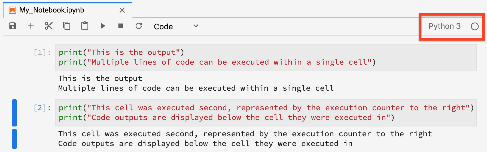
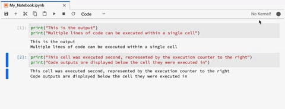

# [!DNL JupyterLab] Panoramica dell’interfaccia utente

[!DNL JupyterLab] è un’interfaccia utente basata su web per [Jupyter progetto](https://jupyter.org/) ed è strettamente integrato con Adobe Experience Platform. Fornisce un ambiente di sviluppo interattivo per consentire ai data scientist di lavorare con Jupyter Notebooks, codice e dati.

Questo documento fornisce una panoramica di [!DNL JupyterLab] e le relative funzioni, nonché le istruzioni per eseguire azioni comuni.

## [!DNL JupyterLab] su [!DNL Experience Platform]

L&#39;integrazione di Experience Platform con JupyterLab è accompagnata da modifiche architetturali, considerazioni di progettazione, estensioni per notebook personalizzate, librerie preinstallate e un&#39;interfaccia a tema Adobe.

L’elenco seguente illustra alcune delle funzioni esclusive di JupyterLab su Platform:

| Funzione | Descrizione |
| --- | --- |
| **Kernel** | I kernel forniscono notebook e altro [!DNL JupyterLab] front-end per la possibilità di eseguire e introdurre il codice in diversi linguaggi di programmazione. [!DNL Experience Platform] fornisce kernel aggiuntivi per supportare lo sviluppo in [!DNL Python], R, PySpark e [!DNL Spark]. Consulta la [kernel](#kernels) per ulteriori dettagli. |
| **Accesso ai dati** | Accedere ai set di dati esistenti direttamente da [!DNL JupyterLab] con supporto completo per le funzionalità di lettura e scrittura. |
| **[!DNL Platform]integrazione dei servizi** | Le integrazioni integrate consentono di utilizzare altri [!DNL Platform] servizi direttamente dall’interno di [!DNL JupyterLab]. Un elenco completo delle integrazioni supportate è disponibile nella sezione su [Integrazione con altri servizi Platform](#service-integration). |
| **Autenticazione** | Oltre a <a href="https://jupyter-notebook.readthedocs.io/en/stable/security.html" target="_blank">Modello di sicurezza integrato di JupyterLab</a>, ogni interazione tra l’applicazione e l’Experience Platform, inclusa la comunicazione tra servizi e piattaforme, viene crittografata e autenticata tramite <a href="https://www.adobe.io/authentication/auth-methods.html" target="_blank">[!DNL Adobe Identity Management System] (IMS)</a>. |
| **Librerie di Sviluppo** | In entrata [!DNL Experience Platform], [!DNL JupyterLab] fornisce librerie preinstallate per [!DNL Python], R e PySpark. Consulta la [appendice](#supported-libraries) per un elenco completo delle librerie supportate. |
| **Controller libreria** | Quando le librerie preinstallate non sono sufficienti per le tue esigenze, è possibile installare librerie aggiuntive per Python e R, che vengono temporaneamente archiviate in contenitori isolati per mantenere l’integrità di [!DNL Platform] e mantenere i dati al sicuro. Consulta la [kernel](#kernels) per ulteriori dettagli. |

>[!NOTE]
>
>Le librerie aggiuntive sono disponibili solo per la sessione in cui sono state installate. È necessario reinstallare tutte le librerie aggiuntive necessarie all&#39;avvio di nuove sessioni.

## Integrazione con altri [!DNL Platform] servizi {#service-integration}

La standardizzazione e l&#39;interoperabilità sono concetti chiave alla base di [!DNL Experience Platform]. L&#39;integrazione di [!DNL JupyterLab] il [!DNL Platform] come IDE incorporato consente di interagire con altri [!DNL Platform] servizi, che consentono di utilizzare [!DNL Platform] al suo pieno potenziale. I seguenti elementi [!DNL Platform] I servizi sono disponibili in [!DNL JupyterLab]:

* **[!DNL Catalog Service]:** Accedi ed esplora i set di dati con funzionalità di lettura e scrittura.
* **[!DNL Query Service]:** Consente di accedere ed esplorare i set di dati utilizzando SQL, riducendo i costi generali di accesso ai dati quando si gestiscono grandi quantità di dati.
* **[!DNL Sensei ML Framework]:** Sviluppo di modelli con la possibilità di addestrare e valutare i dati, nonché creazione di ricette con un solo clic.
* **[!DNL Experience Data Model (XDM)]:** La standardizzazione e l&#39;interoperabilità sono concetti chiave alla base di Adobe Experience Platform. [Experience Data Model (XDM)](https://www.adobe.com/go/xdm-home-en), guidato da un Adobe, è un tentativo di standardizzare i dati sull’esperienza del cliente e definire schemi per la gestione della customer experience.

>[!NOTE]
>
>Alcuni [!DNL Platform] integrazioni di servizi su [!DNL JupyterLab] sono limitati a kernel specifici. Consulta la sezione su [kernel](#kernels) per ulteriori dettagli.

## Funzioni principali e operazioni comuni

Informazioni sulle caratteristiche principali di [!DNL JupyterLab] e le istruzioni per l’esecuzione di operazioni comuni sono fornite nelle sezioni seguenti:

* [Accedi a JupyterLab](#access-jupyterlab)
* [Interfaccia JupyterLab](#jupyterlab-interface)
* [Celle di codice](#code-cells)
* [Kernel](#kernels)
* [Sessioni kernel](#kernel-sessions)
* [Modulo di avvio](#launcher)

### Accedere ad [!DNL JupyterLab] {#access-jupyterlab}

In entrata [Adobe Experience Platform](https://platform.adobe.com), seleziona **[!UICONTROL Notebook]** dalla colonna di navigazione a sinistra. Dedica un po&#39; di tempo a [!DNL JupyterLab] per inizializzare completamente.

### [!DNL JupyterLab] interfaccia {#jupyterlab-interface}

Il [!DNL JupyterLab] L&#39;interfaccia è costituita da una barra dei menu, da una barra laterale a sinistra comprimibile e dall&#39;area di lavoro principale contenente schede di documenti e attività.

**Barra dei menu**

La barra dei menu nella parte superiore dell’interfaccia dispone di menu di livello superiore che espongono le azioni disponibili in [!DNL JupyterLab] con le relative scelte rapide da tastiera:

* **File:** Azioni relative a file e directory
* **Modifica:** Azioni relative alla modifica di documenti e altre attività
* **Visualizza:** Azioni che modificano l&#39;aspetto di [!DNL JupyterLab]
* **Esegui:** Azioni per l’esecuzione del codice in attività diverse, ad esempio notebook e console di codice
* **Kernel:** Azioni per la gestione dei kernel
* **Schede:** Elenco di documenti e attività aperti
* **Impostazioni:** Impostazioni comuni e un editor di impostazioni avanzate
* **Guida:** Un elenco di [!DNL JupyterLab] e i collegamenti della guida del kernel

**Barra laterale a sinistra**

La barra laterale a sinistra contiene schede selezionabili che consentono di accedere alle seguenti funzioni:

* **Browser file:** Elenco di documenti e directory salvati per il blocco appunti
* **Data Explorer:** Sfogliare, accedere ed esplorare set di dati e schemi
* **kernel e terminali in funzione:** Un elenco di sessioni attive del kernel e del terminale con la possibilità di terminare
* **Comandi:** Elenco di comandi utili
* **Ispettore celle:** Editor di celle che consente di accedere a strumenti e metadati utili per la configurazione di un blocco appunti a scopo di presentazione
* **schede:** Elenco di schede aperte

Seleziona una scheda per esporne le funzioni o fai clic su una scheda espansa per comprimere la barra laterale a sinistra, come illustrato di seguito:

**Area di lavoro principale**

L&#39;area di lavoro principale in [!DNL JupyterLab] consente di disporre documenti e altre attività in pannelli di schede che possono essere ridimensionati o suddivisi. Trascinare una scheda al centro di un pannello di tabulazione per migrare la scheda. Dividi un pannello trascinando una scheda a sinistra, a destra, in alto o in basso nel pannello:

### Configurazione di GPU e server di memoria in [!DNL Python]/R

In entrata [!DNL JupyterLab] seleziona l’icona ingranaggio nell’angolo in alto a destra per aprire *Configurazione del server notebook*. È possibile attivare la GPU e allocare la quantità di memoria necessaria utilizzando il dispositivo di scorrimento. La quantità di memoria che è possibile allocare dipende da quanto è stato eseguito il provisioning dell’organizzazione. Seleziona **[!UICONTROL Aggiorna configurazioni]** per salvare.

>[!NOTE]
>
>Per i notebook viene eseguito il provisioning di una sola GPU per organizzazione. Se la GPU è in uso, è necessario attendere che l&#39;utente che ha prenotato la GPU la rilasci. Questa operazione può essere eseguita disconnettendosi o lasciando la GPU inattiva per quattro o più ore.

### Termina e riavvia [!DNL JupyterLab]

In entrata [!DNL JupyterLab], puoi terminare la sessione per impedire l’utilizzo di ulteriori risorse. Per iniziare, seleziona la **icona di alimentazione** , quindi seleziona **[!UICONTROL Arresta]** dal popover che sembra terminare la sessione. Le sessioni del notebook terminano automaticamente dopo 12 ore di assenza di attività.

Per riavviare [!DNL JupyterLab], seleziona la **icona Riavvia**  posizionato direttamente a sinistra dell&#39;icona di alimentazione, quindi selezionare **[!UICONTROL Riavvia]** dal popover visualizzato.

### Celle di codice {#code-cells}

Le celle di codice sono il contenuto principale dei notebook. Contengono codice sorgente nel linguaggio del kernel associato al blocco appunti e l&#39;output risultante dall&#39;esecuzione della cella del codice. A destra di ogni cella di codice che rappresenta l&#39;ordine di esecuzione viene visualizzato un conteggio di esecuzione.

Le azioni comuni delle celle sono descritte di seguito:

* **Aggiungi una cella:** Fare clic sul simbolo più (**+**) dal menu del blocco appunti per aggiungere una cella vuota. Le nuove celle vengono posizionate sotto la cella con cui si sta interagendo o alla fine del blocco appunti se non è attiva alcuna cella particolare.

* **Spostare una cella:** Posizionare il cursore a destra della cella che si desidera spostare, quindi fare clic e trascinare la cella in una nuova posizione. Inoltre, se si sposta una cella da un blocco appunti a un altro, la cella viene replicata insieme al relativo contenuto.

* **Eseguire una cella:** Fare clic sul corpo della cella che si desidera eseguire, quindi fare clic sul pulsante **play** icona (**▶**) dal menu del notebook. Un asterisco (**\***) viene visualizzato nel contatore di esecuzione della cella quando il kernel sta elaborando l&#39;esecuzione e viene sostituito con un numero intero al termine.

* **Elimina cella:** Fare clic sul corpo della cella che si desidera eliminare e quindi fare clic sul pulsante **forbice** icona.

### Kernel {#kernels}

I kernel per notebook sono i motori di elaborazione specifici per il linguaggio per l&#39;elaborazione di celle per notebook. Oltre a [!DNL Python], [!DNL JupyterLab] fornisce supporto linguistico aggiuntivo in R, PySpark e [!DNL Spark] (Scala). Quando si apre un documento blocco appunti, viene avviato il kernel associato. Quando viene eseguita una cella del notebook, il kernel esegue il calcolo e produce risultati che possono richiedere notevoli risorse di CPU e memoria. Si noti che la memoria allocata non viene liberata fino alla chiusura del kernel.

Alcune caratteristiche e funzionalità sono limitate a determinati kernel come descritto nella tabella seguente:

| Kernel | Supporto per l&#39;installazione della libreria | [!DNL Platform] integrazioni |
| :----: | :--------------------------: | :-------------------- |
| **[!DNL Python]** | Sì | <ul><li>[!DNL Sensei ML Framework]</li><li>[!DNL Catalog Service]</li><li>[!DNL Query Service]</li></ul> |
| **R** | Sì | <ul><li>[!DNL Sensei ML Framework]</li><li>[!DNL Catalog Service]</li></ul> |
| **Scala** | No | <ul><li>[!DNL Sensei ML Framework]</li><li>[!DNL Catalog Service]</li></ul> |

### Sessioni kernel {#kernel-sessions}

Ogni blocco appunti o attività attiva [!DNL JupyterLab] utilizza una sessione kernel. Per trovare tutte le sessioni attive, espandi la sezione **Terminali e kernel in funzione** dalla barra laterale a sinistra. Il tipo e lo stato del kernel di un notebook possono essere identificati osservando la parte superiore destra dell&#39;interfaccia del notebook. Nel diagramma seguente, il kernel associato al notebook è **[!DNL Python]3** e il suo stato attuale è rappresentato da un cerchio grigio a destra. Un cerchio cavo implica un kernel inattivo e un cerchio solido implica un kernel occupato.

Se il kernel è spento o inattivo per un periodo prolungato, **Nessun kernel.** viene visualizzato con un cerchio continuo. Attivate un kernel facendo clic sullo stato del kernel e selezionando il tipo di kernel appropriato come mostrato di seguito:

### Modulo di avvio {#launcher}

[//]: # (Talk about the different Notebooks, introduce that certain starter notebooks are limited to particular kernels)

Il personalizzato *Modulo di avvio* fornisce utili modelli di notebook per i kernel supportati, utili per avviare l&#39;attività, tra cui:

| Modello | Descrizione |
| --- | --- |
| Vuoto | Un file del blocco appunti vuoto. |
| Starter | Un notebook precompilato che illustra l’esplorazione dei dati utilizzando dati di esempio. |
| Vendite al dettaglio | Un notebook pre-riempito con [ricetta di vendita al dettaglio](../pre-built-recipes/retail-sales.md) utilizzando dati di esempio. |
| Generatore di ricette | Un modello di blocco appunti per la creazione di una ricetta in [!DNL JupyterLab]. È precompilata con codice e commento che illustra e descrive il processo di creazione della ricetta. Consulta la sezione [tutorial da notebook a ricetta](https://www.adobe.com/go/data-science-create-recipe-notebook-tutorial-en) per una procedura dettagliata. |
| [!DNL Query Service] | Un notebook preriempito che illustra l&#39;utilizzo di [!DNL Query Service] direttamente in [!DNL JupyterLab] con flussi di lavoro di esempio forniti che analizzano i dati su larga scala. |
| Eventi XDM | Un blocco appunti precompilato che illustra l’esplorazione dei dati sui dati post-valore di Experience Event, concentrandosi sulle funzioni comuni all’intera struttura di dati. |
| Query XDM | Un blocco appunti precompilato che illustra query di business di esempio sui dati di Experience Event. |
| Aggregazione | Un notebook precompilato che illustra flussi di lavoro di esempio per aggregare grandi quantità di dati in blocchi più piccoli e gestibili. |
| Clustering | Un notebook precompilato che illustra il processo di modellazione dell’apprendimento automatico end-to-end tramite algoritmi di clustering. |

Alcuni modelli di notebook sono limitati a determinati kernel. La disponibilità del modello per ciascun kernel è mappata nella tabella seguente:

<table>
    <tr>
        <td></td>
        <th><strong>Vuoto</strong></th>
        <th><strong>Starter</strong></th>
        <th><strong>Vendite al dettaglio</strong></th>
        <th><strong>Generatore di ricette</strong></th>
        <th><strong>[!DNL Query Service]</strong></th>
        <th><strong>Eventi XDM</strong></th>
        <th><strong>Query XDM</strong></th>
        <th><strong>Aggregazione</strong></th>
        <th><strong>Clustering</strong></th>
    </tr>
    <tr>
        <th><strong>[!DNL Python]</strong></th>
        <td >sì</td>
        <td >sì</td>
        <td >sì</td>
        <td >sì</td>
        <td >sì</td>
        <td >sì</td>
        <td >no</td>
        <td >no</td>
        <td >no</td>
    </tr>
    <tr>
        <th ><strong>R</strong></th>
        <td >sì</td>
        <td >sì</td>
        <td >sì</td>
        <td >no</td>
        <td >no</td>
        <td >no</td>
        <td >no</td>
        <td >no</td>
        <td >no</td>
    </tr>
      <tr>
        <th  ><strong>PySpark 3 ([!DNL Spark] 2.4)</strong></th>
        <td >no</td>
        <td >sì</td>
        <td >no</td>
        <td >no</td>
        <td >no</td>
        <td >no</td>
        <td >sì</td>
        <td >sì</td>
        <td >no</td>
    </tr>
    <tr>
        <th ><strong>Scala</strong></th>
        <td >sì</td>
        <td >sì</td>
        <td >no</td>
        <td >no</td>
        <td >no</td>
        <td >no</td>
        <td >no</td>
        <td >no</td>
        <td >sì</td>
    </tr>
</table>

Per aprire un nuovo *Modulo di avvio*, fai clic su **File > Nuovo modulo di avvio**. In alternativa, espandere **Browser file** dalla barra laterale sinistra e fare clic sul simbolo più (**+**):

## Passaggi successivi

Per ulteriori informazioni su ciascuno dei notebook supportati e su come utilizzarli, visitare il [Accesso ai dati dei notebook Jupyterlab](./access-notebook-data.md) guida per gli sviluppatori. Questa guida illustra come utilizzare i notebook JupyterLab per accedere ai dati, incluse le operazioni di lettura, scrittura e query. La guida all&#39;accesso ai dati contiene inoltre informazioni sulla quantità massima di dati che può essere letta da ogni blocco appunti supportato.

## Librerie supportate {#supported-libraries}

Per un elenco dei pacchetti supportati in Python, R e PySpark, copia e incolla `!conda list` in una nuova cella, quindi eseguirla. Un elenco di pacchetti supportati viene compilato in ordine alfabetico.

Inoltre, vengono utilizzate le dipendenze seguenti, ma non elencate:
* CUDA 11,2
* CUDNN 8.1

