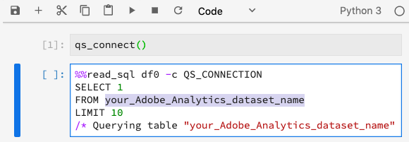

# Servizio query nel blocco appunti Jupyter

[!DNL Adobe Experience Platform] consente di utilizzare SQL (Structured Query Language) in  [!DNL Data Science Workspace] integrando  [!DNL Query Service] in  [!DNL JupyterLab] come funzionalità standard.

Questa esercitazione illustra query SQL di esempio per casi d&#39;uso comuni per esplorare, trasformare e analizzare i dati [!DNL Adobe Analytics].

## Introduzione

Prima di avviare questa esercitazione, è necessario disporre dei seguenti prerequisiti:

- Accesso a [!DNL Adobe Experience Platform]. Se non hai accesso a un&#39;organizzazione IMS in [!DNL Experience Platform], rivolgiti all&#39;amministratore di sistema prima di procedere

- Un set di dati [!DNL Adobe Analytics]

- Informazioni sui seguenti concetti chiave utilizzati in questa esercitazione:
   - [[!DNL Experience Data Model (XDM) and XDM System]](../../xdm/home.md)
   - [[!DNL Query Service]](../../query-service/home.md)
   - [[!DNL Query Service SQL Syntax]](../../query-service/sql/overview.md)
   - Adobe Analytics

## Accedi a [!DNL JupyterLab] e [!DNL Query Service] {#access-jupyterlab-and-query-service}

1. In [[!DNL Experience Platform]](https://platform.adobe.com), passa a **[!UICONTROL Notebooks]** dalla colonna di navigazione a sinistra. Consenti il caricamento di JupyterLab.

   

   >[!NOTE]
   >
   >Se una nuova scheda Launcher non viene visualizzata automaticamente, apri una nuova scheda Launcher facendo clic su **[!UICONTROL File]**, quindi seleziona **[!UICONTROL New Launcher]**.

2. Nella scheda Avvio fare clic sull&#39;icona **[!UICONTROL Blank]** in un ambiente Python 3 per aprire un blocco appunti vuoto.

   

   >[!NOTE]
   >
   >Python 3 è attualmente l’unico ambiente supportato per Query Service nei notebook.

3. Nella barra di selezione a sinistra, fai clic sull’icona **[!UICONTROL Data]** e fai doppio clic sulla directory **[!UICONTROL Datasets]** per elencare tutti i set di dati.

   

4. Trova un set di dati [!DNL Adobe Analytics] da esplorare e fai clic con il pulsante destro del mouse sull&#39;elenco, fai clic su **[!UICONTROL Query Data in Notebook]** per generare query SQL nel blocco appunti vuoto.

5. Fare clic sulla prima cella generata contenente la funzione `qs_connect()` ed eseguirla facendo clic sul pulsante di riproduzione. Questa funzione crea una connessione tra l&#39;istanza del blocco appunti e il [!DNL Query Service].

   

6. Copia il nome del set di dati [!DNL Adobe Analytics] dalla seconda query SQL generata, che sarà il valore dopo `FROM`.

   

7. Inserire una nuova cella del blocco appunti facendo clic sul pulsante **+**.

   

8. Copia, incolla ed esegui le seguenti istruzioni di importazione in una nuova cella. Queste istruzioni verranno utilizzate per visualizzare i dati:

   ```python
   import plotly.plotly as py
   import plotly.graph_objs as go
   from plotly.offline import iplot
   ```

9. Quindi, copia e incolla le seguenti variabili in una nuova cella. Modifica i loro valori in base alle esigenze, quindi eseguili.

   ```python
   target_table = "your Adobe Analytics dataset name"
   target_year = "2019"
   target_month = "04"
   target_day = "01"
   ```

   - `target_table` : Nome del  [!DNL Adobe Analytics] set di dati.
   - `target_year` : Anno specifico da cui provengono i dati di destinazione.
   - `target_month` : Mese specifico da cui proviene il target.
   - `target_day` : Giorno specifico da cui provengono i dati di destinazione.

   >[!NOTE]
   >
   >Puoi modificare questi valori in qualsiasi momento. In questo modo, assicurati di eseguire la cella delle variabili per le modifiche da applicare.

## Query dei dati {#query-your-data}

Immettere le seguenti query SQL nelle singole celle del blocco appunti. Per eseguire una query, seleziona la cella corrispondente e fai clic sul pulsante **[!UICONTROL play]** . Sotto la cella eseguita vengono visualizzati i risultati delle query o i registri degli errori riusciti.

Quando un blocco appunti è inattivo per un periodo di tempo prolungato, la connessione tra il blocco appunti e [!DNL Query Service] potrebbe interrompersi. In questi casi, riavviare [!DNL JupyterLab] selezionando il pulsante **Restart**  situato nell&#39;angolo in alto a destra accanto al pulsante di alimentazione.

Il kernel del blocco appunti viene reimpostato ma le celle rimarranno, eseguire nuovamente tutte le celle per continuare dove si era lasciato fuori.

### Numero di visitatori orari {#hourly-visitor-count}

La seguente query restituisce il conteggio dei visitatori orari per una data specificata:

#### Query

```sql
%%read_sql hourly_visitor -c QS_CONNECTION
SELECT Substring(timestamp, 1, 10)                               AS Day,
       Substring(timestamp, 12, 2)                               AS Hour, 
       Count(DISTINCT concat(enduserids._experience.aaid.id, 
                             _experience.analytics.session.num)) AS Visit_Count 
FROM   {target_table}
WHERE TIMESTAMP = to_timestamp('{target_year}-{target_month}-{target_day}')
GROUP  BY Day, Hour
ORDER  BY Hour;
```

Nella query precedente, la marca temporale nella clausola `WHERE` è impostata sul valore di `target_year`. Includi le variabili nelle query SQL contandole tra parentesi graffe (`{}`).

La prima riga della query contiene la variabile opzionale `hourly_visitor`. I risultati della query verranno memorizzati in questa variabile come dataframe di dati Pandas. L’archiviazione dei risultati in un dataframe consente di visualizzare in seguito i risultati della query utilizzando un pacchetto [!DNL Python] desiderato. Esegui il seguente codice [!DNL Python] in una nuova cella per generare un grafico a barre:

```python
trace = go.Bar(
    x = hourly_visitor['Hour'],
    y = hourly_visitor['Visit_Count'],
    name = "Visitor Count"
)
layout = go.Layout(
    title = 'Visit Count by Hour of Day',
    width = 1200,
    height = 600,
    xaxis = dict(title = 'Hour of Day'),
    yaxis = dict(title = 'Count')
)
fig = go.Figure(data = [trace], layout = layout)
iplot(fig)
```

### Conteggio attività orario {#hourly-activity-count}

La seguente query restituisce il conteggio delle azioni orarie per una data specificata:

#### Query <!-- omit in toc -->

```sql
%%read_sql hourly_actions -d -c QS_CONNECTION
SELECT Substring(timestamp, 1, 10)                        AS Day,
       Substring(timestamp, 12, 2)                        AS Hour, 
       Count(concat(enduserids._experience.aaid.id, 
                    _experience.analytics.session.num,
                    _experience.analytics.session.depth)) AS Count 
FROM   {target_table}
WHERE TIMESTAMP = to_timestamp('{target_year}-{target_month}-{target_day}')
GROUP  BY Day, Hour
ORDER  BY Hour;
```

L’esecuzione della query di cui sopra memorizzerà i risultati in `hourly_actions` come dataframe. Esegui la seguente funzione in una nuova cella per visualizzare in anteprima i risultati:

```python
hourly_actions.head()
```

La query di cui sopra può essere modificata per restituire il conteggio delle azioni orarie per un intervallo di date specificato utilizzando gli operatori logici nella clausola **WHERE** :

#### Query <!-- omit in toc -->

```sql
%%read_sql hourly_actions_date_range -d -c QS_CONNECTION
SELECT Substring(timestamp, 1, 10)                        AS Day,
       Substring(timestamp, 12, 2)                        AS Hour, 
       Count(concat(enduserids._experience.aaid.id, 
                    _experience.analytics.session.num,
                    _experience.analytics.session.depth)) AS Count 
FROM   {target_table}
WHERE  timestamp >= TO_TIMESTAMP('2019-06-01 00', 'YYYY-MM-DD HH')
       AND timestamp <= TO_TIMESTAMP('2019-06-02 23', 'YYYY-MM-DD HH')
GROUP  BY Day, Hour
ORDER  BY Hour;
```

L’esecuzione della query modificata memorizza i risultati in `hourly_actions_date_range` come dataframe. Esegui la seguente funzione in una nuova cella per visualizzare in anteprima i risultati:

```python
hourly_actions_date_rage.head()
```

### Numero di eventi per sessione visitatore {#number-of-events-per-visitor-session}

La seguente query restituisce il numero di eventi per sessione visitatore per una data specificata:

#### Query <!-- omit in toc -->

```sql
%%read_sql events_per_session -c QS_CONNECTION
SELECT concat(enduserids._experience.aaid.id, 
              '-#', 
              _experience.analytics.session.num) AS aaid_sess_key, 
       Count(timestamp)                          AS Count 
FROM   {target_table}
WHERE TIMESTAMP = to_timestamp('{target_year}-{target_month}-{target_day}')
GROUP BY aaid_sess_key
ORDER BY Count DESC;
```

Esegui il seguente codice [!DNL Python] per generare un istogramma per il numero di eventi per sessione di visita:

```python
data = [go.Histogram(x = events_per_session['Count'])]

layout = go.Layout(
    title = 'Histogram of Number of Events per Visit Session',
    xaxis = dict(title = 'Number of Events'),
    yaxis = dict(title = 'Count')
)

fig = go.Figure(data = data, layout = layout)
iplot(fig)
```

### Pagine popolari per un dato giorno {#popular-pages-for-a-given-day}

La seguente query restituisce le dieci pagine più popolari per una data specificata:

#### Query <!-- omit in toc -->

```sql
%%read_sql popular_pages -c QS_CONNECTION
SELECT web.webpagedetails.name                 AS Page_Name, 
       Sum(web.webpagedetails.pageviews.value) AS Page_Views 
FROM   {target_table}
WHERE TIMESTAMP = to_timestamp('{target_year}-{target_month}-{target_day}')
GROUP  BY web.webpagedetails.name 
ORDER  BY page_views DESC 
LIMIT  10;
```

### Utenti attivi per un dato giorno {#active-users-for-a-given-day}

La seguente query restituisce i dieci utenti più attivi per una data specificata:

#### Query <!-- omit in toc -->

```sql
%%read_sql active_users -c QS_CONNECTION
SELECT enduserids._experience.aaid.id AS aaid, 
       Count(timestamp)               AS Count
FROM   {target_table}
WHERE TIMESTAMP = to_timestamp('{target_year}-{target_month}-{target_day}')
GROUP  BY aaid
ORDER  BY Count DESC
LIMIT  10;
```

### Città attive per attività dell&#39;utente {#active-cities-by-user-activity}

La seguente query restituisce le dieci città che generano la maggior parte delle attività utente per una data specificata:

#### Query <!-- omit in toc -->

```sql
%%read_sql active_cities -c QS_CONNECTION
SELECT concat(placeContext.geo.stateProvince, ' - ', placeContext.geo.city) AS state_city, 
       Count(timestamp)                                                     AS Count
FROM   {target_table}
WHERE TIMESTAMP = to_timestamp('{target_year}-{target_month}-{target_day}')
GROUP  BY state_city
ORDER  BY Count DESC
LIMIT  10;
```

## Passaggi successivi

Questa esercitazione illustra alcuni esempi di casi di utilizzo di [!DNL Query Service] nei notebook [!DNL Jupyter]. Segui l&#39;esercitazione [Analizza i tuoi dati utilizzando Jupyter Notebooks](./analyze-your-data.md) per vedere come vengono eseguite operazioni simili utilizzando l&#39;SDK per l&#39;accesso ai dati.
