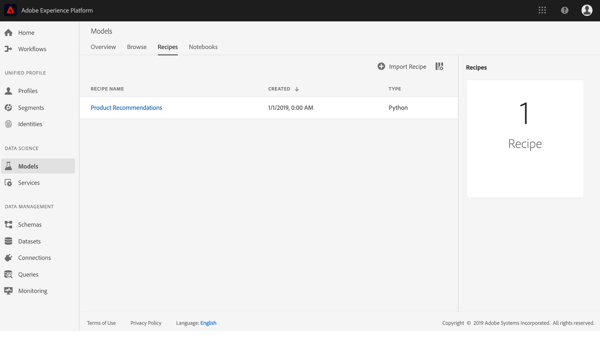
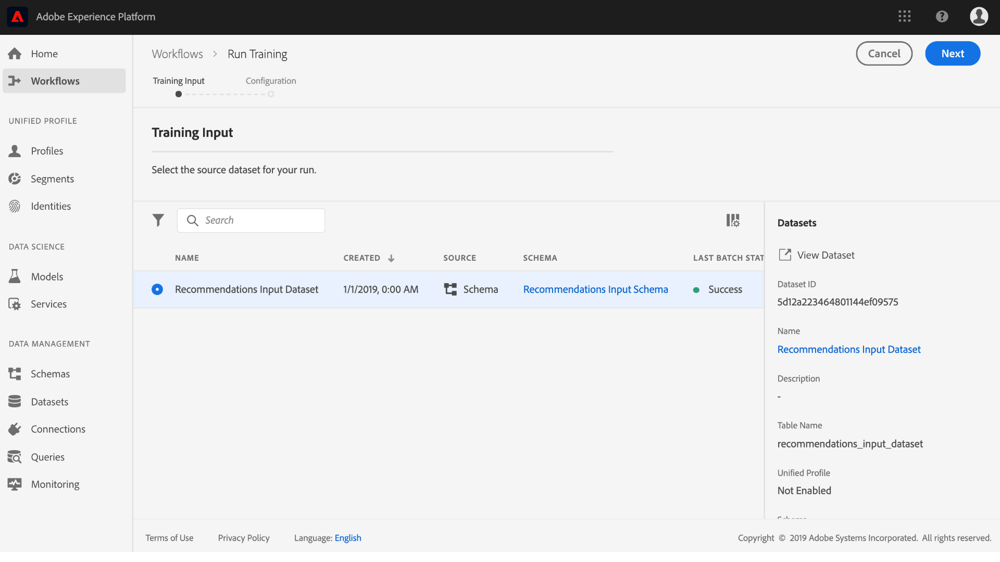
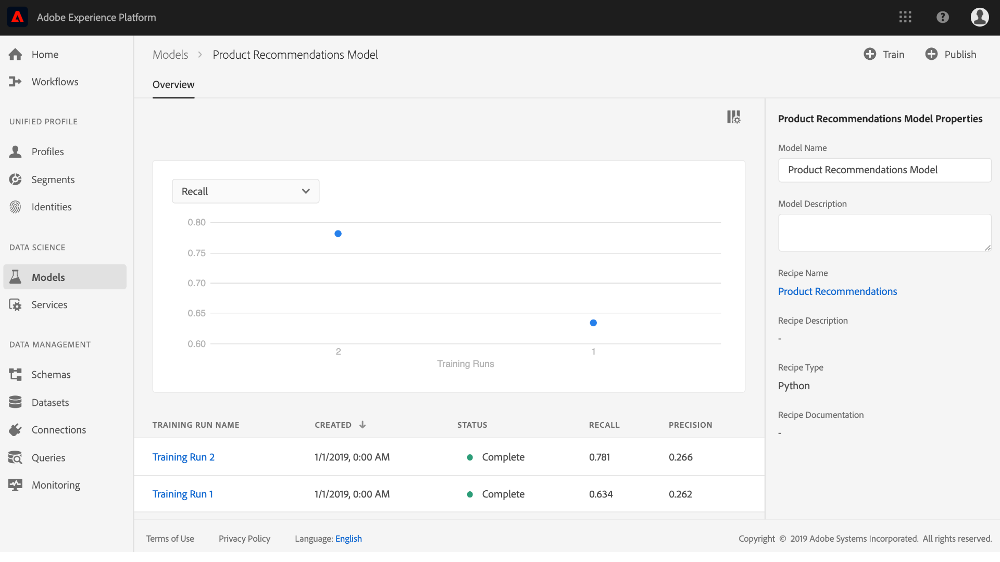

# Creazione e pubblicazione di un modello di machine learning

Fingi di possedere un sito web di vendita online. Quando i clienti effettuano acquisti sul sito Web del cliente, è necessario presentare loro raccomandazioni personalizzate per presentare una serie di altri prodotti offerti dal cliente. Nel corso dell&#39;esistenza del sito Web, hai raccolto continuamente i dati dei clienti e vuoi in qualche modo utilizzare questi dati per generare raccomandazioni di prodotto personalizzate.

[!DNL Adobe Experience Platform] [!DNL Data Science Workspace] fornisce i mezzi per raggiungere il vostro obiettivo utilizzando la [Product Recommendations Recipe](../pre-built-recipes/product-recommendations.md)precostruita. Segui questa esercitazione per scoprire come accedere e comprendere i dati di vendita al dettaglio, creare e ottimizzare un modello di apprendimento automatico e generare informazioni approfondite in [!DNL Data Science Workspace].

Questa esercitazione riflette il flusso di lavoro di [!DNL Data Science Workspace]e illustra i seguenti passaggi per la creazione di un modello di apprendimento automatico:

1. [Preparare i dati](#prepare-your-data)
2. [Creazione del modello](#author-your-model)
3. [Formazione e valutazione del modello](#train-and-evaluate-your-model)
4. [Operazionalizzare il modello](#operationalize-your-model)

## Introduzione

Prima di iniziare questa esercitazione, è necessario disporre dei seguenti prerequisiti:

* Accesso a [!DNL Adobe Experience Platform]. Se non disponete dell&#39;accesso a un&#39;organizzazione IMS in [!DNL Experience Platform], rivolgetevi all&#39;amministratore di sistema prima di procedere.

* Risorse di abilitazione. Rivolgetevi al rappresentante commerciale di riferimento per richiedere il provisioning dei seguenti elementi.
   * Recommendations Recipe
   * Set di dati di input Recommendations
   * Schema di input Recommendations
   * Set di dati di output Recommendations
   * Schema di output Recommendations
   * Golden Data Set postValues
   * Schema set di dati dorati

* Scaricate i tre [!DNL Jupyter Notebook] file richiesti dall&#39; <a href="https://github.com/adobe/experience-platform-dsw-reference/tree/master/Summit/2019/resources/Notebooks-Thurs" target="_blank">[!DNL Git] archivio</a>pubblico del Adobe, che verranno utilizzati per illustrare il [!DNL JupyterLab] flusso di lavoro in [!DNL Data Science Workspace].

* Una conoscenza approfondita dei seguenti concetti chiave utilizzati in questa esercitazione:
   * [!DNL Experience Data Model](../../xdm/home.md): Lo sforzo di standardizzazione condotto da  Adobe per definire schemi standard come [!DNL Profile] e ExperienceEvent per la gestione dell&#39;esperienza cliente.
   * Set di dati: Un costrutto di storage e gestione per i dati effettivi. Un&#39;istanza fisica istanziata di uno schema XDM.
   * Batch: I set di dati sono costituiti da batch. Un batch è un insieme di dati raccolti in un periodo di tempo ed elaborati insieme come un&#39;unica unità.
   * [!DNL JupyterLab]: [!DNL JupyterLab](https://blog.jupyter.org/jupyterlab-is-ready-for-users-5a6f039b8906) è un&#39;interfaccia Web open-source per Project [!DNL Jupyter] ed è strettamente integrata in [!DNL Experience Platform].

## Prepare your data {#prepare-your-data}

Per creare un modello di machine learning che fornisca ai clienti raccomandazioni personalizzate sui prodotti, è necessario analizzare i precedenti acquisti sul sito Web. In questa sezione viene spiegato in che modo questi dati vengono assimilati [!DNL Platform] attraverso [!DNL Adobe Analytics]e come vengono trasformati in un set di dati delle feature da utilizzare nel modello di apprendimento automatico.

### Esplorare i dati e comprendere gli schemi

1. Accedete ad [Adobe Experience Platform](https://platform.adobe.com/) e fate clic **[!UICONTROL Datasets]** per elencare tutti i set di dati esistenti e selezionate il set di dati da esplorare. In questo caso, il [!DNL Analytics] set di dati **Golden Data Set postValues**.
   
2. Seleziona **[!UICONTROL Preview Dataset]** vicino alla parte superiore destra per esaminare i record di esempio, quindi fai clic su **[!UICONTROL Close]**.
   
3. Selezionare il collegamento in Schema nella barra a destra per visualizzare lo schema per il dataset, quindi tornare alla pagina dei dettagli del dataset.&quot;
   

Gli altri set di dati sono stati precompilati con batch per la visualizzazione dell&#39;anteprima. È possibile visualizzare questi set di dati ripetendo i passaggi descritti sopra.

| Nome set di dati | Schema | Descrizione |
| ----- | ----- | ----- |
| Golden Data Set postValues | Golden Data Set, schema | [!DNL Analytics] i dati di origine del sito Web |
| Set di dati di input Recommendations | Schema di input Recommendations | I [!DNL Analytics] dati vengono trasformati in un set di dati per la formazione utilizzando una pipeline delle funzioni. Questi dati vengono utilizzati per formare il Modello di apprendimento automatico Recommendations prodotto. `itemid` e `userid` corrispondono a un prodotto acquistato da tale cliente. |
| Set di dati di output Recommendations | Schema di output Recommendations | Il dataset per il quale sono memorizzati i risultati del punteggio, conterrà l&#39;elenco dei prodotti consigliati per ogni cliente. |

## Creazione del modello {#author-your-model}

Il secondo componente del [!DNL Data Science Workspace] ciclo di vita prevede l’authoring di remix e modelli. Il prodotto Recommendations Recipe è progettato per generare raccomandazioni sui prodotti su larga scala utilizzando i dati di acquisto passati e l&#39;apprendimento automatico.

Le entrate sono la base per un modello in quanto contengono algoritmi di machine learning e logica progettati per risolvere problemi specifici. Ancora più importante, le entrate consentono di democratizzare l&#39;apprendimento automatico all&#39;interno dell&#39;organizzazione, consentendo ad altri utenti di accedere a un Modello per diversi casi di utilizzo senza scrivere alcun codice.

### Esplora il prodotto Recommendations Recipe

1. In [!DNL Adobe Experience Platform], andate **[!UICONTROL Models]** dalla colonna di navigazione a sinistra, quindi fate clic **[!UICONTROL Recipes]** in alto per visualizzare un elenco delle entrate disponibili per la vostra organizzazione.
   
2. Individuate e aprite il file fornito **[!UICONTROL Recommendations Recipe]** facendo clic sul suo nome.
   
3. Nella barra a destra, fate clic **[!UICONTROL Recommendations Input Schema]** per visualizzare lo schema che dà origine alla ricetta. I campi dello schema **[!UICONTROL itemId]** e **[!UICONTROL userId]** corrispondono a un prodotto acquistato (**[!UICONTROL interactionType]**) dal cliente in un momento (**[!UICONTROL timestamp]**) specifico. Seguire gli stessi passaggi per esaminare i campi per l&#39; **[!UICONTROL Recommendations Output Schema]**.
   

Sono stati revisionati gli schemi di input e output richiesti da Product Recommendations Recipe. È ora possibile continuare la sezione successiva per scoprire come creare, formare e valutare un modello Recommendations di prodotto.

## Formazione e valutazione del modello {#train-and-evaluate-your-model}

Ora che i dati sono preparati e la Ricetta è pronta per essere utilizzata, è possibile creare, formare e valutare il modello di apprendimento della macchina.

### Creare un modello

Un modello è un&#39;istanza di una ricetta, che consente di addestrare e segnare con i dati in scala.

1. In [!DNL Adobe Experience Platform], andate **[!UICONTROL Models]** dalla colonna di navigazione a sinistra, quindi fate clic **[!UICONTROL Recipes]** nella parte superiore della pagina per visualizzare un elenco di tutte le entrate disponibili per la vostra organizzazione.
   
2. Individuate e aprite il file fornito **[!UICONTROL Recommendations Recipe]** facendo clic sul suo nome, entrando nella pagina di panoramica della ricetta. Fate clic **[!UICONTROL Create a Model]** dal centro (se non sono presenti modelli) o dall&#39;alto a destra della pagina Panoramica ricetta.
   
3. Viene visualizzato un elenco dei set di dati di input disponibili per la formazione, selezionarli **[!UICONTROL Recommendations Input Dataset]** e fare clic su **[!UICONTROL Next]**.
   
4. Specificare un nome per il modello, ad esempio &quot;Modello Recommendations prodotto&quot;. Sono elencate le configurazioni disponibili per il modello, che contengono le impostazioni per i comportamenti di formazione e valutazione predefiniti del modello. Non sono necessarie modifiche in quanto queste configurazioni sono specifiche per la vostra organizzazione. Esaminate le configurazioni e fate clic su **[!UICONTROL Finish]**.
   
5. Il modello è stato creato e la pagina *Panoramica* del modello viene visualizzata all&#39;interno di un&#39;esecuzione di formazione appena generata. Per impostazione predefinita, durante la creazione di un modello viene generata un&#39;esecuzione di formazione.
   

Potete scegliere di attendere il completamento dell’esecuzione della formazione oppure continuare a creare una nuova esecuzione della formazione nella sezione seguente.

### Formazione del modello utilizzando i parametri ipertestuali personalizzati

1. Nella pagina Panoramica ** modello, fate clic **[!UICONTROL Train]** in alto a destra per creare una nuova esecuzione della formazione. Selezionare lo stesso set di dati di input utilizzato per creare il modello e fare clic su **[!UICONTROL Next]**.
   
2. Viene visualizzata la pagina *Configurazione* . Qui puoi configurare il **[!UICONTROL num_recommendations]** valore dell’esecuzione della formazione, noto anche come Hyperparameter. Un modello qualificato e ottimizzato utilizzerà i parametri Hyperparameters più performanti in base ai risultati dell&#39;esecuzione di formazione.

   I parametri ipertestuali non possono essere appresi, pertanto devono essere assegnati prima dell&#39;esecuzione della formazione. La regolazione dei parametri Hyperparameters può modificare la precisione del modello Tradotto. Poiché l&#39;ottimizzazione di un modello è un processo iterativo, prima di ottenere una valutazione soddisfacente possono essere necessarie più esecuzioni di formazione.

   >[!TIP]
   >
   >Set **[!UICONTROL num_recommendations]** to 10.

   
3. Una volta completata la nuova esecuzione della formazione, nel grafico di valutazione dei modelli verrà visualizzato un punto dati aggiuntivo. L&#39;operazione potrebbe richiedere fino a diversi minuti.
   

### Valutazione del modello

Ogni volta che un&#39;esecuzione di formazione viene completata, potete visualizzare le metriche di valutazione risultanti per determinare il livello di esecuzione del modello.

1. Esaminare le metriche di valutazione (precisione e recupero) per ogni esecuzione di formazione completata facendo clic sull’esecuzione della formazione.
2. Esplora le informazioni fornite per ogni metrica di valutazione. Più alte sono queste metriche, migliore sarà l&#39;esecuzione del modello.
   
3. Potete visualizzare i parametri di set di dati, schema e configurazione utilizzati per ogni formazione sulla barra a destra.
4. Tornate alla pagina Modello e individuate l’esecuzione di formazione con le prestazioni migliori osservando le relative metriche di valutazione.

## Operazionalizzare il modello {#operationalize-your-model}

Il passaggio finale del flusso di lavoro di Data Science consiste nell&#39;operazionalizzare il modello per ottenere un punteggio e acquisire informazioni dall&#39;archivio dati.

### Punteggio e generazione di approfondimenti

1. Nella pagina *Panoramica* modello di raccomandazioni prodotto, fate clic sul nome dell&#39;esecuzione di formazione con le prestazioni migliori, con i valori di richiamo e precisione più elevati.
2. In alto a destra della pagina dei dettagli dell’esecuzione della formazione, fate clic su **[!UICONTROL Score]**.
3. Selezionare **[!UICONTROL Recommendations Input Dataset]** come set di dati di input per il punteggio, che è lo stesso set di dati utilizzato al momento della creazione del modello ed esecuzione delle relative esecuzioni di formazione. Then, click **[!UICONTROL Next]**.
   
4. Selezionare il set **[!UICONTROL Recommendations Output Dataset]** di dati di output per il punteggio. I risultati del punteggio verranno memorizzati in questo dataset come batch.
   
5. Esaminare le configurazioni di punteggio. Questi parametri contengono i set di dati di input e output selezionati in precedenza insieme agli schemi appropriati. Fare clic **[!UICONTROL Finish]** per iniziare l&#39;esecuzione del punteggio. L&#39;esecuzione potrebbe richiedere alcuni minuti.
   

### Visualizzazione delle informazioni relative al punteggio

Una volta completata l&#39;esecuzione del punteggio, potrai visualizzare in anteprima i risultati e le informazioni generate.

1. Nella pagina delle esecuzioni del punteggio fare clic sull&#39;esecuzione del punteggio completato, quindi fare clic **[!UICONTROL Preview Scoring Results Dataset]** sulla barra a destra.
   
2. Nella tabella di anteprima, ogni riga contiene raccomandazioni sui prodotti per un cliente specifico, etichettate rispettivamente come **[!UICONTROL recommendations]** e **[!UICONTROL userId]** . Poiché il parametro **[!UICONTROL num_recommendations]** Hyperparameter è stato impostato su 10 nelle schermate di esempio, ciascuna riga di raccomandazioni può contenere fino a 10 identità di prodotto delimitate da un numero (#).
   

## Passaggi successivi {#next-steps}

Ben fatto, avete generato con successo le raccomandazioni sui prodotti!

Questa esercitazione illustra il flusso di lavoro di [!DNL Data Science Workspace], in cui viene illustrato come i dati non elaborati possono essere trasformati in informazioni utili grazie all&#39;apprendimento automatico. Per saperne di più sull&#39;utilizzo di [!DNL Data Science Workspace], continuare con la guida successiva sulla [creazione dello schema di vendita al dettaglio e del dataset](./create-retails-sales-dataset.md).