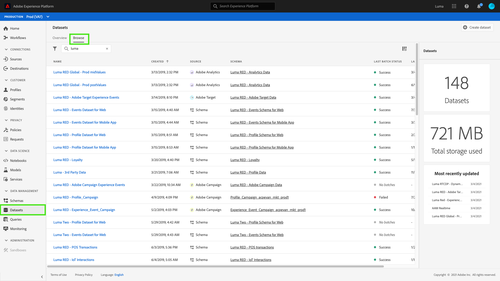
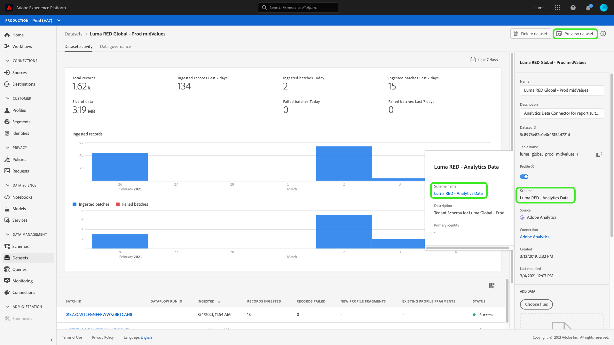
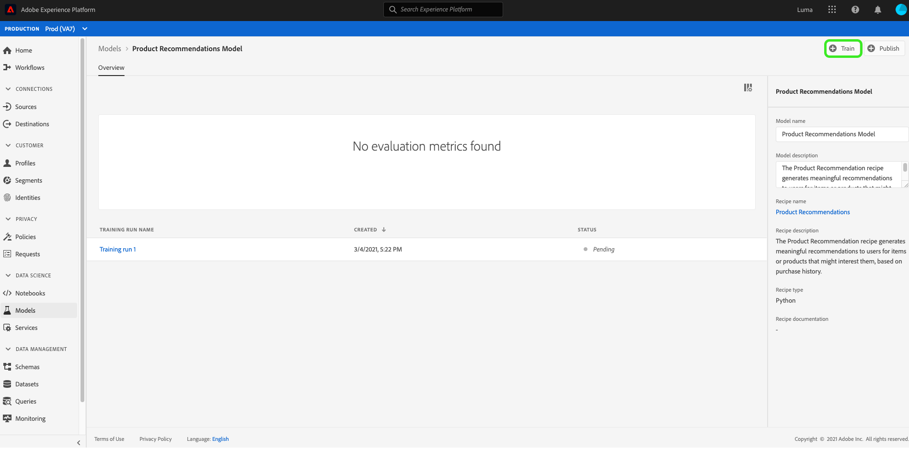

# Creare e pubblicare un modello di apprendimento automatico

Fingi di possedere un sito web online per la vendita al dettaglio. Quando i clienti acquistano il sito web per la vendita al dettaglio, desideri presentarli con consigli di prodotto personalizzati per esporre una varietà di altri prodotti offerti dalla tua azienda. Nel corso dell’esistenza del sito web, hai raccolto continuamente i dati dei clienti e desideri in qualche modo utilizzare tali dati per generare consigli sui prodotti personalizzati.

[!DNL Adobe Experience Platform] [!DNL Data Science Workspace] fornisce i mezzi per raggiungere il tuo obiettivo utilizzando la composizione predefinita del  [prodotto Recommendations](../pre-built-recipes/product-recommendations.md). Segui questa esercitazione per scoprire come accedere e comprendere i tuoi dati retail, creare e ottimizzare un modello di apprendimento automatico e generare informazioni in [!DNL Data Science Workspace].

Questa esercitazione riflette il flusso di lavoro di [!DNL Data Science Workspace] e descrive i seguenti passaggi per la creazione di un modello di apprendimento automatico:

1. [Preparare i dati](#prepare-your-data)
2. [Creare il modello](#author-your-model)
3. [Addestrare e valutare il modello](#train-and-evaluate-your-model)
4. [Operazionalizzare il modello](#operationalize-your-model)

## Introduzione

Prima di avviare questa esercitazione, è necessario disporre dei seguenti prerequisiti:

- Accesso a [!DNL Adobe Experience Platform]. Se non hai accesso a un&#39;organizzazione IMS in [!DNL Experience Platform], rivolgiti all&#39;amministratore di sistema prima di procedere.

- Risorse di abilitazione. Rivolgiti al rappresentante del tuo account per richiedere il provisioning dei seguenti elementi.
   - Ricetta Recommendations
   - Set di dati di ingresso Recommendations
   - Schema di input Recommendations
   - Set di dati di output Recommendations
   - Schema di output Recommendations
   - Set di dati dorati postValues
   - Schema set di dati dorati

- Scarica i tre file [!DNL Jupyter Notebook] richiesti dall&#39; [Adobe public [!DNL Git] repository](https://github.com/adobe/experience-platform-dsw-reference/tree/master/Summit/2019/resources/Notebooks-Thurs), che verranno utilizzati per dimostrare il flusso di lavoro [!DNL JupyterLab] in [!DNL Data Science Workspace].

Informazioni sui seguenti concetti chiave utilizzati in questa esercitazione:
- [[!DNL Experience Data Model]](../../xdm/home.md): Lo sforzo di standardizzazione condotto da Adobe per definire schemi standard come  [!DNL Profile] e ExperienceEvent per la gestione delle esperienze cliente.
- Set di dati: Un costrutto di storage e gestione per i dati effettivi. Un&#39;istanza fisica istanziata di uno [schema XDM](../../xdm/schema/field-dictionary.md).
- Batch: I set di dati sono costituiti da batch. Un batch è un insieme di dati raccolti in un periodo di tempo ed elaborati insieme come una singola unità.
- [!DNL JupyterLab]:  [[!DNL JupyterLab]](https://blog.jupyter.org/jupyterlab-is-ready-for-users-5a6f039b8906) è un’interfaccia web open-source per Project  [!DNL Jupyter] ed è strettamente integrata in  [!DNL Experience Platform].

## Prepara i dati {#prepare-your-data}

Per creare un modello di apprendimento automatico che consigli prodotti personalizzati ai clienti, è necessario analizzare gli acquisti precedenti sul sito web. Questa sezione esplora il modo in cui questi dati vengono acquisiti in [!DNL Platform] tramite [!DNL Adobe Analytics] e come tali dati vengono trasformati in un set di dati di funzionalità che deve essere utilizzato dal modello di apprendimento automatico.

### Esplorare i dati e comprendere gli schemi

Accedi a [Adobe Experience Platform](https://platform.adobe.com/) e seleziona **[!UICONTROL Datasets]** per elencare tutti i set di dati esistenti e seleziona il set di dati da esplorare. In questo caso, il [!DNL Analytics] set di dati **Golden Data Set postValues**.

Viene visualizzata la pagina dell’attività del set di dati, in cui sono elencate le informazioni relative al set di dati. Per esaminare i record di esempio, seleziona **[!UICONTROL Preview Dataset]** in alto a destra. Puoi anche visualizzare lo schema per il set di dati selezionato. Seleziona il collegamento dello schema nella barra a destra. Viene visualizzato un puntatore, quando si seleziona il collegamento in **[!UICONTROL schema name]** lo schema viene aperto in una nuova scheda.

Gli altri set di dati sono stati precompilati con batch a scopo di visualizzazione dell’anteprima. Puoi visualizzare questi set di dati ripetendo i passaggi precedenti.

| Nome set di dati | Schema | Descrizione |
| ----- | ----- | ----- |
| Set di dati dorati postValues | Schema set di dati dorati | [!DNL Analytics] dati di origine dal sito Web |
| Set di dati di ingresso Recommendations | Schema di input Recommendations | I dati [!DNL Analytics] vengono trasformati in un set di dati di formazione utilizzando una pipeline di funzioni. Questi dati vengono utilizzati per addestrare il Modello di apprendimento automatico del prodotto Recommendations. `itemid` e  `userid` corrispondono a un prodotto acquistato da quel cliente. |
| Set di dati di output Recommendations | Schema di output Recommendations | Il set di dati per il quale sono memorizzati i risultati del punteggio conterrà l’elenco dei prodotti consigliati per ciascun cliente. |

## Creare il modello {#author-your-model}

Il secondo componente del ciclo di vita di [!DNL Data Science Workspace] include l&#39;authoring di Esempi e modelli. Product Recommendations Recipe è progettato per generare consigli sui prodotti su larga scala utilizzando i dati di acquisto precedenti e l&#39;apprendimento automatico.

Le ricette sono la base di un modello in quanto contengono algoritmi di apprendimento automatico e logica progettati per risolvere problemi specifici. Ancora più importante, le entrate consentono di democratizzare l&#39;apprendimento automatico in tutta l&#39;organizzazione, consentendo ad altri utenti di accedere a un modello per diversi casi d&#39;uso senza scrivere alcun codice.

### Esplora la ricetta Recommendations del prodotto

Ad Experience Platform, accedi a **[!UICONTROL Models]** dalla colonna di navigazione a sinistra, quindi seleziona **[!UICONTROL Recipes]** nella navigazione in alto per visualizzare un elenco delle ricette disponibili per la tua organizzazione.

Quindi, individua e apri il **[!UICONTROL Recommendations Recipe]** fornito selezionandone il nome. Viene visualizzata la pagina di panoramica Ricetta .

Quindi, nella barra a destra, seleziona **[!UICONTROL Recommendations Input Schema]** per visualizzare lo schema che sta alla base della ricetta. I campi dello schema &quot;[!UICONTROL itemId]&quot; e &quot;[!UICONTROL userId]&quot; corrispondono a un prodotto acquistato da tale cliente ([!UICONTROL interactionType]) in un momento specifico ([!UICONTROL timestamp]). Segui gli stessi passaggi per esaminare i campi relativi a **[!UICONTROL Recommendations Output Schema]**.

Ora hai esaminato gli schemi di input e output richiesti da Product Recommendations Recipe. Procedi alla sezione successiva per scoprire come creare, addestrare e valutare un modello Recommendations per prodotto.

## Traccia e valuta il modello {#train-and-evaluate-your-model}

Ora che i dati sono preparati e la composizione è pronta, è possibile creare, addestrare e valutare il modello di apprendimento automatico.

### Creare un modello

Un modello è un&#39;istanza di una composizione, che consente di addestrare e valutare i dati in scala.

In Experience Platform, accedi a **[!UICONTROL Models]** dalla colonna di navigazione a sinistra, quindi seleziona **[!UICONTROL Recipes]** nella navigazione superiore. Viene visualizzato un elenco delle ricette disponibili per l&#39;organizzazione. Selezionate la ricetta di raccomandazione del prodotto.

Dalla pagina della ricetta, seleziona **[!UICONTROL Create Model]**.

Il flusso di lavoro crea modello inizia selezionando una ricetta. Seleziona **[!UICONTROL Recommendations Recipe]** , quindi seleziona **[!UICONTROL Next]** nell’angolo in alto a destra.

Quindi, fornisci un nome di modello. Sono elencate le configurazioni disponibili per il modello che contengono le impostazioni per i comportamenti di formazione e valutazione predefiniti del modello. Esamina le configurazioni e seleziona **[!UICONTROL Finish]**.

Viene reindirizzata la pagina di panoramica dei modelli con una nuova esecuzione di formazione generata. Un&#39;esecuzione di formazione viene generata per impostazione predefinita quando viene creato un modello.

Puoi scegliere di attendere il completamento dell’esecuzione del corso di formazione oppure continuare a creare una nuova esecuzione del corso di formazione nella sezione seguente.

### Addestra il modello utilizzando i parametri ipertestuali personalizzati

Nella pagina **Panoramica modello**, seleziona **[!UICONTROL Train]** in alto a destra per creare una nuova esecuzione di formazione. Seleziona lo stesso set di dati di input utilizzato durante la creazione del modello e seleziona **[!UICONTROL Next]**.

Viene visualizzata la pagina **[!UICONTROL Configuration]** . Qui puoi configurare il valore delle esecuzioni di formazione `num_recommendations`, noto anche come iperparametro. Un modello addestrato e ottimizzato utilizzerà i parametri ipertestuali più performanti in base ai risultati dell&#39;esecuzione di formazione.

Non è possibile apprendere gli iperparametri, pertanto è necessario assegnarli prima che si verifichino gli allenamenti. La regolazione degli iperparametri può modificare la precisione del modello addestrato. Poiché l&#39;ottimizzazione di un modello è un processo iterativo, possono essere necessarie più fasi di formazione prima di ottenere una valutazione soddisfacente.

>[!TIP]
>
>Impostare `num_recommendations` su 10.

Nel grafico di valutazione del modello vengono visualizzati punti di dati aggiuntivi. Al termine dell’esecuzione, potrebbero essere necessari fino a diversi minuti per visualizzarlo.

### Valutare il modello

Ogni volta che un&#39;esecuzione di formazione viene completata, puoi visualizzare le metriche di valutazione risultanti per determinare il livello di prestazioni del modello.

Per esaminare le metriche di valutazione (precisione e richiamo) per ogni esecuzione di formazione completata, selezionare l&#39;esecuzione di formazione.

Puoi esplorare le informazioni fornite per ogni metrica di valutazione. Più alte sono queste metriche, migliore sarà il modello eseguito.

Puoi visualizzare il set di dati, lo schema e i parametri di configurazione utilizzati per ogni esercitazione eseguita nella barra a destra. Torna alla pagina Modello e identifica l’esecuzione del corso di formazione più performante osservando le relative metriche di valutazione.

## Operazionalizzare il modello {#operationalize-your-model}

L’ultimo passaggio nel flusso di lavoro di Data Science consiste nell’operazionalizzare il modello al fine di valutare e utilizzare le informazioni provenienti dall’archivio dati.

### Punteggio e generazione di approfondimenti

Nella pagina di panoramica del modello di consigli per i prodotti , seleziona il nome dell’esecuzione di formazione con le prestazioni migliori, con i valori di richiamo e precisione più elevati.

Quindi, in alto a destra della pagina dei dettagli dell’esecuzione del corso di formazione, seleziona **[!UICONTROL Score]**.

Quindi, seleziona **[!UICONTROL Recommendations Input Dataset]** come set di dati di input per il punteggio, che è lo stesso set di dati utilizzato quando hai creato il Modello ed eseguito le relative esecuzioni di formazione. Quindi, seleziona **[!UICONTROL Next]**.

Una volta che hai il set di dati di input, seleziona **[!UICONTROL Recommendations Output Dataset]** come set di dati di output per il punteggio. I risultati del punteggio sono memorizzati in questo set di dati come batch.

Infine, controlla le configurazioni di punteggio. Questi parametri contengono i set di dati di input e output selezionati in precedenza insieme agli schemi appropriati. Seleziona **[!UICONTROL Finish]** per iniziare l’esecuzione del punteggio. Il completamento dell&#39;esecuzione potrebbe richiedere alcuni minuti.

### Visualizzare le informazioni con punteggio

Una volta completata l’esecuzione del punteggio, puoi visualizzare in anteprima i risultati e le informazioni generate.

Nella pagina delle esecuzioni del punteggio, seleziona l’esecuzione del punteggio completato, quindi seleziona **[!UICONTROL Preview Scoring Results Dataset]** nella barra a destra.

Nella tabella di anteprima, ogni riga contiene i consigli di prodotto per un particolare cliente, etichettati rispettivamente come [!UICONTROL recommendations] e [!UICONTROL userId] . Poiché il parametro iperparametro [!UICONTROL num_recommendations] è stato impostato su 10 nelle schermate di esempio, ogni riga di consigli può contenere fino a 10 identità di prodotto delimitate da un simbolo numerico (#).

## Passaggi successivi {#next-steps}

Questa esercitazione ti ha introdotto al flusso di lavoro di [!DNL Data Science Workspace], dimostrando come i dati non elaborati possono essere trasformati in informazioni utili tramite l’apprendimento automatico. Per ulteriori informazioni sull&#39;utilizzo di [!DNL Data Science Workspace], continua con la guida successiva su [creazione dello schema di vendita al dettaglio e del set di dati](./create-retails-sales-dataset.md).
