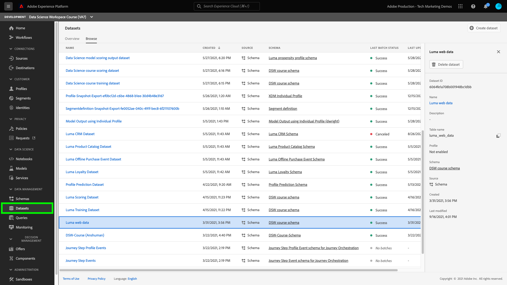

# Creare e pubblicare un modello di apprendimento automatico

La guida seguente descrive i passaggi necessari per creare e pubblicare un modello di apprendimento automatico. Ogni sezione contiene una descrizione delle operazioni da eseguire e un collegamento alla documentazione dell’interfaccia utente e dell’API per eseguire il passaggio descritto.

## Introduzione

Prima di avviare questa esercitazione, è necessario disporre dei seguenti prerequisiti:

- Accesso a [!DNL Adobe Experience Platform]. Se non hai accesso a un’organizzazione IMS in [!DNL Experience Platform], contattare l&#39;amministratore di sistema prima di procedere.

- Tutte le esercitazioni di Data Science Workspace utilizzano il modello di propensione Luma. Per seguire, devi aver creato il [Schemi e set di dati del modello di propensione Luma](./create-luma-data.md).

### Esplorare i dati e comprendere gli schemi

Accedi a [Adobe Experience Platform](https://platform.adobe.com/) e seleziona **[!UICONTROL Set di dati]** per elencare tutti i set di dati esistenti e selezionare il set di dati che si desidera esplorare. In questo caso, seleziona il **Dati web Luma** set di dati.

Viene visualizzata la pagina dell’attività Set di dati, in cui sono elencate le informazioni relative al set di dati. Puoi selezionare **[!UICONTROL Anteprima set di dati]** in alto a destra per esaminare i record di esempio. Puoi anche visualizzare lo schema per il set di dati selezionato.

Seleziona il collegamento dello schema nella barra a destra. Viene visualizzato un popover, selezionando il collegamento in **[!UICONTROL nome schema]** apre lo schema in una nuova scheda.

Puoi esplorare ulteriormente i dati utilizzando il blocco appunti EDA (Exploratory Data Analysis) fornito. Questo blocco appunti può essere utilizzato per comprendere i pattern nei dati Luma, verificare la correttezza dei dati e riepilogare i dati rilevanti per il modello di propensione predittiva. Per ulteriori informazioni sull’analisi esplorativa dei dati, consulta [Documentazione dell’AED](../jupyterlab/eda-notebook.md).

## Creare la ricetta della propensione Luma {#author-your-model}

Componente principale della [!DNL Data Science Workspace] Il ciclo di vita prevede la creazione di ricette e modelli. Il modello di propensione Luma è progettato per generare una previsione sulla probabilità che i clienti abbiano un’elevata propensione ad acquistare un prodotto da Luma.

Per creare il modello di propensione Luma, viene utilizzato il modello per la generazione di formule. Le ricette sono la base per un Modello, in quanto contengono algoritmi di apprendimento automatico e logica progettata per risolvere problemi specifici. Fatto ancora più importante, le ricette consentono di democratizzare l’apprendimento automatico nell’organizzazione, consentendo ad altri utenti di accedere a un modello per casi d’uso diversi senza scrivere codice.

Segui le [creare un modello utilizzando JupyterLab Notebooks](../jupyterlab/create-a-model.md) esercitazione per creare la ricetta del modello di propensione Luma utilizzata nelle esercitazioni successive.

## Importare e creare un pacchetto di una composizione da origini esterne (*facoltativo*)

Se desideri importare e creare un pacchetto di una ricetta da utilizzare in Data Science Workspace, devi creare un pacchetto dei file sorgente in un file di archivio. Segui le [creare pacchetti di file di origine in una ricetta](./package-source-files-recipe.md) esercitazione. Questa esercitazione mostra come creare pacchetti di file di origine in una ricetta, che è il passaggio preliminare per importare una ricetta in Data Science Workspace. Al termine dell’esercitazione, viene fornita un’immagine Docker in un registro dei contenitori di Azure, insieme all’URL dell’immagine corrispondente, ovvero un file di archivio.

Questo file di archivio può essere utilizzato per creare una ricetta in Data Science Workspace seguendo il flusso di lavoro di importazione della ricetta utilizzando [Flusso di lavoro dell&#39;interfaccia utente](./import-packaged-recipe-ui.md) o [Flusso di lavoro API](./import-packaged-recipe-api.md).

## Addestra e valuta un modello {#train-and-evaluate-your-model}

Ora che i dati sono preparati e una ricetta è pronta, puoi creare, addestrare e valutare ulteriormente il modello di apprendimento automatico. Durante l’utilizzo del Generatore di ricette, avresti già dovuto addestrare, valutare e valutare il modello prima di confezionarlo in una ricetta.

L’interfaccia utente e l’API di Data Science Workspace consentono di pubblicare la ricetta come modello. È inoltre possibile perfezionare aspetti specifici del modello, ad esempio l&#39;aggiunta, la rimozione e la modifica di iperparametri.

### Creare un modello

Per ulteriori informazioni sulla creazione di un modello tramite l’interfaccia utente, visita il treno e valuta un modello in Data Science Workspace [Esercitazione sull’interfaccia utente](./train-evaluate-model-ui.md) o [Esercitazione API](./train-evaluate-model-api.md). Questo tutorial fornisce un esempio su come creare, addestrare e aggiornare iperparametri per perfezionare il modello.

>[!NOTE]
>
> Gli iperparametri non possono essere appresi, pertanto devono essere assegnati prima delle esecuzioni di addestramento. La regolazione degli iperparametri può modificare la precisione del modello addestrato. Poiché l’ottimizzazione di un modello è un processo iterativo, possono essere necessarie più esecuzioni di addestramento prima che venga raggiunta una valutazione soddisfacente.

## Valutazione di un modello {#score-a-model}

Il passaggio successivo nella creazione e pubblicazione di un modello consiste nel rendere operativo il modello per valutare e sfruttare le informazioni provenienti dal data lake e dal profilo cliente in tempo reale.

Il punteggio in Data Science Workspace può essere ottenuto inserendo i dati di input in un modello addestrato esistente. I risultati del punteggio vengono quindi memorizzati e visualizzabili in un set di dati di output specificato come nuovo batch.

Per scoprire come valutare il modello, visita la sezione Punteggio a modello [Esercitazione sull’interfaccia utente](./score-model-ui.md) o [Esercitazione API](./score-model-api.md).

## Pubblicare un modello con punteggio come servizio

Data Science Workspace consente di pubblicare il modello addestrato come servizio. Questo consente agli utenti all’interno dell’organizzazione IMS di valutare i dati senza dover creare i propri modelli.

Per scoprire come pubblicare un modello come servizio, visita [Esercitazione sull’interfaccia utente](./publish-model-service-ui.md) o [Esercitazione API](./publish-model-service-api.md).

### Pianificazione della formazione automatizzata per un servizio

Dopo aver pubblicato un modello come servizio, puoi impostare esecuzioni pianificate di valutazione e addestramento per il servizio di apprendimento automatico. L’automazione del processo di formazione e valutazione consente di mantenere e migliorare l’efficienza di un servizio nel tempo, tenendo il passo con i modelli all’interno dei dati. Visita il [pianificare un modello nell’interfaccia utente di Data Science Workspace](./schedule-models-ui.md) esercitazione.

>[!NOTE]
>
> Puoi pianificare un modello solo per l’apprendimento automatico e il punteggio dall’interfaccia utente.

## Passaggi successivi {#next-steps}

Adobe Experience Platform [!DNL Data Science Workspace] fornisce gli strumenti e le risorse per creare, valutare e utilizzare modelli di apprendimento automatico per generare previsioni e informazioni sui dati. Quando le informazioni di apprendimento automatico vengono acquisite in una [!DNL Profile]set di dati abilitato, gli stessi dati vengono acquisiti anche come [!DNL Profile] record che possono quindi essere segmentati utilizzando [!DNL Adobe Experience Platform Segmentation Service].

Man mano che i dati di profilo e serie temporali vengono acquisiti, Real-Time Customer Profile decide automaticamente di includere o escludere tali dati dai segmenti attraverso un processo continuo denominato segmentazione in streaming, prima di unirli ai dati esistenti e di aggiornare la visualizzazione unione. Di conseguenza, puoi eseguire istantaneamente i calcoli e prendere decisioni per fornire esperienze avanzate e personalizzate ai clienti mentre interagiscono con il tuo marchio.

Visita il tutorial per [Arricchimento di Real-Time Customer Profile con approfondimenti sull’apprendimento automatico](./enrich-profile.md) per ulteriori informazioni su come utilizzare machine learning insights.
