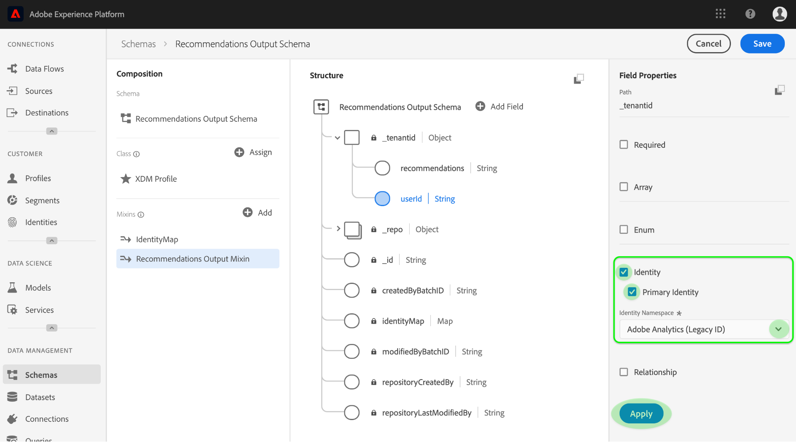
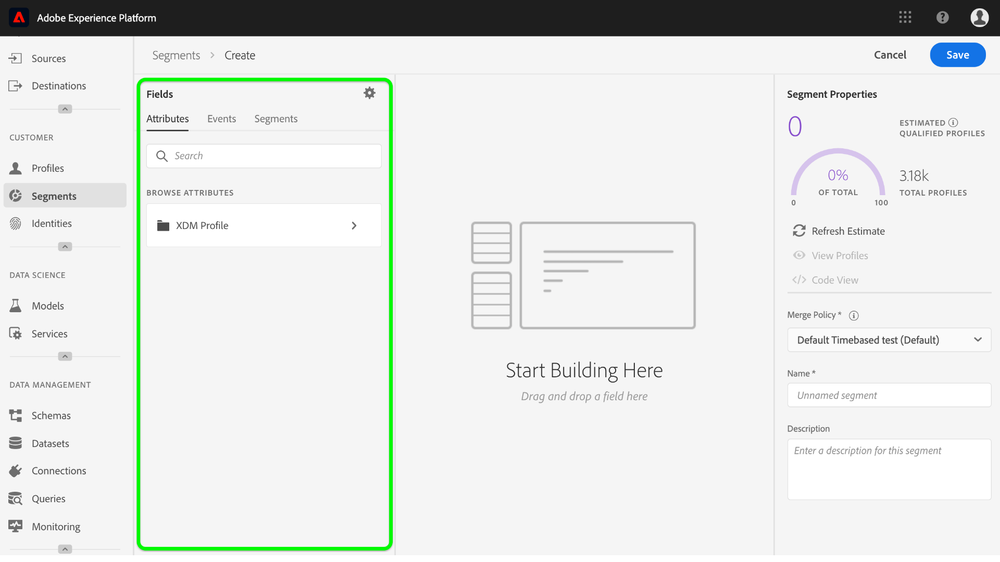

# Arricchimento [!DNL Real-time Customer Profile] con approfondimenti di machine learning

[!DNL Adobe Experience Platform] [!DNL Data Science Workspace] fornisce gli strumenti e le risorse per creare, valutare e utilizzare modelli di machine learning per generare previsioni e approfondimenti sui dati. Quando le informazioni sull&#39;apprendimento automatico vengono inserite in un set di dati [!DNL Profile]abilitato, gli stessi dati vengono anche assimilati come [!DNL Profile] record che possono essere poi segmentati in sottoinsiemi di elementi correlati utilizzando [!DNL Experience Platform Segmentation Service].

Questo documento fornisce un&#39;esercitazione passo-passo per arricchire [!DNL Real-time Customer Profile] con informazioni approfondite sull&#39;apprendimento automatico. I passaggi sono suddivisi nelle seguenti sezioni:

1. [Creare uno schema di output e un dataset](#create-an-output-schema-and-dataset)
2. [Configurare uno schema di output e un dataset](#configure-an-output-schema-and-dataset)
3. [Creazione di segmenti con Segment Builder (Generatore di segmenti)](#create-segments-using-the-segment-builder)

## Introduzione

Questa esercitazione richiede una conoscenza approfondita dei vari aspetti relativi al [!DNL Adobe Experience Platform] processo di assimilazione dei [!DNL Profile] dati e alla creazione di segmenti. Prima di iniziare questa esercitazione, consulta la documentazione relativa ai seguenti servizi:

* [!DNL Real-time Customer Profile](../../rtcdp/overview.md): Fornisce un profilo di consumo unificato e in tempo reale basato su dati aggregati provenienti da più origini.
* [!DNL Identity Service](../../identity-service/home.md): Consente [!DNL Real-time Customer Profile] di collegare identità da origini dati diverse che vengono caricate in Platform.
* [!DNL Experience Data Model (XDM)](../../xdm/home.md): Framework standard con cui Platform organizza i dati sull&#39;esperienza dei clienti.

Oltre ai documenti di cui sopra, si consiglia di consultare anche le seguenti guide sugli schemi e sull&#39;Editor di schema:

* [Nozioni di base sulla composizione](../../xdm/schema/composition.md)dello schema: Descrive gli schemi XDM, i blocchi costitutivi, i principi e le procedure ottimali per la composizione degli schemi in cui [!DNL Experience Platform]utilizzarli.
* [Esercitazione](../../xdm/tutorials/create-schema-ui.md)sull&#39;Editor di schema: Fornisce istruzioni dettagliate per la creazione di schemi utilizzando l&#39;Editor di schema all&#39;interno [!DNL Experience Platform].

## Creare uno schema di output e un dataset {#create-an-output-schema-and-dataset}

Il primo passo verso l&#39;arricchimento [!DNL Real-time Customer Profile] con le informazioni di punteggio è sapere quale oggetto reale (come una persona) i tuoi dati definiscono. La comprensione dei dati consente di descrivere e progettare una struttura che ha un significato per i dati, come la progettazione di un database relazionale.

La composizione di uno schema inizia con l&#39;assegnazione di una classe. Le classi definiscono gli aspetti comportamentali dei dati che lo schema conterrà (record o serie temporali). Questa sezione fornisce istruzioni di base per creare uno schema utilizzando il generatore di schemi. Per un&#39;esercitazione più dettagliata, fare riferimento all&#39;esercitazione sulla [creazione di uno schema con l&#39;Editor](../../xdm/tutorials/create-schema-ui.md)di schema.

1.  Adobe Experience Platform, fare clic sulla **[!UICONTROL Schema]** scheda per accedere al browser dello schema. Fare clic **[!UICONTROL Create Schema]** per accedere all&#39;Editor **schema, in cui è possibile creare e creare schemi in modo interattivo.
   

2. Nella finestra *Composizione* , fate clic **[!UICONTROL Assign]** per esplorare le classi disponibili.
   * Per assegnare una classe esistente, fate clic sulla classe desiderata ed evidenziatela, quindi fate clic su **[!UICONTROL Assign Class]**.
      

   * Per creare una classe personalizzata, fate clic **[!UICONTROL Create New Class]** sul pulsante situato nella parte centrale della finestra del browser. Immettete un nome di classe, una descrizione e scegliete il comportamento della classe. Fate clic **[!UICONTROL Assign Class]** una volta terminato.
      
   A questo punto, la struttura dello schema deve contenere alcuni campi di classe ed è possibile assegnare i mixin. Un mixin è un gruppo di uno o più campi che descrivono un concetto particolare.

3. Nella finestra *Composizione* , fate clic **[!UICONTROL Add]** nella sottosezione *Mixins* .
   * Per assegnare un mixin esistente, fate clic ed evidenziate il mixin desiderato, quindi fate clic **[!UICONTROL Add Mixin]**. A differenza delle classi, è possibile assegnare più mixin a un singolo schema, purché sia appropriato.
      

   * Per creare un nuovo mixin, fate clic **[!UICONTROL Create New Mixin]** sul pulsante situato nella parte centrale della finestra del browser. Inserisci un nome e una descrizione per il mixin, quindi fai clic **[!UICONTROL Assign Mixin]** una volta terminato.
      

   * Per aggiungere campi mixin, fate clic sul nome del mixin nella finestra *Composizione* . Viene quindi fornita l’opzione per aggiungere campi mixin facendo clic **[!UICONTROL Add Field]** nella finestra *Struttura* . Assicurarsi di fornire le proprietà di mixin di conseguenza.
      

4. Dopo aver creato lo schema, fare clic sul campo di livello superiore dello schema all&#39;interno della finestra *Struttura* per visualizzare le proprietà dello schema nella finestra delle proprietà a destra. Specificare un nome e una descrizione, quindi fare clic **[!UICONTROL Save]** per creare lo schema.
   

5. Crea un set di dati di output utilizzando lo schema appena creato facendo clic **[!UICONTROL Datasets]** dalla colonna di navigazione a sinistra, quindi fai clic su **[!UICONTROL Create dataset]**. Nella schermata successiva, scegliete **[!UICONTROL Create dataset from schema]**.
   

6. Utilizzando il browser dello schema, individuare e selezionare lo schema appena creato, quindi fare clic **[!UICONTROL Next]**.
   

7. Immettete un nome e una descrizione facoltativa, quindi fate clic **[!UICONTROL Finish]** per creare il set di dati.
   

Ora che è stato creato un set di dati dello schema di output, è possibile continuare fino alla sezione successiva per configurarlo e abilitarlo per l&#39;arricchimento del profilo.

## Configurare uno schema di output e un dataset {#configure-an-output-schema-and-dataset}

Prima di abilitare un dataset per [!DNL Profile], è necessario configurare lo schema del dataset in modo che abbia un campo identità principale e quindi attivare lo schema per [!DNL Profile]. Se si desidera creare e abilitare un nuovo schema, è possibile fare riferimento all&#39;esercitazione sulla [creazione di uno schema utilizzando l&#39;Editor](../../xdm/tutorials/create-schema-ui.md)di schema. In caso contrario, seguire le istruzioni riportate di seguito per abilitare uno schema e un dataset esistenti.

1.  Adobe Experience Platform, utilizzare il browser dello schema per individuare lo schema di output [!DNL Profile] sul quale si desidera attivarlo e fare clic sul nome per visualizzarne la composizione.
   

2. Espandere la struttura dello schema e trovare un campo appropriato da impostare come identificatore principale. Fate clic sul campo desiderato per visualizzarne le proprietà.
   

3. Impostare il campo come identità principale abilitando la **[!UICONTROL Identity]** proprietà, la **[!UICONTROL Primary Identity]** proprietà del campo e selezionando quindi un&#39; **[!UICONTROL Identity Namespace]** opzione appropriata. Fate clic su **[!UICONTROL Apply]** una volta apportate le modifiche.
   

4. Fare clic sull&#39;oggetto di primo livello della struttura dello schema per visualizzare le proprietà dello schema e attivare lo schema per Profile attivando il **[!UICONTROL Profile]** passaggio. Fare clic **[!UICONTROL Save]** per finalizzare le modifiche. È ora possibile abilitare il set di dati creato con questo schema per il profilo.
   

5. Utilizzate il browser del set di dati per trovare il set di dati [!DNL Profile] sul quale desiderate attivarlo e fate clic sul suo nome per accedere ai relativi dettagli.
   

6. Attivate il dataset per [!DNL Profile] attivando lo **[!UICONTROL Profile]** switch trovato nella colonna delle informazioni corrette.
   

Quando i dati vengono trasferiti in un set di dati [!DNL Profile]abilitato, gli stessi dati vengono assimilati anche ai [!DNL Profile] record. Ora che lo schema e il set di dati sono preparati, genera alcuni dati nel dataset eseguendo l&#39;esecuzione del punteggio utilizzando un modello appropriato, quindi continua con questa esercitazione per creare segmenti di approfondimento utilizzando Segment Builder (Generatore di segmenti).

## Creazione di segmenti con Segment Builder (Generatore di segmenti) {#create-segments-using-the-segment-builder}

Ora che hai generato e acquisito informazioni approfondite nel set di dati [!DNL Profile]abilitato, puoi gestire tali dati identificando sottoinsiemi di elementi correlati tramite Segment Builder (Generatore di segmenti). Segui i passaggi indicati di seguito per creare i tuoi segmenti.

1.  Adobe Experience Platform, fai clic sulla **[!UICONTROL Segments]** scheda seguita da **[!UICONTROL Create Segment]** per accedere al Generatore di segmenti.
   

2. In Segment Builder (Generatore di segmenti), la barra a sinistra consente di accedere ai blocchi di generazione principali dei segmenti: attributi, eventi e segmenti esistenti. Ciascun blocco predefinito viene visualizzato nella relativa scheda. Selezionare la classe alla quale si estende lo schema [!DNL Profile]abilitato, quindi individuare e individuare i blocchi di generazione per il segmento.
   

3. Trascinare e rilasciare i blocchi di generazione nell&#39;area di lavoro del generatore di regole, per completarli fornendo istruzioni comparative.
   

4. Durante la creazione del segmento potete visualizzare in anteprima i risultati stimati del segmento osservando il pannello Proprietà ** segmento.
   

5. Seleziona un nome appropriato **[!UICONTROL Merge Policy]**, specifica un nome e una descrizione facoltativa, quindi fai clic **[!UICONTROL Save]** per completare il nuovo segmento.
   

## Passaggi successivi {#next-steps}

Questo documento illustra i passaggi necessari per abilitare uno schema e un set di dati per [!DNL Profile]e illustra brevemente il flusso di lavoro per la creazione di segmenti di approfondimento mediante il Generatore di segmenti. Per ulteriori informazioni sui segmenti e sul Generatore di segmenti, consulta la panoramica [del servizio](../../segmentation/home.md)Segmentazione.