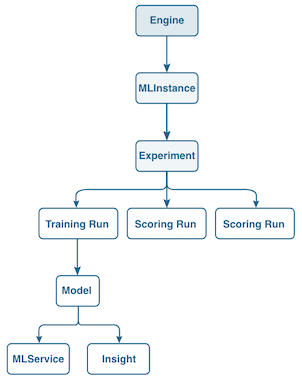

# Importare una ricetta confezionata utilizzando l’API di apprendimento automatico di Sensei

Questa esercitazione utilizza la funzione [[!DNL Sensei Machine Learning API]](https://www.adobe.io/apis/experienceplatform/home/api-reference.html#!acpdr/swagger-specs/sensei-ml-api.yaml) per creare un [Motore](../api/engines.md), nota anche come Ricetta nell’interfaccia utente di .

Prima di iniziare, è importante notare che Adobe Experience Platform [!DNL Data Science Workspace] utilizza termini diversi per fare riferimento a elementi simili all’interno dell’API e dell’interfaccia utente. I termini API vengono utilizzati in questa esercitazione e la tabella seguente illustra i termini correlati:

| Termine interfaccia utente | Termine API |
| ---- | ---- |
| Ricetta | [Motore](../api/engines.md) |
| Modello | [MLInance](../api/mlinstances.md) |
| Formazione e valutazione | [Esperimento](../api/experiments.md) |
| Servizio | [MLService](../api/mlservices.md) |

Un motore contiene algoritmi e logica di apprendimento automatico per risolvere problemi specifici. Il diagramma seguente fornisce una visualizzazione del flusso di lavoro API in [!DNL Data Science Workspace]. Questa esercitazione si concentra sulla creazione di un Motore, il cervello di un Modello di apprendimento automatico.



## Introduzione

Questa esercitazione richiede un file composizione compilato sotto forma di URL Docker. Segui [Creare pacchetti di file di origine in una composizione](./package-source-files-recipe.md) esercitazione per creare un file composizione in pacchetto o fornire il proprio.

- `{DOCKER_URL}`: Un indirizzo URL a un&#39;immagine Docker di un servizio intelligente.

Questa esercitazione richiede di aver completato il [Esercitazione sull’autenticazione a Adobe Experience Platform](https://www.adobe.com/go/platform-api-authentication-en) per effettuare correttamente le chiamate a [!DNL Platform] API. Il completamento dell’esercitazione sull’autenticazione fornisce i valori per ciascuna delle intestazioni richieste in tutte le [!DNL Experience Platform] Chiamate API, come mostrato di seguito:

- `{ACCESS_TOKEN}`: Il valore specifico del token portatore fornito dopo l’autenticazione.
- `{ORG_ID}`: Le credenziali dell’organizzazione IMS sono state trovate nell’integrazione unica di Adobe Experience Platform.
- `{API_KEY}`: Il valore chiave API specifico si trova nell’integrazione Adobe Experience Platform univoca.

## Creare un motore

I motori possono essere creati effettuando una richiesta POST all&#39;endpoint /engine. Il motore creato viene configurato in base al modulo del file di composizione del pacchetto che deve essere incluso come parte della richiesta API.

### Creare un motore con un URL Docker {#create-an-engine-with-a-docker-url}

Per creare un motore con un file Ricetta in pacchetto memorizzato in un contenitore Docker, è necessario fornire l&#39;URL Docker al file Ricetta in pacchetto.

>[!CAUTION]
>
> Se utilizzi [!DNL Python] o R utilizza la richiesta seguente. Se utilizzi PySpark o Scala, utilizza l’esempio di richiesta PySpark/Scala situato sotto l’esempio Python/R.

**Formato API**

```http
POST /engines
```

**Richiesta Python/R**

```shell
curl -X POST \
    https://platform.adobe.io/data/sensei/engines \
    -H 'Authorization: {ACCESS_TOKEN}' \
    -H 'X-API-KEY: {API_KEY}' \
    -H 'content-type: multipart/form-data' \
    -H 'x-gw-ims-org-id: {ORG_ID}' \
    -H `x-sandbox-name: {SANDBOX_NAME}` \
    -F 'engine={
        "name": "Retail Sales Engine Python",
        "description": "A description for Retail Sales Engine, this Engines execution type is Python",
        "type": "Python"
        "artifacts": {
            "default": {
                "image": {
                    "location": "{DOCKER_URL}",
                    "name": "retail_sales_python",
                    "executionType": "Python"
                }
            }
        }
    }' 
```

| Proprietà | Descrizione |
| -------  | ----------- |
| `engine.name` | Nome desiderato per il motore. La composizione corrispondente a questo motore erediterà questo valore da visualizzare in [!DNL Data Science Workspace] interfaccia utente come nome della composizione. |
| `engine.description` | Una descrizione facoltativa per il motore. La composizione corrispondente a questo motore erediterà questo valore da visualizzare in [!DNL Data Science Workspace] interfaccia utente come descrizione della composizione. Non rimuovere questa proprietà, lasciare che questo valore sia una stringa vuota se si sceglie di non fornire una descrizione. |
| `engine.type` | Tipo di esecuzione del motore. Questo valore corrisponde alla lingua in cui viene sviluppata l’immagine Docker. Quando viene fornito un URL Docker per creare un motore, `type` è `Python`, `R`, `PySpark`, `Spark` (Scala) o `Tensorflow`. |
| `artifacts.default.image.location` | Le `{DOCKER_URL}` vai qui. Un URL Docker completo ha la seguente struttura: `your_docker_host.azurecr.io/docker_image_file:version` |
| `artifacts.default.image.name` | Un nome aggiuntivo per il file immagine Docker. Non rimuovere questa proprietà, lasciare che questo valore sia una stringa vuota se si sceglie di non fornire un nome di file immagine Docker aggiuntivo. |
| `artifacts.default.image.executionType` | Tipo di esecuzione del motore. Questo valore corrisponde alla lingua in cui viene sviluppata l’immagine Docker. Quando viene fornito un URL Docker per creare un motore, `executionType` è `Python`, `R`, `PySpark`, `Spark` (Scala) o `Tensorflow`. |

**Richiedi PySpark**

```shell
curl -X POST \
  https://platform.adobe.io/data/sensei/engines \
    -H 'Authorization: Bearer {ACCESS_TOKEN}' \
    -H 'x-api-key: {API_KEY}' \
    -H 'x-gw-ims-org-id: {ORG_ID}' \
    -H 'x-sandbox-name: {SANDBOX_NAME}' \
    -H 'content-type: multipart/form-data' \
    -F 'engine={
    "name": "PySpark retail sales recipe",
    "description": "A description for this Engine",
    "type": "PySpark",
    "mlLibrary":"databricks-spark",
    "artifacts": {
        "default": {
            "image": {
                "name": "modelspark",
                "executionType": "PySpark",
                "packagingType": "docker",
                "location": "v1d2cs4mimnlttw.azurecr.io/sarunbatchtest:0.0.1"
            }
        }
    }
}'
```

| Proprietà | Descrizione |
| --- | --- |
| `name` | Nome desiderato per il motore. La composizione corrispondente a questo motore erediterà questo valore da visualizzare nell’interfaccia utente come nome della composizione. |
| `description` | Una descrizione facoltativa per il motore. La composizione corrispondente a questo motore erediterà questo valore da visualizzare nell’interfaccia utente come descrizione della composizione. Questa proprietà è obbligatoria. Se non si desidera fornire una descrizione, impostare il relativo valore su una stringa vuota. |
| `type` | Tipo di esecuzione del motore. Questo valore corrisponde alla lingua in cui l’immagine Docker è basata su &quot;PySpark&quot;. |
| `mlLibrary` | Campo necessario per la creazione di motori per le ricette PySpark e Scala. |
| `artifacts.default.image.location` | Posizione dell’immagine Docker collegata a da un URL Docker. |
| `artifacts.default.image.executionType` | Tipo di esecuzione del motore. Questo valore corrisponde alla lingua in cui l’immagine Docker è basata su &quot;Spark&quot;. |

**Richiesta Scala**

```shell
curl -X POST \
  https://platform.adobe.io/data/sensei/engines \
    -H 'Authorization: Bearer {ACCESS_TOKEN}' \
    -H 'x-api-key: {API_KEY}' \
    -H 'x-gw-ims-org-id: {ORG_ID}' \
    -H 'x-sandbox-name: {SANDBOX_NAME}' \
    -H 'content-type: multipart/form-data' \
    -F 'engine={
    "name": "Spark retail sales recipe",
    "description": "A description for this Engine",
    "type": "Spark",
    "mlLibrary":"databricks-spark",
    "artifacts": {
        "default": {
            "image": {
                "name": "modelspark",
                "executionType": "Spark",
                "packagingType": "docker",
                "location": "v1d2cs4mimnlttw.azurecr.io/sarunbatchtest:0.0.1"
            }
        }
    }
}'
```

| Proprietà | Descrizione |
| --- | --- |
| `name` | Nome desiderato per il motore. La composizione corrispondente a questo motore erediterà questo valore da visualizzare nell’interfaccia utente come nome della composizione. |
| `description` | Una descrizione facoltativa per il motore. La composizione corrispondente a questo motore erediterà questo valore da visualizzare nell’interfaccia utente come descrizione della composizione. Questa proprietà è obbligatoria. Se non si desidera fornire una descrizione, impostare il relativo valore su una stringa vuota. |
| `type` | Tipo di esecuzione del motore. Questo valore corrisponde alla lingua in cui l’immagine Docker è basata su &quot;Spark&quot;. |
| `mlLibrary` | Campo necessario per la creazione di motori per le ricette PySpark e Scala. |
| `artifacts.default.image.location` | Posizione dell’immagine Docker collegata a da un URL Docker. |
| `artifacts.default.image.executionType` | Tipo di esecuzione del motore. Questo valore corrisponde alla lingua in cui l’immagine Docker è basata su &quot;Spark&quot;. |

**Risposta**

Una risposta corretta restituisce un payload contenente i dettagli del motore appena creato, incluso l’identificatore univoco (`id`). L’esempio di risposta seguente è relativo a un [!DNL Python] Motore. La `executionType` e `type` le chiavi cambiano in base al POST in dotazione.

```json
{
    "id": "{ENGINE_ID}",
    "name": "A name for this Engine",
    "description": "A description for this Engine",
    "type": "Python",
    "algorithm": "Classification",
    "created": "2019-01-01T00:00:00.000Z",
    "createdBy": {
        "userId": "Jane_Doe@AdobeID"
    },
    "updated": "2019-01-01T00:00:00.000Z",
    "artifacts": {
        "default": {
            "image": {
                "location": "{DOCKER_URL}",
                "name": "An additional name for the Docker image",
                "executionType": "Python",
                "packagingType": "docker"
            }
        }
    }
}
```

Una risposta corretta mostra un payload JSON con le informazioni relative al motore appena creato. La `id` key rappresenta l’identificatore univoco del motore ed è necessario nell’esercitazione successiva per creare un’istanza MLI. Assicurati che l&#39;identificatore del motore sia salvato prima di continuare con i passaggi successivi.

## Passaggi successivi {#next-steps}

Hai creato un motore utilizzando l’API ed è stato ottenuto un identificatore univoco del motore come parte del corpo della risposta. Puoi usare questo identificatore del motore nell’esercitazione successiva per scoprire come [creare, addestrare e valutare un modello utilizzando l’API](./train-evaluate-model-api.md).
