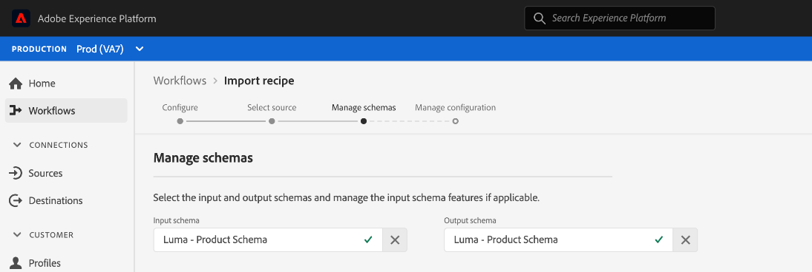

# Importare una composizione in pacchetti nell’interfaccia utente di Data Science Workspace

Questo tutorial fornisce informazioni su come configurare e importare una composizione in pacchetti utilizzando l’esempio di vendita al dettaglio fornito. Al termine di questa esercitazione, sarai pronto per creare, addestrare e valutare un modello in Adobe Experience Platform [!DNL Data Science Workspace].

## Prerequisiti

Questo tutorial richiede una formula in pacchetti sotto forma di URL di un’immagine Docker. Guarda il tutorial su come [Creare pacchetti di file di origine in una ricetta](./package-source-files-recipe.md) per ulteriori informazioni.

## Flusso di lavoro dell&#39;interfaccia utente

Importazione di una composizione in pacchetti [!DNL Data Science Workspace] richiede configurazioni di ricetta specifiche, compilate in un singolo file JavaScript Object Notation (JSON); questa compilazione di configurazioni di ricetta è definita file di configurazione. Una ricetta confezionata con un particolare set di configurazioni è indicata come istanza di ricetta. Una ricetta può essere utilizzata per creare più istanze di ricetta in [!DNL Data Science Workspace].

Il flusso di lavoro per l’importazione di una composizione di pacchetto è costituito dai seguenti passaggi:
- [Configurare una ricetta](#configure)
- [Importa ricetta basata su Docker - Python](#python)
- [Importa ricetta basata su Docker - R](#r)
- [Importa ricetta basata su Docker - PySpark](#pyspark)
- [Importa ricetta basata su Docker - Scala](#scala)

### Configurare una ricetta {#configure}

Ogni istanza di ricetta in [!DNL Data Science Workspace] è accompagnato da una serie di configurazioni che adattano l’istanza della ricetta a un caso d’uso particolare. I file di configurazione definiscono i comportamenti predefiniti di apprendimento e punteggio di un modello creato utilizzando questa istanza di ricetta.

>[!NOTE]
>
>I file di configurazione sono specifici per ricetta e caso.

Di seguito è riportato un file di configurazione di esempio che mostra i comportamenti predefiniti di formazione e punteggio per la ricetta di vendita al dettaglio.

```json
[
    {
        "name": "train",
        "parameters": [
            {
                "key": "learning_rate",
                "value": "0.1"  
            },
            {
                "key": "n_estimators",
                "value": "100"
            },
            {
                "key": "max_depth",
                "value": "3"
            },
            {
                "key": "ACP_DSW_INPUT_FEATURES",
                "value": "date,store,storeType,storeSize,temperature,regionalFuelPrice,markdown,cpi,unemployment,isHoliday"
            },
            {
                "key": "ACP_DSW_TARGET_FEATURES",
                "value": "weeklySales"
            },
            {
                "key": "ACP_DSW_FEATURE_UPDATE_SUPPORT",
                "value": false
            },
            {
                "key": "tenantId",
                "value": "_{TENANT_ID}"
            },
            {
                "key": "ACP_DSW_TRAINING_XDM_SCHEMA",
                "value": "{SEE BELOW FOR DETAILS}"
            },
            {
                "key": "evaluation.labelColumn",
                "value": "weeklySalesAhead"
            },
            {
                "key": "evaluation.metrics",
                "value": "MAPE,MAE,RMSE,MASE"
            }
        ]
    },
    {
        "name": "score",
        "parameters": [
            {
                "key": "tenantId",
                "value": "_{TENANT_ID}"
            },
            {
                "key":"ACP_DSW_SCORING_RESULTS_XDM_SCHEMA",
                "value":"{SEE BELOW FOR DETAILS}"
            }
        ]
    }
]
```

| Chiave parametro | Tipo | Descrizione |
| ----- | ----- | ----- |
| `learning_rate` | Numero | Scalare per la moltiplicazione del gradiente. |
| `n_estimators` | Numero | Numero di alberi nella foresta per Classificatore Foresta casuale. |
| `max_depth` | Numero | Profondità massima di un albero nel classificatore Foresta casuale. |
| `ACP_DSW_INPUT_FEATURES` | Stringa | Elenco di attributi dello schema di input separati da virgole. |
| `ACP_DSW_TARGET_FEATURES` | Stringa | Elenco di attributi dello schema di output separati da virgole. |
| `ACP_DSW_FEATURE_UPDATE_SUPPORT` | Booleano | Determina se le funzioni di input e output sono modificabili |
| `tenantId` | Stringa | Questo ID garantisce che le risorse create abbiano uno spazio dei nomi corretto e siano contenute all’interno dell’organizzazione IMS. [Segui questi passaggi](../../xdm/api/getting-started.md#know-your-tenant_id) per trovare il tuo ID tenant. |
| `ACP_DSW_TRAINING_XDM_SCHEMA` | Stringa | Schema di input utilizzato per l’apprendimento di un modello. Lascia vuoto questo campo durante l’importazione nell’interfaccia utente, sostituisci con ID schema di apprendimento durante l’importazione tramite API. |
| `evaluation.labelColumn` | Stringa | Etichetta di colonna per le visualizzazioni di valutazione. |
| `evaluation.metrics` | Stringa | Elenco separato da virgole delle metriche di valutazione da utilizzare per la valutazione di un modello. |
| `ACP_DSW_SCORING_RESULTS_XDM_SCHEMA` | Stringa | Schema di output utilizzato per il punteggio di un modello. Lascia vuoto questo campo durante l’importazione nell’interfaccia utente, sostituisci con SchemaID con punteggio durante l’importazione tramite API. |

Ai fini di questa esercitazione, puoi lasciare i file di configurazione predefiniti per la ricetta Vendite al dettaglio in [!DNL Data Science Workspace] Fai riferimento al modo in cui sono.

### Importa ricetta basata su Docker - [!DNL Python] {#python}

Per iniziare, seleziona e naviga **[!UICONTROL Flussi di lavoro]** si trova in alto a sinistra nella [!DNL Platform] UI. Quindi, seleziona **Importa ricetta** e seleziona **[!UICONTROL Launch]**.


Il **Configura** pagina per **Importa ricetta** viene visualizzato workflow. Inserisci un nome e una descrizione per la ricetta, quindi seleziona **[!UICONTROL Successivo]** in alto a destra.


>[!NOTE]
>
> In [Creare pacchetti di file di origine in una ricetta](./package-source-files-recipe.md) esercitazione, un URL Docker veniva fornito al termine della creazione della ricetta di vendita al dettaglio utilizzando i file di origine Python.

Una volta che sei sul **Seleziona origine** , incolla l’URL Docker corrispondente alla composizione inserita creata utilizzando [!DNL Python] file di origine in **[!UICONTROL URL di origine]** campo. Quindi, importa il file di configurazione fornito trascinandolo o utilizza il file system **Browser**. Il file di configurazione fornito è disponibile all&#39;indirizzo `experience-platform-dsw-reference/recipes/python/retail/retail.config.json`. Seleziona **[!UICONTROL Python]** nel **Runtime** a discesa e **[!UICONTROL Classificazione]** nel **Tipo** a discesa. Una volta compilato tutto, seleziona **[!UICONTROL Successivo]** nell’angolo in alto a destra per procedere a **Gestire gli schemi**.

>[!NOTE]
>
> Tipo supporta **[!UICONTROL Classificazione]** e **[!UICONTROL Regressione]**. Se il modello non rientra in uno di questi tipi, seleziona **[!UICONTROL Personalizzato]**.


Quindi, seleziona gli schemi di input e output per la vendita al dettaglio nella sezione. **Gestire gli schemi**, sono state create utilizzando lo script di avvio fornito in [creare lo schema e il set di dati di vendita al dettaglio](../models-recipes/create-retails-sales-dataset.md) esercitazione.


Sotto **Gestione delle funzioni** , seleziona l’identificazione del tenant nel visualizzatore di schema per espandere lo schema di input Retail Sales. Selezionare le funzioni di input e output evidenziando la funzione desiderata e selezionando **[!UICONTROL Funzione di input]** o **[!UICONTROL Funzione di destinazione]** a destra **[!UICONTROL Proprietà campo]** finestra. Ai fini di questa esercitazione, imposta **[!UICONTROL weeklySales]** come  **[!UICONTROL Funzione di destinazione]** e tutto il resto come **[!UICONTROL Funzione di input]**. Seleziona **[!UICONTROL Successivo]** per rivedere la nuova ricetta configurata.

Rivedi la ricetta, aggiungi, modifica o rimuovi le configurazioni come necessario. Seleziona **[!UICONTROL Fine]** per creare la ricetta.


Procedi al [passaggi successivi](#next-steps) per scoprire come creare un modello in [!DNL Data Science Workspace] utilizzando la ricetta di vendita al dettaglio appena creata.

### Importa ricetta basata su Docker - R {#r}

Per iniziare, seleziona e naviga **[!UICONTROL Flussi di lavoro]** si trova in alto a sinistra nella [!DNL Platform] UI. Quindi, seleziona **Importa ricetta** e seleziona **[!UICONTROL Launch]**.


Il **Configura** pagina per **Importa ricetta** viene visualizzato workflow. Inserisci un nome e una descrizione per la ricetta, quindi seleziona **[!UICONTROL Successivo]** in alto a destra.


>[!NOTE]
>
> In [Creare pacchetti di file di origine in una ricetta](./package-source-files-recipe.md) Esercitazione, è stato fornito un URL Docker al termine della creazione della ricetta di vendita al dettaglio utilizzando i file di origine R.

Una volta che sei sul **Seleziona origine** , incolla l’URL Docker corrispondente alla composizione del pacchetto creata utilizzando i file di origine R in **[!UICONTROL URL di origine]** campo. Quindi, importa il file di configurazione fornito trascinandolo o utilizza il file system **Browser**. Il file di configurazione fornito è disponibile all&#39;indirizzo `experience-platform-dsw-reference/recipes/R/Retail\ -\ GradientBoosting/retail.config.json`. Seleziona **[!UICONTROL R]** nel **Runtime** a discesa e **[!UICONTROL Classificazione]** nel **Tipo** a discesa. Una volta compilato tutto, seleziona **[!UICONTROL Successivo]** nell’angolo in alto a destra per procedere a **Gestire gli schemi**.

>[!NOTE]
>
> *Tipo* supporta **[!UICONTROL Classificazione]** e **[!UICONTROL Regressione]**. Se il modello non rientra in uno di questi tipi, seleziona **[!UICONTROL Personalizzato]**.


Quindi, seleziona gli schemi di input e output per la vendita al dettaglio nella sezione. **Gestire gli schemi**, sono state create utilizzando lo script di avvio fornito in [creare lo schema e il set di dati di vendita al dettaglio](../models-recipes/create-retails-sales-dataset.md) esercitazione.


Sotto *Gestione delle funzioni* , seleziona l’identificazione del tenant nel visualizzatore di schema per espandere lo schema di input Retail Sales. Selezionare le funzioni di input e output evidenziando la funzione desiderata e selezionando **[!UICONTROL Funzione di input]** o **[!UICONTROL Funzione di destinazione]** a destra **[!UICONTROL Proprietà campo]** finestra. Ai fini di questa esercitazione, imposta **[!UICONTROL weeklySales]** come  **[!UICONTROL Funzione di destinazione]** e tutto il resto come **[!UICONTROL Funzione di input]**. Seleziona **[!UICONTROL Successivo]** per rivedere la nuova ricetta Configurata.

Rivedi la ricetta, aggiungi, modifica o rimuovi le configurazioni come necessario. Seleziona **Fine** per creare la ricetta.


Procedi al [passaggi successivi](#next-steps) per scoprire come creare un modello in [!DNL Data Science Workspace] utilizzando la ricetta di vendita al dettaglio appena creata.

### Importa ricetta basata su Docker - PySpark {#pyspark}

Per iniziare, seleziona e naviga **[!UICONTROL Flussi di lavoro]** si trova in alto a sinistra nella [!DNL Platform] UI. Quindi, seleziona **Importa ricetta** e seleziona **[!UICONTROL Launch]**.


Il **Configura** pagina per **Importa ricetta** viene visualizzato workflow. Inserisci un nome e una descrizione per la ricetta, quindi seleziona **[!UICONTROL Successivo]** nell’angolo in alto a destra per procedere.


>[!NOTE]
>
> In [Creare pacchetti di file di origine in una ricetta](./package-source-files-recipe.md) esercitazione, un URL Docker è stato fornito al termine della creazione della ricetta di vendita al dettaglio utilizzando i file di origine PySpark.

Una volta che sei sul **Seleziona origine** , incolla l’URL Docker corrispondente alla composizione inserita creata utilizzando i file sorgente PySpark in **[!UICONTROL URL di origine]** campo. Quindi, importa il file di configurazione fornito trascinandolo o utilizza il file system **Browser**. Il file di configurazione fornito è disponibile all&#39;indirizzo `experience-platform-dsw-reference/recipes/pyspark/retail/pipeline.json`. Seleziona **[!UICONTROL PySpark]** nel **Runtime** a discesa. Una volta selezionata l’esecuzione di PySpark, l’artefatto predefinito si popola automaticamente in **[!UICONTROL Docker]**. Quindi, seleziona **[!UICONTROL Classificazione]** nel **Tipo** a discesa. Una volta compilato tutto, seleziona **[!UICONTROL Successivo]** nell’angolo in alto a destra per procedere a **Gestire gli schemi**.

>[!NOTE]
>
> *Tipo* supporta **[!UICONTROL Classificazione]** e **[!UICONTROL Regressione]**. Se il modello non rientra in uno di questi tipi, seleziona **[!UICONTROL Personalizzato]**.


Quindi, seleziona gli schemi di input e output per la vendita al dettaglio utilizzando **Gestire gli schemi** , gli schemi sono stati creati utilizzando lo script di avvio fornito nel [creare lo schema e il set di dati di vendita al dettaglio](../models-recipes/create-retails-sales-dataset.md) esercitazione.



Sotto **Gestione delle funzioni** , seleziona l’identificazione del tenant nel visualizzatore di schema per espandere lo schema di input Retail Sales. Selezionare le funzioni di input e output evidenziando la funzione desiderata e selezionando **[!UICONTROL Funzione di input]** o **[!UICONTROL Funzione di destinazione]** a destra **[!UICONTROL Proprietà campo]** finestra. Ai fini di questa esercitazione, imposta **[!UICONTROL weeklySales]** come  **[!UICONTROL Funzione di destinazione]** e tutto il resto come **[!UICONTROL Funzione di input]**. Seleziona **[!UICONTROL Successivo]** per rivedere la nuova ricetta configurata.


Rivedi la ricetta, aggiungi, modifica o rimuovi le configurazioni come necessario. Seleziona **[!UICONTROL Fine]** per creare la ricetta.


Procedi al [passaggi successivi](#next-steps) per scoprire come creare un modello in [!DNL Data Science Workspace] utilizzando la ricetta di vendita al dettaglio appena creata.

### Importa ricetta basata su Docker - Scala {#scala}

Per iniziare, seleziona e naviga **[!UICONTROL Flussi di lavoro]** si trova in alto a sinistra nella [!DNL Platform] UI. Quindi, seleziona **Importa ricetta** e seleziona **[!UICONTROL Launch]**.


Il **Configura** pagina per **Importa ricetta** viene visualizzato workflow. Inserisci un nome e una descrizione per la ricetta, quindi seleziona **[!UICONTROL Successivo]** nell’angolo in alto a destra per procedere.


>[!NOTE]
>
> In [Creare pacchetti di file di origine in una ricetta](./package-source-files-recipe.md) esercitazione, è stato fornito un URL Docker al termine della creazione della ricetta Vendite al dettaglio utilizzando Scala ([!DNL Spark]) file di origine.

Una volta che sei sul **Seleziona origine** , incolla l’URL Docker corrispondente alla composizione inserita creata utilizzando i file sorgente Scala nel campo URL sorgente. Quindi, importa il file di configurazione fornito trascinandolo e rilasciandolo oppure utilizza il browser del file system. Il file di configurazione fornito è disponibile all&#39;indirizzo `experience-platform-dsw-reference/recipes/scala/retail/pipelineservice.json`. Seleziona **[!UICONTROL Scintilla]** nel **Runtime** a discesa. Una volta [!DNL Spark] runtime è selezionato, l’artefatto predefinito viene automaticamente popolato in **[!UICONTROL Docker]**. Quindi, seleziona **[!UICONTROL Regressione]** dal **Tipo** a discesa. Una volta compilato tutto, seleziona **[!UICONTROL Successivo]** nell’angolo in alto a destra per procedere a **Gestire gli schemi**.

>[!NOTE]
>
> Tipo supporta **[!UICONTROL Classificazione]** e **[!UICONTROL Regressione]**. Se il modello non rientra in uno di questi tipi, seleziona **[!UICONTROL Personalizzato]**.


Quindi, seleziona gli schemi di input e output per la vendita al dettaglio utilizzando **Gestire gli schemi** , gli schemi sono stati creati utilizzando lo script di avvio fornito nel [creare lo schema e il set di dati di vendita al dettaglio](../models-recipes/create-retails-sales-dataset.md) esercitazione.


Sotto **Gestione delle funzioni** , seleziona l’identificazione del tenant nel visualizzatore di schema per espandere lo schema di input Retail Sales. Selezionare le funzioni di input e output evidenziando la funzione desiderata e selezionando **[!UICONTROL Funzione di input]** o **[!UICONTROL Funzione di destinazione]** a destra **[!UICONTROL Proprietà campo]** finestra. Ai fini di questa esercitazione, impostare &quot;[!UICONTROL weeklySales]&quot; come  **[!UICONTROL Funzione di destinazione]** e tutto il resto come **[!UICONTROL Funzione di input]**. Seleziona **[!UICONTROL Successivo]** per rivedere la nuova ricetta configurata.


Rivedi la ricetta, aggiungi, modifica o rimuovi le configurazioni come necessario. Seleziona **[!UICONTROL Fine]** per creare la ricetta.


Procedi al [passaggi successivi](#next-steps) per scoprire come creare un modello in [!DNL Data Science Workspace] utilizzando la ricetta di vendita al dettaglio appena creata.

## Passaggi successivi {#next-steps}

Questo tutorial fornisce informazioni approfondite sulla configurazione e l’importazione di una ricetta in [!DNL Data Science Workspace]. Ora puoi creare, addestrare e valutare un modello utilizzando la ricetta appena creata.

- [Addestra e valuta un modello nell’interfaccia utente](./train-evaluate-model-ui.md)
- [Formazione e valutazione di un modello tramite l’API](./train-evaluate-model-api.md)
