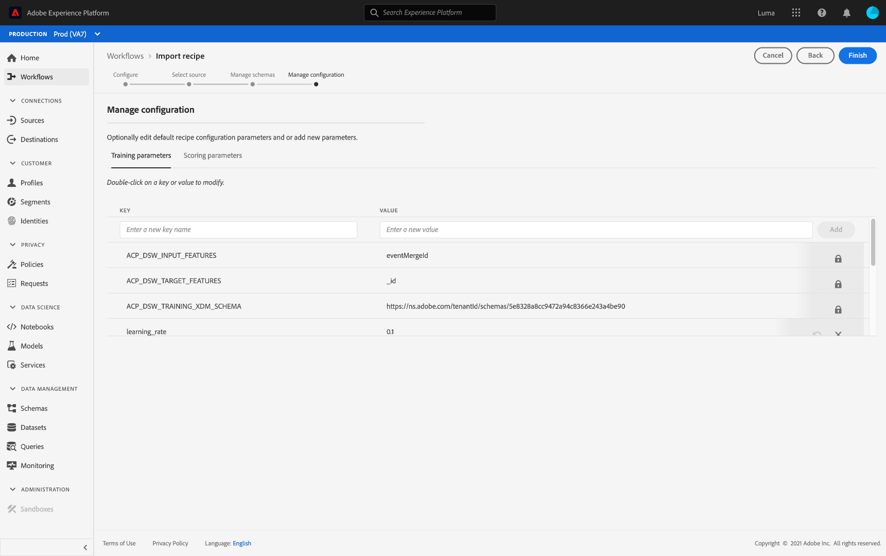

# Importare una composizione in pacchetti nell’interfaccia utente di Data Science Workspace

>[!NOTE]
>
>Data Science Workspace non è più disponibile per l’acquisto.
>
>Questa documentazione è destinata ai clienti esistenti che dispongono di diritti precedenti su Data Science Workspace.

Questo tutorial fornisce ad insight come configurare e importare una composizione in pacchetti utilizzando l’esempio di vendita al dettaglio fornito. Al termine di questa esercitazione, sarà possibile creare, addestrare e valutare un modello in Adobe Experience Platform [!DNL Data Science Workspace].

## Prerequisiti

Questo tutorial richiede una formula in pacchetti sotto forma di URL di un’immagine Docker. Per ulteriori informazioni, vedere il tutorial su come [creare un pacchetto dei file di origine in una ricetta](./package-source-files-recipe.md).

## Flusso di lavoro dell&#39;interfaccia utente

L&#39;importazione di una composizione in pacchetti in [!DNL Data Science Workspace] richiede configurazioni di composizione specifiche, compilate in un unico file JSON (JavaScript Object Notation). Questa compilazione di configurazioni di composizione viene definita file di configurazione. Una ricetta confezionata con un particolare set di configurazioni è indicata come istanza di ricetta. Una ricetta può essere utilizzata per creare molte istanze di ricetta in [!DNL Data Science Workspace].

Il flusso di lavoro per l’importazione di una composizione di pacchetto è costituito dai seguenti passaggi:

- [Configurare una ricetta](#configure)
- [Importa ricetta basata su Docker - Python](#python)
- [Importa ricetta basata su Docker - R](#r)
- [Importa ricetta basata su Docker - PySpark](#pyspark)
- [Importa ricetta basata su Docker - Scala](#scala)

### Configurare una ricetta {#configure}

Ogni istanza di ricetta in [!DNL Data Science Workspace] è accompagnata da un set di configurazioni che adattano l&#39;istanza di ricetta a un caso d&#39;uso particolare. I file di configurazione definiscono i comportamenti predefiniti di apprendimento e punteggio di un modello creato utilizzando questa istanza di ricetta.

>[!NOTE]
>
>I file di configurazione sono specifici per ricetta e caso.

Di seguito è riportato un file di configurazione di esempio che mostra i comportamenti predefiniti di formazione e punteggio per la ricetta di vendita al dettaglio.

```json
[
    {
        "name": "train",
        "parameters": [
            {
                "key": "learning_rate",
                "value": "0.1"  
            },
            {
                "key": "n_estimators",
                "value": "100"
            },
            {
                "key": "max_depth",
                "value": "3"
            },
            {
                "key": "ACP_DSW_INPUT_FEATURES",
                "value": "date,store,storeType,storeSize,temperature,regionalFuelPrice,markdown,cpi,unemployment,isHoliday"
            },
            {
                "key": "ACP_DSW_TARGET_FEATURES",
                "value": "weeklySales"
            },
            {
                "key": "ACP_DSW_FEATURE_UPDATE_SUPPORT",
                "value": false
            },
            {
                "key": "tenantId",
                "value": "_{TENANT_ID}"
            },
            {
                "key": "ACP_DSW_TRAINING_XDM_SCHEMA",
                "value": "{SEE BELOW FOR DETAILS}"
            },
            {
                "key": "evaluation.labelColumn",
                "value": "weeklySalesAhead"
            },
            {
                "key": "evaluation.metrics",
                "value": "MAPE,MAE,RMSE,MASE"
            }
        ]
    },
    {
        "name": "score",
        "parameters": [
            {
                "key": "tenantId",
                "value": "_{TENANT_ID}"
            },
            {
                "key":"ACP_DSW_SCORING_RESULTS_XDM_SCHEMA",
                "value":"{SEE BELOW FOR DETAILS}"
            }
        ]
    }
]
```

| Chiave parametro | Tipo | Descrizione |
| ----- | ----- | ----- |
| `learning_rate` | Numero | Scalare per la moltiplicazione del gradiente. |
| `n_estimators` | Numero | Numero di alberi nella foresta per Classificatore Foresta casuale. |
| `max_depth` | Numero | Profondità massima di un albero nel classificatore Foresta casuale. |
| `ACP_DSW_INPUT_FEATURES` | Stringa | Elenco di attributi dello schema di input separati da virgole. |
| `ACP_DSW_TARGET_FEATURES` | Stringa | Elenco di attributi dello schema di output separati da virgole. |
| `ACP_DSW_FEATURE_UPDATE_SUPPORT` | Booleano | Determina se le funzioni di input e output sono modificabili |
| `tenantId` | Stringa | Questo ID garantisce che le risorse create abbiano uno spazio dei nomi corretto e siano contenute all’interno dell’organizzazione. [Segui questi passaggi](../../xdm/api/getting-started.md#know-your-tenant_id) per trovare il tuo ID tenant. |
| `ACP_DSW_TRAINING_XDM_SCHEMA` | Stringa | Schema di input utilizzato per l’apprendimento di un modello. Lascia vuoto questo campo durante l’importazione nell’interfaccia utente, sostituisci con ID schema di apprendimento durante l’importazione tramite API. |
| `evaluation.labelColumn` | Stringa | Etichetta di colonna per le visualizzazioni di valutazione. |
| `evaluation.metrics` | Stringa | Elenco separato da virgole delle metriche di valutazione da utilizzare per la valutazione di un modello. |
| `ACP_DSW_SCORING_RESULTS_XDM_SCHEMA` | Stringa | Schema di output utilizzato per il punteggio di un modello. Lascia vuoto questo campo durante l’importazione nell’interfaccia utente, sostituisci con SchemaID con punteggio durante l’importazione tramite API. |

Ai fini di questa esercitazione, è possibile lasciare i file di configurazione predefiniti per la ricetta di vendita al dettaglio nel riferimento [!DNL Data Science Workspace] nel modo in cui sono.

### Importa ricetta basata su Docker - [!DNL Python] {#python}

Iniziare navigando e selezionando **[!UICONTROL Workflows]** che si trova in alto a sinistra nell&#39;interfaccia utente di [!DNL Experience Platform]. Quindi, selezionare **Importa ricetta** e selezionare **[!UICONTROL Launch]**.


Viene visualizzata la pagina **Configura** per il flusso di lavoro **Importa ricetta**. Inserisci un nome e una descrizione per la ricetta, quindi seleziona **[!UICONTROL Next]** nell&#39;angolo in alto a destra.


>[!NOTE]
>
> Nell&#39;esercitazione di [Creazione di pacchetti di file di origine in una ricetta](./package-source-files-recipe.md), è stato fornito un URL Docker al termine della creazione della ricetta di vendita al dettaglio utilizzando i file di origine Python.

Una volta nella pagina **Seleziona origine**, incolla l&#39;URL Docker corrispondente alla composizione del pacchetto creata utilizzando [!DNL Python] file di origine nel campo **[!UICONTROL Source URL]**. Quindi, importare il file di configurazione fornito trascinandolo o utilizzare il file system **Browser**. Il file di configurazione fornito si trova in `experience-platform-dsw-reference/recipes/python/retail/retail.config.json`. Selezionare **[!UICONTROL Python]** nel menu a discesa **Runtime** e **[!UICONTROL Classification]** nel menu a discesa **Type**. Una volta compilato tutto, seleziona **[!UICONTROL Next]** nell&#39;angolo in alto a destra per passare a **Gestisci schemi**.

>[!NOTE]
>
> Il tipo supporta **[!UICONTROL Classification]** e **[!UICONTROL Regression]**. Se il modello non rientra in uno di questi tipi, selezionare **[!UICONTROL Custom]**.


Quindi, seleziona gli schemi di input e output per la vendita al dettaglio nella sezione **Gestisci schemi**. Sono stati creati utilizzando lo script di avvio fornito nell&#39;esercitazione [crea lo schema e il set di dati per la vendita al dettaglio](../models-recipes/create-retails-sales-dataset.md).


Nella sezione **Gestione delle funzionalità**, seleziona l&#39;identificazione del tenant nel visualizzatore di schema per espandere lo schema di input Retail Sales. Selezionare le funzionalità di input e output evidenziando la funzionalità desiderata e selezionando **[!UICONTROL Input Feature]** o **[!UICONTROL Target Feature]** nella finestra **[!UICONTROL Field Properties]** a destra. Ai fini di questa esercitazione, impostare **[!UICONTROL weeklySales]** come **[!UICONTROL Target Feature]** e tutti gli altri elementi come **[!UICONTROL Input Feature]**. Seleziona **[!UICONTROL Next]** per rivedere la nuova ricetta configurata.

Rivedi la ricetta, aggiungi, modifica o rimuovi le configurazioni come necessario. Seleziona **[!UICONTROL Finish]** per creare la ricetta.



Procedi ai [passaggi successivi](#next-steps) per scoprire come creare un modello in [!DNL Data Science Workspace] utilizzando la ricetta di vendita al dettaglio appena creata.

### Importa ricetta basata su Docker - R {#r}

Iniziare navigando e selezionando **[!UICONTROL Workflows]** che si trova in alto a sinistra nell&#39;interfaccia utente di [!DNL Experience Platform]. Quindi, selezionare **Importa ricetta** e selezionare **[!UICONTROL Launch]**.


Viene visualizzata la pagina **Configura** per il flusso di lavoro **Importa ricetta**. Inserisci un nome e una descrizione per la ricetta, quindi seleziona **[!UICONTROL Next]** nell&#39;angolo in alto a destra.


>[!NOTE]
>
> Nell&#39;esercitazione [Creare un pacchetto dei file di origine in una ricetta](./package-source-files-recipe.md) è stato fornito un URL Docker al termine della creazione della ricetta di vendita al dettaglio utilizzando i file di origine R.

Una volta nella pagina **Seleziona origine**, incolla l&#39;URL Docker corrispondente alla composizione del pacchetto creata utilizzando i file di origine R nel campo **[!UICONTROL Source URL]**. Quindi, importare il file di configurazione fornito trascinandolo o utilizzare il file system **Browser**. Il file di configurazione fornito si trova in `experience-platform-dsw-reference/recipes/R/Retail\ -\ GradientBoosting/retail.config.json`. Selezionare **[!UICONTROL R]** nel menu a discesa **Runtime** e **[!UICONTROL Classification]** nel menu a discesa **Type**. Una volta compilato tutto, seleziona **[!UICONTROL Next]** nell&#39;angolo in alto a destra per passare a **Gestisci schemi**.

>[!NOTE]
>
> *Type* supporta **[!UICONTROL Classification]** e **[!UICONTROL Regression]**. Se il modello non rientra in uno di questi tipi, selezionare **[!UICONTROL Custom]**.


Quindi, seleziona gli schemi di input e output per la vendita al dettaglio nella sezione **Gestisci schemi**. Sono stati creati utilizzando lo script di avvio fornito nell&#39;esercitazione [crea lo schema e il set di dati per la vendita al dettaglio](../models-recipes/create-retails-sales-dataset.md).


Nella sezione *Gestione delle funzionalità*, seleziona l&#39;identificazione del tenant nel visualizzatore di schema per espandere lo schema di input Retail Sales. Selezionare le funzionalità di input e output evidenziando la funzionalità desiderata e selezionando **[!UICONTROL Input Feature]** o **[!UICONTROL Target Feature]** nella finestra **[!UICONTROL Field Properties]** a destra. Ai fini di questa esercitazione, impostare **[!UICONTROL weeklySales]** come **[!UICONTROL Target Feature]** e tutti gli altri elementi come **[!UICONTROL Input Feature]**. Seleziona **[!UICONTROL Next]** per rivedere la nuova ricetta configurata.

Rivedi la ricetta, aggiungi, modifica o rimuovi le configurazioni come necessario. Seleziona **Fine** per creare la ricetta.


Procedi ai [passaggi successivi](#next-steps) per scoprire come creare un modello in [!DNL Data Science Workspace] utilizzando la ricetta di vendita al dettaglio appena creata.

### Importa ricetta basata su Docker - PySpark {#pyspark}

Iniziare navigando e selezionando **[!UICONTROL Workflows]** che si trova in alto a sinistra nell&#39;interfaccia utente di [!DNL Experience Platform]. Quindi, selezionare **Importa ricetta** e selezionare **[!UICONTROL Launch]**.


Viene visualizzata la pagina **Configura** per il flusso di lavoro **Importa ricetta**. Inserisci un nome e una descrizione per la ricetta, quindi seleziona **[!UICONTROL Next]** nell&#39;angolo in alto a destra per procedere.


>[!NOTE]
>
> Nell&#39;esercitazione [Creare pacchetti di file di origine in una ricetta](./package-source-files-recipe.md) è stato fornito un URL Docker al termine della creazione della ricetta di vendita al dettaglio utilizzando i file di origine PySpark.

Una volta nella pagina **Seleziona origine**, incolla l&#39;URL Docker corrispondente alla composizione del pacchetto creata utilizzando i file di origine PySpark nel campo **[!UICONTROL Source URL]**. Quindi, importare il file di configurazione fornito trascinandolo o utilizzare il file system **Browser**. Il file di configurazione fornito si trova in `experience-platform-dsw-reference/recipes/pyspark/retail/pipeline.json`. Selezionare **[!UICONTROL PySpark]** nel menu a discesa **Runtime**. Dopo aver selezionato il runtime di PySpark, l&#39;artefatto predefinito viene automaticamente popolato in **[!UICONTROL Docker]**. Selezionare **[!UICONTROL Classification]** nel menu a discesa **Tipo**. Una volta compilato tutto, seleziona **[!UICONTROL Next]** nell&#39;angolo in alto a destra per passare a **Gestisci schemi**.

>[!NOTE]
>
> *Type* supporta **[!UICONTROL Classification]** e **[!UICONTROL Regression]**. Se il modello non rientra in uno di questi tipi, selezionare **[!UICONTROL Custom]**.


Quindi, seleziona gli schemi di input e output per la vendita al dettaglio utilizzando il selettore **Gestisci schemi**. Gli schemi sono stati creati utilizzando lo script di avvio fornito nell&#39;esercitazione [Crea schema e set di dati per la vendita al dettaglio](../models-recipes/create-retails-sales-dataset.md).


Nella sezione **Gestione delle funzionalità**, seleziona l&#39;identificazione del tenant nel visualizzatore di schema per espandere lo schema di input Retail Sales. Selezionare le funzionalità di input e output evidenziando la funzionalità desiderata e selezionando **[!UICONTROL Input Feature]** o **[!UICONTROL Target Feature]** nella finestra **[!UICONTROL Field Properties]** a destra. Ai fini di questa esercitazione, impostare **[!UICONTROL weeklySales]** come **[!UICONTROL Target Feature]** e tutti gli altri elementi come **[!UICONTROL Input Feature]**. Seleziona **[!UICONTROL Next]** per rivedere la nuova ricetta configurata.


Rivedi la ricetta, aggiungi, modifica o rimuovi le configurazioni come necessario. Seleziona **[!UICONTROL Finish]** per creare la ricetta.


Procedi ai [passaggi successivi](#next-steps) per scoprire come creare un modello in [!DNL Data Science Workspace] utilizzando la ricetta di vendita al dettaglio appena creata.

### Importa ricetta basata su Docker - Scala {#scala}

Iniziare navigando e selezionando **[!UICONTROL Workflows]** che si trova in alto a sinistra nell&#39;interfaccia utente di [!DNL Experience Platform]. Quindi, selezionare **Importa ricetta** e selezionare **[!UICONTROL Launch]**.


Viene visualizzata la pagina **Configura** per il flusso di lavoro **Importa ricetta**. Inserisci un nome e una descrizione per la ricetta, quindi seleziona **[!UICONTROL Next]** nell&#39;angolo in alto a destra per procedere.


>[!NOTE]
>
> Nell&#39;esercitazione [Creazione di pacchetti di file di origine in una ricetta](./package-source-files-recipe.md) è stato fornito un URL Docker al termine della creazione della ricetta di vendita al dettaglio utilizzando i file di origine Scala ([!DNL Spark]).

Una volta nella pagina **Seleziona origine**, incolla l&#39;URL Docker corrispondente alla composizione del pacchetto creata utilizzando i file di origine Scala nel campo URL Source. Quindi, importa il file di configurazione fornito trascinandolo e rilasciandolo oppure utilizza il browser del file system. Il file di configurazione fornito si trova in `experience-platform-dsw-reference/recipes/scala/retail/pipelineservice.json`. Selezionare **[!UICONTROL Spark]** nel menu a discesa **Runtime**. Una volta selezionato il runtime [!DNL Spark], l&#39;artefatto predefinito viene automaticamente popolato in **[!UICONTROL Docker]**. Selezionare **[!UICONTROL Regression]** dal menu a discesa **Tipo**. Una volta compilato tutto, seleziona **[!UICONTROL Next]** nell&#39;angolo in alto a destra per passare a **Gestisci schemi**.

>[!NOTE]
>
> Il tipo supporta **[!UICONTROL Classification]** e **[!UICONTROL Regression]**. Se il modello non rientra in uno di questi tipi, selezionare **[!UICONTROL Custom]**.


Quindi, seleziona gli schemi di input e output per la vendita al dettaglio utilizzando il selettore **Gestisci schemi**. Gli schemi sono stati creati utilizzando lo script di avvio fornito nell&#39;esercitazione [Crea schema e set di dati per la vendita al dettaglio](../models-recipes/create-retails-sales-dataset.md).


Nella sezione **Gestione delle funzionalità**, seleziona l&#39;identificazione del tenant nel visualizzatore di schema per espandere lo schema di input Retail Sales. Selezionare le funzionalità di input e output evidenziando la funzionalità desiderata e selezionando **[!UICONTROL Input Feature]** o **[!UICONTROL Target Feature]** nella finestra **[!UICONTROL Field Properties]** a destra. Ai fini di questa esercitazione, impostare &quot;[!UICONTROL weeklySales]&quot; come **[!UICONTROL Target Feature]** e tutto il resto come **[!UICONTROL Input Feature]**. Seleziona **[!UICONTROL Next]** per rivedere la nuova ricetta configurata.


Rivedi la ricetta, aggiungi, modifica o rimuovi le configurazioni come necessario. Seleziona **[!UICONTROL Finish]** per creare la ricetta.


Procedi ai [passaggi successivi](#next-steps) per scoprire come creare un modello in [!DNL Data Science Workspace] utilizzando la ricetta di vendita al dettaglio appena creata.

## Passaggi successivi {#next-steps}

Questo tutorial ha fornito ad insight informazioni sulla configurazione e l&#39;importazione di una ricetta in [!DNL Data Science Workspace]. Ora puoi creare, addestrare e valutare un modello utilizzando la ricetta appena creata.

- [Addestra e valuta un modello nell’interfaccia utente](./train-evaluate-model-ui.md)
- [Formazione e valutazione di un modello tramite l’API](./train-evaluate-model-api.md)
