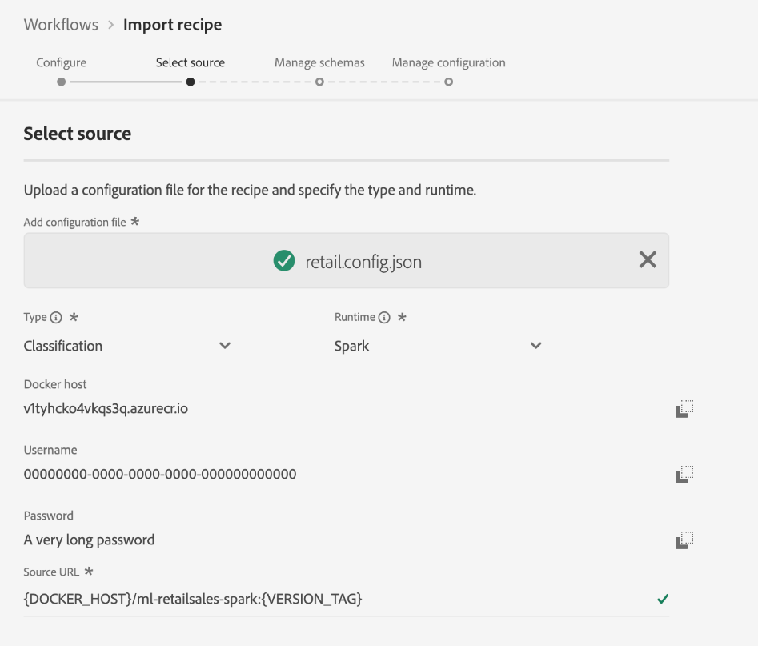

# Importare una ricetta confezionata nell’interfaccia utente di Data Science Workspace

Questa esercitazione fornisce informazioni su come configurare e importare una ricetta in pacchetto utilizzando l&#39;esempio di vendita al dettaglio fornito. Al termine di questa esercitazione, potrai creare, addestrare e valutare un modello in Adobe Experience Platform [!DNL Data Science Workspace].

## Prerequisiti

Questa esercitazione richiede una ricetta confezionata sotto forma di URL immagine Docker. Guarda l’esercitazione su come [Creare pacchetti di file di origine in una composizione](./package-source-files-recipe.md) per ulteriori informazioni.

## Flusso di lavoro dell’interfaccia

Importazione di una ricetta imballata in [!DNL Data Science Workspace] richiede configurazioni di ricette specifiche, compilate in un unico file JavaScript Object Notation (JSON), questa raccolta di configurazioni di ricette è definita file di configurazione. Una ricetta confezionata con un particolare insieme di configurazioni è definita un&#39;istanza di ricetta. Una ricetta può essere utilizzata per creare molte istanze di ricetta in [!DNL Data Science Workspace].

Il flusso di lavoro per l’importazione di una ricetta di pacchetto è costituito dai seguenti passaggi:
- [Configurare una ricetta](#configure)
- [Ricetta basata su Docker di importazione - Python](#python)
- [Ricetta basata su Docker di importazione - R](#r)
- [Ricetta basata su Docker di importazione - PySpark](#pyspark)
- [Ricetta basata su Docker di importazione - Scala](#scala)

### Configurare una ricetta {#configure}

Ogni istanza di ricetta in [!DNL Data Science Workspace] è accompagnato da una serie di configurazioni che adattano l&#39;istanza di ricetta a un particolare caso d&#39;uso. I file di configurazione definiscono i comportamenti di formazione e valutazione predefiniti di un modello creato utilizzando questa istanza di ricetta.

>[!NOTE]
>
>I file di configurazione sono specifici per ricetta e caso.

Di seguito è riportato un esempio di file di configurazione che mostra i comportamenti di formazione e valutazione predefiniti per la ricetta Vendite al dettaglio.

```json
[
    {
        "name": "train",
        "parameters": [
            {
                "key": "learning_rate",
                "value": "0.1"  
            },
            {
                "key": "n_estimators",
                "value": "100"
            },
            {
                "key": "max_depth",
                "value": "3"
            },
            {
                "key": "ACP_DSW_INPUT_FEATURES",
                "value": "date,store,storeType,storeSize,temperature,regionalFuelPrice,markdown,cpi,unemployment,isHoliday"
            },
            {
                "key": "ACP_DSW_TARGET_FEATURES",
                "value": "weeklySales"
            },
            {
                "key": "ACP_DSW_FEATURE_UPDATE_SUPPORT",
                "value": false
            },
            {
                "key": "tenantId",
                "value": "_{TENANT_ID}"
            },
            {
                "key": "ACP_DSW_TRAINING_XDM_SCHEMA",
                "value": "{SEE BELOW FOR DETAILS}"
            },
            {
                "key": "evaluation.labelColumn",
                "value": "weeklySalesAhead"
            },
            {
                "key": "evaluation.metrics",
                "value": "MAPE,MAE,RMSE,MASE"
            }
        ]
    },
    {
        "name": "score",
        "parameters": [
            {
                "key": "tenantId",
                "value": "_{TENANT_ID}"
            },
            {
                "key":"ACP_DSW_SCORING_RESULTS_XDM_SCHEMA",
                "value":"{SEE BELOW FOR DETAILS}"
            }
        ]
    }
]
```

| Chiave parametro | Tipo | Descrizione |
| ----- | ----- | ----- |
| `learning_rate` | Numero | Scalare per la moltiplicazione del gradiente. |
| `n_estimators` | Numero | Numero di alberi nella foresta per Classificatore Foresta casuale. |
| `max_depth` | Numero | Profondità massima di un albero nel classificatore Foresta casuale. |
| `ACP_DSW_INPUT_FEATURES` | Stringa | Elenco degli attributi dello schema di input separati da virgole. |
| `ACP_DSW_TARGET_FEATURES` | Stringa | Elenco degli attributi dello schema di output separati da virgole. |
| `ACP_DSW_FEATURE_UPDATE_SUPPORT` | Booleano | Determina se le funzioni di input e output sono modificabili |
| `tenantId` | Stringa | Questo ID assicura che le risorse create siano spuntate correttamente e contenute all’interno dell’organizzazione IMS. [Segui i passaggi qui](../../xdm/api/getting-started.md#know-your-tenant_id) per trovare l’ID tenant. |
| `ACP_DSW_TRAINING_XDM_SCHEMA` | Stringa | Lo schema di input utilizzato per la formazione di un modello. Lascia vuoto questo campo durante l’importazione nell’interfaccia utente, sostituisci con ID schema di formazione durante l’importazione tramite API. |
| `evaluation.labelColumn` | Stringa | Etichetta colonna per le visualizzazioni di valutazione. |
| `evaluation.metrics` | Stringa | Elenco separato da virgole delle metriche di valutazione da utilizzare per la valutazione di un modello. |
| `ACP_DSW_SCORING_RESULTS_XDM_SCHEMA` | Stringa | Lo schema di output utilizzato per il punteggio di un modello. Lascia vuoto questo campo durante l’importazione nell’interfaccia utente, sostituiscilo con il punteggio SchemaID durante l’importazione tramite API. |

Ai fini di questa esercitazione, puoi lasciare i file di configurazione predefiniti per la ricetta Vendite al dettaglio nella sezione [!DNL Data Science Workspace] Fai riferimento a come sono.

### Ricetta basata su Docker di importazione - [!DNL Python] {#python}

Inizia navigando e selezionando **[!UICONTROL Flussi di lavoro]** in alto a sinistra del [!DNL Platform] Interfaccia utente. Quindi, seleziona **Ricetta di importazione** e seleziona **[!UICONTROL Launch]**.


La **Configura** per **Ricetta di importazione** viene visualizzato il flusso di lavoro . Inserisci un nome e una descrizione per la ricetta, quindi seleziona **[!UICONTROL Successivo]** nell&#39;angolo in alto a destra.


>[!NOTE]
>
> In [Creare pacchetti di file di origine in una composizione](./package-source-files-recipe.md) esercitazione, al termine della creazione della ricetta Vendite al dettaglio utilizzando i file sorgente Python è stato fornito un URL Docker.

Una volta che sei sul **Seleziona origine** incolla l’URL Docker corrispondente alla ricetta in pacchetto creata utilizzando [!DNL Python] file di origine nel **[!UICONTROL URL sorgente]** campo . Quindi, importare il file di configurazione fornito trascinandolo e rilasciandolo oppure utilizzare il file system **Browser**. Il file di configurazione fornito si trova in `experience-platform-dsw-reference/recipes/python/retail/retail.config.json`. Seleziona **[!UICONTROL Pitone]** in **Runtime** a discesa e **[!UICONTROL Classificazione]** in **Tipo** a discesa. Una volta completato tutto, seleziona **[!UICONTROL Successivo]** nell&#39;angolo in alto a destra per procedere **Gestire gli schemi**.

>[!NOTE]
>
> Supporto per i tipi **[!UICONTROL Classificazione]** e **[!UICONTROL Regressione]**. Se il modello non rientra in uno di questi tipi, selezionare **[!UICONTROL Personalizzato]**.


Quindi, seleziona gli schemi di input e output vendite al dettaglio nella sezione . **Gestire gli schemi**, sono stati creati utilizzando lo script bootstrap fornito nel [creare lo schema e il set di dati di vendita al dettaglio](../models-recipes/create-retails-sales-dataset.md) esercitazione.


Sotto la **Gestione delle funzioni** seleziona l’identificazione del tenant nel visualizzatore schema per espandere lo schema di input Vendite al dettaglio. Seleziona le feature di input e output evidenziando la feature desiderata e selezionane una **[!UICONTROL Funzione di input]** o **[!UICONTROL Funzionalità di Target]** a destra **[!UICONTROL Proprietà campo]** finestra. Ai fini di questa esercitazione, imposta **[!UICONTROL weeklySales]** come  **[!UICONTROL Funzionalità di Target]** e tutto il resto come **[!UICONTROL Funzione di input]**. Seleziona **[!UICONTROL Successivo]** per rivedere la nuova ricetta configurata.

Esamina la ricetta, aggiungi, modifica o rimuovi le configurazioni in base alle necessità. Seleziona **[!UICONTROL Fine]** per creare la ricetta.


Procedi al [passaggi successivi](#next-steps) per scoprire come creare un modello in [!DNL Data Science Workspace] utilizzando la ricetta vendite al dettaglio appena creata.

### Ricetta basata su Docker di importazione - R {#r}

Inizia navigando e selezionando **[!UICONTROL Flussi di lavoro]** in alto a sinistra del [!DNL Platform] Interfaccia utente. Quindi, seleziona **Ricetta di importazione** e seleziona **[!UICONTROL Launch]**.


La **Configura** per **Ricetta di importazione** viene visualizzato il flusso di lavoro . Inserisci un nome e una descrizione per la ricetta, quindi seleziona **[!UICONTROL Successivo]** nell&#39;angolo in alto a destra.


>[!NOTE]
>
> In [Creare pacchetti di file di origine in una composizione](./package-source-files-recipe.md) esercitazione, al termine della creazione della ricetta Vendite al dettaglio utilizzando i file sorgente R è stato fornito un URL Docker.

Una volta che sei sul **Seleziona origine** incolla l&#39;URL Docker corrispondente alla ricetta in pacchetto creata utilizzando i file di origine R nel **[!UICONTROL URL sorgente]** campo . Quindi, importare il file di configurazione fornito trascinandolo e rilasciandolo oppure utilizzare il file system **Browser**. Il file di configurazione fornito si trova in `experience-platform-dsw-reference/recipes/R/Retail\ -\ GradientBoosting/retail.config.json`. Seleziona **[!UICONTROL R]** in **Runtime** a discesa e **[!UICONTROL Classificazione]** in **Tipo** a discesa. Una volta completato tutto, seleziona **[!UICONTROL Successivo]** nell&#39;angolo in alto a destra per procedere **Gestire gli schemi**.

>[!NOTE]
>
> *Tipo* supporta **[!UICONTROL Classificazione]** e **[!UICONTROL Regressione]**. Se il modello non rientra in uno di questi tipi, selezionare **[!UICONTROL Personalizzato]**.


Quindi, seleziona gli schemi di input e output vendite al dettaglio nella sezione . **Gestire gli schemi**, sono stati creati utilizzando lo script bootstrap fornito nel [creare lo schema e il set di dati di vendita al dettaglio](../models-recipes/create-retails-sales-dataset.md) esercitazione.


Sotto la *Gestione delle funzioni* seleziona l’identificazione del tenant nel visualizzatore schema per espandere lo schema di input Vendite al dettaglio. Seleziona le feature di input e output evidenziando la feature desiderata e selezionane una **[!UICONTROL Funzione di input]** o **[!UICONTROL Funzionalità di Target]** a destra **[!UICONTROL Proprietà campo]** finestra. Ai fini di questa esercitazione, imposta **[!UICONTROL weeklySales]** come  **[!UICONTROL Funzionalità di Target]** e tutto il resto come **[!UICONTROL Funzione di input]**. Seleziona **[!UICONTROL Successivo]** per rivedere la tua nuova ricetta configurata.

Esamina la ricetta, aggiungi, modifica o rimuovi le configurazioni in base alle necessità. Seleziona **Fine** per creare la ricetta.


Procedi al [passaggi successivi](#next-steps) per scoprire come creare un modello in [!DNL Data Science Workspace] utilizzando la ricetta vendite al dettaglio appena creata.

### Ricetta basata su Docker di importazione - PySpark {#pyspark}

Inizia navigando e selezionando **[!UICONTROL Flussi di lavoro]** in alto a sinistra del [!DNL Platform] Interfaccia utente. Quindi, seleziona **Ricetta di importazione** e seleziona **[!UICONTROL Launch]**.


La **Configura** per **Ricetta di importazione** viene visualizzato il flusso di lavoro . Inserisci un nome e una descrizione per la ricetta, quindi seleziona **[!UICONTROL Successivo]** nell&#39;angolo in alto a destra per proseguire.


>[!NOTE]
>
> In [Creare pacchetti di file di origine in una composizione](./package-source-files-recipe.md) esercitazione, alla fine della creazione della ricetta Vendite al dettaglio utilizzando i file sorgente PySpark è stato fornito un URL Docker.

Una volta che sei sul **Seleziona origine** incolla l&#39;URL Docker corrispondente alla ricetta in pacchetto creata utilizzando i file di origine PySpark nel **[!UICONTROL URL sorgente]** campo . Quindi, importare il file di configurazione fornito trascinandolo e rilasciandolo oppure utilizzare il file system **Browser**. Il file di configurazione fornito si trova in `experience-platform-dsw-reference/recipes/pyspark/retail/pipeline.json`. Seleziona **[!UICONTROL PySpark]** in **Runtime** a discesa. Una volta selezionato il runtime PySpark, l’artefatto predefinito si popola automaticamente in **[!UICONTROL Docker]**. Quindi, seleziona **[!UICONTROL Classificazione]** in **Tipo** a discesa. Una volta completato tutto, seleziona **[!UICONTROL Successivo]** nell&#39;angolo in alto a destra per procedere **Gestire gli schemi**.

>[!NOTE]
>
> *Tipo* supporta **[!UICONTROL Classificazione]** e **[!UICONTROL Regressione]**. Se il modello non rientra in uno di questi tipi, selezionare **[!UICONTROL Personalizzato]**.


Quindi, seleziona gli schemi di input e output vendite al dettaglio utilizzando **Gestire gli schemi** selettore, gli schemi sono stati creati utilizzando lo script bootstrap fornito nel [creare lo schema e il set di dati di vendita al dettaglio](../models-recipes/create-retails-sales-dataset.md) esercitazione.


Sotto la **Gestione delle funzioni** seleziona l’identificazione del tenant nel visualizzatore schema per espandere lo schema di input Vendite al dettaglio. Seleziona le feature di input e output evidenziando la feature desiderata e selezionane una **[!UICONTROL Funzione di input]** o **[!UICONTROL Funzionalità di Target]** a destra **[!UICONTROL Proprietà campo]** finestra. Ai fini di questa esercitazione, imposta **[!UICONTROL weeklySales]** come  **[!UICONTROL Funzionalità di Target]** e tutto il resto come **[!UICONTROL Funzione di input]**. Seleziona **[!UICONTROL Successivo]** per rivedere la nuova ricetta configurata.


Esamina la ricetta, aggiungi, modifica o rimuovi le configurazioni in base alle necessità. Seleziona **[!UICONTROL Fine]** per creare la ricetta.


Procedi al [passaggi successivi](#next-steps) per scoprire come creare un modello in [!DNL Data Science Workspace] utilizzando la ricetta vendite al dettaglio appena creata.

### Ricetta basata su Docker di importazione - Scala {#scala}

Inizia navigando e selezionando **[!UICONTROL Flussi di lavoro]** in alto a sinistra del [!DNL Platform] Interfaccia utente. Quindi, seleziona **Ricetta di importazione** e seleziona **[!UICONTROL Launch]**.


La **Configura** per **Ricetta di importazione** viene visualizzato il flusso di lavoro . Inserisci un nome e una descrizione per la ricetta, quindi seleziona **[!UICONTROL Successivo]** nell&#39;angolo in alto a destra per proseguire.


>[!NOTE]
>
> In [Creare pacchetti di file di origine in una composizione](./package-source-files-recipe.md) esercitazione, al termine della creazione della ricetta Vendite al dettaglio utilizzando Scala è stato fornito un URL Docker ([!DNL Spark]) file di origine.

Una volta che sei sul **Seleziona origine** incolla l’URL Docker corrispondente alla ricetta in pacchetto creata utilizzando i file di origine Scala nel campo URL di origine . Quindi, importare il file di configurazione fornito trascinandolo e rilasciandolo oppure utilizzare il browser del file system. Il file di configurazione fornito si trova in `experience-platform-dsw-reference/recipes/scala/retail/pipelineservice.json`. Seleziona **[!UICONTROL Parco]** in **Runtime** a discesa. Una volta che [!DNL Spark] il runtime è selezionato l’artefatto predefinito si popola automaticamente in **[!UICONTROL Docker]**. Quindi, seleziona **[!UICONTROL Regressione]** dal **Tipo** a discesa. Una volta completato tutto, seleziona **[!UICONTROL Successivo]** nell&#39;angolo in alto a destra per procedere **Gestire gli schemi**.

>[!NOTE]
>
> Supporto per i tipi **[!UICONTROL Classificazione]** e **[!UICONTROL Regressione]**. Se il modello non rientra in uno di questi tipi, selezionare **[!UICONTROL Personalizzato]**.



Quindi, seleziona gli schemi di input e output vendite al dettaglio utilizzando **Gestire gli schemi** selettore, gli schemi sono stati creati utilizzando lo script bootstrap fornito nel [creare lo schema e il set di dati di vendita al dettaglio](../models-recipes/create-retails-sales-dataset.md) esercitazione.


Sotto la **Gestione delle funzioni** seleziona l’identificazione del tenant nel visualizzatore schema per espandere lo schema di input Vendite al dettaglio. Seleziona le feature di input e output evidenziando la feature desiderata e selezionane una **[!UICONTROL Funzione di input]** o **[!UICONTROL Funzionalità di Target]** a destra **[!UICONTROL Proprietà campo]** finestra. Ai fini di questa esercitazione, imposta &quot;[!UICONTROL weeklySales]&quot; come  **[!UICONTROL Funzionalità di Target]** e tutto il resto come **[!UICONTROL Funzione di input]**. Seleziona **[!UICONTROL Successivo]** per rivedere la nuova ricetta configurata.


Esamina la ricetta, aggiungi, modifica o rimuovi le configurazioni in base alle necessità. Seleziona **[!UICONTROL Fine]** per creare la ricetta.


Procedi al [passaggi successivi](#next-steps) per scoprire come creare un modello in [!DNL Data Science Workspace] utilizzando la ricetta vendite al dettaglio appena creata.

## Passaggi successivi {#next-steps}

Questa esercitazione ha fornito informazioni sulla configurazione e l’importazione di una ricetta in [!DNL Data Science Workspace]. È ora possibile creare, addestrare e valutare un modello utilizzando la ricetta appena creata.

- [Formazione e valutazione di un modello nell’interfaccia utente](./train-evaluate-model-ui.md)
- [Addestrare e valutare un modello utilizzando l’API](./train-evaluate-model-api.md)
