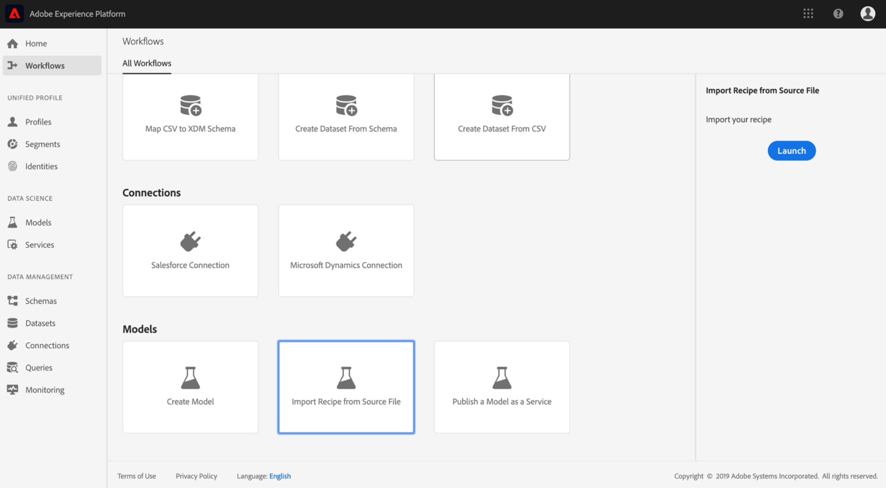

# Creare pacchetti di file sorgente in una ricetta

Questa esercitazione fornisce istruzioni su come creare pacchetti di file sorgente di esempio per le vendite al dettaglio in un file di archivio, che può essere utilizzato per creare una ricetta in Adobe Experience Platform Data Science Workspace seguendo il flusso di lavoro di importazione delle ricette nell&#39;interfaccia utente o utilizzando l&#39;API.

Concetti da comprendere:

- **Ricette**: Una ricetta è il termine utilizzato da Adobe per specificare un modello ed è un contenitore di primo livello che rappresenta uno specifico sistema di machine learning, un algoritmo di intelligenza artificiale o un insieme di algoritmi, una logica di elaborazione e una configurazione necessarie per creare ed eseguire un modello qualificato e quindi per risolvere problemi aziendali specifici.
- **File** sorgente: Singoli file nel progetto che contengono la logica per una ricetta.

## Prerequisiti

- [Docker](https://docs.docker.com/install/#supported-platforms)
- [Python 3 e pip](https://docs.conda.io/en/latest/miniconda.html)
- [Scala](https://www.scala-sbt.org/download.html?_ga=2.42231906.690987621.1558478883-2004067584.1558478883)
- [Paradiso](https://maven.apache.org/install.html)

## Creazione di ricette

La creazione di ricette inizia con la creazione di pacchetti di file sorgente per creare un file di archivio. I file di origine definiscono la logica di machine learning e gli algoritmi utilizzati per risolvere un problema specifico a portata di mano e sono scritti in Python, R, PySpark o Scala Spark. A seconda della lingua in cui sono scritti i file sorgente, i file di archivio generati saranno un&#39;immagine Docker o un file binario. Una volta creato, il file di archivio del pacchetto viene importato in Data Science Workspace per creare una ricetta [nell&#39;interfaccia utente](./import-packaged-recipe-ui.md) o [utilizzando l&#39;API](./import-packaged-recipe-api.md).

### Authoring di modelli basato su docker

Un&#39;immagine Docker consente a uno sviluppatore di creare un pacchetto con tutte le parti necessarie, come librerie e altre dipendenze, e inviarlo come un unico pacchetto.

L&#39;immagine Docker creata verrà inviata al Registro di sistema del contenitore di Azure utilizzando le credenziali fornite durante il flusso di lavoro di creazione della ricetta.

>[!NOTE] Solo i file di origine scritti in **Python**, **R** e **Tensorflow** richiedono le credenziali del Registro di sistema del contenitore di Azure.

Per ottenere le credenziali del Registro di sistema del contenitore di Azure, accedi ad <a href="https://platform.adobe.com" target="_blank">Adobe Experience Platform</a>. Nella colonna di navigazione a sinistra, andate a **Flussi di lavoro**. Selezionate **Importa ricetta dal file** di origine e **avviate** una nuova procedura di importazione. Per riferimento, vedere la schermata sottostante.



Fornite un Nome **** ricetta appropriato, ad esempio &quot;Ricetta vendite al dettaglio&quot;, e facoltativamente fornite una descrizione o un URL della documentazione. Al termine, fate clic su **Avanti**.


Selezionare il **runtime** appropriato, quindi scegliere **Classificazione** per **Tipo**. Verranno generate le credenziali del Registro di sistema del contenitore di Azure.


Prendete nota dei valori per **Docker Host**, **Nome utente** e **Password**. Questi verranno utilizzati in seguito per creare e inviare l&#39;immagine Docker.

Una volta inviato, voi e altri utenti potete accedere all’immagine tramite URL. Il campo File **** di origine prevede che questo URL venga inserito come input.

### Authoring di modelli binario

Per i file sorgente scritti in Scala o PySpark, verrà generato un file binario. La creazione del file binario è semplice come l&#39;esecuzione dello script di compilazione fornito.
>[!NOTE] Solo i file sorgente scritti in ScalaSpark o PySpark genereranno un file binario all&#39;esecuzione dello script di compilazione.

### Creare pacchetti di file sorgente

Per iniziare, ottieni il codice di esempio trovato nell’archivio di riferimento <a href="https://github.com/adobe/experience-platform-dsw-reference" target="_blank">di</a> Experience Platform Data Science Workspace. A seconda del linguaggio di programmazione in cui vengono scritti i file sorgente di esempio, la creazione dei rispettivi file di archivio differisce per procedura.

- [Creare un&#39;immagine Python Docker](#build-python-docker-image)
- [Genera immagine Docker R](#build-r-docker-image)
- [Creare file binari PySpark](#build-pyspark-binaries)
- [Creare file binari Scala](#build-scala-binaries)

#### Creare un&#39;immagine Python Docker

Se non lo avete fatto, clonate il repository github nel sistema locale con il seguente comando:

```shell
git clone https://github.com/adobe/experience-platform-dsw-reference.git
```

Navigate to the directory `experience-platform-dsw-reference/recipes/python/retail`. Qui troverete gli script `login.sh` e `build.sh` che utilizzerete per accedere al Docker e per creare l&#39;immagine del python Docker. Se disponete delle credenziali [](#docker-based-model-authoring) Docker, immettete i seguenti comandi nell&#39;ordine:

```BASH
# for logging in to Docker
./login.sh
 
# for building Docker image
./build.sh
```

Durante l&#39;esecuzione dello script di login, dovrete fornire l&#39;host Docker, il nome utente e la password. Durante la creazione, è necessario fornire l&#39;host Docker e un tag di versione per la build.

Una volta completato lo script di compilazione, nell&#39;output della console viene fornito un URL del file sorgente Docker. Per questo esempio specifico, avrà un aspetto simile a:

```BASH
# URL format: 
{DOCKER_HOST}/ml-retailsales-python:{VERSION_TAG}
```

Copiate questo URL e passate ai passaggi [successivi](#next-steps).

#### Genera immagine Docker R

Se non lo avete fatto, clonate il repository github nel sistema locale con il seguente comando:

```BASH
git clone https://github.com/adobe/experience-platform-dsw-reference.git
```

Andate alla directory `experience-platform-dsw-reference/recipes/R/Retail - GradientBoosting` all&#39;interno del repository clonato. Qui troverete i file `login.sh` e `build.sh` che utilizzerete per accedere al Docker e per creare l&#39;immagine del Docker R. Se disponete delle credenziali [](#docker-based-model-authoring) Docker, immettete i seguenti comandi nell&#39;ordine:

```BASH
# for logging in to Docker
./login.sh
 
# for build Docker image
./build.sh
```

Durante l&#39;esecuzione dello script di login, dovrete fornire l&#39;host Docker, il nome utente e la password. Durante la creazione, è necessario fornire l&#39;host Docker e un tag di versione per la build.

Una volta completato lo script di compilazione, nell&#39;output della console viene fornito un URL del file sorgente Docker. Per questo esempio specifico, avrà un aspetto simile a:

```BASH
# URL format: 
{DOCKER_HOST}/ml-retail-r:{VERSION_TAG}
```

Copiate questo URL e passate ai passaggi [successivi](#next-steps).

#### Creare file binari PySpark

Se non lo avete fatto, clonate il repository github nel sistema locale con il seguente comando:

```BASH
git clone https://github.com/adobe/experience-platform-dsw-reference.git
```

Accedete all&#39;archivio clonato nel sistema locale ed eseguite i seguenti comandi per creare il `.egg` file richiesto per l&#39;importazione di una ricetta PySpark:

```BASH
cd recipes/pyspark
./build.sh
```

Il `.egg` file viene generato nella `dist` cartella.

Ora puoi passare ai passaggi [successivi](#next-steps).

#### Creare file binari Scala

Se non lo avete ancora fatto, eseguite il comando seguente per duplicare il repository di Github nel sistema locale:

```BASH
git clone https://github.com/adobe/experience-platform-dsw-reference.git
```

Per creare l&#39; `.jar` artefatto utilizzato per importare una ricetta Scala, andate al repository clonato e seguite la procedura seguente:

```BASH
cd recipes/scala/
./build.sh
```

L&#39; `.jar` artifact generato con dipendenze si trova nella `/target` directory.

Ora puoi passare ai passaggi [successivi](#next-steps).

## Passaggi successivi

Questa esercitazione ha passato i file di origine del pacchetto in una Ricetta, il passaggio preliminare per l&#39;importazione di una Ricetta in Data Science Workspace. È ora necessario disporre di un&#39;immagine Docker nel Registro di sistema del contenitore di Azure insieme all&#39;URL immagine corrispondente o a un file binario memorizzato localmente nel file system. È ora possibile iniziare l&#39;esercitazione sull&#39; **importazione di una ricetta in un pacchetto in Data Science Workspace**. Per iniziare, seleziona uno dei collegamenti di esercitazione riportati di seguito.

- [Importare una ricetta in un pacchetto nell’interfaccia utente](./import-packaged-recipe-ui.md)
- [Importare una composizione in pacchetti utilizzando l&#39;API](./import-packaged-recipe-api.md)