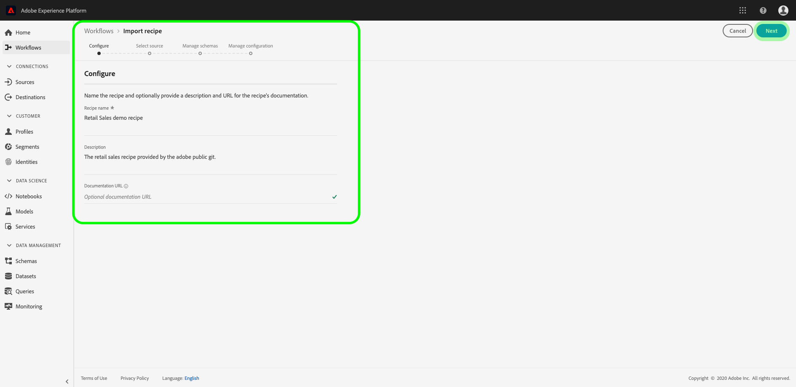

# Creare pacchetti di file sorgente in una ricetta

Questa esercitazione fornisce istruzioni su come creare un pacchetto dei file di origine di esempio Vendite al dettaglio forniti in un file di archivio, che può essere utilizzato per creare una ricetta in Adobe Experience Platform [!DNL Data Science Workspace] seguendo il flusso di lavoro di importazione delle ricette nell&#39;interfaccia utente o utilizzando l&#39;API.

Concetti da comprendere:

- **Ricette**: Una ricetta è un termine Adobe per una specifica di modello ed è un contenitore di livello superiore che rappresenta uno specifico apprendimento automatico, un algoritmo di intelligenza artificiale o un insieme di algoritmi, logica di elaborazione e configurazione necessari per creare ed eseguire un modello addestrato e quindi aiutare a risolvere problemi di business specifici.
- **File** di origine: Singoli file nel progetto che contengono la logica per una ricetta.

## Prerequisiti

- [[!DNL Docker]](https://docs.docker.com/install/#supported-platforms)
- [[!DNL Python 3 and pip]](https://docs.conda.io/en/latest/miniconda.html)
- [[!DNL Scala]](https://www.scala-sbt.org/download.html?_ga=2.42231906.690987621.1558478883-2004067584.1558478883)
- [[!DNL Maven]](https://maven.apache.org/install.html)

## Creazione di ricette

La creazione di ricette inizia con la creazione di pacchetti di file sorgente per creare un file di archivio. I file di origine definiscono la logica di apprendimento automatico e gli algoritmi utilizzati per risolvere un problema specifico a portata di mano e sono scritti in [!DNL Python], R, PySpark o Scala. I file di archivio generati si presentano sotto forma di immagine Docker. Una volta generato, il file di archivio in pacchetto viene importato in [!DNL Data Science Workspace] per creare una ricetta [nell&#39;interfaccia utente](./import-packaged-recipe-ui.md) o [utilizzando l&#39;API](./import-packaged-recipe-api.md).

### Authoring di modelli basato su docker {#docker-based-model-authoring}

Un&#39;immagine Docker consente allo sviluppatore di creare un pacchetto di un&#39;applicazione con tutte le parti necessarie, come librerie e altre dipendenze, e di distribuirlo come un unico pacchetto.

L’immagine Docker creata viene inviata al Registro di sistema del contenitore di Azure utilizzando le credenziali fornite durante il flusso di lavoro di creazione della ricetta.

Per ottenere le credenziali del Registro di sistema del contenitore di Azure, accedi a [Adobe Experience Platform](https://platform.adobe.com). Nella colonna di navigazione a sinistra, passa a **[!UICONTROL Workflows]**. Selezionare **[!UICONTROL Import Recipe]**, quindi selezionare **[!UICONTROL Launch]**. Vedi la schermata sottostante per riferimento.


Viene visualizzata la pagina **[!UICONTROL Configure]** . Fornisci un **[!UICONTROL Recipe Name]** appropriato, ad esempio &quot;Ricetta vendite al dettaglio&quot; e, facoltativamente, fornisci una descrizione o un URL della documentazione. Al termine, fai clic su **[!UICONTROL Next]**.



Seleziona il *Runtime* appropriato, quindi scegli un **[!UICONTROL Classification]** per *Tipo*. Le credenziali del Registro di sistema del contenitore di Azure vengono generate una volta completate.

>[!NOTE]
>
>** Typeis la classe di problema di apprendimento automatico per cui la ricetta è progettata e viene utilizzata dopo l&#39;addestramento per aiutare a personalizzare la valutazione dell&#39;esecuzione dell&#39;addestramento.

>[!TIP]
>
>- Per le ricette [!DNL Python] selezionare il runtime **[!UICONTROL Python]**.
>- Per le ricette R, seleziona il runtime **[!UICONTROL R]** .
>- Per le ricette PySpark, seleziona il runtime **[!UICONTROL PySpark]** . Un tipo di artefatto viene compilato automaticamente.
>- Per le ricette Scala selezionare il runtime **[!UICONTROL Spark]**. Un tipo di artefatto viene compilato automaticamente.


Osserva i valori per l’host Docker, il nome utente e la password. Vengono utilizzati per generare e inviare l’immagine [!DNL Docker] nei flussi di lavoro descritti di seguito.

>[!NOTE]
>
>L’URL sorgente viene fornito dopo aver completato i passaggi descritti di seguito. Il file di configurazione è spiegato nelle esercitazioni successive riportate in [passaggi successivi](#next-steps).

### Creare un pacchetto con i file di origine

Per iniziare, ottieni la base di codice di esempio trovata nell&#39;archivio <a href="https://github.com/adobe/experience-platform-dsw-reference" target="_blank">Experience Platform Data Science Workspace Reference</a> .

- [Crea immagine Piton Docker](#python-docker)
- [Crea immagine Docker R](#r-docker)
- [Crea immagine Docker PySpark](#pyspark-docker)
- [Immagine Docker Scala (Spark)](#scala-docker)

### Genera [!DNL Python] immagine Docker {#python-docker}

Se non lo hai fatto, duplica l’archivio [!DNL GitHub] nel sistema locale con il seguente comando:

```shell
git clone https://github.com/adobe/experience-platform-dsw-reference.git
```

Passa alla directory `experience-platform-dsw-reference/recipes/python/retail`. Qui trovi gli script `login.sh` e `build.sh` utilizzati per accedere a Docker e per creare l&#39;immagine [!DNL Python Docker]. Se disponi delle [credenziali Docker](#docker-based-model-authoring) pronte, immetti i seguenti comandi nell&#39;ordine:

```BASH
# for logging in to Docker
./login.sh
 
# for building Docker image
./build.sh
```

Quando esegui lo script di accesso, devi fornire l’host Docker, il nome utente e la password. Durante la creazione, devi fornire l’host Docker e un tag di versione per la build.

Una volta completato lo script di compilazione, nell’output della console viene assegnato un URL del file di origine Docker. Per questo esempio specifico, avrà un aspetto simile a:

```BASH
# URL format: 
{DOCKER_HOST}/ml-retailsales-python:{VERSION_TAG}
```

Copia questo URL e passa ai [passaggi successivi](#next-steps).

### Genera immagine R [!DNL Docker] {#r-docker}

Se non lo hai fatto, duplica l’archivio [!DNL GitHub] nel sistema locale con il seguente comando:

```BASH
git clone https://github.com/adobe/experience-platform-dsw-reference.git
```

Passa alla directory `experience-platform-dsw-reference/recipes/R/Retail - GradientBoosting` all’interno dell’archivio clonato. Qui trovi i file `login.sh` e `build.sh` che utilizzerai per accedere a Docker e per creare l&#39;immagine di R Docker. Se disponi delle [credenziali Docker](#docker-based-model-authoring) pronte, immetti i seguenti comandi nell&#39;ordine:

```BASH
# for logging in to Docker
./login.sh
 
# for build Docker image
./build.sh
```

Quando esegui lo script di accesso, devi fornire l’host Docker, il nome utente e la password. Durante la creazione, devi fornire l’host Docker e un tag di versione per la build.

Una volta completato lo script di compilazione, nell’output della console viene assegnato un URL del file di origine Docker. Per questo esempio specifico, avrà un aspetto simile a:

```BASH
# URL format: 
{DOCKER_HOST}/ml-retail-r:{VERSION_TAG}
```

Copia questo URL e passa ai [passaggi successivi](#next-steps).

### Crea immagine Docker PySpark {#pyspark-docker}

Inizia clonando l’archivio [!DNL GitHub] sul sistema locale con il seguente comando:

```shell
git clone https://github.com/adobe/experience-platform-dsw-reference.git
```

Passa alla directory `experience-platform-dsw-reference/recipes/pyspark/retail`. Gli script `login.sh` e `build.sh` si trovano qui e vengono utilizzati per accedere a Docker e per creare l’immagine Docker. Se disponi delle [credenziali Docker](#docker-based-model-authoring) pronte, immetti i seguenti comandi nell&#39;ordine:

```BASH
# for logging in to Docker
./login.sh
 
# for building Docker image
./build.sh
```

Quando esegui lo script di accesso, devi fornire l’host Docker, il nome utente e la password. Durante la creazione, devi fornire l’host Docker e un tag di versione per la build.

Una volta completato lo script di compilazione, nell’output della console viene assegnato un URL del file di origine Docker. Per questo esempio specifico, avrà un aspetto simile a:

```BASH
# URL format: 
{DOCKER_HOST}/ml-retailsales-pyspark:{VERSION_TAG}
```

Copia questo URL e passa ai [passaggi successivi](#next-steps).

### Crea immagine Docker Scala {#scala-docker}

Inizia clonando l&#39;archivio [!DNL GitHub] sul sistema locale con il seguente comando nel terminale:

```shell
git clone https://github.com/adobe/experience-platform-dsw-reference.git
```

Quindi, accedi alla directory `experience-platform-dsw-reference/recipes/scala` in cui puoi trovare gli script `login.sh` e `build.sh`. Questi script vengono utilizzati per accedere a Docker e generare l&#39;immagine Docker. Se disponi delle [credenziali Docker](#docker-based-model-authoring) pronte, immetti i seguenti comandi al terminale in ordine:

```BASH
# for logging in to Docker
./login.sh
 
# for building Docker image
./build.sh
```

>[!TIP]
>
>Se ricevi un errore di autorizzazione quando tenti di accedere a Docker utilizzando lo script `login.sh`, prova a utilizzare il comando `bash login.sh`.

Quando esegui lo script di accesso, devi fornire l’host Docker, il nome utente e la password. Durante la creazione, devi fornire l’host Docker e un tag di versione per la build.

Una volta completato lo script di compilazione, nell’output della console viene assegnato un URL del file di origine Docker. Per questo esempio specifico, avrà un aspetto simile a:

```BASH
# URL format: 
{DOCKER_HOST}/ml-retailsales-spark:{VERSION_TAG}
```

Copia questo URL e passa ai [passaggi successivi](#next-steps).

## Passaggi successivi {#next-steps}

Questa esercitazione ha superato il package dei file di origine in una composizione, il passaggio preliminare per l&#39;importazione di una composizione in [!DNL Data Science Workspace]. Ora devi disporre di un’immagine Docker nel Registro di sistema dei contenitori di Azure insieme all’URL dell’immagine corrispondente. Ora puoi iniziare l’esercitazione sull’importazione di una ricetta in pacchetto in [!DNL Data Science Workspace]. Seleziona uno dei collegamenti tutorial seguenti per iniziare:

- [Importare una composizione in pacchetto nell’interfaccia utente](./import-packaged-recipe-ui.md)
- [Importare una composizione in pacchetto utilizzando l’API](./import-packaged-recipe-api.md)
