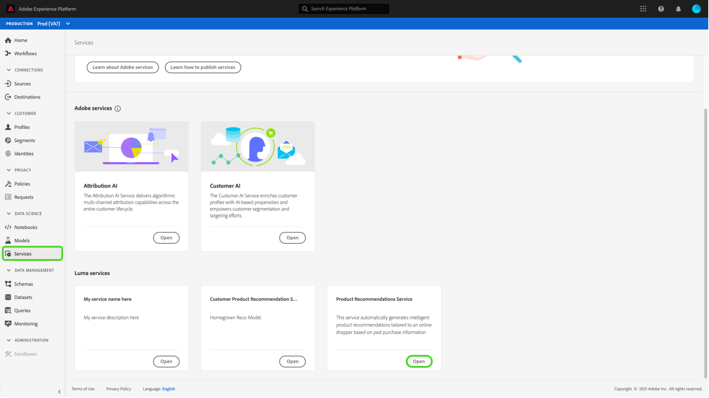
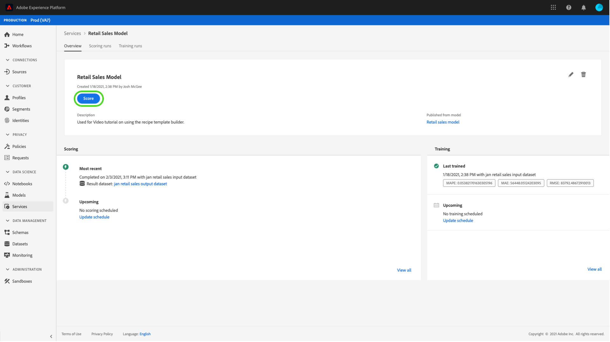

# Pubblicare un modello come servizio nell’interfaccia utente di Data Science Workspace

Adobe Experience Platform Data Science Workspace consente di pubblicare il modello come servizio addestrato e valutato, consentendo agli utenti della tua organizzazione IMS di valutare i dati senza dover creare i propri modelli.

## Introduzione

Per completare questa esercitazione, devi avere accesso a [!DNL Experience Platform]. Se non hai accesso a un’organizzazione IMS in [!DNL Experience Platform], contattare l&#39;amministratore di sistema prima di procedere.

Questo tutorial richiede un modello esistente con un’esecuzione di apprendimento corretta. Se non disponi di un modello pubblicabile, segui la [Addestra e valuta un modello nell’interfaccia utente](./train-evaluate-model-ui.md) prima di continuare.

Se preferisci pubblicare un modello utilizzando le API di apprendimento automatico di Sensei, consulta [Esercitazione API](./publish-model-service-api.md).

## Pubblicare un modello {#publish-a-model}

In Adobe Experience Platform, seleziona **[!UICONTROL Modelli]** nella colonna di navigazione a sinistra, quindi seleziona la **[!UICONTROL Sfoglia]** per elencare tutti i modelli esistenti. Seleziona il nome del modello da pubblicare come servizio.

Seleziona **[!UICONTROL Pubblica]** in alto a destra nella pagina di panoramica del modello per avviare un processo di creazione di un servizio.

Immettere un nome desiderato per il servizio e, facoltativamente, fornire una descrizione del servizio, selezionare **[!UICONTROL Successivo]** al termine.

Sono elencate tutte le esecuzioni di addestramento riuscite per il modello. Il nuovo Servizio erediterà le configurazioni di formazione e punteggio dall’esecuzione di formazione selezionata.

Seleziona **[!UICONTROL Fine]** per creare il Servizio e reindirizzare a **[!UICONTROL Raccolta servizi]** per mostrare tutti i servizi disponibili, incluso il servizio appena creato.

## Punteggio tramite un servizio {#access-a-service}

In Adobe Experience Platform, seleziona la **[!UICONTROL Servizi]** nella colonna di navigazione a sinistra per accedere al **[!UICONTROL Raccolta servizi]**. Individuare il servizio che si desidera utilizzare e selezionare **[!UICONTROL Apri]**.

Nella pagina di panoramica del servizio, seleziona **[!UICONTROL Punteggio]**.

Seleziona un set di dati di input appropriato per l’esecuzione del punteggio, quindi seleziona **[!UICONTROL Successivo]**. Ti viene chiesto di eseguire lo stesso passaggio per il set di dati di punteggio. Dopo aver selezionato il set di dati di input e di output, puoi aggiornare le configurazioni.

Quando viene creato, un servizio eredita le configurazioni di punteggio predefinite. Puoi rivedere queste configurazioni e regolarle in base alle esigenze facendo doppio clic sui valori. Una volta ottenute le configurazioni desiderate, seleziona **[!UICONTROL Fine]** per iniziare l’esecuzione del punteggio.

Sul sito del servizio **Panoramica** pagina, vengono visualizzati i dettagli del nuovo processo di punteggio e il relativo avanzamento. Al termine del processo, il **[!UICONTROL Più recente]** intestazione all&#39;interno del **[!UICONTROL Punteggio]** il contenitore è stato aggiornato.

## Passaggi successivi {#next-steps}

Seguendo questa esercitazione, hai pubblicato correttamente un modello come servizio accessibile e hai assegnato un punteggio ai dati utilizzando il nuovo servizio tramite il [!UICONTROL Raccolta servizi]. Procedi al tutorial successivo per scoprire come puoi [pianificare l’esecuzione automatica di formazione e punteggio in un servizio](./schedule-models-ui.md).
