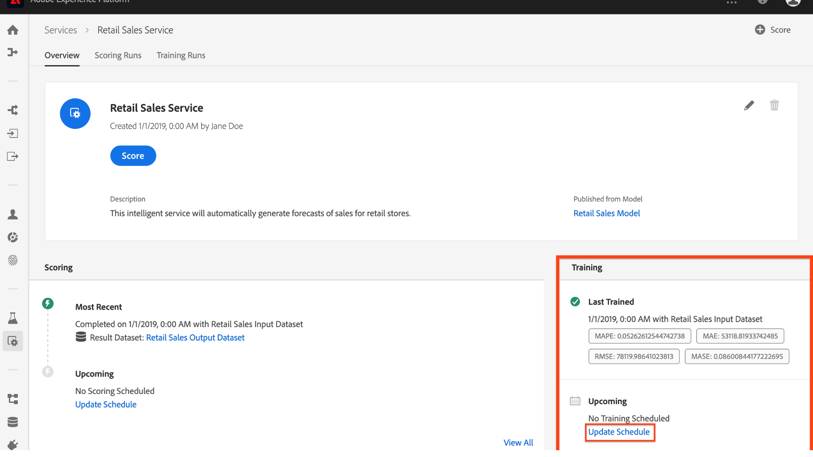
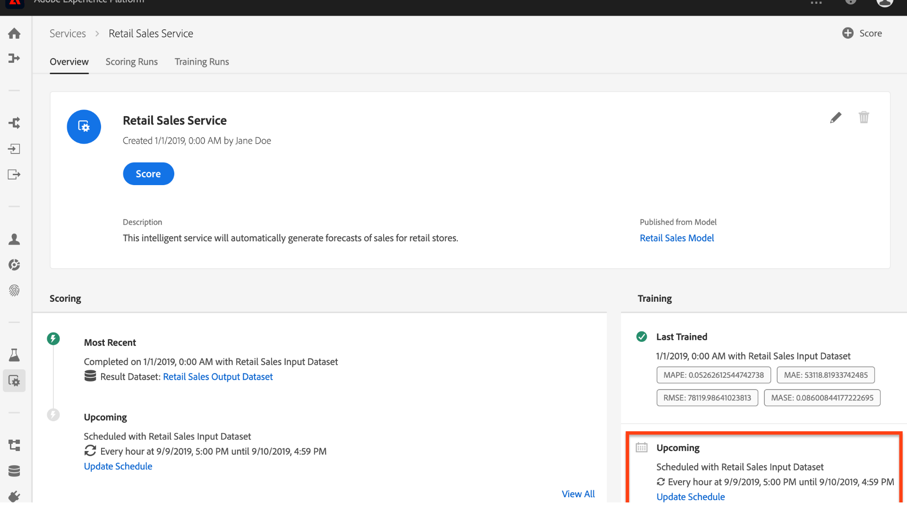

# Pianificazione di un modello (interfaccia utente)

 Adobe Experience Platform [!DNL Data Science Workspace] consente di impostare l&#39;esecuzione programmata di punteggi e corsi di formazione su un servizio di machine learning. Automatizzare il processo di formazione e valutazione può contribuire a mantenere e migliorare l&#39;efficienza del servizio nel tempo, tenendo al passo con i pattern all&#39;interno dei dati.

Questa esercitazione illustra i passaggi necessari per configurare le pianificazioni di formazione e assegnazione dei punteggi per un servizio esistente tramite *[!UICONTROL Service Gallery]*. È suddiviso nelle seguenti sezioni principali:

- [Configurare il punteggio pianificato](#configure-scheduled-scoring)
- [Configurare la formazione pianificata](#configure-scheduled-training)

## Introduzione

Per completare questa esercitazione, è necessario avere accesso a [!DNL Experience Platform]. Se non disponete dell&#39;accesso a un&#39;organizzazione IMS in [!DNL Experience Platform], rivolgetevi all&#39;amministratore di sistema prima di procedere.

Questa esercitazione richiede un servizio esistente. Se non disponete di un servizio accessibile con cui lavorare, potete crearne uno seguendo l&#39;esercitazione [Pubblica il modello come servizio nell&#39;interfaccia utente](./publish-model-service-ui.md) .

## Configurare il punteggio pianificato {#configure-scheduled-scoring}

Il punteggio del modello può essere configurato in modo da essere automatizzato su base programmata. Una volta creato il servizio, puoi seguire i passaggi descritti di seguito per configurare e applicare una pianificazione del punteggio:

1. In  Adobe Experience Platform, fate clic sulla **[!UICONTROL Services]** scheda situata nella colonna di navigazione a sinistra per accedere al *[!DNL Service Gallery]*. Trova il servizio su cui desideri pianificare le esecuzioni dei punteggi e fai clic **[!UICONTROL Open]** per visualizzarne la pagina *Panoramica* .
   

2. Nella pagina Panoramica sono visualizzate le informazioni relative al punteggio del servizio. Fate clic sul **[!UICONTROL Update Schedule]** collegamento per configurare una pianificazione del punteggio.
   

3. Configura la frequenza, la data di inizio, la data di fine, il dataset di input e il dataset di output per la pianificazione del punteggio. Una volta completate le configurazioni, fare clic su **[!UICONTROL Create]** per aggiornare la pianificazione del punteggio del Servizio.
   

4. La pianificazione aggiornata del punteggio viene visualizzata nella pagina *Panoramica* del servizio.
   

## Configurare la formazione pianificata {#configure-scheduled-training}

La configurazione delle esecuzioni di formazione pianificate su un servizio assicura che il modello di apprendimento automatico venga aggiornato ai pattern di dati più recenti. Ogni volta che viene completata un&#39;esecuzione di formazione pianificata, il modello di formazione risultante viene utilizzato per alimentare il Servizio fino all&#39;esecuzione di formazione pianificata successiva.

Una volta creato il servizio, potete seguire i passaggi descritti di seguito per configurare e applicare un programma di formazione:

1. In  Adobe Experience Platform, fate clic sulla **[!UICONTROL Services]** scheda situata nella colonna di navigazione a sinistra per accedere al *[!UICONTROL Service Gallery]*. Individuate il servizio sul quale desiderate pianificare l&#39;esecuzione della formazione e fate clic **[!UICONTROL Open]** per visualizzarne la pagina *Panoramica* .
   

2. Nella pagina Panoramica sono visualizzate le informazioni di formazione del Servizio. Fate clic sul **[!UICONTROL Update Schedule]** collegamento per configurare una pianificazione della formazione.
   

3. Configurate la frequenza, la data di inizio, la data di fine e il set di dati di input utilizzati per la pianificazione della formazione. Una volta completate le configurazioni, fate clic su **[!UICONTROL Create]** per aggiornare la pianificazione della formazione del Servizio.
   

4. La pianificazione della formazione aggiornata viene visualizzata nella pagina *Panoramica* del servizio.
   

## Passaggi successivi

Seguendo questa esercitazione, hai pianificato con successo l’esecuzione di formazione e punteggi automatizzati su un servizio e hai completato il flusso di lavoro dell’interfaccia utente [!DNL Data Science Workspace] dell’esercitazione. Se non lo avete ancora fatto, provate a [riavviare l&#39;esercitazione](./create-retails-sales-dataset.md) e seguite il flusso di lavoro API per creare, formare, valutare e pubblicare un modello.
