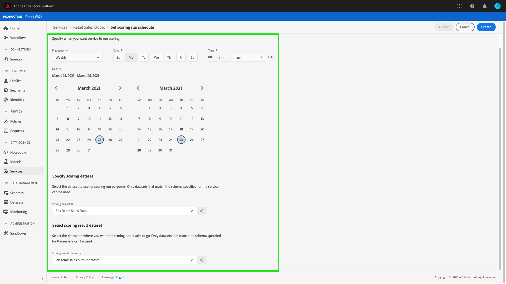

# Pianificare un modello nell’interfaccia utente di Data Science Workspace

Adobe Experience Platform [!DNL Data Science Workspace] consente di impostare il punteggio pianificato e le esecuzioni di formazione su un servizio di apprendimento automatico. L’automazione del processo di formazione e valutazione consente di mantenere e migliorare l’efficienza di un servizio nel tempo, tenendo il passo con i modelli all’interno dei dati.

Questo tutorial illustra i passaggi necessari per configurare le pianificazioni di formazione e punteggio su un servizio esistente tramite la [!UICONTROL Galleria servizi]. È suddiviso nelle seguenti sezioni principali:

- [Configurare il punteggio pianificato](#configure-scheduled-scoring)
- [Configurare l’apprendimento pianificato](#configure-scheduled-training)

## Introduzione

Per completare questa esercitazione, devi avere accesso a [!DNL Experience Platform]. Se non si dispone dell&#39;accesso a un&#39;organizzazione in [!DNL Experience Platform], contattare l&#39;amministratore di sistema prima di procedere.

Questo tutorial richiede un servizio esistente. Se non si dispone di un servizio accessibile con cui lavorare, è possibile crearne uno seguendo l&#39;esercitazione per [pubblicare un modello come servizio](./publish-model-service-ui.md).

## Configurare il punteggio pianificato {#configure-scheduled-scoring}

Il punteggio modello può essere configurato per essere un processo automatizzato su base pianificata. Dopo aver creato un servizio, puoi seguire i passaggi seguenti per configurare e applicare una pianificazione di punteggio:

In Adobe Experience Platform, selezionare la scheda **[!UICONTROL Servizi]** nella colonna di navigazione a sinistra per accedere a **[!DNL Service Gallery]**. Trova il servizio su cui vuoi pianificare l&#39;esecuzione del punteggio e seleziona **[!UICONTROL Apri]** per visualizzarne la pagina **[!UICONTROL Panoramica]**.

Nella pagina Panoramica vengono visualizzate le informazioni sul punteggio del servizio. Seleziona il collegamento **[!UICONTROL Aggiorna pianificazione]** per configurare una pianificazione di punteggio.

Configura la frequenza, la data di inizio, la data di fine, il set di dati di input e il set di dati di output per la pianificazione di punteggio. Una volta completate le configurazioni, selezionare **[!UICONTROL Crea]** per aggiornare la pianificazione del punteggio del servizio.

La pianificazione del punteggio aggiornata viene visualizzata nella pagina **[!UICONTROL Panoramica]** del servizio.

## Configurare l’apprendimento pianificato {#configure-scheduled-training}

La configurazione delle esecuzioni pianificate dell’apprendimento su un servizio assicura che il modello di apprendimento automatico sia aggiornato ai pattern di dati più recenti. Al termine di un addestramento pianificato, il modello addestrato risultante viene utilizzato per alimentare il servizio fino alla successiva esecuzione di addestramento pianificata.

Dopo aver creato un servizio, puoi seguire i passaggi seguenti per configurare e applicare una pianificazione di formazione:

In Adobe Experience Platform, seleziona la scheda **[!UICONTROL Servizi]** nella colonna di navigazione a sinistra per accedere alla **[!UICONTROL Raccolta servizi]**. Trova il servizio su cui vuoi pianificare l&#39;esecuzione del corso di formazione e seleziona **[!UICONTROL Apri]** per visualizzarne la pagina **[!UICONTROL Panoramica]**.

Nella pagina Panoramica vengono visualizzate le informazioni sulla formazione del servizio. Seleziona il collegamento **[!UICONTROL Aggiorna pianificazione]** per configurare una pianificazione di formazione.

Configura la frequenza, la data di inizio, la data di fine e il set di dati di input utilizzati per la pianificazione dell’apprendimento. Una volta completate le configurazioni, selezionare **[!UICONTROL Crea]** per aggiornare la pianificazione di formazione del servizio.

La pianificazione aggiornata dei corsi di formazione è visualizzata nella pagina **[!UICONTROL Panoramica]** del servizio.

## Passaggi successivi

Seguendo questa esercitazione, hai pianificato le esecuzioni automatizzate di formazione e punteggio in un servizio e hai completato il flusso di lavoro dell&#39;interfaccia utente dell&#39;esercitazione [!DNL Data Science Workspace]. Se non lo hai già fatto, prova a [riavviare l&#39;esercitazione](./create-retails-sales-dataset.md) e segui il flusso di lavoro API per creare, addestrare, valutare e pubblicare un modello.
